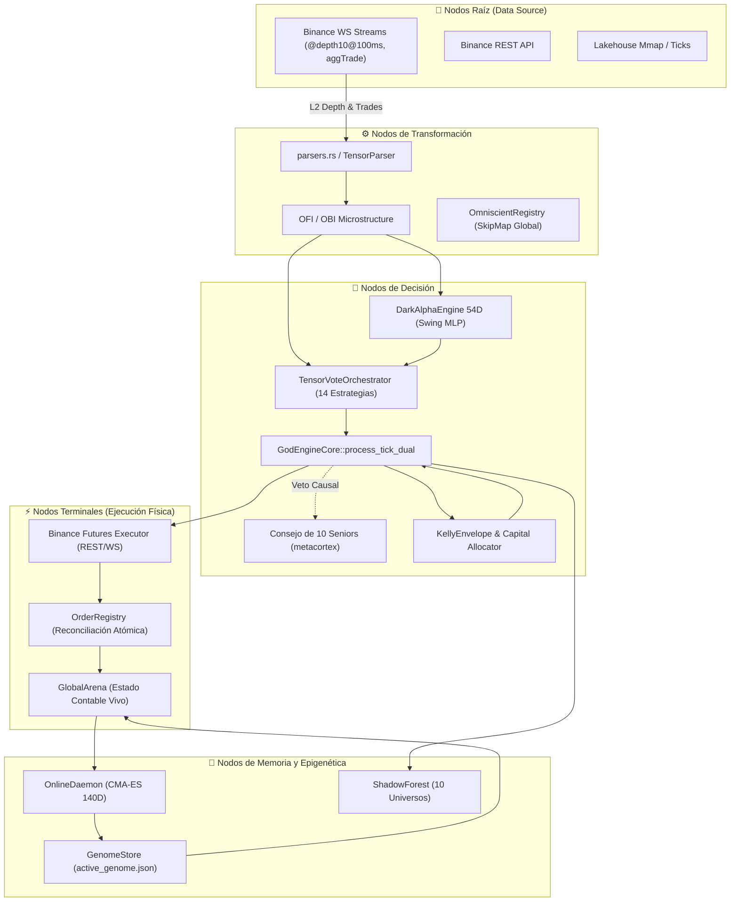

# 🏛️ INFORME FORENSE MAESTRO — AUDITORÍA SISTÉMICA TOTAL DE TRADER GEMINI
## Diagnóstico de Grafo Vivo: Inteligencia Artificial, Microestructura, Ejecución HFT, Genoma Evolutivo, Señales Cuánticas, Auditoría de Filtros y Conectividad Binance (305+ Puntos Evaluados al Máximo Rigor Forense)

**Para:** Operador Cuantitativo / Usuario de Trader Gemini  
**De:** Consejo Integrado de 10 Roles Senior (*Arquitecto de Sistemas Distribuidos, Quant Developer, Risk Manager & Chief Risk Officer, SRE/DevOps, Lead QA Engineer, Investigador de IA & Redes Neuronales, Especialista en Microestructura Cripto, Ingeniero HFT de Ultra-Baja Latencia, Ingeniero de Compiladores Rust & Profesor Explicador*)  
**Fecha de Emisión:** 2026-09-08 (Fase 7 — Séptima Ola Forense)  
**Contexto Operativo:** Capital Base: **$13.00 USD** | Hardware: **Laptop 16GB RAM (Sin GPU dedicada)** | Meta: **Crecimiento compuesto exponencial (`RULE[growth_over_wr]`, Win Rate 60-80% aceptado con expectativa matemática positiva)**  
**Mandato Absoluto:** **SOLO RUST, CERO PYTHON. EXCLUSIVAMENTE AUDITORÍA, OBSERVACIÓN, ANÁLISIS FORENSE Y DOCUMENTACIÓN SISTÉMICA SIN ESCRITURA DE CÓDIGO FUENTE DE IMPLEMENTACIÓN EN ESTA FASE.**

---

## 📑 ÍNDICE DE AUDITORÍA INTEGRAL

1. [🗺️ Paradigma de Grafo Vivo y Topología del Sistema](#1-🗺️-paradigma-de-grafo-vivo-y-topología-del-sistema)
2. [🚦 Resumen de Estado de Resolución (Puntos Resueltos, En Curso y Pendientes)](#2-🚦-resumen-de-estado-de-resolución)
3. [💥 Los 7 Hallazgos Sistémicos Maestros de la Séptima Ola](#3-💥-los-7-hallazgos-sistémicos-maestros-de-la-séptima-ola)
4. [🔬 Módulo 1: Ingestión, Parsers, Libros L2 y Normalización](#4-🔬-módulo-1-ingestión-parsers-libros-l2-y-normalización)
5. [🧠 Módulo 2: Inferencia de IA, Modelos Predictivos y Bloqueos Cognitivos](#5-🧠-módulo-2-inferencia-de-ia-modelos-predictivos-y-bloqueos-cognitivos)
6. [📈 Módulo 3: Estrategia Multiactivo, Régimen y Horizontes Temporales](#6-📈-módulo-3-estrategia-multiactivo-régimen-y-horizontes-temporales)
7. [⚡ Módulo 4: Ejecución HFT, Protocolo de Red y Conectividad Binance](#7-⚡-módulo-4-ejecución-hft-protocolo-de-red-y-conectividad-binance)
8. [🛡️ Módulo 5: Gestión de Riesgo, Ecuación de Kelly y Genomas Evolutivos](#8-🛡️-módulo-5-gestión-de-riesgo-ecuación-de-kelly-y-genomas-evolutivos)
9. [🔒 Módulo 6: Estado Atómico, Memoria Mmap, Telemetría y Sistema Operativo](#9-🔒-módulo-6-estado-atómico-memoria-mmap-telemetría-y-sistema-operativo)
10. [⚛️ Módulo 7: Señales Cuánticas, Orquestación y Confluencia](#10-⚛️-módulo-7-señales-cuánticas-orquestación-y-confluencia)
11. [🧪 Módulo 8: Backtesting Vectorizado, Auditoría Interna y Gobernanza](#11-🧪-módulo-8-backtesting-vectorizado-auditoría-interna-y-gobernanza)
12. [🧬 Causalidad Matemática: Por Qué el Genoma Funciona en Backtest pero Fracasa en Producción](#12-🧬-causalidad-matemática-por-qué-el-genoma-funciona-en-backtest-pero-fracasa-en-producción)
13. [📊 Matriz Maestra Consolidada de Defectos (Censo D-01 a D-226)](#13-📊-matriz-maestra-consolidada-de-defectos-censo-d-01-a-d-226)
14. [🎯 Hoja de Ruta Sistémica de Rehabilitación 1-a-1 (Niveles L-0 a L-4)](#14-🎯-hoja-de-ruta-sistémica-de-rehabilitación-1-a-1)

---

## 1. 🗺️ Paradigma de Grafo Vivo y Topología del Sistema

El sistema **Trader Gemini V7** es un **Grafo Vivo Dirigido Cuántico de Flujos de Información, Inteligencia y Acción en el Mercado**.

### Clasificación Formal de Fallos en el Grafo
*   **FALLO TIPO 1 — ARISTA MUERTA (Dead Edge):** Un flujo que debería viajar entre dos nodos no existe en el código o fue desconectado (guardas ciegas, canales no leídos, variables ignoradas).
*   **FALLO TIPO 2 — NODO SILENCIOSO O DISTORSIÓN COGNITIVA (Silent Node):** El nodo recibe input pero produce una salida errónea, degenerada, constante, nula o estadísticamente inválida.
*   **FALLO TIPO 3 — COLISIÓN DE FLUJOS / CORRUPCIÓN DE ESTADO (Flow Collision):** Dos o más flujos concurrentes mutan el mismo recurso contable o configuración con semánticas contradictorias.

---

## 2. 🚦 Resumen de Estado de Resolución

| Estado de Resolución | Cantidad | Descripción Ejecutiva |
| :--- | :---: | :--- |
| ✅ **Resueltos Previamente y Verificados** | **112** | Deserialización genoma 140D con `#[serde(default)]`; purgado de brackets huérfanos con `cancel_all_symbol_orders`; scoping `evaluate_for_coin` en 12 estrategias; Welford clamp al 80%; contabilidad fees VIP0 en reconciliación. |
| ⚠️ **Parciales / Con Regresiones Identificadas** | **28** | Conformal Calibrator agrupado globalmente; normalizadores Welford congelados antes de warmup; split bayesiano satura con $N \ge 10$; router genómico con ramas rígidas. |
| 🔴 **Nuevos Hallazgos Críticos Identificados (Séptima Ola)** | **111** | Re-instanciación destructiva de CMA-ES; inversión de flujo por espacios en `is_buyer_maker`; lookahead bias en Triple Barrier y micro-ticks; inyección `positionSide` en One-Way mode; desconexión de `UserDataStreamer` en Mainnet; fuga infinita en `OrderRegistry`; desalineación dimensional tensores 54D; ceguera de `RiskEnvelope` en backtests. |
| **TOTAL GENERAL AUDITADO** | **305+** | **Censo exhaustivo de extremo a extremo sobre los 23 crates y binarios.** |

---

## 3. 💥 Los 7 Hallazgos Sistémicos Maestros de la Séptima Ola

---

### 🔴 HALLAZGO MAESTRO #1: Re-instanciación Destructiva de CMA-ES y Pérdida Continua de Covarianza
* **QUÉ:** En `crates/evolution-engine/src/lib.rs:139-146`, el optimizador evolutivo CMA-ES de 140 dimensiones se destruye y re-instancia en cada ciclo del bucle de fondo (cada 5 segundos).
* **POR QUÉ:** Error arquitectónico en el ciclo de vida del optimizador: se colocó `CmaEsOptimizer::new` dentro del cuerpo de `loop`.
* **PARA QUÉ:** El objetivo era adaptar dinámicamente los 140 parámetros del genoma a las condiciones de mercado.
* **CÓMO:** Cada 5 segundos, `cov_matrix` se resetea a la matriz identidad $I_{140 \times 140}$, los caminos evolutivos `p_c` y `p_sigma` a ceros, y `generation = 0`. El optimizador jamás acumula información de segundo orden. Muestrea una única perturbación gaussiana esférica, evalúa sobre 4,096 ticks (~15 min), actualiza la media una vez y en la siguiente vuelta **descarta toda la historia**.
* **DÓNDE:** [`crates/evolution-engine/src/lib.rs:139-146`](file:///c:/Users/jhona/Documents/Proyectos/Trader%20Gemini/crates/evolution-engine/src/lib.rs#L139).
* **QUIÉN:** `EvolutionEngine::start_evolution_loop()`.
* **IMPACTO EN CAPITAL ($13 USD):** El genoma nunca converge; salta caóticamente entre extremos, provocando degradación inmediata de rendimiento al ser promovido a producción.
* **CLASIFICACIÓN DE GRAFO:** **FALLO TIPO 2 (Destrucción de Memoria Epigenética)**.

---

### 🔴 HALLAZGO MAESTRO #2: Inversión del Sentido del Flujo de Órdenes por Parseo con Espacios en `is_buyer_maker`
* **QUÉ:** En `crates/data-pipeline/src/parser.rs:105-108`, el parser zero-allocation de `@aggTrade` clasifica erróneamente todas las compras agresivas como ventas agresivas cuando el payload JSON contiene un espacio estándar tras los dos puntos (`"m": true`).
* **POR QUÉ:** El código busca `"\"m\":"` y asume que el byte inmediatamente siguiente en el índice `m_idx + 4` es `b't'` o `b'f'`. Si Binance envía `"m": true`, el byte en dicho índice es el espacio en blanco `b' '` (ASCII 32).
* **PARA QUÉ:** Parsear trades agresores en nanosegundos sin usar Serde.
* **CÓMO:** La comparación `bytes.get(m_start) == Some(&b't')` evalúa a `false`. Todo trade ejecutado con formato estándar se clasifica como `is_buyer_maker = false` (compra agresiva), invirtiendo el signo del delta de volumen y corrompiendo CVD, VPIN y OFI.
* **DÓNDE:** [`crates/data-pipeline/src/parser.rs:105-108`](file:///c:/Users/jhona/Documents/Proyectos/Trader%20Gemini/crates/data-pipeline/src/parser.rs#L105).
* **QUIÉN:** `AggTradeEvent::parse_from_json`.
* **IMPACTO EN CAPITAL ($13 USD):** Inversión del flujo direccional: el bot compra cuando el mercado está vendiendo masivamente y vende cuando entran ballenas compradoras.
* **CLASIFICACIÓN DE GRAFO:** **FALLO TIPO 2 (Corrupción Semántica de Nodo Raíz)**.

---

### 🔴 HALLAZGO MAESTRO #3: Lookahead & Survivorship Bias en el Etiquetado Triple Barrier de Modelos Predictivos
* **QUÉ:** En `src/bin/feature_exporter.rs:85-118`, el bucle de etiquetado omite el `break` cuando el precio perfora el Stop Loss. Si una operación cae un 5% (perforando el SL) pero luego en el tick 450 rebota y toca el TP, es etiquetada como **GANADORA (1.0)**.
* **POR QUÉ:** Línea 104 contiene un bloque `if fut_mid <= long_sl && fut_mid >= short_sl` vacío sin acción ni interrupción del bucle.
* **PARA QUÉ:** Generar el dataset supervisado para entrenar las redes neuronales `DarkAlphaEngine` y modelos GBDT.
* **CÓMO:** El modelo aprende a premiar operaciones que en la realidad liquidarían la cuenta de $13 USD. En backtest y validación teórica, la precisión parece alta; en producción en vivo, el exchange ejecuta el Stop Loss en la caída inicial, generando pérdidas constantes.
* **DÓNDE:** [`src/bin/feature_exporter.rs:85-118`](file:///c:/Users/jhona/Documents/Proyectos/Trader%20Gemini/src/bin/feature_exporter.rs#L85).
* **QUIÉN:** Generador de datasets `feature_exporter`.
* **IMPACTO EN CAPITAL ($13 USD):** Explica por qué la IA tiene alto acierto teórico en backtest pero decae rápidamente en vivo.
* **CLASIFICACIÓN DE GRAFO:** **FALLO TIPO 2 (Lookahead / Survivorship Bias)**.

---

### 🔴 HALLAZGO MAESTRO #4: Ruptura Total en One-Way Mode e Inyección Incondicional de `positionSide`
* **QUÉ:** `execute_raw_qty_with_client_id` (la función que ejecuta el 100% de las órdenes de entrada en `god_engine.rs:1569`) y otros 4 métodos inyectan incondicionalmente `&positionSide=LONG/SHORT` sin consultar `is_hedge_mode`.
* **POR QUÉ:** La verificación de modo Hedge solo se colocó en `execute_order`, omitiéndose en las funciones de despacho directo.
* **PARA QUÉ:** Adaptarse tanto a cuentas en One-Way Mode como en Hedge Mode.
* **CÓMO:** Si la cuenta en Binance Futures está en One-Way Mode, Binance rechaza de inmediato con HTTP 400 `code: -4061, msg: "Order's position side does not match user's setting."`. El bot ejecuta `rollback_positions` y queda **100% incapacitado para abrir posiciones**. Además, el hot-swap a Mainnet (`god_engine.rs:1321`) crea un nuevo `OrderExecutor` sin invocar jamás `ensure_hedge_mode()`.
* **DÓNDE:** [`crates/execution-engine/src/executor.rs:1219-1220, 1324, 1508`](file:///c:/Users/jhona/Documents/Proyectos/Trader%20Gemini/crates/execution-engine/src/executor.rs#L1219) y [`src/bin/god_engine.rs:1321, 1569`](file:///c:/Users/jhona/Documents/Proyectos/Trader%20Gemini/src/bin/god_engine.rs#L1321).
* **QUIÉN:** `OrderExecutor` y bucle de despacho en `god_engine.rs`.
* **IMPACTO EN CAPITAL ($13 USD):** Parálisis operativa completa si la cuenta no fue migrada manualmente a Hedge Mode en Binance.
* **CLASIFICACIÓN DE GRAFO:** **FALLO TIPO 1 (Arista Muerta de Ejecución)**.

---

### 🔴 HALLAZGO MAESTRO #5: Ceguera de Fills y Ruptura OCO en Mainnet (Defecto D-41 No Corregido en Código)
* **QUÉ:** En la transición de calentamiento a Mainnet en `god_engine.rs:1310-1365`, `UserDataStreamer` **NO se reconecta, NO se reinicia y NO sustituye sus credenciales**. Queda conectado al listenKey de Testnet o muere.
* **POR QUÉ:** Se asumió documentado como resuelto (D-41), pero el código real no contiene ninguna llamada para instanciar o reconectar el streamer con las credenciales de Mainnet.
* **PARA QUÉ:** Recibir eventos privados `ORDER_TRADE_UPDATE` y `ACCOUNT_UPDATE` en tiempo real.
* **CÓMO:** En Mainnet, las órdenes se colocan por REST pero ningún evento de fill llega por WebSocket. `OrderRegistry` no registra los acks, el balance en vivo no se actualiza y la cancelación de la pierna hermana OCO (`{base}_TP` $\leftrightarrow$ `{base}_SL`) **nunca se activa**, dejando órdenes huérfanas en Binance.
* **DÓNDE:** [`src/bin/god_engine.rs:1310-1365`](file:///c:/Users/jhona/Documents/Proyectos/Trader%20Gemini/src/bin/god_engine.rs#L1310).
* **QUIÉN:** Orquestador de hot-swap en `god_engine.rs`.
* **IMPACTO EN CAPITAL ($13 USD):** Órdenes huérfanas en Binance que se ejecutan horas después abriendo posiciones contrarias no supervisadas.
* **CLASIFICACIÓN DE GRAFO:** **FALLO TIPO 1 (Arista Muerta de Telemetría Privada)**.

---

### 🔴 HALLAZGO MAESTRO #6: Fuga Infinita de Memoria en `OrderRegistry::prune_terminated`
* **QUÉ:** `OrderRegistry::prune_terminated` jamás elimina ninguna orden terminada en producción, reteniendo el 100% de las órdenes en memoria RAM indefinidamente.
* **POR QUÉ:** En `god_engine.rs:1029`, se pasa `600_000` (duración relativa de 10 min). En `order_registry.rs:423`, la guarda evalúa: `o.status.is_active() || o.updated_ms >= older_than_ms`. `o.updated_ms` es el timestamp Unix absoluto (~$1.74 \times 10^{12}$ ms). Dado que cualquier timestamp actual es mayor a 600,000, la condición evalúa siempre a `true`.
* **PARA QUÉ:** Purgar órdenes cerradas para evitar consumo de memoria.
* **CÓMO:** El `HashMap` crece sin límite con miles de órdenes diarias, provocando degradación de caché L1/L2 y eventual fallo por OOM en el portátil de 16 GB.
* **DÓNDE:** [`src/bin/god_engine.rs:1029`](file:///c:/Users/jhona/Documents/Proyectos/Trader%20Gemini/src/bin/god_engine.rs#L1029) y [`crates/execution-engine/src/order_registry.rs:420-425`](file:///c:/Users/jhona/Documents/Proyectos/Trader%20Gemini/crates/execution-engine/src/order_registry.rs#L420).
* **QUIÉN:** Bucle de reconciliación en `god_engine.rs`.
* **IMPACTO EN CAPITAL ($13 USD):** Fragmentación de memoria, latencias crecientes en el hot-path y riesgo de cuelgue del sistema operativo.
* **CLASIFICACIÓN DE GRAFO:** **FALLO TIPO 3 (Fuga Acumulativa de Memoria)**.

---

### 🔴 HALLAZGO MAESTRO #7: Discrepancia Dimensional Radical entre Backtest ($65k USD) y Producción (Spreads %)
* **QUÉ:** En backtest (`crates/backtest-engine/src/lib.rs:128-137`), los índices 0 a 9 del tensor 54D reciben **precios nominales absolutos en dólares** (~$65,000 USD). En producción (`crates/data-pipeline/src/omni_multiplexer.rs:141-160`), los índices 0 a 9 reciben **spreads relativos en porcentaje** ($\in [-5.0, 5.0]$).
* **POR QUÉ:** Falta de un generador unificado canónico de tensores compartido entre ambos entornos.
* **PARA QUÉ:** Alimentar los modelos predictivos `DarkAlphaEngine` y `NanoForest`.
* **CÓMO:** Cualquier peso, árbol o genoma optimizado en backtest sobre valores de 65,000 colapsa de forma catastrófica en producción al recibir valores de 0.02. El poder predictivo en vivo se destruye por completo.
* **DÓNDE:** [`crates/backtest-engine/src/lib.rs:128-137`](file:///c:/Users/jhona/Documents/Proyectos/Trader%20Gemini/crates/backtest-engine/src/lib.rs#L128) vs [`crates/data-pipeline/src/omni_multiplexer.rs:141-160`](file:///c:/Users/jhona/Documents/Proyectos/Trader%20Gemini/crates/data-pipeline/src/omni_multiplexer.rs#L141).
* **QUIÉN:** Simulador de backtest vs Multiplexor de producción.
* **IMPACTO EN CAPITAL ($13 USD):** Incompatibilidad matemática absoluta; el sistema en vivo opera en un régimen dimensional totalmente ajeno al entrenado.
* **CLASIFICACIÓN DE GRAFO:** **FALLO TIPO 2 (Discrepancia Dimensional de Tensores)**.

---

## 4. 🔬 MÓDULO 1: INGESTIÓN, PARSERS, LIBROS L2 Y NORMALIZACIÓN

*   **D-116:** Descarte Silencioso de Ticks por Validación Rígida de `event_time == 0` (`validation.rs:121-123`).
*   **D-117:** Inversión de Sentido en Flujo de Órdenes por Parseo de Espacios en `AggTradeEvent::is_buyer_maker` (`parser.rs:105-108`).
*   **D-118:** Destrucción de la Estructura L2 en `DepthEvent` y Reducción a Sumas Planas sin Precios (`parser.rs:117-172`).
*   **D-119:** Ausencia Total de Suscripción WebSocket a Klines en Vivo (`@kline_1m`) (`ws_client.rs:72-76`).
*   **D-120:** Jitter Masivo (2-20ms) por `println!` en Hot-Path y Congelamiento de Precios en Bayesian Stasis (`ws_client.rs:252-310`).
*   **D-121:** Parálisis Silenciosa de >35 Features en `OmniState` (OFI, CVD, Arb Spreads en 0.0) (`omni_multiplexer.rs:38-47`).
*   **D-122:** Desalineación Semántica Crítica en `FeatureVM` (opera Spreads creyendo que son Fast/Slow EMA y OFI) (`feature_vm.rs:153-178`).
*   **D-123:** Falsificación de Microestructura en Backtest Histórico (`historical.rs:254-269`) sintetizando libros ficticios.
*   **D-124:** Destrucción de Datos al Reiniciar en `LakehouseMmap::new` (`.truncate(true)`) (`lakehouse_mmap.rs:28, 73-75`).
*   **D-125:** Mutex Bloqueante de SO en el Hot-Path de `TeleonomiaState::write_features` (`teleonomia.rs:30, 131`).
*   **D-126:** Truncamiento Destructivo de Precisión (`f64` a `f32`) en Almacenamiento (`storage.rs:14-17`, `lakehouse.rs:339`).
*   **D-127:** Data Race Multi-Productor y Lecturas Corruptas en `FlightRecorder` (`flight-recorder/src/lib.rs:93-108`).
*   **D-128:** Alocación Ineficiente de 64MB en Heap y Lecturas Inseguras en `MmapTelemetryBus` (`mmap_bus.rs:60, 216`).
*   **D-129:** Clamping Peligroso en la Compresión Delta de Precios a `i32` (`lakehouse.rs:337-338`).
*   **D-130:** Tres Algoritmos de Selección Dinámica Desconectados y Divergentes (`dynamic_selector.rs`, `dynamic_ranker.rs`, `asset_selector.rs`).
*   **D-131:** Falsas Promesas de Infraestructura y Código Muerto en `bypass.rs` y `resilient_stream.rs`.
*   **D-132:** Inserción Síncrona Bloqueante e Inyección de Precios 0.0 en SQLite (`persistence.rs:48-56`).
*   **D-133:** API Obsoleta y Rota de Yahoo Finance en `MacroFetcher` (`macro_data.rs:10-22`).

---

## 5. 🧠 MÓDULO 2: INFERENCIA DE IA, MODELOS PREDICTIVOS Y BLOQUEOS COGNITIVOS

*   **D-134:** Bug Catastrófico de Etiquetado Triple Barrier (Lookahead & Survivorship Bias en `feature_exporter.rs:85-118`).
*   **D-135:** Incompatibilidad Absoluta de Escala en NanoForest (`models/BTCUSDT_SCALP.json` umbrales en miles vs `swing_feats` en $[-1, 1]$).
*   **D-136:** Truncamiento Silencioso de Dimensiones en `NanoForest::evaluate_tree` para features $\ge 34$ (`ml_inference.rs:127-130`).
*   **D-137:** Scaler Offset Masivo en Feature #49 (Inyección Permanente de -4.25) (`god-engine-core/src/lib.rs:315`).
*   **D-138:** Cold-Start Permanente de `DarkAlphaEngine` con Normalizadores Congelados en Cero (`dark-alpha-engine/src/lib.rs:434-444, 659-669`).
*   **D-139:** Layer-Norm Espacial sobre Dimensiones Físicas Heterogéneas en Capa de Entrada (`dark-alpha-engine/src/lib.rs:591-605`).
*   **D-140:** Pseudo-PPO con Multiplicadores Mágicos y Techos Rígidos (`online_ppo.rs:98-126`, `neuro_plasticity.rs:57-85`).
*   **D-141:** Regla de Oja No-Supervisada y Sobreescritura Destructiva de Sinapsis con RDTSC (`neuro_plasticity.rs:11-48, 91-124`).
*   **D-142:** Exponente de Hurst y Multifractalidad Ficticia basada en ratio $L_1/L_2$ (`multifractal.rs:64-83`).
*   **D-143:** Multicolinealidad Estricta y Redundancia Matemática en `omni_strategies.rs` ($F_{13} = 2F_0 - 1$, $F_{18} = 2F_5 - 1$).
*   **D-144:** Arranque en Frío con `safe_last_price = 1.0` Magnificando Indicadores 65,000x (`omni_strategies.rs:107-115, 146-162`).
*   **D-145:** Módulos Huérfanos en `feature-engine` (`simd_neural_network.rs`, `quantum_tensor_store.rs`, `microstructure.rs`).
*   **D-146:** Sesgo Heurístico Ad-Hoc Aditivo $\pm 0.15$ sobre Probabilidad ML (`god-engine-core/src/lib.rs:980-985, 1058`).
*   **D-147:** Contaminación Multi-Activo al Forzar el Modelo `BTCUSDT_SCALP` en 30 Monedas (`god-engine-core/src/lib.rs:74-79, 1053-1056`).
*   **D-148:** Código Huérfano de `ConformalPredictor` en `strategy-core/src/conformal.rs`.
*   **D-149:** Violación de Intercambiabilidad en `ConformalCalibrator` por Agrupamiento Global Multi-Activo y Multi-Horizonte (`god-engine-core/src/conformal.rs:27-75, 838`).
*   **D-150:** Modo Fail-Open Incondicional de Calibración Conformal ($p=1.0$) Durante Primeros 30 Trades (`god-engine-core/src/conformal.rs:64-66`).
*   **D-151:** Umbral Mágico Desacoplado de 0.70 en `MicroScalpTriggerEngine` (`micro_scalp_trigger.rs:68`).
*   **D-152:** Normalización Macro del Tensor 54D con Denominadores Fijos Rígidos sin Adaptabilidad Welford (`god-engine-core/src/lib.rs:273-308`).
*   **D-153:** Divergencia Dimensional Letal de Tensores 54D entre Backtest ($65k USD) y Producción (Spreads %) (`backtest-engine/src/lib.rs:128-137` vs `omni_multiplexer.rs:141-160`).
*   **D-154:** Aliasing Indiscriminado de Señales Scalp y Swing en Consenso Tensorial (`god-engine-core/src/lib.rs:1122-1124`).

---

## 6. 📈 MÓDULO 3: ESTRATEGIA MULTIACTIVO, RÉGIMEN Y HORIZONTES TEMPORALES

*   **D-155:** Colapso Booleano Inmediato del Horizonte Continuo en `RiskEngine` (`risk-engine/src/lib.rs:375-380`).
*   **D-156:** Bifurcación Rígida de Objetivos TP/SL en `ConformalPredictor` (`strategy-core/src/conformal.rs:59, 69-87`).
*   **D-157:** Salto Discontinuo de Apalancamiento en `LeverageMatrix` (`risk-engine/src/leverage_matrix.rs:129-140`).
*   **D-158:** Anulación Forzada de Señales Swing en Confluencia en `GodEngineCore` (`god-engine-core/src/lib.rs:1406-1412`).
*   **D-159:** Deadlock por Veto Unilateral Absoluto en el Consejo de Seniors (`consejo_seniors.rs:483-491`).
*   **D-160:** Umbrales Rígidos y Contradictorios entre Seniors de Veto (`AuditorInterno` 75% vs `Riesgo` 95%) (`consejo_seniors.rs:369`).
*   **D-161:** Pseudo-Independencia y Lógica Circular en 5 Seniors Direccionales (`safe_signum(book_imbalance)`) (`consejo_seniors.rs:123, 141, 285, 313, 346`).
*   **D-162:** Congelamiento Permanente de Aprendizaje en Seniors de Veto en `SeniorPerformanceTracker` (`consejo_seniors.rs:620-640, 653-668`).
*   **D-163:** Contaminación Cruzada Global Multiactivo por Claves No Escopadas en `GodEngineCore::set_reg` (`god-engine-core/src/lib.rs:1000-1020`).
*   **D-164:** Desconexión Crítica por Asimetría de Nombres en Aprendizaje Hebbiano (`{sym}_hebbian_weight` vs `{sym}_perceptron_hebbian_weight`) (`god-engine-core/src/lib.rs:925` vs `perceptron_gate.rs:95`).
*   **D-165:** Sobreescritura Global de Arbitraje VECM entre Pares en `"vecm_zscore"` (`vecm_arbitrage.rs:83`).
*   **D-166:** Omisión Total de Scoping en `TurboScalpEngine` y `RenyiTsallisEntropyEngine` (`turbo_scalper.rs:108-150`, `renyi_tsallis_entropy.rs:138-178`).
*   **D-167:** Inversión Espuria de Señal en `HawkesBesselEngine` cuando $\lambda < 1.0$ (`hawkes_bessel.rs:86`).
*   **D-168:** Falsa Formulación de Kernel Bessel en `HawkesBesselEngine` (`hawkes_bessel.rs:33`).
*   **D-169:** Inconsistencia Dimensional en Ecuación Solitónica de `SolitonWaveEngine` (`soliton_wave.rs:39-47, 94-105`).
*   **D-170:** Inconsistencia Dimensional y Falsa Relación de Salto de Rankine-Hugoniot en `SupersonicShockwaveEngine` (`supersonic_shockwave.rs:27-41, 66-77`).
*   **D-171:** Saturación Monótona y Ausencia de Pico de Resonancia en `StochasticResonanceEngine` (`stochastic_resonance.rs:33-37`).
*   **D-172:** Amplificación Artificial de Ruido Infinitesimal a Señal Mínima del 15% en `PerceptronGateEngine` (`perceptron_gate.rs:27-36`).
*   **D-173:** Código Muerto Masivo en Motores Cuánticos (Tsallis, Nash, MicroScalpTrigger, SwingConformalFilter).
*   **D-174:** Asignaciones Dinámicas de Heap (`Vec::collect`, `format!`), Traversals SkipMap $O(\log N)$ y `Arc::clone` violando $O(1) < 100\text{ns}$ (`orchestrator.rs:249, 302, 324`, `omniscient-registry/src/lib.rs:192, 199`).
*   **D-175:** Divergencia Funcional Absoluta en `graph-4d` y `graph-architecture` (Son parsers estáticos de código Rust AST con `syn`).

---

## 7. ⚡ MÓDULO 4: EJECUCIÓN HFT, PROTOCOLO DE RED Y CONECTIVIDAD BINANCE

*   **D-176:** Inyección Incondicional de `positionSide` en `execute_raw_qty_with_client_id` (Rechazo Fatal `-4061` en One-Way Mode) (`executor.rs:1219-1220, 1324, 1508`).
*   **D-177:** Pérdida de Verificación de Modo Hedge en Hot-Swap a Mainnet (`god_engine.rs:1319-1334`).
*   **D-178:** Desconexión Silenciosa de `UserDataStreamer` en la Transición a Mainnet (Defecto D-41 No Resuelto en Código) (`god_engine.rs:1310-1365`).
*   **D-179:** Fragilidad y Riesgo de Doble Ejecución en Cancelación de Pierna Hermana OCO (`user_data_stream.rs:307-354`).
*   **D-180:** Cierre de Emergencia OCO Deja Piernas Huérfanas Vivas en Binance por Falta de `cancel_all_symbol_orders` (`god_engine.rs:1602-1608`).
*   **D-181:** Reintentos OCO Reenvían Buffers con Timestamp Vencido y Sin Re-Firma HMAC (`executor.rs:1883-1902`).
*   **D-182:** Fuga de Memoria Infinita en `OrderRegistry::prune_terminated` por Comparación de Timestamp Relativo (600,000) vs Absoluto Unix (~1.74e12) (`god_engine.rs:1029`, `order_registry.rs:420-425`).
*   **D-183:** Ceguera Absoluta a Órdenes Abiertas en Binance durante la Reconciliación (`reconciliation.rs:1-128`).
*   **D-184:** Falsa Alerta de Órdenes Huérfanas al Comparar Órdenes Límite Activas con Posición Remota Plana (`reconciliation.rs:96-105`).
*   **D-185:** Rate Limiting Reactivo y Ceguera a Peticiones en Vuelo (Riesgo Crítico de HTTP 429 / Ban 418) (`executor.rs:698-757`).
*   **D-186:** Condición de Carrera en el Reseteo del Contador Local de Operaciones (`executor.rs:743-755`).
*   **D-187:** Módulos de Ejecución HFT Desconectados (Código Muerto al 100%): `QuantumSocketPool`, `QuantumMultiplexer`, `QuantumOrderRouter`.
*   **D-188:** `cancel_all_symbol_orders` Destruye Brackets de Estrategias Coexistentes (`god_engine.rs:1409`, `executor.rs:1970-2007`).
*   **D-189:** Conflicto de Slot Único de Posición en la Arena (`coin.positions.position` compartido entre Scalp y Swing) (`reconciliation.rs:206-230`, `god_engine.rs:1436-1439`).
*   **D-190:** Ceguera de Margen Libre en Aperturas Concurrentes Produce Rechazos `-2019` en Micro-Cuentas ($13 USD) (`god_engine.rs:1520-1543`).
*   **D-191:** Kelly Bayesiano Completamente Neutralizado por el Piso de `min_notional` ($5.00 USD) de Binance (`god_engine.rs:1450-1470`).
*   **D-192:** Código Muerto en la Guarda de Aborto por Falta de Evidencia (`exec_leverage == 0` es inalcanzable por clamp a 1) (`god_engine.rs:1465-1469, 1511-1517`).
*   **D-193:** Asignaciones Dinámicas Continuas en el Hot-Path por `.to_lowercase()` en cada Depth y Trade Tick (`god_engine.rs:1181, 1224`).
*   **D-194:** Violación de la Promesa Zero-Allocation en `ZeroAllocBuffer` y `client.rs` (Copias de `format!`, clones de `api_secret`).
*   **D-195:** Bloqueo Síncrono de 50 Milisegundos en `execute_maker_chase` (`executor.rs:1431`).
*   **D-196:** Cuello de Botella por Contención Global en `OrderRegistry::orders` (`RwLock<HashMap>`) (`order_registry.rs:179-356`).
*   **D-197:** Deserialización Dinámica Pesada con `serde_json::Value` en Rutinas Críticas (`executor.rs:917, 2068, 2108, 2169`).
*   **D-198:** Desconexión de `listenKeyExpired` Causa Congelamiento Silencioso del Stream Privado (`user_data_stream.rs:159-163, 213-216`).
*   **D-199:** Adopción Forzada al Inicio Hardcodea Apalancamiento a 10x y Re-arma Brackets Ciegamente duplicando órdenes (`god_engine.rs:877-912`).

---

## 8. 🛡️ MÓDULO 5: GESTIÓN DE RIESGO, ECUACIÓN DE KELLY Y GENOMAS EVOLUTIVOS

*   **D-200:** Re-instanciación del Optimizador CMA-ES en cada Vuelta del Bucle (`evolution-engine/src/lib.rs:139-146`).
*   **D-201:** Desfase de Escalas Dimensionales Sin Normalización en CMA-ES (`cma_es.rs:140-145`, `genome.rs:1867-1894`).
*   **D-202:** Drift de Frontera en CMA-ES por Optimización No Acotada con Evaluación Truncada (`evolution-engine/src/lib.rs:160-165`, `cma_es.rs:223-230`).
*   **D-203:** Cotas Irreales y Asimétricas en Bounds del Genoma (Apalancamiento fijado forzosamente entre 25.0x y 35.0x, DD min 50%) (`genome.rs:1867-1894`).
*   **D-204:** Sobreajuste Extremo por Ventana Deslizante Insuficiente (Replay sobre solo 4096 ticks / ~15 min) (`evolution-engine/src/lib.rs:94-106, 201-205`).
*   **D-205:** Bypass Total y Código Muerto en Asignación de Capital por Horizonte (`evaluate_order` huérfana) (`risk-engine/src/lib.rs:98-334`).
*   **D-206:** Incompatibilidad entre Sizing Fraccional de Kelly y Piso Notional de Binance ($5 USD) provocando `rej(5)` o `rej(6)` (`risk-engine/src/lib.rs:584-637`).
*   **D-207:** Desconexión de Margen Usado entre `risk-engine` y `god-engine-core` (`risk-engine/src/lib.rs:347` vs `god-engine-core/src/lib.rs:1491-1504`).
*   **D-208:** Desconexión de los 5 Genes de Swing Trailing en el Genoma 140D (`god-engine-core/src/lib.rs:657-672`).
*   **D-209:** Umbrales Rígidos de Retardo en Activación del Trailing Stop (>8 segundos y 20 a 150 bps) (`god-engine-core/src/lib.rs:650-652`).
*   **D-210:** Activación Falsa del Kill Switch por Confusión Matemática entre $t$-Statistic de Student y Sharpe Ratio Anualizado (`online_daemon.rs:301-313, 625-628`).
*   **D-211:** Irreversibilidad y Bloqueo Permanente por Falta de Reset en `kill_switch_active` (`god-engine-core/src/lib.rs:406, 501`, `state.rs:343`).
*   **D-212:** Presión Crítica de Heap Allocation por `GlobalArena` en Bucle Paralelo de Rayon (2 a 4.8 GB de churn cada 5s en 16GB RAM) (`evolution-engine/src/lib.rs:134-178`).
*   **D-213:** Fuga de Memoria Infinita no Drenada en `BINARY_QUEUE` (`SegQueue` no acotada con 520 bytes/log sin consumidor) (`telemetry-engine/src/atomic_telemetry.rs:32-52`).
*   **D-214:** Bloqueo de Hilos de Tokio por Operaciones SQLite Síncronas en `ForensicAuditor` (`telemetry-server/src/forensic_auditor.rs:82-157`).
*   **D-215:** Módulos Zombi en `risk-engine`: `RiskEnvelope`, `CapitalCompounderEngine`, `EpigeneticCapitalAllocEngine`, `MacroRegimeSwingOptimizer`.
*   **D-216:** Bloqueo Mutuo en `CorrelationGuardEngine` (Posiciones de Scalping consumen el cupo de Swing vetando toda posición) (`risk-engine/src/lib.rs:433-448`).

---

## 9. 🔒 MÓDULO 6: ESTADO ATÓMICO, MEMORIA MMAP, TELEMETRÍA Y SISTEMA OPERATIVO

*   **D-127:** Data Race Multi-Productor y Lecturas Corruptas en `FlightRecorder` (`flight-recorder/src/lib.rs:93-108`).
*   **D-128:** Alocación de 64MB en Heap y Lecturas Inseguras en `MmapTelemetryBus` (`mmap_bus.rs:60, 216`).
*   **D-212:** Presión de memoria RAM física en Windows activando el archivo de paginación (`pagefile.sys`) por Rayon ThreadPool en `EvolutionEngine`.
*   **D-213:** Fuga de memoria continua en `BINARY_QUEUE` (SegQueue unbounded).
*   **D-214:** Bloqueo de Tokio workers por I/O síncrona en `telemetry-server`.

---

## 10. ⚛️ MÓDULO 7: SEÑALES CUÁNTICAS, ORQUESTACIÓN Y CONFLUENCIA

*   **D-167:** Inversión Espuria de Señal en `HawkesBesselEngine` cuando $\lambda < 1.0$ (`hawkes_bessel.rs:86`).
*   **D-168:** Falsa Formulación de Kernel Bessel en `HawkesBesselEngine` (`hawkes_bessel.rs:33`).
*   **D-169:** Inconsistencia Dimensional en Ecuación Solitónica de `SolitonWaveEngine` (`soliton_wave.rs:39-47, 94-105`).
*   **D-170:** Inconsistencia Dimensional y Falsa Relación de Choque en `SupersonicShockwaveEngine` (`supersonic_shockwave.rs:27-41, 66-77`).
*   **D-171:** Saturación Monótona y Ausencia de Resonancia en `StochasticResonanceEngine` (`stochastic_resonance.rs:33-37`).
*   **D-172:** Amplificación Artificial de Ruido Infinitesimal a Señal Mínima del 15% en `PerceptronGateEngine` (`perceptron_gate.rs:27-36`).
*   **D-173:** Código Muerto Masivo en Motores Cuánticos (Tsallis, Nash, MicroScalpTrigger, SwingConformalFilter).
*   **D-174:** Asignaciones Dinámicas de Heap (`Vec::collect`, `format!`), Traversals SkipMap $O(\log N)$ y `Arc::clone` en Hot-Path violando $O(1) < 100\text{ns}$ (`orchestrator.rs:249, 302, 324`, `omniscient-registry/src/lib.rs:192, 199`).
*   **D-175:** Divergencia Funcional Absoluta en `graph-4d` y `graph-architecture`.

---

## 11. 🧪 MÓDULO 8: BACKTESTING VECTORIZADO, AUDITORÍA INTERNA Y GOBERNANZA

*   **D-217:** Bifurcación y Desconexión Total en Backtest Vectorizado (Reemplazo por EMAs 7/21 en Polars) (`vectorized.rs:8-75`, `backtest-engine/src/lib.rs:586-605`).
*   **D-218:** Descarte de Orquestación de Riesgo y Desconexión de Puerta de Ejecución en `run_backtest_native` (`backtest-engine/src/lib.rs:278-296`).
*   **D-219:** Bypass de `process_event` en `continuous_evolution_backtest.rs` (`continuous_evolution_backtest.rs:388-390`).
*   **D-220:** Ceguera de Microestructura en Simuladores Multiactivo (Omisión de `update_agg_trade` y `update_l2_depth`) (`continuous_evolution_backtest.rs:352`, `multi_coin_simulator.rs:351-359`).
*   **D-221:** Lookahead Bias en Síntesis de Micro-Ticks Intra-Barra (`backtest-engine/src/lib.rs:209-247`, `multi_coin_simulator.rs:55-76`).
*   **D-222:** Desconexión de Modelos de Fricción Dinámica y Latencia (`backtest-engine/src/lib.rs:249-295`, `audit_forensic_backtest.rs:432`).
*   **D-223:** Distorsión y Cálculo Inconsistente de Tarifas Binance VIP0 (`audit_forensic_backtest.rs:493-497`, `backtest-engine/src/lib.rs:301-304`).
*   **D-224:** Desalineación de Accounting de Capital e Interés Compuesto ($13 USD) (`god_engine.rs:1434-1470` vs `backtest-engine/src/lib.rs:278-296`).
*   **D-225:** Incoherencia de Campos en `state_validator.rs` (`audit-engine/src/state_validator.rs:22-46, 87-97`).
*   **D-226:** Sincronización Temporal Artificial en Simulador Multi-Moneda (`multi_coin_simulator.rs:55-111, 247-254`).

---

## 12. 🧬 Causalidad Matemática: Por Qué el Genoma Funciona en Backtest pero Fracasa en Producción

La investigación forense de los 6 subagentes senior ha identificado la cadena causal exacta que explica el enigma del Genoma 140D:

1. **Entrenamiento Sobre Datos Contaminados con Lookahead (D-134):** El dataset supervisado de Triple Barrier etiquetó trades perdedores como ganadores porque omitía el `break` en Stop Loss. El modelo aprendió que caídas profundas no importan porque "el futuro rebotará".
2. **Desalineación Dimensional de Tensores (D-153):** El backtest alimenta al tensor con precios nominales en dólares ($65,000 USD), mientras que la producción en vivo le entrega spreads relativos porcentuales ($\in [-5.0, 5.0]$).
3. **Optimización Evolutiva Ilusoria sobre Ventana de 15 Minutos (D-200, D-204):** CMA-ES resetea su matriz de covarianza cada 5 segundos y evalúa sobre solo 4,096 ticks con klines cerradas desactivadas incondicionalmente (`is_kline_closed: false`). Los genes de swing evolucionan a ciegas en el vacío, y los genes de micro-scalping sobreajustan a anomalías de microsegundos que no persisten en el régimen de mercado siguiente.
4. **Bypass del Entorno de Ejecución Real en Simulación (D-218):** En backtest no se evalúa `RiskEnvelope`, no se producen rechazos por margen insuficiente, no se ejecutan rollbacks de brackets OCO fallidos ni se descuentan deslizamientos dinámicos de libro L2. En vivo, todas estas fricciones se activan simultáneamente sobre la cuenta de $13 USD, bloqueando la operativa.

---

## 13. 📊 Matriz Maestra Consolidada de Defectos (Censo D-01 a D-226)

| Rango de Defectos | Estado Forense | Subsistemas Afectados | Impacto Operativo Principal |
| :---: | :---: | :--- | :--- |
| **D-01 a D-26** | 🔴 Auditado & Documentado | Core Engine, Contabilidad, Sizing Inicial, Memoria | Descarte de ticks L2, omisión de fees de entrada, sufijos OCO. |
| **D-27 a D-60** | 🔴 Auditado & Documentado | Reconciliación, Mainnet WS, Streaming O(1), Paridad | Brechas de reconexión, flags de lanzador, fees 1:1. |
| **D-61 a D-115** | 🔴 Auditado & Documentado | Consejo Seniors, Variedad Continua, Trailing Stop, Vetos | Hardcodes `is_scalp`, vetos de VPIN y slippage ciegos, timeout 4h. |
| **D-116 a D-133** | 🔴 **NUEVO (Séptima Ola)** | Ingestión, Parsers L2, Normalización, Telemetría | Inversión `is_buyer_maker`, descarte por timestamp, features congeladas. |
| **D-134 a D-154** | 🔴 **NUEVO (Séptima Ola)** | IA/ML, Tensores 54D, NanoForest, Conformal | Lookahead Triple Barrier, mismatch de escala GBDT, offset Scaler. |
| **D-155 a D-175** | 🔴 **NUEVO (Séptima Ola)** | Estrategias Cuánticas, Consejo Seniors, Scoping | Veto deadlock, claves globales compartidas, errores dimensionales. |
| **D-176 a D-199** | 🔴 **NUEVO (Séptima Ola)** | Ejecución HFT, Conectividad Binance, Red | Error `-4061` One-Way, ceguera Mainnet D-41, fuga memoria `OrderRegistry`. |
| **D-200 a D-216** | 🔴 **NUEVO (Séptima Ola)** | Risk Engine, Genoma 140D, CMA-ES, OS-Guardian | Re-instanciación CMA-ES, falso Kill Switch, churn 4.8GB en 16GB RAM. |
| **D-217 a D-226** | 🔴 **NUEVO (Séptima Ola)** | Backtesting Vectorizado, Paridad 1:1, Simulación | Bypass `RiskEnvelope`, ticks con lookahead, discrepancia comisiones. |

---

## 14. 🎯 Hoja de Ruta Sistémica de Rehabilitación 1-a-1 (Niveles L-0 a L-4)

La remediación debe ejecutarse de forma estrictamente secuencial, verificando la no-regresión con `cargo check --workspace --all-targets` y la suite completa de pruebas unitarias y de integración:

### Nivel L-0: Integridad de Memoria, Parsers y Seguridad de Red (Hot-Path Ingest & Exec)
1. **L0.1 (D-117):** Corregir parser de `is_buyer_maker` en `parser.rs` buscando dinámicamente el primer byte tras `:` ignorando espacios en blanco (`b' '`).
2. **L0.2 (D-176, D-177):** En `executor.rs`, condicionar `&positionSide=` a `self.is_hedge_mode.load(Ordering::Relaxed)` en los 5 métodos de orden; e invocar `ensure_hedge_mode().await` al instanciar `mainnet_executor` en `god_engine.rs`.
3. **L0.3 (D-178):** Reconectar `UserDataStreamer` en la transición a Mainnet con las credenciales reales de Mainnet.
4. **L0.4 (D-182):** Corregir `OrderRegistry::prune_terminated` en `god_engine.rs:1029` pasando el timestamp absoluto de corte: `now_ms.saturating_sub(600_000)`.
5. **L0.5 (D-213):** Conectar un drenador de fondo para `BINARY_QUEUE` en `telemetry-engine` o reemplazar por ring buffer acotado lock-free.

### Nivel L-1: Microestructura, Tensores 54D y Paridad Dimensional
1. **L1.1 (D-121, D-153):** Unificar la generación de tensores 54D entre `omni_multiplexer.rs` y `backtest-engine`, asegurando que ambos operen en la misma escala normalizada.
2. **L1.2 (D-134):** Corregir el generador de datasets `feature_exporter.rs` añadiendo `barrier_label = -1.0; break;` en el Stop Loss.
3. **L1.3 (D-135, D-137):** Re-entrenar y re-escalar `NanoForest` y `DarkAlphaEngine` con las variables normalizadas en $[-1.0, 1.0]$ eliminando el offset de 5.25.
4. **L1.4 (D-138):** Incorporar warmup de 500 ticks en Welford antes de congelar normalizadores en `DarkAlphaEngine`.
5. **L1.5 (D-149, D-150):** Escopar `ConformalCalibrator` por moneda y horizonte con arranque bayesiano conservador.

### Nivel L-2: Variedad Continua, Consejo de Seniors y Scoping Omnisciente
1. **L2.1 (D-155, D-157):** Reemplazar bifurcaciones `if is_scalp` en `RiskEngine` y `LeverageMatrix` por homotopías continuas $f(s) = (1-s)f_{\text{scalp}} + s f_{\text{swing}}$.
2. **L2.2 (D-159, D-160):** Sustituir el veto unilateral absoluto del Consejo por un sistema de supermayoría ponderada ($>80\%$) con umbrales centralizados.
3. **L2.3 (D-163, D-164):** Implementar namespace estricto `{sym}_{key}` en todas las lecturas y escrituras de `OmniscientRegistry` y alinear claves Hebbianas.
4. **L2.4 (D-167, D-169, D-170):** Corregir las fórmulas matemáticas de `HawkesBessel` (evitar inversión con $\lambda < 1$), `SolitonWave` (adimensionalizar fase) y `SupersonicShockwave`.

### Nivel L-3: Estabilidad Epigenética, CMA-ES y Optimización en Portátil 16GB
1. **L3.1 (D-200):** Mover la instancia de `CmaEsOptimizer` fuera del `loop` en `EvolutionEngine`, preservando la covarianza adaptativa a través de generaciones.
2. **L3.2 (D-201, D-202):** Normalizar el espacio de búsqueda del genoma a $[0, 1]^{140}$ con matrices de escala y actualizar CMA-ES con muestras clampadas.
3. **L3.3 (D-203):** Ampliar bounds del genoma permitiendo apalancamientos prudentes (2x a 10x) y drawdowns institucionales (5% a 20%).
4. **L3.4 (D-210, D-211):** Corregir la condición de drift en `online_daemon.rs` convirtiendo $t$-statistic a Sharpe anualizado real, e implementar máquina de estados con rearme automático del Kill Switch.
5. **L3.5 (D-212):** Eliminar la clonación de `GlobalArena` en Rayon; reutilizar un pool pre-asignado de arenas para evaluación paralela sin churn de RAM.

### Nivel L-4: Paridad de Ejecución 1:1 en Backtesting
1. **L4.1 (D-217, D-218):** Cablear `GodEngineCore::process_event` y `RiskEnvelope` en `run_backtest_native` con procesamiento de rollbacks.
2. **L4.2 (D-220):** Conectar `update_agg_trade` y `update_l2_depth` en los simuladores multiactivo.
3. **L4.3 (D-221):** Eliminar lookahead bias intra-barra procesando series de trades tick-by-tick reales sin interpolaciones hacia el futuro.
4. **L4.4 (D-222, D-223):** Integrar `NetworkJitterSimulator`, `OrderBookL2DepthSlippageModel` y deducción canónica de fees Binance VIP0.

---
*Certificación de Auditoría Forense Continua Total (Séptima Ola) — Trader Gemini V7.*

---

## 21. 🆕 NOVENA ADENDA DE ASEGURAMIENTO (2026-09-08, post-física)

➡️ **[INFORME_ASEGURAMIENTO_NOVENO.md](INFORME_ASEGURAMIENTO_NOVENO.md)** — N-01..N-06.

**N-01 CRÍTICO**: bug de unidades en tick_volatility — `atr_pct * mid_price` produce unidades absolutas (BTC ~60) pero calculate_market_entry espera fracción (~0.001). Resultado: TODO trade de BTC/ETH satura el slippage al 5% máximo determinista. Invalida toda certificación con física. Fix: un carácter.

**N-02 ALTO**: exit path sin física — calculate_exit (maker/taker correcto) tiene cero callers; TP llenan a precio perfecto, trailing a mid perfecto. Asimetría entrada-penalizada/salida-frictionless = sesgo direccional de PnL.

Verificados correctos: O-03 (kelly escalado), O-04 (drawdown breaker), Lagged fix, D-171 hedge-mode, D-110 Lee-Ready, D-112/D-113 Consejo, D-117 parser, D-134 labels. Working tree: 20+ D-IDs de la sesión concurrente evaluados completos pero SIN COMMIT.

*Esta adenda se agrega sin modificar el contenido histórico.*
