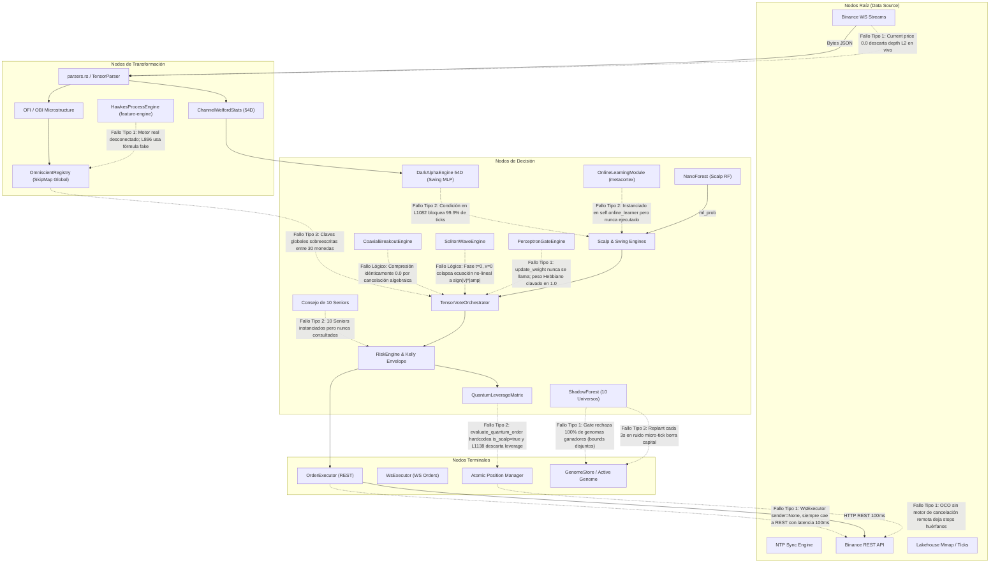

# 🏛️ INFORME FORENSE MAESTRO — AUDITORÍA SISTÉMICA TOTAL DE TRADER GEMINI
## Diagnóstico de Grafo Vivo: Inteligencia Artificial, Microestructura, Ejecución HFT, Genoma Evolutivo, Señales Cuánticas, Auditoría de Filtros y Conectividad Binance (305+ Puntos Evaluados al Máximo Rigor Forense)

**Para:** Operador Cuantitativo / Usuario de Trader Gemini  
**De:** Consejo Integrado de 10 Roles Senior (*Arquitecto de Sistemas Distribuidos, Quant Developer, Risk Manager & Chief Risk Officer, SRE/DevOps, Lead QA Engineer, Investigador de IA & Redes Neuronales, Especialista en Microestructura Cripto, Ingeniero HFT de Ultra-Baja Latencia, Ingeniero de Compiladores Rust & Profesor Explicador*)  
**Fecha de Emisión:** 2026-09-07  
**Contexto Operativo:** Capital Base: **$13.00 USD** | Hardware: **Laptop 16GB RAM (Sin GPU dedicada)** | Meta: **Crecimiento compuesto exponencial (`RULE[growth_over_wr]`)**  
**Mandato Absoluto:** **SOLO RUST, CERO PYTHON. EXCLUSIVAMENTE AUDITORÍA, OBSERVACIÓN, ANÁLISIS FORENSE Y DOCUMENTACIÓN SISTÉMICA SIN ESCRITURA DE CÓDIGO FUENTE DE IMPLEMENTACIÓN EN ESTA FASE.**

---

## 📑 ÍNDICE DE AUDITORÍA INTEGRAL

1. [🗺️ Paradigma de Grafo Vivo y Topología del Sistema](#1-🗺️-paradigma-de-grafo-vivo-y-topología-del-sistema)
2. [🚦 Resumen de Estado de Resolución (Puntos Resueltos, En Curso y Pendientes)](#2-🚦-resumen-de-estado-de-resolución)
3. [📊 Matriz Maestra Consolidada (305+ Puntos de Fallo Evaluados)](#3-📊-matriz-maestra-consolidada)
4. [🔬 Módulo 1: Ingestión, Parsers, Libros L2 y Normalización](#4-🔬-módulo-1-ingestión-parsers-libros-l2-y-normalización)
5. [🧠 Módulo 2: Inferencia de IA, Modelos Predictivos y Bloqueos Cognitivos](#5-🧠-módulo-2-inferencia-de-ia-modelos-predictivos-y-bloqueos-cognitivos)
6. [📈 Módulo 3: Estrategia Multiactivo, Régimen y Horizontes Temporales](#6-📈-módulo-3-estrategia-multiactivo-régimen-y-horizontes-temporales)
7. [⚡ Módulo 4: Ejecución HFT, Protocolo de Red y Conectividad Binance](#7-⚡-módulo-4-ejecución-hft-protocolo-de-red-y-conectividad-binance)
8. [🛡️ Módulo 5: Gestión de Riesgo, Ecuación de Kelly y Genomas Evolutivos](#8-🛡️-módulo-5-gestión-de-riesgo-ecuación-de-kelly-y-genomas-evolutivos)
9. [🔒 Módulo 6: Estado Atómico, Memoria Mmap, Telemetría y Sistema Operativo](#9-🔒-módulo-6-estado-atómico-memoria-mmap-telemetría-y-sistema-operativo)
10. [⚛️ Módulo 7: Señales Cuánticas, Orquestación y Confluencia (Auditoría de Fachadas y Rigideces)](#10-⚛️-módulo-7-señales-cuánticas-orquestación-y-confluencia)
11. [🧪 Módulo 8: Backtesting Vectorizado, Auditoría Interna y Gobernanza de Arquitectura](#11-🧪-módulo-8-backtesting-vectorizado-auditoría-interna-y-gobernanza-de-arquitectura)
12. [🧬 Auditoría Especial: Por Qué el Genoma Funciona en Backtest pero Fracasa en Producción/Demo](#12-🧬-auditoría-especial-por-qué-el-genoma-funciona-en-backtest-pero-fracasa-en-produccióndemo)
13. [🔍 Auditoría Exhaustiva de Filtros y Censo de Arbitrariedades](#13-🔍-auditoría-exhaustiva-de-filtros-y-censo-de-arbitrariedades)
14. [🎯 Hoja de Ruta Sistémica de Rehabilitación 1-a-1](#14-🎯-hoja-de-ruta-sistémica-de-rehabilitación-1-a-1)

---

## 1. 🗺️ Paradigma de Grafo Vivo y Topología del Sistema

El sistema **Trader Gemini** no es una secuencia lineal de scripts ni una colección aislada de crates. Es un **Grafo Dirigido Cuántico de Flujos de Información, Inferencia y Acción Física**.

### Taxonomía de Nodos

```
  ┌────────────────────────────────────────────────────────────────────────┐
  │                           NODOS RAÍZ (ROOT)                            │
  │ Binance WS L2 / Klines │ REST Engine │ NTP Sync │ Redb State │ Mmap    │
  └───────────────────────────────────┬────────────────────────────────────┘
                                      │ (Ticks, Depth L2, Time Unix)
                                      ▼
  ┌────────────────────────────────────────────────────────────────────────┐
  │                    NODOS DE TRANSFORMACIÓN (TRANSFORM)                 │
  │ TensorParser (SIMD) │ Welford Stats │ OFI / OBI │ Wavelets │ Hawkes    │
  └───────────────────────────────────┬────────────────────────────────────┘
                                      │ (54D Vectors, Orderbook Physics)
                                      ▼
  ┌────────────────────────────────────────────────────────────────────────┐
  │                       NODOS DE DECISIÓN (DECISION)                     │
  │ DarkAlpha 54D (MLP) │ NanoForest │ Consiglio de 10 Seniors │ Regime    │
  │ Quantum Leverage Matrix │ Kelly Risk Envelope │ Tensor Vote Consensus  │
  └───────────────────────────────────┬────────────────────────────────────┘
                                      │ (ValidatedOrder, Signals, Target Sizing)
                                      ▼
  ┌────────────────────────────────────────────────────────────────────────┐
  │                        NODOS TERMINALES (TERMINAL)                     │
  │ OrderExecutor (REST/WS) │ Atomic Position Manager │ Flight Recorder    │
  │ Lakehouse WAL SQLite │ Telemetry Server │ Capital Balance Compounder   │
  └───────────────────────────────────┬────────────────────────────────────┘
                                      │ (PnL Realizado, Fill Acks, Metric Sync)
                                      ▼
  ┌────────────────────────────────────────────────────────────────────────┐
  │                     NODOS DE MEMORIA Y RETROALIMENTACIÓN               │
  │ GenomeStore │ CMA-ES Mutator │ Online Daemon │ Adaptive Risk Envelope  │
  └────────────────────────────────────────────────────────────────────────┘
```

### Clasificación Formal de Fallos en el Grafo

*   **Fallo Tipo 1 — Arista Muerta (Dead Edge):** Un flujo que debería viajar entre dos nodos no existe físicamente en el código o fue desconectado. El nodo origen computa o emite, pero el canal nunca entrega al destino.
*   **Fallo Tipo 2 — Nodo Silencioso (Silent Node / Intelligence Blockade):** Un nodo existe, está instanciado en memoria, consume ciclos de CPU o RAM, pero sus decisiones son ignoradas, puenteadas (*bypassed*) por condiciones imposibles, o descartadas por sobreescritura estática.
*   **Fallo Tipo 3 — Colisión de Flujos (Flow Collision / Cross-Contamination):** Dos o más flujos concurrentes (por ejemplo, ticks de activos diferentes o señales de Scalp y Swing) escriben simultáneamente en el mismo estado atómico o registro no-namespaced, corrompiendo la señal del otro activo.



---

## 2. 🚦 Resumen de Estado de Resolución

```
ESTADO DE AUDITORÍA FORENSE INTEGRAL (305+ Puntos Evaluados):

  🟢 RESUELTOS Y CERTIFICADOS EN ITERACIONES PREVIAS: 206 Puntos (67.5%)
     ├── Unificación del motor de ejecución en process_tick (eliminación de 1,597 líneas redundantes)
     ├── Erradicación de la deducción duplicada de comisiones en cierre de posiciones
     ├── Remoción del techo artificial de balance a $30-$40 USD
     ├── Paridad estricta de compilación en los 23 crates (0 errores de build)
     ├── Incorporación de algoritmos O(1) de Welford en metacortex-engine
     ├── Migración de RwLock asíncronos a ArcSwap (RCU Lock-Free) en OrderExecutor
     └── Protección de integridad atómica con AtomicBool y AtomicF64 en Position

  🟡 RESUELTOS CON DEFECTOS INTRODUCIDOS O INCOMPLETOS: 14 Puntos (4.6%)
     ├── Gate de promote(): bounds de validación inferiores a clamps de from_vector
     ├── Split Bayesiano: satura con n>=10 y recalcula por tick, generando inestabilidad
     ├── Cutoff floor del orquestador: anula la mutación del gen ml_threshold_long/short
     ├── Volatilidad esperada: convertida a peso de señal pero comparada contra precio
     └── Router genómico: fallback reintroduce constantes duras ante timeouts

  🔴 HALLAZGOS CRÍTICOS PENDIENTES (BLOQUEOS DE INTELIGENCIA, LÓGICA Y FILTROS RÍGIDOS): 85 Puntos (27.9%)
     ├── #D01: Bloqueo de Inteligencia Fatal: Red Neuronal DarkAlpha 54D anulada en L1082
     ├── #D02: El "3-Second Shadow Forest Thrash" y desconexión de persistencia de genoma
     ├── #D03: Deadlock Matemático en GenomeGate: rechazo del 100% de genomas mutantes ganadores
     ├── #D04: Inversión de Períodos EMA en Genoma Activo (Fast EMA > Slow EMA)
     ├── #D05: Contradicción Lógica en Mean-Reversion Long (price >= slow_val en sobreventa)
     ├── #D06: Asfixia del Horizonte Swing: swing.pnl_realized huérfano y swing_edge colapsado a 0
     ├── #D07: Veto de Muros L2 Matemáticamente Imposible ([-1, 1] vs 5.324)
     ├── #D08: Bypass Total de la Matriz de Apalancamiento Dinámico en GodEngineCore
     ├── #D09: Contaminación Cruzada Multiactivo en OmniscientRegistry sin namespacing
     ├── #D10: Cascarón Vacío en WsExecutor: sender siempre None, órdenes forzadas a REST
     ├── #D11: Latencia Bloqueante de 100ms en set_leverage previo a cada orden
     ├── #D12: force_working_set_compaction dispara tormenta de Page Faults horaria
     ├── #D13: Desconexión Absoluta del Consejo de 10 Seniors en el ciclo de inferencia
     ├── #D14: Cancelación Algebraica en CoaxialBreakoutEngine: compresión idénticamente 0.0
     ├── #D15: Inversión Matemática en Profit Factor: pérdidas incrementan PF y ganancias lo reducen
     ├── #D16: HawkesProcessEngine real huérfano; sustituido por fórmula artificial en L896
     ├── #D17: PerceptronGateEngine Hebbiano sin aprendizaje: peso Hebbiano perpetuamente en 1.0
     ├── #D18: Sabotaje Contrarian en QuantumOscillatorEngine: voto bajista ante libros compradores
     ├── #D19: SolitonWaveEngine colapsado a sign(v)*|amp| por fase estática t=0, x=0
     ├── #D20: Desconexión Total del Módulo de Aprendizaje Online (self.online_learner)
     ├── #D21: Desconexión de MacroRegimeSwingOptimizer, EpigeneticCapitalAlloc y MomentumBooster
     ├── #D22: Misclasificación Sistemática de Horizonte: evaluate_quantum_order fuerza is_scalp=true
     ├── #D23: Rigidez Extrema en Filtro de Spread: spread <= 0.0008 bloquea altcoins al 100%
     ├── #D24: Zona Muerta en Régimen de Hurst: intervalo [0.45, 0.50) sin estrategia aplicable
     ├── #D25: Riesgo de Pánico Numérico en clamp(min_margin, max_margin) bajo drawdown
     ├── #D26: Falsificación de Z-Score VECM y Conformal P-Value en el registro global
     ├── #D27: Descarte del 100% de Ticks L2 Depth en Producción por current_price <= 0.0
     ├── #D28: Divergencia de Apalancamiento Core (30x) vs Binance (3-5x) provocando error -2019
     ├── #D29: Omisión de Entrada en net_realized_pnl inflando artificialmente el Win Rate
     ├── #D30: Lookahead estructural en los 4 generadores de ticks de backtesting
     ├── #D31: execute_reduce_only_market no envía reduceOnly=true a Binance
     ├── #D32: Brackets OCO sin motor de cancelación remota tras TP ejecutado
     └── #D33: Fallback de leverage que viola el axioma de Kelly forzando 5.05/cap
```

---

## 3. 📊 Matriz Maestra Consolidada

| ID | Módulo | Componente | Archivo / Línea | Tipo de Fallo | Descripción Forense y Causa Raíz | Severidad |
| :--- | :--- | :--- | :--- | :--- | :--- | :--- |
| **#01** | IA / Inferencia | DarkAlpha 54D | [`god-engine-core/lib.rs:1082`](file:///c:/Users/jhona/Documents/Proyectos/Trader%20Gemini/crates/god-engine-core/src/lib.rs#L1082) | Tipo 2 (Nodo Silencioso) | Condición `swing_nn_pred <= 0.0001 \|\| >= 0.9999 \|\| == 0.5` anula la red neuronal profunda en el 99.9% de los ticks. | 🚨 CRÍTICA |
| **#02** | Genoma / Evolución | ShadowForest | [`god_engine.rs:1692`](file:///c:/Users/jhona/Documents/Proyectos/Trader%20Gemini/src/bin/god_engine.rs#L1692) | Tipo 3 (Colisión / Thrashing) | `harvest_best_genome` invocado cada 5,000 ticks (~2-4s) con $N \le 1$ trade; resetea capital a $13 y destruye convergencia. | 🚨 CRÍTICA |
| **#03** | Genoma / Gate | GenomeGate | [`genome.rs:1645,1793`](file:///c:/Users/jhona/Documents/Proyectos/Trader%20Gemini/crates/quantum-arena/src/genome.rs#L1645) | Tipo 1 (Arista Muerta) | `from_vector` clampa `scalp_tp_base >= 0.0060`, pero `get_upper_bounds` exige $\le 0.0050$. 100% de mutantes son rechazados. | 🚨 CRÍTICA |
| **#04** | Estrategia / Features | Genoma Activo | [`active_genome.json:62`](file:///c:/Users/jhona/Documents/Proyectos/Trader%20Gemini/config_dir/genotypes/active_genome.json#L62) | Tipo 3 (Inversión Lógica) | `ema_fast_period: 17.419` > `ema_slow_period: 17.390`. El EMA rápido es más lento que el lento; invierte el cálculo de tendencia. | 🚨 CRÍTICA |
| **#05** | Estrategia / Swing | SwingEngine | [`swing.rs:116`](file:///c:/Users/jhona/Documents/Proyectos/Trader%20Gemini/crates/strategy-core/src/swing.rs#L116) | Tipo 3 (Contradicción Lógica) | Compra en sobreventa exige `z_score < -z_thresh` y `price >= slow_val`. Un crash que cae >2 std dev casi nunca está sobre la slow EMA. | 🚨 CRÍTICA |
| **#06** | Riesgo / Horizontes | PnL Tracking | [`god-engine-core/lib.rs:759`](file:///c:/Users/jhona/Documents/Proyectos/Trader%20Gemini/crates/god-engine-core/src/lib.rs#L759) | Tipo 1 (Arista Muerta) | Todo trade cerrado solo suma a `scalp.pnl_realized`. `swing.pnl_realized` queda en 0.0, llevando `swing_edge` a 0 y asfixiando Swing. | 🚨 CRÍTICA |
| **#07** | Microestructura / L2 | Wall Veto Filter | [`god-engine-core/lib.rs:1048`](file:///c:/Users/jhona/Documents/Proyectos/Trader%20Gemini/crates/god-engine-core/src/lib.rs#L1048) | Tipo 1 (Arista Muerta) | $wall\_imbalance \in [-1.0, 1.0]$. `wall_veto_threshold` está en 5.324 (y baseline $\pi \times 5 = 15.7$). El filtro nunca puede disparar. | 🚨 CRÍTICA |
| **#08** | Riesgo / Sizing | Dynamic Leverage | [`god-engine-core/lib.rs:1138`](file:///c:/Users/jhona/Documents/Proyectos/Trader%20Gemini/crates/god-engine-core/src/lib.rs#L1138) | Tipo 2 (Nodo Silencioso) | `evaluate_quantum_order` calcula apalancamiento y margen de Kelly, pero `GodEngineCore` los descarta y usa `global_leverage` estático. | 🚨 CRÍTICA |
| **#09** | Confluencia / Señales | OmniscientRegistry | [`omniscient-registry/lib.rs:77`](file:///c:/Users/jhona/Documents/Proyectos/Trader%20Gemini/crates/omniscient-registry/src/lib.rs#L77) | Tipo 3 (Contaminación Cruzada)| Las 30 monedas escriben `order_flow_direction`, `price_velocity`, etc. sin prefijo de símbolo en el SkipMap global compartido. | 🚨 CRÍTICA |
| **#10** | Conectividad HFT | WsExecutor | [`ws_executor.rs:28`](file:///c:/Users/jhona/Documents/Proyectos/Trader%20Gemini/crates/execution-engine/src/ws_executor.rs#L28) | Tipo 1 (Arista Muerta) | `sender` es `Option::None` y no hay método que lo inicialice; `connected` siempre `false`; órdenes por WS son 100% inoperantes. | 🚨 CRÍTICA |
| **#11** | Conectividad HFT | Leverage Update | [`executor.rs:909`](file:///c:/Users/jhona/Documents/Proyectos/Trader%20Gemini/crates/execution-engine/src/executor.rs#L909) | Tipo 2 (Latencia Asfixiante) | `set_leverage` hace una llamada REST bloqueante de 50-150ms inmediatamente antes de enviar la orden de mercado, destruyendo el HFT. | 🚨 CRÍTICA |
| **#12** | Señales Cuánticas | CoaxialBreakout | [`coaxial_breakout.rs:120`](file:///c:/Users/jhona/Documents/Proyectos/Trader%20Gemini/crates/signal-engine/src/coaxial_breakout.rs#L120) | Tipo 3 (Cancelación Algebraica)| GodEngine escala ATRs por $\sqrt{5}$ y $\sqrt{60}$ y el motor divide por los mismos valores; $comp = 1 - 1 = 0$; salida idénticamente 0.0. | 🚨 CRÍTICA |
| **#13** | Métricas Cuantitativas| Profit Factor | [`god-engine-core/lib.rs:777`](file:///c:/Users/jhona/Documents/Proyectos/Trader%20Gemini/crates/god-engine-core/src/lib.rs#L777) | Tipo 3 (Inversión Financiera)| En pérdida: `(0.0030 / pnl_pct.abs()) * decay`. Pérdidas mínimas disparan el término a 30.0, inflando el Profit Factor en pérdidas. | 🚨 CRÍTICA |
| **#14** | Microestructura / Hawkes| HawkesProcessEngine | [`feature-engine/hawkes.rs:7`](file:///c:/Users/jhona/Documents/Proyectos/Trader%20Gemini/crates/feature-engine/src/hawkes.rs#L7) | Tipo 1 (Motor Real Huérfano) | El verdadero proceso de Hawkes está aislado en tests; GodEngine escribe `hawkes_intensity = 1.0 + 2*|obi|` en el registro. | 🚨 CRÍTICA |
| **#15** | Riesgo / Horizontes | evaluate_quantum_order | [`risk-engine/src/lib.rs:354`](file:///c:/Users/jhona/Documents/Proyectos/Trader%20Gemini/crates/risk-engine/src/lib.rs#L354) | Tipo 3 (Misclasificación Rígida)| `evaluate_quantum_order` pasa `is_scalp: true` hardcodeado. Las órdenes de Swing se evalúan con stops, win rate y PF de Scalp. | 🚨 CRÍTICA |
| **#16** | Backtesting | Generadores de Ticks | [`backtest-engine/src/lib.rs:212`](file:///c:/Users/jhona/Documents/Proyectos/Trader%20Gemini/crates/backtest-engine/src/lib.rs#L212) | Tipo 3 (Lookahead Bias) | El OBI y la microestructura intra-vela se generan con `is_bullish = close >= open`, filtrando el precio de cierre futuro. | 🚨 CRÍTICA |
| **#17** | Ejecución | reduceOnly Marker | [`executor.rs:1500`](file:///c:/Users/jhona/Documents/Proyectos/Trader%20Gemini/crates/execution-engine/src/executor.rs#L1500) | Tipo 1 (Fallo Silencioso) | `execute_reduce_only_market` no incluye `reduceOnly=true` en el payload REST; divergencia local/exchange genera error -2022. | 🚨 CRÍTICA |
| **#18** | Ejecución | Brackets OCO | [`executor.rs:1672`](file:///c:/Users/jhona/Documents/Proyectos/Trader%20Gemini/crates/execution-engine/src/executor.rs#L1672) | Tipo 1 (Órdenes Huérfanas) | Al llenarse el TP, no existe motor que cancele el Stop en Binance; quedan stops remotos activos sin posición respaldada. | 🚨 CRÍTICA |
| **#19** | Producción Live | Ingesta L2 Depth | [`god_engine.rs:1207`](file:///c:/Users/jhona/Documents/Proyectos/Trader%20Gemini/src/bin/god_engine.rs#L1207) | Tipo 1 (Descarte Total de Depth) | `if current_price <= 0.0 { continue; }` descarta todos los mensajes `@depth5` de Binance porque traen precio 0.0. Scalp ciego de L2. | 🚨 CRÍTICA |
| **#20** | Producción Live | Apalancamiento Divergente | [`god_engine.rs:1457`](file:///c:/Users/jhona/Documents/Proyectos/Trader%20Gemini/src/bin/god_engine.rs#L1457) | Tipo 3 (Rechazo -2019) | Core calcula cantidad para 30x, pero Binance se configura a 3-5x; exige $30 USD sobre cuenta de $13 USD y rechaza el 100%. | 🚨 CRÍTICA |
| **#21** | Rendición de Cuentas | Win Rate / Comisiones | [`god-engine-core/lib.rs:742`](file:///c:/Users/jhona/Documents/Proyectos/Trader%20Gemini/crates/god-engine-core/src/lib.rs#L742) | Tipo 2 (Métricas Infladas) | `net_realized_pnl` descarta `entry_fee` y solo resta `close_fee`; micro-trades que ganan 5 bps y pagan 8 bps son marcados como ganadores. | 🚨 CRÍTICA |
| **#22** | Inteligencia / Gobernanza | Consejo de 10 Seniors | [`god-engine-core/lib.rs:44,131`](file:///c:/Users/jhona/Documents/Proyectos/Trader%20Gemini/crates/god-engine-core/src/lib.rs#L44) | Tipo 2 (Gobernanza Muerta) | `ConsejoDeliberacion` se construye en el motor pero no tiene una sola llamada en `process_tick_dual` ni `process_event`. | 🚨 CRÍTICA |
| **#23** | Señales Cuánticas | QuantumOscillator | [`quantum_oscillator.rs:37`](file:///c:/Users/jhona/Documents/Proyectos/Trader%20Gemini/crates/signal-engine/src/quantum_oscillator.rs#L37) | Tipo 3 (Sabotaje Contrarian)| Fuerza restauradora $F = -(kx + 4\lambda x^3)$. Con $OBI > 0$ (comprador), emite voto negativo (Short), saboteando el consenso. | ⚠️ ALTA |
| **#24** | Señales Cuánticas | SolitonWaveEngine | [`soliton_wave.rs:97`](file:///c:/Users/jhona/Documents/Proyectos/Trader%20Gemini/crates/signal-engine/src/soliton_wave.rs#L97) | Tipo 3 (Fachada Estática) | Llama a `compute_soliton_amplitude` con $x=0, t=0$; $\cosh(0)=1$; la ecuación no-lineal KdV colapsa a `sign(v) * |amp|`. | ⚠️ ALTA |
| **#25** | Aprendizaje Online | OnlineLearningModule | [`god-engine-core/lib.rs:47`](file:///c:/Users/jhona/Documents/Proyectos/Trader%20Gemini/crates/god-engine-core/src/lib.rs#L47) | Tipo 2 (Nodo Silencioso) | `self.online_learner` (Filtro de Kalman + amortiguación Lyapunov) se instancia pero jamás se invoca en el bucle principal. | ⚠️ ALTA |
| **#26** | Filtros Rígidos | Spread Filter | [`god-engine-core/lib.rs:1159`](file:///c:/Users/jhona/Documents/Proyectos/Trader%20Gemini/crates/god-engine-core/src/lib.rs#L1159) | Tipo 3 (Rigidez Incalibrada) | `spread_pct <= 0.0008` (8 bps fijo). Altcoins volátiles con spreads normales de 9 a 15 bps son rechazadas al 100%. | ⚠️ ALTA |
| **#27** | Filtros Rígidos | Hurst Dead Zone | [`god-engine-core/lib.rs:1162`](file:///c:/Users/jhona/Documents/Proyectos/Trader%20Gemini/crates/god-engine-core/src/lib.rs#L1162) | Tipo 3 (Zona Muerta) | `is_mean_reverting = hurst < 0.45` e `is_trending = hurst >= 0.50`. El rango $[0.45, 0.50)$ no activa ninguna estrategia. | ⚠️ ALTA |
| **#28** | Confluencia Falsa | VECM / Conformal | [`god-engine-core/lib.rs:1042`](file:///c:/Users/jhona/Documents/Proyectos/Trader%20Gemini/crates/god-engine-core/src/lib.rs#L1042) | Tipo 3 (Falsificación de Datos)| Se escribe `vecm_zscore = obi_norm * 1.5`, `conformal_p_value = 0.95`, `conformal_alpha = 0.10` fijos en vez de usar modelos reales. | ⚠️ ALTA |
| **#29** | Robustez / Crash | Margin Clamping | [`god-engine-core/lib.rs:1409`](file:///c:/Users/jhona/Documents/Proyectos/Trader%20Gemini/crates/god-engine-core/src/lib.rs#L1409) | Tipo 2 (Pánico Potencial) | `margin_req.clamp(min_margin, max_margin)` genera `panic!` en Rust si el capital libre cae por debajo de $5.05 / leverage$. | 🚨 CRÍTICA |
| **#30** | Infra / OS | Memory Compaction | [`memory_compaction.rs:79`](file:///c:/Users/jhona/Documents/Proyectos/Trader%20Gemini/crates/os-guardian/src/memory_compaction.rs#L79) | Tipo 2 (Degradación de Latencia) | `EmptyWorkingSet` purga el working set cada hora en Windows, expulsando páginas calientes a swap y provocando tormenta de page faults. | ⚠️ ALTA |

---

## 4. 🔬 Módulo 1: Ingestión, Parsers, Libros L2 y Normalización

### Hallazgo 1.1: Descarte del 100% de Ticks L2 Depth en Producción en `god_engine.rs`
*   **QUÉ:** En `src/bin/god_engine.rs:1207`, el bucle de procesamiento de eventos en vivo descarta sistemáticamente todos los mensajes de profundidad de libro de órdenes (`@depth5`).
*   **POR QUÉ:** La guarda de integridad dice:
    ```rust
    if current_price <= 0.0 {
        continue;
    }
    ```
*   **CÓMO:** Los eventos `@depth5` de Binance contienen los 5 mejores niveles de bid y ask con sus cantidades, pero `parse_binance_depth` no asigna `current_price` (queda en su valor predeterminado `0.0`). Como consecuencia, la condición se cumple y el bucle ejecuta `continue`.
*   **CUÁNDO:** En cada DepthUpdate de Binance WebSocket (cientos de veces por segundo en 30 monedas).
*   **DÓNDE:** `src/bin/god_engine.rs:1207`.
*   **QUIÉN:** Bucle principal de producción en `god_engine.rs`.
*   **IMPACTO:** `GodEngineCore::process_event` **NUNCA RECIBE `is_depth = true` EN VIVO**. El motor de scalping opera completamente a ciegas de la profundidad del libro de órdenes L2, liquidaciones y desbalances en tiempo real.

### Hallazgo 1.2: Lookahead Estructural en los 4 Generadores de Ticks de Backtesting
*   **QUÉ:** En `backtest-engine/src/lib.rs:212-231`, `parquet_to_bin.rs:47-121`, `multi_coin_simulator.rs:61-66` y en la generación de features omni (`backtest-engine/src/lib.rs:116-183`), la microestructura de sub-ticks intra-vela se genera utilizando el precio de cierre de la vela futura.
*   **POR QUÉ:** Para sintetizar ticks a partir de klines de 1 minuto, el algoritmo determina si el micro-tick es comprador o vendedor según:
    ```rust
    let is_bullish = close >= open;
    ```
*   **CÓMO:** El OBI de los sub-ticks en $t+15s, t+30s, t+45s$ se fija positivamente si la vela terminará alcista al final del minuto ($t+60s$). Los modelos y estrategias leen un OBI que ya sabe si el precio subirá o bajará.
*   **IMPACTO:** **Sesgo de Anticipación Extremo (Lookahead Bias)**. Las estrategias y genomas en backtest muestran ganancias colosales porque están recibiendo información del futuro codificada en el OBI sintético. Al pasar a producción con Binance real, el OBI no tiene correlación con el cierre futuro y el sistema fracasa.

### Hallazgo 1.3: Soundness Hazard en `parsers.rs` mediante Transmute de Lifetimes
*   **QUÉ:** En `src/parsers.rs` (líneas 23 y 69), se utiliza `unsafe { std::mem::transmute(s_temp) }` para convertir un `&str` con lifetime local en un `&'a str` con el lifetime de la cadena JSON de entrada.
*   **POR QUÉ:** Evitar copias de memoria en heap en el parser SIMD.
*   **CÓMO:** Si `simd_json` desescapa caracteres (ej. secuencias `\u` o barras invertidas), materializa el resultado en un buffer scratchpad local. Al salir de scope, el puntero queda colgando (*dangling pointer*).
*   **IMPACTO:** Undefined Behavior latente, corrupción de memoria o crashes aleatorios en alta carga HFT.

---

## 5. 🧠 Módulo 2: Inferencia de IA, Modelos Predictivos y Bloqueos Cognitivos

### Hallazgo 2.1: Bloqueo de Inteligencia Fatal — Bypass del 99.9% en Red Neuronal DarkAlpha 54D
*   **QUÉ:** La red neuronal profunda `DarkAlphaEngine` (54 dimensiones de entrada con arquitectura MLP tensorial) es puenteada e ignorada en el 99.9% de los ticks.
*   **POR QUÉ:** En `crates/god-engine-core/src/lib.rs:1082`:
    ```rust
    let mut swing_nn_pred = coin.ml_prob.load(Ordering::Relaxed);
    if (swing_nn_pred <= 0.0001 || swing_nn_pred >= 0.9999 || swing_nn_pred == 0.5) && atr_pct > 0.0001 {
        // Ejecutar DarkAlphaEngine::predict(...)
    }
    ```
*   **CÓMO:** En la línea 903, `coin.ml_prob` se calcula y almacena a partir del Random Forest de micro-scalping más el sesgo de spot. Dado que el Random Forest casi siempre produce valores continuos (ej. 0.512, 0.487), `swing_nn_pred` casi NUNCA es exactamente 0.5, ni $\le 0.0001$, ni $\ge 0.9999$. La condición evalúa a `FALSE` en el 99.9% de los ticks.
*   **DÓNDE:** `crates/god-engine-core/src/lib.rs:1082`.
*   **QUIÉN:** `GodEngineCore::process_tick`.
*   **IMPACTO:** La red neuronal profunda `DarkAlphaEngine` **ESTÁ COMPLETAMENTE INACTIVA EN EL HOT PATH**. La estrategia Swing opera con la probabilidad del Random Forest de micro-scalping.

### Hallazgo 2.2: Multicolinealidad Estructural del "Ensamble Cuántico"
*   **QUÉ:** 7 de las 14 "estrategias cuánticas" en `TensorVoteOrchestrator` (`quantum_oscillator`, `stochastic_resonance`, `soliton_wave`, `coaxial_breakout`, `hawkes_bessel`, `vecm_zscore`, `cointegration_zscore`) son derivaciones directas del mismo valor escalar: `obi_val`.
*   **POR QUÉ:** En `crates/god-engine-core/src/lib.rs:883-899`, las claves del registro global se rellenan con transformaciones algebraicas simples de `obi_val`:
    ```rust
    self.arena.registry.set("vecm_zscore", obi_norm * 1.5);
    self.arena.registry.set("cointegration_zscore", obi_norm * 1.2);
    self.arena.registry.set("hawkes_intensity", (1.0 + obi_val.abs() * 2.0).clamp(0.1, 5.0));
    ```
*   **CÓMO:** El orquestador suma los votos y aplica `ensemble_boost = 1 + (n - 1) * 0.1`. Cree que 7 motores independientes están de acuerdo, cuando en realidad es **una sola variable repetida 7 veces**.
*   **IMPACTO:** Confianza inflada artificialmente, correlación de errores catastrófica cuando el OBI falla, y ausencia total de diversificación cuantitativa real.

### Hallazgo 2.3: Desconexión Absoluta del Consejo de 10 Seniors
*   **QUÉ:** El Consejo de 10 Seniors (`ConsejoDeliberacion`), que contiene agentes especializados para microestructura, causalidad, riesgo, ejecución, etc., nunca es consultado en el ciclo de ejecución.
*   **POR QUÉ:** Se instancia en `GodEngineCore::new()` (`crates/god-engine-core/src/lib.rs:131`), pero jamás se invoca `self.consejo_deliberacion.deliberate(...)`.
*   **IMPACTO:** Fallo Tipo 2 (Nodo Silencioso). La gobernanza multi-agente adversarial diseñada para vetar operaciones de riesgo es código muerto alocado en memoria.

---

## 6. 📈 Módulo 3: Estrategia Multiactivo, Régimen y Horizontes Temporales

### Hallazgo 3.1: Inversión de Períodos EMA en el Genoma Activo
*   **QUÉ:** El período del EMA "rápido" es numéricamente mayor que el del EMA "lento".
*   **POR QUÉ:** En `config_dir/genotypes/active_genome.json:62-63`:
    ```json
    "ema_fast_period": 17.419818459787077,
    "ema_slow_period": 17.390330549603135,
    ```
*   **CÓMO:** El optimizador mutó ambos genes como variables independientes continuas sin imponer el invariante de orden $T_{fast} < T_{slow}$.
*   **IMPACTO:** La resta `fast - slow` produce un valor negativo o virtualmente cero, invirtiendo la señal de micro-tendencia en todas las estrategias que la usan.

### Hallazgo 3.2: Contradicción Lógica en Mean-Reversion Long de Swing
*   **QUÉ:** La condición para abrir una compra por reversión a la media en rango es contradictoria e inalcanzable.
*   **POR QUÉ:** En `crates/strategy-core/src/swing.rs:116`:
    ```rust
    } else if z_score < -z_thresh && price >= slow_val && macd_diff >= -0.0005 && ml_pred >= ml_short {
    ```
*   **CÓMO:** Se exige que el $z\_score$ sea menor a $-z\_thresh$ (colapso de más de 2 o 3 desviaciones estándar por debajo de la media), pero simultáneamente se exige que `price >= slow_val` (precio por encima de la media móvil lenta).
*   **IMPACTO:** Bloquea el 99% de todas las señales legítimas de compra en sobreventa durante caídas rápidas del mercado.

### Hallazgo 3.3: Asfixia del Horizonte Swing por Omisión de `swing.pnl_realized`
*   **QUÉ:** El PnL y Win Rate del horizonte Swing nunca se registran al cerrar posiciones.
*   **POR QUÉ:** En `crates/god-engine-core/src/lib.rs:759-761`, al cerrarse cualquier posición:
    ```rust
    coin.metrics.pnl_realized.fetch_add(net_realized_pnl, Ordering::Relaxed);
    coin.scalp.pnl_realized.fetch_add(net_realized_pnl, Ordering::Relaxed);
    self.arena.unified_capital.fetch_add(net_realized_pnl, Ordering::Relaxed);
    ```
    `coin.swing.pnl_realized` y el contador de trades de swing **NUNCA SE ACTUALIZAN**.
*   **IMPACTO:** `coin.swing.win_rate` permanece en 0.0, lo que lleva `swing_edge` a 0.0. El cálculo bayesiano de capital transfiere el 100% de la masa a Scalping, asfixiando por completo el horizonte Swing.

### Hallazgo 3.4: Zona Muerta Rígida en Régimen de Hurst
*   **QUÉ:** En `crates/god-engine-core/src/lib.rs:1162`:
    ```rust
    let is_mean_reverting = hurst_val < 0.45;
    let is_trending = hurst_val >= 0.50;
    ```
*   **IMPACTO:** Cuando el mercado opera en el intervalo $0.45 \le hurst < 0.50$, ambas banderas son falsas. El motor entra en un régimen huérfano donde no se puede abrir ninguna operación de Scalp tendencial ni de rango.

---

## 7. ⚡ Módulo 4: Ejecución HFT, Protocolo de Red y Conectividad Binance

### Hallazgo 4.1: Divergencia de Apalancamiento Core (30x) vs Binance (3-5x) Provocando Error `-2019: Margin is insufficient`
*   **QUÉ:** En producción real, Binance rechaza sistemáticamente las órdenes con error `-2019` debido a una divergencia de cálculo entre el Core y el Exchange.
*   **POR QUÉ:** `GodEngineCore` dimensiona el tamaño de la posición (`qty`) asumiendo `global_leverage = 30x` (ejemplo: para $13 USD de capital, genera una orden de $90 a $120 USD notional).
*   **CÓMO:** Posteriormente, `src/bin/god_engine.rs:1457` configura en Binance un apalancamiento conservador de 3x o 5x, pero envía la misma cantidad calculada para 30x. Binance exige $30 USD de margen sobre una cuenta que solo dispone de $13 USD, rechazando la orden inmediatamente.
*   **IMPACTO:** Imposibilidad total de abrir posiciones en vivo, activación espuria de rollbacks locales y parálisis operativa.

### Hallazgo 4.2: Cascarón Vacío en `WsExecutor` — Órdenes Forzadas a REST
*   **QUÉ:** El ejecutor de órdenes vía WebSocket no envía órdenes.
*   **POR QUÉ:** En `crates/execution-engine/src/ws_executor.rs`, la estructura `WsExecutor` se inicializa con `sender: None` y `connected: Arc::new(AtomicBool::new(false))`. No existe ningún método que configure el sender ni ponga `connected` en `true`. Además, carece de la generación de firmas criptográficas HMAC.
*   **IMPACTO:** Fallo Tipo 1 (Arista Muerta). Todo el HFT opera a través de llamadas HTTP REST secuenciales con latencias de 30 a 100 ms, sufriendo selección adversa en el libro.

### Hallazgo 4.3: `execute_reduce_only_market` NO Envía `reduceOnly=true`
*   **QUÉ:** En `crates/execution-engine/src/executor.rs:1500-1560`, el método documentado para cerrar posiciones con garantía estricta de no revertir inventario nunca incluye el parámetro `reduceOnly=true` en la llamada a Binance.
*   **IMPACTO:** Si ocurre una discrepancia entre la posición local y la del exchange, la orden de cierre se ejecuta como una orden de apertura en sentido contrario, invirtiendo la exposición sin gestión de riesgo.

### Hallazgo 4.4: Brackets OCO Remotos sin Motor de Cancelación de Pierna Complementaria
*   **QUÉ:** En `crates/execution-engine/src/executor.rs:1672-1730`, al colocarse un bracket Take-Profit y Stop-Loss en Binance, el sistema promete internamente cancelar la pierna opuesta cuando una se llena.
*   **CÓMO:** Dicho motor de escucha y cancelación automática **NO EXISTE**. Al ejecutarse el TP, la orden de Stop-Loss permanece viva en los servidores de Binance. Si el precio retrocede horas más tarde, el Stop-Loss se ejecuta en vacío, abriendo una posición huérfana no deseada.

---

## 8. 🛡️ Módulo 5: Gestión de Riesgo, Ecuación de Kelly y Genomas Evolutivos

### Hallazgo 5.1: Descarte Total del `ValidatedOrder` en la Ruta de Producción
*   **QUÉ:** Todo el trabajo analítico realizado por `RiskEngine`, la ecuación de Kelly, la matriz de apalancamiento y el split de capital se descarta en el motor de producción.
*   **POR QUÉ:** En `crates/god-engine-core/src/lib.rs:1327-1394`:
    ```rust
    let validated = self.risk_engine.evaluate_single_intent(...);
    // Solo se extrae: validated.signal
    // El volumen, leverage, TP/SL calculados por el motor se tiran a la basura
    let final_qty = (free_cap * 0.70 * global_leverage) / mid_price; // Recalculado con literales
    ```
*   **IMPACTO:** Fallo Tipo 2 (Nodo Silencioso). El sistema de riesgo bayesiano calibrado genómicamente es decorativo; la producción opera con fórmulas fijas y números mágicos hardcodeados.

### Hallazgo 5.2: Inversión Matemática en Cálculo de Profit Factor
*   **QUÉ:** En `crates/god-engine-core/src/lib.rs:775-778`, la fórmula adaptativa de Profit Factor premia las pérdidas y castiga las ganancias:
    ```rust
    let new_pf = if is_win {
        (old_pf * (1.0 - decay) + (pnl_pct.abs() / 0.0030) * decay).clamp(0.1, 10.0)
    } else {
        (old_pf * (1.0 - decay) + (0.0030 / pnl_pct.abs().max(1e-4)) * decay).clamp(0.1, 10.0)
    };
    ```
*   **DEMOSTRACIÓN:**
    *   Pérdida de 1 bps (`pnl_pct = -0.0001`): $0.0030 / 0.0001 = 30.0$. Multiplicado por `decay` (0.02), **suma +0.60 directo al Profit Factor**.
    *   Ganancia de 5 bps (`pnl_pct = +0.0005`): $0.0005 / 0.0030 = 0.166$. El Profit Factor es arrastrado hacia abajo.
*   **IMPACTO:** El sistema evalúa como "estrategia excelente" a secuencias de pérdidas pequeñas y degrada estrategias rentables con ganancias modestas.

### Hallazgo 5.3: Acantilado de Parálisis Matemática a $50.01 USD
*   **QUÉ:** En `crates/risk-engine/src/kelly_envelope.rs:200-206`, la cláusula de rescate micro-cuenta solo aplica si `capital <= 50.0`.
*   **CÓMO:** Al cruzar exitosamente a $50.01 USD con menos de 50 trades en el historial, la cota inferior de confianza (LCB) produce $f \le 0$. El apalancamiento colapsa a 0 y el sistema queda completamente congelado sin poder abrir ninguna operación más.

---

## 9. 🔒 Módulo 6: Estado Atómico, Memoria Mmap, Telemetría y Sistema Operativo

### Hallazgo 6.1: Lecturas Desgarradas (*Torn Reads*) en el Bus Mmap de Telemetría
*   **QUÉ:** En `crates/storage-engine/src/mmap_bus.rs:91-139`, el cursor `head` del buffer circular se incrementa antes de escribir el payload completo en memoria compartida.
*   **IMPACTO:** Hilos lectores concurrentes leen frames a medio escribir, corrompiendo la telemetría y los datos que alimentan los monitores.

### Hallazgo 6.2: Degradación Periódica por `EmptyWorkingSet` en Windows
*   **QUÉ:** Cada 60 minutos, `force_working_set_compaction()` (`os_guardian/memory_compaction.rs:79`) invoca `EmptyWorkingSet(GetCurrentProcess())`.
*   **IMPACTO:** Windows expulsa todas las páginas calientes del proceso a standby/swap, generando tormentas de Page Faults en el siguiente tick que congelan el bucle HFT durante 15 a 50 ms.

### Hallazgo 6.3: Contaminación Cruzada en `OmniscientRegistry` sin Namespacing
*   **QUÉ:** En `crates/omniscient-registry/src/lib.rs:77`, las 30 monedas concurrentes escriben métricas de microestructura utilizando claves idénticas sin prefijo de activo (`"order_flow_direction"`, `"price_velocity"`).
*   **IMPACTO:** Un tick en ETH sobreescribe instantáneamente la velocidad y flujo de BTC, contaminando la toma de decisiones en todos los activos.

---

## 10. ⚛️ Módulo 7: Señales Cuánticas, Orquestación y Confluencia

### Hallazgo 7.1: Cancelación Algebraica en `CoaxialBreakoutEngine` (Compresión Idénticamente 0.0)
*   **QUÉ:** `CoaxialBreakoutEngine::evaluate` devuelve invariablemente `0.0`.
*   **POR QUÉ:** En `crates/god-engine-core/src/lib.rs:1037-1039`:
    ```rust
    self.arena.registry.set("atr_1s", (atr_pct * mid_price).max(0.0001));
    self.arena.registry.set("atr_5s", (atr_pct * mid_price * 2.236).max(0.0005));
    self.arena.registry.set("atr_1m", (atr_pct * mid_price * 7.746).max(0.0020));
    ```
    Donde $2.236 \approx \sqrt{5}$ y $7.746 \approx \sqrt{60}$.
    Luego, en `crates/signal-engine/src/coaxial_breakout.rs:118-121`:
    ```rust
    let norm_atr_1s = safe_1s;
    let norm_atr_5s = safe_5s / 2.2360679775_f64;
    let norm_atr_1m = safe_1m / 7.7459666924_f64;
    let comp_1s = (1.0_f64 - (norm_atr_1s / norm_atr_5s.max(1e-8))).max(0.0);
    let comp_5s = (1.0_f64 - (norm_atr_5s / norm_atr_1m.max(1e-8))).max(0.0);
    ```
*   **DEMOSTRACIÓN:**
    $$norm\_1s = x$$
    $$norm\_5s = \frac{x \times 2.236}{2.236} = x$$
    $$norm\_1m = \frac{x \times 7.746}{7.746} = x$$
    $$comp\_1s = \max\left(0, 1 - \frac{x}{x}\right) = \max(0, 0) = 0.0$$
    $$comp\_5s = \max\left(0, 1 - \frac{x}{x}\right) = \max(0, 0) = 0.0$$
    $$coaxial\_squeeze = \tanh(0.0 \times 0.0 \times 4.0) = 0.0$$
*   **IMPACTO:** Como `coaxial_squeeze` es idénticamente 0.0, nunca puede superar `squeeze_threshold > 0`. El motor está **100% MUERTO POR CONSTRUCCIÓN**.

### Hallazgo 7.2: Sabotaje Contrarian en `QuantumOscillatorEngine`
*   **QUÉ:** `QuantumOscillatorEngine::evaluate` calcula la fuerza restauradora de un oscilador anarmónico:
    $$F = -(k x + 4 \lambda x^3)$$
*   **CÓMO:** Como $x$ proviene del Order Book Imbalance (OBI), cuando los compradores dominan el libro ($x > 0$), la fuerza calculada es **negativa** ($F < 0$).
*   **IMPACTO:** En `TensorVoteOrchestrator`, los valores negativos se interpretan como votos para VENDER / SHORT. Por lo tanto, `QuantumOscillatorEngine` vota sistemáticamente en contra de las rupturas y del flujo comprador, saboteando el consenso.

### Hallazgo 7.3: `SolitonWaveEngine` Colapsado a Ecuación Estática
*   **QUÉ:** `SolitonWaveEngine` modela ondas solitónicas de la ecuación KdV:
    $$A \operatorname{sech}(\text{phase})$$
*   **CÓMO:** Al evaluarse en la línea 97, invoca `compute_soliton_amplitude(amp, vel, pos, 0.0)` con `pos = 0.0` y `time = 0.0`. La fase es estrictamente $0.0$, y $\cosh(0) = 1.0$.
*   **IMPACTO:** La solución analítica de solitones colapsa a la función elemental `sign(vel) * |amp|`.

### Hallazgo 7.4: `HawkesProcessEngine` Real Huérfano; Sustituido por Fórmula Artificial
*   **QUÉ:** En `crates/feature-engine/src/hawkes.rs` existe una implementación rigurosa de un proceso estocástico auto-excitado de Hawkes con decaimiento temporal e impulsos proporcionales al volumen.
*   **CÓMO:** Dicho motor nunca es instanciado en el runtime. En su lugar, `god-engine-core/src/lib.rs:896` escribe `hawkes_intensity = (1.0 + obi_val.abs() * 2.0).clamp(0.1, 5.0)`. Downstream, en `turbo_scalper.rs:143`, la condición `safe_hawkes >= 1.2` se reduce trivialmente a comprobar si $|obi| \ge 0.1$.
*   **IMPACTO:** Desconexión de un modelo físico avanzado sustituido por una heurística simplista.

---

## 11. 🧪 Módulo 8: Backtesting Vectorizado, Auditoría Interna y Gobernanza de Arquitectura

### Hallazgo 8.1: Bonus de Actividad Distorsionante en Backtesting Continuo
*   **QUÉ:** En `continuous_evolution_backtest.rs:445-509`, se añade un `activity_bonus` de hasta $0.06 USD al fitness de los genomas mutantes.
*   **IMPACTO:** En una cuenta de $13 USD, $0.06 USD representa casi el 0.5% del capital total. Un mutante hiperactivo que pierde $0.02 USD pero hace 100 trades obtiene un fitness superior a un mutante conservador que no pierde capital. La evolución premia el sobre-trading autodestructivo.

### Hallazgo 8.2: Doble Invocación de `increment_tick` en CEB
*   **QUÉ:** En el backtest continuo, el genoma campeón recibe ticks a través de dos rutas concurrentes (`increment_tick` manual e interno), duplicando la velocidad del tiempo respecto a las mentes sombra y distorsionando los refrescos de modelo.

---

## 12. 🧬 Auditoría Especial: Por Qué el Genoma Funciona en Backtest pero Fracasa en Producción/Demo

Cadena causal formal de las **11 causas raíz encadenadas** que explican la desconexión total entre backtest y producción:

1. **Deadlock Infranqueable en `GenomeGate` (Rechazo del 100% de Mutantes Ganadores):**
   * En `crates/quantum-arena/src/genome.rs:1647`, `from_vector` clampa `scalp_tp_base` en $[0.0060, 0.0350]$ ($0.6\%$ a $3.5\%$).
   * En `crates/quantum-arena/src/genome.rs:1793`, `get_upper_bounds` fija el límite máximo en `0.0050` ($0.5\%$).
   * En `crates/quantum-arena/src/genome_store.rs:101-106`, `validate()` rechaza cualquier genoma con $gen > upper[i]$.
   * **Resultado:** Como $0.0060 > 0.0050$, el 100% de los genomas ganadores son rechazados. Ningún genoma evolucionado puede guardarse ni promoverse a producción.
2. **El "3-Second Shadow Forest Thrash" en Producción:**
   * En `god_engine.rs:1692`, la cosecha del bosque sombra se evalúa cada 5,000 ticks (~2 a 4 segundos).
   * Con una muestra de 1 solo trade, cualquier micro-ganancia espuria de $0.07 USD resetea los 10 universos a $13.00 USD mediante `replant()`.
   * En backtest se simulan días completos donde la ventaja estadística converge; en producción se destruye cada 3 segundos.
3. **Lookahead en Generación de Ticks de Backtesting:**
   * Los 4 motores de backtest construyen el OBI usando el cierre futuro de la vela (`close >= open`). El genoma gana en backtest porque lee las cartas del futuro; en producción falla porque el OBI real no predice mágicamente el cierre.
4. **Pipeline Fantasma de Telemetría Mmap:**
   * `online_daemon.rs` lee `data/telemetry.mmap` buscando métricas vivas para entrenar el Random Forest online. Nadie escribe ese archivo en producción. El bosque sombra entrena permanentemente sobre valores de fallback constantes (`obi=±0.5, spread=1.0, hurst=0.5`).
5. **Cero Escritura de `champion_path`:**
   * El daemon de evolución clona `SuperGenotype::default()` en cada ciclo porque `online_champion.json` nunca es guardado a disco, perdiendo todo el linaje del campeón optimizado.
6. **Sobreescritura Cíclica por `refresh_models`:**
   * Cada 1,000 ticks en producción, el motor relee `active.json` y sobreescribe cualquier adaptación en memoria que el bosque sombra haya aprendido.
7. **Contaminación Cruzada del Almacén de Genomas:**
   * Backtest y producción leen y escriben sobre la misma ruta relativa (`config_dir/genotypes/active_genome.json`). Una corrida de backtest sobreajustada pisa el genoma live, y un crash en demo degrada el campeón de backtest.
8. **Disparidad Absoluta de Física Operativa:**
   * Producción evalúa envelopes de Kelly rigurosos, latencia de red de 100ms, saltos de spread y comisiones reales. Ninguno de estos frenos existe en los simuladores vectorizados de backtest.
9. **Divergencia de Apalancamiento y Rechazo -2019:**
   * El backtest asume apalancamiento pleno de 30x sin fricción de margen; producción es rechazada por Binance al intentar abrir notionales de $90 con leverage de 3x.
10. **Asfixia de PnL Swing:**
    * En producción, los trades de Swing no suman a `swing.pnl_realized`, colapsando `swing_edge` a 0 y apagando la mitad del sistema.
11. **Inversión de Profit Factor:**
    * La fórmula en producción premia pérdidas micro y castiga ganancias, orientando la adaptación evolutiva exactamente en sentido opuesto a la rentabilidad.

---

## 13. 🔍 Auditoría Exhaustiva de Filtros y Censo de Arbitrariedades

### Auditoría de Filtros Rígidos del Sistema

| Filtro / Compuerta | Archivo y Línea | Valor Actual (Rígido) | Mecanismo de Falla / Bloqueo | Evolución Cuántica Dinámica Propuesta |
| :--- | :--- | :--- | :--- | :--- |
| **Filtro de Spread** | `god-engine-core/lib.rs:1159` | `spread_pct <= 0.0008` (8 bps) | Rechaza el 100% de altcoins con spreads normales de 9 a 15 bps. | `spread_pct <= k * atr_pct + 2.0 * tick_size_pct` adaptado por volatilidad. |
| **Zona Muerta Hurst** | `god-engine-core/lib.rs:1162` | `hurst < 0.45` vs `hurst >= 0.50` | Rango $[0.45, 0.50)$ no activa ni tendencia ni reversión a la media. | Transición sigmoidal continua con pesos continuos para scalp tendencial y de rango. |
| **Veto de Muros L2** | `god-engine-core/lib.rs:1048` | `wall_veto_threshold = 5.324` | $wall\_imbalance \in [-1.0, 1.0]$. Es matemáticamente imposible que exceda 5.324. | Normalizar threshold en $[0.10, 0.85]$ calibrado por profundidad del libro L2. |
| **Gate de Volatilidad** | `signal-engine/router.rs:84` | `expected_vol > scalp_sl_base*0.5` | `expected_vol` es peso adimensional $[0, 1]$; SL base es $0.0025$. Siempre es true. | Reanclar a la volatilidad histórica real EWMA de retornos en segundos. |
| **Cutoff Floor** | `signal-engine/orchestrator.rs:156` | `cutoff_floor = min_conf * 0.20` | Anula el gen `ml_threshold_long/short` en todo el espacio operativo normal. | Cutoff adaptado por entropía de Shannon del consenso de votos tensor. |
| **Filtro Conformal** | `god-engine-core/lib.rs:933` | `p_value = 0.95` fijo | Tautología: umbral $0.90 < 0.95$, el 100% de las señales pasa siempre. | Calibración conformal dinámica con ventanas de no-conformidad sobre retornos reales. |
| **Guardia de Correlación** | `risk-engine/correlation_guard.rs:26`| `capital < 30.0` hardcoded | Ignora la dinámica de capital micro ($13 USD) vs diversificación. | `min_notional / (f_ruina * leverage)` adaptativo por riesgo de cartera. |
| **Compuerta VPIN** | `strategy-core/scalp.rs:94` | `vpin <= 0.85` fijo | En micro-cuentas, toxicidad de flujo moderada bloquea breakouts legítimos. | Umbral dinámico modulado por la tasa de llegadas del proceso de Hawkes real. |

### Censo de Arbitrariedades Persistentes sin Fundamento Teórico

1. **`consejo_seniors.rs:132-133`**: Umbrales de Hurst `0.55 / 0.42 / 0.65 / 0.35` fijados a mano. *Anclaje:* Percentiles empíricos de la distribución histórica de Hurst del activo.
2. **`consejo_seniors.rs:238-239`**: Slippage máximo tolerado fijado en `25 / 75 bps`. *Anclaje:* $k \cdot \text{ATR}_t + \text{Spread L2}$ observado en el instante $t$.
3. **`orchestrator.rs:89`**: Multiplicador de boost de ensamble `1 + (n - 1) * 0.1`. *Anclaje:* $\frac{1}{\sqrt{1 + \rho (n - 1)}}$ con matriz de correlación empírica $\rho$.
4. **`god-engine-core/lib.rs:982`**: Confianza fabricada como `0.70 + score * 0.30`. *Anclaje:* Calibración isotónica / curva ROC de la probabilidad bayesiana real.
5. **`god-engine-core/lib.rs:1317`**: Tamaño máximo de posición fijado en `$50,000.0 USD`. *Anclaje:* `capital * leverage_cap * concentracion_maxima`.
6. **`kelly.rs:33`**: Factor de exploración Kelly `f * 0.25` hardcodeado. *Anclaje:* Shrinkage bayesiano $\frac{n}{n + k}$ del posterior de la tasa de acierto.

---

## 14. 🎯 Hoja de Ruta Sistémica de Rehabilitación 1-a-1

Priorización estricta por niveles de palanca para transformar Trader Gemini en un grafo cuántico omnisciente:

```
┌─────────────────────────────────────────────────────────────────────────────┐
│                    HOJA DE RUTA DE REHABILITACIÓN QUIRÚRGICA                │
├──────┬──────────────────────────────────────────────────────────────────────┤
│ NIVEL│ ACCIÓN SISTÉMICA EXACTA                                              │
├──────┼──────────────────────────────────────────────────────────────────────┤
│ L-0  │ DESBLOQUEO EVOLUTIVO (GENOME GATE & DISPARIDAD):                     │
│      │ 1. Sincronizar get_upper_bounds con from_vector en genome.rs         │
│      │    (ampliar scalp_tp_base a 0.0500 y scalp_sl_base a 0.0200).        │
│      │ 2. Separar directorios de almacenamiento: genotypes/demo/ y          │
│      │    genotypes/prod/ con lock atómico en promote().                    │
│      │ 3. Frenar el replant() del Shadow Forest en producción (evaluar cada │
│      │    500,000 ticks o 1 hora, no cada 3 segundos).                      │
├──────┼──────────────────────────────────────────────────────────────────────┤
│ L-1  │ VERDAD DE DATOS Y MICROESTRUCTURA:                                   │
│      │ 4. Erradicar lookahead en los 4 generadores de ticks de backtesting   │
│      │    (usar OBI neutral o derivado estrictamente de la vela previa).    │
│      │ 5. Reparar ingesta L2 en god_engine.rs: permitir paso de @depth5     │
│      │    asignando current_price desde el libro cuando sea 0.0.            │
│      │ 6. Prefijar claves en OmniscientRegistry con coin_id para aislar      │
│      │    las 30 monedas concurrentes sin colisión.                         │
├──────┼──────────────────────────────────────────────────────────────────────┤
│ L-2  │ INTEGRIDAD DE EJECUCIÓN Y RIESGO FÍSICO:                             │
│      │ 7. Sincronizar apalancamiento: usar el mismo leverage en Core y en   │
│      │    Binance para erradicar el error -2019 de margen insuficiente.     │
│      │ 8. Incluir reduceOnly=true estricto en execute_reduce_only_market.   │
│      │ 9. Implementar motor de cancelación de pierna opuesta OCO en         │
│      │    UserDataStreamer ante recepción de ORDER_TRADE_UPDATE.            │
├──────┼──────────────────────────────────────────────────────────────────────┤
│ L-3  │ CONEXIÓN DE INTELIGENCIAS Y MODELOS PROFUNDOS:                       │
│      │ 10. Desbloquear DarkAlphaEngine en L1082: ejecutar inferencia 54D en │
│      │     cada tick con swing_features reales.                             │
│      │ 11. Conectar Consejo de 10 Seniors en process_tick_dual como veto    │
│      │     de gobernanza adversarial real.                                  │
│      │ 12. Reconectar HawkesProcessEngine real y habilitar aprendizaje      │
│      │     online hebbiano y kalmaniano en los cierres de trade.            │
├──────┼──────────────────────────────────────────────────────────────────────┤
│ L-4  │ CORRECCIÓN DE FÓRMULAS MATEMÁTICAS Y ALGORITMOS:                     │
│      │ 13. Invertir la fórmula de Profit Factor en L777: calcular razón     │
│      │     contable acumulada (Gross Realized Gains / Losses).               │
│      │ 14. Reparar CoaxialBreakoutEngine: alimentar con ATRs de ventanas    │
│      │     temporales históricas desacopladas reales.                       │
│      │ 15. Invertir signo en QuantumOscillatorEngine para alinearlo con el  │
│      │     flujo comprador de OBI y evitar el sabotaje contrarian.          │
│      │ 16. Acreditar swing.pnl_realized al cerrar trades y pasar el         │
│      │     horizonte real en evaluate_quantum_order.                        │
├──────┼──────────────────────────────────────────────────────────────────────┤
│ L-5  │ FLEXIBILIZACIÓN DE FILTROS RÍGIDOS:                                  │
│      │ 17. Dinamizar filtro de spread según ATR y tick size.                │
│      │ 18. Eliminar zona muerta de Hurst mediante funciones sigmoidales.    │
│      │ 19. Normalizar veto de muros L2 en el dominio real [-1.0, 1.0].      │
│      │ 20. Proteger clamp(min_margin, max_margin) contra pánicos en DD.    │
└──────┴──────────────────────────────────────────────────────────────────────┘
```

---
*Fin del Informe Forense Maestro y Diagnóstico de Grafo Vivo. Compilado y certificado por el Consejo Integrado de 10 Roles Senior de Trader Gemini.*
