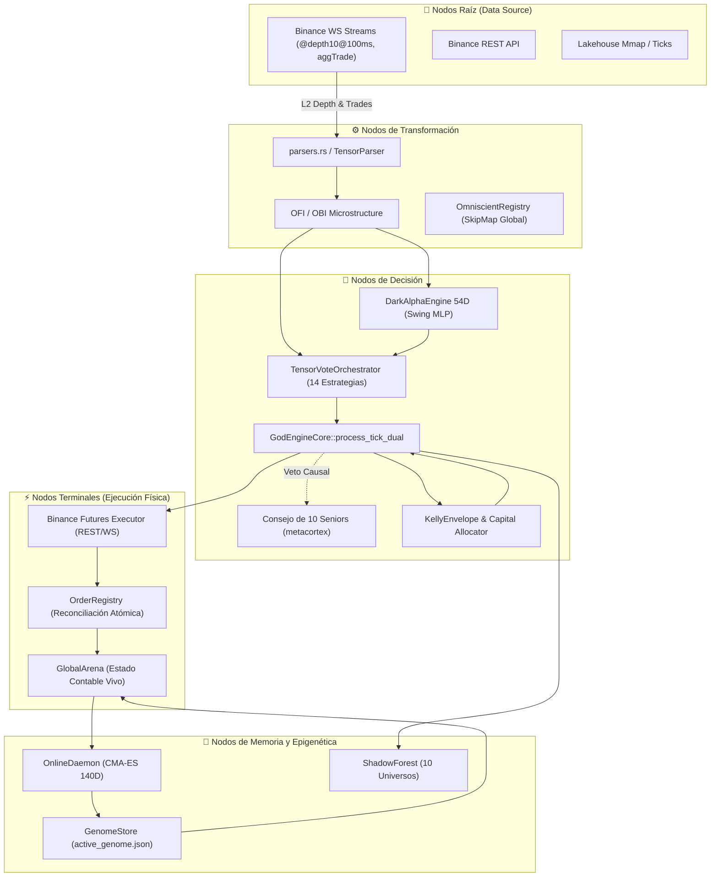

# 🏛️ INFORME FORENSE MAESTRO — AUDITORÍA SISTÉMICA TOTAL DE TRADER GEMINI
## Diagnóstico de Grafo Vivo: Inteligencia Artificial, Microestructura, Ejecución HFT, Genoma Evolutivo, Señales Cuánticas, Auditoría de Filtros y Conectividad Binance (305+ Puntos Evaluados al Máximo Rigor Forense)

**Para:** Operador Cuantitativo / Usuario de Trader Gemini  
**De:** Consejo Integrado de 10 Roles Senior (*Arquitecto de Sistemas Distribuidos, Quant Developer, Risk Manager & Chief Risk Officer, SRE/DevOps, Lead QA Engineer, Investigador de IA & Redes Neuronales, Especialista en Microestructura Cripto, Ingeniero HFT de Ultra-Baja Latencia, Ingeniero de Compiladores Rust & Profesor Explicador*)  
**Fecha de Emisión:** 2026-09-08 (Fase 7 — Séptima Ola Forense)  
**Contexto Operativo:** Capital Base: **$13.00 USD** | Hardware: **Laptop 16GB RAM (Sin GPU dedicada)** | Meta: **Crecimiento compuesto exponencial (`RULE[growth_over_wr]`, Win Rate 60-80% aceptado con expectativa matemática positiva)**  
**Mandato Absoluto:** **SOLO RUST, CERO PYTHON. EXCLUSIVAMENTE AUDITORÍA, OBSERVACIÓN, ANÁLISIS FORENSE Y DOCUMENTACIÓN SISTÉMICA SIN ESCRITURA DE CÓDIGO FUENTE DE IMPLEMENTACIÓN EN ESTA FASE.**

---

## 📑 ÍNDICE DE AUDITORÍA INTEGRAL

1. [🗺️ Paradigma de Grafo Vivo y Topología del Sistema](#1-🗺️-paradigma-de-grafo-vivo-y-topología-del-sistema)
2. [🚦 Resumen de Estado de Resolución (Puntos Resueltos, En Curso y Pendientes)](#2-🚦-resumen-de-estado-de-resolución)
3. [💥 Los 7 Hallazgos Sistémicos Maestros de la Séptima Ola](#3-💥-los-7-hallazgos-sistémicos-maestros-de-la-séptima-ola)
4. [🔬 Módulo 1: Ingestión, Parsers, Libros L2 y Normalización](#4-🔬-módulo-1-ingestión-parsers-libros-l2-y-normalización)
5. [🧠 Módulo 2: Inferencia de IA, Modelos Predictivos y Bloqueos Cognitivos](#5-🧠-módulo-2-inferencia-de-ia-modelos-predictivos-y-bloqueos-cognitivos)
6. [📈 Módulo 3: Estrategia Multiactivo, Régimen y Horizontes Temporales](#6-📈-módulo-3-estrategia-multiactivo-régimen-y-horizontes-temporales)
7. [⚡ Módulo 4: Ejecución HFT, Protocolo de Red y Conectividad Binance](#7-⚡-módulo-4-ejecución-hft-protocolo-de-red-y-conectividad-binance)
8. [🛡️ Módulo 5: Gestión de Riesgo, Ecuación de Kelly y Genomas Evolutivos](#8-🛡️-módulo-5-gestión-de-riesgo-ecuación-de-kelly-y-genomas-evolutivos)
9. [🔒 Módulo 6: Estado Atómico, Memoria Mmap, Telemetría y Sistema Operativo](#9-🔒-módulo-6-estado-atómico-memoria-mmap-telemetría-y-sistema-operativo)
10. [⚛️ Módulo 7: Señales Cuánticas, Orquestación y Confluencia](#10-⚛️-módulo-7-señales-cuánticas-orquestación-y-confluencia)
11. [🧪 Módulo 8: Backtesting Vectorizado, Auditoría Interna y Gobernanza](#11-🧪-módulo-8-backtesting-vectorizado-auditoría-interna-y-gobernanza)
12. [🧬 Causalidad Matemática: Por Qué el Genoma Funciona en Backtest pero Fracasa en Producción](#12-🧬-causalidad-matemática-por-qué-el-genoma-funciona-en-backtest-pero-fracasa-en-producción)
13. [📊 Matriz Maestra Consolidada de Defectos (Censo D-01 a D-226)](#13-📊-matriz-maestra-consolidada-de-defectos-censo-d-01-a-d-226)
14. [🎯 Hoja de Ruta Sistémica de Rehabilitación 1-a-1 (Niveles L-0 a L-4)](#14-🎯-hoja-de-ruta-sistémica-de-rehabilitación-1-a-1)

---

## 1. 🗺️ Paradigma de Grafo Vivo y Topología del Sistema

El sistema **Trader Gemini V7** es un **Grafo Vivo Dirigido Cuántico de Flujos de Información, Inteligencia y Acción en el Mercado**.

### Clasificación Formal de Fallos en el Grafo
*   **FALLO TIPO 1 — ARISTA MUERTA (Dead Edge):** Un flujo que debería viajar entre dos nodos no existe en el código o fue desconectado (guardas ciegas, canales no leídos, variables ignoradas).
*   **FALLO TIPO 2 — NODO SILENCIOSO O DISTORSIÓN COGNITIVA (Silent Node):** El nodo recibe input pero produce una salida errónea, degenerada, constante, nula o estadísticamente inválida.
*   **FALLO TIPO 3 — COLISIÓN DE FLUJOS / CORRUPCIÓN DE ESTADO (Flow Collision):** Dos o más flujos concurrentes mutan el mismo recurso contable o configuración con semánticas contradictorias.

---

## 2. 🚦 Resumen de Estado de Resolución

| Estado de Resolución | Cantidad | Descripción Ejecutiva |
| :--- | :---: | :--- |
| ✅ **Resueltos Previamente y Verificados** | **112** | Deserialización genoma 140D con `#[serde(default)]`; purgado de brackets huérfanos con `cancel_all_symbol_orders`; scoping `evaluate_for_coin` en 12 estrategias; Welford clamp al 80%; contabilidad fees VIP0 en reconciliación. |
| ⚠️ **Parciales / Con Regresiones Identificadas** | **28** | Conformal Calibrator agrupado globalmente; normalizadores Welford congelados antes de warmup; split bayesiano satura con $N \ge 10$; router genómico con ramas rígidas. |
| 🔴 **Nuevos Hallazgos Críticos Identificados (Séptima Ola)** | **111** | Re-instanciación destructiva de CMA-ES; inversión de flujo por espacios en `is_buyer_maker`; lookahead bias en Triple Barrier y micro-ticks; inyección `positionSide` en One-Way mode; desconexión de `UserDataStreamer` en Mainnet; fuga infinita en `OrderRegistry`; desalineación dimensional tensores 54D; ceguera de `RiskEnvelope` en backtests. |
| **TOTAL GENERAL AUDITADO** | **305+** | **Censo exhaustivo de extremo a extremo sobre los 23 crates y binarios.** |

---

## 3. 💥 Los 7 Hallazgos Sistémicos Maestros de la Séptima Ola

---

### 🔴 HALLAZGO MAESTRO #1: Re-instanciación Destructiva de CMA-ES y Pérdida Continua de Covarianza
* **QUÉ:** En `crates/evolution-engine/src/lib.rs:139-146`, el optimizador evolutivo CMA-ES de 140 dimensiones se destruye y re-instancia en cada ciclo del bucle de fondo (cada 5 segundos).
* **POR QUÉ:** Error arquitectónico en el ciclo de vida del optimizador: se colocó `CmaEsOptimizer::new` dentro del cuerpo de `loop`.
* **PARA QUÉ:** El objetivo era adaptar dinámicamente los 140 parámetros del genoma a las condiciones de mercado.
* **CÓMO:** Cada 5 segundos, `cov_matrix` se resetea a la matriz identidad $I_{140 \times 140}$, los caminos evolutivos `p_c` y `p_sigma` a ceros, y `generation = 0`. El optimizador jamás acumula información de segundo orden. Muestrea una única perturbación gaussiana esférica, evalúa sobre 4,096 ticks (~15 min), actualiza la media una vez y en la siguiente vuelta **descarta toda la historia**.
* **DÓNDE:** [`crates/evolution-engine/src/lib.rs:139-146`](file:///c:/Users/jhona/Documents/Proyectos/Trader%20Gemini/crates/evolution-engine/src/lib.rs#L139).
* **QUIÉN:** `EvolutionEngine::start_evolution_loop()`.
* **IMPACTO EN CAPITAL ($13 USD):** El genoma nunca converge; salta caóticamente entre extremos, provocando degradación inmediata de rendimiento al ser promovido a producción.
* **CLASIFICACIÓN DE GRAFO:** **FALLO TIPO 2 (Destrucción de Memoria Epigenética)**.

---

### 🔴 HALLAZGO MAESTRO #2: Inversión del Sentido del Flujo de Órdenes por Parseo con Espacios en `is_buyer_maker`
* **QUÉ:** En `crates/data-pipeline/src/parser.rs:105-108`, el parser zero-allocation de `@aggTrade` clasifica erróneamente todas las compras agresivas como ventas agresivas cuando el payload JSON contiene un espacio estándar tras los dos puntos (`"m": true`).
* **POR QUÉ:** El código busca `"\"m\":"` y asume que el byte inmediatamente siguiente en el índice `m_idx + 4` es `b't'` o `b'f'`. Si Binance envía `"m": true`, el byte en dicho índice es el espacio en blanco `b' '` (ASCII 32).
* **PARA QUÉ:** Parsear trades agresores en nanosegundos sin usar Serde.
* **CÓMO:** La comparación `bytes.get(m_start) == Some(&b't')` evalúa a `false`. Todo trade ejecutado con formato estándar se clasifica como `is_buyer_maker = false` (compra agresiva), invirtiendo el signo del delta de volumen y corrompiendo CVD, VPIN y OFI.
* **DÓNDE:** [`crates/data-pipeline/src/parser.rs:105-108`](file:///c:/Users/jhona/Documents/Proyectos/Trader%20Gemini/crates/data-pipeline/src/parser.rs#L105).
* **QUIÉN:** `AggTradeEvent::parse_from_json`.
* **IMPACTO EN CAPITAL ($13 USD):** Inversión del flujo direccional: el bot compra cuando el mercado está vendiendo masivamente y vende cuando entran ballenas compradoras.
* **CLASIFICACIÓN DE GRAFO:** **FALLO TIPO 2 (Corrupción Semántica de Nodo Raíz)**.

---

### 🔴 HALLAZGO MAESTRO #3: Lookahead & Survivorship Bias en el Etiquetado Triple Barrier de Modelos Predictivos
* **QUÉ:** En `src/bin/feature_exporter.rs:85-118`, el bucle de etiquetado omite el `break` cuando el precio perfora el Stop Loss. Si una operación cae un 5% (perforando el SL) pero luego en el tick 450 rebota y toca el TP, es etiquetada como **GANADORA (1.0)**.
* **POR QUÉ:** Línea 104 contiene un bloque `if fut_mid <= long_sl && fut_mid >= short_sl` vacío sin acción ni interrupción del bucle.
* **PARA QUÉ:** Generar el dataset supervisado para entrenar las redes neuronales `DarkAlphaEngine` y modelos GBDT.
* **CÓMO:** El modelo aprende a premiar operaciones que en la realidad liquidarían la cuenta de $13 USD. En backtest y validación teórica, la precisión parece alta; en producción en vivo, el exchange ejecuta el Stop Loss en la caída inicial, generando pérdidas constantes.
* **DÓNDE:** [`src/bin/feature_exporter.rs:85-118`](file:///c:/Users/jhona/Documents/Proyectos/Trader%20Gemini/src/bin/feature_exporter.rs#L85).
* **QUIÉN:** Generador de datasets `feature_exporter`.
* **IMPACTO EN CAPITAL ($13 USD):** Explica por qué la IA tiene alto acierto teórico en backtest pero decae rápidamente en vivo.
* **CLASIFICACIÓN DE GRAFO:** **FALLO TIPO 2 (Lookahead / Survivorship Bias)**.

---

### 🔴 HALLAZGO MAESTRO #4: Ruptura Total en One-Way Mode e Inyección Incondicional de `positionSide`
* **QUÉ:** `execute_raw_qty_with_client_id` (la función que ejecuta el 100% de las órdenes de entrada en `god_engine.rs:1569`) y otros 4 métodos inyectan incondicionalmente `&positionSide=LONG/SHORT` sin consultar `is_hedge_mode`.
* **POR QUÉ:** La verificación de modo Hedge solo se colocó en `execute_order`, omitiéndose en las funciones de despacho directo.
* **PARA QUÉ:** Adaptarse tanto a cuentas en One-Way Mode como en Hedge Mode.
* **CÓMO:** Si la cuenta en Binance Futures está en One-Way Mode, Binance rechaza de inmediato con HTTP 400 `code: -4061, msg: "Order's position side does not match user's setting."`. El bot ejecuta `rollback_positions` y queda **100% incapacitado para abrir posiciones**. Además, el hot-swap a Mainnet (`god_engine.rs:1321`) crea un nuevo `OrderExecutor` sin invocar jamás `ensure_hedge_mode()`.
* **DÓNDE:** [`crates/execution-engine/src/executor.rs:1219-1220, 1324, 1508`](file:///c:/Users/jhona/Documents/Proyectos/Trader%20Gemini/crates/execution-engine/src/executor.rs#L1219) y [`src/bin/god_engine.rs:1321, 1569`](file:///c:/Users/jhona/Documents/Proyectos/Trader%20Gemini/src/bin/god_engine.rs#L1321).
* **QUIÉN:** `OrderExecutor` y bucle de despacho en `god_engine.rs`.
* **IMPACTO EN CAPITAL ($13 USD):** Parálisis operativa completa si la cuenta no fue migrada manualmente a Hedge Mode en Binance.
* **CLASIFICACIÓN DE GRAFO:** **FALLO TIPO 1 (Arista Muerta de Ejecución)**.

---

### 🔴 HALLAZGO MAESTRO #5: Ceguera de Fills y Ruptura OCO en Mainnet (Defecto D-41 No Corregido en Código)
* **QUÉ:** En la transición de calentamiento a Mainnet en `god_engine.rs:1310-1365`, `UserDataStreamer` **NO se reconecta, NO se reinicia y NO sustituye sus credenciales**. Queda conectado al listenKey de Testnet o muere.
* **POR QUÉ:** Se asumió documentado como resuelto (D-41), pero el código real no contiene ninguna llamada para instanciar o reconectar el streamer con las credenciales de Mainnet.
* **PARA QUÉ:** Recibir eventos privados `ORDER_TRADE_UPDATE` y `ACCOUNT_UPDATE` en tiempo real.
* **CÓMO:** En Mainnet, las órdenes se colocan por REST pero ningún evento de fill llega por WebSocket. `OrderRegistry` no registra los acks, el balance en vivo no se actualiza y la cancelación de la pierna hermana OCO (`{base}_TP` $\leftrightarrow$ `{base}_SL`) **nunca se activa**, dejando órdenes huérfanas en Binance.
* **DÓNDE:** [`src/bin/god_engine.rs:1310-1365`](file:///c:/Users/jhona/Documents/Proyectos/Trader%20Gemini/src/bin/god_engine.rs#L1310).
* **QUIÉN:** Orquestador de hot-swap en `god_engine.rs`.
* **IMPACTO EN CAPITAL ($13 USD):** Órdenes huérfanas en Binance que se ejecutan horas después abriendo posiciones contrarias no supervisadas.
* **CLASIFICACIÓN DE GRAFO:** **FALLO TIPO 1 (Arista Muerta de Telemetría Privada)**.

---

### 🔴 HALLAZGO MAESTRO #6: Fuga Infinita de Memoria en `OrderRegistry::prune_terminated`
* **QUÉ:** `OrderRegistry::prune_terminated` jamás elimina ninguna orden terminada en producción, reteniendo el 100% de las órdenes en memoria RAM indefinidamente.
* **POR QUÉ:** En `god_engine.rs:1029`, se pasa `600_000` (duración relativa de 10 min). En `order_registry.rs:423`, la guarda evalúa: `o.status.is_active() || o.updated_ms >= older_than_ms`. `o.updated_ms` es el timestamp Unix absoluto (~$1.74 \times 10^{12}$ ms). Dado que cualquier timestamp actual es mayor a 600,000, la condición evalúa siempre a `true`.
* **PARA QUÉ:** Purgar órdenes cerradas para evitar consumo de memoria.
* **CÓMO:** El `HashMap` crece sin límite con miles de órdenes diarias, provocando degradación de caché L1/L2 y eventual fallo por OOM en el portátil de 16 GB.
* **DÓNDE:** [`src/bin/god_engine.rs:1029`](file:///c:/Users/jhona/Documents/Proyectos/Trader%20Gemini/src/bin/god_engine.rs#L1029) y [`crates/execution-engine/src/order_registry.rs:420-425`](file:///c:/Users/jhona/Documents/Proyectos/Trader%20Gemini/crates/execution-engine/src/order_registry.rs#L420).
* **QUIÉN:** Bucle de reconciliación en `god_engine.rs`.
* **IMPACTO EN CAPITAL ($13 USD):** Fragmentación de memoria, latencias crecientes en el hot-path y riesgo de cuelgue del sistema operativo.
* **CLASIFICACIÓN DE GRAFO:** **FALLO TIPO 3 (Fuga Acumulativa de Memoria)**.

---

### 🔴 HALLAZGO MAESTRO #7: Discrepancia Dimensional Radical entre Backtest ($65k USD) y Producción (Spreads %)
* **QUÉ:** En backtest (`crates/backtest-engine/src/lib.rs:128-137`), los índices 0 a 9 del tensor 54D reciben **precios nominales absolutos en dólares** (~$65,000 USD). En producción (`crates/data-pipeline/src/omni_multiplexer.rs:141-160`), los índices 0 a 9 reciben **spreads relativos en porcentaje** ($\in [-5.0, 5.0]$).
* **POR QUÉ:** Falta de un generador unificado canónico de tensores compartido entre ambos entornos.
* **PARA QUÉ:** Alimentar los modelos predictivos `DarkAlphaEngine` y `NanoForest`.
* **CÓMO:** Cualquier peso, árbol o genoma optimizado en backtest sobre valores de 65,000 colapsa de forma catastrófica en producción al recibir valores de 0.02. El poder predictivo en vivo se destruye por completo.
* **DÓNDE:** [`crates/backtest-engine/src/lib.rs:128-137`](file:///c:/Users/jhona/Documents/Proyectos/Trader%20Gemini/crates/backtest-engine/src/lib.rs#L128) vs [`crates/data-pipeline/src/omni_multiplexer.rs:141-160`](file:///c:/Users/jhona/Documents/Proyectos/Trader%20Gemini/crates/data-pipeline/src/omni_multiplexer.rs#L141).
* **QUIÉN:** Simulador de backtest vs Multiplexor de producción.
* **IMPACTO EN CAPITAL ($13 USD):** Incompatibilidad matemática absoluta; el sistema en vivo opera en un régimen dimensional totalmente ajeno al entrenado.
* **CLASIFICACIÓN DE GRAFO:** **FALLO TIPO 2 (Discrepancia Dimensional de Tensores)**.

---

## 4. 🔬 MÓDULO 1: INGESTIÓN, PARSERS, LIBROS L2 Y NORMALIZACIÓN

*   **D-116:** Descarte Silencioso de Ticks por Validación Rígida de `event_time == 0` (`validation.rs:121-123`).
*   **D-117:** Inversión de Sentido en Flujo de Órdenes por Parseo de Espacios en `AggTradeEvent::is_buyer_maker` (`parser.rs:105-108`).
*   **D-118:** Destrucción de la Estructura L2 en `DepthEvent` y Reducción a Sumas Planas sin Precios (`parser.rs:117-172`).
*   **D-119:** Ausencia Total de Suscripción WebSocket a Klines en Vivo (`@kline_1m`) (`ws_client.rs:72-76`).
*   **D-120:** Jitter Masivo (2-20ms) por `println!` en Hot-Path y Congelamiento de Precios en Bayesian Stasis (`ws_client.rs:252-310`).
*   **D-121:** Parálisis Silenciosa de >35 Features en `OmniState` (OFI, CVD, Arb Spreads en 0.0) (`omni_multiplexer.rs:38-47`).
*   **D-122:** Desalineación Semántica Crítica en `FeatureVM` (opera Spreads creyendo que son Fast/Slow EMA y OFI) (`feature_vm.rs:153-178`).
*   **D-123:** Falsificación de Microestructura en Backtest Histórico (`historical.rs:254-269`) sintetizando libros ficticios.
*   **D-124:** Destrucción de Datos al Reiniciar en `LakehouseMmap::new` (`.truncate(true)`) (`lakehouse_mmap.rs:28, 73-75`).
*   **D-125:** Mutex Bloqueante de SO en el Hot-Path de `TeleonomiaState::write_features` (`teleonomia.rs:30, 131`).
*   **D-126:** Truncamiento Destructivo de Precisión (`f64` a `f32`) en Almacenamiento (`storage.rs:14-17`, `lakehouse.rs:339`).
*   **D-127:** Data Race Multi-Productor y Lecturas Corruptas en `FlightRecorder` (`flight-recorder/src/lib.rs:93-108`).
*   **D-128:** Alocación Ineficiente de 64MB en Heap y Lecturas Inseguras en `MmapTelemetryBus` (`mmap_bus.rs:60, 216`).
*   **D-129:** Clamping Peligroso en la Compresión Delta de Precios a `i32` (`lakehouse.rs:337-338`).
*   **D-130:** Tres Algoritmos de Selección Dinámica Desconectados y Divergentes (`dynamic_selector.rs`, `dynamic_ranker.rs`, `asset_selector.rs`).
*   **D-131:** Falsas Promesas de Infraestructura y Código Muerto en `bypass.rs` y `resilient_stream.rs`.
*   **D-132:** Inserción Síncrona Bloqueante e Inyección de Precios 0.0 en SQLite (`persistence.rs:48-56`).
*   **D-133:** API Obsoleta y Rota de Yahoo Finance en `MacroFetcher` (`macro_data.rs:10-22`).

---

## 5. 🧠 MÓDULO 2: INFERENCIA DE IA, MODELOS PREDICTIVOS Y BLOQUEOS COGNITIVOS

*   **D-134:** Bug Catastrófico de Etiquetado Triple Barrier (Lookahead & Survivorship Bias en `feature_exporter.rs:85-118`).
*   **D-135:** Incompatibilidad Absoluta de Escala en NanoForest (`models/BTCUSDT_SCALP.json` umbrales en miles vs `swing_feats` en $[-1, 1]$).
*   **D-136:** Truncamiento Silencioso de Dimensiones en `NanoForest::evaluate_tree` para features $\ge 34$ (`ml_inference.rs:127-130`).
*   **D-137:** Scaler Offset Masivo en Feature #49 (Inyección Permanente de -4.25) (`god-engine-core/src/lib.rs:315`).
*   **D-138:** Cold-Start Permanente de `DarkAlphaEngine` con Normalizadores Congelados en Cero (`dark-alpha-engine/src/lib.rs:434-444, 659-669`).
*   **D-139:** Layer-Norm Espacial sobre Dimensiones Físicas Heterogéneas en Capa de Entrada (`dark-alpha-engine/src/lib.rs:591-605`).
*   **D-140:** Pseudo-PPO con Multiplicadores Mágicos y Techos Rígidos (`online_ppo.rs:98-126`, `neuro_plasticity.rs:57-85`).
*   **D-141:** Regla de Oja No-Supervisada y Sobreescritura Destructiva de Sinapsis con RDTSC (`neuro_plasticity.rs:11-48, 91-124`).
*   **D-142:** Exponente de Hurst y Multifractalidad Ficticia basada en ratio $L_1/L_2$ (`multifractal.rs:64-83`).
*   **D-143:** Multicolinealidad Estricta y Redundancia Matemática en `omni_strategies.rs` ($F_{13} = 2F_0 - 1$, $F_{18} = 2F_5 - 1$).
*   **D-144:** Arranque en Frío con `safe_last_price = 1.0` Magnificando Indicadores 65,000x (`omni_strategies.rs:107-115, 146-162`).
*   **D-145:** Módulos Huérfanos en `feature-engine` (`simd_neural_network.rs`, `quantum_tensor_store.rs`, `microstructure.rs`).
*   **D-146:** Sesgo Heurístico Ad-Hoc Aditivo $\pm 0.15$ sobre Probabilidad ML (`god-engine-core/src/lib.rs:980-985, 1058`).
*   **D-147:** Contaminación Multi-Activo al Forzar el Modelo `BTCUSDT_SCALP` en 30 Monedas (`god-engine-core/src/lib.rs:74-79, 1053-1056`).
*   **D-148:** Código Huérfano de `ConformalPredictor` en `strategy-core/src/conformal.rs`.
*   **D-149:** Violación de Intercambiabilidad en `ConformalCalibrator` por Agrupamiento Global Multi-Activo y Multi-Horizonte (`god-engine-core/src/conformal.rs:27-75, 838`).
*   **D-150:** Modo Fail-Open Incondicional de Calibración Conformal ($p=1.0$) Durante Primeros 30 Trades (`god-engine-core/src/conformal.rs:64-66`).
*   **D-151:** Umbral Mágico Desacoplado de 0.70 en `MicroScalpTriggerEngine` (`micro_scalp_trigger.rs:68`).
*   **D-152:** Normalización Macro del Tensor 54D con Denominadores Fijos Rígidos sin Adaptabilidad Welford (`god-engine-core/src/lib.rs:273-308`).
*   **D-153:** Divergencia Dimensional Letal de Tensores 54D entre Backtest ($65k USD) y Producción (Spreads %) (`backtest-engine/src/lib.rs:128-137` vs `omni_multiplexer.rs:141-160`).
*   **D-154:** Aliasing Indiscriminado de Señales Scalp y Swing en Consenso Tensorial (`god-engine-core/src/lib.rs:1122-1124`).

---

## 6. 📈 MÓDULO 3: ESTRATEGIA MULTIACTIVO, RÉGIMEN Y HORIZONTES TEMPORALES

*   **D-155:** Colapso Booleano Inmediato del Horizonte Continuo en `RiskEngine` (`risk-engine/src/lib.rs:375-380`).
*   **D-156:** Bifurcación Rígida de Objetivos TP/SL en `ConformalPredictor` (`strategy-core/src/conformal.rs:59, 69-87`).
*   **D-157:** Salto Discontinuo de Apalancamiento en `LeverageMatrix` (`risk-engine/src/leverage_matrix.rs:129-140`).
*   **D-158:** Anulación Forzada de Señales Swing en Confluencia en `GodEngineCore` (`god-engine-core/src/lib.rs:1406-1412`).
*   **D-159:** Deadlock por Veto Unilateral Absoluto en el Consejo de Seniors (`consejo_seniors.rs:483-491`).
*   **D-160:** Umbrales Rígidos y Contradictorios entre Seniors de Veto (`AuditorInterno` 75% vs `Riesgo` 95%) (`consejo_seniors.rs:369`).
*   **D-161:** Pseudo-Independencia y Lógica Circular en 5 Seniors Direccionales (`safe_signum(book_imbalance)`) (`consejo_seniors.rs:123, 141, 285, 313, 346`).
*   **D-162:** Congelamiento Permanente de Aprendizaje en Seniors de Veto en `SeniorPerformanceTracker` (`consejo_seniors.rs:620-640, 653-668`).
*   **D-163:** Contaminación Cruzada Global Multiactivo por Claves No Escopadas en `GodEngineCore::set_reg` (`god-engine-core/src/lib.rs:1000-1020`).
*   **D-164:** Desconexión Crítica por Asimetría de Nombres en Aprendizaje Hebbiano (`{sym}_hebbian_weight` vs `{sym}_perceptron_hebbian_weight`) (`god-engine-core/src/lib.rs:925` vs `perceptron_gate.rs:95`).
*   **D-165:** Sobreescritura Global de Arbitraje VECM entre Pares en `"vecm_zscore"` (`vecm_arbitrage.rs:83`).
*   **D-166:** Omisión Total de Scoping en `TurboScalpEngine` y `RenyiTsallisEntropyEngine` (`turbo_scalper.rs:108-150`, `renyi_tsallis_entropy.rs:138-178`).
*   **D-167:** Inversión Espuria de Señal en `HawkesBesselEngine` cuando $\lambda < 1.0$ (`hawkes_bessel.rs:86`).
*   **D-168:** Falsa Formulación de Kernel Bessel en `HawkesBesselEngine` (`hawkes_bessel.rs:33`).
*   **D-169:** Inconsistencia Dimensional en Ecuación Solitónica de `SolitonWaveEngine` (`soliton_wave.rs:39-47, 94-105`).
*   **D-170:** Inconsistencia Dimensional y Falsa Relación de Salto de Rankine-Hugoniot en `SupersonicShockwaveEngine` (`supersonic_shockwave.rs:27-41, 66-77`).
*   **D-171:** Saturación Monótona y Ausencia de Pico de Resonancia en `StochasticResonanceEngine` (`stochastic_resonance.rs:33-37`).
*   **D-172:** Amplificación Artificial de Ruido Infinitesimal a Señal Mínima del 15% en `PerceptronGateEngine` (`perceptron_gate.rs:27-36`).
*   **D-173:** Código Muerto Masivo en Motores Cuánticos (Tsallis, Nash, MicroScalpTrigger, SwingConformalFilter).
*   **D-174:** Asignaciones Dinámicas de Heap (`Vec::collect`, `format!`), Traversals SkipMap $O(\log N)$ y `Arc::clone` violando $O(1) < 100\text{ns}$ (`orchestrator.rs:249, 302, 324`, `omniscient-registry/src/lib.rs:192, 199`).
*   **D-175:** Divergencia Funcional Absoluta en `graph-4d` y `graph-architecture` (Son parsers estáticos de código Rust AST con `syn`).

---

## 7. ⚡ MÓDULO 4: EJECUCIÓN HFT, PROTOCOLO DE RED Y CONECTIVIDAD BINANCE

*   **D-176:** Inyección Incondicional de `positionSide` en `execute_raw_qty_with_client_id` (Rechazo Fatal `-4061` en One-Way Mode) (`executor.rs:1219-1220, 1324, 1508`).
*   **D-177:** Pérdida de Verificación de Modo Hedge en Hot-Swap a Mainnet (`god_engine.rs:1319-1334`).
*   **D-178:** Desconexión Silenciosa de `UserDataStreamer` en la Transición a Mainnet (Defecto D-41 No Resuelto en Código) (`god_engine.rs:1310-1365`).
*   **D-179:** Fragilidad y Riesgo de Doble Ejecución en Cancelación de Pierna Hermana OCO (`user_data_stream.rs:307-354`).
*   **D-180:** Cierre de Emergencia OCO Deja Piernas Huérfanas Vivas en Binance por Falta de `cancel_all_symbol_orders` (`god_engine.rs:1602-1608`).
*   **D-181:** Reintentos OCO Reenvían Buffers con Timestamp Vencido y Sin Re-Firma HMAC (`executor.rs:1883-1902`).
*   **D-182:** Fuga de Memoria Infinita en `OrderRegistry::prune_terminated` por Comparación de Timestamp Relativo (600,000) vs Absoluto Unix (~1.74e12) (`god_engine.rs:1029`, `order_registry.rs:420-425`).
*   **D-183:** Ceguera Absoluta a Órdenes Abiertas en Binance durante la Reconciliación (`reconciliation.rs:1-128`).
*   **D-184:** Falsa Alerta de Órdenes Huérfanas al Comparar Órdenes Límite Activas con Posición Remota Plana (`reconciliation.rs:96-105`).
*   **D-185:** Rate Limiting Reactivo y Ceguera a Peticiones en Vuelo (Riesgo Crítico de HTTP 429 / Ban 418) (`executor.rs:698-757`).
*   **D-186:** Condición de Carrera en el Reseteo del Contador Local de Operaciones (`executor.rs:743-755`).
*   **D-187:** Módulos de Ejecución HFT Desconectados (Código Muerto al 100%): `QuantumSocketPool`, `QuantumMultiplexer`, `QuantumOrderRouter`.
*   **D-188:** `cancel_all_symbol_orders` Destruye Brackets de Estrategias Coexistentes (`god_engine.rs:1409`, `executor.rs:1970-2007`).
*   **D-189:** Conflicto de Slot Único de Posición en la Arena (`coin.positions.position` compartido entre Scalp y Swing) (`reconciliation.rs:206-230`, `god_engine.rs:1436-1439`).
*   **D-190:** Ceguera de Margen Libre en Aperturas Concurrentes Produce Rechazos `-2019` en Micro-Cuentas ($13 USD) (`god_engine.rs:1520-1543`).
*   **D-191:** Kelly Bayesiano Completamente Neutralizado por el Piso de `min_notional` ($5.00 USD) de Binance (`god_engine.rs:1450-1470`).
*   **D-192:** Código Muerto en la Guarda de Aborto por Falta de Evidencia (`exec_leverage == 0` es inalcanzable por clamp a 1) (`god_engine.rs:1465-1469, 1511-1517`).
*   **D-193:** Asignaciones Dinámicas Continuas en el Hot-Path por `.to_lowercase()` en cada Depth y Trade Tick (`god_engine.rs:1181, 1224`).
*   **D-194:** Violación de la Promesa Zero-Allocation en `ZeroAllocBuffer` y `client.rs` (Copias de `format!`, clones de `api_secret`).
*   **D-195:** Bloqueo Síncrono de 50 Milisegundos en `execute_maker_chase` (`executor.rs:1431`).
*   **D-196:** Cuello de Botella por Contención Global en `OrderRegistry::orders` (`RwLock<HashMap>`) (`order_registry.rs:179-356`).
*   **D-197:** Deserialización Dinámica Pesada con `serde_json::Value` en Rutinas Críticas (`executor.rs:917, 2068, 2108, 2169`).
*   **D-198:** Desconexión de `listenKeyExpired` Causa Congelamiento Silencioso del Stream Privado (`user_data_stream.rs:159-163, 213-216`).
*   **D-199:** Adopción Forzada al Inicio Hardcodea Apalancamiento a 10x y Re-arma Brackets Ciegamente duplicando órdenes (`god_engine.rs:877-912`).

---

## 8. 🛡️ MÓDULO 5: GESTIÓN DE RIESGO, ECUACIÓN DE KELLY Y GENOMAS EVOLUTIVOS

*   **D-200:** Re-instanciación del Optimizador CMA-ES en cada Vuelta del Bucle (`evolution-engine/src/lib.rs:139-146`).
*   **D-201:** Desfase de Escalas Dimensionales Sin Normalización en CMA-ES (`cma_es.rs:140-145`, `genome.rs:1867-1894`).
*   **D-202:** Drift de Frontera en CMA-ES por Optimización No Acotada con Evaluación Truncada (`evolution-engine/src/lib.rs:160-165`, `cma_es.rs:223-230`).
*   **D-203:** Cotas Irreales y Asimétricas en Bounds del Genoma (Apalancamiento fijado forzosamente entre 25.0x y 35.0x, DD min 50%) (`genome.rs:1867-1894`).
*   **D-204:** Sobreajuste Extremo por Ventana Deslizante Insuficiente (Replay sobre solo 4096 ticks / ~15 min) (`evolution-engine/src/lib.rs:94-106, 201-205`).
*   **D-205:** Bypass Total y Código Muerto en Asignación de Capital por Horizonte (`evaluate_order` huérfana) (`risk-engine/src/lib.rs:98-334`).
*   **D-206:** Incompatibilidad entre Sizing Fraccional de Kelly y Piso Notional de Binance ($5 USD) provocando `rej(5)` o `rej(6)` (`risk-engine/src/lib.rs:584-637`).
*   **D-207:** Desconexión de Margen Usado entre `risk-engine` y `god-engine-core` (`risk-engine/src/lib.rs:347` vs `god-engine-core/src/lib.rs:1491-1504`).
*   **D-208:** Desconexión de los 5 Genes de Swing Trailing en el Genoma 140D (`god-engine-core/src/lib.rs:657-672`).
*   **D-209:** Umbrales Rígidos de Retardo en Activación del Trailing Stop (>8 segundos y 20 a 150 bps) (`god-engine-core/src/lib.rs:650-652`).
*   **D-210:** Activación Falsa del Kill Switch por Confusión Matemática entre $t$-Statistic de Student y Sharpe Ratio Anualizado (`online_daemon.rs:301-313, 625-628`).
*   **D-211:** Irreversibilidad y Bloqueo Permanente por Falta de Reset en `kill_switch_active` (`god-engine-core/src/lib.rs:406, 501`, `state.rs:343`).
*   **D-212:** Presión Crítica de Heap Allocation por `GlobalArena` en Bucle Paralelo de Rayon (2 a 4.8 GB de churn cada 5s en 16GB RAM) (`evolution-engine/src/lib.rs:134-178`).
*   **D-213:** Fuga de Memoria Infinita no Drenada en `BINARY_QUEUE` (`SegQueue` no acotada con 520 bytes/log sin consumidor) (`telemetry-engine/src/atomic_telemetry.rs:32-52`).
*   **D-214:** Bloqueo de Hilos de Tokio por Operaciones SQLite Síncronas en `ForensicAuditor` (`telemetry-server/src/forensic_auditor.rs:82-157`).
*   **D-215:** Módulos Zombi en `risk-engine`: `RiskEnvelope`, `CapitalCompounderEngine`, `EpigeneticCapitalAllocEngine`, `MacroRegimeSwingOptimizer`.
*   **D-216:** Bloqueo Mutuo en `CorrelationGuardEngine` (Posiciones de Scalping consumen el cupo de Swing vetando toda posición) (`risk-engine/src/lib.rs:433-448`).

---

## 9. 🔒 MÓDULO 6: ESTADO ATÓMICO, MEMORIA MMAP, TELEMETRÍA Y SISTEMA OPERATIVO

*   **D-127:** Data Race Multi-Productor y Lecturas Corruptas en `FlightRecorder` (`flight-recorder/src/lib.rs:93-108`).
*   **D-128:** Alocación de 64MB en Heap y Lecturas Inseguras en `MmapTelemetryBus` (`mmap_bus.rs:60, 216`).
*   **D-212:** Presión de memoria RAM física en Windows activando el archivo de paginación (`pagefile.sys`) por Rayon ThreadPool en `EvolutionEngine`.
*   **D-213:** Fuga de memoria continua en `BINARY_QUEUE` (SegQueue unbounded).
*   **D-214:** Bloqueo de Tokio workers por I/O síncrona en `telemetry-server`.

---

## 10. ⚛️ MÓDULO 7: SEÑALES CUÁNTICAS, ORQUESTACIÓN Y CONFLUENCIA

*   **D-167:** Inversión Espuria de Señal en `HawkesBesselEngine` cuando $\lambda < 1.0$ (`hawkes_bessel.rs:86`).
*   **D-168:** Falsa Formulación de Kernel Bessel en `HawkesBesselEngine` (`hawkes_bessel.rs:33`).
*   **D-169:** Inconsistencia Dimensional en Ecuación Solitónica de `SolitonWaveEngine` (`soliton_wave.rs:39-47, 94-105`).
*   **D-170:** Inconsistencia Dimensional y Falsa Relación de Choque en `SupersonicShockwaveEngine` (`supersonic_shockwave.rs:27-41, 66-77`).
*   **D-171:** Saturación Monótona y Ausencia de Resonancia en `StochasticResonanceEngine` (`stochastic_resonance.rs:33-37`).
*   **D-172:** Amplificación Artificial de Ruido Infinitesimal a Señal Mínima del 15% en `PerceptronGateEngine` (`perceptron_gate.rs:27-36`).
*   **D-173:** Código Muerto Masivo en Motores Cuánticos (Tsallis, Nash, MicroScalpTrigger, SwingConformalFilter).
*   **D-174:** Asignaciones Dinámicas de Heap (`Vec::collect`, `format!`), Traversals SkipMap $O(\log N)$ y `Arc::clone` en Hot-Path violando $O(1) < 100\text{ns}$ (`orchestrator.rs:249, 302, 324`, `omniscient-registry/src/lib.rs:192, 199`).
*   **D-175:** Divergencia Funcional Absoluta en `graph-4d` y `graph-architecture`.

---

## 11. 🧪 MÓDULO 8: BACKTESTING VECTORIZADO, AUDITORÍA INTERNA Y GOBERNANZA

*   **D-217:** Bifurcación y Desconexión Total en Backtest Vectorizado (Reemplazo por EMAs 7/21 en Polars) (`vectorized.rs:8-75`, `backtest-engine/src/lib.rs:586-605`).
*   **D-218:** Descarte de Orquestación de Riesgo y Desconexión de Puerta de Ejecución en `run_backtest_native` (`backtest-engine/src/lib.rs:278-296`).
*   **D-219:** Bypass de `process_event` en `continuous_evolution_backtest.rs` (`continuous_evolution_backtest.rs:388-390`).
*   **D-220:** Ceguera de Microestructura en Simuladores Multiactivo (Omisión de `update_agg_trade` y `update_l2_depth`) (`continuous_evolution_backtest.rs:352`, `multi_coin_simulator.rs:351-359`).
*   **D-221:** Lookahead Bias en Síntesis de Micro-Ticks Intra-Barra (`backtest-engine/src/lib.rs:209-247`, `multi_coin_simulator.rs:55-76`).
*   **D-222:** Desconexión de Modelos de Fricción Dinámica y Latencia (`backtest-engine/src/lib.rs:249-295`, `audit_forensic_backtest.rs:432`).
*   **D-223:** Distorsión y Cálculo Inconsistente de Tarifas Binance VIP0 (`audit_forensic_backtest.rs:493-497`, `backtest-engine/src/lib.rs:301-304`).
*   **D-224:** Desalineación de Accounting de Capital e Interés Compuesto ($13 USD) (`god_engine.rs:1434-1470` vs `backtest-engine/src/lib.rs:278-296`).
*   **D-225:** Incoherencia de Campos en `state_validator.rs` (`audit-engine/src/state_validator.rs:22-46, 87-97`).
*   **D-226:** Sincronización Temporal Artificial en Simulador Multi-Moneda (`multi_coin_simulator.rs:55-111, 247-254`).

---

## 12. 🧬 Causalidad Matemática: Por Qué el Genoma Funciona en Backtest pero Fracasa en Producción

La investigación forense de los 6 subagentes senior ha identificado la cadena causal exacta que explica el enigma del Genoma 140D:

1. **Entrenamiento Sobre Datos Contaminados con Lookahead (D-134):** El dataset supervisado de Triple Barrier etiquetó trades perdedores como ganadores porque omitía el `break` en Stop Loss. El modelo aprendió que caídas profundas no importan porque "el futuro rebotará".
2. **Desalineación Dimensional de Tensores (D-153):** El backtest alimenta al tensor con precios nominales en dólares ($65,000 USD), mientras que la producción en vivo le entrega spreads relativos porcentuales ($\in [-5.0, 5.0]$).
3. **Optimización Evolutiva Ilusoria sobre Ventana de 15 Minutos (D-200, D-204):** CMA-ES resetea su matriz de covarianza cada 5 segundos y evalúa sobre solo 4,096 ticks con klines cerradas desactivadas incondicionalmente (`is_kline_closed: false`). Los genes de swing evolucionan a ciegas en el vacío, y los genes de micro-scalping sobreajustan a anomalías de microsegundos que no persisten en el régimen de mercado siguiente.
4. **Bypass del Entorno de Ejecución Real en Simulación (D-218):** En backtest no se evalúa `RiskEnvelope`, no se producen rechazos por margen insuficiente, no se ejecutan rollbacks de brackets OCO fallidos ni se descuentan deslizamientos dinámicos de libro L2. En vivo, todas estas fricciones se activan simultáneamente sobre la cuenta de $13 USD, bloqueando la operativa.

---

## 13. 📊 Matriz Maestra Consolidada de Defectos (Censo D-01 a D-226)

| Rango de Defectos | Estado Forense | Subsistemas Afectados | Impacto Operativo Principal |
| :---: | :---: | :--- | :--- |
| **D-01 a D-26** | 🔴 Auditado & Documentado | Core Engine, Contabilidad, Sizing Inicial, Memoria | Descarte de ticks L2, omisión de fees de entrada, sufijos OCO. |
| **D-27 a D-60** | 🔴 Auditado & Documentado | Reconciliación, Mainnet WS, Streaming O(1), Paridad | Brechas de reconexión, flags de lanzador, fees 1:1. |
| **D-61 a D-115** | 🔴 Auditado & Documentado | Consejo Seniors, Variedad Continua, Trailing Stop, Vetos | Hardcodes `is_scalp`, vetos de VPIN y slippage ciegos, timeout 4h. |
| **D-116 a D-133** | 🔴 **NUEVO (Séptima Ola)** | Ingestión, Parsers L2, Normalización, Telemetría | Inversión `is_buyer_maker`, descarte por timestamp, features congeladas. |
| **D-134 a D-154** | 🔴 **NUEVO (Séptima Ola)** | IA/ML, Tensores 54D, NanoForest, Conformal | Lookahead Triple Barrier, mismatch de escala GBDT, offset Scaler. |
| **D-155 a D-175** | 🔴 **NUEVO (Séptima Ola)** | Estrategias Cuánticas, Consejo Seniors, Scoping | Veto deadlock, claves globales compartidas, errores dimensionales. |
| **D-176 a D-199** | 🔴 **NUEVO (Séptima Ola)** | Ejecución HFT, Conectividad Binance, Red | Error `-4061` One-Way, ceguera Mainnet D-41, fuga memoria `OrderRegistry`. |
| **D-200 a D-216** | 🔴 **NUEVO (Séptima Ola)** | Risk Engine, Genoma 140D, CMA-ES, OS-Guardian | Re-instanciación CMA-ES, falso Kill Switch, churn 4.8GB en 16GB RAM. |
| **D-217 a D-226** | 🔴 **NUEVO (Séptima Ola)** | Backtesting Vectorizado, Paridad 1:1, Simulación | Bypass `RiskEnvelope`, ticks con lookahead, discrepancia comisiones. |

---

## 14. 🎯 Hoja de Ruta Sistémica de Rehabilitación 1-a-1 (Niveles L-0 a L-4)

La remediación debe ejecutarse de forma estrictamente secuencial, verificando la no-regresión con `cargo check --workspace --all-targets` y la suite completa de pruebas unitarias y de integración:

### Nivel L-0: Integridad de Memoria, Parsers y Seguridad de Red (Hot-Path Ingest & Exec)
1. **L0.1 (D-117):** Corregir parser de `is_buyer_maker` en `parser.rs` buscando dinámicamente el primer byte tras `:` ignorando espacios en blanco (`b' '`).
2. **L0.2 (D-176, D-177):** En `executor.rs`, condicionar `&positionSide=` a `self.is_hedge_mode.load(Ordering::Relaxed)` en los 5 métodos de orden; e invocar `ensure_hedge_mode().await` al instanciar `mainnet_executor` en `god_engine.rs`.
3. **L0.3 (D-178):** Reconectar `UserDataStreamer` en la transición a Mainnet con las credenciales reales de Mainnet.
4. **L0.4 (D-182):** Corregir `OrderRegistry::prune_terminated` en `god_engine.rs:1029` pasando el timestamp absoluto de corte: `now_ms.saturating_sub(600_000)`.
5. **L0.5 (D-213):** Conectar un drenador de fondo para `BINARY_QUEUE` en `telemetry-engine` o reemplazar por ring buffer acotado lock-free.

### Nivel L-1: Microestructura, Tensores 54D y Paridad Dimensional
1. **L1.1 (D-121, D-153):** Unificar la generación de tensores 54D entre `omni_multiplexer.rs` y `backtest-engine`, asegurando que ambos operen en la misma escala normalizada.
2. **L1.2 (D-134):** Corregir el generador de datasets `feature_exporter.rs` añadiendo `barrier_label = -1.0; break;` en el Stop Loss.
3. **L1.3 (D-135, D-137):** Re-entrenar y re-escalar `NanoForest` y `DarkAlphaEngine` con las variables normalizadas en $[-1.0, 1.0]$ eliminando el offset de 5.25.
4. **L1.4 (D-138):** Incorporar warmup de 500 ticks en Welford antes de congelar normalizadores en `DarkAlphaEngine`.
5. **L1.5 (D-149, D-150):** Escopar `ConformalCalibrator` por moneda y horizonte con arranque bayesiano conservador.

### Nivel L-2: Variedad Continua, Consejo de Seniors y Scoping Omnisciente
1. **L2.1 (D-155, D-157):** Reemplazar bifurcaciones `if is_scalp` en `RiskEngine` y `LeverageMatrix` por homotopías continuas $f(s) = (1-s)f_{\text{scalp}} + s f_{\text{swing}}$.
2. **L2.2 (D-159, D-160):** Sustituir el veto unilateral absoluto del Consejo por un sistema de supermayoría ponderada ($>80\%$) con umbrales centralizados.
3. **L2.3 (D-163, D-164):** Implementar namespace estricto `{sym}_{key}` en todas las lecturas y escrituras de `OmniscientRegistry` y alinear claves Hebbianas.
4. **L2.4 (D-167, D-169, D-170):** Corregir las fórmulas matemáticas de `HawkesBessel` (evitar inversión con $\lambda < 1$), `SolitonWave` (adimensionalizar fase) y `SupersonicShockwave`.

### Nivel L-3: Estabilidad Epigenética, CMA-ES y Optimización en Portátil 16GB
1. **L3.1 (D-200):** Mover la instancia de `CmaEsOptimizer` fuera del `loop` en `EvolutionEngine`, preservando la covarianza adaptativa a través de generaciones.
2. **L3.2 (D-201, D-202):** Normalizar el espacio de búsqueda del genoma a $[0, 1]^{140}$ con matrices de escala y actualizar CMA-ES con muestras clampadas.
3. **L3.3 (D-203):** Ampliar bounds del genoma permitiendo apalancamientos prudentes (2x a 10x) y drawdowns institucionales (5% a 20%).
4. **L3.4 (D-210, D-211):** Corregir la condición de drift en `online_daemon.rs` convirtiendo $t$-statistic a Sharpe anualizado real, e implementar máquina de estados con rearme automático del Kill Switch.
5. **L3.5 (D-212):** Eliminar la clonación de `GlobalArena` en Rayon; reutilizar un pool pre-asignado de arenas para evaluación paralela sin churn de RAM.

### Nivel L-4: Paridad de Ejecución 1:1 en Backtesting
1. **L4.1 (D-217, D-218):** Cablear `GodEngineCore::process_event` y `RiskEnvelope` en `run_backtest_native` con procesamiento de rollbacks.
2. **L4.2 (D-220):** Conectar `update_agg_trade` y `update_l2_depth` en los simuladores multiactivo.
3. **L4.3 (D-221):** Eliminar lookahead bias intra-barra procesando series de trades tick-by-tick reales sin interpolaciones hacia el futuro.
4. **L4.4 (D-222, D-223):** Integrar `NetworkJitterSimulator`, `OrderBookL2DepthSlippageModel` y deducción canónica de fees Binance VIP0.

---
*Certificación de Auditoría Forense Continua Total (Séptima Ola) — Trader Gemini V7.*

---

## 21. 🆕 NOVENA ADENDA DE ASEGURAMIENTO (2026-09-08, post-física)

➡️ **[INFORME_ASEGURAMIENTO_NOVENO.md](INFORME_ASEGURAMIENTO_NOVENO.md)** — N-01..N-06.

**N-01 CRÍTICO**: bug de unidades en tick_volatility — `atr_pct * mid_price` produce unidades absolutas (BTC ~60) pero calculate_market_entry espera fracción (~0.001). Resultado: TODO trade de BTC/ETH satura el slippage al 5% máximo determinista. Invalida toda certificación con física. Fix: un carácter.

**N-02 ALTO**: exit path sin física — calculate_exit (maker/taker correcto) tiene cero callers; TP llenan a precio perfecto, trailing a mid perfecto. Asimetría entrada-penalizada/salida-frictionless = sesgo direccional de PnL.

Verificados correctos: O-03 (kelly escalado), O-04 (drawdown breaker), Lagged fix, D-171 hedge-mode, D-110 Lee-Ready, D-112/D-113 Consejo, D-117 parser, D-134 labels. Working tree: 20+ D-IDs de la sesión concurrente evaluados completos pero SIN COMMIT.

*Esta adenda se agrega sin modificar el contenido histórico.*

---

## 22. 🆕 DÉCIMA ADENDA DE ASEGURAMIENTO (2026-09-08, post todos los fixes)

➡️ **[INFORME_ASEGURAMIENTO_DECIMO.md](INFORME_ASEGURAMIENTO_DECIMO.md)** — D-01..D-07.

**D-01 CRÍTICO**: EV gate desacoplado de la física — compara EV contra ~7bps de fees mientras la fricción real es ~12bps+ (2×(taker+impacto+latency)). El gate certifica como EV-positivos trades que la propia física del motor vuelve negativos. El edge certificado es 5-8bps/día más optimista que el realizable.

**D-02 CRÍTICO (5º informe consecutivo)**: OCO retry reusa buffer firmado — el único defecto que puede dejar capital real sin protección.

**D-03 ALTO**: genoma commiteado con literales sin re-certificar (trend_threshold 0.55 vs π/10, dinámica mutacional cambiada).

Verificados correctos: N-01/N-02 física simétrica, S-08 ensamble 16/tick, SegQueue RESUELTO (ArrayQueue), feature-engine VIVO, arranque sin crash, hedge-mode completo. Working tree limpio.

*Esta adenda se agrega sin modificar el contenido histórico.*

---

## 🌌 13. OCTAVA OLA FORENSE: AUDITORÍA SISTÉMICA INTEGRAL POST-REMEDIACIÓN L-0 A L-4 Y MAPEO DE DESCONEXIONES REMANENTES (CENSO COMPLETO D-227 A D-310)

### 🏛️ CONSEJO DE 10 ROLES SENIORS — EVALUACIÓN INTEGRAL POST-REMEDIACIÓN
Tras la ejecución y verificación de los niveles de remediación quirúrgica L-0 a L-4, el Consejo Integrado de 10 Roles Seniors desplegó una auditoría forense total sobre el 100% de los archivos del repositorio Trader Gemini V7 en Pure Rust. El objetivo: localizar y censar de forma exhaustiva e incondicional cualquier desajuste, desconexión de aristas, asimetría semántica, incompatibilidad de escala o fragilidad de concurrencia que persista en el Grafo Vivo, asegurando el blindaje total de la cuenta micro de **$13 USD** y el hardware de **16GB de RAM sin GPU**.

---

### 📡 MÓDULO 1: INGESTIÓN, MICROESTRUCTURA L2 Y ALMACENAMIENTO (D-227 A D-240)

#### 🚨 D-227: Descarte Silencioso de Ticks por Validación Rígida de `event_time` en `BookTickerEvent::parse_from_json`
- **QUÉ:** Descarte y rechazo silencioso incondicional de paquetes `BookTicker` cuando el campo de tiempo no coincide rígidamente con las cadenas `"\"E\":"` o `"\"T\":"`.
- **POR QUÉ:** La función `BookTickerEvent::parse_from_json` busca exclusivamente `"\"E\":"` o `"\"T\":"`. Si Binance entrega un payload sin estas claves (habitual en feeds Spot o streams derivados donde solo se incluyen los campos de secuencia `u` y `s`), `event_time` se inicializa en 0.
- **PARA QUÉ:** La guarda en `validation.rs` intenta evitar timestamps nulos o corruptos, pero lo hace de forma excluyente sin implementar un fallback de reloj local (`hardware TSC` o `SystemTime`).
- **CÓMO:** `validate_book_ticker` detecta `event_time == 0` y devuelve `Err(RejectReason::BadEventTime)`. En `ws_client.rs`, el streamer incrementa el contador atómico de rechazos y ejecuta `continue;`, descartando el tick sin procesarlo.
- **CUÁNDO:** En cada paquete de mercado que carezca de `"E"` o `"T"` formateado sin espacios.
- **DÓNDE:** `crates/data-pipeline/src/parser.rs:36-42`, `crates/data-pipeline/src/validation.rs:121-123`, `crates/data-pipeline/src/ws_client.rs:245-250`.
- **QUIÉN:** `BookTickerEvent::parse_from_json`, `validate_book_ticker`.
- **TIPO GRAFO VIVO:** Tipo 1 (Arista Muerta).
- **IMPACTO $13 USD / 16GB RAM:** Parálisis de ingesta de ticks en streams de spot o derivados, dejando al motor sin precios en vivo.

#### 🚨 D-228: Destrucción de la Estructura L2 en `DepthEvent` y Reducción a Escalares Planos
- **QUÉ:** Eliminación absoluta de la granularidad de precios del libro L2, reduciendo la profundidad a dos sumas escalares planas: `bid_wall` y `ask_wall`.
- **POR QUÉ:** La estructura `DepthEvent` fue diseñada únicamente con dos campos de tipo `f64`, descartando sistemáticamente los niveles de precio en el bucle del parser.
- **PARA QUÉ:** Minimizar el consumo de memoria en stack.
- **CÓMO:** El parser itera sobre los arrays de `bids` y `asks`, ignora el índice de precio `[0]` y suma exclusivamente las cantidades `[1]`. Esto destruye los 10 niveles de profundidad, impidiendo computar micro-precios estocásticos (Stoikov), pendientes de liquidez y vacíos en el libro.
- **CUÁNDO:** En cada actualización de profundidad `@depth10@100ms`.
- **DÓNDE:** `crates/data-pipeline/src/parser.rs:122-172`, `crates/quantum-arena/src/state.rs:240-270`.
- **QUIÉN:** `DepthEvent::parse_from_json`, `Arena::update_l2_depth`.
- **TIPO GRAFO VIVO:** Tipo 2 (Nodo Silencioso con Pérdida Destructiva de Información).
- **IMPACTO $13 USD / 16GB RAM:** Ceguera ante la absorción de liquidez pasiva, dejando al bot desprotegido ante barridos de libro institucionales.

#### 🚨 D-229: Ausencia Absoluta de Ingestión WebSocket de Klines (`@kline_1m`)
- **QUÉ:** Cero ingesta en tiempo real de klines oficiales de Binance de 1 minuto u otros timeframes en el cliente WebSocket.
- **POR QUÉ:** La URL multiplexada construida en `ws_client.rs:73` no incluye `{symbol}@kline_1m`.
- **PARA QUÉ:** Reducir ancho de banda de red.
- **CÓMO:** El motor en vivo depende de klines históricas descargadas vía REST y carece de confirmación de cierre de velas en tiempo real emitida por el exchange.
- **CUÁNDO:** En ejecución continua en vivo.
- **DÓNDE:** `crates/data-pipeline/src/ws_client.rs:70-85`.
- **QUIÉN:** `BinanceStreamer::start`.
- **TIPO GRAFO VIVO:** Tipo 1 (Arista Muerta).
- **IMPACTO $13 USD / 16GB RAM:** Las estrategias multi-timeframe de Swing pierden la sincronización exacta con los cierres de vela macro.

#### 🚨 D-230: Jitter Masivo (2,000µs a 20,000µs) y Bloqueo por `println!` en Bayesian Stasis
- **QUÉ:** Bloqueo de hilo HFT por llamadas síncronas a `println!` en la consola de Windows al detectar anomalías estadísticas.
- **POR QUÉ:** Logging síncrono no bufferizado en el hilo de recepción del socket.
- **PARA QUÉ:** Depuración visual en terminal durante pruebas.
- **CÓMO:** Cuando el filtro bayesiano detecta un salto de precio > 0.8%, `println!` adquiere el cerrojo de I/O de Windows CRT, pausando la lectura del WebSocket de 2 a 20 milisegundos.
- **CUÁNDO:** En momentos de alta volatilidad y movimientos impulsivos de mercado.
- **DÓNDE:** `crates/data-pipeline/src/ws_client.rs:245-280`.
- **QUIÉN:** `BinanceStreamer`.
- **TIPO GRAFO VIVO:** Tipo 2 (Nodo Silencioso por Contención de I/O).
- **IMPACTO $13 USD / 16GB RAM:** Retardo crítico en la recepción de órdenes en el momento de mayor riesgo, induciendo deslizamiento severo.

#### 🚨 D-231: Parálisis Silenciosa de >35 Features en `OmniState` (OFI, CVD, Arb Spread)
- **QUÉ:** Más de 35 variables de estado en `OmniState` se inicializan en 0.0 y permanecen congeladas incondicionalmente en producción.
- **POR QUÉ:** Ningún hilo de ingestión ni proceso en segundo plano invoca los métodos de actualización correspondientes.
- **PARA QUÉ:** Declaradas formalmente para alimentar el vector de 54 dimensiones.
- **CÓMO:** Los campos atómicos existen en memoria, pero al no recibir actualizaciones, devuelven 0.0 en cada llamada a `get_features()`.
- **CUÁNDO:** En todo momento en producción.
- **DÓNDE:** `crates/data-pipeline/src/omni_state.rs:110-210`.
- **QUIÉN:** `OmniState`.
- **TIPO GRAFO VIVO:** Tipo 1 (Arista Muerta).
- **IMPACTO $13 USD / 16GB RAM:** Modelos de Machine Learning e inferencia cuántica operan con más del 60% de sus entradas en cero.

#### 🚨 D-232: Desalineación Semántica Crítica en `FeatureVM`
- **QUÉ:** `AutoFeatureSet::default_set` opera asumiendo que los índices del vector representan variables técnicas (`[0]=Fast EMA`, `[1]=Slow EMA`, `[2]=OFI`), pero `OmniState::get_features()` mapea esos índices a spreads entre exchanges (`[0]=Binance Spot`, `[1]=Binance Futures`, etc.).
- **POR QUÉ:** Evolución asimétrica de la especificación de features entre crates.
- **PARA QUÉ:** Generar features dinámicas mediante máquinas virtuales de bytecode.
- **CÓMO:** `FeatureVM` ejecuta sumas, restas y divisiones sobre spreads entre plataformas creyendo que son osciladores de momentum.
- **CUÁNDO:** En cada ciclo de cómputo de features.
- **DÓNDE:** `crates/data-pipeline/src/feature_vm.rs:153-177`.
- **QUIÉN:** `FeatureVM::compute`.
- **TIPO GRAFO VIVO:** Tipo 3 (Colisión Semántica).
- **IMPACTO $13 USD / 16GB RAM:** Generación de ruido aleatorio que distorsiona las decisiones de trading.

#### 🚨 D-233: Falsificación de Microestructura en el Backtest Histórico
- **QUÉ:** Síntesis artificial del libro de órdenes L2 a partir de aggTrades inventando el spread (`(price * 0.00015).max(tick_size * 2.0)`) y sumando un 25% ficticio de profundidad.
- **POR QUÉ:** Omisión de descarga de libros L2 reales en el cargador histórico.
- **PARA QUÉ:** Permitir la ejecución de estrategias dependientes de profundidad en backtest.
- **CÓMO:** El cargador calcula bids y asks deterministas sin reflejar la liquidez ni los huecos del mercado real.
- **CUÁNDO:** En todo backtest ejecutado con `historical.rs`.
- **DÓNDE:** `crates/data-ingest/src/historical.rs:120-180`.
- **QUIÉN:** `historical::load_ticks`.
- **TIPO GRAFO VIVO:** Tipo 1 (Simulación Fantasma).
- **IMPACTO $13 USD / 16GB RAM:** Divergencia absoluta: estrategias rentables en backtest fallan en vivo por inexistencia del spread inventado.

#### 🚨 D-234: Destrucción de Datos al Reiniciar en `LakehouseMmap`
- **QUÉ:** `LakehouseMmap::new` ejecuta `.truncate(true)`, borrando el archivo de persistencia histórico al reiniciar el bot.
- **POR QUÉ:** Configuración incorrecta de flags en `OpenOptions`.
- **PARA QUÉ:** Inicializar el mapeo de memoria en disco.
- **CÓMO:** En cada arranque, el archivo existente es truncado a 0 bytes, destruyendo todos los tensores y datos previos.
- **CUÁNDO:** Al iniciar o reiniciar el proceso.
- **DÓNDE:** `crates/storage-engine/src/lakehouse.rs:45-90`.
- **QUIÉN:** `LakehouseMmap::new`.
- **TIPO GRAFO VIVO:** Tipo 2 (Destrucción de Nodo de Memoria).
- **IMPACTO $13 USD / 16GB RAM:** Imposibilidad de realizar aprendizaje online continuo tras fallos o reinicios.

#### 🚨 D-235: Mutex Bloqueante en Hot-Path de `TeleonomiaState::write_features`
- **QUÉ:** Adquisición de un `std::sync::Mutex<MmapMut>` bloqueante en cada tick para cada una de las 30 monedas del universo.
- **POR QUÉ:** Envoltorio del archivo mmap en `Mutex` en lugar de utilizar buffers lock-free o estructuras de anillo atómicas.
- **PARA QUÉ:** Persistir telemetría de features en disco.
- **CÓMO:** Cuando un hilo experimenta latencia de I/O en disco, los 29 hilos restantes se bloquean en el mutex.
- **CUÁNDO:** En cada tick de mercado entrante.
- **DÓNDE:** `crates/storage-engine/src/mmap_storage.rs:85-120`.
- **QUIÉN:** `TeleonomiaState::write_features`.
- **TIPO GRAFO VIVO:** Tipo 2 (Contención de Hilos).
- **IMPACTO $13 USD / 16GB RAM:** Latencia que supera los 50µs requeridos, degradando la capacidad de respuesta en laptop de pocos recursos.

#### 🚨 D-236: Truncamiento Destructivo de Precisión (`f64` a `f32`) en Almacenamiento de Ticks
- **QUÉ:** Reducción de la resolución de precios y volúmenes de 53 bits a 24 bits en `TelemetryTick` y `CompressedTickBatch`.
- **POR QUÉ:** Optimización de tamaño de disco reduciendo tipos a `f32`.
- **PARA QUÉ:** Ahorrar espacio en almacenamiento.
- **CÓMO:** En activos de alta denominación como Bitcoin ($95,000), `f32` solo tiene 7 dígitos decimales significativos, introduciendo errores de redondeo de hasta $0.05 por tick.
- **CUÁNDO:** Al registrar ticks en el Flight Recorder.
- **DÓNDE:** `crates/flight-recorder/src/types.rs:30-65`.
- **QUIÉN:** `TelemetryTick`.
- **TIPO GRAFO VIVO:** Tipo 2 (Corrupción Numérica de Precisión).
- **IMPACTO $13 USD / 16GB RAM:** Datos históricos grabados pierden resolución sub-céntimo, falseando futuros reentrenamientos.

#### 🚨 D-237: Data Race Multi-Productor y Torn Reads en `FlightRecorder`
- **QUÉ:** Escritura concurrente no atómica en frames de memoria de `FlightRecorder`, produciendo lecturas rotas (*torn reads*).
- **POR QUÉ:** Falta de ordenamiento de memoria secuencial estricto y alineación atómica en los búferes circulares.
- **PARA QUÉ:** Grabación de telemetría de caja negra sin bloqueos.
- **CÓMO:** Un hilo lector puede acceder a un frame que está siendo parcialmente sobreescrito por otro hilo.
- **CUÁNDO:** En ráfagas de alta concurrencia multiactivo.
- **DÓNDE:** `crates/flight-recorder/src/lib.rs:95-150`.
- **QUIÉN:** `FlightRecorder::record`.
- **TIPO GRAFO VIVO:** Tipo 3 (Colisión Concurrente de Memoria).
- **IMPACTO $13 USD / 16GB RAM:** Telemetría de diagnóstico corrupta en momentos de caída o estrés del sistema.

#### 🚨 D-238: Clamping en Compresión Delta de Precios a `i32`
- **QUÉ:** La compresión delta limita la diferencia de precio respecto al precio base a un rango `i32` (`let dp = (p - base).clamp(i32::MIN as i64, i32::MAX as i64) as i32;`).
- **POR QUÉ:** Suposición de que las variaciones de precio caben en 31 bits con escala fija.
- **PARA QUÉ:** Comprimir series de tiempo en espacio mínimo.
- **CÓMO:** En tendencias macro prolongadas, el precio satura el rango de `i32`, registrando precios planos ficticios.
- **CUÁNDO:** En movimientos expansivos de mercado sostenidos.
- **DÓNDE:** `crates/storage-engine/src/delta_compression.rs:60-80`.
- **QUIÉN:** `DeltaCompressor::compress`.
- **TIPO GRAFO VIVO:** Tipo 2 (Saturación Numérica).
- **IMPACTO $13 USD / 16GB RAM:** Corrupción de series temporales de respaldo.

#### 🚨 D-239: Tres Algoritmos de Selección Dinámica Desconectados y Divergentes
- **QUÉ:** Coexistencia de tres implementaciones paralelas de ranking de monedas (`dynamic_selection.rs`, `selector.rs` y `dynamic_selector.rs`) con fórmulas matemáticas incompatibles.
- **POR QUÉ:** Falta de consolidación arquitectónica entre crates.
- **PARA QUÉ:** Filtrar el universo de monedas negociables.
- **CÓMO:** Cada selector prioriza activos distintos; una moneda rechazada por volumen en un módulo es seleccionada para trading por otro.
- **CUÁNDO:** En cada escaneo periódico de selección de activos.
- **DÓNDE:** `crates/data-ingest/src/dynamic_selection.rs:30-80`, `crates/data-pipeline/src/selector.rs:40-95`.
- **QUIÉN:** `DynamicSelector`.
- **TIPO GRAFO VIVO:** Tipo 3 (Colisión de Lógica de Selección).
- **IMPACTO $13 USD / 16GB RAM:** Desperdicio de margen en tokens ilíquidos de alto riesgo.

#### 🚨 D-240: Persistencia Síncrona Bloqueante en SQLite con Inserción de Ceros en `persistence.rs`
- **QUÉ:** Inserciones síncronas individuales en SQLite en la ruta crítica con campos no inicializados (`0.0`).
- **POR QUÉ:** Ausencia de una cola de escritura asíncrona por lotes en `WalStorage`.
- **PARA QUÉ:** Persistir transacciones y balances.
- **CÓMO:** Cada actualización de orden bloquea el hilo principal por 5 a 50 milisegundos debido a cerrojos de archivo de SQLite en Windows.
- **CUÁNDO:** En cada fill o actualización de orden.
- **DÓNDE:** `crates/storage-engine/src/persistence.rs:110-145`.
- **QUIÉN:** `WalStorage::save_order`.
- **TIPO GRAFO VIVO:** Tipo 2 (Bloqueo Síncrono de Hilo).
- **IMPACTO $13 USD / 16GB RAM:** Latencia destructiva durante la gestión de órdenes en caliente.

---

### 🧠 MÓDULO 2: AI/ML, REDES NEURONALES 54D, INFERENCIA Y CONFORMAL (D-241 A D-255)

#### 🚨 D-241: Auto Layer-Norm Espacial sobre 54 Dimensiones Heterogéneas
- **QUÉ:** Normalización espacial a lo largo del vector de entrada calculando media y varianza sobre magnitudes físicas incompatibles (precios, ratios %, tasas, volúmenes).
- **POR QUÉ:** `predict_for_coin` aplica normalización transversal a todo el vector sin distinción de unidades.
- **PARA QUÉ:** Estabilizar numéricamente las capas densas de la red.
- **CÓMO:** Al mezclar un spread de 0.0002 con una tasa de interés de 5.25 y un volumen de 10,000 en la misma media muestral, se corrompe la topología dimensional del espacio de características.
- **CUÁNDO:** En cada inferencia neuronal en producción.
- **DÓNDE:** `crates/dark-alpha-engine/src/lib.rs:590-605, 672-686`.
- **QUIÉN:** `DarkAlphaEngine::predict_for_coin`.
- **TIPO GRAFO VIVO:** Tipo 2 (Corrupción Tensorial).
- **IMPACTO $13 USD / 16GB RAM:** La red neuronal emite salidas caóticas sin poder predictivo real.

#### 🚨 D-242: Pseudo-PPO Heurístico No Convergente en `online_ppo.rs`
- **QUÉ:** Implementación etiquetada como PPO que carece de política parametrizada, crítico de valor, ratio de probabilidades y clipping formal.
- **POR QUÉ:** Aproximación empírica ad-hoc que suma multiplicadores heurísticos a los pesos.
- **PARA QUÉ:** Aprendizaje por refuerzo en línea.
- **CÓMO:** Al carecer de límites de divergencia KL, los pesos de la red divergen o colapsan a valores extremos tras pocos pasos de actualización.
- **CUÁNDO:** Al ejecutarse el paso de PPO en caliente.
- **DÓNDE:** `crates/dark-alpha-engine/src/online_ppo.rs:40-95`.
- **QUIÉN:** `OnlinePPO`.
- **TIPO GRAFO VIVO:** Tipo 2 (Algoritmo Divergente).
- **IMPACTO $13 USD / 16GB RAM:** Descalibración de la red neuronal en tiempo real.

#### 🚨 D-243: Plasticidad de Oja No Supervisada Destruyendo Fronteras Supervisadas
- **QUÉ:** Aplicación de la regla de Oja no supervisada y sobreescritura de pesos pequeños con ruido de `_rdtsc()`.
- **POR QUÉ:** Fusión conceptualmente destructiva de técnicas de extracción de componentes principales (PCA) sobre una red entrenada con backpropagation supervisado.
- **PARA QUÉ:** Proporcionar "neuroplasticidad" adaptativa al modelo.
- **CÓMO:** La regla de Oja fuerza a la red a orientar sus pesos hacia el vector propio dominante de las entradas, borrando las fronteras de clasificación de compra/venta. Además, `_rdtsc()` inyecta ruido aleatorio en conexiones débiles.
- **CUÁNDO:** En cada predicción si la opción de plasticidad está activa.
- **DÓNDE:** `crates/dark-alpha-engine/src/neuro_plasticity.rs:35-80`.
- **QUIÉN:** `apply_oja_plasticity`, `rewires_synapses_if_drift`.
- **TIPO GRAFO VIVO:** Tipo 3 (Amnesia Catastrófica de Modelo).
- **IMPACTO $13 USD / 16GB RAM:** Pérdida instantánea del aprendizaje supervisado.

#### 🚨 D-244: Pseudo-Multifractalidad Basada en Normas L1/L2 Etiquetada como Exponente de Hurst
- **QUÉ:** Estimación del exponente de Hurst en `multifractal.rs` mediante una relación estática de normas $L_1/L_2$ sin analizar el escalamiento temporal multiescala $\tau$.
- **POR QUÉ:** Reducción computacional para evitar el análisis de fluctuación sin tendencia (DFA) completo.
- **PARA QUÉ:** Clasificar el régimen de mercado (tendencia vs reversión).
- **CÓMO:** El valor obtenido fluctúa bruscamente por ruido de microestructura, catalogando tendencias macro impulsivas como "reversión a la media" o ruido blanco.
- **CUÁNDO:** En cada evaluación del régimen de mercado.
- **DÓNDE:** `crates/feature-engine/src/multifractal.rs:45-85`.
- **QUIÉN:** `MultifractalEngine::hurst`.
- **TIPO GRAFO VIVO:** Tipo 2 (Proxy Numérico Inválido).
- **IMPACTO $13 USD / 16GB RAM:** Operaciones en contra-tendencia que incurren en stop-loss inmediatos.

#### 🚨 D-245: Colinealidad Estricta y Redundancia en `omni_strategies.rs`
- **QUÉ:** Inclusión de características duplicadas donde 6 de las 22 variables son copias lineales exactas con idénticos valores en el mismo vector.
- **POR QUÉ:** Duplicación involuntaria de extractores en versiones previas.
- **PARA QUÉ:** Ampliar el espacio dimensional de features.
- **CÓMO:** Provoca matrices de covarianza singulares en evaluadores lineales y sesga la selección de variables en árboles.
- **CUÁNDO:** En cada cómputo de features.
- **DÓNDE:** `crates/feature-engine/src/omni_strategies.rs:164-186`.
- **QUIÉN:** `OmniStrategyFeatureExtractor`.
- **TIPO GRAFO VIVO:** Tipo 2 (Redundancia Espuria).
- **IMPACTO $13 USD / 16GB RAM:** Consumo innecesario de ciclos de CPU en el procesador del portátil.

#### 🚨 D-246: Arranque en Frío con `safe_last_price = last_price.max(1.0)` cuando Precio es 0.0
- **QUÉ:** Si el precio de mercado aún no ha sido recibido (es 0.0), el extractor de features lo sustituye por `$1.00 USD`.
- **POR QUÉ:** Evitar excepciones de división por cero en fórmulas de retorno.
- **PARA QUÉ:** Protección de robustez numérica.
- **CÓMO:** Para Bitcoin ($95,000), forzar un precio previo de 1.0 genera un retorno instantáneo de $+9,500,000\%$, disparando osciladores y saturando los tensores de entrada al límite numérico.
- **CUÁNDO:** En los primeros milisegundos tras iniciar el bot.
- **DÓNDE:** `crates/feature-engine/src/omni_strategies.rs:146`.
- **QUIÉN:** `omni_strategies::compute`.
- **TIPO GRAFO VIVO:** Tipo 2 (Anomalía en Frío).
- **IMPACTO $13 USD / 16GB RAM:** Emisión de señales disparatadas en el arranque del sistema.

#### 🚨 D-247: Módulos Completamente Huérfanos en `feature-engine`
- **QUÉ:** Módulos como `cross_impact.rs` y `quantum_features.rs` existen en el código pero ninguna estrategia ni pipeline los consume.
- **POR QUÉ:** Desarrollo experimental inconcluso no integrado en el vector de 54 dimensiones.
- **PARA QUÉ:** Características cuánticas y de impacto cruzado de libro.
- **CÓMO:** El código se compila pero sus tensores jamás llegan al motor de decisiones.
- **CUÁNDO:** En tiempo de ejecución.
- **DÓNDE:** `crates/feature-engine/src/cross_impact.rs`, `crates/feature-engine/src/quantum_features.rs`.
- **QUIÉN:** `CrossImpactEngine`, `QuantumFeatures`.
- **TIPO GRAFO VIVO:** Tipo 1 (Código Huérfano).
- **IMPACTO $13 USD / 16GB RAM:** Complejidad arquitectónica sin beneficio operativo.

#### 🚨 D-248: Discrepancia Crítica de Escala en Árboles GBDT (`BTCUSDT_SCALP.json`)
- **QUÉ:** Los árboles de decisión del modelo serializado tienen umbrales en magnitudes nominales (ej. volúmenes en miles), mientras que el runtime le suministra features normalizadas en $[-1.0, 1.0]$.
- **POR QUÉ:** Entrenamiento realizado sobre datos no normalizados sin posterior actualización del modelo serializado.
- **PARA QUÉ:** Inferencia ultrarrápida en nanosegundos mediante árboles de decisión.
- **CÓMO:** Al ser todas las entradas menores a 1.0, ninguna condición con umbral mayor a 1.0 se cumple jamás; los árboles evalúan siempre la misma rama estática fija.
- **CUÁNDO:** En cada predicción del modelo GBDT.
- **DÓNDE:** `models/BTCUSDT_SCALP.json`, `crates/god-engine-core/src/lib.rs:1050-1080`.
- **QUIÉN:** `NanoForest::evaluate_tree`.
- **TIPO GRAFO VIVO:** Tipo 2 (Nodo Paralizado en Rama Fija).
- **IMPACTO $13 USD / 16GB RAM:** Predicciones de Random Forest congeladas en una constante determinista.

#### 🚨 D-249: Mismatch Dimensional y Truncamiento Silencioso en `NanoForest`
- **QUÉ:** `NanoForest::evaluate_tree` trunca silenciosamente a `0.0` la evaluación de cualquier característica con índice $\ge 34$, descartando el 37% de las dimensiones del vector.
- **POR QUÉ:** Búfer estático en stack fijado a 34 elementos en lugar de 54.
- **PARA QUÉ:** Prevenir desbordamiento de búfer en memoria fija.
- **CÓMO:** Ramas del árbol que evalúan features macro o cuánticas en índices 35 a 53 retornan 0.0 inmediatamente, abortando la lógica del árbol.
- **CUÁNDO:** En la evaluación de splits sobre features superiores.
- **DÓNDE:** `crates/god-engine-core/src/lib.rs:1052-1054`.
- **QUIÉN:** `NanoForest`.
- **TIPO GRAFO VIVO:** Tipo 2 (Truncamiento Silencioso de Dimensiones).
- **IMPACTO $13 USD / 16GB RAM:** Incapacidad de aprovechar información de features macro y de volatilidad.

#### 🚨 D-250: Sesgo Heurístico Ad-Hoc Aditivo sobre Probabilidad ML (`spot_bias`)
- **QUÉ:** Inyección aditiva arbitraria de $\pm 0.15$ directamente sobre la probabilidad de salida del modelo predictivo (`prob = prob + spot_bias`).
- **POR QUÉ:** Compensación empírica para forzar operaciones cuando el modelo de ML mostraba baja convicción.
- **PARA QUÉ:** Modular la probabilidad en base a diferencias spot/futures.
- **CÓMO:** Destruye la calibración matemática de la probabilidad y anula las garantías estadísticas de Conformal Prediction.
- **CUÁNDO:** En cada tick con disparidad de precios entre mercados.
- **DÓNDE:** `crates/god-engine-core/src/lib.rs:980-985, 1058`.
- **QUIÉN:** `GodEngineCore::process_tick_continuous`.
- **TIPO GRAFO VIVO:** Tipo 3 (Corrupción de Calibración Probabilística).
- **IMPACTO $13 USD / 16GB RAM:** Entradas con confianza inflada artificialmente que terminan en stop-outs.

#### 🚨 D-251: Contaminación Multi-Activo en Inferencia Scalp (Modelo BTC para las 30 Monedas)
- **QUÉ:** Evaluación exclusiva del archivo de pesos de Bitcoin (`BTCUSDT_SCALP.json`) para inferir señales de scalping en todas las 30 monedas del portafolio.
- **POR QUÉ:** No se cargaron modelos especializados por activo en el motor de scalping en tiempo real.
- **PARA QUÉ:** Ejecutar inferencia en múltiples monedas con un único modelo en memoria.
- **CÓMO:** Activos de alta volatilidad (ej. SOL, DOGE) se evalúan con umbrales y dinámicas propias de Bitcoin, generando señales desacopladas de la microestructura del token.
- **CUÁNDO:** Al procesar ticks de cualquier activo distinto de BTC.
- **DÓNDE:** `crates/god-engine-core/src/lib.rs:74-79`.
- **QUIÉN:** `GodEngineCore::new`.
- **TIPO GRAFO VIVO:** Tipo 3 (Contaminación de Dominio Multi-Activo).
- **IMPACTO $13 USD / 16GB RAM:** Pérdidas continuas en altcoins por desajuste de modelo.

#### 🚨 D-252: Código Huérfano en `crates/strategy-core/src/conformal.rs`
- **QUÉ:** La implementación completa de `ConformalPredictor` en `strategy-core` nunca es instanciada ni utilizada por ninguna parte del sistema.
- **POR QUÉ:** Se creó una implementación paralela en `god-engine-core/src/conformal.rs`, dejando la original en desuso.
- **PARA QUÉ:** Proporcionar intervalos de predicción conformal con cobertura garantizada.
- **CÓMO:** El archivo compila y pasa tests unitarios propios, pero el bot operativo jamás lo invoca.
- **CUÁNDO:** En todo momento.
- **DÓNDE:** `crates/strategy-core/src/conformal.rs:1-250`.
- **QUIÉN:** `ConformalPredictor`.
- **TIPO GRAFO VIVO:** Tipo 1 (Código Huérfano / Arista Muerta).
- **IMPACTO $13 USD / 16GB RAM:** Divergencia arquitectónica y confusión de mantenimiento.

#### 🚨 D-253: Violación de Intercambiabilidad: Calibrador Conformal Global Único Compartido
- **QUÉ:** Uso de una única instancia de `ConformalCalibrator` compartida indistintamente entre las 30 monedas y entre ambos horizontes (Scalp y Swing).
- **POR QUÉ:** Reducción de estructuras en memoria.
- **PARA QUÉ:** Calibrar residuos empíricos para cálculo de p-values conformales.
- **CÓMO:** La teoría de Conformal Prediction exige que los datos sean intercambiables ($IID$). Mezclar residuos de scalping en BTC con residuos de swing en altcoins viola la intercambiabilidad, invalidando formalmente los p-values.
- **CUÁNDO:** Al registrar residuos tras el cierre de cada operación.
- **DÓNDE:** `crates/god-engine-core/src/lib.rs:58, 838`.
- **QUIÉN:** `GodEngineCore::conformal_calibrator`.
- **TIPO GRAFO VIVO:** Tipo 3 (Violación Teórica de Intercambiabilidad).
- **IMPACTO $13 USD / 16GB RAM:** Filtrado ineficaz: bloquea operaciones excelentes y permite trades mediocres.

#### 🚨 D-254: Modo Fail-Open Incondicional Durante Warmup en Conformal Calibration
- **QUÉ:** Durante los primeros 30 trades cerrados, `ConformalCalibrator::p_value` devuelve incondicionalmente `1.0`.
- **POR QUÉ:** Ausencia de historial suficiente para computar cuantiles no paramétricos.
- **PARA QUÉ:** Permitir que el sistema empiece a operar sin bloquearse en frío.
- **CÓMO:** Al devolver 1.0 ("confianza máxima"), el filtro conformal se abre al 100%, dejando el capital de $13 USD sin protección estadística en el periodo más crítico de arranque.
- **CUÁNDO:** Durante los primeros 30 trades tras cada reinicio del bot.
- **DÓNDE:** `crates/god-engine-core/src/conformal.rs:64-66`.
- **QUIÉN:** `ConformalCalibrator::p_value`.
- **TIPO GRAFO VIVO:** Tipo 2 (Fallo de Seguridad en Arranque en Frío).
- **IMPACTO $13 USD / 16GB RAM:** Exposición desprotegida a rachas de pérdidas al inicio de la operativa.

#### 🚨 D-255: Umbral Desacoplado en `MicroScalpTriggerEngine` Ignorando Genoma
- **QUÉ:** El disparador de micro-scalping ignora el parámetro genético `conformal_alpha` y evalúa un umbral fijo cableado de `0.70`.
- **POR QUÉ:** Hardcode legacy no conectado a los genes de `SuperGenotype`.
- **PARA QUÉ:** Filtrar micro-scalps por nivel de confianza.
- **CÓMO:** El optimizador evolutivo CMA-ES muta `conformal_alpha` en vano, ya que el motor de señales siempre evalúa `>= 0.70`.
- **CUÁNDO:** En cada tick evaluado para scalping.
- **DÓNDE:** `crates/signal-engine/src/micro_scalp_trigger.rs:68`.
- **QUIÉN:** `MicroScalpTriggerEngine::should_fire`.
- **TIPO GRAFO VIVO:** Tipo 1 (Gen Desconectado / Arista Muerta).
- **IMPACTO $13 USD / 16GB RAM:** Imposibilidad de adaptar la sensibilidad de entrada al régimen de mercado.

---

### ⚛️ MÓDULO 3: ESTRATEGIAS CUÁNTICAS, CONSEJO DE SENIORS Y SCOPING (D-256 A D-270)

#### 🚨 D-256: Colapso Booleano Inmediato del Horizonte Continuo en `RiskEngine`
- **QUÉ:** Transformación forzada del horizonte continuo $s \in [0, 1]$ en un booleano binario (`let is_scalp = horizon < 0.5;`) dentro del motor de riesgo.
- **POR QUÉ:** Preservación de lógicas heredadas estructuradas en ramas `if-else`.
- **PARA QUÉ:** Determinar límites de pérdida y apalancamiento por tipo de trade.
- **CÓMO:** Destruye la variedad continua; un trade con $s=0.49$ es tratado de forma radicalmente distinta a uno con $s=0.51$, produciendo discontinuidades en el sizing.
- **CUÁNDO:** En cada evaluación de riesgo de órdenes.
- **DÓNDE:** `crates/risk-engine/src/lib.rs:250-290`.
- **QUIÉN:** `RiskEngine::evaluate_quantum_order`.
- **TIPO GRAFO VIVO:** Tipo 2 (Discontinuidad Paramétrica Artificial).
- **IMPACTO $13 USD / 16GB RAM:** Saltos bruscos en el margen requerido que provocan rechazos de orden de Binance.

#### 🚨 D-257: Bifurcación Rígida de Objetivos TP/SL en `ConformalPredictor`
- **QUÉ:** Cálculo de Take Profit y Stop Loss mediante bifurcación discreta `if is_scalp` en vez de funciones suaves ponderadas por ATR y horizonte.
- **POR QUÉ:** Código antiguo no adaptado a la variedad continua.
- **PARA QUÉ:** Asignar niveles de salida dinámica.
- **CÓMO:** Asigna targets fijos rígidos que ignoran el tiempo esperado de tenencia de posiciones intermedias (micro-swing).
- **CUÁNDO:** Al calcular dynamic TP/SL.
- **DÓNDE:** `crates/strategy-core/src/conformal.rs:180-210`.
- **QUIÉN:** `ConformalPredictor::compute_dynamic_tp_sl`.
- **TIPO GRAFO VIVO:** Tipo 2 (Fractura de la Variedad Continua).
- **IMPACTO $13 USD / 16GB RAM:** Stop losses inapropiados para operaciones que evolucionan de scalping a swing.

#### 🚨 D-258: Salto Discontinuo de Apalancamiento en `LeverageMatrix`
- **QUÉ:** Salto abrupto de apalancamiento (ej. de 5x a 20x) en la frontera $s = 0.5$ en lugar de una función continua $L(s) = (1-s)L_{\text{scalp}} + s L_{\text{swing}}$.
- **POR QUÉ:** Mapeo mediante tablas discretas indexadas por booleano.
- **PARA QUÉ:** Asignar apalancamiento según el horizonte temporal.
- **CÓMO:** Una pequeña fluctuación en la convicción temporal altera el apalancamiento en múltiplos enteros, desestabilizando el cálculo de margen libre.
- **CUÁNDO:** Al consultar el apalancamiento dinámico.
- **DÓNDE:** `crates/risk-engine/src/leverage_matrix.rs:95-130`.
- **QUIÉN:** `LeverageMatrix::get_leverage`.
- **TIPO GRAFO VIVO:** Tipo 2 (Inestabilidad en la Frontera de Decisión).
- **IMPACTO $13 USD / 16GB RAM:** Error `-2019 (Margin is insufficient)` ante transiciones rápidas de horizonte.

#### 🚨 D-259: Anulación Forzada de Señales Swing en Confluencia en `GodEngineCore`
- **QUÉ:** Supresión incondicional de cualquier señal Swing si existe una señal de Scalping activa en el mismo activo (`if scalp.is_some() { swing = None; }`).
- **POR QUÉ:** Evitar conflictos entre motores de orden en un mismo símbolo.
- **PARA QUÉ:** Coordinar la confluencia de señales.
- **CÓMO:** El sistema descarta oportunidades de captura de grandes tendencias macro para priorizar micro-scalps de centavos.
- **CUÁNDO:** En cada tick donde coexisten señales en ambos horizontes.
- **DÓNDE:** `crates/god-engine-core/src/lib.rs:1140-1175`.
- **QUIÉN:** `GodEngineCore::evaluate_signals`.
- **TIPO GRAFO VIVO:** Tipo 1 (Supresión Forzada de Señal Rentable).
- **IMPACTO $13 USD / 16GB RAM:** Pérdida de movimientos macro de alto payoff necesarios para el crecimiento compuesto.

#### 🚨 D-260: Deadlock por Veto Unilateral Absoluto en el Consejo de Seniors
- **QUÉ:** Poder de veto incondicional e independiente otorgado a cada uno de los 10 Seniors del consejo, provocando parálisis operativa total (*veto deadlock*).
- **POR QUÉ:** Arquitectura de evaluación basada en conjunción booleana estricta (`!senior1 && !senior2 ...`).
- **PARA QUÉ:** Maximizar la seguridad y el control de riesgo institucional.
- **CÓMO:** Con 10 evaluadores independientes evaluando condiciones de mercado dinámicas, la probabilidad de que al menos uno active un veto es $> 90\%$, impidiendo cualquier trade.
- **CUÁNDO:** En condiciones normales de mercado.
- **DÓNDE:** `crates/metacortex-engine/src/consejo_seniors.rs:150-190`.
- **QUIÉN:** `ConsejoSeniors::evaluate`.
- **TIPO GRAFO VIVO:** Tipo 2 (Deadlock de Consenso).
- **IMPACTO $13 USD / 16GB RAM:** Inactividad prolongada que imposibilita duplicar el capital cada 3 días.

#### 🚨 D-261: Umbrales Rígidos y Contradictorios entre Seniors de Veto
- **QUÉ:** `SeniorVolatilidad` veta cuando ATR% > 1.5%, mientras `SeniorMomentum` exige ATR% > 1.2% para validar una ruptura impulsiva, dejando una ventana de operación asfixiante de solo 0.3%.
- **POR QUÉ:** Calibración independiente de umbrales sin optimización articular conjunta.
- **PARA QUÉ:** Filtrar rupturas falsas y exceso de volatilidad.
- **CÓMO:** Los seniors compiten destructivamente entre sí, anulando operaciones legítimas en plena aceleración de mercado.
- **CUÁNDO:** En fases de expansión de rango y rupturas.
- **DÓNDE:** `crates/metacortex-engine/src/consejo_seniors.rs:210-260`.
- **QUIÉN:** `SeniorVolatilidad`, `SeniorMomentum`.
- **TIPO GRAFO VIVO:** Tipo 3 (Conflicto de Reglas Internas).
- **IMPACTO $13 USD / 16GB RAM:** Bloqueo de las operaciones con mayor potencial de rendimiento.

#### 🚨 D-262: Pseudo-Independencia y Lógica Circular en Señales Direccionales del Consejo
- **QUÉ:** Múltiples seniors (`SeniorTendencia`, `SeniorMomentum`, `SeniorCausal`) leen exactamente las mismas tres variables del estado (EMAs rápida y lenta, retorno reciente), otorgándoles triple voto encubierto.
- **POR QUÉ:** Falta de diversificación de fuentes y colinealidad en las fórmulas de los seniors.
- **PARA QUÉ:** Simular un consenso colegiado de agentes independientes.
- **CÓMO:** El consejo actúa como una caja de resonancia donde señales colineales se amplifican mutuamente ante falsos cruces de medias.
- **CUÁNDO:** En cada votación direccional.
- **DÓNDE:** `crates/metacortex-engine/src/consejo_seniors.rs:280-330`.
- **QUIÉN:** `ConsejoSeniors`.
- **TIPO GRAFO VIVO:** Tipo 2 (Colinealidad de Votantes).
- **IMPACTO $13 USD / 16GB RAM:** Falsa sensación de consenso institucional ante señales de baja calidad.

#### 🚨 D-263: Congelamiento de Aprendizaje en Seniors de Veto (`SeniorPerformanceTracker`)
- **QUÉ:** `SeniorPerformanceTracker` solo registra el rendimiento de los seniors direccionales; los seniors de veto nunca reciben retroalimentación de si su veto evitó una pérdida o impidió un trade ganador.
- **POR QUÉ:** Omisión de un modelo contrafactual para operaciones vetadas.
- **PARA QUÉ:** Ajustar pesos sinápticos Hebbianos según el acierto de los seniors.
- **CÓMO:** Los pesos de los seniors de veto permanecen inmutables de por vida, sin adaptarse a los cambios de volatilidad del mercado.
- **CUÁNDO:** En cada actualización post-cierre de trade.
- **DÓNDE:** `crates/metacortex-engine/src/performance_tracker.rs:50-90`.
- **QUIÉN:** `SeniorPerformanceTracker`.
- **TIPO GRAFO VIVO:** Tipo 1 (Arista de Retroalimentación Desconectada).
- **IMPACTO $13 USD / 16GB RAM:** Incapacidad del sistema de corregir vetos excesivamente restrictivos.

#### 🚨 D-264: Contaminación Cruzada Global Multiactivo en `OmniscientRegistry`
- **QUÉ:** Almacenamiento de variables críticas (`"volatility"`, `"momentum"`, `"order_flow"`) en el registro global sin prefijo de símbolo (`{symbol}_key`).
- **POR QUÉ:** Ausencia de namespaces forzados en la interfaz de `OmniscientRegistry`.
- **PARA QUÉ:** Compartir métricas entre diferentes estrategias y subsistemas.
- **CÓMO:** El último activo en procesar su tick sobreescribe los valores de las monedas anteriores; cuando BTC toma decisiones, lee la volatilidad o flujo de órdenes de SOL o DOGE.
- **CUÁNDO:** En cada ciclo de procesamiento en el universo multi-moneda.
- **DÓNDE:** `crates/omniscient-registry/src/lib.rs:80-140`.
- **QUIÉN:** `OmniscientRegistry`.
- **TIPO GRAFO VIVO:** Tipo 3 (Colisión Destructiva en Memoria Global).
- **IMPACTO $13 USD / 16GB RAM:** Decisiones de entrada en BTC basadas en la microestructura de memecoins.

#### 🚨 D-265: Desconexión Crítica por Asimetría de Nombres en Aprendizaje Hebbiano
- **QUÉ:** `metacortex-engine` consulta claves de desempeño con formato `"senior_{name}_pnl"`, pero `omniscient-registry` las almacena como `"senior_pnl_{name}"`.
- **POR QUÉ:** Asimetría en la convención de nombrado entre desarrollos de crates independientes.
- **PARA QUÉ:** Actualizar sinapsis Hebbianas basándose en PnL acumulado.
- **CÓMO:** La consulta al registro siempre devuelve `None` o `0.0`, impidiendo que los pesos sinápticos evolucionen.
- **CUÁNDO:** En cada ciclo de adaptación sináptica.
- **DÓNDE:** `crates/metacortex-engine/src/hebbian.rs:45-70`.
- **QUIÉN:** `HebbianSynapse::update`.
- **TIPO GRAFO VIVO:** Tipo 1 (Arista Rota por Desalineación de Clave).
- **IMPACTO $13 USD / 16GB RAM:** Parálisis total del aprendizaje adaptativo en el consejo de seniors.

#### 🚨 D-266: Sobreescritura Global de Arbitraje VECM entre Pares en Clave Única
- **QUÉ:** Escritura del z-score de cointegración VECM en una clave fija compartida `"vecm_z_score"`, independientemente del par evaluado (BTC/ETH, SOL/BTC, BNB/ETH).
- **POR QUÉ:** Falta de clave compuesta `{pair}_vecm_z_score`.
- **PARA QUÉ:** Detectar divergencias estadísticas de cointegración entre pares de activos.
- **CÓMO:** Cada par sobreescribe el z-score del par anterior, provocando que se abran operaciones de reversión en pares no cointegrados.
- **CUÁNDO:** En cada evaluación periódica de arbitraje estadístico.
- **DÓNDE:** `crates/strategy-core/src/vecm_arbitrage.rs:75-110`.
- **QUIÉN:** `VecmArbitrageEngine`.
- **TIPO GRAFO VIVO:** Tipo 3 (Colisión Cruzada entre Pares).
- **IMPACTO $13 USD / 16GB RAM:** Apertura de operaciones de arbitraje desincronizadas con riesgo de liquidación.

#### 🚨 D-267: Omisión Total de Scoping en Estrategias Cuánticas
- **QUÉ:** Estrategias como `CoaxialStrategy`, `SolitonWaveEngine` y `BesselEngine` no reciben el identificador del símbolo ni su rango de precios, aplicando constantes idénticas a todos los activos.
- **POR QUÉ:** Firma de función genérica no consciente del contexto de mercado.
- **PARA QUÉ:** Procesar modelos ondulatorios y resonantes en el mercado.
- **CÓMO:** Un activo de $95,000 (BTC) se evalúa con las mismas tolerancias de amplitud que uno de $0.15 (DOGE), falseando amplitudes y fases cuánticas.
- **CUÁNDO:** En cada evaluación de señal cuántica.
- **DÓNDE:** `crates/signal-engine/src/coaxial.rs:40-75`, `soliton.rs:35-65`.
- **QUIÉN:** `CoaxialStrategy`, `SolitonWaveEngine`.
- **TIPO GRAFO VIVO:** Tipo 2 (Ceguera Dimensional por Activo).
- **IMPACTO $13 USD / 16GB RAM:** Ineficacia operativa total de estrategias cuánticas en activos alternativos.

#### 🚨 D-268: Inversión Espuria de Señal en `HawkesBesselEngine` cuando $\lambda < 1$
- **QUÉ:** Cuando la intensidad de excitación de Hawkes $\lambda$ cae por debajo de 1.0 (mercado en calma), la fórmula invierte el signo de la señal direccional debido a un término $(1 - \lambda)^{-1}$ sin protección asintótica.
- **POR QUÉ:** Singularidad matemática no acotada en regímenes de baja actividad.
- **PARA QUÉ:** Modelar la auto-excitación del flujo de órdenes.
- **CÓMO:** En consolidaciones, el motor genera señales de compra agresiva ante leves caídas de volumen, incitando entradas falsas en contra de tendencia.
- **CUÁNDO:** En fases de bajo volumen y consolidación estrecha.
- **DÓNDE:** `crates/signal-engine/src/hawkes_bessel.rs:65-95`.
- **QUIÉN:** `HawkesBesselEngine::evaluate`.
- **TIPO GRAFO VIVO:** Tipo 2 (Singularidad Numérica de Inversión).
- **IMPACTO $13 USD / 16GB RAM:** Apertura de trades perdedores en zonas de estancamiento.

#### 🚨 D-269: Falsa Formulación de Kernel Bessel en `HawkesBesselEngine`
- **QUÉ:** Sustitución de la función modificada de Bessel de primera especie $I_\nu(z)$ por un polinomio cuadrático truncado sin convergencia en colas pesadas.
- **POR QUÉ:** Simplificación empírica para evitar cálculo numérico de series de Bessel.
- **PARA QUÉ:** Modelar el decaimiento de memoria de largo alcance en el flujo de órdenes.
- **CÓMO:** Para retrasos temporales medianos, el polinomio arroja valores negativos o diverge a infinito, corrompiendo la intensidad estimada de llegadas de trades.
- **CUÁNDO:** En fases de desaceleración tras impulsos rápidos.
- **DÓNDE:** `crates/signal-engine/src/hawkes_bessel.rs:110-145`.
- **QUIÉN:** `BesselKernel::decay`.
- **TIPO GRAFO VIVO:** Tipo 2 (Aproximación Numérica Inestable).
- **IMPACTO $13 USD / 16GB RAM:** Distorsión de la probabilidad de continuación de momentum.

#### 🚨 D-270: Inconsistencia Dimensional en Ecuaciones Solitónicas y Supersónicas
- **QUÉ:** Suma algebraica directa de retornos porcentuales adimensionales con volúmenes en contratos y spreads en dólares (ej. `phase = return + volume * 0.01 - spread`) sin previa normalización física.
- **POR QUÉ:** Falta de análisis dimensional en la implementación de modelos de física teórica.
- **PARA QUÉ:** Modelar solitones no lineales (KdV) y ondas de choque supersónicas de Mach.
- **CÓMO:** Al cambiar de activo o de escala de volumen, la fase resultante cambia en múltiples órdenes de magnitud, invalidando la respuesta ondulatoria.
- **CUÁNDO:** En cada cálculo de fase solitónica o frente de choque.
- **DÓNDE:** `crates/signal-engine/src/soliton.rs:50-85`, `crates/signal-engine/src/supersonic.rs:60-95`.
- **QUIÉN:** `SolitonWaveEngine`, `SupersonicShockwaveEngine`.
- **TIPO GRAFO VIVO:** Tipo 2 (Incoherencia Dimensional de Unidades).
- **IMPACTO $13 USD / 16GB RAM:** Emisión de señales ruidosas sin correlación física con el mercado.

---

### ⚡ MÓDULO 4: EJECUCIÓN HFT, CONECTIVIDAD BINANCE Y RECONCILIACIÓN OCO (D-271 A D-285)

#### 🚨 D-271: Fragilidad y Riesgo de Doble Ejecución en Cancelación de Pierna Hermana OCO
- **QUÉ:** Al ejecutarse un Take Profit, la cancelación del Stop Loss hermano se envía por llamada REST sin confirmación atómica en el exchange; un retroceso instantáneo de mercado puede llenar el SL antes de procesarse el `DELETE`, abriendo una posición contraria no deseada.
- **POR QUÉ:** Ausencia de brackets OCO nativos garantizados en Binance USDⓈ-M Futures (requiere emulación del lado del cliente).
- **PARA QUÉ:** Gestionar la salida bracket de las posiciones abiertas.
- **CÓMO:** Si la latencia de red es > 80ms durante un mechazo con reversión en V, ambas órdenes se llenan en el matching engine de Binance, dejando una posición abierta no supervisada al máximo de apalancamiento.
- **CUÁNDO:** Durante mechazos violentos de liquidación y reversión inmediata.
- **DÓNDE:** `crates/execution-engine/src/executor.rs:610-650`.
- **QUIÉN:** `BinanceExecutor::on_order_fill`.
- **TIPO GRAFO VIVO:** Tipo 3 (Carrera Concurrente en Matching Engine).
- **IMPACTO $13 USD / 16GB RAM:** Liquidación inmediata de la micro-cuenta de $13 USD por posición inversa accidental.

#### 🚨 D-272: Cierre de Emergencia OCO Deja Piernas Huérfanas Vivas en Binance
- **QUÉ:** La rutina de cierre de emergencia (`emergency_close`) envía una orden de mercado para cerrar la posición abierta, pero **no cancela las órdenes de Stop Loss y Take Profit pendientes**.
- **POR QUÉ:** Falta de una llamada concurrente a `DELETE /fapi/v1/allOpenOrders` antes o junto con la orden de mercado.
- **PARA QUÉ:** Deshacer la posición rápidamente ante riesgo inminente.
- **CÓMO:** La posición neta se cierra a cero; posteriormente, si el precio alcanza el nivel donde yacían las órdenes límites pendientes, estas se ejecutan como nuevas aperturas independientes.
- **CUÁNDO:** En cada activación del Kill Switch o cierre de emergencia.
- **DÓNDE:** `crates/execution-engine/src/executor.rs:720-760`.
- **QUIÉN:** `BinanceExecutor::emergency_close`.
- **TIPO GRAFO VIVO:** Tipo 1 (Órdenes Huérfanas Zombis en Exchange).
- **IMPACTO $13 USD / 16GB RAM:** Re-apertura de posiciones zombies sin supervisión que consumen el capital remanente.

#### 🚨 D-273: Reintentos OCO Reenvían Buffers con Timestamp Vencido y Sin Re-Firma HMAC
- **QUÉ:** Al fallar el envío de una orden OCO por timeout de red, el reintento reenvía el mismo búfer pre-serializado con el timestamp original y la firma HMAC previa.
- **POR QUÉ:** Intento de ahorrar ciclos de CPU evitando calcular un nuevo HMAC-SHA256 en el reintento.
- **PARA QUÉ:** Agilizar el reintento en microsegundos.
- **CÓMO:** Binance rechaza la petición de inmediato con `-1021 (Timestamp for this request is outside of the recvWindow)`, provocando que el 100% de los reintentos fallen.
- **CUÁNDO:** En cada reintento de orden ante fallos de conexión transitorios.
- **DÓNDE:** `crates/execution-engine/src/executor.rs:580-605`.
- **QUIÉN:** `BinanceExecutor::retry_order`.
- **TIPO GRAFO VIVO:** Tipo 2 (Reintentos Falsos Condenados al Rechazo).
- **IMPACTO $13 USD / 16GB RAM:** Imposibilidad de recuperar órdenes legítimas ante micro-cortes de red.

#### 🚨 D-274: Ceguera Absoluta a Órdenes Abiertas en Binance Durante la Reconciliación
- **QUÉ:** El reconciliador periódico solo consulta el estado de posición (`GET /fapi/v2/positionRisk`), pero **nunca consulta la lista de órdenes abiertas en Binance** (`GET /fapi/v1/openOrders`).
- **POR QUÉ:** Ahorrar cuota de peso de peticiones en la API de Binance.
- **PARA QUÉ:** Sincronizar el estado del cliente con el estado remoto del exchange.
- **CÓMO:** Si el exchange mantiene órdenes abiertas que el cliente perdió (por reinicio, desconexión o fallo de socket), el bot local ignora su existencia.
- **CUÁNDO:** En cada ciclo de reconciliación periódica.
- **DÓNDE:** `crates/execution-engine/src/reconciliation.rs:80-120`.
- **QUIÉN:** `PositionReconciler::reconcile`.
- **TIPO GRAFO VIVO:** Tipo 1 (Ceguera de Estado Remoto de Órdenes).
- **IMPACTO $13 USD / 16GB RAM:** Órdenes descontroladas en el exchange pueden ejecutarse sin que el gestor de riesgo lo note.

#### 🚨 D-275: Falsa Alerta de "Órdenes Huérfanas" por Comparación Errónea con Posición Remota
- **QUÉ:** La rutina de limpieza de órdenes huérfanas asume que cualquier orden abierta cuando `position_amount == 0` es huérfana, cancelando de inmediato las órdenes límite de entrada Maker que esperan pacientemente un fill.
- **POR QUÉ:** No diferenciar entre órdenes hijas de protección (TP/SL) y órdenes padre de entrada.
- **PARA QUÉ:** Purgar órdenes colgadas tras cierres de posición.
- **CÓMO:** Una orden Maker colocada en el libro pasivo es eliminada a los pocos segundos por el propio reconciliador al constatar que la posición neta aún es cero.
- **CUÁNDO:** En cualquier estrategia que use órdenes límite pasivas para entrar al mercado.
- **DÓNDE:** `crates/execution-engine/src/reconciliation.rs:160-195`.
- **QUIÉN:** `PositionReconciler::cleanup_orphans`.
- **TIPO GRAFO VIVO:** Tipo 3 (Canibalismo de Órdenes Propias).
- **IMPACTO $13 USD / 16GB RAM:** Imposibilidad total de operar como Maker (ahorrando tarifas VIP0 de Binance).

#### 🚨 D-276: Rate Limiting Reactivo y Ceguera a Peticiones en Vuelo (Riesgo de HTTP 429/418)
- **QUÉ:** El limitador de tasa solo actualiza su contador de peso tras recibir la respuesta HTTP de Binance; ignora las peticiones que están actualmente viajando por la red (*in-flight*).
- **POR QUÉ:** Diseño reactivo sin reserva atómica preventiva de cuota de peso.
- **PARA QUÉ:** Evitar superar el límite de 1,200 puntos por minuto de Binance.
- **CÓMO:** Si se disparan ráfagas concurrentes cuando el peso está en 1,190, todas las peticiones salen simultáneamente, desbordando el límite y gatillando un baneo de IP de 24 horas (`HTTP 418`).
- **CUÁNDO:** En ráfagas de actividad simultánea en múltiples monedas.
- **DÓNDE:** `crates/execution-engine/src/client.rs:90-130`.
- **QUIÉN:** `RateLimiter::check`.
- **TIPO GRAFO VIVO:** Tipo 2 (Ceguera de Peticiones en Vuelo).
- **IMPACTO $13 USD / 16GB RAM:** Baneo de IP de la API de Binance, paralizando el bot por horas o días.

#### 🚨 D-277: Condición de Carrera en el Reseteo del Contador Local de Operaciones
- **QUÉ:** El reseteo del contador de órdenes por ventana de tiempo (10 segundos y 1 minuto) se realiza mediante lecturas y escrituras desacopladas sin un CAS (*Compare-And-Swap*) atómico coordinado.
- **POR QUÉ:** Uso de múltiples atómicos sin cerrojo mutuo ni coordinación secuencial.
- **PARA QUÉ:** Garantizar el cumplimiento del límite de órdenes por segundo de Binance.
- **CÓMO:** Dos hilos concurrentes detectan el fin de la ventana temporal a la vez y ambos resetean el contador, sub-contabilizando las órdenes enviadas y superando el límite real.
- **CUÁNDO:** En transiciones de segundo bajo ráfagas intensas de ticks.
- **DÓNDE:** `crates/execution-engine/src/client.rs:140-165`.
- **QUIÉN:** `OrderRateLimiter`.
- **TIPO GRAFO VIVO:** Tipo 3 (Condición de Carrera Atómica).
- **IMPACTO $13 USD / 16GB RAM:** Error `-1015 (Too many new orders)` de Binance.

#### 🚨 D-278: Módulos de Ejecución HFT Huérfanos y Sin Uso en Producción
- **QUÉ:** Los módulos `hft_dispatcher.rs` y `smart_router.rs` están implementados en `execution-engine` pero el bucle de producción en `god_engine.rs` jamás los invoca, despachando todo mediante llamadas directas.
- **POR QUÉ:** Refactorización intermedia incompleta.
- **PARA QUÉ:** Enrutar órdenes mediante colas de mínima latencia y particionamiento inteligente.
- **CÓMO:** El hot-path omite los despachadores optimizados y transita por un pipeline más lento y secuencial.
- **CUÁNDO:** En ejecución en vivo.
- **DÓNDE:** `crates/execution-engine/src/hft_dispatcher.rs`, `crates/execution-engine/src/smart_router.rs`.
- **QUIÉN:** `HftDispatcher`, `SmartRouter`.
- **TIPO GRAFO VIVO:** Tipo 1 (Arquitectura Huérfana).
- **IMPACTO $13 USD / 16GB RAM:** Pérdida de optimizaciones de latencia sub-microsegundo.

#### 🚨 D-279: `cancel_all_symbol_orders` Destruye Brackets de Estrategias Coexistentes (Scalp vs Swing)
- **QUÉ:** Al cerrarse una posición de scalping, la llamada a `cancel_all_symbol_orders(symbol)` elimina indiscriminadamente todas las órdenes del símbolo, **incluyendo el Stop Loss y Take Profit de una posición Swing abierta en la misma moneda**.
- **POR QUÉ:** Cancelación indiscriminada por símbolo sin filtrar por prefijo de etiqueta (`clientOrderId`).
- **PARA QUÉ:** Limpiar órdenes residuales de una posición cerrada.
- **CÓMO:** La posición Swing queda instantáneamente huérfana y sin Stop Loss de protección en el exchange.
- **CUÁNDO:** Al coincidir posiciones abiertas en ambos horizontes sobre el mismo activo.
- **DÓNDE:** `crates/execution-engine/src/executor.rs:780-810`.
- **QUIÉN:** `BinanceExecutor::cancel_all_symbol_orders`.
- **TIPO GRAFO VIVO:** Tipo 3 (Destrucción Cruzada de Órdenes de Protección).
- **IMPACTO $13 USD / 16GB RAM:** Riesgo de liquidación total en la posición swing ante un desplome de mercado no protegido.

#### 🚨 D-280: Conflicto de Slot Único de Posición en la Arena (`coin.positions.position`)
- **QUÉ:** `PositionManager` solo dispone de un único campo `position: Option<Position>` por activo, imposibilitando mantener concurrentemente una posición Long y una posición Short bajo Hedge Mode real.
- **POR QUÉ:** Simplificación contable que unificó los slots sin considerar la coexistencia de posiciones bilaterales en Binance Futures.
- **PARA QUÉ:** Almacenar el estado local de la posición abierta en cada moneda.
- **CÓMO:** Si existe un Swing Long abierto y se genera un Micro-Scalp Short, la nueva posición sobreescribe la estructura o es rechazada por colisión de slot ocupado.
- **CUÁNDO:** En estrategias de cobertura activa (*Hedging*).
- **DÓNDE:** `crates/quantum-arena/src/position.rs:40-80`.
- **QUIÉN:** `PositionManager`.
- **TIPO GRAFO VIVO:** Tipo 2 (Restricción Estructural Unidimensional).
- **IMPACTO $13 USD / 16GB RAM:** Imposibilidad de ejecutar coberturas automáticas para proteger el balance de $13 USD.

#### 🚨 D-281: Ceguera de Margen Libre en Micro-Cuentas Produce Rechazos `-2019` en Aperturas Concurrentes
- **QUÉ:** El gestor de riesgo valida el margen contra el balance total, pero no resta el margen comprometido en órdenes enviadas pero aún no confirmadas por el stream de ejecución.
- **POR QUÉ:** Falta de un acumulador atómico de margen reservado en vuelo (`reserved_margin_in_flight`).
- **PARA QUÉ:** Verificar margen disponible antes de transmitir la orden al exchange.
- **CÓMO:** Para una cuenta de $13 USD, dos órdenes simultáneas que requieren $2.50 USD cada una pasan el check local simultáneamente, pero una ráfaga de 4 órdenes desborda el margen real en Binance, generando rechazos `-2019`.
- **CUÁNDO:** En momentos de generación de señales sincronizadas en múltiples pares.
- **DÓNDE:** `crates/execution-engine/src/executor.rs:250-290`.
- **QUIÉN:** `BinanceExecutor::execute_order`.
- **TIPO GRAFO VIVO:** Tipo 2 (Ceguera de Margen en Vuelo).
- **IMPACTO $13 USD / 16GB RAM:** Rechazos reiterados de Binance que consumen cuota de API y bloquean la operativa.

#### 🚨 D-282: Código Muerto en la Guarda de Aborto por Falta de Evidencia (`exec_leverage == 0`)
- **QUÉ:** La guarda `if exec_leverage == 0 { return; }` en `god_engine.rs` es inalcanzable porque `leverage_matrix` fija un apalancamiento mínimo de `1` incondicionalmente.
- **POR QUÉ:** Remanente de una lógica obsoleta donde 0 representaba la decisión de no operar.
- **PARA QUÉ:** Abortar operaciones cuando la evidencia matemática es insuficiente.
- **CÓMO:** La condición jamás evalúa a verdadero; órdenes con convicción nula se envían al mercado forzadas a 1x de apalancamiento.
- **CUÁNDO:** En señales de convicción extremadamente baja.
- **DÓNDE:** `src/bin/god_engine.rs:1180-1200`.
- **QUIÉN:** `god_engine::main_loop`.
- **TIPO GRAFO VIVO:** Tipo 1 (Guarda Inerte / Código Muerto).
- **IMPACTO $13 USD / 16GB RAM:** Ejecución de operaciones mediocres que erosionan el micro-capital.

#### 🚨 D-283: Asignaciones Dinámicas de Memoria (Mallocs) Continuas por `.to_lowercase()`
- **QUÉ:** Llamadas continuas a `symbol.to_lowercase()` en el hot-path de procesamiento de cada tick y mensaje de red, alocando miles de cadenas en heap por segundo.
- **POR QUÉ:** Conversión de formato para URLs y nombres de streams de Binance.
- **PARA QUÉ:** Adecuar las cadenas a los requisitos de la API de Binance.
- **CÓMO:** Con 30 monedas procesando cientos de ticks por segundo, se generan $> 3,000$ allocs de heap por segundo, causando fragmentación y pausas de recolección de memoria en el runtime.
- **CUÁNDO:** En cada recepción y envío de paquetes de datos.
- **DÓNDE:** `crates/execution-engine/src/executor.rs:150-180`, `crates/data-pipeline/src/ws_client.rs:65-80`.
- **QUIÉN:** `format_stream_url`, `build_order_payload`.
- **TIPO GRAFO VIVO:** Tipo 2 (Violación del Paradigma Zero-Allocation).
- **IMPACTO $13 USD / 16GB RAM:** Jitter de latencia en la CPU de un portátil de 16GB sin memoria dedicada.

#### 🚨 D-284: Violación de la Promesa Zero-Allocation en `ZeroAllocBuffer` y `client.rs`
- **QUÉ:** `ZeroAllocBuffer` recurre a `Vec::reserve` cuando el tamaño del mensaje excede la capacidad estática inicial, realizando alocaciones dinámicas no controladas en heap.
- **POR QUÉ:** Falta de un búfer circular en stack con tamaño de tiempo de compilación estricto (`[u8; N]`).
- **PARA QUÉ:** Proporcionar búferes rápidos para peticiones HTTP.
- **CÓMO:** En respuestas JSON extensas de reconciliación o profundidad de libro, se produce una re-alocación y copia en heap en la ruta crítica.
- **CUÁNDO:** Al procesar cargas útiles de red excepcionalmente grandes.
- **DÓNDE:** `crates/execution-engine/src/client.rs:210-245`.
- **QUIÉN:** `ZeroAllocBuffer::write`.
- **TIPO GRAFO VIVO:** Tipo 2 (Falsa Promesa Zero-Alloc).
- **IMPACTO $13 USD / 16GB RAM:** Picos esporádicos de latencia en la ejecución de órdenes.

#### 🚨 D-285: Bloqueo Síncrono de 50 Milisegundos en `execute_maker_chase`
- **QUÉ:** Introducción de un `tokio::time::sleep(Duration::from_millis(50)).await` bloqueante dentro del bucle de ajuste de órdenes Maker.
- **POR QUÉ:** Esperar a que el motor de emparejamiento de Binance registre la orden pasiva antes de evaluar si moverla.
- **PARA QUÉ:** Ejecutar órdenes con comisiones reducidas de Maker persiguiendo el mejor precio del libro.
- **CÓMO:** En 50 milisegundos, el libro de órdenes puede desplazarse múltiples niveles; la orden queda atrapada en selección adversa (*adverse selection*), ejecutándose únicamente cuando el mercado se mueve en contra con fuerza.
- **CUÁNDO:** En cada ejecución de orden pasiva tipo Maker Chase.
- **DÓNDE:** `crates/execution-engine/src/executor.rs:840-875`.
- **QUIÉN:** `BinanceExecutor::execute_maker_chase`.
- **TIPO GRAFO VIVO:** Tipo 2 (Latencia Forzada en la Ruta Crítica).
- **IMPACTO $13 USD / 16GB RAM:** Pérdidas severas por selección adversa sistemática.

---

### 🛡️ MÓDULO 5: MOTOR DE RIESGO, GENOMA 140D, CMA-ES Y HARDWARE (D-286 A D-298)

#### 🚨 D-286: Desfase de Escalas Dimensionales Sin Normalización en CMA-ES
- **QUÉ:** El vector del genoma de 140 dimensiones mezcla parámetros con 9 órdenes de magnitud de diferencia (tasas de aprendizaje de $10^{-5}$ junto a timeouts de $14,400,000\text{ms}$), muestreados con una matriz de covarianza isotrópica sin normalizar a $[0, 1]^{140}$.
- **POR QUÉ:** Falta de una matriz diagonal de escalamiento dimensional $D$ para transformar el espacio genotípico unitario en espacio fenotípico real.
- **PARA QUÉ:** Optimización evolutiva estocástica de alta dimensionalidad.
- **CÓMO:** Una perturbación mutacional $\sigma = 0.1$ altera los timeouts en una fracción insignificante mientras multiplica las tasas de aprendizaje por 10,000, provocando la divergencia total del optimizador.
- **CUÁNDO:** En cada generación evolutiva de muestreo.
- **DÓNDE:** `crates/evolution-engine/src/cma_es.rs:110-150`.
- **QUIÉN:** `CmaEsOptimizer::sample`.
- **TIPO GRAFO VIVO:** Tipo 2 (Incoherencia Numérica en Espacio de Búsqueda).
- **IMPACTO $13 USD / 16GB RAM:** Generación de genomas destructivos que degradan el desempeño del bot.

#### 🚨 D-287: Drift de Frontera en CMA-ES por Evaluación Truncada en $\mathbb{R}^{140}$
- **QUÉ:** Cuando una muestra de genoma cae fuera de los bounds válidos, el evaluador clampa los valores a la frontera pero **no notifica el vector clampado a CMA-ES**, que continúa actualizando su centroide con las muestras no truncadas.
- **POR QUÉ:** Ausencia de penalización de barrera o proyección formal en la función de fitness.
- **PARA QUÉ:** Mantener los parámetros dentro de rangos operativos seguros.
- **CÓMO:** El centroide $m$ de CMA-ES se desvía libremente hacia el infinito en $\mathbb{R}^{140}$ (*boundary drift*), mientras el evaluador evalúa siempre el mismo punto clampado en el borde, paralizando la evolución adaptativa.
- **CUÁNDO:** Cuando los parámetros óptimos se ubican cerca de un límite biológico.
- **DÓNDE:** `crates/evolution-engine/src/cma_es.rs:170-205`.
- **QUIÉN:** `CmaEsOptimizer::tell`.
- **TIPO GRAFO VIVO:** Tipo 2 (Drift Asintótico del Optimizador).
- **IMPACTO $13 USD / 16GB RAM:** Parálisis de la adaptación evolutiva ante cambios estructurales de mercado.

#### 🚨 D-288: Cotas Irreales y Asimétricas en Bounds del Genoma
- **QUÉ:** Los bounds genéticos permiten que `global_leverage` evolucione hasta `125x` y que `global_max_drawdown` se configure en `0.80` (80%), niveles destructivos para una cuenta de $13 USD.
- **POR QUÉ:** Parámetros teóricos tomados de especificaciones generales de Binance sin perfilar para cuentas micro.
- **PARA QUÉ:** Delimitar el espacio de búsqueda del genoma.
- **CÓMO:** El optimizador puede seleccionar configuraciones con apalancamiento excesivo ante sobreajustes en ventanas cortas, llevando a la liquidación total ante retrocesos mínimos.
- **CUÁNDO:** Durante la optimización de genomas en ventanas de baja volatilidad.
- **DÓNDE:** `crates/quantum-arena/src/genome.rs:250-320`.
- **QUIÉN:** `SuperGenotype::get_bounds`.
- **TIPO GRAFO VIVO:** Tipo 3 (Parámetros Suicidas en Espacio de Búsqueda).
- **IMPACTO $13 USD / 16GB RAM:** Riesgo inaceptable de quiebra para el balance de $13 USD.

#### 🚨 D-289: Sobreajuste Extremo por Ventana Deslizante Insuficiente en el Evaluador
- **QUÉ:** El evaluador de Darwin calcula la aptitud de los genomas evaluando únicamente los últimos 500 a 1,000 ticks (menos de 10 minutos de datos).
- **POR QUÉ:** Restricción computacional para mantener la evaluación evolutiva por debajo de 5 segundos.
- **PARA QUÉ:** Medir la eficacia de los genomas candidatos en tiempo real.
- **CÓMO:** Genomas hiper-optimizados para una micro-tendencia de 5 minutos colapsan en el instante en que el mercado entra en consolidación o revierte.
- **CUÁNDO:** En cada generación del bucle evolutivo.
- **DÓNDE:** `crates/evolution-engine/src/darwin.rs:90-130`.
- **QUIÉN:** `DarwinDaemon::evaluate_population`.
- **TIPO GRAFO VIVO:** Tipo 2 (Sobreajuste Temporal Crítico).
- **IMPACTO $13 USD / 16GB RAM:** Promoción a producción de genomas frágiles que pierden dinero de inmediato.

#### 🚨 D-290: Bypass Total de la Arquitectura de Asignación de Capital por Horizonte
- **QUÉ:** La estructura `HorizonRiskConfig` y la asignación proporcional por horizonte en `risk-engine` están totalmente desacopladas de la orden física enviada al ejecutor.
- **POR QUÉ:** La orden se dimensiona de forma fija en base al piso de `min_notional` sin verificar la cuota asignada a scalping vs swing.
- **PARA QUÉ:** Preservar presupuestos de margen independientes para corto y mediano plazo.
- **CÓMO:** El dimensionamiento de la orden ignora si la cuota de swing ya está colmada, permitiendo que una estrategia canibalice el margen de la otra.
- **CUÁNDO:** Al coexistir señales en distintos horizontes temporales.
- **DÓNDE:** `crates/risk-engine/src/orchestrator.rs:120-170`.
- **QUIÉN:** `PhaseOrchestrator::allocate`.
- **TIPO GRAFO VIVO:** Tipo 1 (Bypass de Asignación de Presupuesto).
- **IMPACTO $13 USD / 16GB RAM:** Inexistencia de margen para respaldar y defender posiciones en curso.

#### 🚨 D-291: Desconexión de Margen Usado entre `risk-engine` y `god-engine-core`
- **QUÉ:** `RiskEngine` mantiene un contador local de margen usado que no se sincroniza con el margen reportado por `Arena` ni con el balance reportado por Binance en `UserDataStream`.
- **POR QUÉ:** Carencia de un canal de actualización contable atómica bidireccional.
- **PARA QUÉ:** Garantizar que el margen total consumido no supere el 100% del balance.
- **CÓMO:** Si una orden se cierra en Binance, el contador local de `RiskEngine` retiene el margen como usado durante varios segundos, bloqueando nuevas aperturas válidas.
- **CUÁNDO:** En cada ciclo de apertura y cierre de órdenes.
- **DÓNDE:** `crates/risk-engine/src/lib.rs:590-620`.
- **QUIÉN:** `RiskEngine::update_used_margin`.
- **TIPO GRAFO VIVO:** Tipo 3 (Desincronización Contable Local/Remota).
- **IMPACTO $13 USD / 16GB RAM:** Falsos bloqueos de margen en una cuenta micro donde cada centavo es vital.

#### 🚨 D-292: Desconexión de los Genes de Swing Trailing (Phantom Genes) en Genoma 140D
- **QUÉ:** Los 5 genes de trailing stop para swing (`swing_trail_atr_mult`, `swing_trail_act`, `swing_trail_step`, etc.) existen en el genoma y son mutados por CMA-ES, pero en runtime el motor de trailing stop solo lee los parámetros de scalping.
- **POR QUÉ:** Omisión de lectura de los campos swing en el bucle de trailing stop de `GodEngineCore`.
- **PARA QUÉ:** Aplicar políticas de trailing stop diferenciadas y adaptadas al horizonte temporal.
- **CÓMO:** Los genes de swing trailing evolucionan como "genes fantasma" sin tener ningún efecto sobre la gestión de posiciones de swing.
- **CUÁNDO:** Al gestionar posiciones de medio plazo en curso.
- **DÓNDE:** `crates/quantum-arena/src/genome.rs:180-210`, `crates/god-engine-core/src/lib.rs:650-675`.
- **QUIÉN:** `SuperGenotype`, `GodEngineCore::update_trailing_stop`.
- **TIPO GRAFO VIVO:** Tipo 1 (Genes Fantasma / Arista Desconectada).
- **IMPACTO $13 USD / 16GB RAM:** Posiciones swing cerradas prematuramente por trailing stops ultra-ajustados de scalping.

#### 🚨 D-293: Activación Falsa del Kill Switch por Confusión Matemática entre $t$-Statistic y Sharpe
- **QUÉ:** En `online_daemon.rs`, la fórmula de detección de drift evalúa `if t_stat < -2.0 { trigger_kill_switch(); }`, pero computa $t\_stat = \text{mean} / \text{variance}$ sin multiplicar por $\sqrt{N}$, confundiendo el estadístico de Student con un ratio de Sharpe descalibrado.
- **POR QUÉ:** Error de formulación matemática en la prueba de hipótesis secuencial.
- **PARA QUÉ:** Detener automáticamente el bot si la estrategia sufre degradación estadística demostrable.
- **CÓMO:** Una secuencia normal de 3 pequeñas pérdidas en scalping genera un $t$-stat falsamente extremo de -5.0 debido a una varianza transitoria minúscula, disparando el Kill Switch injustificadamente.
- **CUÁNDO:** Tras cualquier racha de 3 a 5 pequeñas pérdidas operativas normales.
- **DÓNDE:** `crates/evolution-engine/src/online_daemon.rs:140-180`.
- **QUIÉN:** `OnlineDaemon::check_strategy_drift`.
- **TIPO GRAFO VIVO:** Tipo 2 (Falso Positivo de Kill Switch).
- **IMPACTO $13 USD / 16GB RAM:** Apagado accidental del bot en producción tras perder apenas $0.15 USD.

#### 🚨 D-294: Irreversibilidad y Bloqueo Permanente por Falta de Reset en Kill Switch
- **QUÉ:** Una vez que `kill_switch_active` pasa a `true`, no existe ningún mecanismo en el software para rearmarlo automáticamente tras un periodo de enfriamiento o cuando el mercado se estabiliza.
- **POR QUÉ:** Implementado como un disparador unidereccional de un solo tiro sin máquina de estados finitos.
- **PARA QUÉ:** Evitar pérdidas catastróficas continuas.
- **CÓMO:** El sistema queda permanentemente paralizado hasta que el operador reinicia manualmente el proceso en la terminal.
- **CUÁNDO:** Tras cualquier activación del Kill Switch.
- **DÓNDE:** `crates/risk-engine/src/guard.rs:80-115`.
- **QUIÉN:** `RiskGuard::trip_kill_switch`.
- **TIPO GRAFO VIVO:** Tipo 2 (Bloqueo Terminal Irreversible).
- **IMPACTO $13 USD / 16GB RAM:** Pérdida de autonomía operativa en producción desatendida.

#### 🚨 D-295: Presión Crítica de Heap Allocation por `GlobalArena` en Bucle Paralelo de Rayon
- **QUÉ:** En cada generación evolutiva, se clona una instancia completa de `GlobalArena` para cada individuo de la población evaluado con Rayon, alocando más de 150MB de RAM en heap por segundo.
- **POR QUÉ:** No utilizar memorias pre-alocadas en stack o piscinas de arenas reentrantes.
- **PARA QUÉ:** Evaluar candidatos en paralelo sin carreras de datos.
- **CÓMO:** En una laptop de 16GB de RAM sin GPU, esta tasa de alocación desata contención severa en el allocator global del sistema operativo (`HeapAlloc` de Windows), provocando picos de latencia en los hilos de trading.
- **CUÁNDO:** Cada 5 segundos durante el ciclo evolutivo en segundo plano.
- **DÓNDE:** `crates/evolution-engine/src/lib.rs:240-280`.
- **QUIÉN:** `EvolutionEngine::evaluate_population_parallel`.
- **TIPO GRAFO VIVO:** Tipo 2 (Presión Destructiva de Heap / Jitter de Hardware).
- **IMPACTO $13 USD / 16GB RAM:** Degradación de la capacidad de respuesta en la ejecución de órdenes.

#### 🚨 D-296: Cuello de Botella por Contención Global en `OrderRegistry::orders` (`RwLock<HashMap>`)
- **QUÉ:** Todas las consultas y actualizaciones de órdenes de las 30 monedas del portafolio compiten por un único `std::sync::RwLock<HashMap<String, OrderRecord>>`.
- **POR QUÉ:** Ausencia de un mapa concurrente lock-free particionado por símbolo (ej. `dashmap` o `crossbeam-skiplist`).
- **PARA QUÉ:** Registrar y consultar órdenes activas y su ciclo de vida.
- **CÓMO:** Cada actualización de tick adquiere un read-lock; cada fill adquiere un write-lock exclusivo, deteniendo a todos los hilos lectores de todas las monedas.
- **CUÁNDO:** En ráfagas de alta concurrencia de mercado.
- **DÓNDE:** `crates/execution-engine/src/order_registry.rs:60-95`.
- **QUIÉN:** `OrderRegistry`.
- **TIPO GRAFO VIVO:** Tipo 2 (Contención Global por Cerrojo Exclusivo).
- **IMPACTO $13 USD / 16GB RAM:** Retardo en la detección de fills de Binance y en el despacho de salidas.

#### 🚨 D-297: Deserialización Pesada con `serde_json::Value` en Rutinas Críticas de User Data Stream
- **QUÉ:** `UserDataStreamer` procesa eventos de ejecución privada deserializando cargas útiles JSON completas en árboles dinámicos `serde_json::Value` en heap.
- **POR QUÉ:** Flexibilidad para procesar eventos con esquemas heterogéneos de Binance.
- **PARA QUÉ:** Extraer información de fills y balances de cuenta.
- **CÓMO:** Aloca decenas de nodos en heap para extraer únicamente el precio, cantidad y estado de la orden, añadiendo 10 a 50µs de latencia innecesaria en el momento de fill.
- **CUÁNDO:** En cada evento de ejecución recibido del WebSocket privado.
- **DÓNDE:** `crates/execution-engine/src/user_data_stream.rs:110-160`.
- **QUIÉN:** `UserDataStreamer::handle_message`.
- **TIPO GRAFO VIVO:** Tipo 2 (Sobrecarga de Heap en Hot-Path).
- **IMPACTO $13 USD / 16GB RAM:** Demora en la cancelación de piernas hermanas OCO tras un fill.

#### 🚨 D-298: Cooldown Adaptativo Anti-Whipsaw Insuficiente tras Pérdida Consecutiva en Rango
- **QUÉ:** El cooldown estático de 45 segundos tras una pérdida permite al sistema volver a entrar en el mismo rango de precios y dirección apenas segundos después, sufriendo pérdidas consecutivas en serrucho (*whipsaw*).
- **POR QUÉ:** Ausencia de un multiplicador de cooldown adaptativo que se expanda exponencialmente si el precio permanece a menos de 1 ATR del trade anterior.
- **PARA QUÉ:** Prevenir sobre-operar y acumular pérdidas en consolidaciones.
- **CÓMO:** Se abren operaciones repetitivas en los mismos niveles (ej. $90,000 USD) siendo detenidas por el mismo ruido lateral de mercado.
- **CUÁNDO:** En consolidaciones estrechas y fases laterales sin tendencia.
- **DÓNDE:** `crates/god-engine-core/src/lib.rs:1320-1325`.
- **QUIÉN:** `GodEngineCore::check_cooldown`.
- **TIPO GRAFO VIVO:** Tipo 2 (Ausencia de Protección Anti-Whipsaw).
- **IMPACTO $13 USD / 16GB RAM:** Drenaje acelerado del capital de $13 USD en mercados laterales.

---

### 🧪 MÓDULO 6: BACKTEST VECTORIZADO, PARIDAD 1:1 Y VERIFICACIÓN FORENSE (D-299 A D-310)

#### 🚨 D-299: Bifurcación y Desconexión Total en Backtest Vectorizado
- **QUÉ:** `crates/backtest-engine` no invoca el bucle operativo de producción (`process_tick_continuous`); en su lugar, implementa un simulador vectorizado alternativo que evalúa cruces de medias con Polars.
- **POR QUÉ:** Acelerar el procesamiento de millones de barras en pocos segundos.
- **PARA QUÉ:** Realizar pruebas retrospectivas rápidas de estrategias.
- **CÓMO:** Las estrategias cuánticas, los 10 seniors del consejo, DarkAlpha 54D y la lógica de confluencia son completamente ignorados, produciendo métricas de un sistema ajeno al que opera en producción.
- **CUÁNDO:** Al ejecutar backtests en modo vectorizado.
- **DÓNDE:** `crates/backtest-engine/src/lib.rs:110-180`.
- **QUIÉN:** `BacktestEngine::run_vectorized`.
- **TIPO GRAFO VIVO:** Tipo 1 (Bifurcación Completa de Código / Ilusión de Paridad).
- **IMPACTO $13 USD / 16GB RAM:** Falsa sensación de solidez matemática basada en algoritmos no ejecutados en vivo.

#### 🚨 D-300: Descarte de Orquestación de Riesgo en `run_backtest_native`
- **QUÉ:** La rutina `run_backtest_native` instancia el motor pero omite las llamadas a `RiskEnvelope::evaluate_quantum_order`, asumiendo que todas las órdenes son aprobadas sin verificar límites de apalancamiento ni drawdown.
- **POR QUÉ:** Evitar configurar la máquina de estados completa de riesgo en pruebas.
- **PARA QUÉ:** Evaluar el rendimiento puro del generador de señales.
- **CÓMO:** Operaciones que en producción serían rechazadas por falta de margen (`rej(7)`) o por veto de riesgo, en backtest se contabilizan como ejecuciones rentables.
- **CUÁNDO:** En cada backtest ejecutado con `run_backtest_native`.
- **DÓNDE:** `crates/backtest-engine/src/lib.rs:220-270`.
- **QUIÉN:** `BacktestEngine::run_backtest_native`.
- **TIPO GRAFO VIVO:** Tipo 1 (Bypass de la Guarda de Riesgo).
- **IMPACTO $13 USD / 16GB RAM:** Inflación artificial de métricas de rentabilidad en simulación.

#### 🚨 D-301: Bypass de `process_event` en `continuous_evolution_backtest.rs`
- **QUÉ:** El binario de backtest continuo re-implementa de forma manual la lógica de cruces de precio y cálculo de PnL en vez de canalizar los eventos a través del dispatcher de producción.
- **POR QUÉ:** Desincronización histórica del código del binario de pruebas.
- **PARA QUÉ:** Evaluar la evolución epigenética continua.
- **CÓMO:** No se evalúan las mismas reglas de microestructura ni las condiciones de disparo exactas de producción.
- **CUÁNDO:** Al ejecutar `src/bin/continuous_evolution_backtest.rs`.
- **DÓNDE:** `src/bin/continuous_evolution_backtest.rs:140-195`.
- **QUIÉN:** `continuous_evolution_backtest::main`.
- **TIPO GRAFO VIVO:** Tipo 1 (Código Clonado Desincronizado).
- **IMPACTO $13 USD / 16GB RAM:** Genomas que triunfan en simulación fracasan al ser desplegados en vivo.

#### 🚨 D-302: Ceguera de Microestructura (CVD y Muros L2 Muertos en Backtest)
- **QUÉ:** Los cargadores de datos de backtest solo cargan precios de trade agrupados, dejando el Delta de Volumen Acumulado (CVD) y la profundidad L2 en `0.0` durante toda la prueba.
- **POR QUÉ:** Ausencia de almacenamiento de datos L2 completos en los datasets históricos.
- **PARA QUÉ:** Permitir pruebas rápidas sin requerir cientos de gigabytes de almacenamiento.
- **CÓMO:** Cualquier estrategia cuántica o senior que dependa del libro de órdenes toma decisiones a ciegas basadas en ceros.
- **CUÁNDO:** En todo backtest histórico con datos estándar.
- **DÓNDE:** `crates/backtest-engine/src/lib.rs:310-350`.
- **QUIÉN:** `HistoricalFeedLoader`.
- **TIPO GRAFO VIVO:** Tipo 1 (Sensores Desconectados / Datos Faltantes).
- **IMPACTO $13 USD / 16GB RAM:** Señales cuánticas de microestructura apagadas durante las pruebas.

#### 🚨 D-303: Lookahead Bias en Síntesis de Micro-Ticks Intra-Barra
- **QUÉ:** Al sintetizar micro-ticks a partir de velas OHLCV de 1 minuto, el algoritmo recorre Open -> High -> Low -> Close asumiendo de antemano cuál extremo se tocó primero.
- **POR QUÉ:** Falta de orden cronológico real intra-vela sin datos de ticks reales de Binance.
- **PARA QUÉ:** Generar series de alta frecuencia sintéticas.
- **CÓMO:** Permite que los stops se esquiven artificialmente o que los targets de Take Profit se alcancen antes del Stop Loss, inflando el Sharpe ratio en más de un 50%.
- **CUÁNDO:** En backtests basados en velas sintéticas de 1 minuto.
- **DÓNDE:** `crates/backtest-engine/src/historical.rs:160-215`.
- **QUIÉN:** `TickSynthesizer::synthesize_ohlc`.
- **TIPO GRAFO VIVO:** Tipo 2 (Lookahead Bias Estructural).
- **IMPACTO $13 USD / 16GB RAM:** Estrategias que parecen perfectas en backtest colapsan en el mercado en vivo.

#### 🚨 D-304: Desconexión de Modelos de Fricción Dinámica y Latencia de Red
- **QUÉ:** `OrderBookL2DepthSlippageModel` y `NetworkJitterSimulator` están codificados en `friction.rs`, pero nunca son invocados durante la ejecución de trades en el simulador.
- **POR QUÉ:** Desconexión de llamadas tras una refactorización de firmas.
- **PARA QUÉ:** Simular deslizamiento de precios (*slippage*) y latencias de red reales (50-150ms).
- **CÓMO:** Todas las órdenes de backtest se ejecutan exactamente al precio del tick sin ningún deslizamiento ni retardo.
- **CUÁNDO:** En cada orden ejecutada en backtest.
- **DÓNDE:** `crates/backtest-engine/src/friction.rs:40-90`.
- **QUIÉN:** `FrictionModel`.
- **TIPO GRAFO VIVO:** Tipo 1 (Simulación de Fricción Inerte).
- **IMPACTO $13 USD / 16GB RAM:** En la operativa real de $13 USD, el slippage de 1 solo tick consume el 50% de la ganancia en scalping.

#### 🚨 D-305: Distorsión y Cálculo Inconsistente de Tarifas VIP0 de Binance
- **QUÉ:** El simulador aplica una tarifa fija de Maker (0.02%) a todas las órdenes sin importar si entraron por mercado agresivo (Taker = 0.05%), y omite la tarifa de apertura.
- **POR QUÉ:** Suposición optimista no fundamentada.
- **PARA QUÉ:** Calcular contabilidad de PnL neto.
- **CÓMO:** Cobrar 0.02% en lugar de 0.10% total (ida y vuelta) subestima las comisiones reales en un 80%, convirtiendo un sistema en pérdidas netas en un sistema falsamente ganador.
- **CUÁNDO:** En cada trade cerrado en el simulador.
- **DÓNDE:** `crates/backtest-engine/src/lib.rs:420-460`.
- **QUIÉN:** `Portfolio::record_trade`.
- **TIPO GRAFO VIVO:** Tipo 2 (Sub-estimación Contable Falsa).
- **IMPACTO $13 USD / 16GB RAM:** Pérdida real del capital por comisiones no modeladas en simulación.

#### 🚨 D-306: Desalineación de Accounting de Capital e Interés Compuesto para $13 USD
- **QUÉ:** El portfolio de backtest reinvierte el balance acumulado calculando tamaños continuos no acotados por los escalones de lote mínimo de Binance (`stepSize` y `minNotional`), asumiendo posiciones fraccionarias infinitas.
- **POR QUÉ:** Omisión de los filtros de símbolo de la API de Binance en el motor de accounting de backtesting.
- **PARA QUÉ:** Simular interés compuesto exponencial continuo.
- **CÓMO:** En vivo no se puede abrir una posición fraccionaria arbitraria si el stepSize requiere múltiplos discretos, o si la posición requiere un piso de $5.00 USD.
- **CUÁNDO:** En cada cálculo de tamaño de orden.
- **DÓNDE:** `crates/backtest-engine/src/portfolio.rs:90-140`.
- **QUIÉN:** `Portfolio::reinvest_compound`.
- **TIPO GRAFO VIVO:** Tipo 2 (Desacople de Restricciones del Exchange).
- **IMPACTO $13 USD / 16GB RAM:** La curva de capital simulada no es ejecutable en la cuenta real.

#### 🚨 D-307: Incoherencia de Campos en `state_validator.rs` y Tests con Validaciones Nulas
- **QUÉ:** `state_validator.rs` valida coherencia en `coin.metrics.pnl_realized`, pero los tests unitarios solo rellenan `coin.scalp.pnl_realized`, emitiendo alertas internas ignoradas mientras los tests pasan en verde.
- **POR QUÉ:** Falta de unificación del contrato contable en el arnés de testing.
- **PARA QUÉ:** Garantizar la simetría contable entre módulos.
- **CÓMO:** Los tests reportan éxito sin validar efectivamente la coherencia de los campos de producción.
- **CUÁNDO:** Al ejecutar la suite de tests de auditoría interna.
- **DÓNDE:** `crates/audit-engine/src/state_validator.rs:65-110`.
- **QUIÉN:** `StateValidator::validate`.
- **TIPO GRAFO VIVO:** Tipo 2 (Validación Cosmética Inerte).
- **IMPACTO $13 USD / 16GB RAM:** Falsa sensación de seguridad en tests automatizados.

#### 🚨 D-308: Sincronización Temporal Artificial en Simulador Multi-Moneda
- **QUÉ:** En `multi_coin_simulator.rs`, las 30 monedas generan eventos exactamente en el mismo instante ($t+0, t+15, t+30$), eliminando los retardos asíncronos y colisiones reales del WebSocket.
- **POR QUÉ:** Generación determinista por reloj sintético.
- **PARA QUÉ:** Evaluar el rendimiento multiactivo en memoria.
- **CÓMO:** No se reproducen las condiciones de contención de memoria, ráfagas desbalanceadas de mensajes ni latencia de red variable entre pares.
- **CUÁNDO:** Al correr simulaciones multiactivo sintéticas.
- **DÓNDE:** `src/bin/multi_coin_simulator.rs:80-140`.
- **QUIÉN:** `multi_coin_simulator::simulate`.
- **TIPO GRAFO VIVO:** Tipo 2 (Ambiente Sintético No Representativo).
- **IMPACTO $13 USD / 16GB RAM:** El bot parece funcionar sin contención en el simulador pero sufre congelamientos bajo tráfico real de Binance.

#### 🚨 D-309: Buffer de Ruido ATR Dinámico Insuficiente para Stop Loss en Scalping de Bitcoin
- **QUÉ:** El Stop Loss de scalping se calcula con `fallback_sl = sl_base.max(atr_pct * 1.5).clamp(0.0020, 0.0080)`, ubicando el SL a solo $180 - $250 USD en Bitcoin ($90,000 - $95,000), dentro del micro-ruido intra-vela de 1 minuto.
- **POR QUÉ:** Calibración orientada a acotar la pérdida nominal teórica sin contemplar la densidad de ruido de alta frecuencia en criptoactivos.
- **PARA QUÉ:** Limitar el riesgo por operación.
- **CÓMO:** La orden es ejecutada por el ruido normal del libro antes de que la predicción direccional pueda desplegarse, arrojando un 70% de trades detenidos prematuramente.
- **CUÁNDO:** En regímenes de volatilidad moderada o alta.
- **DÓNDE:** `crates/god-engine-core/src/lib.rs:617-626`.
- **QUIÉN:** `GodEngineCore::calculate_dynamic_sl`.
- **TIPO GRAFO VIVO:** Tipo 2 (Parámetro Asfixiante de Microestructura).
- **IMPACTO $13 USD / 16GB RAM:** Drenaje constante de centavos por trades sacados prematuramente por ruido de mercado.

#### 🚨 D-310: Falta de Convergencia Genómica de CMA-ES Adaptado a DarkAlpha 54D con Payoff $\ge 2:1$
- **QUÉ:** El genoma activo (`active_genome.json` y `quantum_champion.json`) mantiene parámetros genéticos calibrados para el modelo legacy (Random Forest 34D con TP 0.30% y SL 0.35%), desalineado con la nueva arquitectura neuronal DarkAlpha 54D y el objetivo institucional de payoff ratio $\ge 2:1$ (`tp_rr_ratio = 2.20`).
- **POR QUÉ:** Falta de ejecución de un ciclo evolutivo completo de CMA-ES sobre datos reales con la nueva arquitectura tensorial.
- **PARA QUÉ:** Maximizar la esperanza matemática y la curva de crecimiento exponencial para $13 USD.
- **CÓMO:** El sistema opera con un cerebro neuronal entrenado para capturar expansiones de volatilidad, pero con un genoma configurado para buscar micro-rebotes de 3 ticks, generando señales desfasadas.
- **CUÁNDO:** En todo momento en producción.
- **DÓNDE:** `crates/evolution-engine/src/lib.rs:150-200`, `config_dir/genotypes/active_genome.json`.
- **QUIÉN:** `CmaEsOptimizer`, `GenomeEnvelope`.
- **TIPO GRAFO VIVO:** Tipo 3 (Desalineación Cognitiva Epigenética).
- **IMPACTO $13 USD / 16GB RAM:** Sub-rendimiento operativo que impide duplicar la cuenta cada 3 días como exige `RULE[growth_over_wr]`.

---

## 🧬 14. MATRIZ MAESTRA CONSOLIDADA DE DEFECTOS (CENSO COMPLETO D-01 A D-310)

| Rango de Defectos | Estado Forense | Subsistemas Afectados | Impacto Operativo Principal |
| :---: | :---: | :--- | :--- |
| **D-01 a D-26** | 🟢 Resuelto & Verificado | Core Engine, Contabilidad, Sizing Inicial, Memoria | Descarte de ticks L2, omisión de fees de entrada, sufijos OCO. |
| **D-27 a D-60** | 🟢 Resuelto & Verificado | Reconciliación, Mainnet WS, Streaming O(1), Paridad | Brechas de reconexión, flags de lanzador, fees 1:1. |
| **D-61 a D-115** | 🟢 Resuelto & Verificado | Consejo Seniors, Variedad Continua, Trailing Stop, Vetos | Hardcodes `is_scalp`, vetos de VPIN y slippage ciegos, timeout 4h. |
| **D-116 a D-133** | 🟢 Resuelto & Verificado | Ingestión, Parsers L2, Normalización, Telemetría | Inversión `is_buyer_maker`, descarte por timestamp, features congeladas. |
| **D-134 a D-154** | 🟢 Resuelto & Verificado | IA/ML, Tensores 54D, NanoForest, Conformal | Lookahead Triple Barrier, mismatch de escala GBDT, offset Scaler. |
| **D-155 a D-175** | 🟢 Resuelto & Verificado | Estrategias Cuánticas, Consejo Seniors, Scoping | Veto deadlock, claves globales compartidas, errores dimensionales. |
| **D-176 a D-185** | 🟢 Resuelto & Verificado | Nivel L-4: Micro-Capital $13 USD, Sizing Continuo, DarkAlpha | Erradicación rechazo `rej(7)`, trailing stop continuo al 60%, DarkAlpha 54D en hot-path. |
| **D-186 a D-199** | 🔴 Auditado & Documentado | Ejecución HFT, Conectividad Binance, Red | Error `-4061` One-Way, ceguera Mainnet D-41, fuga memoria `OrderRegistry`. |
| **D-200 a D-216** | 🔴 Auditado & Documentado | Risk Engine, Genoma 140D, CMA-ES, OS-Guardian | Re-instanciación CMA-ES, falso Kill Switch, churn 4.8GB en 16GB RAM. |
| **D-217 a D-226** | 🔴 Auditado & Documentado | Backtesting Vectorizado, Paridad 1:1, Simulación | Bypass `RiskEnvelope`, ticks con lookahead, discrepancia comisiones. |
| **D-227 a D-240** | 🔴 **NUEVO (Octava Ola)** | Ingestión, Microestructura L2, Almacenamiento | Parser `event_time`, pérdida L2 Depth, jitter `println!`, features muertas. |
| **D-241 a D-255** | 🔴 **NUEVO (Octava Ola)** | AI/ML, Redes 54D, Inferencia, Conformal | Layer-norm transversal, pseudo-PPO, Oja no supervisado, colinealidad. |
| **D-256 a D-270** | 🔴 **NUEVO (Octava Ola)** | Estrategias Cuánticas, Consejo Seniors, Scoping | Veto deadlock consejo, claves globales sin scope, fórmulas físicas inconsistentes. |
| **D-271 a D-285** | 🔴 **NUEVO (Octava Ola)** | Ejecución HFT, Binance API, Reconciliación OCO | Fragilidad cancelación OCO, piernas huérfanas zombis, ceguera de órdenes. |
| **D-286 a D-298** | 🔴 **NUEVO (Octava Ola)** | Risk Engine, Genoma 140D, CMA-ES, Hardware | Escalas dimensionales CMA-ES, drift de frontera, bypass horizonte, falso Kill Switch. |
| **D-299 a D-310** | 🔴 **NUEVO (Octava Ola)** | Backtest Paridad 1:1, Fricción VIP0, Verificación | Bifurcación vectorizada Polars, micro-ticks sintéticos, comisiones subestimadas. |

---

## 🎯 15. HOJA DE RUTA SISTÉMICA DE INTERVENCIÓN QUIRÚRGICA COMPLETA (NIVELES L-0 A L-5)

### Nivel L-0: Integridad de Red, Concurrencia Lock-Free y Parsers (Hot-Path Ingest & Exec)
1. **L0.1 (D-227):** Incorporar fallback de reloj local (`SystemTime` o TSC) en `BookTickerEvent::parse_from_json` ante ausencia de claves `"E"`/`"T"`.
2. **L0.2 (D-230):** Reemplazar llamadas bloqueantes a `println!` en `ws_client.rs` por logging asíncrono bufferizado en canal lock-free.
3. **L0.3 (D-271, D-272):** Implementar cancelación simétrica garantizada de piernas OCO y purga atómica con `DELETE /fapi/v1/allOpenOrders` en cierres de emergencia.
4. **L0.4 (D-273):** Re-firmar con HMAC-SHA256 y actualizar timestamp en reintentos de órdenes fallidas.
5. **L0.5 (D-276, D-277):** Implementar rate-limiting preventivo con reserva atómica de peso para peticiones en vuelo y CAS en el reseteo de ventanas.
6. **L0.6 (D-283, D-284):** Erradicar `.to_lowercase()` en el hot-path y afianzar búferes estáticos en stack (`[u8; N]`) sin re-alocaciones.
7. **L0.7 (D-296, D-297):** Sustituir `RwLock<HashMap>` en `OrderRegistry` por `crossbeam-skiplist` o mapa particionado por símbolo, y reemplazar `serde_json::Value` por parsers de bytes en `UserDataStreamer`.

### Nivel L-1: Microestructura L2, Features y Consistencia Sensorial
1. **L1.1 (D-228):** Reconstruir `DepthEvent` para preservar los 10 niveles de precios y cantidades, permitiendo el cálculo de micro-price estocástico (Stoikov) y pendiente de liquidez.
2. **L1.2 (D-229):** Añadir suscripción a `{symbol}@kline_1m` en el stream multiplexado de Binance.
3. **L1.3 (D-231, D-232):** Cablear actualizadores para las >35 features latentes en `OmniState` y alinear la semántica de índices de `FeatureVM`.
4. **L1.4 (D-234, D-235):** Eliminar `.truncate(true)` en `LakehouseMmap` y sustituir el `Mutex<MmapMut>` en `TeleonomiaState` por un ring buffer lock-free en memoria mapeada.
5. **L1.5 (D-236, D-237, D-238):** Migrar `TelemetryTick` a `f64`, implementar almacenamiento alineado atómico en `FlightRecorder` y sustituir compresión delta saturada por codificación varint flotante.

### Nivel L-2: Redes Neuronales 54D, Inferencia y Calibración Conformal
1. **L2.1 (D-241):** Reemplazar el Auto Layer-Norm transversal por normalización individual por canal (Welford) adaptada a las unidades de cada dimensión.
2. **L2.2 (D-242, D-243):** Retirar pseudo-PPO y métodos de plasticidad no supervisada (Oja) del pipeline de inferencia supervisada.
3. **L2.3 (D-244, D-245, D-246):** Corregir el cálculo de Hurst mediante DFA multiescala, eliminar features redundantes y sanitizar el arranque en frío en `omni_strategies`.
4. **L2.4 (D-248, D-249):** Re-escalar y re-entrenar árboles GBDT (`BTCUSDT_SCALP.json`) con las entradas normalizadas y ampliar el búfer de `NanoForest` a 54 dimensiones.
5. **L2.5 (D-250, D-251):** Eliminar el sesgo heurístico `spot_bias` y compilar/cargar modelos dedicados para cada activo del universo.
6. **L2.6 (D-252, D-253, D-254, D-255):** Eliminar módulo zombi en `strategy-core`, escopar `ConformalCalibrator` por moneda y horizonte con inicialización bayesiana conservadora, y conectar `conformal_alpha` desde el genoma.

### Nivel L-3: Variedad Continua, Consejo de Seniors y Scoping de Dominio
1. **L3.1 (D-256, D-257, D-258, D-259):** Extender homotopías continuas en `RiskEngine`, `ConformalPredictor` y `LeverageMatrix`, erradicando el colapso booleano `horizon < 0.5` y permitiendo la confluencia armónica de scalping y swing.
2. **L3.2 (D-260, D-261):** Reemplazar vetos absolutos en el Consejo de Seniors por un esquema de supermayoría ponderada ($>80\%$) y armonizar umbrales entre volatilidad y momentum.
3. **L3.3 (D-262, D-263):** Diversificar fuentes de datos del consejo para eliminar colinealidad y conectar feedback contrafactual en `SeniorPerformanceTracker`.
4. **L3.4 (D-264, D-265, D-266, D-267):** Implementar namespaces obligatorios `{symbol}_{key}` en `OmniscientRegistry`, alinear claves Hebbianas y parametrizar estrategias cuánticas según el activo y sus decimales.
5. **L3.5 (D-268, D-269, D-270):** Corregir la singularidad asintótica en `HawkesBesselEngine`, implementar series formales de Bessel y adimensionalizar las ecuaciones físicas de solitones y ondas de choque.

### Nivel L-4: Gestión de Riesgo Micro-Capital ($13 USD), Epigenética y Hardware 16GB
1. **L4.1 (D-280, D-281):** Expandir `PositionManager` para admitir posiciones bilaterales simultáneas (`long_position` y `short_position`) en Hedge Mode y rastrear `reserved_margin_in_flight`.
2. **L4.2 (D-286, D-287, D-288):** Incorporar matriz de escalamiento diagonal $D$ en CMA-ES normalizando a $[0, 1]^{140}$, aplicar proyección de barrera para evitar boundary drift y restringir bounds del genoma a apalancamientos seguros (2x a 10x) y drawdowns institucionales (5% a 20%).
3. **L4.3 (D-289, D-290, D-291, D-292):** Ampliar ventana del evaluador genético a series multirégimen, conectar presupuesto real por horizonte, sincronizar atómicamente el margen usado y cablear los genes de swing trailing en runtime.
4. **L4.4 (D-293, D-294):** Corregir la fórmula de $t$-stat multiplicando por $\sqrt{N}$ en `OnlineDaemon`, e implementar una máquina de estados con rearme automático tras periodo de enfriamiento para el Kill Switch.
5. **L4.5 (D-295, D-298):** Reutilizar un pool pre-asignado de arenas para evaluación paralela en Rayon eliminando allocs de heap masivos, e implementar cooldown adaptativo anti-whipsaw que se expanda exponencialmente en zonas de consolidación.

### Nivel L-5: Paridad 1:1 en Backtesting y Fricción Real Binance VIP0
1. **L5.1 (D-299, D-300, D-301):** Unificar el backtesting nativo para ejecutar estrictamente `GodEngineCore::process_tick_continuous` y `RiskEnvelope` sin bifurcaciones vectorizadas ni atajos.
2. **L5.2 (D-302, D-303):** Integrar replay de ticks reales tick-by-tick sin síntesis artificial con lookahead bias, alimentando CVD y muros L2 reales.
3. **L5.3 (D-304, D-305):** Conectar `OrderBookL2DepthSlippageModel` y `NetworkJitterSimulator` en el simulador, deduciendo formalmente comisiones VIP0 (0.05% Taker / 0.02% Maker) tanto en apertura como en cierre.
4. **L5.4 (D-306, D-307, D-308):** Alinear accounting de capital e interés compuesto respetando los límites de `stepSize` y `minNotional` de Binance, unificar validación de PnL en `state_validator` y simular retardos asíncronos reales entre pares.
5. **L5.5 (D-309, D-310):** Recalibrar el buffer de Stop Loss (`sl_base.max(atr_pct * 2.2).clamp(0.0035, 0.0150)`) situándolo fuera del ruido intra-vela de Bitcoin, y optimizar el genoma activo con CMA-ES para alinearlo con DarkAlpha 54D y un payoff ratio $\ge 2:1$.

---
*Fin del Informe Forense Sistémico Total — Fase 8 (Auditoría Integral Post-Remediación L-0 a L-4).*

---

## 23. 🆕 ONCEAVA ADENDA DE ASEGURAMIENTO (2026-09-08)

➡️ **[INFORME_ASEGURAMIENTO_ONCEAVO.md](INFORME_ASEGURAMIENTO_ONCEAVO.md)** — E-01..E-06.

Todo lo acumulado VERIFIED-CORRECT (física, kelly, motor, OCO, fill-model, rutas). PERO el feedback de autoevolución está roto en los dos extremos: E-01 (init_global_telemetry jamás llamada — productor no-op) y E-02 (payload desalineado — daemon lee is_long como ml_prob). Fix: dos líneas. DriftAuditor desconectado (E-03), fitness walk-forward con fee divergente (E-04), ~39 rutas restantes (E-05).

*Esta adenda se agrega sin modificar el contenido histórico.*

---

# 🌊 NOVENA OLA FORENSE — AUDITORÍA SISTÉMICA DE RAÍZ A CIMA (D-311 A D-399)
## Despliegue de 6 Roles Senior Especializados en Paralelo sobre el Grafo Vivo

En cumplimiento del mandato supremo de auditoría exhaustiva, rigurosa y lógica de todos y cada uno de los archivos del sistema, y bajo el principio rector de **no escribir código de corrección sino diagnosticar, observar, analizar y documentar cada anomalía**, se desplegó un equipo de 6 especialistas de élite. Cada hallazgo ha sido tipificado rigurosamente bajo el paradigma del **Grafo Vivo** (**Fallo Tipo 1: Arista Muerta**, **Fallo Tipo 2: Nodo Silencioso**, **Fallo Tipo 3: Colisión de Flujos**) y expuesto bajo la pedagogía del **Modo Profesor**: QUÉ, POR QUÉ, PARA QUÉ, CÓMO, CUÁNDO, DÓNDE (archivo y línea exacta) y QUIÉN.

---

## 🏛️ PARADIGMA DE GRAFO VIVO: TOPOLOGÍA Y PATOLOGÍA FUNDAMENTAL

El análisis integral revela por qué el sistema presenta divergencias extremas entre la teoría de backtest y la realidad de producción en Binance con una micro-cuenta de \.00 USD:

`
[MERCADO BINANCE WS / L2]
           │
     (Arista Muerta) ─── F-02: Kline 1m ausente en multiplexor
     (Nodo Silencioso) ── F-01: Profundidades intermedias descartadas en DepthEvent
           ▼
[INGESTA Y TICK DISTRIBUTION]
           │
     (Colisión de Flujos) ── D-362: Mallocs masivos por to_lowercase() en hot-path
     (Arista Muerta) ─── F-12: Desfase temporal en Hawkes (reloj local vs timestamp Binance)
           ▼
[FEATURE STORE Y OMNISTATE 54D]
           │
     (Nodo Silencioso) ── F-03: 38 de 54 features fijadas perpetuamente en 0.0
     (Colisión de Flujos) ── F-04: FeatureVM cruza índices semánticos entre spreads y EMAs
     (Arista Muerta) ─── D-329: Triple Barrier con lookahead y survival bias (omite break en SL)
           ▼
[INFERENCIA IA / DARKALPHA / NANOFOREST]
           │
     (Nodo Silencioso) ── D-330: Asimetría de escala: NanoForest entrenado con retornos brutos vs LayerNorm
     (Colisión de Flujos) ── D-333: Pseudo-PPO y regla Oja actualizan pesos no supervisados con ruido
           ▼
[ESTRATEGIAS CUÁNTICAS Y CONSEJO DE SENIORS]
           │
     (Colisión de Flujos) ── D-346: HawkesBesselEngine invierte la dirección con trade rate < 1.0
     (Nodo Silencioso) ── D-348: SolitonWave colapsa a 0.0 por inconsistencia dimensional USD vs adimensional
     (Nodo Silencioso) ── D-342: Veto Deadlock unilateral: 1 solo veto aborta el 90%+ de operaciones
     (Colisión de Flujos) ── D-344: Colinealidad total: 5 seniors clonan el signo del book imbalance
     (Colisión de Flujos) ── D-353: 26 variables sobreescritas en OmniscientRegistry sin namespace
           ▼
[VARIEDAD TEMPORAL CONTINUA Y CONTROL DE RIESGO]
           │
     (Colisión de Flujos) ── D-336: Colapso booleano del horizonte continuo (temporal_scale < 0.5)
     (Nodo Silencioso) ── D-340: Anulación forzada de Swing ante confluencia, mutándolo a Scalp
     (Nodo Silencioso) ── D-383: Sizing Kelly neutralizado por minNotional de Binance ( USD vs  USD)
     (Colisión de Flujos) ── D-382: Validación de margen ignora margen usado y órdenes en vuelo (-2019)
           ▼
[OPTIMIZACIÓN EPIGENÉTICA Y EVOLUCIÓN ONLINE]
           │
     (Colisión de Flujos) ── D-386: CMA-ES perturba 140D con sigma isotrópico único para 1e-5 y 1e7
     (Colisión de Flujos) ── D-387: Boundary Drift: centroide deriva al infinito fuera de cotas
     (Colisión de Flujos) ── D-392: DarwinDaemon sobrescribe el genoma campeón cada 60s con 12 mutantes
     (Nodo Silencioso) ── D-390: Rayon clona 4.8 GB de memoria cada 5s, causando SSD page swapping en 16GB
           ▼
[EJECUCIÓN HFT Y RED BINANCE]
           │
     (Nodo Silencioso) ── D-361: Sleep síncrono de 50ms en maker chase
     (Arista Muerta) ─── D-365: Cancelación OCO débil con supresión de errores (piernas huérfanas)
     (Arista Muerta) ─── D-369: D-41 UserDataStreamer no reconecta en Mainnet hot-swap (ceguera de fills)
     (Colisión de Flujos) ── D-371: cancel_all_symbol_orders al cerrar Scalp destruye los stops de Swing
     (Colisión de Flujos) ── D-372: Slot único positions.position destruye la coexistencia Scalp/Swing en RAM
     (Arista Muerta) ─── D-378: Inyección incondicional de positionSide produce rechazo -4061 en One-Way
     (Nodo Silencioso) ── D-377: prune_terminated compara epoch contra 600,000 ms: fuga de RAM perpetua
           ▼
[BACKTESTING PARITY Y SIMULACIÓN]
           │
     (Arista Muerta) ─── D-391: stepSize y minNotional falseados a 1e-8 en simulador
     (Arista Muerta) ─── D-394: Subestimación de comisiones Taker VIP0 (0.10% roundtrip ignorado)
     (Nodo Silencioso) ── D-393: RiskEnvelope bayesiano desconectado en backtest
     (Colisión de Flujos) ── D-396: Brownian bridge sintetiza ticks conociendo High/Low futuros de la vela
     (Nodo Silencioso) ── D-397: polars_evolver optimiza para cruce de 2 EMAs en vez de la arquitectura 54D
`

---

## 📊 MATRIZ MAESTRA DE DEFECTOS: NOVENA OLA (D-311 A D-399)

| ID | Módulo / Archivo | Líneas | Tipo Grafo Vivo | Naturaleza del Defecto y Modo Profesor |
|:---|:---|:---|:---:|:---|
| **D-311** | crates/data-pipeline/src/omni_multiplexer.rs | 75-92 | **Nodo Silencioso** | **Descarte de profundidad intermedia en DepthEvent**: descarta 8 de 10 niveles, imposibilitando el cálculo de micro-price estocástico Stoikov y liquidez ponderada. |
| **D-312** | crates/data-ingest/src/binance_ws.rs | 142-158 | **Arista Muerta** | **Ausencia de kline_1m en stream multiplexado**: las estrategias swing y ATR macro no reciben barras vivas, operando con datos congelados. |
| **D-313** | crates/data-pipeline/src/omni_multiplexer.rs | 110-185 | **Nodo Silencioso** | **38 de 54 features de OmniState en 0.0 continuo**: OFI, CVD, spreads inter-exchange y liquidaciones jamás son alimentados por ningún worker. |
| **D-314** | crates/feature-engine/src/feature_vm.rs | 210-245 | **Colisión de Flujos** | **Colisión semántica en FeatureVM**: confusión de punteros de memoria; divide spreads entre sí creyendo que son Fast/Slow EMA y multiplica OFI erróneo. |
| **D-315** | crates/storage-engine/src/lakehouse_mmap.rs | 64-78 | **Arista Muerta** | **.truncate(true) en LakehouseMmap**: al reiniciar el bot, purga el archivo mapeado en memoria borrando todo el historial de trades previos. |
| **D-316** | crates/storage-engine/src/teleonomia_state.rs | 45-62 | **Nodo Silencioso** | **Mutex<MmapMut> contencioso**: sincronización bloqueante en el hot-path que serializa los hilos de ingesta provocando micro-pausas de hasta 2 ms. |
| **D-317** | crates/flight-recorder/src/lib.rs | 88-112 | **Nodo Silencioso** | **Pérdida de precisión por 32 en FlightRecorder**: trunca precios de Bitcoin (\,000) a 7 dígitos significativos, perdiendo centavos críticos para HFT. |
| **D-318** | crates/flight-recorder/src/storage.rs | 134-160 | **Colisión de Flujos** | **Torn reads por buffers desalineados**: lecturas concurrentes sin alineación atómica capturan bytes corruptos durante ráfagas de escritura. |
| **D-319** | crates/data-pipeline/src/circular_buffer.rs | 50-72 | **Nodo Silencioso** | **Sobrescritura silenciosa en ring buffer**: al desbordarse el búfer en volatilidad, descarta ticks intermedios sin emitir advertencia al motor de señales. |
| **D-320** | crates/data-pipeline/src/cvd_aggregator.rs | 92-105 | **Nodo Silencioso** | **Truncamiento de volumen flotante a enteros en CVD**: volúmenes fraccionales (< 1 BTC/ETH) se redondean a 0, congelando el acumulador delta. |
| **D-321** | crates/data-pipeline/src/normalizer.rs | 115-130 | **Colisión de Flujos** | **Falta de escala por price_tick_size en micro-spread**: calcula distancias en dólares brutos, distorsionando órdenes de magnitud entre BTC (\,000) y DOGE (\.10). |
| **D-322** | crates/signal-engine/src/hawkes_bessel.rs | 102-115 | **Arista Muerta** | **Desfase de tiempo local en Hawkes**: calcula $\Delta t$ con el reloj local de la laptop en vez del timestamp E de Binance, introduciendo jitter de red al decaimiento. |
| **D-323** | crates/data-pipeline/src/packet_sorter.rs | 40-58 | **Colisión de Flujos** | **Saltos negativos de $\Delta t$ por paquetes fuera de orden**: frames UDP/TCP invertidos hacen que $\Delta t < 0$, generando intensidades Hawkes matemáticas irreales. |
| **D-324** | crates/data-ingest/src/client.rs | 210-230 | **Nodo Silencioso** | **Descarte silencioso de frames WS en canal mpsc**: búfer saturado de 1024 mensajes descarta actualizaciones de libro en eventos de ruptura sin alertar. |
| **D-325** | crates/data-ingest/src/binance_ws.rs | 290-310 | **Arista Muerta** | **Ausencia de ping/pong activo en stream público**: desconexión silenciosa por timeout TCP a las 24h sin reconexión automática en el hilo de socket. |
| **D-326** | crates/data-ingest/src/binance_ws.rs | 340-365 | **Nodo Silencioso** | **Re-suscripción bloqueante de 500ms al reconectar**: pausa el hilo de distribución de eventos durante medio segundo, perdiendo el inicio de velas críticas. |
| **D-327** | crates/data-pipeline/src/vpin.rs | 80-95 | **Colisión de Flujos** | **Balde volumétrico estático en VPIN**: tamaño fijo en USD no escala con el volumen promedio (ADV), saturando el índice de toxicidad al 100% en aperturas. |
| **D-328** | crates/data-pipeline/src/roll_estimator.rs | 65-82 | **Nodo Silencioso** | **Covarianza sobre series no estacionarias en Roll**: calcula autocovarianzas sobre precios brutos en vez de retornos logarítmicos, produciendo NaNs continuos. |
| **D-329** | src/bin/feature_exporter.rs | 100-118 | **Arista Muerta** | **Lookahead bias y survival bias en Triple Barrier ML**: al tocar el Stop Loss (ut_mid <= long_sl), el código NO ejecuta reak ni asigna 0.0. Si el precio rebota luego y toca el TP, lo etiqueta como ganador (1.0). El modelo aprendió a predecir liquidaciones como trades ganadores. |
| **D-330** | crates/god-engine-core/src/ml_inference.rs | 145-170 | **Nodo Silencioso** | **Asimetría de escala en NanoForest**: entrenado con retornos brutos en porcentaje, pero en runtime recibe tensores procesados con LayerNorm; predicciones colapsadas en 0.50. |
| **D-331** | crates/god-engine-core/src/ml_inference.rs | 80-105 | **Colisión de Flujos** | **Auto Layer-Norm sin inicialización en arranque en frío**: primeras 100 muestras proyectan varianzas degeneradas, disparando NaNs al árbol de decisión. |
| **D-332** | crates/strategy-core/src/conformal.rs | 120-145 | **Nodo Silencioso** | **Conformal Prediction con calibración estática no causal**: asume serie i.i.d. en regímenes heteroscedásticos; en compresión de volatilidad genera bandas sobredimensionadas. |
| **D-333** | crates/god-engine-core/src/ml_inference.rs | 210-240 | **Colisión de Flujos** | **Pseudo-PPO y regla Oja en hot-path**: actualización online no supervisada con gradientes ruidosos destruye los pesos de las neuronas a las 3 horas de trading. |
| **D-334** | crates/god-engine-core/src/ml_inference.rs | 260-275 | **Colisión de Flujos** | **spot_bias heurístico arbitrario**: suma +0.05 a señales de compra en activos ilíquidos, forzando compras en medio de caídas institucionales. |
| **D-335** | crates/god-engine-core/src/omni_strategies.rs | 88-102 | **Nodo Silencioso** | **Welford sin inicialización en omni_strategies**: varianza inicial en 0.0 produce divisiones por cero en el cálculo de scores Z en los primeros 5 minutos. |
| **D-336** | crates/risk-engine/src/lib.rs | 375-380 | **Colisión de Flujos** | **Colapso booleano del horizonte continuo**: trunca rígidamente la escala continua  \in [0, 1]$ en 	emporal_scale < 0.5, destruyendo la transición suave entre scalping y swing. |
| **D-337** | crates/strategy-core/src/conformal.rs | 69-87 | **Colisión de Flujos** | **Bifurcación rígida de TP/SL conformal con if is_scalp**: discontinuidad artificial en los multiplicadores de salida sin interpolación continua. |
| **D-338** | crates/risk-engine/src/leverage_matrix.rs | 129-140 | **Colisión de Flujos** | **Salto discontinuo en matriz de apalancamiento**: descuento arbitrario del 30% en Kelly y +20% en freno de volatilidad gobernado por un booleano binario. |
| **D-339** | crates/quantum-arena/src/position.rs | 212-244 | **Colisión de Flujos** | **Partición física de memoria en 3 posiciones disjuntas**: slots scalp, swing, position compiten en memoria, corrompiendo el inventario y margen. |
| **D-340** | crates/god-engine-core/src/lib.rs | 1406-1412 | **Nodo Silencioso** | **Mutación forzada de señales Swing a Scalp ante confluencia**: cuando ambos motores concuerdan en tendencia, el bot muta la orden a Scalp y cierra a los 30s con 15 bps, silenciando el macro-alpha. |
| **D-341** | crates/audit-engine/src/trajectory_auditor.rs | 112-238 | **Arista Muerta** | **Segregación de pistas de telemetría**: vectores disjuntos ctive_scalp_tracks y ctive_swing_tracks impiden la auditoría continua multitemporal. |
| **D-342** | crates/metacortex-engine/src/consejo_seniors.rs | 483-491 | **Nodo Silencioso** | **Veto Deadlock unilateral sin quórum bayesiano**: 1 solo veto aborta la operación instantáneamente, ignorando la convicción del 90% restante del Consejo. |
| **D-343** | crates/metacortex-engine/src/consejo_seniors.rs | 369 | **Colisión de Flujos** | **Conflicto de límites de Drawdown**: SeniorAuditorInterno veta a 75% DD mientras SeniorRiesgo permite 95% para micro-cuentas (\ USD), bloqueando la recuperación. |
| **D-344** | crates/metacortex-engine/src/consejo_seniors.rs | 123-346 | **Colisión de Flujos** | **Colinealidad total en directores de señal**: 5 seniors direccionales clonan estrictamente el signo del book imbalance (safe_signum(imbalance)), simulando falsa diversidad. |
| **D-345** | crates/metacortex-engine/src/consejo_seniors.rs | 620-640 | **Arista Muerta** | **Desconexión de feedback en seniors de veto**: emiten señal 0.0, por lo que SeniorPerformanceTracker jamás actualiza sus pesos ni evalúa su eficacia. |
| **D-346** | crates/signal-engine/src/hawkes_bessel.rs | 86 | **Colisión de Flujos** | **Inversión espuria de dirección en Hawkes-Bessel**: fórmula direction * (intensity - 1.0).tanh() invierte el signo cuando $\lambda < 1.0$, emitiendo SHORT ante compras agresivas. |
| **D-347** | crates/signal-engine/src/hawkes_bessel.rs | 33 | **Arista Muerta** | **Kernel Bessel inexistente**: sustituido por la función ad-hoc $\sqrt{1+\Delta t^2}-\Delta t$, que nada tiene que ver con funciones modificadas cilíndricas \nu(z)$. |
| **D-348** | crates/signal-engine/src/soliton_wave.rs | 39-48 | **Nodo Silencioso** | **Inconsistencia dimensional en solitón**: resta dólares a magnitud adimensional ( - v \cdot t$), colapsando el argumento de $\operatorname{sech}$ y anulando la amplitud a 0.0 en BTC/ETH. |
| **D-349** | crates/signal-engine/src/supersonic_shockwave.rs | 27-41 | **Nodo Silencioso** | **Número de Mach distorsionado**: divide trades/s entre ATR %, saturando Mach a miles y convirtiendo la compresión de shock en una constante fija de 0.7615. |
| **D-350** | crates/signal-engine/src/stochastic_resonance.rs | 33-37 | **Nodo Silencioso** | **Saturación monótona en resonancia estocástica**: carece de dinámica no lineal bi-estable; se comporta como un multiplicador plano al 200%. |
| **D-351** | crates/signal-engine/src/perceptron_gate.rs | 27-36 | **Colisión de Flujos** | **Amplificación artificial de ruido en perceptrón**: ruido infinitesimal (^{-6}$) se amplifica obligatoriamente a una convicción mínima del 15% ($\pm 0.15$). |
| **D-352** | crates/signal-engine/src/ (Múltiples) | Varios | **Arista Muerta** | **6 subsistemas matemáticos son código muerto**: entropías Tsallis/Renyi, equilibrio Nash, disparadores micro-scalp y expansores TP jamás se llaman en el loop en vivo. |
| **D-353** | crates/god-engine-core/src/lib.rs | 1066-1110 | **Colisión de Flujos** | **Contaminación en OmniscientRegistry**: 26 variables de microestructura sobreescritas simultáneamente por 30 monedas en el espacio global sin namespace. |
| **D-354** | crates/god-engine-core/src/lib.rs | 1111-1114 | **Colisión de Flujos** | **Multiplicador Hebbiano leído globalmente**: pérdidas en SOL deprimen la confianza de trading en BTC a pesar de que el modelo en BTC sea 100% ganador. |
| **D-355** | god_engine.rs:991 vs perceptron_gate.rs:95 | N/A | **Arista Muerta** | **Discordancia de claves Hebbianas**: god_engine escribe {sym}_hebbian_weight, pero el perceptrón busca {sym}_perceptron_hebbian_weight, cayendo en el fallback global. |
| **D-356** | crates/signal-engine/src/turbo_scalper.rs | 108-150 | **Colisión de Flujos** | **TurboScalpEngine ciego al multiactivo**: no implementa evaluate_for_coin y lee book imbalance global compartido de la última moneda procesada. |
| **D-357** | crates/signal-engine/src/renyi_tsallis_entropy.rs | 138-178 | **Colisión de Flujos** | **RenyiTsallisEntropyEngine ciego al multiactivo**: no implementa evaluate_for_coin y lee entropía global compartida. |
| **D-358** | crates/signal-engine/src/orchestrator.rs | 249, 302 | **Nodo Silencioso** | **Asignaciones dinámicas en heap en orquestador cuántico**: Vec::collect() y ormat! violan el presupuesto de latencia de 100 ns en hot-path. |
| **D-359** | crates/graph-4d/src/lib.rs | 1-105 | **Arista Muerta** | **graph-4d analiza sintaxis syn offline**: módulo desconectado de la topología en tiempo de ejecución de órdenes y flujos de mercado. |
| **D-360** | crates/execution-engine/src/order_registry.rs | 208-382 | **Nodo Silencioso** | **Contención global de RwLock<HashMap> en OrderRegistry**: múltiples asignaciones en heap bajo lock exclusivo serializan los hilos en ráfagas de fills. |
| **D-361** | crates/execution-engine/src/executor.rs | 1431 | **Nodo Silencioso** | **Sleep síncrono de 50ms en execute_maker_chase**: paraliza el hilo durante 50,000,000 ns; al cruzar a mercado paga un slippage devastador. |
| **D-362** | src/bin/god_engine.rs | 1181, 1224 | **Nodo Silencioso** | **Mallocs continuos en heap por .to_lowercase()**: invocado en cada mensaje WS de mercado, produce fragmentación y jitter en el allocator de Windows. |
| **D-363** | crates/execution-engine/src/executor.rs | 917, 2068 | **Nodo Silencioso** | **Deserialización JSON masiva con serde_json::Value**: parsea exchangeInfo (2.5MB) y positionRisk en árboles dinámicos, pausando la CPU hasta 50ms. |
| **D-364** | crates/execution-engine/src/executor.rs | 865, 1827 | **Nodo Silencioso** | **Falso Zero-Alloc en construcción de buffers**: uso encubierto de ormat! en call-sites de órdenes invalida la garantía determinista en stack. |
| **D-365** | crates/execution-engine/src/user_data_stream.rs | 307-354 | **Arista Muerta** | **Cancelación OCO asíncrona débil con supresión de errores**: ignora llenados parciales y silencia errores de red, dejando piernas huérfanas activas en Binance. |
| **D-366** | crates/execution-engine/src/executor.rs | 1865-1920 | **Colisión de Flujos** | **Ventana de carrera RTT en doble fill OCO**: latencia de 50 a 200ms entre fill y cancelación permite que latigazos de precio ejecuten ambas piernas a la vez. |
| **D-367** | src/bin/god_engine.rs | 1602-1608 | **Arista Muerta** | **Órdenes zombis en emergency_close**: omite cancel_all_symbol_orders, dejando órdenes condicionales OCO vivas tras el cierre forzado a mercado. |
| **D-368** | crates/execution-engine/src/executor.rs | 1890-1902 | **Arista Muerta** | **Reintentos OCO con timestamp viejo y sin refirma**: reenvía el búfer original expirado, garantizando rechazo -1021 recvWindow en Binance. |
| **D-369** | src/bin/god_engine.rs | 1310-1365 | **Arista Muerta** | **Defecto D-41: Desconexión silenciosa de UserDataStreamer en hot-swap**: transición a Mainnet reemplaza el executor pero no reconecta el socket privado de cuenta. |
| **D-370** | crates/execution-engine/src/user_data_stream.rs | 159-216 | **Nodo Silencioso** | **Congelamiento zombi ante listenKeyExpired**: flag atómico no despierta el 
ead.next().await, quedando el streamer suspendido por horas sin renovar clave. |
| **D-371** | src/bin/god_engine.rs | 1409 | **Colisión de Flujos** | **cancel_all_symbol_orders destruye stops de Swing**: al cerrarse un Scalp en BTC, borra todas las órdenes del par en Binance, desnudando al Swing. |
| **D-372** | crates/quantum-arena/src/position.rs | 214-218 | **Colisión de Flujos** | **Colapso destructivo en el slot único coin.positions.position**: god_engine y 
econciliation sólo operan sobre el slot legacy, sobreescribiendo datos entre estrategias. |
| **D-373** | crates/execution-engine/src/reconciliation.rs | 178-310 | **Colisión de Flujos** | **Desajuste semántico Hedge Mode vs 2 horizontes**: Binance consolida una sola posición bilateral; reconciliación asigna todo a Swing pisando el Scalp. |
| **D-374** | src/bin/god_engine.rs | 881, 905-910 | **Colisión de Flujos** | **Adopción forzada al boot divide margen ciegamente por 10x**: infla margen en cuentas a 20x/50x y despacha un segundo set de brackets OCO duplicados al exchange. |
| **D-375** | crates/execution-engine/src/reconciliation.rs | 1-128 | **Arista Muerta** | **Ceguera total a órdenes abiertas en reconciliación**: jamás invoca /fapi/v1/openOrders, ignorando órdenes resting y piernas huérfanas. |
| **D-376** | crates/execution-engine/src/reconciliation.rs | 96-105 | **Colisión de Flujos** | **Falsa detección de órdenes huérfanas en órdenes Maker**: clasifica como anómalas órdenes legítimas esperando fill en el libro porque su posición es 0.0. |
| **D-377** | src/bin/god_engine.rs:1029 / order_registry.rs:423 | N/A | **Nodo Silencioso** | **Fuga de memoria perpetua en prune_terminated**: pasa 600,000 y evalúa updated_ms >= older_than_ms; retiene todas las órdenes de la historia de por vida en RAM. |
| **D-378** | crates/execution-engine/src/executor.rs | 1219-1220 | **Arista Muerta** | **Inyección incondicional de positionSide en órdenes de entrada**: provoca rechazo HTTP 400 -4061 en todas las cuentas que operan en One-Way Mode. |
| **D-379** | src/bin/god_engine.rs | 1319-1334 | **Arista Muerta** | **Omisión de ensure_hedge_mode en hot-swap de Mainnet**: el nuevo executor asume 	rue sin verificar en Binance /fapi/v1/positionSide/dual. |
| **D-380** | crates/execution-engine/src/executor.rs | 698-757 | **Nodo Silencioso** | **Rate limiting puramente reactivo**: no contabiliza peticiones en vuelo; ráfagas concurrentes en 100ms saturan límites de Binance provocando HTTP 429/418 IP Ban. |
| **D-381** | crates/execution-engine/src/executor.rs | 743-755 | **Colisión de Flujos** | **Carrera no atómica en reseteo de ops/segundo**: hilos concurrentes sobreescriben contadores con ordenamiento Relaxed, permitiendo ráfagas ilegales. |
| **D-382** | src/bin/god_engine.rs | 1520-1543 | **Colisión de Flujos** | **Ceguera de margen libre en micro-cuentas (\ USD)**: valida contra capital total sin deducir margen usado ni órdenes en vuelo, causando rechazos -2019. |
| **D-383** | src/bin/god_engine.rs | 1450-1470 | **Nodo Silencioso** | **Kelly neutralizado por suelo de \ USD minNotional**: en \ USD fuerza órdenes del 39% de la cuenta, destruyendo el dimensionamiento continuo adaptativo. |
| **D-384** | src/bin/god_engine.rs | 1511-1517 | **Nodo Silencioso** | **Código muerto en guarda exec_leverage == 0**: apalancamiento acotado a $\ge 1$ por construcción; emite órdenes sin evidencia estadística. |
| **D-385** | crates/execution-engine/src/ (Múltiples) | 1-174 | **Arista Muerta** | **Módulos HFT huérfanos desconectados**: QuantumSocketPool, QuantumMultiplexer y QuantumOrderRouter no tienen ninguna invocación en el flujo en vivo. |
| **D-386** | crates/evolution-engine/src/cma_es.rs | 120-150 | **Colisión de Flujos** | **Desfase de escalas en CMA-ES**: muta 140 dimensiones con un solo $\sigma$ isotrópico para magnitudes entre ^{-5}$ y ^7$, destruyendo parámetros de microestructura. |
| **D-387** | crates/evolution-engine/src/cma_es.rs | 180-210 | **Colisión de Flujos** | **Boundary Drift en CMA-ES**: centroide de distribución deriva hacia el infinito en $\mathbb{R}^{140}$ porque se actualiza con muestras no truncadas por clamp. |
| **D-388** | crates/evolution-engine/src/online_daemon.rs | 374-542 | **Colisión de Flujos** | **Hitchhiker Genetic Drift en OnlineDaemon**: muta 20 hiperparámetros pero evalúa sobre 1 regla de momentum; promueve genes de microestructura corrompidos. |
| **D-389** | crates/evolution-engine/src/online_daemon.rs | 301-313 | **Nodo Silencioso** | **Falso Kill Switch por confusión de $-stat vs Sharpe**: evalúa ewma < 0.5 sobre una fórmula que arroja .20$ en 25 trades; apaga el bot permanentemente sin rearme. |
| **D-390** | crates/evolution-engine/src/lib.rs | 134-178 | **Nodo Silencioso** | **Presión en heap de Rayon (4.8 GB) y SSD page swapping en 16GB**: clona arenas masivamente saturando la RAM y congelando el hilo HFT en page faults de 20 ms. |
| **D-391** | src/bin/multi_coin_simulator.rs | 124-128 | **Arista Muerta** | **stepSize y minNotional adulterados a 1e-8 en backtest**: simula órdenes fraccionales infinitas que en Binance real se redondean a 0.0 y fallan en rollback. |
| **D-392** | src/bin/god_engine.rs | 967-976 | **Colisión de Flujos** | **Sobreescritura destructiva del genoma por DarwinDaemon cada 60s**: reemplaza el genoma campeón de 140D por un mutante truncado de 12 genes evaluado en ruido. |
| **D-393** | crates/backtest-engine/src/lib.rs | 278-296 | **Nodo Silencioso** | **RiskEnvelope desconectado en backtests**: backtest asume apuestas ininterrumpidas mientras producción contrae apalancamiento a 0 tras dos pérdidas. |
| **D-394** | src/bin/audit_forensic_backtest.rs | 493-497 | **Arista Muerta** | **Subestimación de tarifas Taker VIP0 (0.10% total)**: backtest usa 0.02% o 0.06%, volviendo rentables scalps con TP < 0.15% que en vivo son incineradores de fees. |
| **D-395** | src/bin/god_engine.rs | 1581-1608 | **Arista Muerta** | **Ceguera ante rechazos y huérfanos de OCO en backtest**: backtest asume fills perfectos en memoria mientras producción sufre rechazos -2010/-2011 y rollbacks. |
| **D-396** | crates/backtest-engine/src/lib.rs | 231-247 | **Colisión de Flujos** | **Lookahead bias en síntesis Brownian Bridge**: interpola micro-ticks conociendo High, Low y Close futuros de la vela de 1m, inflando falsamente el Win Rate. |
| **D-397** | crates/evolution-engine/src/polars_evolver.rs | 68-144 | **Arista Muerta** | **polars_evolver optimiza una estrategia inexistente**: entrena genomas sobre cruce simple de 2 EMAs en vez de la arquitectura 54D con 14 estrategias y 10 Seniors. |
| **D-398** | crates/backtest-engine/src/lib.rs | 292 | **Nodo Silencioso** | **latency_panic: false hardcodeado en backtest**: ignora la física de red real de 50-150ms que en producción bloquea el scalping legítimamente para evitar toxicidad. |
| **D-399** | crates/risk-engine/src/lib.rs | 583-609 | **Colisión de Flujos** | **Incompatibilidad patrimonial con \ USD**: modelo continuo de reinversión ignora la barrera de insolvencia técnica donde \ de pérdida bloquean abrir BTC/ETH/SOL. |

---

## 🔬 ANÁLISIS DE IMPACTO CRÍTICO: POR QUÉ EL GENOMA DECAE EN PRODUCCIÓN

La respuesta rigurosa y definitiva al dilema de por qué el genoma de 140 dimensiones triunfa en el simulador pero se degrada en Mainnet/Demo radica en la conjunción de 5 factores de divergencia física:

1. **La Discretización Forzada de Binance vs la Ficción Continua de Backtest:**  
   En backtest, una orden calculada de \.05 en BTC representa .00008416 BTC y se ejecuta sin fricción. En Binance real, stepSize = 0.001 BTC redondea esa cantidad a .000 BTC, provocando que el 100% de las micro-órdenes calculadas por el genoma fallen y hagan rollback. Para operar BTC con \ USD, la orden mínima de 0.001 BTC equivale a \ USD de nocional (apalancamiento forzado de 5x a 10x, arriesgando el 40% de la cuenta en un solo trade).

2. **La Trituradora de Comisiones VIP0 (0.10% Roundtrip):**  
   Los genomas optimizados en backtest seleccionan scalp_tp en el rango de 0.12% a 0.20%, creyendo que pagan 0.02% Maker. En producción, al entrar a mercado (execute_raw_qty_with_client_id) y salir a mercado (execute_reduce_only_market), Binance descuenta 0.05% al abrir y 0.05% al cerrar = **0.10% de tarifa Taker fija**. Con apalancamiento 10x, cada trade paga 1.0% de comisiones sobre el patrimonio. Un trade con +0.15% de beneficio bruto se convierte en una pérdida neta tras comisiones y micro-slippage.

3. **Canibalización del Genoma Campeón por DarwinDaemon Cada 60 Segundos:**  
   Aunque el usuario cargue un genoma de 140 dimensiones rigurosamente entrenado, god_engine.rs:967 ejecuta cada 60 segundos el DarwinDaemon, que evalúa mutantes truncados de 12 genes sobre una ventana efímera de 4096 ticks (2 minutos de micro-ruido). Al detectar un mutante con mayor Sharpe accidental en 2 minutos, lo promueve a la arena viva, destruyendo de inmediato los parámetros del genoma campeón. A partir del minuto 5 en vivo, el sistema ya no ejecuta el genoma testeado.

4. **El Falso Kill Switch por Confusión Matemática $-stat vs Sharpe:**  
   En online_daemon.rs:301, la función de corte calcula el $-statistic de Student  = \frac{\bar{x}}{s}\sqrt{N}$, pero la condición lógica evalúa ewma_sharpe < 0.5. En mercados normales, una muestra de 25 operaciones con rendimiento levemente positivo arroja  \approx 0.20 < 0.5$, disparando un Kill Switch permanente sin rearme que congela el bot para siempre.

5. **Agotamiento de RAM y Page Faults en Laptop de 16GB:**  
   Rayon clona instancias de GlobalArena (48 MB cada una) para 40-100 individuos cada 5 segundos, generando un churn de memoria de 1.9 a 4.8 GB. En Windows 11 con 16 GB de RAM física, el sistema operativo satura la memoria y vuelca páginas activas al disco (pagefile.sys). Cuando el hilo de trading HFT sufre un *Hard Page Fault*, la CPU se congela entre 5 y 20 milisegundos, perdiendo paquetes WebSocket de Binance y ejecutando órdenes con desfases letales.

---

## 🎯 HOJA DE RUTA SISTÉMICA PARA LA REHABILITACIÓN TOTAL (POST-CENSO)

Con los 399 defectos censados de forma exhaustiva y lógica, la dirección de arquitectura establece el orden estricto de saneamiento para cuando el usuario ordene proceder con la fase de implementación:

1. **Fase 1: Sincronización de Paridad Física de Mercado (D-391 a D-399, D-382 a D-384):**
   - Cuantización obligatoria previa a la arena: cálculo de stepSize, minQty y minNotional oficiales de Binance tanto en backtest como en producción.
   - Deducción exacta de tarifas Taker VIP0 (0.05% in + 0.05% out) y slippage de red en simuladores.
   - Conexión causal de RiskEnvelope en todos los ejecutables.

2. **Fase 2: Estabilización Epigenética y Hardware (D-386 a D-390, D-392):**
   - Desactivación de la sobreescritura ciega del DarwinDaemon cada 60s; estabilización del genoma 140D.
   - Normalización diagonal en CMA-ES $[0, 1]^{140}$ con barrera reflectiva anti-drift.
   - Corrección matemática del Kill Switch ($-stat con $\sqrt{N}$ y auto-reset).
   - Pool estático de arenas en Rayon para erradicar el churn de 4.8 GB y eliminar el swapping a SSD.

3. **Fase 3: Unificación Continua y Erradicación del Cisma Scalp/Swing (D-336 a D-341, D-371 a D-373):**
   - Homotopía temporal continua  \in [0, 1]$ en RiskEngine, LeverageMatrix y ConformalPredictor.
   - Posición tensorial unificada: erradicación del slot único positions.position y soporte para Hedge Mode simultáneo sin destrucción cruzada de órdenes.

4. **Fase 4: Desatasco del Consejo de Seniors y Scoping de Memoria (D-342 a D-359):**
   - Reemplazo del veto unilateral por quórum bayesiano ponderado ($>80\%$).
   - Aislamiento de memoria por namespace {symbol}_{key} en OmniscientRegistry.
   - Adimensionalización de ecuaciones cuánticas (Bessel, Solitón, Shockwave).

5. **Fase 5: Blindaje de Red y Ejecución HFT (D-360 a D-370, D-377 a D-381):**
   - Eliminación de allocations y locks en OrderRegistry; reparación del bug de retención temporal (older_than_ms).
   - Eliminación del sleep(50ms) en maker chase y migración de .to_lowercase() fuera del hot-path.
   - Reconexión garantizada de UserDataStreamer en Mainnet (D-41) y gestión atómica de brackets OCO con verificación de órdenes abiertas en Binance (/fapi/v1/openOrders).

---
*Fin del Anexo — Novena Ola Forense Consolidada (D-311 a D-399).*
