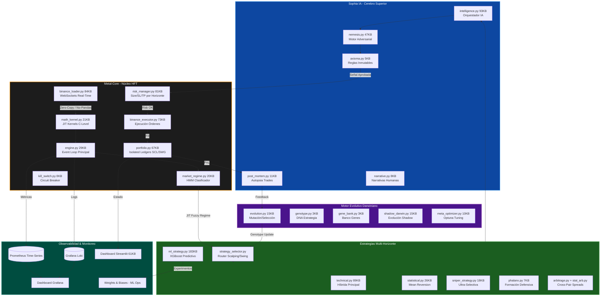
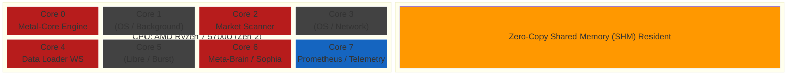
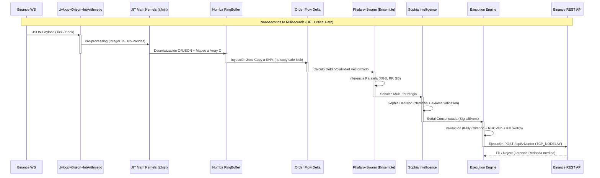
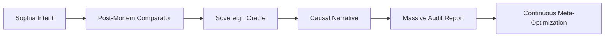
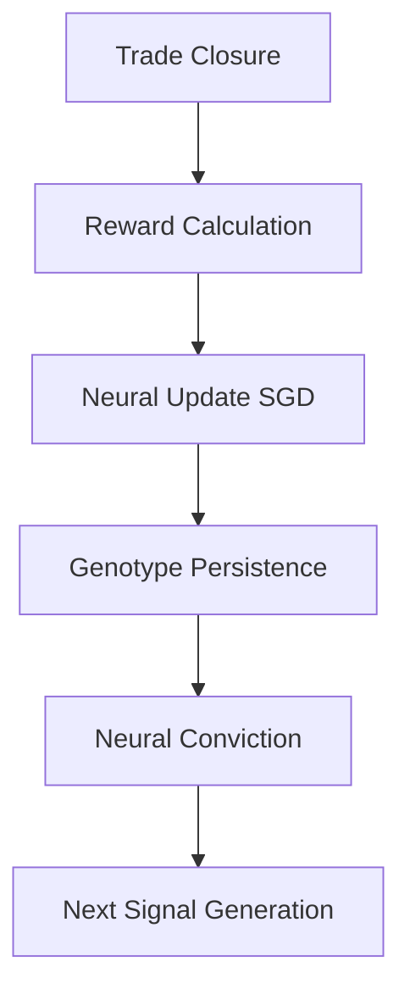

# 🏛️ TRADER GEMINI: THE MASTER ARCHITECTURE MAP

Este documento cartografía la arquitectura definitiva de grado institucional del proyecto **Trader Gemini**, un sistema de High-Frequency Trading (HFT) Multi-Horizonte (Scalping + Swing) diseñado para operar con latencias submilisegundo en Binance.

**Última Actualización:** 2026-04-01  
**Capital Base:** $13 USD → Duplicación exponencial cada 15 días  
**Activos:** 25 pares trading con modelos XGBoost individuales

---

## 🗺️ I. DIAGRAMA DE ARQUITECTURA DE ALTO NIVEL

El sistema se compone del núcleo de alto rendimiento (**Metal-Core**), el motor de inteligencia y decisión (**Trinidad Omega + Sophia**), la capa evolutiva (**Darwin Engine**), y la infraestructura de observabilidad.


```mermaid
graph TD
    subgraph Observabilidad["Observabilidad & Monitoreo"]
        Loki[(Grafana Loki)]
        Prometheus[(Prometheus Time-Series)]
        Grafana[Dashboard Grafana]
        WandB[Weights & Biases - ML Ops]
        Streamlit[Dashboard Streamlit 61KB]
    end

    subgraph Sophia["Sophia IA - Cerebro Superior"]
        SI[intelligence.py 93KB<br/>Orquestador IA]
        NE[nemesis.py 47KB<br/>Motor Adversarial]
        AX[axioma.py 5KB<br/>Reglas Inmutables]
        PM[post_mortem.py 11KB<br/>Autopsia Trades]
        NA[narrative.py 8KB<br/>Narrativas Humanas]
    end

    subgraph Darwin["Motor Evolutivo Darwiniano"]
        EV[evolution.py 15KB<br/>Mutación/Selección]
        GT[genotype.py 3KB<br/>DNA Estrategia]
        GB[gene_bank.py 3KB<br/>Banco Genes]
        SD[shadow_darwin.py 15KB<br/>Evolución Shadow]
        MO[meta_optimizer.py 10KB<br/>Optuna Tuning]
    end

    subgraph Strategies["Estrategias Multi-Horizonte"]
        SS[strategy_selector.py<br/>Router Scalping/Swing]
        TS[technical.py 89KB<br/>Híbrida Principal]
        ML[ml_strategy.py 183KB<br/>XGBoost Predictivo]
        ST[statistical.py 26KB<br/>Mean Reversion]
        SN[sniper_strategy.py 18KB<br/>Ultra-Selectiva]
        PH[phalanx.py 7KB<br/>Formación Defensiva]
        AB[arbitrage.py + stat_arb.py<br/>Cross-Pair Spreads]
    end

    subgraph MetalCore["Metal-Core - Núcleo HFT"]
        WS[binance_loader.py 84KB<br/>WebSockets Real-Time]
        MK[math_kernel.py 21KB<br/>JIT Kernels C-Level]
        ENG[engine.py 29KB<br/>Event Loop Principal]
        PF[portfolio.py 67KB<br/>Isolated Ledgers SCL/SWG]
        MR[market_regime.py 20KB<br/>HMM Clasificador]
        RM[risk_manager.py 81KB<br/>Size/SL/TP por Horizonte]
        KS[kill_switch.py 8KB<br/>Circuit Breaker]
        BE[binance_executor.py 73KB<br/>Ejecución Órdenes]
    end

    WS -->|Zero-Copy / No-Pandas| MK
    MK --> ENG
    ENG --> MR
    MR -->|JIT Fuzzy Regime| SS
    SS --> Strategies
    Strategies --> SI
    SI --> NE
    NE --> AX
    AX -->|Señal Aprobada| RM
    RM -->|Risk OK| BE
    BE -->|Fill| PF
    PF -->|PnL| PM
    PM -->|Feedback| EV
    EV -->|Genotype Update| SS

    ENG -->|Métricas| Prometheus
    ENG -->|Logs| Loki
    PF -->|Estado| Streamlit
    ML -->|Experimentos| WandB
    Prometheus --> Grafana
    Loki --> Grafana

    classDef core fill:#1c1c1c,stroke:#ff9800,stroke-width:2px,color:#fff;
    classDef ai fill:#0d47a1,stroke:#64b5f6,stroke-width:2px,color:#fff;
    classDef evo fill:#4a148c,stroke:#ce93d8,stroke-width:2px,color:#fff;
    classDef strat fill:#1b5e20,stroke:#81c784,stroke-width:2px,color:#fff;
    classDef obs fill:#004d40,stroke:#80cbc4,stroke-width:2px,color:#fff;

    class MetalCore core;
    class Sophia ai;
    class Darwin evo;
    class Strategies strat;
    class Observabilidad obs;
```

---

## 📁 II. MAPA COMPLETO DE ARCHIVOS (~350+ archivos)

### 🚨 core/ — NÚCLEO CRÍTICO (52 archivos)

```
core/
├── engine.py                  # 🚨 MOTOR PRINCIPAL (29KB) - Event loop, coordinación multi-horizonte
├── events.py                  # 🚨 Sistema mensajería (9KB) - Signal/Order/Fill bus tipado
├── portfolio.py               # 🚨 Gestión PnL (67KB) - Ledgers AISLADOS Scalping/Swing e Auditoría Forense
├── market_regime.py           # 🚨 Clasificador HMM (20KB) - Tendencia/volatilidad
├── market_regime_hmm.py       # 🚨 Hidden Markov avanzado (5KB) - Detección regímenes
├── enums.py                   # 📋 Enumeraciones (Horizon, Side, OrderType)
├── resolution_state.py        # 📋 Estado resolución temporal
│
├── # --- MOTOR EVOLUTIVO & IA ADAPTATIVA ---
├── evolution.py               # 🧬 Motor Darwiniano (15KB) - Mutación/selección
├── genotype.py                # 🧬 DNA de estrategia (3KB) - Representación genética
├── gene_bank.py               # 🧬 Banco genes persistente (3KB)
├── shadow_darwin.py           # 🧬 Evolución shadow paralela (15KB) - A/B evolutivo
├── shadow_optimizer.py        # 🧬 Optimizador shadow complementario
├── reward_system.py           # 🧬 Recompensas RL (4KB) - Feedback evolución
├── meta_optimizer.py          # 🧬 Meta-optimización Optuna (10KB)
├── self_tuner.py              # 🧬 Auto-ajuste adaptativo (12KB)
│
├── # --- INTELIGENCIA DE MERCADO ---
├── market_scanner.py          # 🔭 Scanner multi-activo (5KB)
├── liquidity_guardian.py      # 🛡️ Guardián liquidez (4KB) - Orderbook depth
├── orderbook.py               # 📊 Orderbook Python (2KB)
├── c_orderbook.pyx            # ⚡ Orderbook Cython (2KB) - Ultra-rápido
├── c_orderbook.cp314-win_amd64.pyd  # ⚡ Binario Cython compilado
├── sentiment_processor.py     # 🌐 Sentimiento Fear&Greed (5KB)
├── world_awareness.py         # 🌍 Eventos macro-económicos (3KB)
├── correlation_manager.py     # 📈 Matriz correlación activos (4KB)
├── swarm_correlator.py        # 🐝 Patrones multi-activo (3KB)
├── sovereign_oracle.py        # 🔮 Predicción agregada final (5KB)
├── multiverse_simulator.py    # 🌌 Monte Carlo escenarios (4KB)
│
├── # --- MACHINE LEARNING ---
├── online_learning.py         # 🤖 Aprendizaje online (19KB) - Adaptación real-time
├── online_learning_kernels.py # ⚡ Kernels vectorizados (7KB)
├── neural_bridge.py           # 🧠 Puente Sophia↔Core (8KB)
├── ml_governance.py           # 🛡️ Anti-leakage ML (5KB)
├── fused_strategy_kernel.py   # ⚡ Kernel fusionado (3KB) - Single-pass
│
├── # --- GESTIÓN DE FLUJO ---
├── strategy_selector.py       # 🎯 Router Scalping/Swing (10KB)
├── adaptive_balancer.py       # ⚖️ Capital dinámico (7KB)
├── order_manager.py           # 📋 Lifecycle órdenes (6KB)
├── data_handler.py            # 📊 Transformación OHLCV (10KB)
├── state_manager.py           # 💾 Crash recovery (9KB)
├── simulation.py              # 🎮 Paper trading (7KB)
│
├── # --- INFRAESTRUCTURA ---
├── api_manager.py             # 🔌 API centralizado (16KB) - Rate limiting
├── rate_limiter.py            # 🚦 Throttling Binance (2KB)
├── pre_flight.py              # ✈️ Checks arranque (7KB)
├── gc_tuner.py                # ⚙️ GC Python optimizer (3KB)
├── jit_warmup.py              # 🔥 Pre-compilación Numba (1KB)
├── memory.py                  # 🧠 Cache cognitiva (6KB)
├── watchdog.py                # 🐕 Heartbeat + auto-recovery (3KB)
├── system_monitor.py          # 📊 CPU/RAM/Latencia (2KB)
├── secure_store.py            # 🔐 Encriptación keys (2KB)
├── transparent_logger.py      # 📝 Auditoría decisiones (8KB)
│
├── # --- EXPLAINABILITY ---
├── xai_engine.py              # 🔍 SHAP/LIME por trade (5KB)
├── forensics.py               # 🔬 Análisis post-trade (3KB)
├── audit_phase2.py            # 📋 Validación profunda (8KB)
│
└── interfaces/
    └── exchange.py            # 🔌 Contrato Exchange (1KB)
```

### 🔒 risk/ — SEGURIDAD MÁXIMA (3 archivos)

```
risk/
├── risk_manager.py            # 🔒 Riesgo COMPLETO (81KB) - Size/SL/TP por horizonte
├── kill_switch.py             # 🔒 Parada emergencia (8KB) - Circuit breaker drawdown >2%
└── risk_manager.BAK           # 💾 Backup anterior
```

### ⚡ execution/ — EJECUCIÓN (5 archivos)

```
execution/
├── binance_executor.py        # ⚡ Ejecutor Binance (73KB) - Market/Limit/SL/TP
├── liquidity_guardian.py      # 🛡️ Slippage protection (10KB)
├── cost_guard.py              # 💰 Fee tracking (2KB)
├── user_data_stream.py        # 📡 Websocket account updates (11KB)
└── live_smoke_test.py         # 🧪 Validación live (3KB)
```

### 🧠 strategies/ — LÓGICA TRADING (16 archivos)

```
strategies/
├── __init__.py                # 📦 Registro estrategias
├── strategy.py                # 📋 Clase base abstracta
├── technical.py               # 🧠 Híbrida Principal (89KB) - Scalping/Trend
├── ml_strategy.py             # 🤖 XGBoost Predictivo (183KB) - Por horizonte
├── ml_worker.py               # ⚙️ Worker ML asíncrono (7KB)
├── statistical.py             # 📊 Mean Reversion (26KB) - Z-score
├── sniper_strategy.py         # 🎯 Ultra-selectiva scalping (18KB)
├── arbitrage.py               # 💱 Cross-pair spreads (5KB)
├── stat_arb.py                # 📐 Cointegración pairs (6KB)
├── phalanx.py                 # 🛡️ Formación defensiva (7KB) - Multi-signal ensemble
├── quant_math.py              # 🔢 Helpers trading (4KB)
│
└── components/                # 🔧 Componentes modulares
    ├── adaptive_engine.py     # 🧬 Auto-calibración (5KB)
    ├── feature_engineering.py # 📊 100+ features (20KB)
    ├── microstructure.py      # 🔬 Tick-level analysis (6KB)
    ├── signal_generator.py    # 📡 Agregación multi-fuente (5KB)
    └── models/
        └── factory.py         # 🏭 Factory XGBoost/LightGBM (2KB)
```

### 🧠 sophia/ — INTELIGENCIA ARTIFICIAL (7 archivos)

```
sophia/
├── __init__.py                # 📦 Registro Sophia
├── intelligence.py            # 🧠 Cerebro central (93KB) - Orquestador decisiones IA
├── nemesis.py                 # ⚔️ Motor adversarial (47KB) - Stress testing estrategias
├── narrative.py               # 📖 Narrativas humanas (8KB) - Explicación decisiones
├── axioma.py                  # 📐 Reglas lógicas inmutables (5KB)
├── post_mortem.py             # 🔬 Autopsia trades perdedores (11KB)
└── rewards.py                 # 🏆 Feedback loop Sophia (3KB)
```

### 📊 data/ — FLUJO DE DATOS (14 archivos + 4 dirs)

```
data/
├── data_provider.py           # 📊 Router de datos (1KB)
├── binance_loader.py          # 📊 Conector real-time (84KB) - WebSockets + REST
├── database.py                # 💾 SQLite WAL (14KB) - Trades, estados, métricas
├── feature_store.py           # 📊 Cache features (5KB)
├── user_stream.py             # 📡 Balance/Position updates (15KB)
├── sentiment_loader.py        # 🌐 Fear&Greed (7KB)
├── historical_loader.py       # 📚 Descarga velas (3KB)
├── historic_loader.py         # 📚 Formato alternativo (3KB)
├── download_history.py        # ⬇️ Bulk download (2KB)
├── ibkr_loader.py             # 🏦 Interactive Brokers (4KB) - Multi-broker
├── audit_genesis.py           # 🔍 Validación integridad (2KB)
├── engineer_genesis.py        # ⚙️ Pipeline transformación (2KB)
├── ingest_genesis.py          # 📥 ETL pipeline (3KB)
├── ingest_supreme.py          # 📥 Pipeline optimizado (2KB)
├── cache_parquet/             # 💽 Datos OHLCV comprimidos
├── gene_bank/                 # 🧬 Genes persistidos
├── genotypes/                 # 🧬 Genotipos almacenados
└── historical/                # 📚 Datos históricos
```

### 🔧 utils/ — UTILIDADES (67 archivos)

```
utils/
├── # --- LOGGING & OBSERVABILIDAD ---
├── logger.py                  # 📝 Structured logging (11KB)
├── telemetry.py               # 📡 Prometheus/Grafana (8KB)
├── metrics.py                 # 📊 Sharpe, Sortino (4KB)
├── metrics_exporter.py        # 📤 Push backends (17KB)
├── analytics.py               # 📊 Reporting (12KB)
├── sentinel.py                # 🛡️ Vigilante integral (37KB)
├── log_analyzer.py            # 🔍 Pattern anomalías (13KB)
│
├── # --- ERROR HANDLING & RESILIENCIA ---
├── error_handler.py           # 🔧 Retry/fallback (7KB)
├── circuit_breaker.py         # ⚡ Cascading failures (3KB)
├── health_supervisor.py       # 🏥 Monitoreo continuo (6KB)
├── heartbeat.py               # 💓 Señal de vida (2KB)
│
├── # --- PERFORMANCE HFT ---
├── math_kernel.py             # ⚡ NumPy/Numba (21KB)
├── statistics_pro.py          # 📊 Tests estadísticos (19KB)
├── hft_buffer.py              # ⚡ Ring buffer zero-copy (7KB)
├── memory_pool.py             # 🧠 Pre-allocación (10KB)
├── fast_json.py               # ⚡ orjson wrapper (6KB)
├── bloom_filter.py            # 🌸 Dedup O(1) (3KB)
├── cpu_affinity.py            # 💻 Thread pinning (4KB)
│
├── # --- TRADING ESPECÍFICO ---
├── cooldown_manager.py        # ❄️ Anti-overtrading (12KB)
├── safe_leverage.py           # 🔒 Validación leverage (14KB)
├── position_cleaner.py        # 🧹 Orphan cleanup (8KB)
├── wallet_heartbeat.py        # 💰 Balance monitoring (5KB)
│
├── # --- SEGURIDAD & DEPLOY ---
├── security.py                # 🔐 Encriptación (2KB)
├── prod_handshake.py          # 🤝 Pre-deploy validation (14KB)
├── reloader.py                # 🔄 Hot code reload (18KB)
├── session_manager.py         # 🔑 API sessions (11KB)
│
├── # (+ 40 archivos más de monitoring, data sync, evolución, etc.)
```

### 📈 dashboard/ — MONITOREO

```
dashboard/
├── app.py                     # 📈 Dashboard Streamlit (61KB) - Interfaz completa
└── data/                      # 📊 Datos dashboard
```

### 🤖 models/ — MODELOS ML ENTRENADOS (25 archivos)

```
models/
├── BTCUSDT_xgb.json          # Un modelo XGBoost por cada par trading
├── ETHUSDT_xgb.json          # 25 activos totales:
├── SOLUSDT_xgb.json          # BTC, ETH, SOL, ADA, XRP, DOGE, DOT,
├── ...                        # BNB, AVAX, LINK, LTC, UNI, NEAR, OP,
└── WIFUSDT_xgb.json          # POL, SUI, ARB, INJ, FIL, ETC, ATOM,
                               # TIA, RENDER, PAXG, WIF
```

### 🤖 ml/ — INFRAESTRUCTURA ML

```
ml/
└── replay_buffer.py           # 🔄 Experience replay RL (5KB)
```

### 🧪 tests/ — TESTING COMPLETO (147+ archivos)

```
tests/
├── unit/                      # 🧪 Tests unitarios aislados
├── integration/               # 🔗 Tests integración
├── concurrency/               # 🔄 Tests concurrencia
├── security/                  # 🔐 Tests seguridad
├── audits/                    # 🔍 Auditorías automatizadas
├── mocks/                     # 🎭 Mocks
│
├── # --- PRINCIPALES ---
├── run_backtest.py            # 📊 Backtest completo (59KB)
├── walk_forward.py            # 📊 Walk-forward (15KB)
├── stress_test.py             # 💪 Estrés (20KB)
├── chaos_test.py              # 🌪️ Caos (23KB)
├── byzantine_test.py          # ⚔️ Bizantino (17KB)
├── black_swan_backtest.py     # 🦢 Cisne negro (19KB)
├── test_chaos_engineering.py  # 🌪️ Chaos engineering (30KB)
├── mutation_tester.py         # 🧬 Testing mutaciones (23KB)
├── omni_certification.py      # ✅ Certificación omni (15KB)
│
├── # --- BENCHMARKS ---
├── benchmark_total_latency.py # ⏱️ Latencia total (4KB)
├── benchmark_risk_latency.py  # ⏱️ Riesgo (2KB)
├── profiler_harness.py        # ⚙️ Harness profiling (16KB)
│
└── # (130+ tests adicionales por módulo)
```

### 🔧 scripts/ — OPERACIONALES (40 archivos)

```
scripts/
├── run_multi_horizon_backtest.py   # 📊 Motor backtest (147KB) - Principal
├── supervisor_24h.py               # 🕐 Daemon monitoreo (23KB)
├── preflight_check.py              # ✈️ Pre-vuelo (9KB)
├── optuna_oracle_tuner.py          # 🎯 Optimización Bayesiana (10KB)
├── validate_genotype_evolution.py  # 🧬 Validador evolución (6KB)
├── validate_hft_stack.py           # ⚡ Validador HFT (5KB)
├── production_reset.py             # 🔄 Reset producción (4KB)
├── train.py                        # 🤖 Entrenamiento ML (4KB)
└── ... (32 scripts adicionales)
```

### 🛠️ tools/ — HERRAMIENTAS ANÁLISIS (5 archivos)

```
tools/
├── walk_forward_tester.py     # 📊 Walk-forward (10KB)
├── monte_carlo_sim.py         # 🎲 Monte Carlo (5KB)
├── massive_report_generator.py  # 📋 Reportes masivos (4KB)
├── oracle_remediation.py      # 🔧 Remediación oráculo (6KB)
└── convergence_audit.py       # 🔍 Convergencia (2KB)
```

### 🚀 launchers/ — SCRIPTS LANZAMIENTO (15 .bat)

```
launchers/
├── START_FUTURES.bat          # ▶️ Modo futuros
├── START_SPOT.bat             # ▶️ Modo spot
├── START_GROWTH.bat           # ▶️ Modo crecimiento
├── PREFLIGHT_CHECK.bat        # ✈️ Pre-vuelo
├── MASSIVE_BACKTESTER.bat     # 📊 Backtester masivo
├── EMERGENCY_SHUTDOWN.bat     # 🚨 Apagado emergencia
├── BOTTLENECK_HUNTER.bat      # 🔍 Cuellos botella
└── ... (8 launchers más)
```

### 🚀 Infraestructura Adicional

```
deployment/                    # 🐳 Docker + Prometheus + Loki + Grafana
├── prometheus.yml
├── promtail.yml
├── loki-config.yaml
├── elk/                       # Stack ELK
└── grafana/                   # Dashboards

analysis/                      # 📊 Auditorías y entrenamiento (9 archivos)
dev_ops/                       # ⚙️ Purga sistema
hardware/                      # 💻 FPGA specs
grafana/                       # 📈 Dashboard Sophia JSON
docs/                          # 📚 18 documentos
```

---

## 📊 III. ESTADÍSTICAS DEL PROYECTO

| Capa | Archivos | Tamaño Aprox. | Criticidad |
|------|----------|---------------|------------|
| **core/** | 52 | ~350KB | 🚨 MÁXIMA |
| **risk/** | 2 (+1 BAK) | ~89KB | 🔒 MÁXIMA |
| **execution/** | 5 | ~96KB | ⚡ ALTA |
| **strategies/** | 11 + 5 components | ~400KB | 🧠 ALTA |
| **sophia/** | 7 | ~165KB | 🧠 ALTA |
| **data/** | 14 | ~130KB | 📊 ALTA |
| **utils/** | 67 | ~450KB | 🔧 MEDIA |
| **scripts/** | 40 | ~300KB | 🔧 MEDIA |
| **tests/** | 147+ | ~900KB | 🧪 MEDIA |
| **tools/** | 5 | ~27KB | 🛠️ BAJA |
| **TOTAL** | **~350+** | **~3MB+ código** | |

---

## 💻 IV. DESPLIEGUE DE HARDWARE (CORE PINNING)

El despliegue está optimizado para un entorno **Ryzen 7 5700U (8 Núcleos Físicos, 16 Hilos)**. Para evadir la invalidación de la caché L3 y el *Context Switching*, se aplican políticas estrictas de afinidad de CPU.


```mermaid
block-beta
  columns 4
  block:CPU["CPU: AMD Ryzen 7 5700U (Zen 2)"]
    columns 4
    C0["Core 0<br/>Metal-Core Engine"]
    C1["Core 1<br/>(OS / Background)"]
    C2["Core 2<br/>Market Scanner"]
    C3["Core 3<br/>(OS / Network)"]
    C4["Core 4<br/>Data Loader WS"]
    C5["Core 5<br/>(Libre / Burst)"]
    C6["Core 6<br/>Meta-Brain / Sophia"]
    C7["Core 7<br/>Prometheus / Telemetry"]

    style C0 fill:#b71c1c,color:#fff,stroke:#fff
    style C2 fill:#b71c1c,color:#fff,stroke:#fff
    style C4 fill:#b71c1c,color:#fff,stroke:#fff
    style C6 fill:#b71c1c,color:#fff,stroke:#fff
    style C1 fill:#424242,color:#fff,stroke:#fff
    style C3 fill:#424242,color:#fff,stroke:#fff
    style C5 fill:#424242,color:#fff,stroke:#fff
    style C7 fill:#1565c0,color:#fff,stroke:#fff
  end
  
  block:Cache["L3 Cache (8MB Unified)"]
    columns 1
    L3["Zero-Copy Shared Memory (SHM) Resident"]
    style L3 fill:#ff9800,color:#fff
  end
```

> **Nota Técnica:** Se evitan los hilos SMT (impares) para las rutinas del motor (Cores 0, 2, 4, 6) con prioridad `REALTIME/HIGH`, asegurando que la L1/L2 de cada núcleo pertenezca en exclusiva a los bucles de alta frecuencia.

---

## ⚡ V. LINAJE DE DATOS Y LATENCIA (DATA LINEAGE)

Flujo temporal preciso del recorrido de un dato desde Binance hasta su ejecución. **Objetivo: < 1ms P99 (Ultra-Low Latency via Numba JIT)**.


```mermaid
sequenceDiagram
    participant B as Binance WS
    participant WS as Uvloop+Orjson+IntArithmetic
    participant MK as JIT Math Kernels (@njit)
    participant RB as Numba RingBuffer
    participant OF as Order Flow Delta
    participant IA as Phalanx-Swarm (Ensemble)
    participant SO as Sophia Intelligence
    participant EX as Execution Engine
    participant API as Binance REST API

    Note over B, API: Nanoseconds to Milliseconds (HFT Critical Path)
    
    B->>WS: JSON Payload (Tick / Book)
    activate WS
    WS->>MK: Pre-processing (Integer TS, No-Pandas)
    MK->>RB: Deserialización ORJSON + Mapeo a Array C
    deactivate WS
    
    activate RB
    RB->>OF: Inyección Zero-Copy a SHM (np.copy safe-lock)
    deactivate RB
    
    activate OF
    OF->>IA: Cálculo Delta/Volatilidad Vectorizado
    deactivate OF
    
    activate IA
    IA->>IA: Inferencia Paralela (XGB, RF, GB)
    IA->>SO: Señales Multi-Estrategia
    deactivate IA

    activate SO
    SO->>SO: Sophia Decision (Nemesis + Axioma validation)
    SO->>EX: Señal Consensuada (SignalEvent)
    deactivate SO
    
    activate EX
    EX->>EX: Validación (Kelly Criterion + Risk Veto + Kill Switch)
    EX->>API: Ejecución POST /fapi/v1/order (TCP_NODELAY)
    deactivate EX
    
    API-->>EX: Fill / Reject (Latencia Redonda medida)
```

---

## 🗄️ VI. DICCIONARIO DE DATOS (DATA STRUCTURES)

El intercambio de memoria (IPC) se da sin serialización (*pickle-free*) operando directamente sobre punteros C a través de NumPy estricto. **Toda la ruta crítica (Hot Path) ha sido purgada de objetos `Decimal` y `Pandas`**, utilizando exclusivamente `numpy.float64` compilado por Numba para garantizar precisión financiera con latencia nano.

### 1. Numba Structured Array (El "OhlcvStruct")

Estructura fundacional de cada Ring Buffer para una vela o tick. Perfectamente alineada en memoria (Bytes fijos) para compilación LLVM.

| Campo | Tipo NumPy | Memoria | Propósito |
| :--- | :--- | :--- | :--- |
| `timestamp` | `np.int64` | 8 bytes | Marca tiempo atómica UNIX (ms). |
| `open` | `np.float32` | 4 bytes | Precio de Apertura (escalado). |
| `high` | `np.float32` | 4 bytes | Precio Máximo. |
| `low` | `np.float32` | 4 bytes | Precio Mínimo. |
| `close` | `np.float32` | 4 bytes | Precio de Cierre. |
| `volume` | `np.float32` | 4 bytes | Volumen Operado (Base Asset). |
| **Total Size** | **Tuple** | **28 bytes** | Alta compresión hardware. |

### 3. Forensic Fill Anatomy (V5.88)

Para micro-cuentas de $13, el `FillEvent` ha sido expandido para capturar la fricción económica exacta:

| Campo | Propósito Forense | Impacto en $13 Account |
| :--- | :--- | :--- |
| `gross_pnl` | PnL puro de movimiento de precio. | Identifica si la estrategia tiene Alpha. |
| `net_pnl` | PnL tras deducir `fees_paid`. | La métrica real de supervivencia. |
| `fees_paid` | Comisiones exactas cobradas por Binance. | Detecta "Muerte por Mil Cortes". |
| `slippage_pct` | Diferencia entre Target vs Fill. | Valida la calidad del LOB/Liquidez. |
| `duration_seconds`| Tiempo total de exposición. | Optimización de riesgo temporal. |


### 2. Market Ring Buffer (Numba JIT Class)

Estructura iterativa `deque`-like pero implementada sobre arrays pre-asignados en C.

- `_data`: Bloque de memoria continua de N-elementos (`np.zeros(N, dtype=OhlcvStruct)`).
- `_index`: Puntero (Int) a la "cabeza" del búfer circular. Funciona en módulo `(index + 1) % N`.
- **Invariante:** Las escrituras son `O(1)`. Las lecturas del último bloque de `n` elementos son vectorizadas `O(1)` usando punteros rodantes, sin recolección de basura (GC-Free).

---

## 👁️ VII. TELEMETRÍA SOBERANA & AUDITORÍA COGNITIVE-AWARE

La arquitectura de observabilidad captura no solo métricas cuantitativas, sino también el **razonamiento cognitivo** detrás de cada decisión.

### 1. El Circuito de Retroalimentación de Atribución

Integrado entre `SophiaIntelligence` y `SovereignOracle`, este circuito permite la autopsia técnica de cada operación.

- **Intent Storage:** Sophia almacena el "Plan de Vuelo" (intent) al abrir una posición.
- **Causal Post-Mortem:** Al cerrar, el Oráculo compara el desenlace con el plan y genera una **Narrativa de Atribución**.
- **Cognitive Backtest:** El motor de backtest (`run_backtest.py`) es "Cognitive-Aware", poblando logs con lenguaje natural que explica el *porqué* de cada Profit/Loss.

### 2. Flujo de Datos de Telemetría Cognitiva


```mermaid
graph LR
    A[Sophia Intent] --> B[Post-Mortem Comparator]
    B --> C[Sovereign Oracle]
    C --> D[Causal Narrative]
    D --> E[Massive Audit Report]
    E --> F[Continuous Meta-Optimization]
```

### 3. El Puente Neural y Auditoría Multiverso

La arquitectura soporta **Persistencia de Pesos Localizada** y un puente de retroalimentación asíncrono.

* **Neural Bridge:** Inferencia directa de señales neuronales fusionadas en el flujo técnico, proporcionando una puntuación de "Neural Conviction".
* **Online Feedback Loop:** Actualización de los pesos `brain_weights` en disco local (`data/genotypes/`) tras cada cierre de trade exitoso o fallido.
* **Multiverse Certification:** Validación masiva que asegura que el aprendizaje converge positivamente a través de los 25 universos (símbolos) de la canasta institucional.


```mermaid
graph TD
    A[Trade Closure] --> B[Reward Calculation]
    B --> C[Neural Update SGD]
    C --> D[Genotype Persistence]
    D --> E[Neural Conviction]
    E --> F[Next Signal Generation]
```

---

## 🧠 VIII. CAPAS ARQUITECTÓNICAS (Bottom → Top)

```
┌─────────────────────────────────────────────────────────────┐
│ 7. MONITOREO: dashboard/app.py + grafana/ + W&B            │
├─────────────────────────────────────────────────────────────┤
│ 6. SOPHIA IA: intelligence → nemesis → axioma → narrative  │
├─────────────────────────────────────────────────────────────┤
│ 5. EVOLUCIÓN: evolution → genotype → gene_bank → shadow    │
├─────────────────────────────────────────────────────────────┤
│ 4. ESTRATEGIAS: technical → ml → statistical → sniper →    │
│                  phalanx → arbitrage → stat_arb             │
├─────────────────────────────────────────────────────────────┤
│ 3. RIESGO: risk_manager (81KB) → kill_switch               │
├─────────────────────────────────────────────────────────────┤
│ 2. CORE: engine → events → portfolio → market_regime       │
├─────────────────────────────────────────────────────────────┤
│ 1. DATOS: binance_loader → data_provider → database → DB   │
├─────────────────────────────────────────────────────────────┤
│ 0. INFRA: utils/ (67 módulos) + deployment/ + hardware/    │
└─────────────────────────────────────────────────────────────┘
```

---

## 🔒 IX. DEPENDENCIAS CRÍTICAS CONOCIDAS

| Módulo Consumidor | Dependencia Config | Impacto |
|---|---|---|
| BinanceLoader | `Config.Strategies.ML_LOOKBACK_BARS` | Historial necesario |
| RiskManager | `Config.Risk.MAX_DRAWDOWN` | Límites pérdida |
| TechnicalStrategy | `Config.Strategies.TECHNICAL_PARAMS` | Señales trading |
| Portfolio | `Config.Data.RESOLUTION` | Timeframes OHLCV |
| SophiaIntelligence | `Config.Strategies.*` | Decisiones IA |
| Evolution | `Config.Strategies.*` | Rangos mutación |
| StrategySelector | `Config.Strategies.STRATEGY_SPECIALIZATION_MAP` | Router horizonte |
| KillSwitch | `Config.Risk.MAX_DRAWDOWN` | Parada emergencia |
| BinanceExecutor | `Config.Execution.*` | Parámetros órdenes |

---

## 📊 X. MÉTRICAS OBLIGATORIAS

| Métrica | Objetivo | Responsable |
|---------|----------|-------------|
| Latencia Total (E2E) | < 50ms | Red Binance + Engine + Executor |
| **Latencia Interna (Nano)** | **< 20μs** | **`engine.py` + JIT Kernels** |
| Sharpe ratio | > 2.0 (3 meses) | run_multi_horizon_backtest.py |
| Max drawdown | < 1.5% / sesión | risk_manager.py + kill_switch.py |
| Uptime | > 99.5% | error_handler.py + sentinel.py |
| Recuperación fallos | < 2 segundos | state_manager.py |
| Precisión señales | > 60% walk-forward | walk_forward.py |
| Coverage tests | > 80% críticos | pytest tests/ |
