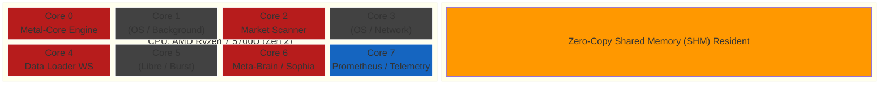
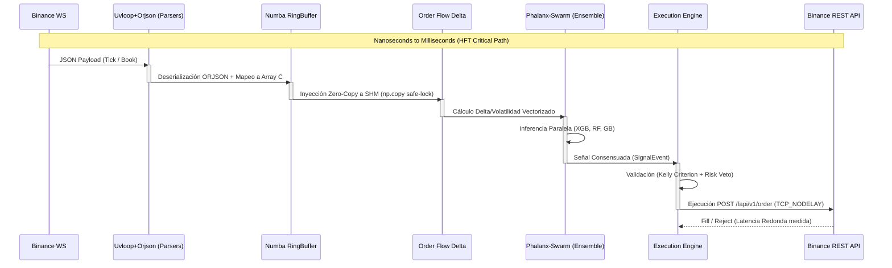
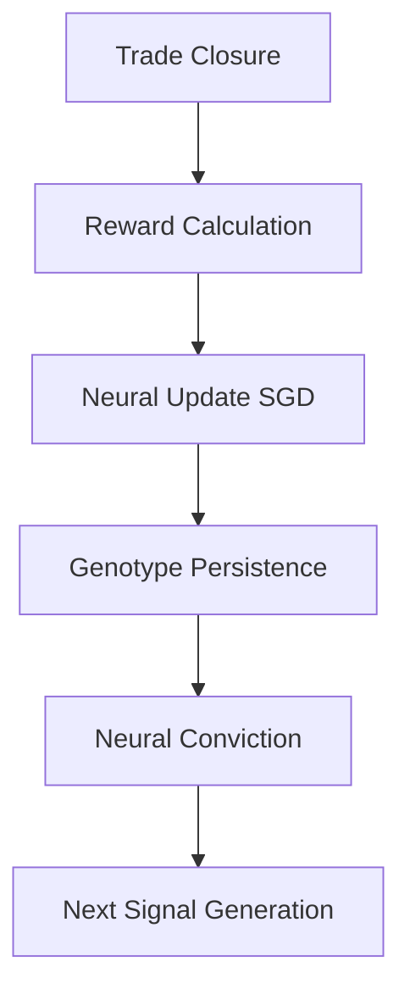
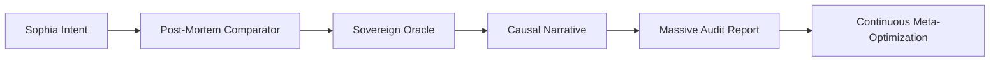

# 🏛️ TRADER GEMINI: THE MASTER ARCHITECTURE MAP

Este documento cartografía la arquitectura definitiva de grado institucional del proyecto **Trader Gemini**, un sistema de High-Frequency Trading (HFT) / Scalping diseñado para operar con latencias submilisegundo en Binance.

---

## 🗺️ I. DIAGRAMA DE ARQUITECTURA DE ALTO NIVEL

El sistema se compone del núcleo de alto rendimiento (**Metal-Core**), el motor de inteligencia y decisión (**Trinidad Omega**), y la infraestructura de observabilidad.

```mermaid
graph TD
    subgraph Observabilidad & Monitoreo
        Loki[(Grafana Loki)]
        Prometheus[(Prometheus Time-Series)]
        Grafana[Dashboard Grafana]
        WandB[Weights & Biases - ML Ops]
    end

    subgraph Trinidad Omega
        GA[Gestor Axioma<br/>Auditoría PnL & Kelly]
        OL[Sophia Meta-Brain<br/>Aprendizaje Continuo PPO/PER]
        IA[Phalanx Swarm<br/>Ensembles XGB/RF/GB]
    end

    subgraph Metal-Core [Núcleo C++/Rust/Numba]
        WS[Uvloop / ORJSON<br/>WebSockets Binance]
        SHM[(Memoria Compartida<br/>SharedMemory)]
        Buffer[Numba RingBuffers<br/>Estructuras C-Contiguas]
        Regime[Market Regime<br/>Hurst / RANSAC]
        Engine[Execution Engine<br/>Async Event Loop]
    end

    WS -->|Zero-Copy| SHM
    SHM --> Buffer
    Buffer --> Regime
    Buffer --> IA
    Regime --> OL
    IA --> GA
    GA --> Engine
    OL -.->|Feedback de Pesos| IA

    Engine -->|Métricas Telemetría| Prometheus
    Engine -->|Logs Estructurados| Loki
    IA -->|Pérdida/Precisión| WandB
    Prometheus --> Grafana
    Loki --> Grafana

    classDef core fill:#1c1c1c,stroke:#ff9800,stroke-width:2px,color:#fff;
    classDef ai fill:#0d47a1,stroke:#64b5f6,stroke-width:2px,color:#fff;
    classDef obs fill:#1b5e20,stroke:#81c784,stroke-width:2px,color:#fff;

    class Metal-Core core;
    class Trinidad Omega ai;
    class Observabilidad & Monitoreo obs;
```

---

## 💻 II. DESPLIEGUE DE HARDWARE (CORE PINNING)

El despliegue está optimizado para un entorno **Ryzen 7 5700U (8 Núcleos Físicos, 16 Hilos)**. Para evadir la invalidación de la caché L3 y el *Context Switching*, se aplican políticas estrictas de afinidad de CPU.

```mermaid
block-beta
  columns 4
  block:CPU["CPU: AMD Ryzen 7 5700U (Zen 2)"]
    columns 4
    C0["Core 0<br/>Metal-Core Engine"]
    C1["Core 1<br/>(OS / Background)"]
    C2["Core 2<br/>Market Scanner"]
    C3["Core 3<br/>(OS / Network)"]
    C4["Core 4<br/>Data Loader WS"]
    C5["Core 5<br/>(Libre / Burst)"]
    C6["Core 6<br/>Meta-Brain / Sophia"]
    C7["Core 7<br/>Prometheus / Telemetry"]

    style C0 fill:#b71c1c,color:#fff,stroke:#fff
    style C2 fill:#b71c1c,color:#fff,stroke:#fff
    style C4 fill:#b71c1c,color:#fff,stroke:#fff
    style C6 fill:#b71c1c,color:#fff,stroke:#fff
    style C1 fill:#424242,color:#fff,stroke:#fff
    style C3 fill:#424242,color:#fff,stroke:#fff
    style C5 fill:#424242,color:#fff,stroke:#fff
    style C7 fill:#1565c0,color:#fff,stroke:#fff
  end
  
  block:Cache["L3 Cache (8MB Unified)"]
    columns 1
    L3["Zero-Copy Shared Memory (SHM) Resident"]
    style L3 fill:#ff9800,color:#fff
  end
```

> **Nota Técnica:** Se evitan los hilos SMT (impares) para las rutinas del motor (Cores 0, 2, 4, 6) con prioridad `REALTIME/HIGH`, asegurando que la L1/L2 de cada núcleo pertenezca en exclusiva a los bucles de alta frecuencia.

---

## ⚡ III. LINAJE DE DATOS Y LATENCIA (DATA LINEAGE)

Flujo temporal preciso del recorrido de un dato desde Binance hasta su ejecución. **Objetivo: < 10ms P99**.

```mermaid
sequenceDiagram
    participant B as Binance WS
    participant WS as Uvloop+Orjson (Parsers)
    participant RB as Numba RingBuffer
    participant OF as Order Flow Delta
    participant IA as Phalanx-Swarm (Ensemble)
    participant EX as Execution Engine
    participant API as Binance REST API

    Note over B, API: Nanoseconds to Milliseconds (HFT Critical Path)
    
    B->>WS: JSON Payload (Tick / Book)
    activate WS
    WS->>RB: Deserialización ORJSON + Mapeo a Array C
    deactivate WS
    
    activate RB
    RB->>OF: Inyección Zero-Copy a SHM (np.copy safe-lock)
    deactivate RB
    
    activate OF
    OF->>IA: Cálculo Delta/Volatilidad Vectorizado
    deactivate OF
    
    activate IA
    IA->>IA: Inferencia Paralela (XGB, RF, GB)
    IA->>EX: Señal Consensuada (SignalEvent)
    deactivate IA
    
    activate EX
    EX->>EX: Validación (Kelly Criterion + Risk Veto)
    EX->>API: Ejecución POST /fapi/v1/order (TCP_NODELAY)
    deactivate EX
    
    API-->>EX: Fill / Reject (Latencia Redonda medida)
```

---

## 🗄️ IV. DICCIONARIO DE DATOS (DATA STRUCTURES)

El intercambio de memoria (IPC) se da sin serialización (*pickle-free*) operando directamente sobre punteros C a través de NumPy estricto.

### 1. Numba Structured Array (El "OhlcvStruct")

Estructura fundacional de cada Ring Buffer para una vela o tick. Perfectamente alineada en memoria (Bytes fijos) para compilación LLVM.

| Campo | Tipo NumPy | Memoria | Propósito |
| :--- | :--- | :--- | :--- |
| `timestamp` | `np.int64` | 8 bytes | Marca the tiempo atómica UNIX (ms). |
| `open` | `np.float32` | 4 bytes | Precio de Apertura (escalado para memoria). |
| `high` | `np.float32` | 4 bytes | Precio Máximo. |
| `low` | `np.float32` | 4 bytes | Precio Mínimo. |
| `close` | `np.float32` | 4 bytes | Precio the Cierre. |
| `volume` | `np.float32` | 4 bytes | Volumen Operado (Base Asset). |
| **Total Size** | **Tuple** | **28 bytes** | Alta compresión the hardware. |

### 2. Market Ring Buffer (Numba JIT Class)

Estructura iterativa `deque`-like pero implementada sobre arrays pre-asignados en C.

- `_data`: Bloque de memoria continua the N-elementos (`np.zeros(N, dtype=OhlcvStruct)`).
- `_index`: Puntero (Int) a la "cabeza" del búfer circular. Funciona en módulo `(index + 1) % N`.
- **Invariante:** Las escrituras son `O(1)`. Las lecturas del último elemento bloque de `n` elementos son vectorizadas `O(1)` usando punteros rodantes, sin recolección de basura (GC-Free).

---

## 👁️ V. TELEMETRÍA SOBERANA & AUDITORÍA COGNITIVE-AWARE (PHASE 47.3)

La arquitectura de observabilidad se ha extendido para capturar no solo métricas cuantitativas, sino también el **razonamiento cognitivo** detrás de cada decisión.

### 1. El Circuito de Retroalimentación de Atribución

Integrado entre `SophisIntelligence` y `SovereignOracle`, este circuito permite la autopsia técnica de cada operación.

- Intent Storage: Sophia almacena el "Plan de Vuelo" (intent) al abrir una posición.
- Causal Post-Mortem: Al cerrar, el Oráculo compara el desenlace con el plan y genera una **Narrativa de Atribución**.
- Cognitive Backtest: El motor de backtest (`run_backtest.py`) ahora es "Cognitive-Aware", poblando logs de decisión con lenguaje natural que explica el *porqué* de cada Profit/Loss.

### 3. V5.47.5+: El Puente Neural y Auditoría Multiverso (Phase 48 & 49)

La arquitectura ahora soporta una **Persistencia de Pesos Localizada** y un puente de retroalimentación asíncrono.

* **Neural Bridge:** Inferencia directa de señales neuronales fusionadas en el flujo técnico, proporcionando una puntuación de "Neural Conviction".
* **Online Feedback Loop:** Actualización de los pesos `brain_weights` en el disco local (`data/genotypes/`) tras cada cierre de trade exitoso o fallido.
* **Multiverse Certification:** Protocolo de validación masiva que asegura que el aprendizaje converge positivamente a través de los 26 universos (símbolos) de la canasta institucional.

```mermaid
graph TD
    A[Trade Closure] --> B[Reward Calculation]
    B --> C[Neural Update SGD]
    C --> D[Genotype Persistence]
    D --> E[Neural Conviction]
    E --> F[Next Signal Generation]
```

### 2. Flujo de Datos de Telemetría Cognitiva

```mermaid
graph LR
    A[Sophia Intent] --> B[Post-Mortem Comparator]
    B --> C[Sovereign Oracle]
    C --> D[Causal Narrative]
    D --> E[Massive Audit Report]
    E --> F[Continuous Meta-Optimization]
```
