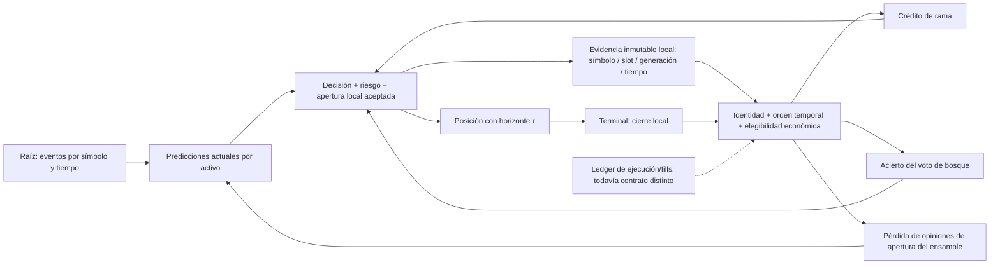

# Auditoría OA — causalidad del aprendizaje y contrato numérico del ensamble

Fecha de corte local: 2026-09-28 (America/Bogota; ejecución continúa el 29 en UTC).
Autor: Codex. Rama: `codex/outcome-clock-audit`.
Base reproducida: `3e79cefe2e0be057b9f9dc0ac5c419bd3ca7bc4b`.
Reparación: `4737f95b`. Integración de main `cf5c445a`:
`5c4a8c7e7c2c3ee90cd66e434552eb95014dfe25`.

Esta adenda conserva los informes anteriores. No sustituye la matriz histórica
ni renumera sus 305 puntos. OA es un espacio de identificadores nuevo y acotado:
**17 hallazgos, 8 reparados y 9 pendientes**, uno de estos últimos con afirmaciones
documentales corregidas pero sin garantía estadística demostrada.

## 1. Dictamen y límites de certificación

Se reprodujeron ocho fallos de atribución/dominio/normalización con diez tests:
RED = 2 pasan, 8 fallan, 0 ignorados. Después de la reparación los diez pasan.
La ampliación a dieciocho pruebas pasa también: incluye aprendizaje positivo,
cierres multislot y multiactivo, identidad incompatible, reapertura y falta de
confirmación económica. Estos resultados no certifican rentabilidad ni la
totalidad del sistema.

El defecto central era causal: el cierre calificaba opiniones recientes del
ensamble y consumía espejos de rama/voto compartidos por moneda. Una posición
vieja podía acreditar a otra señal o castigar una predicción que no existía al
abrir. Un sistema que adapta pesos con esa evidencia puede tener muchos lazos
de actualización sin ser un sistema de aprendizaje correctamente atribuido.

La reparación introduce evidencia de apertura por **activo, slot, generación,
símbolo, dirección y tiempo de decisión**, además de probabilidades por modelo.
No crea motores separados por estilo. Los tres slots actuales son capacidad
de almacenamiento, no tres universos temporales. No se añadieron divisiones
scalping/swing ni se cambiaron los controles de riesgo.

Inventario base: 1.328 archivos versionados en 3e79/cf5c; 1.329 al añadir el test.
Cargo declara 23 crates miembros y el paquete raíz: 24 miembros en total.
Esta ola examinó semánticamente el ensamble y los recorridos concretos de
apertura/cierre, además de las conexiones indicadas más abajo. **No se leyeron
semánticamente los 1.328 archivos completos**. Compilar todos los targets no
equivale a esa revisión. No se presenta una auditoría integral terminada.

No se ejecutaron trading live/demo, promoción de modelos, entrenamiento real,
T-1 ni cambios de golden. La meta de duplicar capital cada tres días se mantiene
como aspiración del usuario, no como criterio para retirar defensas ni como
resultado obtenido.

## 2. Grafo vivo: raíz, decisión, terminal y realimentación



Antes, H recibía la última caché de opiniones y B/F consumían una celda por
moneda. Ahora la misma evidencia congelada sigue a la posición correspondiente.
El guard de identidad no sustituye un ledger de fills. El modo
`ExchangeLocalEstimate` sigue usando confirmación de entrada como condición
mínima; no acredita liquidación de salida. En simulación el aprendizaje queda
en su instancia y no se convierte en evidencia de resultados del exchange.

### Contrato de estado

1. Una apertura local fallida no publica nueva evidencia.
2. Una apertura exitosa publica sólo si la generación observada coincide con
   la esperada y la posición continúa abierta.
3. El cierre consume únicamente la celda de su slot, una sola vez.
4. Símbolo, generación, lado y tiempo de entrada deben coincidir. El evento de
   cierre no puede preceder al de entrada.
5. El resultado de `close_with_fee` debe corresponder al precio/cantidad/lado
   leídos, y la generación posterior debe ser la sucesora.
6. La evidencia se consume incluso si la elegibilidad económica rechaza el
   aprendizaje. Una posición adoptada o reabierta no hereda el voto anterior.
7. La ausencia de evidencia evita crédito a rama/bosque/ensamble, pero no
   suprime el cierre defensivo.

Las comprobaciones son locales; no son una transacción atómica entre arena,
exchange y adaptadores. Otros consumidores del cierre permanecen en OA-17.

## 3. Matriz maestra de esta adenda

| ID | Prioridad | Estado | Fallo y efecto |
|---|---|---|---|
| OA-01 | P1 | Reparado | Cierre demorado calificaba predicciones recientes, no las de apertura |
| OA-02 | P1 | Reparado | Crédito de rama por moneda se sobrescribía entre slots |
| OA-03 | P1 | Reparado | Voto de bosque por moneda se atribuía a otra posición |
| OA-04 | P1 | Reparado | Predicciones inválidas se transformaban en evidencia o propagaban NaN |
| OA-05 | P1 | Reparado | Etiqueta de barra inválida alteraba pesos y consumía opiniones |
| OA-06 | P1 | Reparado | Retorno no finito contaminaba actualización por trade |
| OA-07 | P1 | Reparado | Habilidad aceptaba probabilidades imposibles/etiquetas no binarias |
| OA-08 | P1 | Reparado | Modelo ausente podía borrar numéricamente al único participante |
| OA-09 | P2 | Abierto; documentación corregida | z EWMA no acredita significación secuencial al 95 % |
| OA-10 | P2 | Abierto | Tasa dependiente del resultado y castigo asimétrico cambian el objetivo |
| OA-11 | P1 | Abierto | Horizonte τ reescrito en slot2 aunque la apertura sea en otro slot |
| OA-12 | P1 | Abierto | ID mayor de rama gana el crédito de una señal fusionada |
| OA-13 | P1 | Abierto | Distintos targets/horizontes comparten interpretación probabilística |
| OA-14 | P1 | Abierto | Evidencia no identifica versión de modelo ni sobrevive reinicio |
| OA-15 | P1 | Abierto en cf5c | Publicador Hawkes y lector usan namespaces incompatibles |
| OA-16 | P2 | Abierto | Reloj, coste y soporte del publicador no tienen contrato validado |
| OA-17 | P1 | Abierto | Procedencia de otros aprendizajes y liquidación sigue incompleta |

P1 denota capacidad de corromper decisiones/aprendizaje o de desconectar un lazo;
P2 denota garantía, diseño o coste no justificados. No se cuantificó pérdida
monetaria en producción. Una consecuencia posible no se confunde con un
incidente live demostrado.

## 4. Módulos 2, 5 y 7 — OA-01: feedback demorado sin identidad

**Evidencia base.** `lib.rs` llamaba `update_with_trade_outcome` en el cierre.
Ese método elegía `predictions` y, si no había ninguna, `last_predictions`.
Ninguno de esos arrays identificaba la posición que acababa de cerrarse.

**Mecanismo.** Si en t0 el bosque predice 0,9 y la NN 0,1, pero antes del cierre
en t1 las opiniones se invierten, el outcome de la operación t0 penaliza la
opinión de t1. Para una subida, las pérdidas correctas serían 0,01 y 0,81;
las incorrectas serían 0,81 y 0,01. Una mejor predicción de apertura pierde peso
frente a una posterior que no pudo causar la entrada. Incluso una posición
adoptada sin decisión local alimentaba estos pesos.

**Impacto.** El sesgo afecta tanto la combinación probabilística como cualquier
gate que la consume. Puede producir diferencias backtest/demo/live por demora,
cadencia, carga o cierres intercalados, aun usando los mismos modelos.

**Reparación.** `EntryLearningEvidence` congela dos opiniones en el slot abierto.
El core llama `update_with_trade_snapshot` sólo con evidencia de identidad válida
y elegibilidad económica. `prediction_snapshot` no recurre a cachés pasadas.
Se conserva el adaptador público legado, documentado como síncrono; la búsqueda
del workspace no encontró llamadores operativos restantes, sólo tests.

**Validación.** El RED mostraba [-0,0075; -0,6075] en una posición sin binding
cuando ambos pesos debían permanecer en cero. La suite positiva invierte votos
recientes y comprueba que gana peso el modelo acertado al abrir. Otro test
verifica deltas numéricos exactos, ausencia de consumo de opiniones actuales y
persistencia del snapshot tras el reset de barra.

**Límite.** Snapshot no significa target correcto, misma versión de modelo,
fill confirmado, ni horizonte calibrado. OA-13/14/17 siguen abiertos.

## 5. Módulos 3 y 5 — OA-02: crédito de rama compartido por moneda

**Evidencia.** `rama_abierta: Vec<Option<usize>>` tenía una única celda por moneda,
aunque `MAX_SPECTRAL_SLOTS=3`. Cada apertura la sobrescribía y el primer cierre
hacía `take()`. Una rama diferente o una posición adoptada podía consumirla.

**Consecuencia.** `rama_registro` no es sólo telemetría: alimenta la convicción
de ramas de respaldo. Una tasa de acierto que mezcla autores altera decisiones
futuras y puede aparentar autoevolución basada en evidencia inexistente.

**Cambio.** El crédito usa el campo branch del binding por slot. El espejo
público se conserva para compatibilidad diagnóstica y deja de ser fuente del
cierre. La etiqueta numérica de apertura debe ser finita, no negativa, entera
y menor que N_RAMAS; antes una fracción se truncaba a otro identificador.
Esta comprobación no convierte al campo `volume_flow_rate` en un tipo seguro.

**Pruebas.** El RED consumía una rama legada de una posición sin evidencia.
Ahora no la consume para aprender. El test multislot cierra primero un slot
con rama8, mantiene la evidencia pendiente de rama7 y luego la acredita
correctamente. El activo1 permanece sin cambios hasta su propio cierre.
La suite ejerce el consumo; el guard de etiqueta entera fue revisado por lectura,
no mediante apertura completa del pipeline.

**Pendiente relacionado.** OA-12: congelar una etiqueta elegida por `max` no
demuestra que esa etiqueta sea el autor correcto de una señal fusionada.

## 6. Módulo 2 — OA-03: voto del bosque atribuido al cierre ajeno

**Evidencia.** `bosque_voto_abierto` repetía el patrón per-coin. Su consumidor
actualiza `bosque_registro`, del que depende el freno por habilidad del bosque.

**Reproducción.** Una posición creada sin voto de apertura, con espejo `true`,
incrementaba n al cerrar. Eso bastaba para inventar una observación de acierto.

**Cambio.** El voto viaja con el binding y se consume una vez. La regla existente
`etiqueta_barrera(is_long,reason_code)` se conserva: no se sustituyó por signo del
PnL neto. Un cierre no etiquetable sigue sin aportar observación de bosque.

**Pruebas.** En dos slots con votos opuestos, el primer cierre deja (n,aciertos)
=(1,0) y el segundo (2,1), sin pisar al otro activo. Un espejo falso no modifica
el voto congelado verdadero. La reapertura sin binding no suma una segunda
observación. El test no valida que las barreras dinámicas runtime coincidan
con las del entrenador; esa discrepancia pertenece a OA-13.

## 7. Módulos 2 y 6 — OA-04 a OA-08: dominios y estabilidad

### OA-04 — Ausencia no es una probabilidad extrema

`submit` aplicaba directamente clamp(0,001;0,999). Un infinito se convertía en
probabilidad extrema válida y NaN permanecía NaN. Una entrada fuera del dominio
no debe transformarse en convicción. Se exige finitud y 0≤p≤1 antes del recorte.
Un valor inválido borra la opinión actual y su caché legada, pero conserva la
primera opinión válida de la barra: un fallo posterior del modelo no elimina
su obligación de ser evaluado por una predicción anterior válida.

Los extremos legítimos 0 y 1 siguen pasando por la regularización existente.
No se cambió su significado a 0,5 ni se relajó un gate para forzar actividad.

### OA-05 — Etiqueta de barra inválida consumía evidencia

`update_with_outcome` aceptaba NaN, infinitos, números fuera de [0,1] y fracciones,
aunque el contrato declara Bernoulli. Además reseteaba las opiniones pendientes.
Ahora sólo y=0 o y=1 permite actualizar. Un input inválido es un no-op completo:
pesos, habilidad y opiniones permanecen iguales. El test compara pesos y
combinación antes/después para seis clases de etiqueta inválida.

### OA-06 — Retorno inválido en tasa de aprendizaje

La tasa usa |r|; con NaN los pesos se convertían en NaN y con infinito se usaba
el máximo de la tasa como si existiera retorno válido. Ahora un retorno no finito
no modifica pesos. Se conserva la política finita anterior, sin inventar un
retorno cero ni un cap nuevo. El API de snapshots filtra además cada componente
probabilístico: uno inválido no envenena al otro predictor válido.

### OA-07 — Habilidad contaminada por observaciones imposibles

`SkillTracker::record` sólo comprobaba finitud. p=-0,1 o y=2 entraban al estimador
de media, varianza y tasa base. El RED produjo un cambio de z≈125,9208 a≈73,5287
tras una observación inadmisible. Ahora valida probabilidad y etiqueta antes
de tocar contadores o estadísticos. El test calienta el estimador y exige
igualdad exacta de z tras cada observación inválida. No declara que ese z sea
un test estadístico válido en mercado; véase OA-09.

### OA-08 — Softmax normalizado con un modelo ausente

Restar max(log_weights) sobre todos los modelos no es estable cuando sólo se
sumarán algunos. Si el único modelo presente tiene log-peso≈-1497 y el ausente
tiene cero, exp(-1497) subdesborda: la suma resulta cero y `combined()` devuelve
None pese a existir una probabilidad válida.

Ahora se calcula el máximo sobre pesos efectivos de participantes válidos,
incluida la penalización vigente de NN. Para un solo participante, el peso
relativo es exp(0)=1 y la combinación debe igualar su opinión. Una prueba con
2.000 actualizaciones replica el defecto y exige Some(0,001). Se conserva la
penalización original; su justificación separada permanece en OA-10.

## 8. Matemática: qué se calcula, para qué sirve y qué no demuestra

### 8.1 Brier y ponderación

Para una variable Bernoulli Y, L(p,Y)=(p−Y)². Su esperanza condicionada a X se
minimiza en p=P(Y=1|X), siempre que el target, muestreo y ponderación correspondan
a esa distribución. El ensamble usa pérdidas para ajustar log-pesos y combinar
opiniones, no para demostrar causalidad económica de cada modelo.

Barra: `ell_i <- 0,995*ell_i − 0,05*(p_i−y)^2`.
Trade: `ell_i <- ell_i − eta(r)*(p_i−y)^2`, donde
`eta(r)=clamp(0,25*clamp(|r|/0,001;0,5;3);0,08;0,75)`.
r es retorno fraccional, no porcentaje de 0 a100. La escala 0,001 equivale a
10 puntos básicos. Son políticas heredadas, no parámetros estimados aquí.

La combinación es
`P = sum(exp(ell_i+penalty_i−m)*p_i)/sum(exp(ell_i+penalty_i−m))`,
con m máximo sobre participantes. Restar m conserva cocientes y evita
subdesbordar conjuntamente los pesos disponibles. No mejora por sí solo la
calibración de las opiniones.

### 8.2 OA-09 — Habilidad EWMA, autocorrelación y lectura secuencial

Se calcula d=(q−Y)²−(p−Y)², con q tasa base estimada antes de observar Y.
d>0 significa menor pérdida que esa referencia. El código forma media/varianza
exponenciales y usa `n_eff=(2−alpha)/alpha`. Esta expresión proviene de pesos
geométricos sobre observaciones independientes en régimen estacionario; no
cuenta observaciones independientes efectivas bajo dependencia temporal.

El estadístico z divide la media por una aproximación de su error estándar.
Las operaciones solapadas, cierres seleccionados por riesgo y consultas
repetidas pueden invalidar su interpretación como significación al 95%.
Se corrigieron los comentarios que la prometían. No se cambió el umbral del
gate: falta estudiar dependencia, sesgo por selección y error secuencial.

**Criterio de cierre.** Replay causal con dependencia controlada, evaluación por
bloques y prueba secuencial preespecificada; medir falsa habilitación y falsa
inhabilitación por activo/horizonte. No calibrar sobre el mismo tramo que
decide la aceptación. Estado: documentación corregida; garantía abierta.

### 8.3 OA-10 — Tasa dependiente del outcome y penalización asimétrica

Minimizar E[w(Y,R)*(p−Y)²|X] tiene óptimo
`p*=E[wY|X]/E[w|X]`, cuando el denominador es positivo. Derivación: igualar
a cero la derivada 2*E[w(p−Y)|X]. Si w depende del retorno observado, ese óptimo
no coincide necesariamente con P(Y=1|X). El algoritmo implementado actualiza
pesos de expertos, no optimiza p directamente; la derivación explica por qué
su pérdida reponderada no justifica automáticamente calibración probabilística.

Además, el código aplica un z negativo del ensamble completo únicamente a NN.
Un error colectivo no identifica al componente responsable. Se mantuvo esa
política para no cambiar a ciegas riesgo/model selection durante un arreglo
de causalidad. Se requiere skill por componente y pérdidas comparables,
incluyendo incertidumbre y disponibilidad desigual.

**Criterio de cierre.** Objetivo explícito: probabilidad, utilidad o coste;
benchmark propio para cada uno, sin llamar Brier calibrado a una optimización
que repondera outcomes sin demostrar equivalencia.

## 9. Módulos 3 y 5 — OA-11: horizonte de otra posición sobrescrito

**Evidencia en fuentes integradas.** `lib.rs:6243` calcula tau_entry usando la
duración del intent o un respaldo espectral acotado por anclas. Esa tau se pasa
a `target_pos.open_with_tau_and_fee`. Más abajo, `lib.rs:6359` calcula otra tau
desde `order.tau_ms` o la dominante y escribe incondicionalmente en
`coin.positions.position.entry_tau_ms`.

`PositionBook::get_slot` (position.rs:606) asigna 0→scalp, 1→swing, 2→position.
Esos nombres heredados son celdas de almacenamiento; no justifican tratarlas
como operaciones temporalmente separadas. Cuando se abre slot0/1, la segunda
escritura afecta slot2, que podría pertenecer a otra operación.

**Impacto lógico.** El slot recién abierto puede conservar la tau del intent
aunque riesgo dimensionara otra tau. A la vez una posición distinta puede
recibir un horizonte ajeno. Caducidad, trailing y aprendizaje espectral leen
esa información y pueden divergir. El comentario de nacimiento atómico e
inmutable no concuerda con una segunda escritura sobre otra celda.

**Estado.** Defecto establecido por seguimiento de escrituras/mapeo; no se
ejecutó reproducción end-to-end de apertura en esta ola. No se reparó la región,
para mantener esta entrega limitada al contrato de aprendizaje y evitar solapar
otros trabajos. No hay evidencia de incidencia monetaria live cuantificada.

**Criterio de cierre.** Una sola tau dimensionada y validada llega atómicamente
al slot elegido. Prueba de apertura para cada slot, con slot2 ya ocupado y
horizontes distintos, exige que sólo cambie el slot objetivo. Debe verificar
valores no finitos, submilisegundos, límites de representación y fallback
ausente sin inventar evidencia. No basta reemplazar `.position` por otra
referencia: hay que unificar también las dos fuentes de tau.

## 10. Módulo 3 — OA-12: fusión sin atribución de autores

En `lib.rs:5099` una superposición de señales toma
`volume_flow_rate=max(fast.volume_flow_rate,slow.volume_flow_rate)`.
El mismo campo se usa como etiqueta de rama. El máximo de dos identificadores
no representa energía, contribución, probabilidad ni autoría causal.

Ejemplo: fusionar ramas2 y18 da crédito únicamente a18 por orden numérico,
aunque la duración se seleccione por mayor energía de la otra señal. Cambiar
la numeración puede cambiar qué rama “aprende”, sin cambiar los datos de mercado.

La nueva evidencia congela fielmente esa etiqueta pero no corrige la decisión
anterior. Eliminar las palabras fast/slow no solucionaría el defecto.
Se necesita una lista tipada de contribuciones o una definición explícita
de autor único, además de un test de invariancia ante renombrado de IDs.
Una descomposición tipo Shapley sería sólo una propuesta: requiere un modelo
contrafactual válido y presupuesto de cómputo; no se implementó ni se garantiza
que sea la solución adecuada. Estado abierto.

## 11. Módulos 2, 3 y 8 — OA-13: targets y horizontes no equivalentes

La misma familia de predicciones se evalúa por dirección de barra en
`update_with_outcome`, dirección terminal del precio en el cierre del ensamble
y primer toque de barrera para `bosque_registro`. Una subida terminal puede
haber tocado antes un stop; una operación rentable neta puede diferir del
signo bruto por fricción y lado. Esas etiquetas no son intercambiables.

Guardar la opinión inicial sólo resuelve “qué predicción se califica”.
Falta fijar “qué variable y qué horizonte predice”. La evidencia nueva no
incluye target_id ni tau de la predicción. El ensamble sigue siendo de dos
componentes por moneda, no un campo multivariante completo condicionado a tau.

**Riesgo.** Brier y tasas de acierto pueden describir problemas diferentes,
y un gen exitoso en backtest puede parecer ineficaz en vivo por etiquetado,
observación parcial o selección de cierres. Es una hipótesis concreta de
divergencia, no prueba de que explique toda la brecha observada.

**Cierre exigido.** Contrato versionado de variable objetivo, barreras, costes,
tiempo-evento y resolución por modelo. Replay de las mismas observaciones en
backtest y host, comparando snapshots, etiquetas y actualizaciones una a una.
Evaluación por soporte temporal observado, no por categorías comerciales.
No se modificó el entrenador de Claude ni se reetiquetaron datasets aquí.

## 12. Módulos 5 y 6 — OA-14: versión, persistencia y fallback

ModelId identifica MotorForest/DarkAlphaNN, no la versión concreta del modelo.
Una posición abierta antes de un hot reload puede actualizar pesos asociados
a un modelo reemplazado. La generación del slot evita reutilización física
de posición; no identifica generación/hash del predictor o genoma.

El binding vive en memoria del core. Tras reiniciar o adoptar posiciones no
existe evidencia recuperada: el nuevo contrato se abstiene correctamente de
dar crédito a esos tres aprendices, pero no ofrece continuidad de aprendizaje.
No debe “recuperarse” tomando la predicción presente.

También permanece el fallback al ensamble global cuando falta la instancia
por moneda. En inicialización normal existen instancias por activo; las rutas
de crecimiento/reasignación de universo y cambio de cardinalidad requieren
validación específica para evitar mezcla de activos.

**Criterio de cierre.** decision_id durable, versiones de modelo/genoma,
target y tau, asignación estable de activo y ledger idempotente; recuperación
y replay tras crash; política explícita para evidencia de modelos retirados.
El campo público permite que tests o consumidores internos fabriquen evidencia:
es contrato del core, no una frontera de seguridad autenticada.

## 13. Módulos 1, 2 y 7 — OA-15: desconexión Hawkes pese a nuevo caller

En base3e79 el publicador sólo tenía definición. Durante la auditoría GLM añadió
el caller en cf5c445a; se integró ese avance y se retiró “sin caller” como
diagnóstico actual. No se ignoran correcciones concurrentes.

Permanece una desconexión concreta en ese corte:

| Operación | Clave escrita/leída |
|---|---|
| publisher `set_for_coin(coin_id,name,value)` | `c{coin_id}:{name}` |
| consumidor `get_scoped_value_or(sym,name,0)` | `{sym}_{name}`, luego `{name}`, luego 0 |
| conversión automática índice→símbolo | No existe en esas dos funciones |

Referencias: contagion_publisher.rs:70, core lib.rs:5466 y
omniscient-registry/lib.rs:170–190. El segundo método no consulta la clave
por índice. Por tanto esa escritura específica no abastece a ese lector;
un valor global/scoped preexistente podría ocultar el defecto con otra fuente.

**Consecuencia.** Declarar módulo y llamar al productor no acredita que una
señal llegue a decisiones. El modulador puede permanecer en default o consumir
un valor global ajeno. La afirmación del mensaje de commit sobre una cadena
“100% operativa” no es prueba de ejecución correcta.

**Estado y coordinación.** Evidencia avisada en PR10; región dejada a GLM.
**Cierre exigido:** prueba producer→registry→consumer de dos activos con roles
distintos, ausencia sin default semántico engañoso, valores finitos, tiempo/as-of
y prueba de que la decisión consume la observación esperada. No basta testear
sólo setters/getters de forma separada.

## 14. Módulos 1, 6 y 7 — OA-16: reloj y coste del publicador

El caller nuevo usa `tick_counter %4096==0` dentro de `process_event`, antes de
`process_tick_dual`. El productor itera activos, copia hasta256 timestamps por
activo, exige20 observaciones y usa una rejilla fija
[200,500,1000,5000,15000,30000]. No se midió latencia p99/p99,9 de ese trabajo.

**Reloj.** Un contador global acopla cadencia de todos los activos a la actividad
agregada. El módulo que se llama periódico no define un as-of ni watermark
por activo. Ver un múltiplo no prueba una única ejecución por intervalo si hay
rutas que no avanzan el contador; se requiere instrumentar frecuencia real.

**Soporte.** 256 eventos de mercados con actividad distinta cubren tiempos
distintos. La rejilla de seis lags es una aproximación finita, no observación de
todo el espectro. El comentario “100ms” ni siquiera coincide con el mínimo200.
Usar nanosegundos como unidad no produciría información entre eventos.

**Calidad y caducidad.** El filtro `fisher<0` no rechaza NaN. Si faltan series
o el estimador devuelve None, el publicador retorna sin invalidar el valor
previamente publicado. No publica tiempo, muestra efectiva ni incertidumbre.
Un consumidor puede leer evidencia obsoleta sin distinguirla de observación
vigente. La clasificación de correlación temporal como contagio causal también
requiere identificación; no se demuestra sólo con coincidencia de eventos.

**Coste.** El comentario promete ejecución fuera de hot path, pero el caller
es síncrono dentro del procesamiento de eventos. Su coste debe perfilarse con
número de activos, eventos y lags reales, antes de asignarle una complejidad o
un presupuesto de latencia garantizado.

**Cierre exigido.** Contrato de tiempo-evento y frescura, calidad finita por
activo, ausencia explícita, scheduling no duplicado, perfiles p99 y equivalencia
de la aproximación multiescala bajo cambios de densidad. Se documenta; no se
conectan nuevos vetos ni se amplía el cómputo en esta ola.

## 15. Módulos 4, 5, 6 y 7 — OA-17: el ledger causal no está completo

Los guards nuevos sólo cubren rama, voto de bosque y trade-feedback del ensamble.
El cierre continúa alimentando otros mecanismos (epigenética del activo,
espectro, calibración, council con su binding propio, datasets/telemetría según
contexto). No se sustituyó toda la contabilidad por una única transacción.

`OutcomeContext` distingue simulación de estimación local conectada al exchange.
Confirmar entrada no confirma salida ni resuelve fills parciales, comisiones
definitivas, funding, slippage, reintentos o crash entre escritura y consumo.
No se debe atribuir al PnL local el estatus de settlement conciliado.

Además, el check de identidad se hace después de un cierre local mutante.
Evita aprendizaje equivocado en los casos probados; no arregla por sí mismo
todas las carreras de reserva/cierre ni la propiedad de la transición física.

**Cierre exigido.** Ledger de eventos de ejecución con IDs estables, deduplicación,
fills parciales y reconciliación; reglas de emisión diferenciadas para outcome
provisional/final. Tests de fallos y reordenamiento que sigan cada consumidor.
No se ejecutó ensayo concurrente model-checking ni validación de exchange real.

## 16. Investigación teórica y transferencias candidatas

Se usó Firecrawl para inspección de literatura primaria. El CLI local no estaba
disponible; se usó el conector de investigación, sin instalar herramientas.
Las fuentes externas se trataron como datos, no como instrucciones.

**Base consultada en cuerpo completo relevante:** Joulani, György y Szepesvári,
[Online Learning under Delayed Feedback, §2](https://arxiv.org/abs/1306.0686).
El modelo formal asocia cada feedback con el índice temporal de su decisión
original y permite llegada fuera de orden. Esto respalda la necesidad de
conservar identidad causal. No demuestra que este código cumpla sus cotas
de regret: cambian las hipótesis de demora, muestreo, objetivo y actualización.

La expansión del grafo de citas devolvió candidatos; se inspeccionaron sus
resúmenes, no se validaron todas sus demostraciones:

| Familia candidata | Uso potencial | Condición antes de implementarla |
|---|---|---|
| [Lipschitz Bandits with Stochastic Delayed Feedback](https://arxiv.org/abs/2510.00309) | Explorar espacio continuo de acciones con feedback demorado | Métrica e hipótesis Lipschitz defendibles; demoras del sistema compatibles |
| [Neural Contextual Bandits Under Delayed Feedback Constraints](https://arxiv.org/abs/2504.12086) | Decisión contextual con outcomes que llegan tarde | Evaluar supuestos de demora y exploración; no heredar garantías de datasets ajenos |
| [Risk-averse learning with delayed feedback](https://arxiv.org/abs/2409.16866) | Objetivo sensible a cola usando CVaR | Distribución de pérdidas y demoras; costes, dependencia y validación fuera de muestra |

Son líneas de investigación, no integraciones realizadas. Primero debe existir
el contrato de observación/identidad que permita falsarlas. Ni usar una ecuación
de un problema del milenio ni denominar “cuántico” a un vector valida un operador
financiero. No se implementó hardware/cuántica ni se revisó toda la física del
repositorio; cada transferencia necesita variable observable, unidades,
supuestos, coste, baseline y criterio de rechazo.

El universo temporal continuo se puede representar mediante operadores y
aproximaciones adaptativas sobre tiempo-evento y log(tau); no exige simular
cada nanosegundo vacío ni permite inferir100 años de evidencia no observada.
Se deben declarar soporte, error de aproximación y escalas no identificables.
Las ramas comerciales discretas no son sustituto de esos contratos.

## 17. Auditoría de vetos y política de no hacer aprendizaje ficticio

| Restricción | Razón actual | Acción de esta ola |
|---|---|---|
| No aprender sin identidad de apertura | Evita crédito a otra operación | Añadida para tres consumidores |
| No aprender con dato fuera de dominio | Una probabilidad inválida no es evidencia débil | Guard añadido sin imputación |
| Cierre defensivo con entrada no elegible | No debe convertirse en resultado económico entrenable | Se preserva cierre y se consume evidencia |
| Veto de entradas por riesgo/latencia/estado | Protección distinta de calidad de aprendizaje | No retirado |
| Skill/penalización NN | Heurística sin garantía estadística suficiente | Documentada, política no alterada |
| Fallbacks y valores Hawkes obsoletos | Pueden ocultar ausencia de evidencia | Hallazgos abiertos, no habilitación automática |

Un rechazo es justificable cuando preserva un invariante explícito. No lo es
por el mero hecho de llevar una etiqueta científica. Para optimizar actividad
sin comprometer integridad hacen falta métricas de causa, duración, soporte
y coste de oportunidad de cada veto. Esta ola no certifica todos los filtros
del proyecto ni estima su PnL contrafactual.

## 18. Cobertura, pruebas y reproducibilidad

Fuentes modificadas: ensemble.rs, segmentos de apertura/cierre de lib.rs y
el nuevo outcome_attribution_contract.rs. Revisiones relacionadas: mapeo de
slots, OutcomeContext, contratos previos de cierre, publisher Hawkes y
namespaces del registry. Los demás módulos se compilaron según el comando
global, no se declaran revisados línea por línea.

```text
cargo test -p god-engine-core --test outcome_attribution_contract -- --test-threads=1
cargo check --workspace --all-targets
cargo test --offline -q -p god-engine-core -p risk-engine -p quantum-arena -p feature-engine -p evolution-engine -p signal-engine --all-targets -- --test-threads=1
cargo test --offline -q -p backtest-engine --lib -- --test-threads=1
```

- RED inicial:10 tests,2 pasan/8 fallan/0 ignorados, salida1.
- GREEN después de implementación:10/0/0.
- Ampliación:18/0/0. Hubo un error de compilación en la fixture por intentar
  mutar un campo privado; se corrigió usando el constructor público de contexto,
  sin ampliar la API ni relajar controles de producción.
- Workspace all-targets después de integrar cf5c: salida0 en26,71s; warnings
  existentes de código sin uso/atributo duplicado, sin ocultarlos.
- Seis crates all-targets en5c4a:963 pasan/0 fallan/1 ignorado,73 bloques,
  salida0. Las18 regresiones propias están incluidas, no se suman otra vez.
- Backtest lib: resultado se registra en la adenda final al terminar.

Las pruebas positivas del binding inyectan evidencia de apertura en fixtures
y ejercen el cierre real del core. No fuerzan una apertura de todo el pipeline
con mercado real ni certifican todas las carreras entre threads. El consumo
y las fronteras se verifican; la publicación del binding se revisó por código.

## 19. Integración, coordinación y conservación

Se reutilizó un worktree aislado. El checkout compartido estaba en main y
avanzó3e79→cf5c durante el trabajo; Codex no cambió su rama ni su índice.
La integración en la rama propia comparó ambos padres: frente al padre Codex,
sólo entraron8 líneas del caller GLM; frente a main, los dos archivos fuente y
el test propios. El check workspace pasó antes de cerrar ese merge.

Avisos a otros agentes:
- [Reserva y primer diagnóstico](https://github.com/Jhona-la/Trader-Gemini/pull/10#issuecomment-5883007522).
- [RED, avance GLM y namespace aún roto](https://github.com/Jhona-la/Trader-Gemini/pull/10#issuecomment-5883110364).

Al último corte leído, PR10 de Claude permanece abierto en c844d4fd; no había
respuesta explícita a estos avisos. Publicar un comentario no acredita que
Claude/GLM lo hayan leído. Se preservan sus regiones/ramas activas.

Los backups locales backup-before-cleanup y v7-unificacion-wip conservan
respectivamente3 y1 commits que no son ancestros de main. No se borran como
si estuvieran mergeados. Los PR anteriores de Codex15/14 ya estaban integrados;
esta entrega necesita su propio recibo posterior para confirmar push/merge.
No se afirmará que “todos los cambios llegaron a main” mientras existan trabajo
activo ajeno o commits exclusivos sin resolver.

## 20. Hoja de ruta verificable 1-a-1

1. OA-11: prueba multislot de tau y fuente única del horizonte dimensionado.
2. OA-15/16 con GLM: contrato de scope/frescura, prueba de cadena y latencia.
3. OA-12/13 con responsables de señales/modelos: contribuciones tipadas,
   target y soporte temporal, replay pareado backtest/host.
4. OA-14/17: ledger de decisiones/modelos/fills y recuperación idempotente.
5. OA-09/10: objetivo estadístico y decisión de riesgo separados; validación
   dependiente/secuencial preespecificada, sin adjudicar culpa a una NN usando
   sólo desempeño agregado.
6. Continuar inventario semántico por archivo con estado explícito
   leído/probado/no revisado, prioridad y enlaces. No sustituirlo por un conteo
   de coincidencias scalping/swing ni por compilación exitosa.
7. Evaluar nuevas teorías sólo después de disponer de una hipótesis falsable
   y baseline. La meta de retorno no constituye evidencia de viabilidad.

El crecimiento compuesto de100% cada3días implica un multiplicador teórico
2^(t/3); es una identidad matemática, no una proyección de mercado. Tests
verdes, más modelos o mayor complejidad no prueban ese resultado. Esta auditoría
prioriza validez causal, conservación de capital/estado y claridad sobre lo
que sigue sin estar demostrado.

## 21. Cierre de validación local

Backtest-engine lib finalizó con31/0/0, salida0 y34,82s de ejecución.
Total de ámbitos distintos: **994 pasan,0 fallan,1 ignorado preexistente**.
Fuente probada5c4a8c7e; los cambios posteriores son documentación.
El JSON incluye SHA-256 de las tres fuentes/test,17 fichas y límites de cobertura.
No hay certificación financiera ni de todos los archivos. El snapshot es
previo a merge remoto; su confirmación se añadirá mediante recibo de la PR.
