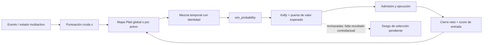

# Auditoría del calibrador, reloj de evidencia e integración concurrente

Fecha del corte inicial: 2026-09-28. Autor: Codex. Rama: `codex/calibration-clock-audit`.
Documento aditivo: no sustituye el informe forense maestro ni las auditorías anteriores.
Antecedente directo: [auditoría EWMA/W1, §8 y §31](AUDITORIA_INTEGRACION_EWMA_Y_RELOJ_2026-09-28.md).
Artefacto estructurado: [JSON de esta ola](artifacts/auditoria_calibracion_platt_2026-09-28.json).

## 1. Dictamen y límites de la evidencia

Se reprodujeron **cinco pruebas fallidas** contra el calibrador de `main=a3d2eb06`.
No eran una conjetura sobre rentabilidad: el optimizador incumplía el objetivo
matemático que el propio módulo declara. Una corrección factible de Newton,
con búsqueda de descenso, hace pasar las siete pruebas iniciales; una octava
comprueba condiciones de optimalidad en 24 ventanas deterministas adicionales.
Las 127 pruebas internas del núcleo también pasan sobre ese corte.

Estos resultados no prueban calibración fuera de muestra, rentabilidad,
latencia en producción, equivalencia demo/backtest, ni cobertura total del
proyecto. El inventario de la base contiene 1.321 archivos versionados, 405
Rust y 24 Cargo.toml; **contarlos no equivale a revisarlos archivo por archivo**.
No se ejecutaron órdenes, procesos de trading, entrenamiento de bosques,
promoción de modelos ni cambios de credenciales. La simulación de resultados
booleanos para probar Platt no entrena ni publica un modelo operativo.

Las evidencias se separan en: prueba reproducida, deducción del código,
hipótesis de diseño y validación pendiente. Un informe histórico que diga
«resuelto» no prevalece sobre un contraejemplo posterior.

## 2. Topología: desde la evidencia hasta el veto



**Nodo raíz:** procedencia del score y de la etiqueta, activo, horizonte,
reloj de observación y versión del modelo. **Nodo de decisión:** probabilidad
usada por Kelly/EV. **Nodo terminal:** cierre neto de una operación ejecutada.
El retorno del nodo terminal al calibrador crea un lazo de selección:
aprender sólo de lo admitido no demuestra el comportamiento de lo rechazado.

Lugares inspeccionados: `calibration.rs` completo; consumidores de
`update_at`, `calibrate_at`, `score_at_entry` y `raw_confidence_score`
en `god-engine-core/src/lib.rs`; constantes y transformaciones de horizonte
en `temporal_spectrum.rs`; delta del consumidor Hawkes en `3cdbb6b3`;
`contagion_modulator.rs`; memoria, índices e historial Git.
No se atribuye a esta lista cobertura semántica de los demás archivos.

## 3. Matriz de hallazgos

| ID | Prioridad | Estado en esta ola | Hallazgo y efecto |
|---|---|---|---|
| CAL-01 | P1 | Reparado; regresiones locales pasan | Proyectar la pendiente sin recomputar el intercepto no resuelve Newton restringido. |
| CAL-02 | P1 | Reparado; regresiones locales pasan | Un paso de Newton libre puede multiplicar la pérdida y saturar la probabilidad. |
| CAL-03 | P2 | Reparado en API de entrenamiento | Scores finitos fuera de [0,1] contaminaban el prior, el ajuste y el reloj. |
| CAL-04 | P2 | OPEN; amplía EWMA-W1-08 | El último cierre rejuvenece toda la ventana; no hay edad por observación. |
| CAL-05 | P2 | OPEN | Conmutación global/local a cinco cierres y ausencia de contexto temporal en la etiqueta. |
| CAL-06 | P2 | OPEN | El presupuesto del solver no expone convergencia al consumidor. |
| CAL-07 | P2 | OPEN | Restricciones y anclas estadísticas no están validadas para todo el espectro. |
| CAL-08 | P1 de validación | OPEN | Ajustar correctamente una muestra seleccionada no identifica el edge de lo vetado. |
| INT-01 | P2 de proceso | Observado; ya ausente en checkout posterior | Un commit de «resolución» conservaba marcadores de conflictos. |
| INT-02 | P2 | OPEN / dueño avisado | Consumidor de contagio añadido sin publicador localizado ni equivalencia completa con el helper. |

P1 representa impacto potencial importante en decisión o validación; no
significa que se haya observado una pérdida monetaria en producción.
CAL-01/02 comparten reparación, pero tienen causas y testigos distintos.
CAL-04 no se cuenta como descubrimiento independiente de EWMA-W1-08.

## 4. Objetivo matemático y significado de cada cálculo

Se conservan el modelo, el prior y la restricción originales:

- `s ∈ [0,1]`: score crudo, no probabilidad certificada.
- `x = logit(clip(s, ε, 1−ε))`, `ε=10⁻⁴`: coordenada numérica finita.
- `z = a x + b`; `p = sigmoid(z)`: mapa paramétrico.
- `a ≥ 0`: política de preservar el orden de scores; no ley de mercado.
- `q = Q/n`, `Q = 1.959963984540054²`: masa total del prior repartida por muestra.
- `ỹ = (y + q s)/(1+q)`: etiqueta suave que combina dato real y pseudo-observación.
- `r = 10⁻⁴`: ridge hacia `(a,b)=(1,0)`.

La función minimizada es:

```text
L(a,b) = r/2 · [(a−1)² + b²]
       + Σ_i (1+q) · [softplus(a x_i+b) − ỹ_i·(a x_i+b)]
sujeto a a ≥ 0.
```

Su propósito es medir la incompatibilidad entre probabilidades y etiquetas
del conjunto retenido, regularizando la solución. No mide beneficio,
drawdown, costes, riesgo de ruina ni calibración futura.

El gradiente es la suma de residuos ponderados `(p−ỹ)`; la Hessiana
pondera el producto exterior de `(x,1)` por `(1+q)p(1−p)`, más `rI`.
Con scores válidos y ridge positivo, el problema es estrictamente convexo:
las condiciones KKT identifican el único óptimo del objetivo definido.
En el interior se requieren ambos gradientes nulos; en `a=0` se permite
`∂L/∂a ≥ 0`, pero **todavía se exige `∂L/∂b=0`**.

La formulación permite comprobar el solver con oráculos derivados de su
objetivo, sin recurrir a «la salida parece razonable». La convexidad del
problema no implica que un número finito de iteraciones haya convergido
en todos los casos posibles.

## 5. CAL-01 — frontera mal resuelta: intercepto incorrecto

**Evidencia anterior.** Con 40 pérdidas en `s=0,8`, la implementación
devuelve `a=0`, `b≈−1,19477`, `p≈0,2324073540`.
La media de referencia sin la pequeña perturbación ridge es:

```text
p_ref = (Q·0,8 + 0)/(Q+40) ≈ 0,07009728096.
```

La discrepancia no es incertidumbre de estimación: ni siquiera minimiza
el objetivo de la propia ventana. Una segunda ventana alterna 20 scores
0,9 perdedores y 20 scores 0,6 ganadores. El mapa monótono debe aplanarse,
aproximadamente hacia `(20+0,75Q)/(40+Q)`, no colapsar a cero.
Antes: `b≈−209603,647`, `p=0`.

**Causa.** Se calculaba un paso Newton 2D sin restricción y después se
recortaba sólo `a` a cero, conservando el paso de `b` calculado para otra
pendiente. Eso no minimiza el modelo cuadrático en la frontera.

**Reparación.** Si el paso libre atraviesa `a=0`, se fija `d_a=−a` y
se resuelve el intercepto factible:
`d_b=−(g_b+H_ab d_a)/H_bb`. El criterio de parada usa gradiente proyectado,
no el tamaño del paso libre que ya no corresponde a la solución factible.

**Impacto potencial.** p es consumida por Kelly y EV. Un valor artificialmente
alto puede relajar exposición y admisión; uno artificialmente bajo puede
crear vetos injustificados. No se midió aquí cuántas órdenes reales cambiaron.

**Cierre.** Testigos de posterior único y de ranking inverso pasan; se
comprueban KKT, no sólo límites [0,1]. Falta evaluación prequential/OOS.

## 6. CAL-02 — Newton sin descenso y saturación

**Reproducción.** Con una primera pérdida en `s=0,9999`, la pérdida MAP
de identidad es `9,214262612976777`; la salida anterior alcanza
`9.629.521,589791697`. Con extremos también se obtuvieron coeficientes
del orden de `a=353808,59`, `b=−38414,59` y gradientes residuales grandes.
Que los coeficientes sean finitos no significa que el ajuste sea válido.

**Causa.** La Hessiana logística se vuelve pequeña cerca de saturación;
Newton sin control de paso puede saltar a una región pésima. El filtro
final `is_finite` no observa la pérdida ni la optimalidad.

**Reparación.**

1. Se evalúa la pérdida con `max(z,0)−ỹz+log1p(exp(−|z|))`, sin overflow
   por `exp(z)` ni logaritmos de probabilidades redondeadas a cero.
2. El inicio elige el mejor entre los coeficientes previos y la identidad.
3. Se acepta un paso sólo si cumple descenso Armijo sobre esa misma pérdida.
4. Hay presupuesto acotado de 100 iteraciones y 50 reducciones de paso.
   Son límites de cómputo, no umbrales de trading ni significancia.
5. Se precalculan logits/etiquetas una vez por ajuste. No se afirma una
   mejora de latencia medida; hay coste adicional por evaluar descenso.

**Pruebas.** Cada prefijo de una secuencia extrema debe tener pérdida
no superior a identidad. Se cubren extremos, clases únicas, ventanas
rodantes, permutaciones del mismo conjunto y 24 ventanas variadas.
Las tolerancias de prueba controlan error numérico; no son intervalos
de confianza estadísticos.

## 7. CAL-03 — entrenamiento con scores inválidos

**Antes.** Sólo se rechazaban no finitos. El logit recortaba el score
para calcular x, pero el prior seguía usando el score original como
etiqueta suave. Valores como 1,1 o −0,1 dejan de ser etiquetas Bernoulli
válidas; `f64::MAX` puede además producir cálculos extremos.

`update_at` actualizaba primero el reloj y luego incorporaba esa
observación. En la prueba, tras intentar cinco scores inválidos por ambas
APIs, el contador pasaba de 1 a 7: sólo NaN e infinito se rechazaban.

**Reparación.** `valid_training_score` exige finitud y pertenencia a
[0,1] antes de cualquier mutación, tanto en `update` como en `update_at`.
Se conserva exactamente ventana, coeficientes y mezcla temporal si el dato
es inválido. Los scores 0 y 1 siguen admitidos; sólo el logit se acota.

**Alcance.** Es robustez de una API pública. No se ha demostrado que el
flujo operativo normal emita esos valores. La API de inferencia mantiene
su compatibilidad histórica: score no finito → 0,5 y extremos recortados.
Esa política de inferencia no debe interpretarse como evidencia neutral.

## 8. CAL-04 — olvido por último cierre, no por dato

La ventana guarda `(score, won)`, sin fecha individual.
`ultimo_dato_ms` es un máximo global; `calibrate_at` mezcla:

```text
p_t = w·p_fit + (1−w)·score
w   = 2^(-(t−ultimo_dato_ms)/semivida).
```

Una sola operación reciente devuelve `w=1` para TODO el historial.
Por construcción, 40 pérdidas antiguas y un nuevo acierto se reajustan
como 41 observaciones de peso unitario, aunque las 40 pérdidas estuvieran
casi olvidadas justo antes. La deducción no depende del solver defectuoso
y sigue siendo válida después de repararlo. No se presenta como un replay
real ejecutado en esta ola.

Un resultado fuera de orden conserva el reloj máximo pero entra con peso
completo; consultas con `now ≤ ultimo` devuelven el mapa más reciente.
No es una API de consultas históricas causales. Mezclar la API sin fecha
con la API fechada tampoco aporta procedencia individual.

**Diseño pendiente.** Transportar tiempo de predicción, tiempo de resolución,
horizonte, versión y disponibilidad de la etiqueta; definir pesos por edad
y política para resultados tardíos. Validar contra un replay causal común.
Rechazar indiscriminadamente cierres tardíos perdería datos legítimos; por
eso no se improvisó aquí esa política.

## 9. CAL-05/07/08 — adaptación, espectro y selección

### 9.1 Multiactivo no equivale a calibración condicional

El consumidor cambia del calibrador global al local cuando
`observations() >= 5`. No hay transición jerárquica continua, ni contraste
de transferibilidad entre activos en ese punto. Cinco cierres no equivalen
a cinco muestras independientes. Correlación, régimen, horizonte y selección
pueden reducir radicalmente la información efectiva.

Los registros de Platt tampoco incluyen τ, dirección, costes, instrumento
ni versión del genoma. El calibrador local separa activos, pero aún mezcla
resultados obtenidos con políticas/horizontes distintos. No basta añadir
muchos calibradores: particionar sin soporte aumenta varianza.

Propuesta a evaluar, no implementada: calibración jerárquica con pooling
parcial y covariables continuas de log(τ), liquidez y volatilidad; pesos
causales por edad; comparación prequential con identidad y una tasa base.
El modelo más complejo sólo debe sustituir al simple si mejora evidencia
fuera de muestra con incertidumbre y coste computacional documentados.

### 9.2 Anclas y política no son leyes físicas

La semivida de Platt toma `TAU_ANCHOR_SLOW_MS=43.200.000` (12 h).
Las transformaciones temporales inspeccionadas también usan anclas de
30 s y 12 h, aunque el banco espectral contiene escalas fuera de ellas.
No es correcto concluir que todo el sistema ya cubre todo el continuo
sólo porque existe una curva o se ha eliminado una etiqueta «swing».

La ventana 512, el prior Q, el ridge y la pendiente no negativa son
decisiones diferentes: memoria limitada, regularización estadística,
estabilidad numérica y restricción de ranking. Se documentan separadas.
Se corrigió la afirmación incorrecta de que el ridge sólo afectaba a
direcciones no identificadas: modifica todo el objetivo.

Un universo continuo requiere modelos evaluables en τ y resolución
adaptativa según datos y error, no enumerar infinitos puntos ni declarar
observada una escala inferior al reloj/datos disponibles. Este calibrador
recibe milisegundos: no acredita cálculo ni información nanosegundo a
nanosegundo. Extrapolar hasta cien años exige supuestos y etiquetas de
incertidumbre, no renombrar una constante.

### 9.3 El veto puede tener lógica correcta con una probabilidad equivocada

Aunque el gate EV aplique correctamente su fórmula, p puede corresponder
sólo a operaciones ya aceptadas. No hay aquí resultados contrafactuales
de todas las propuestas rechazadas. Un calibrador numéricamente correcto
no resuelve ese sesgo, ni prueba que su identidad-prior justifique volver
a arriesgar capital tras olvidar pérdidas.

Criterio de validación: registro de decisiones previo al resultado,
etiquetas maduras de propuestas ejecutadas y no ejecutadas bajo un
contrato comparable, costes y disponibilidad causal explícitos; métricas
propias (log-loss/Brier), fiabilidad y capacidad de discriminación OOS.
No confundir acierto neto de una operación con primer toque del target
del bosque: R8-A sigue pendiente en el informe anterior.

## 10. CAL-06 — observabilidad y costes todavía abiertos

La nueva búsqueda conserva un iterado factible de pérdida no peor al
inicio, pero la API sigue sin devolver estado de convergencia, residuo
KKT, número de iteraciones ni antigüedad efectiva. Un presupuesto agotado
puede ser numéricamente seguro sin ser el óptimo requerido. Las ocho
pruebas no demuestran convergencia universal.

El ajuste ocurre al incorporar cierres en el flujo del núcleo; que no
ocurra al consultar p no significa que sea gratis en el event loop.
Medir percentiles y peores casos con cierres simultáneos multiactivo,
instrumentación de asignaciones y colas; no publicar una cifra HFT
derivada del tiempo de una suite unitaria.

## 11. Integración concurrente y trazabilidad

- PR11/12 ya integraron EWMA/W1/RMT e import del modulador; no se duplican.
- PR13 añadió freno contra stop real y modificó el trinquete T-1. Se
  conserva; su autorización/re-certificación es el reporte de su autor,
  no una medición T-1 de Codex en esta ola.
- PR10 sigue en rama de Claude al corte inicial; Codex no interviene en
  `train_forest` ni declara integrados sus cambios antes de comprobarlo.
- Se observó `main` local `78c81804`, titulado resolución «union», con
  marcadores en cuatro documentos. Posteriormente el checkout compartido
  estaba limpio en `3cdbb6b3` y esos marcadores ya no aparecían.
  Codex no tocó su índice ni borró sus documentos.
- Los backups locales `backup-before-cleanup` y `v7-unificacion-wip`
  se conservan. No hay refs remotas de ellos en el listado observado.
  La ausencia de una rama remota NO demuestra que se integrara su trabajo.

### INT-02: cableado parcial de contagio en 3cdbb6b3

El nuevo bloque lee `hawkes_contagion_net_role` con defecto 0,0 y aplica
una fórmula inline. El comentario dice que el publicador se cableará
después; no se encontró escritura de esa clave en el corte inspeccionado.
Por tanto, no se puede acreditar el ciclo completo indicado por el mensaje
del commit. Un lector conectado no produce por sí mismo la observación.

Además, el helper `modulate_by_contagion` descarta `net_role` no finito;
el bloque inline sólo comprueba `net<0`: con −∞ entra y lo recorta a 50.
Sus contratos difieren. Es un testigo por lectura, no una inyección en vivo.
Se preserva el cambio ajeno y se notifica al dueño. La justificación de
.30/5/50, el estado Unknown y la caducidad siguen sin validación.
Que un activo siga a otro no implica matemáticamente que su señal tenga
menos probabilidad de acierto: puede ser precisamente una oportunidad.

## 12. Investigación: qué aporta y qué no se transfiere automáticamente

[Online Platt Scaling with Calibeating](https://arxiv.org/abs/2305.00070)
distingue Platt por ventanas de actualización online y capas adicionales
de calibración. Su garantía no se hereda por nombrar «online» a una ventana
con una mezcla temporal. La familia OPS y beta scaling son candidatos a
comparar bajo un protocolo causal; no se implementaron aquí.

[Verified Uncertainty Calibration](https://arxiv.org/abs/1909.10155)
advierte de limitaciones de métodos paramétricos y de estimadores de error
de calibración; estudia scaling-binning y evaluación separada. Motiva medir
fiabilidad con incertidumbre, no aceptar ajuste in-sample como certificación.

[Distribution-free binary classification](https://arxiv.org/abs/2006.10564)
relaciona calibración, intervalos y conjuntos predictivos, y delimita
garantías distribution-free. [Approachability, Regret and Calibration](https://arxiv.org/abs/1301.2663)
ofrece un puente entre decisiones secuenciales y calibración. Son familias
teóricas relevantes para un diseño posterior; no prueban que el motor
actual cumpla sus hipótesis. No se atribuye ventaja a física cuántica ni a
problemas del milenio sin operador, unidades, datos y prueba falsable.

## 13. Hoja de ruta de cierre

1. Publicar la reparación acotada del solver con fuente y regresiones,
   integrando el último main y comparando ambos padres.
2. Ejecutar check all-targets y suites del árbol integrado; registrar
   resultado por SHA, sin sumar reejecuciones como cobertura adicional.
3. Contrato temporal por observación y outcome, con replay causal.
4. Validación de calibración condicional/transferencia entre activos y τ.
5. Instrumentar convergencia/latencia y auditar la selección de vetos.
6. Resolver por el dueño el publicador/estado/contrato del contagio.
7. Sólo tras evidencia OOS y controles operativos, evaluar promoción.
   La meta +100%/72 h continúa sin validar; esta auditoría no la garantiza.

## 14. Evidencias ejecutables del corte inicial

- Rojo: `cargo test --offline -q -p god-engine-core --test platt_optimizer_contract -- --test-threads=1`:
  2 pasan / 5 fallan / 0 ignoradas; salida 1.
- Verde misma suite inicial: 7/0/0; salida 0.
- Suite ampliada más núcleo: `cargo test --offline -q -p god-engine-core --test platt_optimizer_contract --lib -- --test-threads=1`:
  8/0/0 y 127/0/0; salida 0. La octava no se presenta como RED anterior.
- Código de reparación: `deeca0c6`. Ver adendas siguientes para integración
  y validación posterior. No usar estos números para otro árbol.

## 15. Adenda: regresión de compilación del main concurrente

**INT-03, P1 de integración.** Al fusionar 3cdbb6b3 con deeca0c6,
check workspace all-targets falla E0308 en el nuevo lector de contagio:
se pasa sym de tipo String a get_scoped_value_or, que exige &str.
La reparación es exclusivamente &sym. No cambia fórmula, umbral ni rama
de decisión del bloque añadido por GLM.

Ambos padres fueron comparados. Frente al padre Codex se conserva el bloque
de 18 líneas de main con el préstamo corregido; frente al padre main quedan
la reparación Platt, sus pruebas y el cambio de una referencia. El segundo
check completo pasa con advertencias, 16,62s. Merge local: 67c63d32.
La suite amplia empieza después del commit; su resultado aún no se afirma
en este corte. Aviso al equipo: PR10/issuecomment-5881232741.
