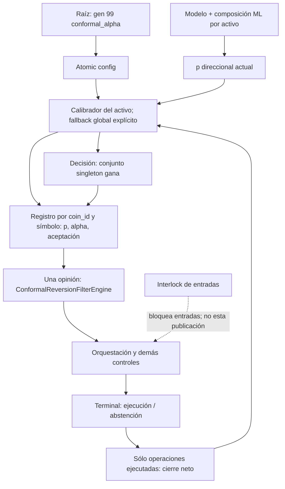

# Auditoría CF — contrato conformal, genoma y bloqueos de realimentación

Fecha de trabajo: 2026-09-28, America/Bogota; algunos recibos GitHub caen el
29 en UTC. Base: **fa23a1b7c00327f108934b70fe257b37c68deb62**.
Rama: **codex/conformal-contract-audit**. Autor: Codex, checkout aislado.
Esta adenda complementa el informe maestro y la auditoría Platt; no borra,
renumera ni declara cerrados sus hallazgos históricos.

## 1. Dictamen y alcance real

Hay una reparación verificable de cuatro defectos de contrato: el objetivo
evolutivo no llegaba al calibrador local, el diagnóstico mostraba otro estado,
las probabilidades inválidas contaminaban el aprendizaje y un interlock de
entradas congelaba la publicación conformal. También se corrigen afirmaciones
científicas que excedían lo implementado. Las limitaciones estadísticas
restantes NO quedan solucionadas por esos cambios.

No se certifica todo el proyecto, todas sus teorías, todos los archivos ni
rentabilidad. Esta ola sigue una cadena concreta desde genoma hasta consumidor
y retorno del outcome. Inventariar nombres, ejecutar tests o encontrar palabras
como «swing» no equivale a auditar semánticamente cada archivo. Los identificadores
legacy de modelos no se han renombrado cosméticamente.

Lectura directa: conformal.rs completo; bloques de construcción, cierre,
publicación y veto de god-engine-core/lib.rs; consumidor
signal-engine/conformal_reversion_filter.rs completo; contrato de símbolos,
registro y posición en sus rutas relevantes; enlaces de config/genome y pruebas
de cierre. Referencias operativas: AGENTS, MEMORIA, coordinación, atlas e informe
maestro y recibo Platt. No se afirma lectura integral del enorme lib.rs ni
certificación de las dependencias por haber compilado el workspace.

## 2. Grafo vivo de esta cadena



El consumidor conformal NO es un veto universal de todas las estrategias.
Por tanto, un bloqueo de su singleton no demuestra que toda la cuenta deje de
operar; otras vías pueden seguir produciendo outcomes. Tampoco la aceptación de
este filtro autoriza por sí sola una orden.

## 3. Matriz de hallazgos de esta ola

| ID | Prioridad | Tipo | Estado de esta ola |
|---|---|---|---|
| CF-01 | P1 | Genoma→estado local desconectado | Reparación y regresión |
| CF-02 | P1 | Telemetría de instancia distinta | Reparación y regresión |
| CF-03 | P1 | Dominio inválido y contaminación de scores | Reparación y regresión |
| CF-04 | P2 | Interlock congela diagnóstico conformal | Reparación y regresión |
| CF-05 | P1 | Cota ACI atribuida a una recurrencia distinta | Documentación corregida; garantía abierta |
| CF-06 | P1 | Cobertura marginal confundida con error selectivo | Documentación corregida; contrato abierto |
| CF-07 | P1 | Feedback retrasado sin snapshot de decisión | Abierto |
| CF-08 | P1 | Probabilidad direccional vs resultado económico neto | Abierto; enlaza R8-A/CAL-08 |
| CF-09 | P2 | Mezcla de escalas y reloj por observación | Abierto |
| CF-10 | P1 | Resolución finita puede cerrar todos los singleton | Abierto; test diagnóstico |
| CF-11 | P2 | Warmup y ausencia de evidencia indistinguibles | Abierto, política preservada |
| CF-12 | P2 | Cero válido excluido en el llamador de cierre | Abierto; contrato de dato ausente pendiente |
| CF-13 | P2 | Latencia y escaneos reiterados | Coste estructural identificado; benchmark pendiente |
| CF-14 | P2 | Un gen controla dos criterios estadísticos distintos | Acoplamiento confirmado; validación abierta |

Prioridad expresa riesgo de corrección/modelo, no pérdida monetaria medida.
«Documentación corregida» no significa teoría validada en producción.

## 4. CF-01 — genoma aplicado al calibrador equivocado

**Evidencia anterior.** En fa23, lib.rs:3539 llama set_target_alpha sobre
self.conformal. Las cuatro consultas que siguen seleccionan en cambio
conformal_by_coin[coin_id] cuando existe. El vector se construye para la
capacidad del arena. Por ello, el camino normal usa un target local inicial de
0,10 aunque config contenga 0,03, 0,18 o cualquier otro valor válido.

**Consecuencia.** La optimización puede modificar gen99 sin modificar el objetivo
de adaptación de la instancia que decide. No es correcto llamar a todo el gen
«muerto»: el mismo valor sí alimenta la significancia normal del consumidor.
La desconexión es específica del calibrador local y explica una posible
divergencia de interpretación entre fitness, registros y decisiones, no una
medición causal de pérdidas reales.

**Reparación.** Se selecciona una referencia mutable local o global una sola
vez. Esa instancia recibe el objetivo y produce p-valores, aceptación y alpha
efectivo. Se preserva el fallback global cuando falta el slot. No se transfiere
historia entre activos ni se resetea la adaptación en cada evento.

**Prueba.** Dos activos: publicar gen0,03 cambia el primero, no el segundo;
publicar gen0,18 en el segundo conserva el primero. Después de 50 outcomes
válidos, cambiar el objetivo a0,20 conserva ventana y alpha efectivo, pero el
siguiente update sin error suma 0,20/200, no 0,10/200. Un objetivo NO es un
reset instantáneo del estado adaptativo.

## 5. CF-02 — telemetría no representativa de la decisión

**Evidencia.** La clave conformal_alpha_eff se publicaba desde self.conformal
mientras las decisiones usaban el vector local. En la regresión controlada,
el registro mostraba **0,05**, pero el calibrador decisor estaba en **0,11**.

**Impacto.** Un auditor puede atribuir aceptación o rechazo a un umbral que
jamás utilizó esa instancia. La gráfica parecería estable mientras el
estado local se adapta. No es una diferencia de redondeo: son dos historias.

**Cierre acotado.** El registro se alimenta de la misma referencia decisora.
La prueba verifica claves por coin_id y símbolo, p-valor y aceptación, además
del caso global. La escritura legacy global «último activo» sigue existiendo;
consumidores externos sin scope todavía requieren auditoría separada.

## 6. CF-03 — observaciones imposibles admitidas como información

**Mecanismo anterior.** nonconformity reemplazaba NaN/infinito por0,5 y
recortaba finitos fuera de[0,1]. accepts devolvía true durante warmup antes
de comprobar el dato. update hacía avanzar score, alpha y contadores con
esas imputaciones. No había provenance que distinguiera datos genuinos.

**Testigo.** Tras40 victorias a0,9: n40, alpha0,105, error0 y p(0,6)=1/41.
Añadir NaN, +inf, -inf, -0,1 y1,1 como pérdidas produjo n45,
alpha0,0875, error4/15 y p(0,6)=5/46. Datos que no son probabilidades
cambiaron la política, y el calentamiento aceptaba NaN.

**Contrato nuevo.** Sólo finitos en[0,1]. update inválido no muta ningún estado;
accepts inválido es false incluso en warmup. Los extremos0 y1 son válidos.
p_value_for inválido devuelve0 como sentinel explícito de rechazo, NO como
p-valor inferido; todo rango empírico válido es ≥1/(n+1). No se introducen
outcomes sintéticos ni se ajusta el score para hacerlo parecer plausible.

**Límite.** El API legacy sigue siendo f64 y no un enum de calidad de dato.
Un consumidor debe distinguir sentinel de inferencia. Este arreglo no detecta
probabilidades finitas mal calibradas ni errores de semántica del target.

## 7. CF-04 — veto de entradas mezclado con publicación de conocimiento

El return de entries_blocked estaba después del ML pero ANTES de publicar
el bloque conformal. La frase «analítica completa» del comentario no describía
esa ruta. Con allow_entries=false se preservaba la inferencia ML, pero no
se aplicaba el objetivo local ni se refrescaba conformal_alpha_eff.

Se mueve únicamente el bloque conformal a continuación de ml_prob_motor,
antes de ese return. No se reubica el kill switch ni se autoriza ninguna
entrada. El camino de cierre sigue entregando closed_order. La regresión
bloquea entradas y comprueba estado/registro actualizado y ausencia de
órdenes. No implica que toda la analítica posterior al interlock ya sea inmune;
el resto del bloque de estrategias conserva su orden.

## 8. Cálculos: definición, unidades y límites

Para predicción p en[0,1] y etiqueta y∈{0,1}, el score es
s(p,y)=1−p si y=1, y s(p,y)=p si y=0. Es adimensional; mide desacuerdo
de la confianza con una etiqueta, no retorno, riesgo de ruina ni utilidad.

El rango q_y=(1+Σ1[s_i≥s(p,y)])/(n+1) compara esa etiqueta con los cierres
retenidos. El +1 es la corrección finita y ≥ mantiene empates inclusivos.
q_y no es P(y|x). El conjunto es C={y:q_y>alpha_eff}. Se acepta sólo C={1}.
La significancia normal del consumidor es OTRO cálculo: usa 2Φ(−|z|) y
max(0,min(1,1−p_normal/alpha_target)) bajo una hipótesis normal estándar.

La actualización implementada es:
```text
u_t     = a_t + gamma * (b_t - e_t)
a_{t+1} = clip(u_t, 0.0001, 0.5)
gamma   = 1/200
e_t     = 1[etiqueta del cierre fuera del conjunto recalculado ahora]
```
b_t es el objetivo, a_t el estado efectivo. Disminuir a ensancha el conjunto;
eso puede reducir errores de cobertura y simultáneamente aumentar abstenciones.
No demuestra mayor beneficio neto. gamma tiene unidades «por observación de
feedback»; llamarlo memoria de200 cierres es una heurística, no una identidad
con un filtro exponencial ni200 segundos.

## 9. CF-05 — la proyección cambia la demostración de ACI

La Proposición4.1 de [Gibbs y Candès (2021)](https://arxiv.org/abs/2106.00170)
telescopa la recurrencia sin proyección y usa convenciones de conjuntos
extremos para niveles fuera del intervalo unitario. No autoriza sustituirla
por clip[0,0001;0,5] conservando su cota. Esta es una comparación directa de
la fórmula del artículo con la fuente, no una recomendación de retirar el clip.

Derivación propia del residuo: r_t=a_{t+1}−u_t. Sumando exactamente,
```text
media(e_t - b_t) = (a_1 - a_{T+1} + Σ r_t) / (gamma*T)
```
Sin controlar Σr_t, acotar sólo los extremos de a no reproduce la cota
original. Con objetivo evolutivo cambiante, además el referente es la media
de b_t, no un único alpha fijo.

**Contraejemplo ejecutable.** 5.000 observaciones p0,5, y=1 producen
scores idénticos, ambos rangos1 y conjunto de dos etiquetas. Tras30 de
warmup hay4.970 adaptaciones; alpha_eff satura en0,5, error medio0,
distancia al objetivo0,1. La cota original calculada es≈0,03642, menor que0,1.
El test histórico pseudoaleatorio que pasa otra secuencia no prueba un teorema.

Este ejemplo demuestra fallo del seguimiento bilateral que se afirmaba;
NO demuestra subcobertura: de hecho es sobrecobertura y abstención. Se corrige
la afirmación documental y se conserva explícitamente la política numérica.
Validar otra recurrencia exigiría nueva evaluación de sets, selección,
delays, costes y feedback; no basta con quitar una llamada clamp.

## 10. CF-06 — selección no equivale a cobertura marginal

Aunque se consiguiera P(Y∉C)≤alpha, eso no implica
P(Y∉C | A=1)≤alpha con A=«operar». En particular, para
A={C={gana}}, la pérdida implica no cobertura, pero dividir por una
probabilidad de selección pequeña puede amplificar la tasa condicional.
Una cota marginal aislada sólo permite una cota tan débil como
alpha/P(A=1), truncada a1, cuando el numerador relevante queda acotado.

La distinción se contrasta con la sección1.2 de
[Online selective conformal inference](https://arxiv.org/abs/2508.10336).
Su tratamiento de inferencias seleccionadas motiva medir FCP/selección;
no se ha trasladado su algoritmo ni probado sus condiciones aquí.

Los comentarios que decían «tasa de error controlada por alpha» para la
regla singleton se corrigen. Se necesita registro de decisiones, fracción
seleccionada, errores por estado, tiempo/activo y política vigente. Estudiar
selección es distinto de forzar operaciones exploratorias con dinero real.

## 11. CF-07 — se mide el error al cerrar, no el de la decisión

update recibe únicamente p_hat y won. No conoce prediction_id, instante
de emisión, versión de modelo/genoma, alpha en ese instante ni máscara del
conjunto emitido. Calcula q_y usando los scores y alpha actuales, antes de
insertar el outcome. Eso evita auto-incluir ese resultado, pero NO reconstruye
el conjunto histórico cuando otros cierres, modelos o parámetros cambiaron.

**Riesgo.** Dos operaciones abiertas en el mismo estado y cerradas en distinto
orden pueden recibir una atribución de error distinta. La contabilidad ACI
puede evaluar una política posterior a la que decidió. El objetivo del gen
también se aplica al publicar después del tramo de cierres; un cambio entre
eventos no es un snapshot causal de la política de apertura.

**Criterio de cierre.** Guardar identidad y conjunto emitido junto a tiempos de
decisión/outcome, y definir una recurrencia apta para feedback demorado.
Probar permutaciones de cierre con las mismas predicciones y verificar qué
invariancias se exigen. No aceptar un nombre «prequential» como prueba.
Abierto: esta ola sólo corrige el comentario que afirmaba lo contrario.

## 12. CF-08 — target predictivo y outcome no intercambiables

El núcleo transforma p direccional en p o1−p según lado y entrena contra
is_win neto. La complementación arregla una inversión de lado, no convierte
una probabilidad de subida/primer toque en probabilidad de beneficio neto
bajo cualquier stop, take profit, comisión, spread, financiación y horizonte.
Es la misma frontera conceptual señalada en R8-A y la ola Platt; no se cuenta
como un target nuevo ya reparado.

**Criterio de cierre.** Fijar qué variable aleatoria pronostica cada modelo y
cómo se construye su etiqueta causal. Evaluar calibración condicionada por
lado, activo, tau, costes y política de salida; comparar secuencias backtest,
demo y live con el mismo identificador de decisión. No usar win rate aislado
ni una mejora in-sample como equivalencia de targets.

## 13. CF-09 — continuo temporal todavía colapsado en scores sin edad

El calibrador retiene sólo f64 en VecDeque y no recibe timestamp ni tau.
Mantiene200 resultados y warmup30. Separar por coin_id evita cierta mezcla
cross-asset, pero dentro de un activo combina cierres de escalas, versiones
de modelo y edades distintas. Dos activos con cadencias diferentes usan
duraciones físicas de evidencia distintas aun teniendo el mismo n.

No existe aquí un campo de calibración continuo sobre (activo, log(tau),
estado de mercado). El arreglo de cableado no crea ese campo ni estima
incertidumbre en regiones sin datos. La posición tiene entry_tau_ms, pero
la llamada update no lo transporta a conformal. La persistencia del vector
por índice exige además verificar qué ocurre al rotar el universo: es una
pregunta de identidad todavía no cerrada, no un cruce de activos reproducido
en esta ola.

**Diseño evaluable, no implementado.** Registrar edad, tau y versión primero;
comparar pooling parcial jerárquico y ponderaciones de cercanía/edad mediante
replay causal. Una ponderación rompe a su vez hipótesis del conformal
intercambiable clásico: se debe especificar qué cobertura se pretende y bajo
qué distribución, con tamaño efectivo y soporte. No reemplazar «scalping /
swing» por nuevos bins sin justificar frontera y error de aproximación.

Timestamps en nanosegundos son una representación, no evidencia a resolución
nanosegundo. Extrapolar hasta100 años sin observaciones no produce conocimiento.
Un modelo multiescala debe declarar resolución del feed, ventana histórica,
aliasing, incertidumbre y presupuesto de cómputo; no se promete recorrer
literalmente cada nanosegundo de un siglo.

## 14. CF-10 — abstención estructural y realimentación potencialmente detenida

En un estado caliente, q_y≥1/(n+1). Para excluir «pierde» se exige
q_0≤alpha_eff. Si alpha_eff<1/(n+1), esa desigualdad es imposible PARA TODAS
las predicciones válidas. Con n≤200, el mínimo global es1/201≈0,004975.
El clip permite estados menores, hasta0,0001.

**Test nuevo.** Target0,01,200 victorias a p0,9 y tres pérdidas con scores
crecientes0,2;0,3;0,4 dejan alpha≈0,00365. La prueba recorre1.001
probabilidades en[0,1], todas rechazadas; la imposibilidad general se deduce
del rango mínimo, no sólo de esa malla. Consultar mil veces no cambia alpha.

Si ésta fuera la única vía que origina trades, no habría nuevos cierres y el
adaptador no podría salir de ese estado. En el sistema actual hay otras
estrategias: sólo se confirma el bloqueo de ESTA vía y el riesgo condicional
de inanición de feedback, no una paralización de todo el motor.

**No reparación cosmética.** Subir el piso para forzar operaciones cambia
riesgo; quitar el singleton elimina el control. Se requiere telemetría de
inviabilidad del conjunto y protocolo de outcomes en sombra, sin ejecución,
con reglas de selección y maduración definidas. Ese shadow ledger no existe
por el mero hecho de almacenar scores de operaciones reales.

## 15. CF-11/12 — ausencia de datos y extremos legítimos

**CF-11.** Antes de30 resultados se devuelve aceptación true y q=1. Al
completar el warmup la política cambia discretamente a singleton. Error
adaptativo devuelve0 si no hubo pasos. Sin flags/número de observaciones
publicados junto al diagnóstico, estos valores se pueden confundir con
cobertura perfecta. Además, el consumidor interpreta una clave de aceptación
ausente como true. Son decisiones de fail-open, no garantías científicas.
Esta ola conserva el warmup de entradas válidas y documenta su significado;
sólo corta el fail-open para datos inválidos.

Cierre requerido: estado explícito «sin evidencia / calentando / válido /
fuera de soporte», costes de abstención y protocolo de arranque. Eliminar el
warmup sin ese diseño también puede bloquear por completo un modelo nuevo.

**CF-12.** La clase acepta p0 y1 correctamente, pero el llamador de cierre en
lib.rs:2578 sólo entra si ml_at_entry>0. Así,0 legítimo no llega al calibrador
aunque1 sí. También puede haber un0 legacy que signifique «no registrado»:
no se cambia a >=0 sin distinguir ambos casos. Falta Optional/validez explícita
del predictor guardado, con test end-to-end del extremo y de dato ausente.

## 16. CF-13/14 — coste y acoplamientos no acreditados por nombres

**CF-13.** En caliente, dos p-valores publicados más dos accepts hacen hasta
seis barridos de n scores por evento, antes de añadir el coste del registro.
Con n200 son hasta1.200 comparaciones de rango, no1.200 nanosegundos.
Mover la publicación antes del interlock añade ese trabajo también cuando
las entradas están vetadas. Es un coste estructural real; no se midió aquí
p50/p99 ni se demostró un cuello de botella. Optimizar con rangos compartidos
requiere equivalencia exacta en empates y ambos lados, además de benchmark
sin compilación concurrente de otros agentes. No se afirma latencia HFT.

**CF-14.** conformal_alpha también gobierna significance_strength del filtro,
basada en una cola normal bilateral del z-score. Controla simultáneamente
un target de cobertura/adaptación y un umbral de evidencia de reversión.
No hay identidad teórica entre ambos. El gen no estaba completamente inerte,
y conectarlo bien ahora cambia el comportamiento que antes no consumía el
target local. Hay que validar la interacción OOS; no atribuir cualquier
cambio de fitness exclusivamente a «mejor calibración».

Próxima prueba: ablaciones manteniendo un criterio fijo, medición de selección,
cobertura y utilidad neta por activo/tau, y comprobación de la distribución
nula del z-score. La fórmula normal es correcta bajo su hipótesis; el que el
mercado satisfaga esa hipótesis es una cuestión empírica diferente.

## 17. Matriz de evidencia ejecutable

1. Primer fixture de7 tests:1 pasa/6 fallan; cuatro transitaban con entradas
   bloqueadas. Ese corte no aislaba correctamente el fallo del target.
2. Se registra el símbolo y se separa allow_entries=true del caso bloqueado.
   RED controlado de10 tests sobre fa23: **3 pasan /7 fallan /0 ignoradas**.
   Pasan fallback, extremos/empates y contraejemplo ACI; fallan cableado,
   telemetría, nuevo target adaptativo, interlock y tres contratos de dominio.
3. Mismas10 tras el arreglo: **10/0/0**, núcleo lib **127/0/0**.
4. Se añade el undécimo diagnóstico de resolución finita; no se presenta como
   fallo RED arreglado: documenta una política que permanece abierta.
5. Las suites amplias y check se registrarán en una adenda con su árbol fuente.
   No reutilizar resultados Platt965/0/1 como evidencia de esta ola.

Comandos principales:
```text
cargo test --offline -q -p god-engine-core --test conformal_wiring_contract -- --test-threads=1
cargo test --offline -q -p god-engine-core --test conformal_wiring_contract --lib -- --test-threads=1
cargo test --offline -q -p god-engine-core -p risk-engine -p quantum-arena -p feature-engine -p evolution-engine -p signal-engine --all-targets -- --test-threads=1
cargo test --offline -q -p backtest-engine --lib -- --test-threads=1
cargo check --offline --workspace --all-targets
```

No exchange, órdenes reales, entrenamiento real, promoción, reinicio de daemon,
T-1 ni cambios de golden/umbrales de riesgo. Fixtures de inferencia local pueden
emitir avisos de modelos ausentes y entorno de genoma no declarado; no cargan
por ello un entorno prod ni publican modelos. Se conserva la configuración
explícita exigida por genome-store.

## 18. Teoría y hoja de ruta de rehabilitación

Se verificó en el cuerpo del trabajo original de ACI su Proposición4.1,
y en OnlineSCI la distinción selección/cobertura. Firecrawl research ayudó
a contrastar condiciones, no a importar recetas por prestigio. Familias
adicionales recuperadas: [ACI para series temporales/AgACI](https://arxiv.org/abs/2202.07282)
y [predicción online con cambios arbitrarios](https://arxiv.org/abs/2208.08401).
En esta ola esas dos últimas son candidatos bibliográficos, no algoritmos
implementados ni garantías verificadas para el motor.

Orden de cierre propuesto:
1. Cableado/dominio y recibos Git reproducibles: esta reparación.
2. Ledger de decisiones y outcomes con tiempos, sets y versiones; equivalencia
   entre replay/demo/live antes de atribuir causalidad a un gen.
3. Protocolo de feedback retrasado/selección; medir calibración entre aceptadas,
   abstenciones y ausencia de soporte, sin forzar riesgo real.
4. Identidad estable de activo y campo de evidencia continuo en log(tau);
   validar cada interpolación y su incertidumbre, no sólo cambiar etiquetas.
5. Reloj estadístico por datos disponibles y coste, con evaluación OOS purgada
   de filtraciones temporales; controles por número de experimentos.
6. Benchmark de latencia y ablation de genes, manteniendo guards económicos.
7. Sólo con evidencia neta y operativa, evaluar cualquier promoción por el
   procedimiento autorizado del proyecto. Nada se despliega desde esta ola.

Ecuaciones de física, ideas cuánticas o problemas del milenio no sustituyen
variable observable, hipótesis, operador computable, unidades y falsación.
La meta +100% cada72h es una aspiración no validada; no es un criterio de
aceptación que autorice quitar límites o garantías de supervivencia.

## 19. Coordinación e integración: corte previo

Se reutiliza el worktree Codex, sin alterar el índice compartido. Se observa
GLM en glm/xlv-health-check y Claude con PR10 abierto (c844d4fd).
Avisos de reserva y hallazgos:
- [Reserva del alcance](https://github.com/Jhona-la/Trader-Gemini/pull/10#issuecomment-5882626900).
- [RED y separación de responsabilidades](https://github.com/Jhona-la/Trader-Gemini/pull/10#issuecomment-5882772751).

PR14 sí llegó a mainfa23; no se confunde cerrado con merged. Los backups
locales con commits exclusivos se conservan. Las ramas de otros agentes
activas no se borran aunque alguno de sus commits ya sea ancestro.
La confirmación posterior de PR/merge/push y retirada de la rama propia debe
consultarse en la adenda/recibo, no inferirse de este corte previo.

## 20. Validación final de fuentes antes de publicación

Fuente congelada en **836aa9dcefb3b495edf0db238aedf9453ebd00ed**, descendiente
de mainfa23. Cambios siguientes del informe son sólo documentación.

| Verificación | Pasan | Fallan | Ignoradas | Evidencia |
|---|---:|---:|---:|---|
| Seis crates, all-targets | 945 | 0 | 1 | 72 bloques, salida0 |
| backtest-engine, lib | 31 | 0 | 0 | salida0;48,98s de ejecución |
| Total de ámbitos distintos | 976 | 0 | 1 | 11 regresiones nuevas ya incluidas |
| workspace check all-targets | — | — | — | salida0;53,99s; warnings |

Las137 iniciales y los10 de GREEN no se vuelven a sumar al total.
Los dos tests diagnósticos de teoría/resolución PASAN porque exhiben límites
abiertos, no porque el sistema haya obtenido una garantía nueva.
No hubo edición de goldens, pruebas ignoradas ni umbrales para conseguir verde.

El inventario de fa23 cuenta1.324 archivos versionados y24 miembros Cargo
(incluida la raíz). Check cubre sus targets, no equivale a testearlos todos
ni leerlos semánticamente. Hashes SHA-256 de las tres fuentes/test y detalles
de los14 hallazgos están en el JSON. Esta ola agrega documentación a los
cuatro índices compartidos; no reemplaza informes anteriores.
