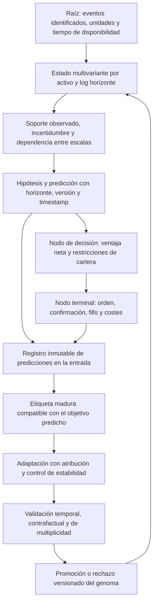

# Auditoría de continuidad espectral, aprendizaje y causalidad — 24 de septiembre de 2026

## Dictamen y alcance verificable

El código inspeccionado no permite certificar un sistema temporal universal ni una evolución causalmente validada. Sí existe un banco de filtros sobre una malla extensa, interpolación logarítmica, curvas de genoma y retroalimentación de resultados. El problema es la conexión y el significado de esas piezas: hay medidas incompatibles del mismo campo, cortes operativos históricos, atribución de resultados a predicciones de otro instante y un evaluador de candidatos con microestructura sintética.

Esta adenda conserva los informes anteriores. No reemplaza sus censos ni suma los identificadores CES a los D/X como si fueran defectos necesariamente nuevos: varios son reapariciones o ampliaciones que requieren conciliación con el historial. Los estados de esta adenda describen únicamente lo contrastado en esta revisión.

**Base:** `main` en `edb7194e20616ccf3a05b138035ed080afc15827`, más modificaciones concurrentes presentes en el directorio de trabajo. `origin/main`, refrescado mediante fetch, estaba en `1fa9a9141e1f7e373759974ccf17fcc545886f47`. La rama de auditoría estaba en `8ffcdb2d317fa7c5886c9aca1c6f88ad77f36ac4`.

**Cobertura:** inventario de 289 archivos Rust versionados; búsqueda de texto `scalp|swing` con coincidencias en 77 archivos Rust de `crates/` y `src/`. Ese número incluye comentarios, compatibilidad y tests: no equivale a 77 motores binarios. Lectura dirigida del núcleo temporal, curvas del genoma, asignación de posiciones, ensamble, evaluador evolutivo, consumidores espectrales del núcleo y riesgo, continuidad de estado y documentación. **No se revisaron línea por línea los 289 archivos ni se certificaron todos los crates.**

Se verificaron por ejecución el módulo temporal y el crate `quantum-arena`; se comprobó la compilación de todos los targets de `god-engine-core`. No se ejecutó trading, no se reinició el motor y no se cambiaron genomas activos ni datos del exchange. No se midieron en esta intervención rentabilidad fuera de muestra ni latencias p99/p999.

## Qué significa aquí un continuo temporal

Sea `u = ln(τ/τ_ref)`. La representación deseada es un estado `X_a(u,t)` para cada activo `a`: una función del horizonte y del tiempo de evento, que contiene variables de precio, flujo, liquidez y contexto junto a su soporte observacional. Una implementación finita puede aproximarla mediante bases o cuadratura. La existencia de 32 nodos no invalida por sí misma el continuo; lo que debe verificarse es la convergencia de la aproximación y el error al cambiar la malla.

Hay cuatro magnitudes distintas:

1. **Coordenada representable:** el software admite un valor de τ, incluso 1 ns o 100 años.
2. **Resolución observable:** el reloj, el feed y el registro permiten distinguir eventos a esa escala.
3. **Soporte estadístico:** hay historia, observaciones efectivas y estabilidad suficientes para estimar una propiedad en ella.
4. **Horizonte ejecutable:** las restricciones del instrumento, costes, liquidez, latencia y capital admiten la acción propuesta.

Una coordenada representable no prueba ninguna de las otras tres. Tampoco hace falta iterar mil millones de veces por segundo para evaluar un modelo continuo: la actualización analítica puede integrar el intervalo entre eventos. La API actual usa `u64` en milisegundos y carece de soporte para distinguir eventos submilisegundo. Su coste O(32) no demuestra una latencia de un nanosegundo.

La política de acción debería condicionarse al estado, evidencia y restricciones: `π(acción | X, soporte, incertidumbre, costes, exposición)`. Las etiquetas históricas no deberían seleccionar algoritmos independientes. Los límites físicos y la ausencia de evidencia sí deben existir y ser visibles; no deben ocultarse dentro de dos anclas heredadas.

## Topología causal: raíz, decisiones y terminales

El siguiente esquema es el **contrato de diseño propuesto**, no una afirmación de que todas sus aristas estén implementadas:

Un identificador de trade, un conjunto de predicciones de entrada y un genoma versionado deben permitir recorrer el ciclo completo. Una señal grande, un grafo de llamadas conectado o un nombre como «epigenético» no sustituyen esa trazabilidad.

## Registro de hallazgos

Prioridades: **P1** afecta decisiones, evaluación o integridad del aprendizaje; **P2** afecta contratos numéricos, interpretación o reproducibilidad. «Corregido localmente» significa código y pruebas locales; no significa desplegado ni validado económicamente. Estado de este corte: **6 corregidos localmente, 1 parcialmente corregido y 10 abiertos**.

### CES-001 · P1 · Un mismo campo tenía medidas incompatibles — corregido localmente

**Evidencia.** `crates/quantum-arena/src/temporal_spectrum.rs`, métodos `update`, `spectral_field`, `spectral_coherence`, `continuous_energy_density`, `continuous_band_projection` y los tres centroides. La fusión usaba `clamp(2·|p|·g, 0.02, 3)`. El campo y la coherencia usaban `clamp(2·|p|, 0.05, 1)`, omitiendo la ganancia aprendida `g`. La densidad usaba `max(2·(p−0.5), 0.05)`, tratando como probabilidad una persistencia cuyo dominio real es [-1,1].

**Mecanismo e impacto.** El aprendizaje alteraba una lectura y no otras. Con dos escalas de señales +0.8 y −0.8, persistencias de igual magnitud y ganancias 2:1, la fusión favorecía la primera mientras el campo podía informar equilibrio. Los consumidores del núcleo usan esas lecturas para dirección, confianza y horizonte; por tanto, no se trataba de una diferencia meramente gráfica. El peso de anti-persistencia también cambiaba según la función consultada.

**Corrección.** `ScaleState::fusion_weight` concentra la política ya existente de fusión. Todas las lecturas indicadas la consumen. La densidad interpola las masas nodales `w·|s|`; así coincide exactamente con la medida del campo en la malla. No se afirma que esta política de pesos esté calibrada: se elimina la contradicción interna sin presentar sus constantes como una ley estadística.

**Prueba y cierre.** `spectral_contract_learning_reaches_field_and_projection` y `spectral_contract_energy_is_consistent_at_grid_nodes` fallaron antes y pasan después. En el ejemplo, la masa total es 2.4 y el centroide logarítmico reparte la masa 2:1. Queda pendiente medir el efecto económico del cambio en los consumidores; sus umbrales podrían haber sido ajustados contra la antigua inconsistencia.

### CES-002 · P1 · El resultado de aprendizaje dejaba la fusión en un estado anterior — corregido localmente

**Evidencia.** `TemporalSpectrum::apply_epigenetic_outcome` modificaba las ganancias; `fused_score` y `dominant_tau_ms` solo se recalculaban durante `update`.

**Mecanismo e impacto.** Un cierre puede ocurrir entre ticks. Tras entrenar, los centroides calculados a demanda observaban las ganancias nuevas mientras el agregado almacenado retenía las anteriores. El mismo objeto publicaba estados de dos generaciones. El fallo es observable aunque no haya una carrera entre hilos.

**Corrección.** `refresh_fusion` se invoca tanto tras un evento aceptado como tras un resultado válido de aprendizaje. Conserva los límites operativos heredados; no migra los lectores del genoma.

**Prueba y cierre.** `spectral_contract_learning_refreshes_fusion_without_new_tick`: después de un cierre, `fused_score == spectral_coherence(true)` dentro de tolerancia numérica, sin introducir otro tick. La prueba falló antes de la corrección.

### CES-003 · P2 · El timestamp cero no podía ser origen válido — corregido localmente

**Evidencia.** `TemporalSpectrum::update` usaba `last_ts_ms == 0` como indicador de inicialización.

**Mecanismo e impacto.** Un replay relativo que comienza en t=0 inicializaba correctamente el primer evento, pero el segundo volvía a inicializar los filtros. La trayectoria dependía de haber añadido o no una constante al reloj, aun conservando todos los intervalos entre eventos. Esto rompe la equivalencia entre replays con distintos orígenes temporales.

**Corrección.** Un booleano privado distingue «sin inicializar» de un instante válido de valor cero.

**Prueba y cierre.** `spectral_contract_timestamp_zero_is_a_valid_origin` compara la misma trayectoria con orígenes 0 y 1000 ms; las señales y medias coinciden. Antes fallaba. El cambio no resuelve eventos distintos que comparten el mismo milisegundo: véase CES-015.

### CES-004 · P1 · Un resultado no finito podía cambiar el aprendizaje — corregido localmente

**Evidencia.** `apply_epigenetic_outcome` verificaba τ, pero no `pnl_pct`.

**Mecanismo e impacto.** `max`/`min` con NaN pueden seleccionar el otro operando, convirtiendo una entrada inválida en un incremento numérico aparentemente normal. Una ganancia infinita también quedaba saturada en el máximo del refuerzo. Los errores de contabilidad podían así convertirse en evidencia para la siguiente decisión.

**Corrección.** Se descartan NaN y ambos infinitos antes de mutar cualquier escala.

**Prueba y cierre.** `spectral_contract_invalid_outcomes_cannot_train` verifica que las 32 ganancias permanecen iguales para las tres entradas no finitas. Antes fallaba. La responsabilidad de registrar el origen del PnL inválido sigue perteneciendo al productor y a la telemetría; este guard no constituye un sistema completo de diagnóstico.

### CES-005 · P2 · Cancelación numérica en constantes de tiempo largas — corregido localmente

**Evidencia.** El coeficiente se evaluaba mediante `1 − exp(−Δt/τ)`. Para Δt=1 ms y τ≈4.61·10¹² ms, se resta de 1 un número extremadamente próximo a 1.

**Mecanismo e impacto.** Se pierden cifras significativas del coeficiente antes de aplicarlo. La disponibilidad de `f64` y de nodos seculares no basta para garantizar precisión en su actualización. Este defecto es numérico; no demuestra que exista evidencia estadística secular.

**Corrección.** Se usa la expresión equivalente `−expm1(−Δt/τ)`, manteniendo la misma ecuación diferencial y las mismas unidades.

**Prueba y cierre.** `spectral_contract_long_scale_retains_small_elapsed_mass` contrasta la actualización de la desviación en la escala más larga frente a la formulación estable. Falló antes y pasa después. No se ha certificado la precisión de todas las acumulaciones de muy largo plazo ni su comportamiento tras gaps.

### CES-006 · P2 · Consultas inválidas podían aliasar extremos de la malla — corregido localmente

**Evidencia.** Los interpoladores comprobaban solo `τ <= 0`; NaN e infinito no satisfacen necesariamente esa condición. Operaciones posteriores de `max`, `clamp` y conversión de índice podían seleccionar un extremo válido o producir resultados no finitos.

**Mecanismo e impacto.** Un error de unidades o de cálculo del horizonte podía convertirse en señal de un nodo real, ocultando el error. Una prueba que solo use nodos extremos en cero no detecta ese alias.

**Corrección.** Los interpoladores rechazan explícitamente τ no finita, y la proyección comprueba centro y ancho positivos y finitos. La ganancia interpolada valida sus extremos. Se conserva el valor neutral de cada API.

**Prueba y cierre.** `spectral_contract_invalid_queries_are_neutral` usa nodos con señal, persistencia, precio, dispersión y ganancia no neutrales, evitando un éxito trivial por consultar un nodo vacío. Esta prueba fue reforzada durante la revisión; no se cuenta como uno de los seis fallos de la primera ejecución.

### CES-007 · P1 · Entropía entre escalas confundida con ruido direccional — abierto

**Evidencia.** `TemporalSpectrum::spectral_field` calcula `q_i = w_i·|s_i| / Σw_j·|s_j|` y `H = −Σq_i ln(q_i)/ln(32)`. En `crates/god-engine-core/src/lib.rs`, el acondicionamiento de intención define `extreme_entropy = field.spectral_entropy > 0.98` y anula la señal. El riesgo también reduce beneficios de confianza según esta entropía.

**Contraejemplo.** Si las 32 señales son +1 con pesos iguales, `q_i=1/32`, H=1 y la coherencia direccional es +1. La entropía máxima describe dispersión uniforme de masa entre escalas, aunque todas estén de acuerdo. El test `spectral_contract_maximum_energy_entropy_can_have_full_agreement` lo demuestra por ejecución.

**Impacto.** Un filtro concebido para rechazar caos puede vetar consenso de banda ancha. La operación contraria también es inválida: baja entropía solo indica concentración, no acierto ni habilidad fuera de muestra.

**Cierre requerido.** Mantener H como descriptor de concentración. Definir por separado desacuerdo de dirección, dependencia y precisión predictiva. Recalibrar cualquier veto sobre su objetivo empírico usando datos separados temporalmente. La corrección de pesos de CES-001 no cierra este defecto; puede cambiar la distribución de H y exige reevaluar sus consumidores.

### CES-008 · P1 · La malla no distingue representabilidad de evidencia — abierto; existe candidato en otra rama

**Evidencia.** En la implementación inspeccionada de `main`, las 32 escalas se inicializan al mismo precio con dispersión semilla 1e−7 y participan mediante un peso mínimo positivo. No se incorpora a ese peso la duración observada, muestras efectivas o resolución del feed. `update` recibe tiempo en ms. Con Δt mucho mayor que τ, α≈1 para múltiples nodos cortos, que se vuelven casi indistinguibles. En el extremo largo, el precio de arranque domina durante un periodo prolongado.

**Impacto.** La cantidad de nodos casi equivalentes puede multiplicar el voto de una sola observación. Los nodos lentos pueden presentar una señal saturada debida al arranque, sin haber observado su escala. «Se evaluaron todas las escalas» no equivale a «todas aportaron evidencia independiente».

**Candidato localizado.** La rama `claude/decima-ola-auditoria-2` contiene D-742: masa observada, corrección de arranque y atenuación por resolución; después cambia la fusión a paridad de riesgo observable. Es código divergente y sus cifras históricas no se revalidaron aquí. Su lectura evita ignorar trabajo existente, pero no autoriza a declararlo integrado o correcto por su mensaje de commit.

**Cierre requerido.** Contrato público por escala con resolución, edad del estado, cobertura del núcleo, error e identificación de procedencia. Pruebas de invariancia al duplicar/refinar nodos, cambio de origen del precio, gaps y cambios de cadencia. Decidir con datos qué ponderación es apropiada; no mezclar la política de D-742 y la de `main` mediante una resolución textual de conflictos.

### CES-009 · P1 · Continuidad aparente con dominios y parámetros binarios heredados — abierto

**Evidencia.** `genome.rs::sync_continuous_curves` reconstruye Kelly, trailing y OBI desde pares de genes `scalp_*`/`swing_*` en dos anclas. `tau_in_operating_band` limita las consultas a [30 s,12 h]. `continuous_resonant_tau_ms` conserva ese mismo recorte. `tactical_score`, `swing_score` y `secular_score` proyectan a 1 min, 4 h y 30 días con anchos fijos; el núcleo combina las dos últimas con 60/40. Otros caminos recortan duración a [500 ms,1 h] o [1 s,12 h].

**Impacto.** Dos horizontes externos a una banda producen exactamente la misma consulta del genoma. La interpolación hace continua la función dentro de su dominio, pero no convierte dos genes en una superficie adaptativa universal ni hace consistentes los distintos recortes. Algunos nombres son compatibilidad; aquí hay además restricciones operativas demostrables.

**Cierre requerido.** Separar serialización histórica de parámetros autoritativos. Usar una familia de funciones de `log(τ)` con dominio, regularización, incertidumbre y versión explícitos. Evaluar viabilidad operativa según el instrumento y la evidencia. Preservar migraciones deterministas y equivalencia de genomas anteriores en su dominio conocido. Retirar de golpe los clamps sin sustituir el contrato de extrapolación recrearía el defecto histórico de brackets absurdos.

### CES-010 · P1 · El ensamble aprende del instante equivocado al cerrar — abierto

**Evidencia.** `ensemble.rs::submit` actualiza `predictions` y `last_predictions` en cada evento. `update_with_trade_outcome` escoge una de esas matrices al cierre. Su firma recibe dirección, resultado y PnL, pero ningún identificador de posición, timestamp de entrada ni vector de predicciones de entrada. `GodEngineCore` lo llama en el ciclo de cierre.

**Mecanismo.** Si un modelo predijo +0.9 al abrir y +0.1 poco antes de cerrar, se califica +0.1 con el resultado de la operación que se abrió con +0.9. Con varias posiciones, el resultado de una puede entrenar sobre la opinión reciente de otra oportunidad. Es atribución temporal errónea, incluso si el resultado final del trade es real.

**Impacto.** El circuito está conectado pero el crédito no es causal. Los pesos pueden premiar capacidad de describir un desenlace ya ocurrido, penalizar un cambio correcto de opinión o mezclar horizontes. Una simulación de baja frecuencia puede ocultarlo y el vivo amplificarlo.

**Cierre requerido.** Registro inmutable por entrada con vector de probabilidades por modelo, versiones, objetivo, horizonte y tiempo de información; maduración e idempotencia del resultado. Tests con predicciones invertidas después de la entrada, cierres fuera de orden, aperturas simultáneas y fills parciales. El Brier debe usar exactamente la predicción y etiqueta correspondientes.

### CES-011 · P1 · Ganar neto y acertar la dirección son etiquetas diferentes — abierto

**Evidencia.** En `update_with_trade_outcome`, `(long, pierde)` genera y=0 y `(short, pierde)` genera y=1. El llamador define ganar con `net_trade_pnl > 0`.

**Contraejemplo.** Entrada long a 100, salida a 100.02 y costes de 0.10 para una unidad: el precio subió, el trade perdió 0.08 netos. El código etiqueta «bajó». Un resultado plano también se clasifica como pérdida. Si el modelo predice tocar una barrera antes de otra, ni siquiera la dirección entre entrada y salida es necesariamente su etiqueta correcta.

**Impacto.** Un modelo puede acertar su objetivo y ser penalizado por ejecución/costes. Mezclar etiquetas de vela y resultados netos dentro de los mismos pesos cambia silenciosamente la tarea de aprendizaje.

**Cierre requerido.** Especificar por modelo si predice dirección, primer paso de barrera, retorno neto u otra variable. Mantener evaluación predictiva y utilidad económica enlazadas pero separadas. Las etiquetas deben construirse con el mismo contrato que el entrenamiento; registrar costes como variable de resultado, no convertirlos implícitamente en dirección.

### CES-012 · P1 · El juez del genoma usa un mercado construido desde resultados — abierto; revisar la rama divergente

**Evidencia.** `online_daemon.rs::wf_evaluate_real` construye precios desde series de retornos, genera ocho puntos lineales por tramo con incrementos de reloj de 2 s, cantidades a partir de `ts % 7`, símbolos `WFD{i}` y varias features sintéticas. El spread depende de `candidate.maker_spread_pct`. Las series provienen de retornos registrados por la estrategia vigente. El comentario habla de un puente browniano, pero el camino de precio mostrado es una interpolación lineal sin término estocástico.

**Mecanismo e impacto.** Ejecutar el motor real sobre ese feed verifica integración de software, no paridad con el mercado. El candidato puede cambiar simultáneamente la política y una fricción del escenario que lo evalúa. Los retornos de trades seleccionados por el incumbente no reconstruyen los eventos que otro candidato habría observado ni las oportunidades que el incumbente descartó. Tampoco constituyen una cronología multiactivo sincronizada.

**Cierre requerido.** Evaluación sobre eventos exógenos, ordenados y versionados, con costes determinados por el mercado o escenarios independientes del candidato. Pre-screen sintético claramente identificado y sin valor certificador; holdout temporal fuera de la selección y control de multiplicidad sobre la búsqueda real. La rama pendiente contiene cambios D-745…D-754 relevantes: su integración necesita pruebas de este contrato.

### CES-013 · P1 · Separación de horizontes usada como sustituto de independencia de riesgo — abierto

**Evidencia.** `position.rs::find_resonant_slot` permite coexistir a posiciones con separación `|Δlnτ| >= 0.80`. El núcleo usa otra separación de 1.50 para decidir si requiere protección de una posición previa en la misma dirección. Los comentarios llaman a ello ortogonalidad de Hilbert y ausencia de duplicación de riesgo.

**Mecanismo e impacto.** La separación numérica de dos τ no calcula un producto interno, una covarianza de PnL ni el riesgo conjunto. Dos posiciones long en el mismo activo pueden perder juntas frente al mismo salto aunque sus horizontes difieran por horas. El allocator dispone de tres ranuras y conserva nombres históricos, pero la limitación fundamental es la ausencia de una medida demostrada de dependencia para esta decisión.

**Cierre requerido.** Las ranuras deben ser almacenamiento; el permiso de exposición debe provenir de un cálculo de cartera y escenarios conjuntos. Si se usa una noción de ortogonalidad, definir explícitamente espacio, medida, funciones y producto interno, y demostrar que la propiedad relevante se mantiene en el PnL. Medir concentraciones por activo, dirección, factor y liquidez; conservar límites de pérdida conjunta aun entre horizontes distintos.

### CES-014 · P2 · Adaptación con memoria, crédito y constantes sin contrato de estimación — abierto

**Evidencia.** La ganancia espectral se inicializa en 1 y relaja hacia 1 con τ=30 min. El refuerzo por trade usa ancho gaussiano 0.8, umbral de kernel 0.05, incrementos 0.06/0.10 y límites [0.20,3]. `GodEngineCore::new` crea espectros nuevos por activo. No se encontró en los caminos leídos una restauración del estado espectral aprendido. El checkpoint inspeccionado guarda posiciones y capital, no ese banco de ganancias.

**Mecanismo e impacto.** El umbral del kernel introduce un corte aunque su interior sea suave. El mismo tiempo de relajación se aplica a todos los horizontes. El resultado de una operación premia la proximidad de τ, sin guardar qué escalas contribuyeron realmente a la entrada. Un reinicio puede cambiar la política al perder este estado. La existencia de realimentación acredita adaptación mecánica, no autoevolución validada.

**Cierre requerido.** Estimar o justificar tasas con objetivo y prueba de estabilidad, registrar atribución a contribuciones de entrada y versionar persistencia/reset explícito del estado. Comparar política congelada frente a adaptativa sobre la misma secuencia, con reinicios y cambio de régimen. La ausencia de persistencia aquí es una conclusión limitada a los caminos inspeccionados, no una afirmación sobre cualquier herramienta externa.

### CES-015 · P2 · Igualdad de milisegundo confundida con identidad de evento — abierto

**Evidencia.** `TemporalSpectrum::update` retorna cuando `ts_ms <= last_ts_ms`. El comentario lo presenta como idempotencia parcial entre caminos de procesamiento.

**Mecanismo e impacto.** Dos trades legítimos con precios distintos pueden compartir timestamp. El filtro conserva el primero e ignora los posteriores; eso no equivale a deduplicar un mismo evento. Sin un ID o secuencia no puede distinguir duplicación de colisión de reloj. También se mezclan dos decisiones diferentes: política ante eventos fuera de orden y política de integración para Δt=0.

**Cierre requerido.** Identidad y secuencia del feed independientes del timestamp. Elegir y documentar semántica de lote/cierre de bucket para eventos con el mismo tiempo, o una API con resolución apropiada cuando el origen la ofrezca. Pruebas con varios precios en un milisegundo, duplicados exactos y eventos tardíos. No reemplazarlo por incrementos artificiales de un nanosegundo: inventaría información temporal.

### CES-016 · P2 · La descripción matemática atribuía propiedades no calculadas — parcialmente corregido

**Evidencia.** El atlas histórico y los comentarios describían a la vez persistencia en [0,1] y en [-1,1], pesos por riesgo y por persistencia, O(19) frente a 32 filtros, Hurst a partir de una transformación de signos y entropía térmica donde se calcula concentración entre nodos. La malla base 4 tiene `ln(10)/ln(4)≈1.66` intervalos por década, no 4.15.

**Corrección local.** Se actualizó el encabezado y contratos del módulo; se preservó el atlas previo con una adenda de interpretación vigente. `hurst_at` se conserva por compatibilidad, descrito como índice de signo reescalado, no como estimador de Hurst. Se retiraron de la descripción del módulo garantías de cadencia nanosegundo y de información que no se derivan de sus operaciones.

**Pendiente.** Auditar todos los consumidores, mensajes de certificación y documentación fuera del módulo. Los términos «cuántico», «fase» u «ortogonal» requieren definiciones contrastables si se mantienen como afirmaciones matemáticas. Una función `phase_resonance` que multiplica señales reales mide producto direccional ponderado por amplitud; no calcula por ese hecho fase de una señal analítica.

### CES-017 · P1 · Inventario de integración obsoleto y ramas con contratos incompatibles — abierto

**Evidencia.** El atlas del 19 de septiembre afirma igualdad entre main y origin y fusión de la rama de auditoría. Tras fetch del 24 de septiembre, `main` está 43 commits por delante de `origin/main`. Frente a la rama de auditoría hay 46 commits exclusivos de main y 13 exclusivos de la otra línea. No hay un merge en curso en el árbol auditado.

**Comprobación segura.** `git merge-tree --write-tree --name-only main origin/claude/decima-ola-auditoria-2` produjo un árbol de diagnóstico `7a213b7d6ebc2d1096c81b791fb13511681d7f46` con conflictos en 11 archivos. Contiene marcadores y no es un resultado publicable. La operación no cambió el índice ni el directorio de trabajo.

Los conflictos afectan al daemon evolutivo, núcleo, estado de features, posiciones, espectro temporal, riesgo, señal, telemetría, forense y exportador de features. No son solo renombres: divergen la ponderación espectral, la evidencia usada por el evaluador y el recorrido de señales. Además había cambios ajenos sin commit y aparecieron nuevas ediciones concurrentes durante la revisión.

**Cierre requerido.** Capturar versiones estables; integrar en checkout aislado, conservar las pruebas de ambas líneas, elegir explícitamente el contrato estadístico y validar paridad. Las ramas `subagent-*` comparten una punta histórica; backup y WIP necesitan revisión de contenido, sin reintroducir artefactos de compilación ni declarar integración mediante una estrategia `ours`. La fusión general sigue pendiente y no se hizo push de esta intervención.

## Guía para interpretar los cálculos corregidos

### Coeficiente temporal y normalización

`α = −expm1(−Δt/τ)` es la fracción de actualización de un filtro exponencial durante Δt. Es adimensional; Δt y τ deben tener la misma unidad. Si Δt≪τ, α≈Δt/τ; si Δt≫τ, α≈1. Es una integración temporal exacta bajo la convención del filtro, no un estimador de confianza.

`dev = (precio − EWMA_previa)/EWMA_previa` es una distancia relativa. `ewma_dev_vol` suaviza |dev|; no es la varianza de retornos ni su desviación típica. `momentum_z = dev/ewma_dev_vol` conserva el nombre histórico, pero debe leerse como sorpresa relativa normalizada. `tanh` comprime amplitud a [-1,1]; no la convierte en probabilidad de ganar.

### Persistencia, pesos y centroide

`p = EWMA(sign(dev_t)·sign(dev_anterior))` puede ser negativo. Una alta persistencia puede surgir de solapamiento y del arranque del filtro; no demuestra memoria larga ni edge. El peso conservado `clamp(2·|p|·g,0.02,3)` es una política de agregación que requiere validación, no una derivación de Sharpe ni de información mutua.

La fusión es `F=Σw_i s_i/Σw_i`. Para dirección long la coherencia usa F; para short usa −F. Esas lecturas comparten ahora estado y pesos. La masa `e_i=w_i|s_i|` da un centroide `τ*=exp(Σe_i lnτ_i / Σe_i)` cuando hay masa. Un centroide puede caer entre dos picos donde apenas hay masa: no debe confundirse automáticamente con la oportunidad más probable. Con masa cero, el fallback heredado no representa evidencia.

### Entropía y dependencia

`H=−Σq_i ln q_i / ln 32` describe concentración de masa por nodo. Depende de la discretización: si se refina la malla, deben definirse la medida y normalización para comparar resultados. No prueba ruido, independencia ni rentabilidad. Las 32 EWMAs leen el mismo precio y se solapan; tratarlas como 32 votantes independientes exige una justificación que no está implementada en este módulo.

### Genoma continuo y adaptación verificable

`param(τ)=exp(a+b lnτ)` es una familia continua restringida: dos coeficientes describen una ley de potencia. Eso no permite representar cualquier superficie de parámetros en horizonte y régimen. Ampliar la familia requiere regularización y selección temporal para no convertir capacidad adicional en sobreajuste. La migración debe conservar las vistas antiguas y hacer explícita una única fuente de parámetros.

Un sistema adaptativo verificable debe registrar qué cambió, por qué observaciones, contra qué política de control y con qué efecto fuera de muestra. Debe poder rechazar una mutación, restaurar un estado y reconocer escalas sin soporte. No es correcto certificarlo únicamente porque existe un callback de resultado o un bucle de mutación.

## Evidencia de validación local

- Baseline del módulo temporal: 9/9 tests existentes aprobados.
- Primera ejecución de 8 tests nuevos: 6 fallaron y 2 pasaron. Dos de los fallos ejercen distintas consecuencias de CES-001. La prueba de consultas inválidas se reforzó después para usar nodos no neutrales.
- Tras el cambio: 17/17 tests del módulo temporal aprobados.
- `cargo test -p quantum-arena --lib --locked --offline --message-format short`: 66/66 aprobados, sin pruebas omitidas.
- `cargo check -p god-engine-core --all-targets --locked --offline --message-format short`: aprobado.
- `cargo test -p god-engine-core --lib --locked --offline --message-format short`: 86/86 aprobados, sin pruebas omitidas.

La precisión numérica, causalidad de una etiqueta, integridad de un merge y utilidad fuera de muestra son propiedades diferentes. Estos resultados acreditan los contratos indicados; no certifican las propiedades que siguen abiertas en CES-007 a CES-017.

## Orden de reparación por dependencia

1. Estabilizar la versión revisada y conservar estas regresiones al integrar las ramas.
2. Cerrar observabilidad y contrato común de medida; publicar soporte e incertidumbre de cada escala.
3. Cerrar atribución y semántica de etiquetas del ensamble antes de acelerar su aprendizaje.
4. Convertir la selección de genomas en evaluación sobre un feed exógeno reproducible y un holdout independiente.
5. Migrar parámetros y horizontes a funciones continuas autoritativas con restricciones derivadas del instrumento; conservar adaptadores versionados del formato anterior.
6. Reemplazar supuesta ortogonalidad por exposición conjunta medida; revisar filtros de entropía y de confianza contra su objetivo real.
7. Probar reinicios, densidad de malla, cadencia, gaps, eventos simultáneos y costes; medir después latencia y comportamiento económico por tramos fuera de muestra.

Cada etapa necesita evidencia del productor, del consumidor y del resultado terminal. La conexión visual del grafo solo es un mapa de navegación para esa verificación.
