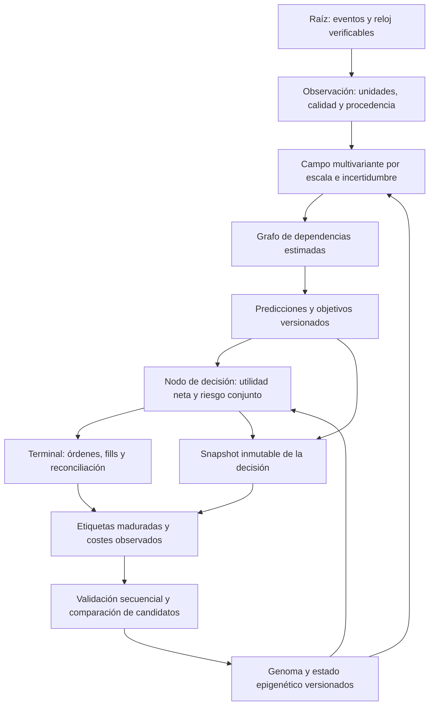

# Auditoría de fundamentos científicos y diseño del motor espectral multivariante

Fecha: 24 de septiembre de 2026. Naturaleza: revisión matemática, estadística, causal y arquitectónica; no implementación ni certificación de rentabilidad.

## 1. Dictamen, alcance y preservación del trabajo existente

La dirección arquitectónica adecuada es un único sistema multivariante condicionado por escala temporal, estado de mercado y calidad de observación. No son necesarios dos motores ontológicamente distintos llamados scalping y swing. Tampoco basta con sustituir esos nombres por `Continuous`: los estimadores, objetivos, relojes, transformaciones del genoma, decisiones y mecanismos de aprendizaje deben compartir un contrato verificable.

Esta revisión identifica **26 hallazgos o limitaciones concretas, FMT-001 a FMT-026**. No son 26 incidentes de producción observados ni necesariamente 26 descubrimientos históricamente inéditos. Algunos profundizan problemas ya descritos en CES y en auditorías anteriores; otros revelan conexiones que permanecen defectuosas pese a correcciones locales. Se distinguen errores algebraicos, contratos rotos, garantías teóricas indebidamente extendidas, aproximaciones y capacidades sin conexión operativa demostrada.

Se conservaron el código y los informes previos. Este documento añade explicaciones, contraejemplos, criterios de aceptación y un programa de investigación. **No se modificó código Rust, no se operó, no se desplegó y no se cambiaron límites de riesgo.** Las propuestas no autorizan eliminar controles de seguridad en nombre de la adaptabilidad.

### Corte de evidencia

La revisión comenzó sobre `4eaa8af1` y durante ella otro trabajo incorporó `59a76de4be726098d9af934b4d35987e9a636802`. El segundo commit fue observado, no creado por esta revisión. Se releyeron los puntos críticos del núcleo después de ese cambio. Había modificaciones concurrentes y artefactos no versionados; los resultados no representan una fotografía inmutable de todo el directorio.

En el corte inventariado, Git enumeró **1.119 archivos versionados, 289 archivos Rust y 24 manifiestos Cargo**. Esto es inventario, no lectura exhaustiva. La cobertura detallada de esta ronda figura al final. No se afirma haber revisado línea por línea esos 1.119 archivos, todos los filtros ni todas las rutas de ejecución.

La referencia local `origin/main` estaba 45 commits detrás de `HEAD`, sin commits exclusivos delante. No hubo un nuevo fetch en esta ronda: es comparación con la referencia remota local, no comprobación del servidor en tiempo real. No se realizó merge, commit ni push en esta ronda. Los conflictos de integración documentados anteriormente no quedan resueltos por esta auditoría.

### Qué significa cada estado

- **Confirmado estático:** la ecuación o conexión es visible en el código; no implica que se haya medido su frecuencia o pérdida económica en producción.
- **Contraejemplo algebraico:** una entrada válida refuta una propiedad anunciada. Los cálculos auxiliares se evaluaron independientemente; no se añadieron pruebas Rust al repositorio.
- **Limitación de modelo:** una aproximación puede ser útil, pero no satisface una interpretación o garantía más fuerte.
- **API sin consumidor operativo localizado:** existe el componente; la búsqueda en `crates` y `src` no encontró una llamada de producción. No se le atribuye impacto vivo sin más trazabilidad.

P1 indica riesgo alto para decisiones, aprendizaje o selección; P2 indica limitación relevante o defecto de una API cuyo impacto operativo no está probado. La severidad no cuantifica dinero perdido.

## 2. Matriz consolidada de esta ronda

| ID | Prioridad | Problema comprobado o limitación | Tipo / alcance |
|---|---|---|---|
| FMT-001 | P1 | La velocidad llamada direccional pierde el signo | Error de datos; núcleo → señales |
| FMT-002 | P1 | Kalman mezcla unidades y depende del número de eventos | Contrato dimensional/temporal |
| FMT-003 | P1 | El pseudo-Hurst sigue alimentando features pese a existir DFA | Sustitución incompleta |
| FMT-004 | P2 | FFT en tiempo de eventos y fuga de DC por ventana | Interpretación espectral |
| FMT-005 | P1 | Aprendizaje de pesos con estado de cierre y canales distintos | Crédito causal/train-serve |
| FMT-006 | P2 | El actualizador llamado PPO no implementa su objetivo | Identidad algorítmica |
| FMT-007 | P1 | Error conformal recalculado con el estado al cierre | Feedback retardado y selección |
| FMT-008 | P1 | El clipping de ACI invalida la cota anunciada | Garantía matemática refutada |
| FMT-009 | P1 | El gen alpha se aplica al calibrador global, no al utilizado | Genoma desconectado |
| FMT-010 | P1 | DSR aproximado sin dispersión entre ensayos ni presupuesto acumulado | Inferencia/selección |
| FMT-011 | P1 | Una penalización puede mejorar fitness negativo | Orden de selección invertido |
| FMT-012 | P2 | CMA usa covarianza completa y blanqueamiento diagonal | Aproximación incoherente |
| FMT-013 | P1 | El llamador sobrescribe el step-size aprendido por CMA | Bucle adaptativo interrumpido |
| FMT-014 | P1 | Kelly binario y suelo positivo no certifican óptimo multivariante | Riesgo/modelo |
| FMT-015 | P1 | La protección de rachas no es una cota probabilística de ruina | Garantía de seguridad |
| FMT-016 | P1 | El veto de correlación cuenta direcciones, no exposición conjunta | Riesgo de cartera |
| FMT-017 | P2 | Nash/minimax son transformaciones heurísticas, no un juego resuelto | Teoría declarada |
| FMT-018 | P2 | Oscilador clásico y densidad gaussiana recortada como probabilidad | Física/probabilidad |
| FMT-019 | P2 | Perfil solitónico sin dinámica NLS ni neutralidad probada en cero | Física/validación |
| FMT-020 | P1 | La normalización “Mach” cambia con la unidad monetaria | Invariancia refutada |
| FMT-021 | P2 | La resonancia es una ganancia monotónica determinista | Hipótesis física no implementada |
| FMT-022 | P1 | Umbral de Tsallis inalcanzable para el productor binario | Filtro tautológico |
| FMT-023 | P1 | Consenso convierte votos diminutos en confianza alta | Calibración/doble conteo |
| FMT-024 | P2 | Tensor de cuatro escalas, pseudo-Lyapunov y snapshot no atómico | API/semántica/concurrencia |
| FMT-025 | P1 | Hawkes confunde tasa total y exógena; coste ligado a ráfagas | Identificación/latencia |
| FMT-026 | P2 | Entropía, “posterior” y NSGA-III exceden lo implementado | Fitness/gobernanza científica |

Estos puntos se distribuyen entre los módulos históricos 1–8: relojes/datos (1, 6), inferencia (2), escala/estrategia (3), costes y ejecución (4), riesgo/genoma (5), física y confluencia (7), selección y validación (8). No sustituyen ni renumeran la matriz histórica de fallos.

## 3. Hallazgos detallados: de la observación al aprendizaje

### FMT-001 — Una magnitud absoluta se publica como velocidad direccional

Evidencia: [stateful_engine.rs:488](<C:/Users/jhona/Documents/Proyectos/Trader Gemini/crates/god-engine-core/src/stateful_engine.rs:488>) calcula `diff = abs(price-last_price)`; en 526–533 usa esa magnitud como `inst_v` y actualiza `dir_velocity`. [lib.rs:2074](<C:/Users/jhona/Documents/Proyectos/Trader Gemini/crates/god-engine-core/src/lib.rs:2074>) publica el resultado como `price_velocity` y `order_flow_velocity`.

Con estado inicial cero, `v_t = 0,85 v_{t-1} + 0,15 |Δp_t|` nunca puede representar una caída con signo negativo. La secuencia 100, 99, 98, 97 deja `dir_velocity = +0,385875`. No es una preferencia estratégica: la información de signo fue destruida antes de que el consumidor la recibiera. Soliton y Shockwave usan el signo de esta entrada para orientar su voto; una contribución alcista espuria es posible en un mercado descendente. No se afirma que el agregado final necesariamente compre, porque otros votos y vetos intervienen.

La misma sección denomina aceleración a diferencias por evento sin dividir por tiempo, aunque su comentario menciona `dt`. Preservar magnitud, dirección y reloj como canales separados permitiría estudiar actividad y tendencia sin confundirlas.

Cierre exigible: secuencias espejo ascendentes/descendentes, iguales en magnitud y tiempos, deben invertir los canales direccionales y conservar los de actividad. Repetir con muestreo irregular y feeds duplicados; registrar la contribución al consenso antes y después. Modificar nombres sin corregir la aritmética no cierra el hallazgo.

### FMT-002 — Kalman no conserva unidades ni reloj de difusión

Evidencia: [kalman.rs:18](<C:/Users/jhona/Documents/Proyectos/Trader Gemini/crates/feature-engine/src/kalman.rs:18>) y [stateful_engine.rs:467](<C:/Users/jhona/Documents/Proyectos/Trader Gemini/crates/god-engine-core/src/stateful_engine.rs:467>). El estado es precio; `P`, `Q` y `R` deben ser varianzas compatibles. El llamador pasa `R = price × 0,0005`, una magnitud proporcional al precio, mientras inicializa `P=1`, `Q=10^-4` para todos los activos. La actualización suma Q por llamada y no recibe `Δt`.

Con `P^- = 1,0001`, precio 100 produce K≈0,952385; precio 10.000 produce K≈0,166681. Cambiar la unidad de cotización de una misma trayectoria altera el suavizado porque las covarianzas no se transforman como el cuadrado de esa unidad. Agrupar o desagrupar eventos también altera cuánto ruido de proceso se acumula.

El filtro escalar es matemáticamente reconocible; el problema es su parametrización y uso. “Cuántico” no añade una ecuación distinta. Para un modelo de paseo local en tiempo físico se necesita, por ejemplo, `Q(Δt)=q_c Δt`; para uno más general, discretización del generador y covariance integral. Esta es una propuesta de modelado, no una afirmación de que el precio sea realmente browniano. Véase el tratamiento de [modelos de estado y discretización de Särkkä–Svensson](https://research.aalto.fi/en/publications/bayesian-filtering-and-smoothing-3/).

Cierre: invariancia de unidades, innovaciones estandarizadas, pruebas de huecos temporales, covarianzas positivas y comparación prequential con una EWMA causal. No ajustar R solo para mejorar el backtest.

### FMT-003 — La migración a Hurst real no eliminó el proxy antiguo del vector ML

Evidencia: [multifractal.rs:42](<C:/Users/jhona/Documents/Proyectos/Trader Gemini/crates/feature-engine/src/multifractal.rs:42>) usa retornos absolutos y estima `H = 0,5 + log(E|r|/(sqrt(E r²) sqrt(2/π)))/log(n)`, con clamps. No estima una pendiente de fluctuación frente a distintas escalas de agregación. Cambiar el orden o los signos de retornos de igual magnitud no altera esos dos momentos.

Para magnitudes constantes, H vale aproximadamente 0,59806, 0,57015 y 0,55772 en ventanas 10, 25 y 50. Una tendencia con incrementos logarítmicos todos positivos y una alternancia positiva/negativa de igual magnitud reciben los mismos valores una vez llenas las ventanas. Por tanto, esos valores no identifican persistencia temporal.

Existe una mejora real: `hurst_dfa.rs` implementa otra ruta y explica parte del problema. No se declara inútil esa mejora. La desconexión pendiente está en [stateful_engine.rs:520](<C:/Users/jhona/Documents/Proyectos/Trader Gemini/crates/god-engine-core/src/stateful_engine.rs:520>): el proxy antiguo continúa escribiendo `hurst_micro/meso/macro`, mientras `self.hurst` se alimenta por otra vía. Las features pueden representar conceptos distintos bajo una misma etiqueta científica.

Cierre: versionar el esquema, identificar todos los consumidores y reentrenar con exactamente el mismo estimador; conservar el proxy como descriptor de forma de distribución si demuestra valor, pero no llamarlo exponente Hurst. DFA tampoco identifica un exponente válido a 100 años con unas horas de historia: debe publicar soporte y calidad del ajuste.

### FMT-004 — FFT por eventos no equivale a frecuencia física y omitir DC no elimina su fuga

Evidencia: [spectral.rs:4](<C:/Users/jhona/Documents/Proyectos/Trader Gemini/crates/feature-engine/src/spectral.rs:4>) fija 64 muestras; `push` no almacena timestamps. El núcleo analiza cada 64 retornos en [stateful_engine.rs:501](<C:/Users/jhona/Documents/Proyectos/Trader Gemini/crates/god-engine-core/src/stateful_engine.rs:501>). El resultado es un bin por secuencia de eventos, no hertz ni horizonte temporal universal.

Una oscilación idéntica por índice produce el mismo espectro tanto si llega en un segundo como en una hora. Este descriptor puede ser útil en tiempo de eventos; el error consiste en interpretarlo sin declarar ese reloj. La ventana izquierda usa una semionda coseno, aunque el comentario la llama Planck-Taper. Al multiplicar una serie constante por una ventana no constante aparecen componentes no nulas fuera de DC; eliminar únicamente el bin cero no las retira. El test con constantes solo comprueba finitud.

Cierre: etiquetar reloj, duración efectiva y antigüedad del último análisis; decidir explícitamente detrending y normalización de potencia/ventana; incluir constantes no nulas, sinusoides fuera de bin, gaps y tasas variables. La resolución finita no es un fallo por sí misma: debe justificarse mediante error y coste, no presentarse como cobertura continua de todas las frecuencias.

### FMT-005 — La política aprende con otro estado y otra semántica de canales

Evidencia de inferencia: [lib.rs:2562](<C:/Users/jhona/Documents/Proyectos/Trader Gemini/crates/god-engine-core/src/lib.rs:2562>) usa `[ofi_norm, obi_norm, dir_hawkes, lead_lag, dir_regime]`. Evidencia de aprendizaje: [lib.rs:1692](<C:/Users/jhona/Documents/Proyectos/Trader Gemini/crates/god-engine-core/src/lib.rs:1692>) construye al cierre `[OFI actual, OBI actual, CVPIN actual, 0, aceleración actual]`.

El tercer peso actúa sobre Hawkes al decidir y se actualiza con CVPIN; el quinto actúa sobre régimen direccional y aprende de aceleración; el cuarto recibe siempre gradiente cero en esta ruta. Además OFI/OBI no tienen necesariamente la misma normalización y son los del cierre, no los que produjeron la acción. No se trata solo de feedback retardado: las coordenadas del espacio aprendido cambian de significado.

Consecuencia: incluso una recompensa neta correcta puede reforzar causas inexistentes o castigar las que no participaron. Más generaciones no compensan un gradiente atribuido al vector equivocado. Este es un mecanismo concreto que puede contribuir a la diferencia backtest/demo/producción; no se ha cuantificado qué proporción de esa diferencia explica.

Cierre: congelar vector normalizado, acción, versión de política y esquema de features en la decisión; aprender de ese registro al madurar su objetivo. Mantener el estado de cierre como otra variable, no como sustituto. Probar operaciones solapadas, cierres en orden distinto a entradas y hot-swaps.

### FMT-006 — El nombre PPO no describe el actualizador implementado

Evidencia: [online_ppo.rs:113](<C:/Users/jhona/Documents/Proyectos/Trader Gemini/crates/dark-alpha-engine/src/online_ppo.rs:113>) calcula ventaja como `tanh(10(reward-EMA_actualizada))`; después multiplica cada peso por `clip(1+lr·feature·sign·advantage)`. No aparece una distribución de acciones ni el cociente de probabilidades de la acción entre política nueva y antigua. `evaluate_policy` es una media ponderada de cinco features.

PPO define su surrogate mediante `r_t(θ)=π_θ(a_t|s_t)/π_old(a_t|s_t)` y el mínimo entre término normal y recortado. Recortar un multiplicador de pesos no implementa esa identidad. La comparación procede del [artículo original de PPO](https://arxiv.org/abs/1707.06347). El módulo puede estudiarse honestamente como regla multiplicativa de pesos; no debe heredar por nombre resultados de PPO ni afirmar gradiente de Sharpe sin derivarlo.

También hay una frontera verificable: con `alpha_ema=1`, permitido por la API, la EMA adopta la recompensa antes de calcular la ventaja y esta queda cero. Cierre: especificar objetivo y derivada, verificar con diferencias finitas o una referencia independiente, y escoger entre un actualizador sencillo validado o un PPO real con política registrada. No es obligatorio introducir RL para adaptar el sistema.

### FMT-007 — El error conformal no pertenece al conjunto que tomó la decisión

Evidencia: [conformal.rs:159](<C:/Users/jhona/Documents/Proyectos/Trader Gemini/crates/god-engine-core/src/conformal.rs:159>) recibe solo `(p_hat, won)`. Recalcula el p-valor con la ventana y alpha actuales, antes de añadir el cierre. El comentario dice que mide el error contra el conjunto que existía al decidir; esa afirmación no se cumple si hubo otros cierres entre entrada y salida.

Si A entra antes de B y B cierra primero, el conjunto recalculado para A ya incorpora B. Una actualización de alpha o cambio de modelo agrava la diferencia. La revisión confirmó además que el feedback viene de operaciones cerradas: los candidatos rechazados no generan la misma evidencia. El bloqueo puede reducir su propia fuente de etiquetas y congelar la recuperación. No debe inferirse cobertura sobre todo el flujo a partir del subconjunto seleccionado.

Una garantía marginal sobre conjuntos tampoco implica que la tasa de operaciones perdedoras, condicionada a operar, sea ≤alpha. Son eventos y denominadores diferentes. Cierre: guardar conjunto/versión en entrada, separar error del conjunto original de diagnóstico recalculado y definir una población de evaluación prequential que incluya abstenciones cuando exista un objetivo observable sin operar. No inventar fills contrafactuales para completar etiquetas de PnL.

### FMT-008 — El recorte de alpha rompe la garantía ACI citada

Evidencia: [conformal.rs:168](<C:/Users/jhona/Documents/Proyectos/Trader Gemini/crates/god-engine-core/src/conformal.rs:168>) proyecta alpha sobre `[10^-4,0,5]`. La documentación cita una cota absoluta para cualquier secuencia basada en la recurrencia no proyectada. El [artículo ACI](https://arxiv.org/abs/2106.00170) exige distinguir el algoritmo y el error del conjunto emitido.

Contraejemplo: 5.000 actualizaciones con `p_hat=0,9` y `won=true`. Todos los scores son 0,1; el p-valor de la etiqueta realizada es 1, por lo que no hay errores. Tras el calentamiento hay 4.970 pasos adaptativos y alpha acaba en 0,5. La discrepancia con objetivo 0,1 es 0,1, pero la cota que anuncia el módulo es `0,905/(0,005×4970)≈0,036419`. La afirmación universal queda refutada, aunque un test pseudoaleatorio concreto la satisfaga.

Esto demuestra sobrecobertura respecto a la igualdad de frecuencia anunciada; no demuestra por sí solo pérdida económica ni infracobertura en ese ejemplo. Con proyección aparece un residuo en la identidad telescópica. Cierre: especificar qué garantía realmente se busca, derivar el término de proyección o adoptar un método compatible con el dominio; añadir secuencias degeneradas, adversas, empates y feedback retardado. No ajustar el test para ocultar el contraejemplo.

### FMT-009 — El alpha genómico modifica un calibrador distinto al que decide

Evidencia: [lib.rs:303](<C:/Users/jhona/Documents/Proyectos/Trader Gemini/crates/god-engine-core/src/lib.rs:303>) crea calibradores por moneda con valores por defecto. [lib.rs:2476](<C:/Users/jhona/Documents/Proyectos/Trader Gemini/crates/god-engine-core/src/lib.rs:2476>) llama `set_target_alpha` únicamente sobre `self.conformal`. Inmediatamente después calcula aceptación con `conformal_by_coin[coin_id]` cuando existe, que es el caso normal. El aprendizaje también va al calibrador por moneda.

En el archivo no se encontró una actualización equivalente del objetivo de esos calibradores. La telemetría `conformal_alpha_eff` lee el global, no el efectivo del objeto que decidió. Por tanto, observar que el gen cambia o que su valor aparece en el registry no demuestra que esté influyendo en el filtro operativo.

Cierre: una prueba diferencial debe variar solo `conformal_alpha`, mantener fija la historia y demostrar el cambio esperado en el calibrador activo. La telemetría debe identificar símbolo, objetivo, alpha efectivo, versión y estado de calentamiento del mismo objeto. Este hallazgo constituye una explicación verificable de un gen con impacto aparente pero desconectado de su consumidor.

### FMT-010 — El DSR implementado es una aproximación no suficiente para certificar descubrimientos

Evidencia: [selection_stats.rs:80](<C:/Users/jhona/Documents/Proyectos/Trader Gemini/crates/evolution-engine/src/selection_stats.rs:80>) construye el benchmark como una función de `log(N)` dividida por `sqrt(n)`. Su interfaz no recibe dispersión de Sharpes entre experimentos. La implementación PSR usa momentos de la serie seleccionada; esto es distinto de medir la distribución de los ensayos. En `online_daemon.rs` se pasa un conteo fijo de 2.000.

El DSR publicado incorpora información sobre la variabilidad de los Sharpes probados y su número efectivo de ensayos; no puede sustituirse universalmente por la longitud de la serie ganadora. Tampoco puede traducirse un valor ≥0,95 a “95% de probabilidad de edge real” sin el modelo inferencial correspondiente. Fuente primaria: [Bailey–López de Prado, DSR](https://www.davidhbailey.com/dhbpapers/deflated-sharpe.pdf).

La ausencia de un registro acumulado puede ocultar búsqueda repetida entre generaciones, activos y reutilizaciones del mismo histórico. Dependencia temporal, retornos solapados y selección sobre escenarios endógenos requieren controles adicionales; aumentar N por sí solo no corrige filtraciones causales. Cierre: referencia numérica independiente, registro de todos los ensayos y datasets, tratamiento explícito de dependencia y evaluación posterior no utilizada para seleccionar. El resultado debe presentarse como evidencia condicionada, no como certificación de rentabilidad futura.

### FMT-011 — Penalizar multiplicativamente fitness negativo mejora su clasificación

Evidencia: [cma_es.rs:227](<C:/Users/jhona/Documents/Proyectos/Trader Gemini/crates/evolution-engine/src/cma_es.rs:227>) afirma que multiplicar por un factor ≤1 solo puede reducir el fitness. El orden de selección es descendente. Para fitness negativo ocurre lo contrario: `−100 × 0,1 = −10`, que supera a `−20 × 1 = −20`.

Una estrategia claramente peor puede ascender precisamente por tener peor reality gap. Ambas ramas de `real_pnl` multiplican `stat.1`; solo cambia el mínimo del factor. La función de gap puede devolver valores cercanos a 0,1, por lo que no es una posibilidad excluida por el dominio de parámetros. Si todos los candidatos evaluados fueran positivos no se manifestaría; esa condición no está garantizada por la API ni por sus tests con fitness negativo.

Cierre: la penalización debe ser monótona en severidad para cualquier fitness admisible, con independencia de su signo. Definir una utilidad canónica con unidades y un coste no negativo, o una transformación cuyo orden esté demostrado. Exigir pruebas de ranking, no únicamente ausencia de NaN. Este punto puede afectar directamente qué genoma gana, sin modificar su rentabilidad original.

### FMT-012 — CMA completo en el muestreo, diagonal en la adaptación del paso

Evidencia: [cma_es.rs:125](<C:/Users/jhona/Documents/Proyectos/Trader Gemini/crates/evolution-engine/src/cma_es.rs:125>) utiliza Cholesky de una matriz completa; en 301–304 normaliza el camino por `sqrt(C_ii)`, ignorando covarianzas. El comentario reconoce simplificación diagonal, pero la distribución muestreada ya no es diagonal. El blanqueamiento completo de la adaptación canónica es `C^-1/2 Δm/σ`; véase [Hansen, CMA-ES](https://arxiv.org/abs/1604.00772).

Para `C=[[1, 0.9], [0.9, 1]]` (punto decimal en esta expresión), los vectores (1,1) y (1,−1) tienen la misma norma bajo normalización diagonal, pero normas blanqueadas `sqrt(2/1.9)` y `sqrt(2/0.1)`. La regla pierde precisamente la geometría que la matriz pretende aprender. Los clamps por elemento y la reparación ad hoc de Cholesky tampoco prueban que la matriz almacenada sea positiva definida.

No se exige CMA canónico por dogma: el híbrido PSO/CMA puede competir como algoritmo propio. Cierre: escoger contrato explícito, comparar en funciones rotadas y mal condicionadas, comprobar autovalores/residuo `LLᵀ−C`, reportar reinicios y medir coste. Finitud de muestras no valida geometría de búsqueda ni convergencia.

### FMT-013 — La auto-adaptación de sigma es sobrescrita por el llamador

Evidencia: [evolution-engine/lib.rs:166](<C:/Users/jhona/Documents/Proyectos/Trader Gemini/crates/evolution-engine/src/lib.rs:166>) conserva el optimizador entre rondas, pero en 178 ejecuta `optimizer.sigma = mutation_rate` antes de cada muestreo. [cma_es.rs:373](<C:/Users/jhona/Documents/Proyectos/Trader Gemini/crates/evolution-engine/src/cma_es.rs:373>) calcula un nuevo sigma mediante el camino evolutivo.

La persistencia del objeto conserva covarianza y memorias PSO, pero no garantiza que el step-size calculado se utilice en la generación siguiente. En esta ruta, el valor externo lo sustituye. Puede ser una política intencional de control jerárquico; entonces debe describirse como tal y justificarse su relación con el optimizador. No es correcto presentar ambas reglas como auto-adaptación conjunta sin resolver cuál tiene autoridad.

Cierre: seguir sigma antes/después de update y antes del siguiente sample con dos generaciones; documentar cuándo un supervisor puede reiniciarlo y por qué. El objetivo no es eliminar supervisión, sino hacer observable y causal la adaptación. Repetir con cambios de régimen y genoma para evitar atribuir a CMA lo aprendido por otro mecanismo.

### FMT-014 — Kelly binario, piso de exposición y señales de persistencia no forman un óptimo universal

Evidencia: [kelly.rs:60](<C:/Users/jhona/Documents/Proyectos/Trader Gemini/crates/risk-engine/src/kelly.rs:60>) contiene una rampa exploratoria incluso para PF≤1; en 69 usa `p(1−1/PF)` y en 114 aplica un piso genómico. La fórmula corresponde a una parametrización binaria de ganancias/pérdidas, no al óptimo general de una distribución continua y multiactivo con colas y costes.

Por ejemplo, p=0,5 y PF=1,0001 dan Kelly bruto≈0,000049995; un piso de 0,01 puede aumentar la exposición unas 200 veces antes de otros topes, no reducirla como Kelly fraccional. Dos distribuciones con iguales p y PF pero distinta cola negativa no tienen necesariamente el mismo óptimo de crecimiento logarítmico. La modulación por persistencia no sustituye estimación de edge ni incertidumbre de parámetros.

Cierre: separar asignación explotadora, presupuesto exploratorio y restricciones de seguridad; distinguir fracción de capital, margen, notional y pérdida al stop. Para el problema multivariante, plantear utilidad esperada de riqueza positiva y riesgo conjunto. [Risk-Constrained Kelly](https://arxiv.org/abs/1603.06183) ofrece una vía formal bajo supuestos explícitos, no una garantía transferible automáticamente a apalancamiento con gaps.

### FMT-015 — Una racha representativa de 200 trades no certifica probabilidad de ruina

Evidencia: [ruin.rs:48](<C:/Users/jhona/Documents/Proyectos/Trader Gemini/crates/risk-engine/src/ruin.rs:48>) aproxima racha con `|ln(200)/ln(q)|`, la acota y deriva f de `(1−f)^racha ≥ 0,05`. Es un control de supervivencia frente a una racha elegida, no una probabilidad demostrada de drawdown ni de ruina. No recibe confianza objetivo, distribución de severidad, dependencia entre pérdidas ni duración/calendario del riesgo.

Incluso en Bernoulli IID, elegir `q^k≈1/H` no convierte el evento “alguna racha de k en H” en un suceso raro con confianza especificada; existen múltiples puntos de inicio. Con autocorrelación, gaps y pérdidas superiores al stop la diferencia es mayor. El piso de riqueza es 5% en el código: cumplirlo permite perder hasta 95%, lo que debe exponerse sin eufemismos.

El comentario recomienda LCB de probabilidad de pérdida; para protección conservadora correspondería una cota superior de q. La ruta de `kelly_envelope` usa `1−LCB(p_ganar)`, que sí va en dirección conservadora: se distingue error documental de código correcto en esa conexión. Cierre: definir evento de riesgo y horizonte, estimar o acotar su probabilidad y validar bajo dependencia/colas. El límite del 25% sigue siendo una política, no una consecuencia universal de la teoría.

### FMT-016 — Correlación no se identifica contando posiciones del mismo signo

Evidencia: [correlation_guard.rs:50](<C:/Users/jhona/Documents/Proyectos/Trader Gemini/crates/risk-engine/src/correlation_guard.rs:50>) recibe cantidad de posiciones, capital, notional mínimo y límite. No recibe retornos conjuntos, covarianza, nocionales por activo, factores ni delta. [risk-engine/lib.rs:409](<C:/Users/jhona/Documents/Proyectos/Trader Gemini/crates/risk-engine/src/lib.rs:409>) lo utiliza como veto continuo.

Dos carteras con el mismo número de largos pero exposiciones y dependencias radicalmente diferentes son indistinguibles para esa función. Un par long/short puede concentrar riesgo de base; distintos horizontes del mismo activo pueden compartir la misma exposición. El conteo puede conservarse como límite operativo, pero no como medición estadística de correlación. Esto amplía CES-013 sin duplicar su explicación de separación logarítmica entre horizontes.

Cierre: introducir exposición agregada, covarianza regularizada y escenarios de factores con incertidumbre; definir de qué magnitud se evalúa correlación y sobre qué reloj. El grafo debe representar una relación estimada, no solo una visualización de conexiones. Validar PSD, cartera duplicada, hedge imperfecto, estrés de correlaciones y exposición simultánea de todas las escalas.

### FMT-017 — Los métodos Nash/minimax no especifican jugadores ni optimización estratégica

Evidencia: [game_theoretic_nash.rs:27](<C:/Users/jhona/Documents/Proyectos/Trader Gemini/crates/signal-engine/src/game_theoretic_nash.rs:27>) desplaza el midpoint por `spread×0,25×imbalance`. La evaluación usa `tanh((long_payoff−short_payoff)(1−pressure))`; con fallbacks los payoffs provienen de las partes positiva/negativa de OBI/OFI.

No hay conjunto de acciones de adversario, matriz o función conjunta de pagos, mejor respuesta ni verificación de equilibrio. El resultado es un ajuste heurístico de precio o voto, no un equilibrio de Nash/Stackelberg ni solución minimax. Puede aportar información útil; su nombre no acredita resistencia a manipulación o stop hunting.

Cierre: conservar la heurística bajo contrato honesto y evaluarla por ablación, o formular un juego identificable con agentes, información, costes y solución aproximada verificable. Antes de introducir teoría de juegos conviene comparar con control de inventario y ejecución bajo incertidumbre, que plantea decisiones observables sin atribuir intenciones no identificadas a otros participantes.

### FMT-018 — El oscilador es una fuerza clásica; la función de “probabilidad” no conserva una densidad

Evidencia: [quantum_oscillator.rs:49](<C:/Users/jhona/Documents/Proyectos/Trader Gemini/crates/signal-engine/src/quantum_oscillator.rs:49>) calcula `−kx−4λx³`, derivada negativa de un potencial clásico. La evaluación usa esa fuerza; no resuelve evolución de amplitudes complejas, estado fundamental ni ecuación de Schrödinger. No hay demostración del “cero desfase” anunciado para un suavizador temporal.

La función auxiliar de 59–74 evalúa `sqrt(a/π) exp(−a x²)` y la recorta a [0,1]. Es una densidad, cuyo valor puntual puede superar 1 sin violar probabilidad: para a=10 el pico correcto es≈1,784124. Recortarlo destruye su normalización. Además x se limita a ±10; con a=0,01, cualquier x≥10 devuelve≈0,0207554, una cola constante incompatible con una densidad integrable en toda la recta.

No se localizó uso operativo de esa probabilidad fuera del módulo/tests; el voto vivo usa la fuerza. Cierre: declarar fuerza potencial como feature clásica, o especificar modelo cuántico-inspirado completo. Si se necesita probabilidad de intervalo, integrar una densidad válida; si se desea score acotado, llamarlo score y calibrarlo. No eliminar la utilidad potencial de una función por corregir su interpretación.

### FMT-019 — Una envolvente sech no acredita propagación NLS ni retorno neutral con velocidad cero

Evidencia: [soliton_wave.rs:43](<C:/Users/jhona/Documents/Proyectos/Trader Gemini/crates/signal-engine/src/soliton_wave.rs:43>) evalúa una envolvente `A/cosh(A(x−vt))`. No evoluciona un campo complejo ni comprueba el residuo de la ecuación NLS anunciada. Las entradas son mezclas de OFI, OBI, velocidad y un tiempo de fallback; su correspondencia con coordenadas de un modelo de ondas no está identificada.

El retorno de 183 usa `vel.signum() * amp_val`. En Rust `signum(+0.0)=+1.0`, según el [contrato de f64::signum](https://doc.rust-lang.org/std/primitive.f64.html#method.signum); con registry inicializado, amplitud positiva y velocidad +0, el resultado puede ser positivo. El test llamado `test_soliton_zero_velocity_returns_flat` solo prueba un motor sin registry, que sale antes del cálculo. No demuestra su título.

Cierre: fixture con registry y velocidad exactamente cero, cambio de signo, unidades y ausencia de parámetros. Como feature de envolvente puede conservarse con validación empírica; para alegar NLS se necesitan estado, fase, condiciones de contorno, unidades y error de ecuación. Añadir una PDE sin identificar esas cantidades no resuelve el problema.

### FMT-020 — El “Mach” de mercado no es invariante a la escala de cotización

Evidencia: [supersonic_shockwave.rs:136](<C:/Users/jhona/Documents/Proyectos/Trader Gemini/crates/signal-engine/src/supersonic_shockwave.rs:136>) divide velocidad por precio solo si su magnitud supera 1; divide sonido por precio bajo otra condición independiente.

Contraejemplo de cambio de unidad: `(precio=100, velocidad=0,5, sonido=2)` produce M=25. Multiplicar todas las cantidades monetarias por 10, `(1000,5,20)`, produce M=0,25. Se pasa de activación a veto sin cambiar el fenómeno relativo. La comparación es puramente algebraica y no depende de datos de mercado.

Además el productor de `spread_speed_of_sound` usa una distancia monetaria de spread/volatilidad; no identifica una velocidad de propagación con el mismo tiempo que la velocidad del numerador. Cierre: contratos dimensionales por canal y normalización sin ramas ligadas al precio nominal. Si queda como cociente de actividad, calibrar su umbral por pérdida o contraste definido; no atribuirle automáticamente relaciones de Rankine–Hugoniot de conservación de fluidos.

### FMT-021 — Resonancia estocástica sin dinámica estocástica ni máximo interior de respuesta

Evidencia: [stochastic_resonance.rs:28](<C:/Users/jhona/Documents/Proyectos/Trader Gemini/crates/signal-engine/src/stochastic_resonance.rs:28>) devuelve `s[1+1/(1+exp(−|s|/n))]`, con guardas. Para señal fija no nula la ganancia está entre 1,5 y 2 y disminuye al aumentar n. Para s=0,1: n=10^-6 da≈2; n=0,1 da≈1,7311; n=100 da≈1,50025.

No se simula ni estima una transición de un sistema biestable, ni se mide mejora de detección a un ruido óptimo. El ratio utiliza una señal y una entrada llamada varianza que en el núcleo es proporcional a ATR, no una varianza identificada. El test exige amplificación; no prueba recuperación de información o mayor relación señal/ruido.

Cierre: tratarlo como ganancia no lineal y compararlo contra ganancia constante/calibración simple. Si se investiga resonancia real, formular un modelo y experimento con señal débil conocida, ruido controlado y curva de desempeño; solo después estudiar aplicabilidad financiera. Amplificar magnitud no crea evidencia predictiva.

### FMT-022 — El filtro de entropía Tsallis es tautológico para la distribución que recibe

Evidencia: [lib.rs:2052](<C:/Users/jhona/Documents/Proyectos/Trader Gemini/crates/god-engine-core/src/lib.rs:2052>) calcula Tsallis con dos probabilidades bid/ask y q=1,5. [renyi_tsallis_entropy.rs:152](<C:/Users/jhona/Documents/Proyectos/Trader Gemini/crates/signal-engine/src/renyi_tsallis_entropy.rs:152>) exige entropía `<0,60`.

Para una distribución binaria normalizada, el máximo es `(1−2·0,5^1,5)/0,5 = 0,5857864`. Por tanto, en libros válidos ese requisito no puede rechazar por alta entropía; queda el umbral de OBI. El componente de entropía y OBI también proceden de las mismas cantidades bid/ask: son transformaciones dependientes, no votos independientes sobre un flash crash.

La existencia de funciones generales de Tsallis/Rényi no cambia el dominio del productor vivo. Cierre: expresar entropía respecto a su soporte y máximo teórico, publicar histograma y tasa de veto, y diseñar un objetivo predictivo. Normalizar a [0,1] puede corregir unidades del umbral, pero no demuestra que alta entropía de un libro balanceado signifique caos ni que baja entropía prediga retorno neto.

### FMT-023 — El consenso fabrica alta “confianza” con evidencia de magnitud casi cero

Evidencia: [orchestrator.rs:267](<C:/Users/jhona/Documents/Proyectos/Trader Gemini/crates/signal-engine/src/orchestrator.rs:267>) normaliza votos por suma de magnitudes y aplica `net=(prob_long−prob_short)(0,70+0,30·effective_conviction)`. Si todos los votos son +10^-12, la primera diferencia es 1 y el resultado≈0,70. Con todos exactamente cero, la salida es Flat. Hay discontinuidad al origen.

La media de magnitudes no corrige el piso 0,70. El boost depende del número de estrategias registradas hasta cinco, no de su información incremental. Duplicar transformaciones correlacionadas puede cambiar la convicción sin añadir datos. [lib.rs:2623](<C:/Users/jhona/Documents/Proyectos/Trader Gemini/crates/god-engine-core/src/lib.rs:2623>) consume este consenso; otros gates pueden impedir una orden, pero no restauran su calibración.

Cierre: prueba de límite cuando todos los scores tienden a cero, invariancia al clonar expertos idénticos, ablaciones condicionales y calibración con un objetivo económico preciso. Separar acuerdo de signo, intensidad, incertidumbre y probabilidad estimada. Una proporción de votos no es una posterior bayesiana por llamarla probabilidad.

### FMT-024 — El almacén tensorial no acredita caos de Lyapunov ni lectura coherente multivariable

Evidencia: [quantum_tensor_store.rs:3](<C:/Users/jhona/Documents/Proyectos/Trader Gemini/crates/feature-engine/src/quantum_tensor_store.rs:3>) fija cuatro timeframes y 64 features. `calculate_lyapunov_chaos` calcula RMS de diferencias entre dos vectores. No estima tasa logarítmica de separación entre trayectorias próximas por unidad de tiempo; ni una matriz de covarianza, pese al comentario.

Mezclar canales con unidades distintas hace que ese RMS dependa de la escala numérica elegida. `AtomicU64` protege cada celda, pero `extract_feature_vector` lee 64 celdas sucesivas sin versión de snapshot: otro escritor puede dejar una mezcla de instantes. Cambiar Relaxed por SeqCst no vuelve transaccional el vector.

No se localizaron consumidores operativos externos de este almacén durante la búsqueda en `crates/src`; por ello se registra como deuda de API/capacidad, no como causa probada de decisiones actuales. Cierre: renombrar/definir distancia de features normalizados o construir un estimador de Lyapunov con datos suficientes; añadir versionado de snapshots y reloj. Un tensor es una estructura de datos, no evidencia de cómputo cuántico.

### FMT-025 — Hawkes está mejor conectado, pero su interpretación estadística y coste siguen pendientes

Evidencia: [hawkes_bessel.rs:116](<C:/Users/jhona/Documents/Proyectos/Trader Gemini/crates/signal-engine/src/hawkes_bessel.rs:116>) estima mu mediante tasa observada y suma excitación con alpha/beta fijos. En un Hawkes lineal estacionario, la tasa total y la exógena no son lo mismo: `r̄=μ/(1−n)` para n<1. Con n=0,6 y tasa total 10/s, el modelo estacionario implicaría μ=4/s; usar 10/s y sumar excitación construye otra señal.

El código anuncia justamente un ratio de referencia 1,6 para una corriente regular: puede funcionar como detector normalizado de ráfagas, pero eso no es identificación de la tasa condicional generadora ni estimación de endogeneidad. `branching_ratio()` permanece 0,6 al no aprender alpha/beta; no puede certificar que la criticidad del mercado se adaptó. Para inferencia espectral estacionaria multivariada véanse las condiciones explicitadas en [este trabajo sobre Hawkes](https://arxiv.org/abs/2604.10376); no se extrapolan al componente sin verificación.

También `MAX_EVENTS=128` es capacidad inicial, no límite: se purga por ventana de diez segundos y `intensity` recorre el deque bajo mutex. A r eventos/s puede haber O(10r) eventos y trabajo por lectura. La recursión de un kernel exponencial permite evaluar otra implementación O(1), preservando semántica y reloj. No se midió p99 en esta ronda.

Se reconoce la mejora existente: el core sí publica ahora datos del proceso por moneda; no se repite el diagnóstico antiguo de “cero llamadas”. Cierre: separar detector de ráfagas e intensidad calibrada, contrastar compensadores/likelihood, estimar parámetros con restricciones apropiadas y medir latencia bajo ráfagas.

### FMT-026 — Fitness con nombres bayesianos, entrópicos y NSGA-III sin las estructuras anunciadas

Evidencia: [entropy_fitness.rs:38](<C:/Users/jhona/Documents/Proyectos/Trader Gemini/crates/evolution-engine/src/entropy_fitness.rs:38>) llama posterior a `exp(−divergencia×10×min(n/30,1))`; no especifica prior probabilístico ni likelihood. `compute_nsga3_hyper_fitness` devuelve un escalar multiplicativo sin frentes no dominados, direcciones de referencia ni niching. La entropía de frecuencias de Long/Short/Flat no prueba robustez: decisiones IID aleatorias pueden maximizarla.

El módulo también modela costes mediante nocional por defecto 35, proporción de trades afectados 5% y magnitud 5 bps. Son supuestos de simulación y sensibilidad, no mediciones universales ni una simulación completa de cola, fills y latencia. No se afirma que todas sus APIs se usen en cada ruta; `reality_gap_adversarial_score` sí se invoca desde CMA. `epigenetic_fitness_landscape.rs` es otra suma ponderada sin estado, y no se localizó consumidor vivo de su función en esta búsqueda.

Cierre: conservar las heurísticas útiles con nombres y procedencia transparentes; aprender costes de fills reconciliados; diferenciar penalidad, posterior y objetivo multiobjetivo. Una estrategia que permanece Flat ante ausencia de edge no es sobreajustada por ese solo hecho. La diversidad debe medirse sobre comportamiento/contexto y valor incremental, no imponerse como frecuencia uniforme de acciones.

## 4. Diseño matemático objetivo: un campo continuo, no dos motores renombrados

### 4.1 Dominio, observación y límites de conocimiento

Propuesta de representación, no implementación realizada:

`Z(t, ℓ, a, c)`, con `ℓ=log(τ/τ₀)`, τ>0, activo a y canal c.

τ₀ es una unidad de referencia explícita; el logaritmo recibe un cociente adimensional. Los canales pueden describir retorno, liquidez, intensidad de eventos, covarianza, riesgo o incertidumbre. Tiempo de evento, tiempo físico, horizonte de predicción, memoria del estimador y latencia de ejecución son coordenadas diferentes. No se convierten unas en otras cambiando una etiqueta.

El dominio representable puede incluir de 1 ns a 100 años. El dominio **observable** depende de resolución de timestamp, frecuencia efectiva de eventos, duración del histórico, ruido, missingness y cambios de instrumento. Una representación no crea datos nanosegundo a nanosegundo ni acredita estimación secular. Los estados sin soporte deben declarar incertidumbre/prior, no presentarse como evidencia neutral o madura.

No se requiere un bucle por cada nanosegundo vacío. Se propone propagación causal entre observaciones y asimilación en eventos, con recomputación programada cuando cambie materialmente la decisión o su incertidumbre. Evaluar analíticamente una transición durante Δt puede ser más fiel al modelo continuo que miles de actualizaciones con datos repetidos.

### 4.2 Aproximación finita con error controlado

Representar `Z(t,ℓ,a,c) ≈ Σ_k z_k(t,a,c) B_k(ℓ)` mediante bases explícitas. B-splines, wavelets o kernels causales son candidatos, no elecciones predeterminadas. La malla debe refinarse por soporte y error de aproximación, con un presupuesto de latencia y memoria declarado. No se certifica continuidad empírica por interpolar 32 puntos.

Una regla de diseño aceptable compara decisiones o predicciones con K y 2K funciones de base sobre replay retenido. La tolerancia debe relacionarse con error económico/riesgo y precisión numérica; no con un valor elegido para obtener más trades. El supuesto de interpolación entre escalas es verificable; extrapolación a décadas sin datos requiere priors y escenarios, no coeficientes aprendidos ficticios.

Para combinar escalas: `s(t)=∫ w(t,ℓ) m(t,ℓ) dℓ`, con normalización, soporte y covariance identificados. Un promedio de señales redundantes no gana evidencia por aumentar K. La medida `dℓ` y los pesos de cuadratura importan: duplicar puntos de la malla no debería duplicar convicción. Esto generaliza CES sin avalar sus clamps operativos pendientes.

### 4.3 Genoma funcional y epigenética separada

El genoma puede parametrizar funciones de ℓ y contexto, por ejemplo `θ_j(ℓ,x)=g_j(Σ_k β_jk B_k(ℓ)+u_j(x))`. `g_j` impone el dominio físico: positividad de una escala, intervalo de probabilidad o matriz PSD. No todas las funciones deben ser monótonas; solo imponer monotonicidad cuando exista fundamento o restricción económica explícita.

Hay que distinguir tres estados: parámetros estructurales/versionados del genoma; estado epigenético contextual y reversible; y parámetros estadísticos aprendidos con evidencia. Cada uno debe tener reglas de actualización, persistencia, caducidad, reset y restauración verificables. Cambiar pesos en memoria no constituye por sí solo evolución heredable; mutar genomas no acredita aprendizaje causal.

Las antiguas anclas scalp/swing pueden mantenerse temporalmente como vistas de compatibilidad, no como fuente autoritativa que regenere toda la curva. La migración necesita equivalencia controlada, versionado y reentrenamiento. Extrapolar una ley de potencia de TP/SL a todo el dominio sin límites de solvencia, costes y soporte sería otro error.

### 4.4 Grafo vivo con contratos tipados

Una arista debe declarar tipo, unidad, fuente, `event_time`, `available_time`, versión, vigencia y regla de ausencia. La raíz aporta evidencia, el nodo de decisión escoge una acción bajo restricciones y el terminal devuelve hechos reconciliados. No todo nodo debe estar conectado a todo: conexiones innecesarias incrementan coste, correlación, superficie de fallo y dificultad de atribución.

Separar grafo de dependencias de software, grafo estadístico entre activos/escalas y grafo causal de decisiones. Una visualización de llamadas no demuestra causalidad financiera; correlación o lead-lag no prueban una intervención causal. “Sincronía” debe significar snapshots consistentes y tolerancias de skew, no coincidencia imposible de todos los relojes.

### 4.5 Contrato de una predicción y su resultado

Registro mínimo: `decision_id`, activo, reloj, cutoff de disponibilidad, horizonte/condición de salida, esquema de features, vector usado, modelo/genoma/calibrador, score, conjunto predictivo, acción, propensión si existe, exposición y presupuesto de riesgo. El resultado debe distinguir retorno del mercado, PnL realizado neto, fill, slippage y censura por falta de datos.

`P(retorno>0)` no es `P(PnL neto>0)`. Una pérdida neta por costes puede coexistir con movimiento favorable. El payoff de una política de salida no es un retorno a horizonte fijo. El aprendizaje de cada nodo debe consumir la etiqueta correspondiente a su objetivo, no la misma bandera win/loss para todos.

## 5. Programa científico: teorías transferibles y pruebas de admisión

Las siguientes son propuestas de investigación aplicada. La transferencia al repositorio es juicio de diseño de esta auditoría, no un resultado demostrado por los artículos en este sistema. Prioridad 0: contratos y causas; prioridad 1: modelos contrastables; prioridad 2: investigación con mayor coste o menor identificabilidad.

### T01 — Modelos de estado continuo-discretos: prioridad 0

Formulación candidata: `dX_t = A X_t dt + L dW_t`, `Y_i = H_i X_ti + ε_i`. Entre eventos, `F(Δ)=exp(AΔ)` y `Q(Δ)=∫₀^Δ exp(Au)LQcLᵀexp(Aᵀu)du`. Estas ecuaciones explican cómo propagar estado e incertidumbre sin fingir observaciones intermedias. El caso lineal-gaussiano es una hipótesis de partida; saltos y colas necesitan otro modelo o robustificación.

Aplicación: FMT-001/002/004, contrato de reloj y ruido de medición frente a variación latente. Coste orientativo: O(d³) en actualización matricial densa; estructura diagonal/bloques puede reducirlo. No ejecutar grandes exponenciales matriciales en cada evento sin benchmark.

Admisión: innovación calibrada, invariancia de unidades, igualdad de transición compuesta cuando corresponda y ventaja sobre EWMA en evaluación causal. Fuente: [Särkkä–Svensson](https://research.aalto.fi/en/publications/bayesian-filtering-and-smoothing-3/).

### T02 — Wavelets y scattering causal multiescala: prioridad 1

Una familia `ψ_τ` permite analizar localización y escala; scattering combina convoluciones, módulo y agregación para obtener descriptores estables. El [trabajo de Bruna–Mallat](https://arxiv.org/abs/1203.1513) desarrolla esas propiedades para su construcción, no una garantía de alpha financiero.

Aplicación: enriquecer el campo más allá de medias exponenciales de precio. Mantener canales de liquidez, retorno y volatilidad; no reemplazar todos por una sola amplitud. Una wavelet simétrica centrada puede necesitar futuro: causalizarla o declarar su retardo, y tratar bordes sin leakage.

Coste: depende de filtros, escalas y orden; verificar memoria y p99. Admisión: señales sintéticas con frecuencia variable, preservación de signo donde sea necesaria, comparación de mallas y valor incremental frente al banco actual. Estabilidad a deformaciones no equivale a predictibilidad.

### T03 — Hawkes marcado multivariado: prioridad 1

`λ_i(t)=μ_i(t)+Σ_j∫φ_ij(t−u,m)dN_j(u,m)`. Eventos y marcas deben corresponder a trades, cancelaciones o cambios de libro realmente observados. Para el modelo lineal positivo estacionario, la matriz de integrales de kernels debe tener radio espectral menor que uno; esta condición no debe trasladarse sin cambios a procesos no lineales con inhibición.

Aplicación: FMT-025 y conexiones entre activos/venues. Estimar el fondo exógeno y la excitación por likelihood/compensador, no atribuir a μ toda la tasa observada. Mezclas exponenciales ofrecen estados recursivos y soporte temporal flexible. Coste aproximadamente O(EK) por actualización sobre E conexiones activas y K kernels, según implementación.

Admisión: calibración de tiempos compensados, estabilidad, separación de ráfaga exógena/endógena bajo datos simulados y replay; ablation de parámetros fijos versus aprendidos. Fuente metodológica consultada: [inferencia espectral de Hawkes multivariado](https://arxiv.org/abs/2604.10376).

### T04 — Firmas de caminos y rough paths: prioridad 2

Representar la trayectoria multicanal por integrales iteradas, `S^{ij}=∫_{u<v} dX_u^i dX_v^j`, retiene información del orden entre movimientos que los momentos marginales pierden. El [primer de Chevyrev–Kormilitzin](https://arxiv.org/abs/1603.03788) describe la transformación y sus propiedades. El canal tiempo es necesario si se quiere distinguir velocidad de recorrido: una invariancia a reparametrización puede eliminar precisamente esa información.

Aplicación: secuencia conjunta precio/flujo/spread y comparación con FMT-003/005. Exige normalización por unidades, interpolación declarada y truncación; dimensión crece como suma de potencias de canales hasta el orden elegido. Log-signatures/compresión son opciones a probar, no atajos gratuitos.

Admisión: caminos con iguales marginales pero orden distinto; retorno incremental fuera de muestra, sensibilidad a timestamp y coste frente a features sencillas. No interpretar una firma truncada como conocimiento completo del mercado.

### T05 — Grafo estadístico, Laplaciano y Hodge discreto: prioridad 1/2

Para un grafo simétrico ponderado, `L=D−W` y `xᵀLx` describen variación entre nodos conectados. Filtrado sobre sus modos puede modelar factores y propagación. [Shuman y colaboradores](https://arxiv.org/abs/1211.0053) explican la extensión del procesamiento espectral a grafos. La definición de W debe estimarse con datos pasados, regularizarse y versionarse; correlaciones negativas/direccionalidad requieren una construcción compatible, no aplicar ciegamente el Laplaciano usual.

Hodge discreto permite separar gradiente y componentes cíclicas de un flujo sobre aristas. [Jiang y colaboradores](https://arxiv.org/abs/0811.1067) lo aplican a inconsistencias de comparaciones. Transferencia propuesta: diagnosticar ciclos de señales/valoraciones o incoherencias entre nodos. No demuestra arbitraje ejecutable: costes, asincronía y capital importan.

Admisión: ciclos artificiales conocidos, estabilidad del grafo por bloque temporal, exposición a factores y comparación con covariance shrinkage. Eigensolvers densos O(n³) deben quedar fuera del camino crítico; aproximaciones polinomiales o grafos dispersos requieren error medido.

### T06 — Aprendizaje online con pérdidas explícitas y feedback retardado: prioridad 0

Un actualizador de expertos como `w_{t+1,i} ∝ w_{t,i} exp(−η_t ℓ_{t,i})` puede resultar más auditable que el falso PPO. La pérdida debe medir el objetivo del experto y calcularse con su predicción congelada. Mirror descent/FTRL permiten expresar regularización y restricciones; sus garantías requieren condiciones sobre pérdidas, feedback y comparador. Referencia: [análisis modular de MD/FTRL](https://arxiv.org/abs/1709.02726).

Aplicación: FMT-005/006/023 y crédito espectral CES. No se conoce automáticamente el PnL de una acción que nunca se ejecutó. Si se usa bandit/off-policy se necesitan propensiones, soporte y tratamiento de contrafactuales; de otro modo limitar el objetivo a retornos observables.

Admisión: retrasos y cierres permutados, clones de expertos, cambios de modelo, pérdidas acotadas o robustas y comparación contra pesos fijos. Aprender más rápido no es mejor si amplifica ruido o realimenta su propio sesgo.

### T07 — Detección bayesiana de cambios y memoria adaptativa: prioridad 1

Mantener posterior del run length `P(r_t|y_1:t)` distingue evidencia de cambio frente a mera pérdida reciente. [Adams–MacKay](https://arxiv.org/abs/0710.3742) proporciona la recurrencia online bajo su modelo de segmentos. Hazard, likelihood y dependencia interna son supuestos, no verdades naturales de mercado.

Aplicación: justificar resets y decaimientos epigenéticos que hoy usan memorias fijas. Un cambio de régimen puede modificar incertidumbre o velocidad de aprendizaje, sin multiplicar automáticamente el riesgo. Mantener mezcla entre contextos permite evitar borrar una habilidad al primer drawdown.

Coste crece con run lengths retenidos; truncación/poda debe registrar masa descartada. Admisión: tasa de falsas alarmas y demora bajo cambios conocidos, comparador CUSUM/simple, evaluación en datos no utilizados para escoger hazard. No prometer detección inmediata sin falsas alarmas.

### T08 — Conformal causal y diagnóstico de cobertura local: prioridad 0

Aplicación: FMT-007/008/009. Congelar el conjunto emitido, madurar su etiqueta y actualizar con el error correspondiente. Separar cobertura marginal, por periodo/contexto, selectiva y tamaño de conjunto. ACI puede orientar adaptación; no trasladar su garantía a un algoritmo recortado, observado solo tras trades aceptados y con objetivos cambiantes.

Referencias: [ACI original](https://arxiv.org/abs/2106.00170) y [adaptación a shifts arbitrarios con control local de regret](https://arxiv.org/abs/2208.08401). La literatura no elimina la necesidad de definir población y disponibilidad de etiquetas en este sistema.

Admisión: contraejemplo constante de FMT-008, cambio de régimen, empates, censura, feedback fuera de orden y control de anchura/abstención. Una cobertura válida pero inútil, conseguida prediciendo todo, no debe presentarse como mejora de trading.

### T09 — Inferencia secuencial y registro completo de investigación: prioridad 0

Una confidence sequence controla cobertura a través de múltiples instantes de inspección bajo condiciones específicas; no es un intervalo puntual reutilizado indefinidamente. Un proceso no negativo con propiedad de supermartingala permite formular alarmas secuenciales bajo una hipótesis nula definida. [Howard y colaboradores](https://arxiv.org/abs/1810.08240) desarrollan resultados con supuestos condicionales explícitos.

Aplicación: promover/revocar candidatos sin ignorar optional stopping y repeticiones. El estimando podría ser diferencia neta entre candidato e incumbente sobre evidencia comparable, no el máximo Sharpe observado de un replay elegido.

Admisión: especificar filtración, nula, dependencia y momentos/colas; simular tasa de falsos positivos a través de todo el procedimiento; repartir presupuesto entre familias y registrar intentos fallidos. DSR corregido es diagnóstico complementario, no sustituto del diseño causal ni del conjunto retenido.

### T10 — Crecimiento logarítmico con riesgo y robustez distribucional: prioridad 1

Formulación de diseño: maximizar utilidad neta robusta sobre una familia de distribuciones, con riqueza positiva, límites de inventario, liquidación, liquidez y costes. Una aproximación cuadrática `wᵀμ−½wᵀΣw` es local; no usarla como log-utilidad exacta ante colas grandes.

[Busseti–Ryu–Boyd](https://arxiv.org/abs/1603.06183) estudian una restricción suficiente basada en `E[(rᵀb)^−λ]≤1`, con λ ligado al nivel de riqueza y tolerancia de drawdown, bajo su modelo. Para incertidumbre de distribución, [Esfahani–Kuhn](https://arxiv.org/abs/1505.05116) desarrollan optimización sobre bolas Wasserstein y reformulaciones tratables bajo supuestos. Ninguna garantía pasa automáticamente a un mercado no estacionario apalancado.

Aplicación: FMT-014/015/016. Admisión: escenarios de gaps, colas, costes, dependencia entre escalas, estrés de liquidez y comparación con asignación conservadora simple. El radio de incertidumbre y aversión al riesgo requieren justificación y sensibilidad, no optimización para cumplir una meta de rentabilidad.

### T11 — Control estocástico e inventario antes que analogías de juegos: prioridad 1/2

Una formulación HJB esquemática `0=∂tV+sup_u{L^uV+recompensa_neta−coste_riesgo}` obliga a definir estado, acción, dinámica y objetivo. En ejecución con órdenes y saltos pueden corresponder control impulsivo y desigualdades cuasivariacionales. Fuente primaria consultada: [market making bajo un libro débilmente consistente](https://arxiv.org/abs/1903.07222).

Aplicación: nodo de decisión/terminal, inventario, colas y relación entre tiempo de permanencia y coste. No se prescribe resolver una PDE de alta dimensión por tick. Resolver offline o aproximar una política con error y restricciones comprobados puede ser más apropiado.

Admisión: simulador reconciliado con fills y prioridad de cola, sensibilidad al modelo de llegadas y stress. Una mejora del objetivo de un simulador incoherente no prueba mejora ejecutable. La duración debe resultar del problema y del riesgo, no simplemente crecer porque aumenta una confianza no calibrada.

### T12 — Evolución restringida de funciones y gobierno de candidatos: prioridad 0/1

Aplicación: FMT-010/011/012/013 y CES sobre genomas. Optimizar coeficientes de funciones temporales con restricciones explícitas; separar variación genética, adaptación de contexto y selección estadística. Mantener genoma incumbente, candidatos en shadow, historial íntegro de intentos y rollback reproducible.

Usar CMA/PSO/NEAT solo donde su representación y coste estén justificados. Una matriz de covariance no basta si su geometría se normaliza mal o sigma se reinicia fuera del optimizador. [Hansen](https://arxiv.org/abs/1604.00772) permite contrastar qué es CMA y qué es un híbrido deliberado.

Admisión: funciones benchmark rotadas, métricas de diversidad funcional, persistencia de estado entre rondas, presión de selección monótona y prueba con las mismas observaciones/costes para todos. Registrar por gen la cadena `mutación → valor aplicado → consumidor → decisión → resultado`; si falta una arista, la evolución de ese gen puede ser decorativa.

### T13 — Koopman/EDMD y redes tensoriales: investigación condicionada, prioridad 2

EDMD aprende una aproximación lineal de la evolución de observables en un diccionario: puede explorar modos y tiempos de relajación sin asignar una PDE física al mercado. [Williams–Kevrekidis–Rowley](https://arxiv.org/abs/1408.4408) explican esa aproximación. Riesgos: diccionario insuficiente, espectro espurio, no estacionariedad y buena reconstrucción sin buena predicción. Comparar contra VAR/estado lineal en datos retenidos.

Redes tensoriales pueden comprimir interacciones activo×escala×canal si existe estructura de bajo rango. [Orús](https://arxiv.org/abs/1306.2164) expone MPS/PEPS en física de muchos cuerpos; su transferencia aquí sería compresión clásica, no una ventaja cuántica demostrada. Medir error contra rango, memoria y latencia frente a modelos dispersos/low-rank simples. No incorporar qubits, circuitos o hardware cuántico sin un problema computacional definido y comparación end-to-end incluyendo carga de datos y medición.

## 6. Problemas del Milenio: relación legítima y fronteras

La dificultad o prestigio de una teoría no es un criterio de selección de alpha. La referencia oficial consultada es el [catálogo del Clay Mathematics Institute](https://www.claymath.org/millennium-problems/). En el corte de consulta distingue Poincaré resuelto, cinco problemas en la sección de no resueltos y Navier–Stokes como problema activo. No debe repetirse automáticamente una lista histórica de “seis no resueltos”.

Hay una actualización importante: el [comunicado de Clay del 11 de septiembre de 2026](https://www.claymath.org/news/navier-stokes-announcement/) habla de un anuncio de aparente resolución de Navier–Stokes y del proceso de evaluación. Eso no equivale en esta auditoría a verificar una prueba ni a declarar adjudicado un premio. La aplicabilidad al trading sigue siendo una cuestión independiente.

| Problema/área | Transferencia razonable a investigar | Salto lógico que debe evitarse |
|---|---|---|
| Navier–Stokes | Estabilidad numérica, reducción de modelos, balances y métodos multiescala | Tratar precio como fluido conservado sin identificar estados, unidades y fuentes |
| P vs NP | Complejidad, aproximación, presupuestos de búsqueda y restricciones combinatorias | Suponer que explorar más genomas elimina incertidumbre o garantiza óptimo global |
| Yang–Mills/mass gap | Simetrías, invariancias y estructuras de operadores si hay un modelo definido | Llamar a una fuerza polinómica “cuántica” y heredar propiedades de campos gauge |
| Hipótesis de Riemann | Herramientas de análisis armónico con justificación independiente | Tratar ceros de zeta o números primos como señal de mercado sin evidencia |
| Conjetura de Hodge | Distinguir geometría algebraica de Hodge discreto usado en grafos | Confundir una descomposición lineal de flujos con la resolución de la conjetura |
| Birch–Swinnerton-Dyer | Sin aplicación directa identificada para los fallos auditados | Añadir curvas elípticas porque su teoría es avanzada |
| Poincaré | Topología aplicada de datos como investigación independiente | Interpretar la topología de estados como garantía de predicción o solvencia |

Estas propuestas de transferencia son inferencias de diseño, no aplicaciones establecidas de las conjeturas a este motor. Deben competir con alternativas más simples. No se recomienda implementar ecuaciones por su asociación con un premio.

## 7. Contratos de validación y hoja de ruta de raíz a terminal

### Etapa A — Veracidad de cantidades y conexiones

Priorizar FMT-001/002/005/007/009/011/022/023. Cada cantidad debe declarar definición matemática, unidad, soporte, reloj, versión y consumidor. Construir trazas diferenciales de un evento hasta decisión y de fill hasta aprendizaje. Las ramas de señales deben incluir también abstención y ausencia de datos. Conservar pruebas de las heurísticas previas como baseline, no como evidencia científica suficiente.

### Etapa B — Paridad causal de entornos

Mismo extractor, genoma, esquema, cutoff temporal y objetivo en entrenamiento, backtest, demo y producción. No basta compartir la clase del motor si el replay inventa cantidades, no conoce agresor, mezcla tick/barra o altera spread por candidato. Mantener tape exógeno y simular explícitamente las acciones del candidato sobre él. Registrar diferencias de feed, fees, slippage, funding, latencia y liquidez; ninguna se corrige con etiquetas cosméticas.

### Etapa C — Adaptación que pueda demostrarse

Para cada estado adaptativo registrar inicialización, evidencia admitida, estadístico suficiente, pérdida, actualización, consumidor, persistencia y reversión. Evaluar si el estado aprendido sobrevive a la siguiente llamada, generación o reinicio. Pruebas de perturbación de un gen deben mostrar cambio local esperado y ausencia de cambios cruzados injustificados. Documentar regiones donde los clamps anulan la sensibilidad.

### Etapa D — Selección de teoría mediante experimentos

1. Prerregistrar hipótesis, baseline, datos, presupuesto de intentos, objetivo y condición de rechazo.
2. Comprobar invariantes matemáticas y referencias numéricas independientes.
3. Evaluar prequentialmente y con bloques temporales; impedir que etiquetas/horizontes solapados crucen indebidamente el corte.
4. Medir calibración, cobertura, abstención, utilidad neta, drawdown, turnover y exposición conjunta, no solo win rate.
5. Añadir ablaciones por fuente y por teoría; comprobar redundancia de expertos.
6. Medir p50/p95/p99 y memoria bajo tasa y ráfagas declaradas. La complejidad O(1) no demuestra latencia en nanosegundos.
7. Admitir en shadow; promover solo con evidencia comparable y rollback disponible.

Un resultado positivo de 15 trades o un único replay puede ser un smoke test útil, pero no certifica superioridad, autoevolución universal ni un objetivo de crecimiento exponencial sostenido. No se altera ni borra ningún resultado histórico: se delimita qué concluye y qué no.

### Pasaporte obligatorio de una teoría

Cada nuevo cálculo debe documentar: problema concreto; definición y unidades de sus variables; ecuación implementada; fuente primaria; supuestos; estimación/identificación; comportamiento en cero/NaN/gaps; incertidumbre; sesgos; dependencia con otros nodos; coste; prueba de falsación; comparación con baseline; resultado retenido y estado operativo. Ningún término como “omnisciente”, “cuántico”, “bayesiano” o “epigenético” sustituye ese contrato.

## 8. Verificación realizada y cobertura honesta

### Pruebas ejecutadas

Comando: `cargo test -p feature-engine -p signal-engine -p dark-alpha-engine --lib --locked --offline`.

Resultado: **49 + 61 + 31 = 141 tests aprobados**, cero fallidos. No se añadieron ni modificaron tests. Se ejecutaron sobre el workspace concurrente; no constituyen certificación aislada del commit ni del producto completo. No se reinició ningún motor. No se ejecutó una campaña de rentabilidad, un replay completo nuevo, un benchmark de colas o una prueba de hardware cuántico.

Se evaluaron por separado los contraejemplos numéricos de dirección, ganancia de Kalman, pseudo-Hurst, ACI, penalización de fitness, densidad recortada, Tsallis, consenso, normalización Mach y ganancia de resonancia. Son verificaciones de las fórmulas leídas, **no ejecuciones instrumentadas de toda la ruta Rust**. Su función es refutar propiedades universales y especificar regresiones pendientes.

### Archivos leídos íntegramente en esta ronda

Listado de cobertura, no de archivos modificados:

- `crates/signal-engine/src/quantum_oscillator.rs`
- `crates/signal-engine/src/game_theoretic_nash.rs`
- `crates/signal-engine/src/stochastic_resonance.rs`
- `crates/signal-engine/src/soliton_wave.rs`
- `crates/signal-engine/src/supersonic_shockwave.rs`
- `crates/signal-engine/src/renyi_tsallis_entropy.rs`
- `crates/signal-engine/src/hawkes_bessel.rs`
- `crates/feature-engine/src/hawkes.rs`
- `crates/feature-engine/src/kalman.rs`
- `crates/feature-engine/src/quantum_tensor_store.rs`
- `crates/feature-engine/src/spectral.rs`
- `crates/feature-engine/src/multifractal.rs`
- `crates/feature-engine/src/tensor_ring.rs`
- `crates/god-engine-core/src/conformal.rs`
- `crates/god-engine-core/src/diffusion.rs`
- `crates/evolution-engine/src/selection_stats.rs`
- `crates/evolution-engine/src/cma_es.rs`
- `crates/evolution-engine/src/entropy_fitness.rs`
- `crates/evolution-engine/src/neat.rs` — reexport, no implementación NEAT independiente.
- `crates/dark-alpha-engine/src/online_ppo.rs`
- `crates/risk-engine/src/kelly.rs`
- `crates/risk-engine/src/ruin.rs`
- `crates/risk-engine/src/correlation_guard.rs`
- `crates/risk-engine/src/epigenetic_fitness_landscape.rs`

### Lectura dirigida y búsquedas de conexiones

Se inspeccionaron secciones pertinentes de `god-engine-core/lib.rs`, `stateful_engine.rs`, `signal-engine/orchestrator.rs`, `feature-engine/hurst_dfa.rs`, `evolution-engine/lib.rs`, `risk-engine/kelly_envelope.rs`; se buscaron productores/consumidores en `crates` y `src`, y se revisaron referencias temporales y diffs de `quantum-arena/temporal_spectrum.rs`. El documento CES y los anexos existentes aportan contexto previo, no se convierten por ello en una nueva revisión integral.

### Mejoras reconocidas y límites de esta ronda

DFA es una incorporación real, aunque el proxy anterior sobreviva en ML. La ruta Hawkes por moneda sí tiene conexión al core. Las ecuaciones de covariance de EMAs en `diffusion.rs` tienen derivación y tests de simulación bajo su modelo; no se catalogan como fórmulas falsas. Sus z y el factor browniano de rango requieren verificar supuestos si se interpretan como confianza nominal en mercado real. Guards de finitud, ventanas y tests existentes son útiles aunque no basten para las garantías anunciadas.

Quedan fuera de certificación exhaustiva: todos los parsers/L2/protocolos, seguridad, MMAP, scheduler, implementaciones neuronales completas, todos los loaders del genoma, totalidad de rutas de ejecución/backtest, todos los scripts/artefactos, análisis formal de todas las ramas y la integración pendiente a main. No se concluye que carezcan de defectos. La siguiente revisión debe extender el manifiesto archivo por archivo y conservar evidencia, en vez de convertir búsquedas de nombres en una auditoría supuestamente completa.

## 9. Conclusión

El salto de calidad propuesto no consiste en acumular ecuaciones famosas: consiste en que las cantidades sean identificables, las dependencias causales, las teorías falsables, los costes medidos y el aprendizaje realmente consumido por el sistema. Un motor continuo multivariante puede ser avanzado sin afirmar acceso a información inexistente. La ambición debe expresarse en rigor, cobertura y experimentación reproducible; no en garantías de omnisciencia o crecimiento que los datos todavía no sostienen.

## 10. Continuación aditiva: auditoría científica II

La [segunda ronda de fundamentos](</C:/Users/jhona/Documents/Proyectos/Trader Gemini/docs/AUDITORIA_FUNDAMENTOS_CIENTIFICOS_II_2026-09-24.md>) añade FMT-027–046 y T14–T20: contratos probabilísticos, doble aprendizaje por cierre, divergencia de calibración, OU/VECM, lead–lag asíncrono, estructura de modelos, banda del genoma, persistencia, riesgo y diagnóstico de grafos. Contiene 23 archivos completos adicionales en su manifiesto, 107 tests existentes aprobados, contraejemplos y una demostración de la validez condicionada del chequeo de EV en extremos. No reemplaza esta primera ronda, no implementa reparaciones y no acredita lectura exhaustiva de todo el repositorio.
