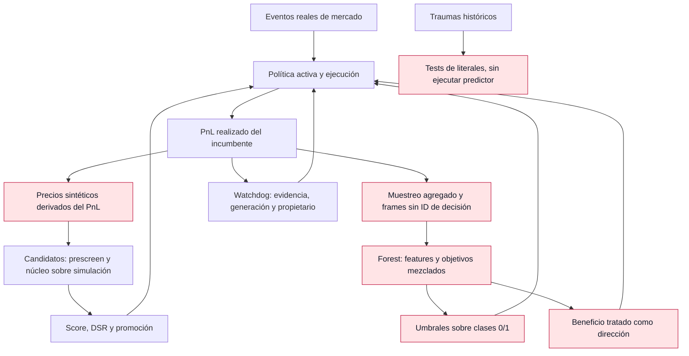

# Auditoría científica III — autoevolución, causalidad y validez de la evidencia

Fecha: 24 de septiembre de 2026. HEAD observado: `59a76de4`, con árbol de trabajo modificado por otras sesiones. Esta ronda revisa y documenta; no implementa cambios en código, no opera, no promueve genomas ni modifica autorizaciones.

## 1. Dictamen y alcance

Esta ampliación conserva las [conclusiones de la primera ronda](<C:/Users/jhona/Documents/Proyectos/Trader Gemini/docs/AUDITORIA_FUNDAMENTOS_CIENTIFICOS_2026-09-24.md>) y la [segunda ronda](<C:/Users/jhona/Documents/Proyectos/Trader Gemini/docs/AUDITORIA_FUNDAMENTOS_CIENTIFICOS_II_2026-09-24.md>). Añade **25 entradas FMT-047–071**. Son unidades documentales de fallo o limitación, no 25 incidentes demostrados en producción ni un incremento deduplicado del inventario histórico de 305 puntos. Se señalan relaciones con hallazgos anteriores.

La conclusión central es concreta: el ciclo evolutivo vivo todavía mezcla **retornos de una política**, **precios de mercado**, **probabilidades de beneficio**, **dirección de precio**, **precisión de entrenamiento** y **evidencia fuera de muestra**. Esas cantidades no son intercambiables. Una mutación puede superar su simulador porque modifica el mundo simulado o porque el juez utiliza un resultado condicionado por otra política; eso no demuestra que mejore su actuación ante el mismo mercado.

El objetivo arquitectónico continúa siendo un estado multivariante y multiescala, definido sobre tiempo físico y con soporte observacional explícito. Las escalas no deben dividirse en motores scalping/swing. Sin embargo, una representación continua requiere discretización computable y error controlado; ni una rejilla de nanosegundos ni una ecuación célebre crean observaciones, identificabilidad o información futura.

### Clasificación de evidencia

- **P1:** defecto de un contrato utilizado en el ciclo vivo, en su selección o en una protección relevante. No implica que se haya observado una pérdida financiera atribuible.
- **P2:** defecto científico o de API auxiliar, sin consumidor operativo localizado o sin efecto operativo probado.
- **Estática:** relación verificada en código y búsquedas de consumidores. **Algebraica:** contraejemplo o identidad independiente. **Ejecutada:** resultados de comandos de prueba expresamente enumerados al final.

En particular, `LiveEvolutionDaemon` sí se construye y lanza desde [el host](<C:/Users/jhona/Documents/Proyectos/Trader Gemini/src/bin/god_engine.rs:1967>). No se localizaron llamadas operativas a `EvolutionEngine::start_evolution_loop`, `start_polars_evolver_daemon`, los operadores Cauchy ni las rutinas de `AntiBiasGovernor` en la búsqueda de `crates` y `src`. Sus defectos se documentan como deuda de APIs presentes, no como prueba de que hoy estén cambiando órdenes. La ausencia en esa búsqueda no constituye análisis completo de despacho dinámico de todo el producto.

## 2. Matriz consolidada de esta ronda

| ID | Prioridad | Contrato afectado | Hallazgo |
|---|---|---|---|
| FMT-047 | P1 | Fitness | Se anuncian invariancia y aditividad que la función completa no tiene |
| FMT-048 | P1 | Selección | La abstención recibe peor score que cualquier pérdida finita |
| FMT-049 | P1 | Evaluación contrafactual | PnL del incumbente se transforma en precios para juzgar candidatos |
| FMT-050 | P1 | Simulación física | El candidato modifica el spread del mercado y la cronología se sintetiza |
| FMT-051 | P1 | Validación | Preselección y prueba reutilizan resultados con parámetros de ventana completa |
| FMT-052 | P1 | Dataset online | Features de cierre, esquemas distintos y muestras sin identidad se mezclan |
| FMT-053 | P1 | Umbrales adaptativos | Clases binarias hacen degenerar toda la búsqueda de umbrales |
| FMT-054 | P1 | Probabilidad servida | Beneficio se interpreta como dirección y accuracy de entrenamiento como autorización |
| FMT-055 | P1 | Inferencia de deterioro | Relectura de evidencia, varianza cero y pseudo-confianza no sostienen las garantías |
| FMT-056 | P1 | Protecciones | Reset sin propietario y rollback sin verificar generación activa |
| FMT-057 | P1 | Mutación en RAM | La señal forense cambia umbrales fuera del armado y del linaje |
| FMT-058 | P2 | Promotores auxiliares | El fallback puede promover una mutación no evaluada; otro promotor usa otra fitness |
| FMT-059 | P2 | Evaluador auxiliar | Reloj global por moneda, conteo heterogéneo y drawdown incompleto |
| FMT-060 | P1 | Verificación inmune | Las pruebas sintetizadas no ejecutan el comportamiento que deben proteger |
| FMT-061 | P2 | Plantillas científicas | La “wavelet” no usa su familia y se sigue generando una estrategia dual |
| FMT-062 | P2 | Autoarquitectura | Compilar el proyecto no acredita compilar, validar ni cargar el candidato |
| FMT-063 | P2 | Compilación controlada | Pipes sin drenar, presupuesto de memoria ignorado y aislamiento no acreditado |
| FMT-064 | P2 | Máquina de fases | Métricas inválidas o alarmas pueden no impedir transición a operación |
| FMT-065 | P2 | Gobernador estadístico | Reglas de WR y ratios se presentan como pruebas universales |
| FMT-066 | P2 | Distribución de mutaciones | Cauchy recortada, cotas universales y truncado de dimensiones |
| FMT-067 | P2 | Dominancia Pareto | Métricas desconocidas se convierten en resultados favorables |
| FMT-068 | P2 | Latencia simulada | Clipping y dependencia implícita alteran el modelo de jitter anunciado |
| FMT-069 | P2 | Datos de replay | Procedencia se pierde al devolver ticks y la validez se reduce a alineación |
| FMT-070 | P2 | Estado epigenómico | Mmap sin snapshot coherente y persistencia que conserva dos motores |
| FMT-071 | P1 | Disponibilidad del control | El aprendizaje y la búsqueda retrasan los watchdogs del mismo daemon |

Todos quedan abiertos en esta adenda. La prioridad no es una probabilidad de incidente ni una cuantificación monetaria.

## 3. Hallazgos detallados

### FMT-047 — La función de fitness no tiene todas las propiedades anunciadas

**Evidencia:** [fitness.rs](<C:/Users/jhona/Documents/Proyectos/Trader Gemini/crates/evolution-engine/src/fitness.rs:35>) define `F=ln(W_T/W_0)−λ·MDD²`, añade una transformación por degradación OOS y la presenta como invariante al apalancamiento y aditiva en el tiempo. El test de aditividad usa solamente drawdown cero y crecimiento positivo, precisamente donde desaparecen las partes no aditivas.

**Contraejemplos:** sin drawdown, apalancar un retorno de 10 % a 20 % cambia el término logarítmico de 0,09531 a 0,18232. No es una invariancia; tampoco debe necesariamente serlo, porque el apalancamiento cambia la riqueza. Para la trayectoria 100→90→81, con `λ=4 ln 2`, sumar las fitness de dos periodos de drawdown 10 % produce −0,266173, mientras el periodo conjunto con drawdown 19 % produce −0,310811. El máximo de drawdown y el factor OOS no se suman como los log-retornos.

El valor `λ=4 ln 2` corresponde a la preferencia elegida de equiparar una duplicación con una penalización por drawdown del 50 %. Resolver esa ecuación deriva λ **dada la preferencia**, no demuestra que todo agente racional comparta esa preferencia. La concavidad del logaritmo en riqueza final tampoco demuestra por sí sola concavidad de toda la función en políticas o genomas.

**Riesgo adicional de API:** capitales finitos positivos extremos pueden producir overflow en `final/initial` antes de aplicar `ln`; el guard de finitud de ambos argumentos no garantiza fitness finita. Los OOS inválidos reciben factor 1, que no distingue evidencia ausente de validación favorable. `compute_with_bayesian_prior` usa un peso `N/N_req` sin modelo de likelihood ni varianza y no valida la finitud del prior: es shrinkage heurístico, no un posterior acreditado.

**Cierre:** conservar la utilidad logarítmica como candidato legítimo, documentar preferencias y no atribuirle invariancias falsas. Separar retorno, duración, drawdown y estado de validación; probar composición de periodos, incertidumbre y extremos numéricos. La tasa `ln(W_T/W_0)/(T−t_0)` requiere duración física comparable; el score actual no la recibe.

### FMT-048 — La abstención se penaliza como inviabilidad aun cuando todas las oportunidades pierden

**Evidencia:** [compute](<C:/Users/jhona/Documents/Proyectos/Trader Gemini/crates/evolution-engine/src/fitness.rs:107>) devuelve `−∞` si no alcanza `max(min_trades_required,1)`. El test `d654_la_inaccion_es_inviable_no_intermedia` exige expresamente que operar y perder puntúe mejor que no operar.

**Mecanismo:** una política que conserva capital tiene utilidad logarítmica cero antes de costes externos; una que pierde 30 % con drawdown 30 % tiene aproximadamente −0,606208. El filtro invierte ese orden al transformar la primera en `−∞`. En un mercado sin edge, con costes positivos o datos no válidos, la abstención puede ser la decisión óptima, no un bloqueo de inteligencia. Una meta de crecimiento no cambia la distribución de oportunidades disponibles.

**Matiz operativo:** esto demuestra sesgo del paisaje de búsqueda, no que cada promotor vaya a instalar al perdedor; algunos tienen gates positivos adicionales. Un mínimo de observaciones puede ser una exigencia válida para **certificar** un candidato. Es distinto de declarar que el candidato tiene peor rendimiento que una estrategia perdedora.

**Cierre:** separar estados `evidencia insuficiente`, `inadmisible por riesgo` y `utilidad estimada`. Mantener un benchmark cash/abstención y evaluar cobertura de oportunidades. Si se desea exploración, especificar un presupuesto de exploración y un entorno seguro; no incentivar pérdidas mediante el score ni eliminar protecciones para generar trades.

### FMT-049 — Los retornos de la estrategia vigente se usan como si fueran retornos del mercado

**Evidencia:** [sample_realized_returns](<C:/Users/jhona/Documents/Proyectos/Trader Gemini/crates/evolution-engine/src/online_daemon.rs:481>) guarda `delta(pnl_realized)/capital` en `returns_by_coin`. Esas series llegan a [wf_evaluate_real](<C:/Users/jhona/Documents/Proyectos/Trader Gemini/crates/evolution-engine/src/online_daemon.rs:89>), que reconstruye precios mediante `next_price=price*(1+r)` y ejecuta el núcleo sobre ellos. El prescreen también decide dirección sobre esos mismos retornos.

**Error de estimando:** el PnL del incumbente depende de lado, exposición, apalancamiento, comisiones, cierres y selección de operaciones. No identifica el movimiento del subyacente. Por ejemplo, un corto rentable ante una caída produce retorno positivo de estrategia; la reconstrucción convierte ese resultado en una subida de precio. Si el incumbente no opera, no aparecen observaciones del mercado que el candidato sí habría podido aprovechar.

**Consecuencia:** el juez está condicionado por la política que produjo los datos. Usar el mismo `GodEngineCore` como evaluador no repara la fuente endógena. Una mutación puede adaptarse a la secuencia de beneficios del incumbente y ser inadecuada ante los eventos originales. La transformación tampoco conserva escala física, timestamps o microestructura.

**Cierre:** evaluar candidatos sobre eventos de mercado exógenos, as-of, con modelo de ejecución validado y políticas comparadas sobre el mismo tape. Si solo se dispone de decisiones y recompensas registradas, formular explícitamente evaluación off-policy con contexto, acción, probabilidades de selección y soporte; T21 describe sus límites. No convertir recompensas en cotizaciones.

### FMT-050 — El simulador permite al candidato modificar el mundo con el que compite

**Evidencia:** [wf_evaluate_real](<C:/Users/jhona/Documents/Proyectos/Trader Gemini/crates/evolution-engine/src/online_daemon.rs:115>) fija precio inicial 100, crea símbolos `WFD{i}`, usa `candidate.maker_spread_pct` como half-spread del **mercado**, interpola ocho precios lineales por retorno y avanza 2.000 ms en cada subtick. Procesa primero una moneda entera y después la siguiente. No conserva los timestamps originales, que ya no existen en esas series.

**Consecuencia causal:** reducir el gen de spread modifica tanto la estrategia como la liquidez exógena simulada. Dos candidatos no afrontan exactamente el mismo mercado. La secuencia multiactivo depende del orden de las series, procedentes de un HashMap; la ordenación por longitud no define un desempate por símbolo para longitudes iguales. Posiciones, capital y estado compartido sobreviven al cambio de moneda, por lo que el orden puede afectar los resultados.

**Problema físico:** una interpolación lineal no es un Brownian bridge aleatorio. Para endpoints fijos, los incrementos intermedios tienen una regularidad artificial y no exploran excursiones intraperiodo que determinan stops. Condicionar una simulación a endpoints puede ser legítimo, pero la trayectoria condicional media no representa la distribución de primeras llegadas. Tampoco cada resultado realizado equivale a una barra de 16 segundos. El top 8 por longitud es un límite de coste, no cobertura universal del espectro o del universo.

**Cierre:** separar parámetros de acción y mercado, conservar identidades y reloj, intercalar por tiempo, cerrar/reconciliar exposición terminal y verificar invariancia al orden de almacenamiento. Los escenarios sintéticos deben tener generador, semilla y distribución declarados; sus resultados no acreditan desempeño en ticks reales.

### FMT-051 — “Walk-forward” no constituye una validación independiente cuando la búsqueda consume su resultado

**Evidencia:** [el daemon](<C:/Users/jhona/Documents/Proyectos/Trader Gemini/crates/evolution-engine/src/online_daemon.rs:711>) calcula volatilidad sobre `returns_history` completo y la usa para seleccionar entradas en el tramo denominado OOS. El prescreen evalúa 2.001 genomas sobre el tramo final de las series; los 24 seleccionados y el incumbente se reevalúan sobre series que incluyen ese tramo. El ganador alimenta `edge_survives_multiplicity(...,2000)` y el proceso se repite con ventanas solapadas.

**Distinciones necesarias:** optimizar una muestra histórica no es por sí solo una fuga al futuro de producción. Pero los parámetros calculados con el final de una ventana no pueden presentarse como disponibles en cada instante de un replay causal de esa ventana. Y seleccionar candidatos con el rendimiento de un holdout lo convierte en parte de la búsqueda; no sigue siendo un test ciego final.

El número 2.000 por ronda no representa automáticamente todas las consultas adaptativas históricas, el prescreen, los cambios humanos ni la dependencia entre ventanas. Un DSR correctamente implementado no arregla datos endógenos, etiquetas erróneas o futuros introducidos en features; FMT-010 ya documenta límites del propio estadístico usado.

**Cierre:** registrar cada consulta y el conjunto de datos al que tuvo acceso; distinguir entrenamiento, validación de selección y evaluación posterior. Las garantías de [reutilización secuencial de datos de prueba](https://arxiv.org/abs/2203.11377) requieren protocolos e hipótesis, no solo un nombre OOS. Usar parámetros as-of y un presupuesto de evidencia, con adaptación explícita a dependencia temporal.

### FMT-052 — El dataset online mezcla canales y objetivos de observación incompatibles

**Evidencia:** [la ingesta mmap](<C:/Users/jhona/Documents/Proyectos/Trader Gemini/crates/evolution-engine/src/online_daemon.rs:345>) genera features `[obi,0,1,atr,hurst,±(ml_prob−0,5)]` y target de PnL del frame. [El muestreo de PnL acumulado](<C:/Users/jhona/Documents/Proyectos/Trader Gemini/crates/evolution-engine/src/online_daemon.rs:510>) añade al mismo bosque `[obi_global,aceleración_global,spread,atr_global,hurst_moneda,velocidad_global]` con target `delta/capital_actual`. Al inferir se consultan varias de esas magnitudes **por moneda**. El [frame](<C:/Users/jhona/Documents/Proyectos/Trader Gemini/crates/storage-engine/src/mmap_bus.rs:14>) no contiene IDs de trade/decisión/genoma ni símbolo.

**Problemas:** la sexta columna cambia de distancia de probabilidad a velocidad de precio, la segunda de cero a aceleración y la tercera de constante a spread. Los estados de cierre o de muestreo posterior sustituyen al snapshot de entrada. Además, un mismo resultado puede entrar por mmap y por delta acumulado sin forma de deduplicarlo. Dos cierres de +1 y −1 entre muestreos de 500 ms se cancelan y no generan observación; varios cierres pueden agregarse como si fueran un trade.

Dividir una pérdida de 10 desde capital 100 por el capital posterior 90 da −11,111 %, no el −10 % del periodo. Con posiciones concurrentes, depósitos o reajustes, la normalización se vuelve más difícil de atribuir. El número de muestras resultante no es necesariamente número de operaciones independientes.

**Cierre:** dataset versionado con esquema semántico, unidades, ID de decisión y de outcome, snapshot causal, lado, nocional/base de retorno y generación. Mantener un solo registro por objetivo y cierre lógico; registrar los neteos explícitamente. Este hallazgo amplía FMT-028/029 para otra ruta de aprendizaje, no se cierra corrigiendo solo las etiquetas del ensamble principal.

### FMT-053 — La supuesta optimización de umbrales vuelve a ser constante

**Evidencia:** [retrain_models](<C:/Users/jhona/Documents/Proyectos/Trader Gemini/crates/evolution-engine/src/online_random_forest.rs:185>) asigna `prob_win = y_class_pred[i] as f64`, pero `y_class_pred` es la predicción de clase del clasificador entrenado con etiquetas 0/1. Evalúa umbrales `th∈[0,50,0,75]` en incrementos de 0,01.

**Demostración:** para clase c∈{0,1}, `c≥th` equivale a `c=1` en toda la rejilla; `c<1−th` equivale a `c=0` en toda la rejilla. Ningún umbral cambia la población seleccionada. Como la actualización del mejor exige mejora estricta, todos los empates retienen el primer umbral. Para beneficios acumulados finitos que superen la inicialización −1e9, el resultado es 0,50/0,50; en casos extremos puede quedar el default, pero tampoco hay discriminación real.

**Impacto:** el daemon escribe esos umbrales en RAM cuando la evolución está armada. El comentario CERT-M8-C02 declara solucionado el problema porque `th` aparece en el filtro, pero el tipo de la salida mantiene la degeneración. Es un ejemplo de reparación sintáctica que no restableció el contrato matemático.

**Cierre:** obtener puntuaciones adecuadas y validadas para el mismo evento; seleccionar umbrales fuera de la muestra de ajuste, con curva de utilidad/riesgo y costes. Añadir una regresión que pruebe que umbrales distintos seleccionan conjuntos distintos cuando las probabilidades lo permiten.

### FMT-054 — El bosque aprende beneficio y el núcleo lo interpreta como dirección

**Evidencia:** [TradeObservation y predict_6d](<C:/Users/jhona/Documents/Proyectos/Trader Gemini/crates/evolution-engine/src/online_random_forest.rs:215>) clasifican `was_profitable` y construyen `p=0,6·sigmoid(50·PnL_estimado)+0,4·clase`. El [núcleo](<C:/Users/jhona/Documents/Proyectos/Trader Gemini/crates/god-engine-core/src/lib.rs:3808>) considera desacuerdo para Long si p<0,40 y para Short si p>0,60. El campo de observación no conserva una acción explícita; el signo de OBI no equivale al lado realmente ejecutado.

**Contraejemplo:** una predicción de beneficio +2 % con clase ganadora entrega p≈0,838635. Eso puede apoyar una operación corta rentable, pero el consumidor la interpreta como desacuerdo con el corto y reduce su confianza. Tampoco la sigmoid de una esperanza de retorno es una probabilidad de ganar identificada: distribuciones con la misma media y probabilidades de pérdida diferentes producen la misma salida de regresión.

**Validación aparente:** `last_accuracy` se calcula prediciendo **la misma matriz usada para fit** y el núcleo habilita el veto con accuracy>0,55. Es resubstitution accuracy, no precisión prequential/OOS. Un árbol que memoriza ruido puede obtener buen score de ajuste; la mezcla con la clase no calibra ese score. El consumidor solo reduce confianza, lo cual limita el alcance, pero aun así puede bloquear operaciones adecuadas y sesgar la selección.

**Cierre:** definir `P(beneficio neto>0 | contexto, acción, salida)` o una probabilidad direccional distinta, y mantenerla de extremo a extremo. Evaluar antes de aprender, por snapshot y lado; publicar validez, edad, error y calibración. No usar accuracy de entrenamiento como acreditación para intervenir.

### FMT-055 — El control estadístico confunde falta de dispersión, falta de evidencia y confianza

**Evidencia:** [calculate_ransac_sharpe](<C:/Users/jhona/Documents/Proyectos/Trader Gemini/crates/evolution-engine/src/online_daemon.rs:1212>) usa varianza muestral con denominador N−1, pero multiplica media/desviación por `sqrt(N−1)`, en vez de `sqrt(N)` para el t habitual. Devuelve cero si la desviación es ≤1e−12. El kill-switch usa una EMA de ese estadístico; la promoción construye una “confianza bayesiana” mediante `1−1/(sqrt(N)·t)` y un prior interpolado.

**Contraejemplos y alcance:** una serie constante de 25 retornos −0,01 obtiene cero, igual que ausencia de edge, pese a tener media negativa inequívoca dentro del ejemplo. No debe asignársele un t estándar finito arbitrario: hay que distinguir degeneración, error de datos y pérdida determinista. La diferencia sqrt(N−1)/sqrt(N) es pequeña pero revela que la etiqueta Student no coincide exactamente con la fórmula.

La EMA se actualiza por reloj aunque la ventana no reciba nuevos trades. Con t fijo −2 y EMA inicial −0,4, tras 20 lecturas la EMA cae a aproximadamente −1,8055: cruza el umbral sin evidencia nueva. Puede ser un temporizador de persistencia deliberado, pero no equivale a 20 nuevas muestras ni conserva un p nominal. La pseudo-confianza tampoco define posterior, hipótesis nula o cobertura; el texto de promoción afirma “>95 %” aunque los gates aceptan valores inferiores.

**Cierre:** separar acumulación de evidencia de suavizado operativo; comprobar dependencia, ventanas solapadas y consultas repetidas. Guardar degeneración/ausencia como estados, no cero. Reportar t, N efectivo, media, riesgo y método, sin convertir un score heurístico en probabilidad de verdad. La retirada del trimming de colas es una mejora real que debe conservarse.

### FMT-056 — Una protección puede borrar el estado de otra y el rollback pierde identidad

**Evidencia:** [el daemon](<C:/Users/jhona/Documents/Proyectos/Trader Gemini/crates/evolution-engine/src/online_daemon.rs:670>) desactiva `arena.kill_switch_active` si su EMA supera −0,50, sin comprobar quién activó ese flag. El [supervisor del host](<C:/Users/jhona/Documents/Proyectos/Trader Gemini/src/bin/god_engine.rs:1721>) lo activa por razones de drawdown/latencia y registra necesidad de rearme manual. Existen además controles del executor: no se afirma que resetear el flag de arena libere todas las barreras ni produzca una orden.

**Rollback:** [check_post_promotion_degradation](<C:/Users/jhona/Documents/Proyectos/Trader Gemini/crates/evolution-engine/src/online_daemon.rs:560>) recuerda generación y padre, pero no comprueba que esa generación siga activa antes de restaurar el padre. Las observaciones tampoco identifican qué genoma tomó cada decisión. Una promoción concurrente puede hacer que se juzgue y revierta otro estado. Si `rollback` falla, se borra igualmente `promoted_generation` y la evidencia; se avisa por log, pero se desarma el watchdog.

**Cierre:** latch por causa/propietario, con agregación OR y políticas de rearme específicas. Rollback condicional a generación activa y resultados atribuibles; mantener estado de fallo/reintento o intervención explícita hasta resolverlo. El aprendizaje no debe poder borrar una restricción de riesgo ajena usando solamente su propio score.

### FMT-057 — La reacción forense muta RAM sin el contrato de promoción

**Evidencia:** [la rama `.forensic_violation`](<C:/Users/jhona/Documents/Proyectos/Trader Gemini/crates/evolution-engine/src/online_daemon.rs:445>) llama a `mutate_atomic_config` con umbrales 0,60/0,40, sin consultar `live_evolution_armed_for_env`. Lo hace fuera del linaje `GenomeEnvelope`, ignora errores y elimina la señal. [ASTMutator](<C:/Users/jhona/Documents/Proyectos/Trader Gemini/crates/evolution-engine/src/ast_mutator.rs:93>) almacena valores de campos admitidos sin verificar finitud ni bounds.

**Mecanismo:** una escritura atómica de un escalar evita ciertos desgarros, pero no valida el conjunto de configuración ni identifica su generación. Una alarma de posible fuga de datos no deriva matemáticamente los umbrales elegidos, y cambiar un umbral no repara la causalidad de features. En esta ruta los valores son literales finitos; la posibilidad de NaN corresponde a otros llamadores de la API, no a una observación de esta rama.

**Productor inspeccionado:** [forensics.rs](<C:/Users/jhona/Documents/Proyectos/Trader Gemini/crates/audit-engine/src/forensics.rs:54>) contiene un `#[test]` con datos sintéticos fijos que considera correlación >0,99 evidencia de lookahead y termina imprimiendo aprobación aun después de señalar violación. Una serie causal muy persistente puede tener correlación alta; una fuga no tiene por qué superar 0,99. No se encontró un detector vivo equivalente a esa afirmación de certificación.

**Cierre:** evento forense tipado con evidencia y acciones permitidas; hacer pasar toda mutación por autorización de entorno, validación y registro, o definir explícitamente un override seguro separado. Preservar la alarma hasta confirmar su tratamiento. No desactivar la protección: reparar su mecanismo y su trazabilidad.

### FMT-058 — Las APIs auxiliares de promoción no forman un único protocolo científico

**Evidencia y alcance:** [EvolutionEngine](<C:/Users/jhona/Documents/Proyectos/Trader Gemini/crates/evolution-engine/src/lib.rs:65>) inicia `current_alpha` en default. Si ningún candidato supera los gates, [el fallback](<C:/Users/jhona/Documents/Proyectos/Trader Gemini/crates/evolution-engine/src/lib.rs:599>) fija tres genes y llama a `promote` sin evaluar esa configuración resultante. La validación del almacén es de sanidad, no una prueba de desempeño. En la rama ganadora no se contrasta explícitamente al incumbente sobre el mismo escenario; superar cero no prueba mejorarlo. El mensaje final de propagación se imprime incluso tras error de promoción.

El [daemon Polars](<C:/Users/jhona/Documents/Proyectos/Trader Gemini/crates/evolution-engine/src/polars_evolver.rs:115>) usa otra función `retorno·WR·penalizaciones`, denominada pseudo-Sharpe, y selecciona el máximo de 1.000 muestras sobre los mismos datos. No llama a la fitness declarada única. Cambia la prioridad del hilo **llamador** antes de `spawn`, no la del hilo que realizará la búsqueda; el flag estático tampoco modela reinicio tras fallo.

**Límite:** no se localizaron callers operativos para estas dos APIs. No se atribuyen las promociones actuales a ellas. La preocupación es su reactivación o uso por otra herramienta bajo la falsa presunción de que compartir almacén significa compartir validación.

**Cierre:** protocolo de candidato e incumbente común, herencia desde snapshot activo, gates de desempeño/seguridad separados y reporte de éxito fiel. No promover un fallback no evaluado. Conservar las APIs como experimentales si procede, pero no presentarlas como autoevolución certificada.

### FMT-059 — El evaluador auxiliar mide otra cronología y otra población de trades

**Evidencia:** [el loop CMA auxiliar](<C:/Users/jhona/Documents/Proyectos/Trader Gemini/crates/evolution-engine/src/lib.rs:245>) usa un único `last_train_minute` para todos los activos: el primer tick que cruza el minuto genera cierre de kline y los otros activos del mismo minuto ya no lo reciben. El estado OOS vuelve a iniciar otro reloj global. Se fuerza todo tick como trade y profundidad con lado de agresión desconocido; las features macro permanecen congeladas.

En train cuenta `new_order || closed_order`, pero en OOS cuenta solo cierres. Tres aperturas pueden cubrir un mínimo de tres “trades” sin representar tres resultados independientes. La curva de equity se actualiza únicamente durante train; su drawdown no incluye el tramo OOS ni todas las pérdidas flotantes. A la vez, el Sharpe de esa curva se escala por un contador que incluye resultados OOS y se llama “trades por día” sin medir un día.

**Consecuencia:** el score depende de orden de ticks, actividad por activo y convención de conteo. El criterio de suficiencia muestral y la penalización por riesgo no juzgan la misma trayectoria que el capital final. El split 70/30 no corrige esas discrepancias.

**Cierre:** eventos tipados, relojes por fuente/activo, trayectoria de equity completa y base temporal definida; número de outcomes reconciliados separado de órdenes/entradas. Rechazar la equivalencia con replay vivo hasta demostrar paridad. Alcance P2 por ausencia de caller operativo localizado.

### FMT-060 — Las pruebas inmunes no prueban que la reparación evite el trauma

**Evidencia:** [generate_single_immune_test](<C:/Users/jhona/Documents/Proyectos/Trader Gemini/crates/metacortex-engine/src/immune_system.rs:84>) inserta los inputs históricos como literales —sustituye no finitos por cero— y comprueba su finitud, que no estén vacíos y que el **PnL histórico literal** tenga magnitud <0,20. No llama a predictor, decisión, ejecución ni modelo nuevo; `expected_pnl_pct` y `predictor_name` no actúan como oráculo del resultado recalculado.

**Contraejemplo lógico:** si una pérdida histórica del 1 % se debió a un fallo grave, el test puede pasar aunque el fallo persista. Si el trauma fue del 30 %, la condición literal sigue fallando aunque una reparación haga que el sistema ya no opere. Ninguna salida nueva participa en la aserción. Además, los registros del mismo símbolo y segundo comparten filename, sin usar el ID para evitar sobrescrituras.

**Conexión viva:** el supervisor del host genera estos archivos una vez y registra cuántos produjo. No ejecuta esa suite allí. El [test de integración](<C:/Users/jhona/Documents/Proyectos/Trader Gemini/crates/metacortex-engine/tests/mutation_cycle_test.rs:8>) comprueba existencia y cadenas del código generado, no la prevención del trauma. Generar tests es una capacidad real; acreditar inmunidad no lo es todavía.

**Cierre:** convertir el trauma en fixture con snapshot, versión, datos originales y resultado esperado verificable; ejecutar el componente pertinente antes y después de la reparación. Conservar inputs inválidos como casos adversariales. Separar test generado, compilado, ejecutado y regresión que habría fallado antes.

### FMT-061 — La plantilla “wavelet” ignora la familia y persiste un generador de dos motores

**Evidencia:** [generate_wavelet_feature](<C:/Users/jhona/Documents/Proyectos/Trader Gemini/crates/metacortex-engine/src/evolutionary_templates.rs:72>) utiliza `wavelet_type` en el comentario, pero el cálculo es la fracción de valores fuera de `threshold·std` alrededor de la media, multiplicada por un factor. Cambiar Haar por Daubechies4 o MexicanHat no cambia el operador. `to_rust_expr` no se consume en ese generador.

**Diferencia científica:** esa fracción es un detector de colas en una ventana, no una transformada wavelet. Es invariante a permutar el orden de todos los datos de la ventana: `[1,1,−1,−1]` y `[1,−1,1,−1]` tienen el mismo resultado aunque su estructura de escala difiera. La API tampoco valida ventana cero o parámetros no finitos antes de generar código.

La [plantilla dual](<C:/Users/jhona/Documents/Proyectos/Trader Gemini/crates/metacortex-engine/src/evolutionary_templates.rs:199>) sí conserva cuatro parámetros TP/SL separados y un booleano `is_scalp`. Esto es un **productor potencial** de arquitectura binaria, no solamente una palabra heredada en un log. No se localizó consumidor operativo de ese generador. El predictor de volumen/funding, por su parte, llama decay a un factor constante `exp(−decay_rate)` sin tiempo: atenúa amplitud, no implementa decaimiento dinámico.

**Cierre:** conservar el detector de colas bajo nombre correcto, implementar/testear el operador wavelet si se necesita y sustituir el contrato del generador dual por funciones de escala cuando se autorice implementación. Probar diferencias entre familias, respuesta a impulsos, preservación del orden y unidades temporales; no renombrar sin cambiar semántica.

### FMT-062 — El éxito de compilación no vincula el binario con el candidato generado

**Evidencia:** [trigger_wavelet_mutation](<C:/Users/jhona/Documents/Proyectos/Trader Gemini/crates/metacortex-engine/src/lib.rs:85>) genera un archivo en `cerebro/cortex`, genera tests ignorando errores y ejecuta `cargo build -p trader-gemini-v5`. No añade el módulo al árbol de compilación, no ejecuta los tests generados, no llama a hot-swap y marca la mutación como exitosa si compila el paquete.

En las rutas inspeccionadas no aparece un `include!`, `mod` o manifest que integre esas plantillas generadas. El [sandbox](<C:/Users/jhona/Documents/Proyectos/Trader Gemini/crates/metacortex-engine/src/compiler_sandbox.rs:128>) infiere el artefacto por nombre del paquete, aunque el proyecto tiene binarios con nombres propios, como `god_engine`. Que exista un archivo con un nombre esperado tampoco acredita que proceda del candidato de esta compilación.

**Consecuencia:** se puede construir correctamente un paquete que no contiene la mutación y anunciar una evolución inexistente. Una falla posterior puede eliminar el archivo generado sin mantener una transacción/versionado del candidato. No se ejecutó esta API en la auditoría ni se localizó invocación operativa de `trigger_wavelet_mutation`.

**Cierre:** build aislado del candidato, manifiesto de módulos, mensajes estructurados de Cargo, hash de fuentes y artefacto, ABI declarada, pruebas ejecutadas y publicación condicionada. La cadena crear→compilar→probar→cargar→consumir necesita evidencia en cada arista.

### FMT-063 — El “sandbox” no cumple todo el presupuesto ni la garantía de aislamiento

**Evidencia:** [compile_package](<C:/Users/jhona/Documents/Proyectos/Trader Gemini/crates/metacortex-engine/src/compiler_sandbox.rs:73>) conecta stdout/stderr a pipes y no los drena hasta que `try_wait` informa salida. Un hijo que llena un pipe puede bloquear intentando escribir, mientras el padre espera que termine: una compilación sana puede acabar como timeout artificial. No se provocó ese bloqueo en esta ronda.

El campo `max_memory_mb` no gobierna el abortado; la condición usa memoria total del host >85 % de 16 GiB. No atribuye consumo al proceso ni respeta un límite de 2 GiB del config. La implementación lanza Cargo con permisos del proceso anfitrión: jobs, timeout y vigilancia de memoria no son aislamiento de filesystem/red o de ejecución de build scripts. El nombre sandbox no prueba confinamiento de código generado.

**Cierre:** drenar ambas salidas concurrentemente con límites, aislar build y archivos, aplicar límites reales del árbol de procesos y resolver artefactos desde su manifiesto. Probar logs mayores que la capacidad de pipe, fallos de compilación y sobreconsumo en entorno descartable. Separar claramente control de recursos de frontera de seguridad.

### FMT-064 — La máquina de fases puede admitir operación con métricas inválidas o alarmas pendientes

**Evidencia:** [evaluate_transition](<C:/Users/jhona/Documents/Proyectos/Trader Gemini/crates/metacortex-engine/src/fases_autonomous.rs:65>) valida finitud de discrepancia, pero no de drawdown, drift o Sharpe. En Operación, un drawdown NaN no cumple `>0,08` y puede dejar el sistema en el mismo estado. En Validación, `sharpe≥1 && dd<0,05` permite pasar a Operación aunque checksum sea falso o la latencia sea crítica; esos checks no son invariantes globales de transición.

La fase Reproducción retorna a Operación incondicionalmente y Hibernación solo exige checksum. El número de ticks no se valida como monótono y los flags de compilación/tests no están ligados a un ID de candidato. La estructura representa una máquina de estados, pero no una prueba formal de seguridad del ciclo de vida.

**Alcance y cierre:** no se localizó consumo vivo de `evaluate_transition` fuera de pruebas; no se concluye que esos bypass controlen hoy las órdenes. Definir invariantes globales, estados de métricas desconocidas y snapshot de evidencia por candidato; probar todas las transiciones, reordenamientos y NaN. Mantener separados resultados de validación, admisibilidad de operar y disponibilidad de datos.

### FMT-065 — El gobernador mezcla reglas comerciales con significación estadística

**Evidencia:** [AntiBiasGovernor](<C:/Users/jhona/Documents/Proyectos/Trader Gemini/crates/evolution-engine/src/anti_bias_governor.rs:96>) exige WR vivo≥50 %, diferencia de WR≤15 puntos y al menos diez trades para declarar “realidad” válida. `validate_out_of_sample` compara PnL medio por trade con un haircut del 50 %, sin error estándar o equivalencia de exposiciones. Ninguna condición constituye por sí sola una prueba estadística de generalización.

**Contraejemplo:** WR=40 %, ganancia media de 3 unidades y pérdida de 1 produce expectativa bruta +0,6 por trade; WR=80 %, ganancia de 1 y pérdida de 5 produce −0,2. Los costes deben añadirse, pero ya muestran que 50 % no separa universalmente ganador de perdedor. Comparar el WR agregado del sistema con el simulado de un mutante tampoco identifica su efecto causal.

La otra rutina denominada DSR devuelve cero o `Sharpe·CDF`, no la probabilidad CDF anunciada, y confunde terminología de p-value y probabilidad de genuinidad. Es distinta de `selection_stats`, cuyo contrato ya se analizó en FMT-010. No se localizaron llamadas operativas a esta API.

**Cierre:** declarar heurísticas como políticas, estimar pagos/costes y comparar poblaciones compatibles. Unificar las APIs estadísticas con tipos de resultado que no permitan confundir score, test, probabilidad y decisión. No quitar gates sin sustituir la función de riesgo que debían cumplir.

### FMT-066 — La distribución de mutación y el contrato dimensional no son los anunciados

**Evidencia:** [EvolutionaryOperators](<C:/Users/jhona/Documents/Proyectos/Trader Gemini/crates/evolution-engine/src/crossover_cauchy.rs:28>) usa `min(len(parent1),len(parent2))`, por lo que un cruce con longitudes distintas elimina coordenadas silenciosamente; el test acepta ese resultado. Tanto crossover como mutación aplican cotas universales [−10,10], sin información de coordenadas normalizadas o unidades del gen.

La [mutación](<C:/Users/jhona/Documents/Proyectos/Trader Gemini/crates/evolution-engine/src/crossover_cauchy.rs:71>) transforma uniformes con tangente, pero recorta el paso a ±5 escalas. Ya no tiene colas de Cauchy sin cota: crea masa en los extremos. En la Cauchy ideal, aproximadamente 12,5666 % de la masa tiene |paso|≥5 escalas y acaba acumulada en los límites por ese clipping. No es equivalente a muestrear de una Cauchy condicionada al intervalo.

**Cierre:** distinguir winsorización, truncamiento por rechazo y reflexión/proyección sobre el dominio genómico. Validar dimensiones y escoger distribución en coordenadas declaradas; documentar y medir el sesgo de reparación. No se afirma que usar pasos acotados sea incorrecto: el defecto es atribuirles otra distribución o perder genes sin error. API sin consumidor operativo localizado.

### FMT-067 — La dominancia Pareto puede premiar métricas desconocidas

**Evidencia:** [ParetoCandidate::new](<C:/Users/jhona/Documents/Proyectos/Trader Gemini/crates/evolution-engine/src/moe_neat_arena.rs:23>) transforma Sharpe/PnL no finitos en cero, mientras conserva otras métricas válidas. Un candidato con Sharpe y PnL desconocidos puede convertirse en score cero y dominar a otro con pérdida y Sharpe negativo, si tiene igual WR y menor drawdown declarado.

**Distinción:** la relación `dominates` y el non-dominated sorting son implementaciones reconocibles de Pareto para números válidos; no se documentan como falsos. El fallo está antes, al convertir falta de medición en un valor con significado económico. También maximizar WR como objetivo independiente introduce una preferencia adicional; no se deduce de crecimiento compuesto.

**Cierre:** métrica válida/ausente/invalidada con reglas explícitas de admisibilidad antes del sort, población evaluada bajo el mismo horizonte y unidades, y prohibición de dominancia basada en imputaciones favorables. No se localizó consumidor operativo de estas utilidades en esta ronda.

### FMT-068 — El jitter anunciado no conserva su distribución ni su media en todo el dominio

**Evidencia:** [sample_latency_ms](<C:/Users/jhona/Documents/Proyectos/Trader Gemini/crates/backtest-engine/src/network_jitter.rs:33>) usa una fórmula lognormal con corrección de media, pero recorta uniformes, exponente y finalmente latencia a [2,500] ms. Con base=1 ms y sigma=0, valores aceptados por el constructor, toda muestra vale 2 ms; con base=1.000 y sigma=0, vale 500 ms. La media no puede seguir siendo la base en esos casos.

La pérdida de paquete usa el mismo uniforme u1 que controla el radio Box–Muller. Condicionar en pérdida modifica la distribución del shock de latencia; no hay independencia, y esa relación no se calibra ni se explica como un modelo de congestión. El slippage usa siempre un movimiento adverso proporcional a raíz de tiempo, que puede servir como escenario de estrés, no como realización browniana imparcial. El parámetro de difusión debe tener unidades de retorno por raíz de segundo, aunque su nombre sugiera “por segundo”.

**Cierre:** declarar distribución realmente implementada, masas en los caps, dependencia pérdida/latencia y función de estrés; estimar con datos y cuantificar colas. Dato inválido no debe transformarse silenciosamente en ejecución sin slippage. No se localizó uso operativo del simulador fuera de exports/tests.

### FMT-069 — El loader de ticks no preserva todas las garantías de procedencia y calidad

**Evidencia:** [load_binary_ticks](<C:/Users/jhona/Documents/Proyectos/Trader Gemini/crates/backtest-engine/src/tick_replayer.rs:96>) reconoce cabeceras real/sintética, pero devuelve solamente `Vec<TickEvent>`; el origen no acompaña los eventos ni el resultado de `load_multi_coin_binary_ticks`. El código distingue algunos formatos correctamente, pero esa distinción puede perderse en consumidores que no vuelvan a inspeccionar la fuente.

Una cabecera desconocida se trata como legacy si el **tamaño completo** es múltiplo de 40; otros tamaños sí se rechazan. Por tanto la afirmación general de rechazar cualquier magic desconocido no se cumple. Los valores no finitos se convierten en cero y no se comprueba ask≥bid, orden temporal dentro del archivo, unidades de timestamp o endianness portable antes de interpretar el layout nativo. Un archivo alineado no es automáticamente un tape válido.

**Alcance:** `continuous_evolution_backtest` llama al loader; esto no demuestra que todos sus caminos pierdan procedencia, porque otros lectores realizan checks propios. **Cierre:** devolver dataset/eventos con metadata de origen, esquema temporal, calidad y conteo de descartes; distinguir compatibilidad explícita de magic inválido. Conservar el aborto multiarchivo ante errores y la distinción de magics existente: son avances útiles.

### FMT-070 — El estado epigenómico auxiliar no garantiza un snapshot continuo ni atómico

**Evidencia:** [write_mmap_state](<C:/Users/jhona/Documents/Proyectos/Trader Gemini/crates/metacortex-engine/src/hot_swap_controller.rs:118>) redimensiona el mismo archivo y copia bytes sin versión, seqlock o publicación de snapshot. `flush` persiste datos, pero no impide que otro lector vea una actualización parcial. La documentación de baja latencia tampoco sustituye una medición; hacer flush síncrono introduce trabajo de almacenamiento.

La persistencia por símbolo mantiene TP/SL separados en scalping y swing, valores por defecto silenciosos y formato de seis decimales, sin curvas ni unidad temporal. El cargador dinámico conserva todas las bibliotecas en un vector y en Windows intenta borrar archivos `cortex_*` del directorio temporal sin identificar a su propietario; puede interferir con otras sesiones si coincidieran nombres. La API es `unsafe` y delega ABI al caller: cargar una DLL no prueba compatibilidad semántica o corrección del modelo.

**Alcance:** no se localizó uso operativo de estas operaciones fuera de pruebas; no se atribuyen las garantías deficientes al almacén genómico principal. **Cierre:** snapshots versionados con identidad y reader protocol, precisión y esquema de curvas, limpieza limitada a archivos propios y manifiesto ABI/modelo. No convertir un formato auxiliar binario en fuente de verdad de una arquitectura continua.

### FMT-071 — El control de deterioro espera a la búsqueda que debería vigilar

**Evidencia:** [run_online_learning_loop](<C:/Users/jhona/Documents/Proyectos/Trader Gemini/crates/evolution-engine/src/online_daemon.rs:330>) ingiere, reentrena, predice, muestrea y verifica rollback en un mismo ciclo. `evaluate_shadow_strategy().await` espera al `spawn_blocking` que hace la búsqueda. Esto libera el worker de Tokio, pero **no permite que el mismo loop continúe ejecutando sus watchdogs** mientras espera.

Con ocho series de 400 retornos y ocho subticks, 25 evaluaciones completas representan hasta 640.000 llamadas a `process_event` por esa etapa, además del prescreen y asignaciones. No es una medición de tiempo real; cuantifica el tamaño del trabajo. El intervalo de 500 ms o 60/180 s no garantiza esa cadencia bajo carga. El entrenamiento del bosque también se ejecuta síncronamente en el loop, y los errores pueden repetirse sin consumir las observaciones pendientes.

**Consecuencia:** el control estadístico y la ingesta de este daemon pueden envejecer durante la optimización. Existen otras protecciones en el host, de modo que esto no demuestra paralización de toda la seguridad ni del trading. Sí invalida asumir que todos los procesos adaptativos se ejecutan continuamente con la frecuencia escrita en el sleep.

**Cierre:** separar control de seguridad, ingesta y búsqueda mediante snapshots y colas acotadas; deadlines, cancelación y presupuestos de CPU/memoria. Medir edad de evidencia, tiempo de ciclo y p99 antes de aumentar población, frecuencia o complejidad teórica. No usar mayor tasa de mutación como sustituto de mayor capacidad de observación.


## 4. Integraciones científicas T21–T24: propósito, ecuaciones y límites

Estas propuestas amplían T01–T20; no reemplazan los diseños anteriores ni constituyen implementaciones. La investigación con fuentes primarias orientó la elección: primero resolver evaluación causal, uso adaptativo de evidencia y contratos de prueba, antes de aumentar complejidad del optimizador.

### T21 — Evaluación off-policy y estimación doblemente robusta

**Problema que aborda:** FMT-049 y FMT-052. El resultado de la política desplegada no informa directamente del resultado de cualquier otra política. En un contextual bandit, registrar contexto x, acción a, recompensa r y probabilidad de selección b(a|x). Para una política objetivo π y un modelo de recompensa m, un estimador doblemente robusto tiene la forma:

```text
V_DR = (1/n) Σ_i [
    Σ_a π(a|x_i) m(x_i,a)
    + π(a_i|x_i)/b(a_i|x_i) · (r_i − m(x_i,a_i))
]
```

El primer término estima la recompensa de las acciones de la política nueva; el segundo corrige con residuos de las acciones observadas, ponderados por su probabilidad de selección. Las probabilidades son adimensionales y el estimador conserva las unidades de recompensa. La derivación combina modelado del resultado y del mecanismo que seleccionó qué resultados observamos, como en [Dudík, Langford y Li](https://arxiv.org/abs/1103.4601) y su [desarrollo posterior](https://arxiv.org/abs/1503.02834).

**Condiciones críticas:** necesita soporte: si la política objetivo usa una acción que nunca pudo elegir la política histórica, el cociente no la identifica. Un logging determinista puede dejar amplias regiones sin soporte. Las garantías de robustez requieren hipótesis sobre observaciones y corrección de los modelos; no sobreviven automáticamente a confounding no registrado, recompensas de colas no controladas o contexto posterior a la decisión.

**Traducción al sistema:** inicialmente usarlo como diagnóstico de selección y cobertura, no como autorización de órdenes. La acción incluye lado, tamaño y política de salida. En trading con inventario, impacto y recompensas diferidas no basta el modelo de una acción contextual aislada: hay dependencia secuencial y debe considerarse un problema MDP/control, con sus propias restricciones. [OPE con logging estimado](https://arxiv.org/abs/2404.01830) es una línea relacionada, no una forma de recuperar información que nunca se registró.

**Pruebas y rechazo:** comparar con replay exógeno conocido en escenarios simulados donde se sabe el valor verdadero; medir soporte, pesos extremos y tamaño efectivo. Rechazar estimaciones dominadas por unas pocas observaciones o por extrapolación del modelo. No introducir exploración con dinero real para satisfacer un supuesto estadístico sin autorización y presupuesto de riesgo.

### T22 — Presupuesto de evidencia para una evolución que consulta y se modifica repetidamente

**Problema que aborda:** FMT-051 y FMT-055. Un motor autoevolutivo formula hipótesis de forma adaptativa: cada resultado cambia qué candidato se prueba después. Debe registrarse esa dependencia, igual que se registra el linaje genómico.

Una formulación concreta para un candidato j es:

```text
H0_j: E[L(candidato_j) − L(incumbente_j)] ≥ −δ_j
```

L es una pérdida elegida previamente, con unidades y horizonte comunes; δ es la mejora mínima relevante, no un umbral elegido después de observar la ventaja. Una regla elemental de reparto fija presupuestos α_j con suma ≤α. La cota de unión solo controla errores si cada test utilizado conserva la validez que se le atribuye; **repartir alpha no repara p-values invalidados por reutilización adaptativa del holdout**.

La familia [Ladder](https://arxiv.org/abs/1502.04585), las [limitaciones y variantes para muestras pequeñas](https://arxiv.org/abs/1607.00091) y los [procedimientos gráficos secuenciales](https://arxiv.org/abs/2203.11377) ofrecen mecanismos diferentes para controlar la información liberada y las aprobaciones. Estos últimos parten de observaciones IID y tests definidos bajo su protocolo; no se importan como garantía directa a retornos autocorrelacionados. [Stable median](https://arxiv.org/abs/1706.05069) es otra aproximación a la generalización de consultas adaptativas.

**Integración propuesta:** un grafo de hipótesis enlazado al grafo de genomas y datasets, con cada consulta, score, corrección, resultado y derecho de reutilización. Separar familias exploratorias y confirmatorias; mantener una evaluación temporal posterior no usada para escoger parámetros. Si el sistema cambia objetivo, universo o ejecución, debe cambiar también el registro del experimento.

**Criterio de aceptación:** ensayar una familia nula de estrategias sin edge y comprobar frecuencia de aprobaciones falsas bajo el protocolo completo, incluida búsqueda adaptativa, ventanas solapadas y reinicios. No bastan tests de una fórmula DSR aislada. Las herramientas de drift pueden ayudar a decidir cuándo reevaluar, pero no crean independencia ni corrigen la muestra seleccionada.

### T23 — Crecimiento con drawdown como problema de trayectoria, no como invariante de un escalar

**Problema que aborda:** FMT-047/048/059. Separar preferencia de crecimiento, límite de riesgo y suficiencia de evidencia. Para riqueza W y máximo acumulado M, el estado mínimo para ciertas restricciones incluye:

```text
M_t = max(M_(t−), W_t)
d_t = 1 − W_t/M_t
D*_t = max(D*_(t−), d_t)
W_t ≥ w(M_t)
```

La última relación es una restricción de drawdown elegida. Si el objetivo penaliza el máximo drawdown ya observado, también debe conservar D*, no solo W y M actuales. Repartir la historia en ventanas y reiniciar el pico borra una variable de estado necesaria. Para estudiar tasa de crecimiento, declarar tiempo físico, numeraire, cashflows y riqueza mark-to-market; los log-retornos son aditivos cuando se enlazan bases coherentes y no se omiten transferencias externas.

**Transferencia avanzada:** los [procesos de Azéma–Yor](https://arxiv.org/abs/0902.1328) y la [optimización con restricciones no lineales de drawdown](https://arxiv.org/abs/1110.6289) relacionan restricciones de trayectoria con transformaciones de procesos/funciones de utilidad. El trabajo consultado utiliza un mercado sin fricciones, riqueza con máximo continuo y condiciones específicas de utilidad y restricción. La [optimalidad de crecimiento bajo drawdown](https://arxiv.org/abs/1206.2305) estudia otra formulación relacionada. Ninguno demuestra que la actual resta λ·MDD² sea un óptimo universal ni garantiza cumplir un límite con saltos, fills discretos y costes reales.

**Integración propuesta:** referencia matemática para especificar estado, límites y comparaciones; después una aproximación computable con restricciones de ejecución. Usar escenarios de gaps, funding, tamaños mínimos, liquidación y slippage; mantener cash como acción admisible cuando corresponde. La meta de duplicación en tres días es un objetivo, no una distribución garantizada.

**Cierre:** pruebas de concatenación de trayectorias, de invariancia ante cambio de numeraire correctamente aplicado y de sensibilidad a costes. No exigir invariancia al apalancamiento: esa transformación cambia económicamente el problema. No extrapolar un resultado asintótico a una ventana de segundos o a una cuenta con restricciones discretas sin análisis adicional.

### T24 — Pruebas metamórficas y verificación de relaciones científicas

**Problema que aborda:** FMT-060/061/062/064. Cuando no se conoce una salida exacta para cada mercado, aún pueden probarse relaciones necesarias entre ejecuciones. No se trata de afirmar que toda teoría tiene que conservar lo mismo, sino de derivar cada relación del contrato correspondiente.

| Transformación de prueba | Relación esperada, si se cumplen sus hipótesis | Qué detectaría |
|---|---|---|
| Mismo tape y acciones, distinto orden de almacenamiento de activos | Mismo orden temporal reconstruido y mismo resultado | Dependencia espuria del HashMap/serialización |
| Dividir una trayectoria y reanudar con snapshot completo | Mismo estado final que una ejecución continua | Pérdida de pico, posiciones, reloj o aprendizaje |
| Repetir el mismo outcome con el mismo ID | Ningún aprendizaje adicional | Duplicidad de crédito |
| Cambiar solo la política candidata | Datos exógenos idénticos | Spread de mercado gobernado por un gen |
| Cambiar familia wavelet con señales discriminantes | Respuesta según el operador seleccionado | Parámetro que solo cambia un comentario |
| Introducir métrica de salud no válida | Estado de calidad explícito, no autorización implícita | Fase que opera con NaN |
| Cambiar prefijo/capital de denominación coherentemente | Unidades y retornos económicos consistentes | Invariancias de escala falsas |

Las hipótesis importan: la permutación temporal de una serie **no** debe conservar la respuesta de todos los modelos espectrales; la permutación de almacenamiento con timestamps intactos sí debería ser irrelevante para la cronología reconstruida. La tolerancia se deriva de precisión numérica y del error de aproximación, no del deseo de que pase el test.

La investigación en [generación de relaciones metamórficas](https://arxiv.org/abs/2312.15302) y el [preprint sobre validez de dominio en modelos científicos](https://arxiv.org/abs/2606.17529) aporta procedimientos a estudiar. Sus experimentos no certifican este código. En este proyecto conviene comenzar con relaciones derivadas manualmente, casos pequeños y mutantes deliberadamente incorrectos, verificando que el test realmente los rechaza.

### 4.1 Qué aportan —y qué no— las teorías más sofisticadas

No hay una carencia que se resuelva invocando por nombre Navier–Stokes, Yang–Mills, una hipótesis del milenio o una arquitectura “cuántica”. Una transferencia válida especifica variable, operador, hipótesis, unidades, observable y experimento. Los problemas matemáticos abiertos no son bibliotecas intercambiables de fórmulas y resolver un problema de selección de estrategias no requiere afirmar haberlos resuelto.

Las integraciones físicas y cuántico-inspiradas T13–T20 siguen siendo líneas de investigación relevantes. Esta ronda encuentra que la interfaz de evaluación puede premiar un mercado artificial, de modo que añadir a ese juez un modelo más complejo podría amplificar el mismo sesgo. Primero debe ser posible falsar la hipótesis y reconstruir su evidencia; después comparar el método sofisticado con alternativas de menor coste al mismo nivel de error.

## 5. Visualización diagnóstica: dónde se rompe el ciclo observado

Este diagrama resume conexiones inspeccionadas del daemon actual; no pretende reconstruir todo el grafo de símbolos del proyecto. Los nodos rojos indican contratos defectuosos, no incidentes financieros medidos.



El grafo objetivo de la segunda ronda conserva raíces, estado, decisión y terminales. Esta vista añade una exigencia: **cada arista debe transportar el significado del dato**, no solo números del tipo f64. Un grafo conectado puede ser causalmente incorrecto si transforma resultados en observaciones o une generaciones distintas.

Para cerrar la brecha backtest/demo/live, un snapshot comparable debe incluir como mínimo: hash de código/modelo/genoma; activo y especificación de mercado; evento y tiempo de recepción/disponibilidad; features con esquema/unidades; estado de inventario; acción y motivo de abstención; política de salida; fills y costes; etiqueta madura y consumidor del aprendizaje. Sin ese rastro no puede atribuirse la diferencia a “falta de inteligencia” ni concluir que una mutación tuvo impacto causal.

## 6. Pruebas, cobertura y límites

### 6.1 Verificación ejecutada

Se ejecutaron estas baterías existentes, sin añadir tests ni modificar código:

- `cargo test -p evolution-engine --lib fitness --locked --offline`: **14 aprobados**, cero fallos, 20 filtrados. El filtro también selecciona pruebas de entropy_fitness y una de CMA-ES por nombre; no son 14 pruebas nuevas de la función central.
- `cargo test -p metacortex-engine --lib fases_autonomous --locked --offline`: **3 aprobados**, cero fallos, 20 filtrados.

Total de esta ronda: **17 tests existentes aprobados**. No se ejecutaron los daemons, generadores, compiladores dinámicos ni escenarios de trading. La compilación de librerías/tests no equivale a desplegar un motor nuevo. Los tres warnings de evolution-engine —`latest_ts`, `mode` y `RealWfOutcome.trades` no utilizados— se observaron, sin corregirlos.

Las comprobaciones numéricas independientes incluyeron composición de fitness, retorno sobre base posterior, masa de Cauchy recortada, recurrencia de EMA sin nueva evidencia y probabilidad sintética del forest. Los argumentos sobre clases 0/1, permutación de la plantilla, ausencia de llamada al predictor y dependencia del spread son demostraciones estáticas/algebraicas. No se fingió que esas demostraciones fueran pruebas Rust añadidas o incidentes de producción.

Pasar los tests actuales no refuta los hallazgos. Por ejemplo, la prueba de aditividad elimina el término no aditivo mediante sus inputs; las de fases cubren la discrepancia NaN, pero no todos los otros NaN ni las alarmas en todas las transiciones.

### 6.2 Manifiesto de lectura completa de esta ronda

Se leyeron completamente **20 archivos Rust adicionales**. Los prefijos SHA-256 identifican el contenido observado; los enlaces a código son vivos y pueden cambiar por trabajo concurrente.

| Archivo, relativo a la raíz | Líneas | SHA-256, prefijo |
|---|---:|---|
| `crates/evolution-engine/src/lib.rs` | 633 | `dba12d6f3703fe84` |
| `crates/evolution-engine/src/fitness.rs` | 315 | `cff26e09234bc9fe` |
| `crates/evolution-engine/src/anti_bias_governor.rs` | 162 | `f282381ab14f0780` |
| `crates/evolution-engine/src/meta.rs` | 98 | `d153c349e8bd8f16` |
| `crates/evolution-engine/src/online_daemon.rs` | 1244 | `2796cf7361f127e8` |
| `crates/evolution-engine/src/moe_neat_arena.rs` | 148 | `e5452fe05e72f778` |
| `crates/evolution-engine/src/crossover_cauchy.rs` | 161 | `d3bacd44b4853bc9` |
| `crates/evolution-engine/src/ast_mutator.rs` | 207 | `0974e4134b8f0721` |
| `crates/evolution-engine/src/online_random_forest.rs` | 263 | `faf912ad37f4287a` |
| `crates/evolution-engine/src/polars_evolver.rs` | 190 | `d10eb1a2d3ebe6c9` |
| `crates/metacortex-engine/src/immune_system.rs` | 209 | `8291a9912d2837cc` |
| `crates/metacortex-engine/src/hot_swap_controller.rs` | 266 | `3fe5ebd7544f58de` |
| `crates/metacortex-engine/src/compiler_sandbox.rs` | 259 | `f3ce5bb9a4e2c84f` |
| `crates/metacortex-engine/src/lib.rs` | 120 | `9182c8fc89c6c14f` |
| `crates/metacortex-engine/src/fases_autonomous.rs` | 245 | `ad3f9768c7c9a733` |
| `crates/metacortex-engine/src/evolutionary_templates.rs` | 263 | `3f0c2e93d6f9067a` |
| `crates/metacortex-engine/tests/mutation_cycle_test.rs` | 69 | `6432a0cc1939a419` |
| `crates/backtest-engine/src/network_jitter.rs` | 150 | `420ec4e5dfdadd59` |
| `crates/backtest-engine/src/tick_replayer.rs` | 216 | `dda0473699c6cf0e` |
| `crates/audit-engine/src/forensics.rs` | 120 | `020d341c3128dd49` |

Se inspeccionaron por tramos el host, el núcleo, el almacén genómico y el bus mmap, además de búsquedas de consumidores y del manifest raíz. Esa lectura parcial no se contabiliza como lectura completa. Con las dos rondas anteriores, los manifiestos enumeran 67 archivos Rust completos distintos; sigue sin equivaler a revisar todos los 289 Rust ni los 1.119 archivos versionados del inventario observado.

Quedan fuera de certificación global: ejecución real, todos los parsers/L2, totalidad de backtests, seguridad del producto, todos los modelos neuronales, protocolos del exchange, estado de todas las ramas y datos no versionados. No se midieron nuevos p50/p99, rentabilidad, slippage real ni tasa de falsas promociones en mercado.

### 6.3 Conservación e integridad documental

Esta adenda no elimina diagnósticos anteriores ni da por cerrados sus IDs. Las nuevas referencias se añaden al Atlas, al informe maestro y al informe II. Los cambios operativos concurrentes permanecen intactos. No hubo commit, push, merge ni fetch nuevo para verificar el remoto.

## 7. Hoja de ruta de reparación propuesta

1. **Restablecer la evidencia raíz:** FMT-049/050/052. Distinguir tape de mercado, PnL, acción y etiqueta; retener timestamps, identidad y esquema. Sin esto, el resto de las comparaciones científicas carece de base común.
2. **Corregir el aprendizaje servido:** FMT-053/054 y FMT-027–031 previos. Objetivos compatibles, umbrales no degenerados, evaluación prequential y crédito idempotente.
3. **Aislar los controles de seguridad:** FMT-055/056/057/071. Propietario de alarmas, generación verificada, reacción forense autorizada y watchdogs independientes del optimizador.
4. **Reformular la selección sin falsas garantías:** FMT-047/048/051. Cash como baseline, riesgo de trayectoria, evidencia insuficiente distinta de pérdida y registro de consultas adaptativas.
5. **Hacer verificable la autoarquitectura:** FMT-060–064. El candidato debe compilarse realmente, ejecutar regresiones vinculadas a su comportamiento y publicarse con artefacto identificable.
6. **Mantener las APIs auxiliares bajo etiqueta experimental:** FMT-058/059/065–070. No reactivarlas bajo la presunción de que nombres científicos o tests de finitud acreditan su contrato.
7. **Evaluar T21–T24 y las propuestas anteriores por ablación:** presupuestos computacionales y de evidencia, hipótesis preregistradas y criterios de rechazo. Una mejora debe sobrevivir al mismo tape, costes, restricciones y política de validación que el baseline.

**Criterio de cierre de un hallazgo:** causa localizada; regresión que habría detectado el defecto; contrato matemático explicado; consumidor correcto; prueba de integración; evidencia asociada a build/dataset/genoma; y límites declarados. Ningún conteo de tests, archivos o teorías sustituye ese cierre.

**Conclusión:** existen avances que conviene preservar —curvas temporales, competencia del incumbente en el daemon actual, armado por entorno, análisis sobre la cola completa, separación de magics y relaciones Pareto correctas para datos válidos—. Persisten fallos de significado, causalidad, inferencia y verificación. El progreso hacia un sistema continuo autoevolutivo debe medirse por esos contratos cerrados y mejoras reproducibles, no por frecuencia de mutación, cantidad de ecuaciones o promesas de omnisciencia.

## Continuación documental — ronda IV (2026-09-24)

La [auditoría científica IV](<C:/Users/jhona/Documents/Proyectos/Trader Gemini/docs/AUDITORIA_FUNDAMENTOS_CIENTIFICOS_IV_2026-09-24.md>) añade FMT-072–094: contratos de normalización y entrenamiento, microestructura, efecto de genes y propagación del aprendizaje. Incluye 15 Rust completos adicionales, 95 tests existentes aprobados, T25/T26 y un grafo diagnóstico. Es una ampliación documental; no implica reparación de los puntos de esta ronda ni certificación total.

## Continuación aditiva — reparaciones parciales de IX (2026-09-24)

El [anexo IX](AUDITORIA_FUNDAMENTOS_CIENTIFICOS_IX_2026-09-24.md) actualiza
FMT-055: fórmula sqrt(n), homogeneidad de unidades, estados de degeneración
y no finitos, inicialización y actualización de EWMA por observación nueva.
Se corrigieron motivos de promoción que atribuían confianza >95 % sin
calcularla. La inferencia bajo dependencia y el gate heurístico siguen abiertos.

FMT-056: el daemon ya no escribe false en el latch compartido por recuperar
su score. Se prueba la propiedad monotónica, también con concurrencia. No se
declaran resueltos el rollback sobre linaje concurrente ni el consumo del
watchdog tras fallo. Los FMT-049/050/051/052/057/071 conservan sus pendientes.

IX añade FMT-130–132 y 22 pruebas nuevas; verifica 47 tests distintos y
cargo check del host. No ejecuta evolución, promoción ni trading. El presente
informe mantiene sus evidencias históricas, sin borrar las descripciones
anteriores de defectos que ahora tienen reparación parcial documentada.
