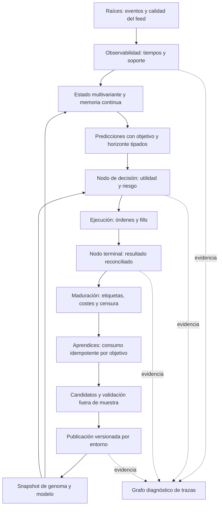

# Auditoría científica II: observabilidad, objetivos probabilísticos y evolución del campo temporal

Fecha: 24 de septiembre de 2026. Revisión de teoría, algoritmos, conexiones y contratos; sin modificaciones del código operativo.

## 1. Dictamen y relación con las auditorías anteriores

Esta adenda amplía, no sustituye, la [primera auditoría de fundamentos](</C:/Users/jhona/Documents/Proyectos/Trader Gemini/docs/AUDITORIA_FUNDAMENTOS_CIENTIFICOS_2026-09-24.md>) y la [auditoría CES](</C:/Users/jhona/Documents/Proyectos/Trader Gemini/docs/AUDITORIA_CONTINUIDAD_ESPECTRAL_2026-09-24.md>). Registra **20 hallazgos o limitaciones adicionales, FMT-027 a FMT-046**. Los identificadores son unidades de documentación: no equivalen a veinte incidentes de producción observados ni a veinte descubrimientos necesariamente inéditos frente a todo el archivo histórico. Las conexiones con defectos anteriores se explicitan.

La carencia principal no es una lista insuficiente de teorías avanzadas. Es la ausencia de contratos suficientemente fuertes para distinguir observación, estimación, probabilidad, decisión, ejecución y aprendizaje. Una fórmula puede ser correcta y recibir otra variable; un gen puede mutar sin modificar el estimador pertinente; un modelo puede aprender correctamente una etiqueta que no responde a la pregunta que se le hace en ejecución.

El paradigma objetivo sigue siendo un **campo multivariante continuo condicionado por activo, canal, escala y contexto**, con aproximaciones finitas cuyo error se mida. No se propone volver a separar motores por scalping/swing. Las etiquetas heredadas que aparecen en citas son evidencia del repositorio, no categorías recomendadas.

### Corte, severidad y limitaciones

HEAD observado al inicio y al cierre de la investigación: `59a76de4`. El árbol de trabajo contiene modificaciones concurrentes ajenas, incluidos núcleo, riesgo, genomas y backtest. Los enlaces apuntan a archivos vivos y sus líneas pueden desplazarse. El manifiesto al final identifica el contenido leído de archivos completos; no constituye un snapshot de todo el producto.

**P1:** riesgo alto de aprendizaje, decisión, selección o disponibilidad bajo las condiciones descritas. **P2:** limitación científica, de diagnóstico o de API sin impacto operativo demostrado. Se distinguen evidencia estática, contraejemplo algebraico y observación de ejecución. En esta ronda no se operó, promovió ningún genoma, reinició ningún motor ni midió rentabilidad. No se implementaron las reparaciones propuestas.

## 2. Matriz de esta ampliación

| ID | Prioridad | Hallazgo | Alcance comprobado |
|---|---|---|---|
| FMT-027 | P1 | La etiqueta neutral se convierte en negativa y sí entrena | Ruta de klines del núcleo |
| FMT-028 | P1 | Se mezclan primer paso por barreras, dirección de vela y beneficio neto | Entrenador → ensamble → cierre |
| FMT-029 | P1 | Un cierre actualiza dos veces la política con estados distintos | Dos llamadas en el mismo bloque |
| FMT-030 | P1 | Newton del calibrador puede divergir; cero calibrado se confunde con ausencia | Réplica numérica y consumidor de riesgo |
| FMT-031 | P1 | Un diagnóstico del ensamble penaliza exclusivamente a la red | Combinación y telemetría de pesos |
| FMT-032 | P2 | El z de habilidad no acredita una garantía secuencial del 95 % | Supuestos de inferencia no verificados |
| FMT-033 | P2 | La reversión OU se fuerza positiva y no tiene reloj físico | API multiactivo sin consumidor vivo localizado |
| FMT-034 | P2 | El rechazo de saltos OU puede dejar el estimador permanentemente bloqueado | Contraejemplo de estado absorbente |
| FMT-035 | P1 | La ruta denominada Johansen/VECM consume un proxy distinto | Conexión viva del registro |
| FMT-036 | P1 | Lead–lag no estima retraso ni caducidad; otro orquestador remuestrea pares inmóviles | Ruta viva y API auxiliar diferenciadas |
| FMT-037 | P1 | El contrato del bosque no valida estructura acíclica ni semántica del modelo | Frontera de carga e inferencia |
| FMT-038 | P2 | Inicialización “ortogonal” de rango máximo dos y cuantización con otro dominio | Red auxiliar; uso vivo no localizado |
| FMT-039 | P2 | El Kalman diagonal replica una innovación escalar por canal | Aprendizaje diagnóstico, sin retorno al predictor servido |
| FMT-040 | P1 | Las curvas de stop decrecientes producen una banda operable incorrecta | Genoma y validación de promoción |
| FMT-041 | P1 | Un presupuesto de fricción se presenta como imposibilidad matemática | Definición y gate operativo |
| FMT-042 | P1 | Persistencia y linaje no cumplen todas sus garantías de atomicidad/inmutabilidad | Almacén genómico; APIs auxiliares |
| FMT-043 | P2 | El grafo de sintaxis no resuelve la conectividad causal del sistema | Diagnóstico, no motor de ejecución |
| FMT-044 | P1 | Kelly combina un PF histórico con una probabilidad de otra población | Matriz de apalancamiento |
| FMT-045 | P2 | Garman–Klass acepta OHLC imposibles y convierte el fallo en volatilidad mínima | API sin ruta viva localizada |
| FMT-046 | P2 | La correlación con una cesta que incluye al activo no es matriz de dependencia | API de correlación y tratamiento de faltantes |

Todos quedan **abiertos en esta adenda**. “Abierto” no afirma que todas las APIs estén desplegadas; significa que no se corrigió ni cerró el contrato descrito.

## 3. Hallazgos detallados

### FMT-027 — Un neutral se aprende como resultado negativo

**Evidencia:** [núcleo, generación de etiquetas](</C:/Users/jhona/Documents/Proyectos/Trader Gemini/crates/god-engine-core/src/lib.rs:620>). Si el retorno de la vela no supera ninguna de las dos barreras, la rama comentada como “neutro, DESCARTAR” devuelve `0.5_f64.signum() * 0.0`. Esa expresión vale cero. Inmediatamente después, `if y == 0.0 || y == 1.0` admite el resultado y llama a `update_with_outcome`.

**Mecanismo:** las velas planas, alcistas pequeñas y bajistas pequeñas se convierten en la misma clase negativa. No existe un salto de control que las descarte. Es un error de lógica verificable independientemente de cualquier teoría financiera: `sign(0.5) × 0 = 0`, y cero satisface la condición de entrenamiento.

**Consecuencia:** el ensamble puede aprender una tasa negativa dominada por la frecuencia de velas sin resolución. Además, el resultado actualiza pesos y el estadístico de habilidad; el problema no se limita al contador de velas. No se cuantificó cuántas observaciones reales quedaron afectadas.

**Contrato requerido:** resultado tipado `Resolved(outcome)` / `Unresolved` / `Invalid`, con avance explícito del reloj y cierre del registro de predicciones en los tres casos. Cambiar solamente cero por otro número no resuelve por sí solo la vida de predicciones pendientes. La regresión debe comprobar ausencia de actualización para retornos interiores a las barreras y correcta rotación del estado de la vela.

### FMT-028 — Los modelos y sus jueces no responden a la misma pregunta probabilística

**Evidencia:** [etiquetado del bosque](</C:/Users/jhona/Documents/Proyectos/Trader Gemini/src/bin/train_forest.rs:488>) busca el primer toque de TP largo +0,36 % o SL largo −0,18 % antes de un deadline y descarta timeouts. El [núcleo](</C:/Users/jhona/Documents/Proyectos/Trader Gemini/crates/god-engine-core/src/lib.rs:611>) lo aproxima con el retorno entre cierres y un umbral derivado de `sl_at_tau(30_000)`. El [feedback de trades del ensamble](</C:/Users/jhona/Documents/Proyectos/Trader Gemini/crates/god-engine-core/src/ensemble.rs:246>) convierte beneficio neto y dirección de la posición en una etiqueta alcista/bajista.

**Diferencias:** tocar una barrera depende del camino, no solamente del precio final. Una trayectoria que toca primero +0,36 % y vuelve al origen tiene etiqueta positiva de entrenamiento y no supera la barrera entre cierres. Si se descartan timeouts, el clasificador aproxima una probabilidad condicionada a resolución: `P(TP primero | X, resolución antes de H)`, no necesariamente `P(TP antes de H | X)` ni `P(retorno > 0 | X)`.

Tampoco `1−p` es automáticamente probabilidad de éxito de un corto con su propio TP/SL: llegar primero al SL de un largo con barreras asimétricas no es el evento espejo de alcanzar el TP del corto. Un largo que sube 4 bps y paga 10 bps pierde 6 bps netos; su dirección de precio fue alcista aunque `is_win` sea falso. Este último problema profundiza CES-011, no se presenta como descubrimiento independiente.

**Contrato requerido:** cada predicción debe declarar objetivo, lado, barreras, horizonte, costes, condición de resolución y política de censura. Dos modelos solo pueden promediarse como probabilidades si estiman el mismo evento. Debe conservarse la masa de timeout o modelarla aparte; los modelos de primer paso y riesgos competitivos de la sección 5 permiten hacerlo sin separar motores temporales.

### FMT-029 — El mismo cierre actualiza dos veces la política

**Evidencia:** dentro del bloque de cierre del [núcleo](</C:/Users/jhona/Documents/Proyectos/Trader Gemini/crates/god-engine-core/src/lib.rs:1700>) hay una llamada a `ppo_engine.update_policy` con `[OFI, OBI, VPIN, 0, a_t]`. Más adelante, [en el mismo bloque](</C:/Users/jhona/Documents/Proyectos/Trader Gemini/crates/god-engine-core/src/lib.rs:1950>), aparece otra llamada con `ppo_close_features`, compuestas con otras normalizaciones y otra semántica. No hay una exclusión mutua entre ambas llamadas en el tramo inspeccionado.

**Mecanismo:** un desenlace genera dos actualizaciones consecutivas del mismo estado adaptativo. La recompensa se divide primero por `(entry × qty).max(1e−8)` y después por `(entry × qty).max(1)`: incluso su normalización difiere para nocionales inferiores a uno. Para nocionales habituales puede coincidir el reward, pero siguen existiendo dos aprendizajes sobre features distintos.

**Consecuencia:** la tasa efectiva de adaptación y el crédito por canal no corresponden al número de trades. Una explicación basada únicamente en FMT-005 —desajuste de features— es incompleta: también hay duplicidad. CES-010 permanece relevante porque el ensamble, por su parte, usa predicciones recientes al cerrar y no las de entrada.

**Contrato requerido:** identificador único de decisión/ejecución/resultado y consumo idempotente por cada aprendiz. Un cierre puede alimentar varios objetivos legítimos, pero debe hacerlo en estados separados y con etiquetas declaradas. La prueba debe contar actualizaciones por ID, no limitarse a comprobar que algún peso cambió.

### FMT-030 — El calibrador puede terminar en saturación numérica y el consumidor pierde el significado de cero

**Evidencia:** [PlattCalibrator::fit](</C:/Users/jhona/Documents/Proyectos/Trader Gemini/crates/god-engine-core/src/calibration.rs:118>) ejecuta hasta 50 pasos Newton, aplica `a = max(0, a−da)` y `b -= db`, sin búsqueda de paso, comprobación de descenso del objetivo ni condición KKT para la frontera `a=0`. Solo exige coeficientes finitos para publicarlos.

**Contraejemplo independiente:** se reprodujo la ecuación en doble precisión, actualizando secuencialmente desde `(a,b)=(1,0)`. Tras 200 observaciones alternadas `(score=0,55, win=true)` y `(0,90,false)`, la réplica produjo aproximadamente `a=240774`, `b=1027851`, con probabilidades saturadas en 1 para ambos scores. Cambiando la pareja a `(0,60,true)/(0,95,false)` produjo `a=0`, `b≈−1008643` y probabilidades cero. Son puntuaciones válidas y una secuencia en la que la restricción monotónica debería conducir a un ajuste esencialmente constante, no a certeza. Un candidato constante basado en los pseudo-datos da alrededor de 0,50424 y 0,50518, respectivamente, antes del pequeño ridge.

Esta es una **réplica algebraico-numérica, no un nuevo test Rust ni una observación de producción**. Su cometido es especificar una regresión adversarial. Los tests existentes sí pasan, pero prueban principalmente puntuaciones constantes, orden informativo y ausencia de información, no estas trayectorias antimonotónicas.

**Conexión de riesgo:** [la matriz de apalancamiento](</C:/Users/jhona/Documents/Proyectos/Trader Gemini/crates/risk-engine/src/leverage_matrix.rs:100>) usa la calibración solo si `win_probability > 0`; un cero legítimo o por saturación recupera la confianza cruda. `0` mezcla valor con ausencia. Probabilidades positivas pequeñas, además, se elevan a 0,1 en ese cálculo. No se afirma que ello implique una orden: quedan otros controles.

**Cierre requerido:** optimización convexa restringida con descenso verificable, chequeo de convergencia/frontera, fallback explícito con estado de validez y representación opcional de la probabilidad. También hay que revisar la afirmación de que el ridge solo actúa en direcciones no identificadas: el código regulariza ambas coordenadas en todos los casos. La literatura de [calibración de Guo et al.](https://arxiv.org/abs/1706.04599) respalda evaluar calibración, no asumir que una salida sigmoid ya la garantiza.

### FMT-031 — Se atribuye a una red el error del ensamble completo

**Evidencia:** [ModelEnsemble::combine](</C:/Users/jhona/Documents/Proyectos/Trader Gemini/crates/god-engine-core/src/ensemble.rs:192>) lee `self.skill.z()`, que mide la combinación, y si es negativo reduce únicamente el log-peso de `DarkAlphaNN`. El comentario lo presenta como evidencia adversa del modelo secundario, pero `SkillTracker` no mide su habilidad individual.

**Problema causal:** si el bosque es peor que la red y domina la mezcla, el ensamble puede tener habilidad negativa por culpa del bosque. Penalizar siempre a la red empeora la mezcla. Por ejemplo, con probabilidades 0,1 y 0,7 frente a un evento cuya frecuencia es 0,8, reducir el segundo peso no se justifica por observar mal rendimiento del promedio. El identificador del modelo adquiere una preferencia fija que no procede de sus pérdidas individuales.

**Diagnóstico incompleto:** `weights()` publica softmax de los log-pesos almacenados, mientras `combine()` aplica adicionalmente la penalización asimétrica. La telemetría no representa los pesos efectivos servidos cuando esa rama se activa. El comentario posterior del núcleo que conserva `SkillTracker` “solo como telemetría” no describe este consumidor indirecto dentro de la combinación.

**Cierre requerido:** pérdidas y referencias por experto, ablation del modelo, pesos efectivos publicados y prueba de permutación: intercambiar IDs junto con todo su estado histórico debe intercambiar resultados, no favorecer por nombre. Cualquier prior de confianza distinto debe estar versionado y justificado como prior, no como diagnóstico empírico.

### FMT-032 — El umbral z no constituye certificación de habilidad al 95 %

**Evidencia:** [SkillTracker](</C:/Users/jhona/Documents/Proyectos/Trader Gemini/crates/god-engine-core/src/ensemble.rs:88>) calcula `n_eff=(2−alpha)/alpha`, divide la desviación del diferencial de Brier por `sqrt(n_eff)` y compara con Z95. La EMA macro fija el span en 720 barras.

**Supuesto omitido:** esa equivalencia de varianza para pesos exponenciales corresponde a observaciones independientes y a una idealización estacionaria de los pesos. Los diferenciales de pérdidas pueden tener dependencia temporal, cambios de modelo, labels solapados y selección. Con autocorrelación AR(1) hipotética `rho=0,8`, pesos geométricos `q=1−alpha`, la varianza de la media estacionaria aumenta por `(1+q*rho)/(1−q*rho)≈8,8903`. El tamaño efectivo ilustrativo pasa de 720 a aproximadamente 80,99; el z ingenuo se infla por 2,98. No se estimó ese rho en mercado: es un contraejemplo a una garantía universal.

Además, mirar repetidamente un umbral de un test de tiempo fijo no controla por sí solo la probabilidad de algún falso positivo durante toda la operación. La corrección necesaria depende del objetivo: descripción local, contraste al cierre de un experimento o inferencia anytime-valid son contratos diferentes.

**Cierre requerido:** diagnosticar dependencia, evaluar incertidumbre por bloques o un modelo de covarianza apropiado y definir un protocolo secuencial antes de anunciar significación. La [teoría de secuencias de confianza](https://arxiv.org/abs/1810.08240) ofrece herramientas bajo supuestos explícitos; no convierte automáticamente esta EMA en una de ellas. FMT-031 demuestra que el diagnóstico todavía puede alterar una predicción servida.

### FMT-033 — La velocidad OU se fuerza positiva y carece de unidad temporal identificable

**Evidencia:** [MultivariateCointegrationEngine](</C:/Users/jhona/Documents/Proyectos/Trader Gemini/crates/strategy-core/src/multivariate_coint.rs:59>) ignora `_timestamp_ms`. Estima `instantaneous_theta = clamp(−Δspread/(spread_previo−media_actualizada), 0.01, 2)`, aplica una EMA de esa razón y calcula `ln(2)/theta`, recortado a 1–100 periodos para decidir.

**Problema estadístico:** estimar una regresión mediante el promedio de razones puntuales no equivale a estimar su coeficiente; los denominadores pequeños vuelven la razón inestable. Recortar todo resultado a positivo impide representar evidencia de no reversión o comportamiento explosivo. También se utiliza una media que ya incorporó la observación del paso actual. Los pesos de la cesta son suministrados, no se identifica aquí un rango de cointegración ni se prueba estacionariedad del spread.

**Problema de reloj:** repetir la misma secuencia a intervalos de 1 ms o de un día entrega la misma vida media en “periodos”. Para un OU, la transición contiene `phi(Δt)=exp(−kappa*Δt)`. Incluso en muestreo regular, una pendiente discreta `theta_d=1−phi` exige `kappa=−ln(1−theta_d)/Δt`, no simplemente `kappa=theta_d`. Valores `theta_d≥1` no corresponden a ese OU escalar con kappa real positiva.

**Alcance y cierre:** no se localizó consumidor operativo de este motor fuera de exports/tests; es deuda de capacidad, no causa atribuida a trades vivos. Debe validarse con OU simulado, paseo aleatorio y proceso explosivo, a relojes irregulares y bajo ruido de observación. La [estimación OU con datos irregulares y microestructura](https://arxiv.org/abs/1811.09312) proporciona una referencia concreta y también documenta limitaciones ante saltos.

### FMT-034 — El filtro de saltos puede bloquear permanentemente el estimador

**Evidencia:** [rechazo de outliers del spread](</C:/Users/jhona/Documents/Proyectos/Trader Gemini/crates/strategy-core/src/multivariate_coint.rs:85>). Si el salto frente a `last_spread` supera `max(10*sqrt(var),1.5)`, la función devuelve `None` antes de actualizar último spread, media y varianza, pero después de incrementar `count`.

**Contraejemplo:** con pesos `[1,0,0,0]`, cien observaciones de precios `[1,1,1,1]` dejan spread cero y varianza cercana a `1,35326e−5`. Un cambio permanente del primer precio a `exp(2)` produce spread 2. La primera observación se rechaza; las siguientes cien, idénticas y válidas, también: cada una se compara contra el mismo cero congelado. La réplica de la ecuación aceptó cero de cien observaciones posteriores, mientras el contador aumentó.

**Consecuencia:** el filtro distingue magnitud, pero no distingue corrupción transitoria de cambio de régimen. Se crea un estado absorbente sin revalidación ni vía de resincronización. La frontera de 1,5 unidades de spread logarítmico tampoco tiene el mismo significado al reescalar los pesos del portafolio.

**Cierre requerido:** cuarentena con trazabilidad, contraste entre fuentes y mecanismo explícito para aceptar un nuevo régimen, conservar una última observación válida o reinicializar con incertidumbre. No basta subir el umbral. La prueba debe mostrar recuperación tras un desplazamiento permanente y rechazo de un único dato corrupto, sin inflar el tamaño muestral aceptado. Alcance API, como FMT-033.

### FMT-035 — Johansen/VECM es una etiqueta que no corresponde a su productor vivo

**Evidencia:** [JohansenVecmEngine](</C:/Users/jhona/Documents/Proyectos/Trader Gemini/crates/strategy-core/src/vecm_arbitrage.rs:49>) calcula un spread bivariado con beta suministrado, media/varianza adaptativas y score. No implementa selección de rango de Johansen, matriz de corrección de error ni dinámica multivariante de diferencias. La variante “RLS” usa una ganancia con 0,001 fijo, sin mantener la covarianza recursiva del regresor ni intercepto.

La [ruta registrada en el núcleo](</C:/Users/jhona/Documents/Proyectos/Trader Gemini/crates/god-engine-core/src/lib.rs:2517>) publica como `vecm_zscore` la diferencia spot–futuros dividida por `mid*ATR`, o distancia a EMA si falta spot. `cointegration_zscore` recibe momentum del líder. El evaluador lee esos nombres; registrar el objeto no llama a su actualización estadística. Las búsquedas no localizaron llamadas externas a `update_with_adaptive_beta` fuera de sus tests.

**Consecuencia:** el score puede ser una feature útil de basis/reversión, pero no acredita equilibrio de cointegración. El fallback cambia el objeto económico estimado sin cambiar la identidad del campo. La regresión sin intercepto en log-precios, además, permite que un cambio de unidades de cotización altere la beta aprendida en lugar de absorberse en una constante.

**Cierre requerido:** conservar el proxy como baseline identificado; si se implementa VECM, especificar vector de activos, integración, rango, términos deterministas, lag, residual y diagnóstico de estabilidad. Verificar que el productor identificado alimenta al consumidor real. La literatura [CVAR con innovaciones no gaussianas](https://arxiv.org/abs/1008.0149) es una extensión investigable, no una justificación retroactiva del proxy.

### FMT-036 — Lead–lag sin tiempo ni caducidad, y remuestreo de pares sin nueva información

**Ruta viva:** [LeadLagAlphaEngine](</C:/Users/jhona/Documents/Proyectos/Trader Gemini/crates/feature-engine/src/lead_lag.rs:57>) combina el último OFI y su EMA, con pesos BTC/ETH 60/40 y umbrales de magnitud. No recibe timestamp, no estima una distribución de retrasos ni mantiene edad de las observaciones. El [núcleo sí lo consume](</C:/Users/jhona/Documents/Proyectos/Trader Gemini/crates/god-engine-core/src/lib.rs:963>). Si el feed del líder queda inmóvil, su impulso permanece disponible sin caducidad propia; el módulo no puede distinguir un impulso fresco de uno antiguo. La existencia de guardas globales no demuestra frescura de cada líder.

**API auxiliar:** [MultiAssetOrchestrator](</C:/Users/jhona/Documents/Proyectos/Trader Gemini/src/multi_asset_orchestrator.rs:116>) actualiza el estimador BTC/ETH siempre que ambos precios existen, incluso cuando `on_tick` recibe un símbolo distinto que no cambia ninguno. Así, ticks ajenos pueden llenar su ventana de 100 observaciones con el mismo par. No se localizó instanciación operativa fuera de sus tests; se separa de la ruta viva anterior.

**Cierre requerido:** timestamps de evento y recepción por fuente, edad/incertidumbre, condición de observación nueva, estimación causal del lag y prueba de desconexión parcial. La [estimación de lead–lag con datos no síncronos](https://arxiv.org/abs/1303.4871) y la [covariación con ruido y saltos](https://arxiv.org/abs/1302.5202) son familias pertinentes. “Antes que el mercado en nanosegundos” requiere medir el adelanto respecto a disponibilidad y latencia de ejecución, no inferirlo del coste de una suma.

### FMT-037 — Un bosque puede superar la validación dimensional y no terminar de inferir

**Evidencia:** [validate_dim_contract](</C:/Users/jhona/Documents/Proyectos/Trader Gemini/crates/god-engine-core/src/ml_inference.rs:69>) comprueba el máximo índice de feature. [evaluate_tree](</C:/Users/jhona/Documents/Proyectos/Trader Gemini/crates/god-engine-core/src/ml_inference.rs:192>) sigue índices de hijos en un `loop` sin límite de profundidad o nodos visitados. Las guardas de índices evitan ciertos accesos fuera de rango, no los ciclos.

**Contraejemplo estructural, no ejecutado para evitar un bloqueo:** `children_left=[0]`, `children_right=[−1]`, `feature=[0]`, `threshold=[0]`, `value=[0]`, `tree_offsets=[0,1]`, `init_score=0` satisface la comprobación dimensional. Con feature cero, el nodo vuelve a sí mismo indefinidamente. Un fichero accidentalmente corrupto puede bloquear la ruta de decisión aunque todos sus números sean finitos.

**Contrato semántico insuficiente:** el objeto serializado tampoco exige identificador/hash del esquema de features, objetivo, horizonte, versión de normalización o entrenamiento. Dos modelos de 48 dimensiones pueden asignar significados incompatibles al mismo índice. Ser dimensionalmente admisible no prueba paridad train/serve.

**Cierre requerido:** validación completa de árboles, arrays, offsets, hojas, finitud y aciclicidad; presupuesto defensivo de inferencia; manifiesto del modelo enlazado a esquema y target. Rechazo antes de activar/cachar. La prueba de ciclo debe ejecutarse solo en un harness con timeout o comprobar el rechazo al cargar; no en un motor con posiciones abiertas. No se encontró ni se afirma que haya actualmente un artefacto cargado con este ciclo.

### FMT-038 — La inicialización neuronal no es ortogonal y la ruta cuantizada cambia el dominio

**Evidencia:** [SimdNeuralNet::default](</C:/Users/jhona/Documents/Proyectos/Trader Gemini/crates/feature-engine/src/simd_neural_network.rs:19>) inicializa `W[i,j]=0.2425*sin(17*i+31*j+7)` y lo describe como He/Xavier ortogonal. Por la identidad `sin(A+B)=sin(A)cos(B)+cos(A)sin(B)`, esa matriz 34×16 es suma de dos productos exteriores: **su rango es como máximo dos** en aritmética exacta. No puede tener dieciséis columnas ortogonales no nulas. La verificación numérica dio error de identidad ≤5,6e−17 y producto escalar no diagonal máximo cercano a 1,00033.

Esto no prueba que toda la red no lineal tenga rango dos ni que no pueda aprender: las activaciones y actualizaciones posteriores pueden ampliar su expresividad. Sí refuta la propiedad de inicialización declarada y limita las proyecciones de entrada inicialmente independientes.

La [inferencia cuantizada](</C:/Users/jhona/Documents/Proyectos/Trader Gemini/crates/feature-engine/src/simd_neural_network.rs:188>) trunca entradas a ±10; la inferencia y entrenamiento flotantes usan ±100. No es solamente error de redondeo. Por ejemplo, un canal de valor 50 cambia a 10 antes de multiplicar. No hay prueba de error relativo al modelo flotante ni escala aprendida por canal.

**Alcance:** el núcleo crea esta red en `StatefulFeatureEngine`, con wrappers de inferencia/entrenamiento, pero no se localizaron consumidores externos de esos wrappers ni de la ruta cuantizada en las búsquedas de `crates`/`src`. No se confunde con DarkAlpha, que sí tiene ruta viva. **Cierre:** test de rango/Gram si se promete ortogonalidad, inicialización con contrato reproducible y validación de cuantización sobre el dominio real antes de conectarla.

### FMT-039 — La aproximación diagonal de Kalman usa un denominador escalar distinto para cada feature

**Evidencia:** [OnlineLearningModule](</C:/Users/jhona/Documents/Proyectos/Trader Gemini/crates/metacortex-engine/src/online_learning.rs:135>) calcula `K_i=P_i*x_i/(P_i*x_i²+R)` y aplica a todos los canales la misma innovación. Para la observación escalar `y=xᵀw+epsilon`, aun aproximando P por diagonal, el denominador de la ganancia es compartido: `S=R+sum_j(P_j*x_j²)`.

**Contraejemplo:** dos features idénticas iguales a uno, P diagonal identidad, R=0,01 e innovación 1. El paso correcto produce incremento de predicción `2/2,01≈0,995`. Las dos ganancias independientes producen `2/1,01≈1,980`, antes de momentum y factores adicionales. Replicar una columna no debería duplicar arbitrariamente el crédito de una única observación. El momentum modifica más la dinámica y no conserva automáticamente la interpretación probabilística de P.

El campo `learning_rate` se acepta y almacena, pero no interviene en esta actualización. Mutarlo no controla la tasa de este algoritmo. La volatilidad y un campo denominado caos modulan R sin una especificación de unidades del residual. Esto explica por qué cambiar el nombre a “Kalman tensorial” no cierra la estabilidad.

**Alcance y cierre:** el [núcleo actualiza este módulo](</C:/Users/jhona/Documents/Proyectos/Trader Gemini/crates/god-engine-core/src/lib.rs:1975>), pero `compose_ml_prob` excluye su residuo por problemas anteriores documentados en D-693. No se le atribuye contaminación directa de la probabilidad servida por esa vía. Se requiere un RLS/Kalman vectorial definido, pérdida explícita, persistencia y consumidor validado; pruebas de columnas duplicadas, rotación/escala y convergencia con datos correlacionados antes de reconectarlo.

### FMT-040 — La banda operable omite el extremo superior cuando el stop decrece con la escala

**Evidencia:** [min_tradeable_tau_ms y tradeable_band_ms](</C:/Users/jhona/Documents/Proyectos/Trader Gemini/crates/quantum-arena/src/genome.rs:2439>) resuelven el umbral de SL. Para pendiente negativa, devuelven el mínimo espectral si el stop allí satisface el piso; posteriormente la banda termina siempre en el máximo del espectro. Las [cotas genómicas](</C:/Users/jhona/Documents/Proyectos/Trader Gemini/crates/quantum-arena/src/genome.rs:2050>) permiten pendientes de −0,2 a 0,35.

**Derivación correcta bajo la política existente:** si `SL(tau)=exp(a)*tau^b` y `b<0`, la condición `SL≥SL_min` define `tau≤exp((ln SL_min−a)/b)`. Es una cota superior, no ausencia de restricción. Con `a=−4`, `b=−0,1`, fee=0,001 y presupuesto 0,65, el corte es aproximadamente `5,71945e10 ms` (1,81 años). El extremo 146 años devuelve SL≈0,000991827, por debajo del piso≈0,00153846, pero queda incluido en la banda.

**Consecuencia:** la validación y reparación pueden operar sobre un dominio falsamente ampliado, y los consumidores de banda reciben una garantía que no se cumple. No se demuestra con esto que un genoma concreto esté abriendo operaciones seculares: las rutas de decisión conservan otros recortes temporales.

**Cierre requerido:** resolver ambos extremos según el signo de b, incluir curvas planas y bandas vacías, y comprobar todo extremo contra la definición original. Separar esta corrección algebraica de la decisión normativa sobre cuál debería ser el presupuesto de fricción.

### FMT-041 — Un presupuesto de costes se anuncia como condición necesaria de rentabilidad

**Evidencia:** [min_viable_sl](</C:/Users/jhona/Documents/Proyectos/Trader Gemini/crates/quantum-arena/src/genome.rs:2390>) deriva `SL_min=fee/0.65` de una fracción máxima elegida de coste sobre riesgo. El comentario afirma que por debajo no existe operación rentable posible. El [gate operativo](</C:/Users/jhona/Documents/Proyectos/Trader Gemini/crates/risk-engine/src/lib.rs:610>) trata `below_tradeable_floor` como inviabilidad matemática del EV.

**Contraejemplo:** con p=0,4, TP=0,004, SL=0,0001 y fee=0,001, la expectativa binaria es `p*TP−(1−p)*SL−fee=0,00054`, positiva aunque SL sea inferior a `fee/0,65`. Esto no acredita que ese proceso ni ese fill sean alcanzables en un mercado real: demuestra que el piso no se deduce como condición necesaria de esa ecuación de EV. La factibilidad exige modelar probabilidad de toque, costes, liquidez y tiempo, no sustituirla por el cociente coste/stop.

Además, `WORST_TOLERATED_WR=0.40` es un parámetro de diseño, no una cota inferida válida en todos los estados. Aumentar el TP altera generalmente la probabilidad de alcanzarlo antes del SL; no puede preservarse p por definición y declarar creado un edge.

**Cierre requerido:** conservar la protección mientras se valida una alternativa, pero identificarla honestamente como política de presupuesto de fricción y medir rechazos/beneficio contrafactual en shadow. No se recomienda quitar controles ni habilitar trading submilisegundo a partir de este contraejemplo. La rigidez puede ser prudente; lo defectuoso es presentarla como teorema universal.

### FMT-042 — El linaje evolutivo no es todavía una transacción verificable

**Evidencia principal:** [GenomeEnvelope::promote](</C:/Users/jhona/Documents/Proyectos/Trader Gemini/crates/quantum-arena/src/genome_store.rs:293>) lee la generación activa y asigna `parent+1` sin exclusión entre escritores. [atomic_write](</C:/Users/jhona/Documents/Proyectos/Trader Gemini/crates/quantum-arena/src/genome_store.rs:392>) usa un temporal fijo, elimina el destino existente y luego renombra. Hay una ventana sin destino; un fallo entre eliminación y rename deja al lector sin active. Dos promotores pueden elegir la misma generación y competir por el mismo `.tmp` y nombre histórico. El helper permite reemplazar la historia que se declara inmutable.

**Carga:** [load_active](</C:/Users/jhona/Documents/Proyectos/Trader Gemini/crates/quantum-arena/src/genome_store.rs:140>) devuelve lo que deserializa sin contrastar `schema_version` ni ejecutar `validate`. La validación de promoción no cubre un archivo sustituido por otra ruta. Existe separación explícita de entornos y autorización para cruzarlos, que debe conservarse; no se afirma que esa defensa haya desaparecido.

**APIs auxiliares revisadas:** [AdnBackupCatalog](</C:/Users/jhona/Documents/Proyectos/Trader Gemini/crates/metacortex-engine/src/reminiscence_and_adn.rs:30>) también sobrescribe por `gen_id` y archiva un `code_hash` suministrado sin comprobarlo contra el código. [init_epigenoma_gene](</C:/Users/jhona/Documents/Proyectos/Trader Gemini/crates/metacortex-engine/src/epigenoma_store.rs:123>) hace check-then-store de `initialized`: un init que leyó false puede sobrescribir un `set` concurrente posterior. No se localizaron consumidores productivos de esas dos capacidades auxiliares; son defectos de sus contratos, no incidentes atribuidos.

**Relevancia científica:** sin identificar qué modelo, genoma y estado estaba activo para cada decisión no se puede atribuir fitness ni reproducir la supuesta evolución. **Cierre:** escritor serializado o control de concurrencia optimista, archivos históricos create-only, publicación transaccional probada en Windows, manifiesto con hashes y validación de esquema al leer. Pruebas de fallo inyectado y concurrencia en directorios temporales aislados; nunca sobre genomas activos.

### FMT-043 — El grafo diagnóstico no demuestra conectividad del sistema vivo

**Evidencia:** [graph-architecture](</C:/Users/jhona/Documents/Proyectos/Trader Gemini/crates/graph-architecture/src/lib.rs:90>) resuelve toda llamada mediante el último segmento y `current_module`. Una llamada `other::f()` se registra como si perteneciera al módulo llamador. Los métodos se registran como targets, pero el visitante no define nodos/frame de función mediante `visit_impl_item_fn`; una arista puede apuntar a un método sin nodo y partir del módulo. `is_orphan` se calcula contando estas aristas sintácticas.

El [otro extractor](</C:/Users/jhona/Documents/Proyectos/Trader Gemini/crates/graph-4d/src/lib.rs:31>) utiliza solamente `file_stem` para identificar el módulo: archivos `lib.rs` de distintos crates comparten identidad. Extrae declaraciones/contención y deja `use` sin procesar. Los campos de latencia del primer grafo se inicializan a cero; cero no es una medición de latencia.

**Consecuencia:** puede haber falsos nodos huérfanos, falsos enlaces y omisiones en dispatch por traits, imports y registros. Un diagrama visualmente conectado no acredita propagación de features, pesos, timestamps ni resultados. Tampoco una arista ausente prueba que una función esté muerta. No se extiende esta conclusión automáticamente a `graphify-out`, que utiliza otro pipeline no auditado aquí.

**Cierre requerido:** separar grafo sintáctico, grafo de símbolos resueltos y grafo de trazas de ejecución. Usar identidad crate/module/type/function, registrar edges no resueltos, cubrir traits/macros y versionar el build. Superponer en runtime IDs de evento, genoma/modelo y latencias medidas, con cobertura explícita y ausencia de datos distinta de cero.

### FMT-044 — La identidad Kelly–PF deja de ser exacta al mezclar probabilidades de poblaciones distintas

**Evidencia:** [QuantumLeverageMatrix](</C:/Users/jhona/Documents/Proyectos/Trader Gemini/crates/risk-engine/src/leverage_matrix.rs:104>) mezcla 70 % de win rate histórico y 30 % de probabilidad de señal, pero mantiene el PF histórico. Aplica después `f=p*(1−1/PF)` como identidad exacta.

**Álgebra:** la identidad procede de `PF=p*b/(1−p)`, donde b es el pago medio ganador dividido por la pérdida media. Es exacta solo cuando p y PF corresponden al mismo modelo de pagos/población. Si se cambia p por una estimación condicional y se conserva PF, se está cambiando implícitamente b sin declararlo.

**Contraejemplo:** histórico `p_h=0,8`, `PF_h=2` implica b=0,5. Una señal con p=0,1 produce p fusionada=0,59. Si el ratio de pagos continúa siendo 0,5, Kelly crudo es `0,59−0,41/0,5=−0,23`; la expresión implementada antes de las cotas entrega `0,59*(1−1/2)=0,295`. Los topes de ruina pueden reducir una cantidad positiva, pero no reparan esa discrepancia de signo del edge. Otros gates podrían abstenerse: no se demuestra una orden efectiva con este ejemplo.

**Cierre requerido:** estimar conjuntamente probabilidad y distribución de retorno condicional, o mantener p/PF/b de un mismo histórico cuando se utilice la identidad. Distinguir fracción de riqueza, presupuesto de pérdida y apalancamiento. Amplía FMT-014: no se trata solo de un suelo o un multiplicador, sino de la población estadística a la que pertenece cada argumento.

### FMT-045 — OHLC imposible se transforma en volatilidad casi nula

**Evidencia:** [GarmanKlassVolatilityEstimator::update](</C:/Users/jhona/Documents/Proyectos/Trader Gemini/crates/feature-engine/src/normalizer.rs:63>) valida finitud, positividad y `low≤high`, pero no `low≤open,close≤high`. Después trunca la varianza calculada a `1e−12`.

**Contraejemplo:** O=100, H=101, L=99, C=150 supera las comprobaciones, aunque C esté fuera del rango de la vela. La fórmula devuelve aproximadamente −0,0633075; con alpha=1 la API publica volatilidad `sqrt(1e−12)=1e−6`. Un fallo de datos aparece como extrema tranquilidad. Un floor numérico no es una reparación de OHLC corrupto.

La afirmación de eficiencia “8 veces” también necesita modelo y convención. La [revisión matemática de Garman–Klass](https://arxiv.org/abs/0807.3492) sitúa las eficiencias en un modelo browniano sin drift y ventanas iguales; no es una propiedad universal ante saltos, microestructura o duraciones heterogéneas. La API carece de duración para convertir la estimación por vela en varianza por unidad de tiempo.

**Alcance:** no se localizó consumidor vivo fuera de exports/tests. **Cierre:** validar consistencia completa de la vela, separar dato inválido de varianza cero, devolver estado de calidad y especificar duración/modelo. También conviene sanear alpha en el constructor: un clamp de NaN no acredita un parámetro válido. La regresión debe preservar el estado ante OHLC imposible y comprobar unidades al cambiar la duración.

### FMT-046 — Correlación con la propia cesta no equivale a dependencia entre activos

**Evidencia:** [MarketCorrelationHeatmap](</C:/Users/jhona/Documents/Proyectos/Trader Gemini/crates/feature-engine/src/correlation.rs:34>) calcula el retorno medio de todos los activos y promedia `corr(r_i, media(r))`. No produce matriz de correlaciones por pares ni beta, pese al nombre heatmap y la referencia a Market Beta. Además, acepta precios no finitos/no positivos y actualiza `last_prices` sin máscara de calidad.

**Diferencia matemática:** para n retornos independientes, de varianza idéntica, `corr(r_i, mean(r))=1/sqrt(n)` porque el activo forma parte de su propio benchmark. Con cuatro activos independientes la correlación poblacional con esa cesta es 0,5, no cero. El cálculo puede ser válido para ese objeto, pero interpretarlo como correlación media entre activos sobreestima dependencia. Beta sería `cov/var(benchmark)`, no cov dividida por dos desviaciones.

**Faltantes:** el benchmark se divide por el número configurado de activos, no por una población de observaciones sincronizadas y válidas. Saltarse una actualización no finita en cada EWMA por separado no garantiza que medias, covarianzas y precios representen el mismo conjunto de muestras.

**Cierre:** declarar el estimando, usar benchmark externo o leave-one-out si corresponde, y estimar una matriz PSD para riesgo de cartera con máscara y reloj definidos. Las técnicas de [covarianza streaming con microestructura](https://arxiv.org/abs/2003.13062) permiten estudiar el compromiso memoria/consistencia. No se localizó consumidor productivo de esta implementación; no se equipara con el `correlation_guard` ya auditado en FMT-016.

## 4. Resultados que deben conservarse y justificarse mejor

Una auditoría adversarial no debe convertir toda simplificación en un bug. Hay avances reales: `TradeHorizon` conserva una variante `Continuous`, las curvas del genoma son funciones de escala y no dos genomas separados, y el tratamiento estable de `1−exp(−Δt/τ)` mediante `expm1` evita cancelación numérica para argumentos pequeños. La interpolación y la ponderación temporal corregidas en CES son mejoras concretas. Un espacio parametrizado de manera continua puede implementarse mediante aproximación finita; eso no obliga a crear categorías operativas scalping/swing.

Sin embargo, representación y observación son contratos distintos. Expresar una escala de un nanosegundo no demuestra que el feed, el reloj, el scheduler o el modelo tengan resolución predictiva de un nanosegundo. Expresar cien años no suministra cien años de observaciones bajo un régimen comparable. Las restricciones operativas y los anclajes de actualización pendientes constan en CES-008, CES-009 y CES-015; no desaparecen por ampliar el dominio numérico de una función.

También son útiles los controles de índices del bosque, el softmax desplazado por su máximo, el cálculo centrado de varianza y la separación de almacenes por entorno. Sus contratos son parciales, no inexistentes. La exclusión explícita del residual diagnóstico de la probabilidad servida evita atribuirle un efecto predictivo que actualmente no tiene: conectarlo sin resolver FMT-039 sería una regresión, no una mejora automática.

### 4.1 La comprobación de EV en los extremos sí tiene una justificación bajo el modelo actual

Considérese una coordenada adimensional `x=ln(τ/τ₀)`, con `τ₀` fijado por la convención de unidades del genoma. Sean:

```text
TP(x) = exp(a_T + b_T x)
SL(x) = exp(a_S + b_S x)
EV(x) = p TP(x) − (1−p) SL(x) − f
```

Aquí TP, SL y f son fracciones de retorno, no importes monetarios; p es una probabilidad fija en la prueba. Para `0<p<1`, `f≥0` y curvas positivas, `EV(x)≥0` equivale a:

```text
h(x) = ln(p) + a_T + b_T x
       − ln((1−p) exp(a_S+b_S x) + f) ≥ 0
```

El último logaritmo es una función log-sum-exp convexa de x; cuando f=0 se reduce a una función afín. Por tanto h es cóncava. Para cualquier x entre dos extremos, h(x) es mayor o igual que la interpolación lineal de sus valores extremos. **Si ambos extremos tienen EV no negativa, todo el intervalo también la tiene bajo estos supuestos.** No se necesita que EV sea monótona; mencionar solamente que TP/SL es monótono no constituye la demostración adecuada.

Este resultado permite conservar una validación barata para estas dos leyes de potencia, una vez que la banda se calcule correctamente para todos los signos de b —FMT-040—. No demuestra rentabilidad futura ni que la p elegida sea conservadora. Deja de ser una certificación suficiente si p o f dependen de τ, si se introducen splines arbitrarios, si los costes incluyen otras dependencias o si se cambia la forma funcional. En esos casos deben derivarse nuevas cotas o introducir verificación adaptativa con error controlado.

### 4.2 Una restricción de riesgo puede ser deliberada sin ser una ley física

Limitar la fracción del stop consumida por costes puede ser una política razonable de robustez. Su justificación sería tolerancia a error de ejecución, incertidumbre de spread o presupuesto de drawdown. Lo que no se sostiene es convertir `SL≥fee/0,65` en condición universal necesaria de EV positiva. Preservar la política mientras se explicitan su finalidad, parámetros y límites es compatible con FMT-041. Cambiar la descripción no basta si el sistema utiliza esa premisa para excluir familias de estrategias que nunca evaluó con sus probabilidades y pagos pertinentes.

## 5. Programa científico de integración: nuevas propuestas T14–T20

Estas siete propuestas amplían T01–T13 del primer informe. **Son diseños de investigación, no funcionalidades implementadas ni ventajas demostradas para este sistema.** Cada una se asocia a un estimando, un coste y una prueba de rechazo. El número de teorías utilizadas no debe ser una métrica de progreso.

### T14 — Memoria continua mediante kernels de Volterra y representación por estados exponenciales

**Problema:** obtener memoria multiescala sin seleccionar dos estilos operativos ni recalcular un historial completo en cada evento. Una representación de escala continua necesita una aproximación computable y una medida del error; una colección creciente de ventanas fijas por sí sola no lo proporciona.

Para una clase de kernels completamente monótonos puede estudiarse la representación:

```text
K(u) = ∫ exp(−λu) μ(dλ),       u>0
K_M(u) = Σ[m=1..M] w_m exp(−λ_m u),    w_m≥0, λ_m≥0
z_m(t) = ∫[0..t] exp(−λ_m(t−s)) dX_s
dz_m = −λ_m z_m dt + dX_t
```

**Qué calcula:** cada estado conserva una memoria amortiguada del proceso de entrada; la integral sobre tasas representa un continuo de tiempos `τ=1/λ`. La suma finita aproxima el kernel, no convierte el mercado en M estilos. λ tiene unidades de tiempo inverso. Si X es log-precio, sus incrementos y estos estados son adimensionales; los pesos y la normalización deben elegirse según el observable de salida. Filtrar el nivel de precio con una EMA normalizada es otro contrato: incluye un factor λ en la entrada y no debe intercambiarse silenciosamente con esta convolución de incrementos.

**Integración propuesta:** el estado temporal se compartiría por activo/canal y recibiría timestamps físicos y eventos válidos. La malla de λ y su refinamiento se escogerían por tolerancia de aproximación, sensibilidad de la decisión y soporte observado. Se mantendrían por separado errores de truncación del kernel, cuadratura, discretización temporal, observación y estimación. Refinar M no corrige una fuente de datos sin resolución suficiente. La asignación de peso a escalas sin historia se marcaría como prior/extrapolación, no como evidencia observada.

**Fundamento y límites:** [Alfonsi y Kebaier](https://arxiv.org/abs/2102.13505) analizan aproximaciones multifactoriales de ecuaciones estocásticas de Volterra con kernels completamente monótonos y cotas bajo hipótesis concretas, incluidas condiciones sobre coeficientes. Ese resultado no garantiza que cualquier feature de mercado satisfaga sus hipótesis ni que un kernel rough tenga alpha. Los [levantamientos markovianos en espacios de Sobolev](https://arxiv.org/abs/2406.10352) y el [control de Volterra con ruido de saltos](https://arxiv.org/abs/2403.12875) son extensiones teóricas a estudiar, no argumentos para saltarse la identificación del modelo.

**Coste y rechazo:** actualización del banco independiente O(Md) para d canales; interacciones densas entre canales pueden elevarlo a O(Md²) o más. Comparar M y 2M, impulsos conocidos, trayectorias idénticas con muestreo irregular y duplicación de nodos con conservación de masa. Rechazar si la supuesta mejora procede del número de nodos y no de menor error, si aparecen decisiones dependientes del particionado o si el coste p99 excede el presupuesto. Comparar fuera de muestra contra el banco exponencial actual, no solamente contra ausencia total de memoria.

### T15 — OU irregular y cointegración como modelos identificados, no nombres de indicadores

**Problema:** FMT-033/035 mezclan una fuerza de reversión por evento, un z-score y una denominación VECM. La solución científica no es sustituir el z por una ecuación más larga, sino separar modelos y comprobar sus hipótesis.

Para un spread latente S que realmente satisfaga OU:

```text
dS_t = κ(μ−S_t)dt + σ dW_t
E[S_(t+Δ) | S_t] = μ + exp(−κΔ)(S_t−μ)
Var[S_(t+Δ) | S_t] = σ²(1−exp(−2κΔ))/(2κ)
half_life = ln(2)/κ, si κ>0
```

**Significado:** κ tiene unidades de tiempo inverso; σ, unidades de spread divididas por raíz de tiempo. La semivida es un tiempo físico. Las transiciones exactas permiten intervalos irregulares sin interpretar cada evento como un segundo. Si el spread observado contiene microestructura, introducir una ecuación de observación y su ruido; no confundir ese ruido con σ. [La estimación OU con datos de ultra-alta frecuencia](https://arxiv.org/abs/1811.09312) estudia expresamente esa distinción.

Para un vector Y no estacionario que admita cointegración, el modelo VECM es otra estructura:

```text
ΔY_t = α β'Y_(t−1) + Σ Γ_j ΔY_(t−j) + ε_t
```

β define combinaciones de equilibrio; α, velocidades de ajuste; Γ, dependencia de incrementos. La estimación del rango, tendencias deterministas, orden y diagnósticos no se reemplaza con un clamp positivo de κ. Tampoco aplicar un VECM de rejilla regular a ticks irregulares sin más es correcto. La literatura de [CVAR con innovaciones gaussianas y saltos](https://arxiv.org/abs/1008.0149) ofrece una posible extensión, no una licencia para imponer estacionariedad.

**Integración y pruebas:** conservar el z de basis como baseline correctamente nombrado; construir un modelo candidato separado, con timestamps y versión de cobertura/hedge ratio. Simular caminatas sin reversión, reversión conocida, ruido de observación y rupturas; verificar que el procedimiento pueda rechazar OU y cointegración. Medir sensibilidad a unidades y frecuencia, cobertura de intervalos, recuperación tras saltos y score predictivo. No desplegar solo porque el parámetro converge o porque existe una semivida finita: el clamp actual puede producir ambas cosas artificialmente.

### T16 — Covariación y retrasos bajo observación asíncrona

**Problema:** un promedio de impulsos BTC/ETH no estima un retraso; llevar el último precio a cada timestamp introduce una convención de interpolación que puede fabricar dependencia. Se necesita separar sincronización de datos, covariación y capacidad predictiva as-of.

Una estructura base de Hayashi–Yoshida para observaciones no síncronas es:

```text
Ĉ_XY = Σ_i Σ_j ΔX_i ΔY_j · 1{I_i ∩ J_j ≠ ∅}
```

I y J son los intervalos entre observaciones consecutivas de cada proceso. **Qué significa:** agrega productos de incrementos con soporte temporal solapado, sin exigir que los ticks lleguen simultáneamente. Si X e Y son log-precios, el resultado tiene unidades de retorno al cuadrado sobre el intervalo observado; no es directamente una correlación ni una beta.

**Integración:** para lead–lag, estudiar contrastes con intervalos desplazados y estimar el retraso junto con incertidumbre, tal como hace la [estimación no síncrona de Hoffmann, Rosenbaum y Yoshida](https://arxiv.org/abs/1303.4871). Para microestructura y saltos se requieren variantes, como [prepromediado y truncación](https://arxiv.org/abs/1302.5202); el estimador básico no resuelve automáticamente ambos problemas. La construcción de una matriz utilizable en riesgo también debe garantizar simetría y semidefinitud positiva, con [alternativas streaming](https://arxiv.org/abs/2003.13062) y su compromiso ancho de banda/memoria.

**Frontera causal:** un desplazamiento identificado en datos históricos no implica acceso oportuno a ese movimiento al decidir. Registrar tiempo de evento, recepción y disponibilidad, y hacer el replay con la información disponible antes de cada decisión. Correlación adelantada no acredita causalidad económica. Probar relojes sesgados, líder estancado, feed perdido, líder irrelevante y señales comunes de terceros. Una oportunidad desaparecida tras imponer latencia as-of debe rechazarse aunque el contraste estadístico permanezca.

**Coste:** mantener intervalos activos permite evitar productos cartesianos de todo el historial, pero el coste depende del número de solapes, activos y desplazamientos evaluados. Hay que medirlo; no declarar coste constante para una búsqueda completa de retrasos.

### T17 — Primer paso, riesgos competitivos y timeout como masa probabilística

**Problema:** un único escalar “probabilidad” actualmente cambia de significado entre entrenamiento, combinación y cierre. Para un mismo activo, lado, camino de precios y política de salida pueden definirse dos tiempos: T+ de llegada al TP y T− de llegada al SL.

```text
F+(h) = P(T+ ≤ h, T+ < T− | información disponible)
F−(h) = P(T− ≤ h, T− < T+ | información disponible)
S(h) = 1 − F+(h) − F−(h)
P(TP primero | resolución antes de h) = F+(h)/(F+(h)+F−(h))
```

La última expresión solo está definida si el denominador es positivo. Hay que definir el tratamiento de empates e incertidumbre intrabar. **Qué calcula:** F+ y F− son probabilidades acumuladas de eventos mutuamente excluyentes; S conserva la masa sin resolución. Son funciones de h, no motores separados. Una salida de bosque entrenada eliminando timeouts puede aproximar la última expresión y aun estar muy lejos de F+.

**De probabilidad a utilidad:** si TP y SL fueran pagos netos fijos, el retorno esperado incluiría `F+·pago_TP + F−·pago_SL + S·E[pago_timeout | timeout]`. En ejecución real también intervienen slippage, fills parciales, funding y política al vencer el horizonte. Aprender beneficio neto sin especificar esa política cambia el evento. La conexión con distribuciones de primer paso en [modelos OU](https://arxiv.org/abs/1811.09312) y con [optimización de pares sujeta a riesgo](https://arxiv.org/abs/2102.04160) es una ruta de investigación; las fórmulas anteriores son definiciones probabilísticas, no dependen de asumir OU.

**Integración y rechazo:** crear un vocabulario de objetivos con barreras, horizonte, unidad, lado y censura versionados. Evaluar calibración por horizonte, `F++F−≤1`, monotonicidad de cada función acumulada para barreras fijas, estabilidad ante censura y consistencia entre entrenamiento/replay/live. Si las barreras también cambian con h, no imponer indiscriminadamente la misma monotonía: el evento ya no es el mismo. La censura dependiente del resultado exige modelado adicional; descartarla no la vuelve inocua.

### T18 — Identificabilidad del genoma mediante geometría de sensibilidad

**Problema:** miles de parámetros mutables no significan miles de grados de libertad efectivos. La diferencia backtest/demo/live puede nacer en genes no consumidos, combinaciones redundantes, gates saturados, normalizaciones distintas o escaso soporte observacional.

Definir observables o predicciones q y coordenadas genómicas adimensionales θ. La sensibilidad local es `J_ij=∂q_i/∂θ_j`. Una matriz `G=J'WJ`, con W definida por la métrica de error, describe direcciones sensibles e insensibles. **No llamarla Fisher automáticamente:** solo corresponde a información de Fisher cuando se deriva de una likelihood y una expectativa especificadas; en otros casos puede ser una aproximación Gauss–Newton o una métrica experimental.

**Transferencia científica:** los trabajos sobre [sensibilidades “sloppy” en biología de sistemas](https://arxiv.org/abs/q-bio/0701039) muestran que parámetros poco identificables y predicciones útiles pueden coexistir. No justifican declarar muerto todo gen con derivada pequeña. La sensibilidad local puede ser cero porque un gate está cerrado, el contexto no lo excita o hay no diferenciabilidad; también puede haber efectos conjuntos que una perturbación individual omita.

**Diseño propuesto:** construir una tabla gen → transformación → consumidor → efecto observable, usar perturbaciones controladas con mismas trayectorias y semillas cuando corresponda, analizar valores singulares de J y contrastar perfiles a lo largo de direcciones poco identificadas. Comparar la misma versión de genoma en los tres entornos con snapshots de decisión. Registrar sensibilidad de retorno, riesgo, exposición y abstención, no solo de la fitness optimizada. Una reducción de dimensión debe preservar conducta relevante antes de suprimir o congelar genes.

**Coste y criterio:** diferencias finitas cuestan aproximadamente O(g) evaluaciones para g coordenadas, más interacciones y replicación; diferenciación automática no atraviesa sin cuidado fills discretos, sorting o reparaciones. Admitir una parametrización reducida solo si mantiene capacidad fuera de muestra, reduce incertidumbre o coste y explica las discrepancias entre entornos. El mapa no demuestra autoevolución: demuestra qué parte del genoma tiene capacidad de influir bajo qué contextos.

### T19 — Métodos cuántico-inspirados con modelo explícito de acceso a datos

**Problema:** el nombre “quantum” en un módulo no acredita amplitudes, un estado cuántico, un observable físico ni aceleración. Sí existen algoritmos clásicos inspirados en resultados cuánticos y representaciones tensoriales potencialmente útiles para estructura de bajo rango.

**Transferencia concreta:** estudiar compresión y muestreo de matrices de features/covariación cuando exista bajo rango efectivo y sea compatible con el error tolerable en riesgo. [Tang](https://arxiv.org/abs/1807.04271) y la [transformación de valores singulares de bajo rango basada en muestreo](https://arxiv.org/abs/1910.06151) explicitan modelos de acceso a datos que permiten comparaciones con algoritmos cuánticos. No se puede omitir el coste de construir, mantener y consultar esas estructuras al trasladarlos a un feed cambiante.

**Condiciones operativas:** un algoritmo que devuelve una muestra o una consulta no es equivalente a producir un vector completo de exposiciones para n activos. Materializar ese vector ya exige escribir n salidas. El coste total incluye ingestión, actualización del índice, cambios de rango, errores, consulta, reconstrucción y coste de decisión. Un estado comprimido puede perder precisamente un modo raro importante para colas o concentración.

**Experimento falsable:** comparar con SVD truncada, métodos aleatorizados clásicos y baseline denso al mismo error de cartera, hardware y carga de actualizaciones; medir p99 y memoria, no solo operación algebraica aislada. Rechazar si no se mantienen las hipótesis de rango/acceso, si el preprocesamiento domina o si aumenta el riesgo no detectado. No hay en esta auditoría una demostración de ventaja cuántica ni una razón para interpretar la incertidumbre de precios como el principio físico de incertidumbre.

### T20 — Aprendizaje numéricamente estable y garantías locales verificables

**Problema:** un optimizador puede publicar números finitos pero absurdos, como en FMT-030. Un update “Kalman” puede tener dimensiones compatibles y aun distribuir incorrectamente la misma innovación, como FMT-039. La auto-adaptación necesita un contrato de estabilidad, no solamente que el peso cambie.

Para calibración logística restringida, declarar el objetivo de pérdida, regularización y pseudo-observaciones; exigir descenso o una regla de aceptación fundada, residuo de optimalidad y tratamiento explícito de `a=0`. La publicación debe distinguir convergencia, límite de iteraciones, degeneración y fallback. La [literatura de calibración](https://arxiv.org/abs/1706.04599) motiva la evaluación empírica; las condiciones de convergencia pertenecen al algoritmo de optimización escogido y deben justificarse aparte.

Para una observación escalar lineal, el gain de Kalman correcto es `K=P x/(R+x'P x)`. El denominador representa varianza de una sola innovación y es común a todas las coordenadas. Mantener únicamente una diagonal de P es una aproximación; no autoriza a reemplazar el denominador por una innovación distinta para cada gen. La covarianza, sus unidades y su actualización deben preservar las propiedades que el cálculo posterior usa. Métodos de raíz cuadrada o la forma de Joseph son candidatos numéricos a evaluar, no reparaciones automáticas de un modelo de observación equivocado.

**Ejemplo de garantía acotada:** en descenso por gradiente sobre una cuadrática convexa con Hessiano H positivo definido, `0<η<2/λ_max(H)` da contracción lineal del error en los modos propios. Esa afirmación no se extiende sin cambios a datos que derivan, gradientes ruidosos, objetivos no convexos o updates normalizados. Sirve para mostrar cómo debe redactarse una garantía: dinámica, supuestos, norma y dominio explícitos. No basta denominar “Lyapunov” a una penalización o “cuántico” a un multiplicador.

**Cierre experimental:** añadir secuencias antimonotónicas, escalas extremas, colinealidad, falta de clases, pérdidas consecutivas, resultados duplicados y reinicios. Comparar actualizaciones con una referencia de mayor precisión y comprobar objetivos, residuos y estado válido, además de `is_finite`. Ninguna garantía numérica demuestra que exista edge financiero; impide que el optimizador fabrique una apariencia de certeza a partir de un fallo aritmético.

### 5.1 Cómo admitir teorías de otros ámbitos, incluidos problemas matemáticos abiertos

La transferencia útil identifica un operador, una representación, un estimador o una cota aplicable a variables del sistema. No todos los Problemas del Milenio son “ecuaciones” que puedan importarse, y utilizar herramientas relacionadas no resuelve esos problemas ni hereda una garantía sobre precios. Por ejemplo, una ecuación de evolución puede orientar una aproximación de memoria; una geometría de sensibilidad puede mejorar identificabilidad; una factorización puede reducir coste. Cada aplicación requiere su propio vínculo empírico.

La ficha mínima de admisión debe contener: variable observable y unidad; modelo generativo o funcional; hipótesis verificables y las no verificables; derivación de la cantidad consumida; incertidumbre; error numérico; complejidad; baseline; ablación; criterio de fracaso; y plan de retirada. Una teoría elegante puede descartarse por falta de datos o coste sin negar su validez matemática. Lo que aquí se propone es un sistema científicamente controlado, no omnisciencia ni simulación de cada nanosegundo de cien años.

## 6. Topología causal propuesta y visualización diagnóstica

El siguiente grafo es un **diseño de contratos objetivo**, no una certificación de conectividad actual ni una reproducción de los extractores existentes. Separa nodos de observación, decisión y resultado; el ciclo de aprendizaje requiere maduración y validación. No se deben borrar los componentes actuales para dibujar este grafo: hay que localizar qué contratos cumplen, dónde necesitan un adaptador y qué edges todavía no existen.



| Nodo o arista | Contrato mínimo | Fallo que debe poder detectar |
|---|---|---|
| Raíz → observabilidad | Activo, fuente, secuencia, tiempo de evento/recepción, calidad | Datos atrasados, reordenados, duplicados o incomparables |
| Observabilidad → estado | Canal, unidad, soporte temporal, regla de actualización y error | Cambiar de frecuencia y alterar sin razón la dinámica |
| Estado → predicción | ID, snapshot, evento objetivo, horizonte, lado, censura, validez | Combinar probabilidades de eventos distintos |
| Predicción → decisión | Costes, distribución de pagos, restricciones y su procedencia | Confundir una política de riesgo con un teorema de EV |
| Decisión → ejecución | ID de decisión, órdenes asociadas, versión de estado/genoma | Atribuir fills a otro modelo o estado |
| Ejecución → terminal | Cantidades reconciliadas, costes, cierre parcial/final, calidad | Entrenar con PnL parcial o contarlo dos veces |
| Terminal → aprendiz | Objetivo, maduración, ID consumido y versión de etiqueta | FMT-027/028/029; censura convertida en pérdida |
| Candidato → publicación | Entorno, parent/version, esquema, validación y sustitución segura | FMT-042; divergencia silenciosa entre demo y producción |
| Sistema → grafo diagnóstico | Edges observados, cobertura, latencias medidas, build y ventana | Confundir ausencia de traza con inexistencia o latencia cero |

Un snapshot único de decisión debe permitir reconstruir el camino causal sin leer estados globales que ya cambiaron. Que todos los componentes reciban “el último valor” no los hace síncronos: pueden estar consumiendo tiempos de evento y generaciones diferentes. El grafo debe representar también estado inválido, espera, abstención y resultado sin resolver; ocultarlos produce una visualización optimista y una evaluación sesgada.

## 7. Cobertura, pruebas y reproducibilidad de esta ronda

### 7.1 Pruebas ejecutadas y alcance de los contraejemplos

Se ejecutó `cargo test -p strategy-core -p god-engine-core --lib --locked --offline`: **107 tests existentes aprobados, 86 de god-engine-core y 21 de strategy-core; cero fallos**. No se añadieron tests ni se modificó código. Las pruebas de la primera ronda son otra ejecución y no se suman aquí como si fueran cobertura nueva independiente.

Además se realizaron réplicas y comprobaciones algebraico-numéricas de Newton/Platt, bloqueo OU, rango de la inicialización neural, dependencia del z, banda temporal del stop, Kelly y OHLC. Son contraejemplos de contratos y guías para nuevas regresiones: no son benchmarks productivos. El árbol cíclico de FMT-037 se examinó analíticamente y no se ejecutó, para no introducir deliberadamente un bucle infinito. La demostración de concavidad de la sección 4 evita catalogar como defecto una comprobación válida bajo sus hipótesis.

Que los 107 tests pasen demuestra que esa batería pasa en el árbol observado. No prueba ausencia de los 20 hallazgos, igualdad backtest/demo/live ni rentabilidad. Para cada cierre se necesita una prueba que habría fallado por la causa documentada, una verificación de integración y evidencia de que el consumidor correcto usa el estado corregido.

### 7.2 Manifiesto de lectura completa adicional

Se leyeron íntegramente **23 archivos Rust adicionales** en esta ronda. Los prefijos SHA-256 de 16 caracteres identifican el contenido capturado durante la revisión, no sustituyen un manifiesto criptográfico de despliegue. Las rutas son relativas a la raíz del proyecto y se escriben completas para evitar confundir múltiples `lib.rs`.

| Archivo | Líneas en la lectura | SHA-256, prefijo |
|---|---:|---|
| `crates/strategy-core/src/multivariate_coint.rs` | 277 | `f8b826d225f6d203` |
| `crates/strategy-core/src/vecm_arbitrage.rs` | 243 | `6d0d68da56067e6a` |
| `crates/strategy-core/src/stat_arb.rs` | 195 | `493718edbb3054e2` |
| `crates/strategy-core/src/types.rs` | 43 | `407f3298fbfffcce` |
| `crates/strategy-core/src/lib.rs` | 61 | `4d022fca4457059c` |
| `crates/god-engine-core/src/calibration.rs` | 329 | `62c27f0555121d67` |
| `crates/god-engine-core/src/ensemble.rs` | 449 | `6bdec12d1596bee2` |
| `crates/god-engine-core/src/ml_inference.rs` | 537 | `2920ad584a230af5` |
| `crates/god-engine-core/src/quantum_kelly_risk.rs` | 319 | `65f6041e269e596f` |
| `crates/feature-engine/src/normalizer.rs` | 133 | `f81874754c9467cd` |
| `crates/feature-engine/src/lead_lag.rs` | 117 | `42fea774d9635c6e` |
| `crates/feature-engine/src/correlation.rs` | 90 | `42bf9015c03646cd` |
| `crates/feature-engine/src/ewma.rs` | 52 | `f528b4e6be314391` |
| `crates/feature-engine/src/simd_neural_network.rs` | 310 | `d4b16b14da806371` |
| `crates/metacortex-engine/src/online_learning.rs` | 334 | `4c64741d7749357f` |
| `crates/metacortex-engine/src/reminiscence_and_adn.rs` | 146 | `9b0d2fed349527da` |
| `crates/metacortex-engine/src/epigenoma_store.rs` | 174 | `d5f518896a8ca9ea` |
| `crates/dark-alpha-engine/src/neuro_plasticity.rs` | 244 | `c6333343dcba5fce` |
| `crates/graph-4d/src/lib.rs` | 174 | `e28705a20cf71b4a` |
| `crates/graph-architecture/src/lib.rs` | 385 | `039812a91dd361f6` |
| `src/multi_asset_orchestrator.rs` | 161 | `a8997459cb3e26ad` |
| `crates/quantum-arena/src/genome_store.rs` | 760 | `6355654e1dc1621b` |
| `crates/risk-engine/src/leverage_matrix.rs` | 325 | `3d8d67f5317d7e33` |

También se inspeccionaron tramos y conexiones seleccionados del núcleo, el espectro temporal, `genome.rs`, el entrenador forest, riesgo y dark-alpha, además de declaraciones y consumidores localizados mediante búsqueda. **Eso no equivale a leer íntegramente esos archivos grandes.** El manifiesto complementa los 24 archivos completos de la primera ronda; no convierte búsquedas transversales en cobertura exhaustiva.

El inventario Git observado sigue siendo **1.119 archivos versionados, 289 Rust y 24 manifiestos Cargo**. No se certifica haber revisado cada uno. Los binarios, datos no versionados, todos los parsers, protocolos, MMAP, scripts, rutas de backtest, análisis de seguridad y todas las ramas no quedan certificados por este documento. Tampoco se hizo fetch para acreditar el estado remoto ni se resolvió aquí la integración de ramas.

### 7.3 Investigación y evidencia documental

Se consultaron fuentes primarias mediante búsqueda académica y lectura de pasajes pertinentes, no una lista de resultados usada como prueba de aplicabilidad. Los enlaces se sitúan junto a la afirmación que respaldan. La atribución distingue resultados de los artículos, derivaciones de esta auditoría y transferencias propuestas. Las fórmulas del código se contrastan con el contrato que afirman implementar; la presencia de un nombre científico no se toma como evidencia suficiente.

## 8. Secuencia de rehabilitación y criterio de cierre

1. **Restablecer semántica e identidad del aprendizaje.** Priorizar FMT-027/028/029: neutral no equivale a pérdida, eventos objetivo no se intercambian y un resultado no se consume dos veces. Integrar el snapshot de entrada de CES-010. Medir cambios por ID y objetivo antes de juzgar fitness.
2. **Contener errores numéricos y de decisión.** FMT-030/031/044: solver con estado válido, pesos individuales/efectivos auditables y p/pagos de población compatible. Probar abstención/fallback con trazas; no usar nuevos multiplicadores para tapar salidas incoherentes.
3. **Cerrar fronteras de modelo y persistencia.** FMT-037/042: árboles válidos y acíclicos con semántica versionada; publicación del genoma recuperable y con generación controlada. Una decisión debe poder identificar exactamente qué artefacto usó.
4. **Corregir banda y soporte temporal.** FMT-040/041 más CES: resolver desigualdades según signo, documentar políticas de riesgo y separar dominio representable de dominio observado. Mantener la comprobación de extremos cuando se cumplan sus hipótesis.
5. **Reconciliar nombre, estimador y consumidor.** FMT-033 a 039 y 045/046: distinguir proxies vivos de APIs auxiliares, conservar baselines y añadir modelos candidatos con objetivos definidos. Un cambio local no cierra un edge desconectado ni justifica conectarlo sin validación.
6. **Instrumentar el grafo antes de proclamar sincronía.** FMT-043 y sección 6: trazas causales, cobertura y latencias con versión. Cuantificar colas, lecturas obsoletas y costes; esta ronda no contiene mediciones nuevas de p99 ni certifica ausencia de cuellos de botella.
7. **Experimentar T14–T20 por incremento controlado.** Predefinir hipótesis, baseline, presupuesto computacional y criterio de fracaso. Exigir mejoras reproducibles y coherentes con el mecanismo, no solo un ganador después de muchas búsquedas. Mantener también los candidatos rechazados y sus motivos.

**Estado final de la ronda:** diagnóstico y documentación ampliados; reparaciones no implementadas. No hubo operaciones, despliegues, promoción de genomas, commit, push o merge por esta auditoría. Se preservaron los cambios concurrentes. La conclusión no es que el sistema sea irreparable ni que una teoría famosa vaya a hacerlo omnisciente: hay contratos concretos defectuosos, resultados correctos que deben conservarse y un programa medible para construir un motor continuo multivariante verdaderamente verificable.

## 9. Continuación aditiva: autoevolución y evidencia causal

La [auditoría científica III](<C:/Users/jhona/Documents/Proyectos/Trader Gemini/docs/AUDITORIA_FUNDAMENTOS_CIENTIFICOS_III_2026-09-24.md>) añade FMT-047–071 y T21–T24. Profundiza en fitness, evaluación contrafactual, dataset del forest, umbrales degenerados, watchdogs, prueba inmune, compilación de candidatos y productores auxiliares todavía binarios. Incluye 20 archivos Rust completos adicionales, 17 tests existentes aprobados, diagrama de conexiones y criterios de cierre. Es una ampliación documental, no una implementación de reparaciones ni una certificación completa del repositorio.

## Continuación X — actualización posterior de FMT-040 y FMT-041

[Auditoría científica X](<C:/Users/jhona/Documents/Proyectos/Trader Gemini/docs/AUDITORIA_FUNDAMENTOS_CIENTIFICOS_X_2026-09-24.md>) corrige localmente FMT-040 con siete regresiones
rojo→verde y once tests de banda aprobados: cota superior de pendientes
negativas, banda realmente vacía, pendientes diminutas y coeficientes
inválidos. min_tradeable_tau_ms deriva de un único cálculo de banda.
La raíz sigue siendo una aproximación f64, no un intervalo certificado;
no se amplía el dominio operativo ni se demuestra EV positiva.

FMT-041 queda parcial: se corrigen comentarios del genoma y mensaje de
validación; el presupuesto q=0,65 permanece. La prueba de concavidad de 4.1
se incorpora a la explicación del gate. FMT-042 no se repara con esos cambios.
Los lectores divergentes reciben la ficha FMT-134 abierta, relacionada con
CES-009. El corte histórico de esta ronda II se conserva sin reescribirlo.
