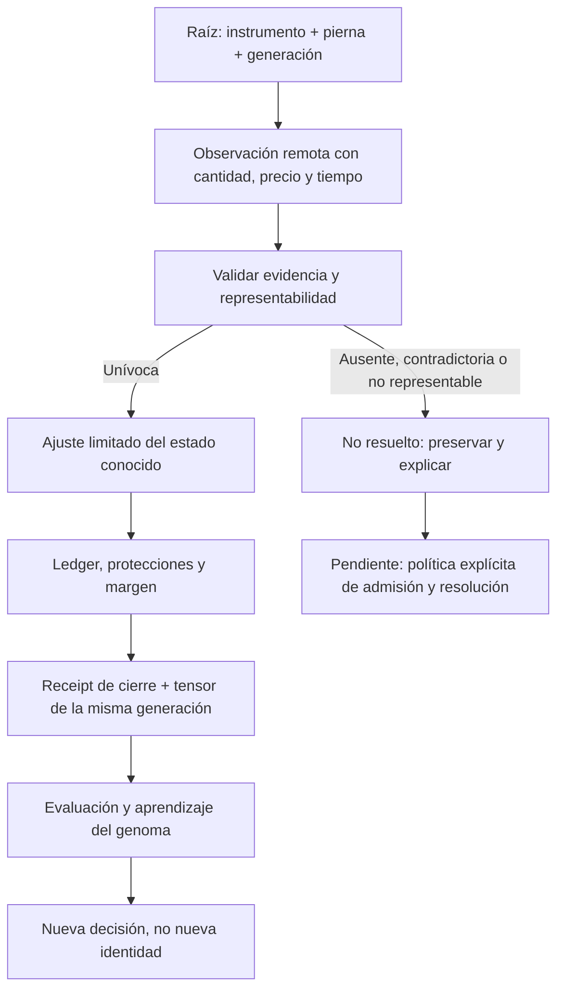

# Auditoría de fundamentos científicos XIX — evidencia causal, posiciones y supuesta ortogonalidad

Fecha: 2026-09-24. Continuación aditiva de [XVIII](<C:/Users/jhona/Documents/Proyectos/Trader Gemini/docs/AUDITORIA_FUNDAMENTOS_CIENTIFICOS_XVIII_2026-09-24.md>). Estado: mejoras locales verificadas y contención parcial; no certificación integral.

## 1. Dictamen

Se corrigen dos contratos operativos: la fusión de observaciones acumuladas en el registro de órdenes y las precondiciones que autorizan ajustes de posiciones en el arena. La conciliación deja de destruir estado conocido cuando recibe un hedge, una inversión de dirección, varias asignaciones locales o evidencia ausente/inválida que no puede representar fielmente. Ahora expone motivos tipados de no resolución.

Esto **no** crea un ledger completo por pierna, ni certifica la exposición remota, ni bloquea globalmente nuevas entradas. Conservar un estado local es una medida de contención; no equivale a demostrar que ese estado coincide con la cuenta. FMT-184 sigue abierto parcialmente y se prioriza la integración de los motivos no resueltos con admisión de exposición, vigilancia y resolución.

Se documentan cinco IDs nuevos, FMT-185 a FMT-189. Entre los principales hallazgos: la “resonancia” se basa en un corte logarítmico fijo que no demuestra ortogonalidad; el tensor de entrada del aprendizaje no tiene propiedad generacional; los snapshots no cubren las escrituras atómicas externas; y una función de limpieza fabrica estados de expiración por tiempo local.

No se añaden ecuaciones avanzadas por prestigio. T42 desarrolla un contrato de evidencia y una demostración matemática que refuta una interpretación del código. La complejidad teórica no repara por sí misma identidad, unidades o etiquetas de entrenamiento incorrectas.

## 2. Cobertura, seguridad y estado Git

Nuevas lecturas completas: [position.rs](<C:/Users/jhona/Documents/Proyectos/Trader Gemini/crates/quantum-arena/src/position.rs>) —1.001 líneas— y [order_registry.rs](<C:/Users/jhona/Documents/Proyectos/Trader Gemini/crates/execution-engine/src/order_registry.rs>) —820 líneas antes de intervenir—. Se relee reconciliation completo. Se inspeccionan fragmentos del host y core, sin contarlos como archivos completos.

Acumulado conservador: **130/289 Rust preexistentes; 159 pendientes**. Inventario confirmado: 1.119 archivos versionados y 24 manifiestos Cargo. No se certifica el resto de los archivos no Rust, los binarios o la teoría del proyecto entero. Los nuevos tests no inflan el denominador histórico.

Checkout local: main, HEAD 59a76de4. El árbol ya contenía muchos cambios de otras rondas/sesiones. Solo se intervienen dos fuentes de producción, se crean cuatro archivos de tests y se actualiza un diagnóstico de XVIII. No se hace commit, push, merge o fetch; no se verifica el remoto.

No se ejecuta ni reinicia el motor, no se accede a una cuenta y no se envían órdenes reales. No se modifican intencionalmente genomas operativos. Las pruebas de respuestas de XVIII reutilizadas emplean HTTP local sintético; las demás operan en memoria.

## 3. Grafo vivo: evitar que una observación parcial se transforme en verdad



Las aristas pendientes son sustanciales: el wrapper de conciliación registra los motivos en stderr, pero el host aún no consume el resultado tipado para una política de admisión. Las posiciones tampoco se convierten en transacciones coherentes solo porque cada campo sea atómico.

La revisión del host refuerza la relevancia de FMT-184: [preflight](<C:/Users/jhona/Documents/Proyectos/Trader Gemini/src/bin/god_engine.rs:1386>) solicita modo HEDGE en la cuenta no paper. El core además permite múltiples slots por activo. No se observó la cuenta real; se identificó la intención de configuración en el código.

## 4. Matriz de resolución

La matriz histórica de 305 puntos no se reemplaza ni se renumera. Esta es una extensión del registro de fundamentos.

| ID | Prioridad y alcance | Estado XIX | Evidencia clave |
| --- | --- | --- | --- |
| FMT-184, ampliado | P1, conciliación operativa | Contención parcial, rediseño pendiente | Hedge/inversión/ausencia/múltiples slots ya no autorizan proyección destructiva |
| FMT-185 | P1, registro REST/WS | Reparación parcial | Menor acumulado no reemplaza precio/nocional; FILLED no regresa a otro terminal |
| FMT-186 | P1, admisión operativa por escala | Abierto | Corte fijo 0,80 y fallback de 30 s no prueban independencia; contraejemplo algebraico |
| FMT-187 | P1, procedencia de features/labels | Abierto | Tensor 54D persiste entre generaciones; productor lo asigna después de publicar apertura |
| FMT-188 | P1, coherencia concurrente | Abierto | Escrituras públicas no incrementan generación ni toman cerrojo de transición |
| FMT-189 | P2, API auxiliar sin caller operativo localizado | Abierto | cleanup_stale_orders convierte demora local en EXPIRED y permite purga |

Un test open_debt que pasa confirma que la limitación sigue presente. Un test de contención no prueba resolución de una posición remota. Una prueba algebraica no significa que ese modelo de filtro esté implementado.

## 5. FMT-184 — de netear posiciones a verificar representabilidad

### Mecanismo anterior y alcance

[reconcile_arena](<C:/Users/jhona/Documents/Proyectos/Trader Gemini/crates/execution-engine/src/reconciliation.rs:304>) construía mapas de cantidad neta por símbolo y conservaba el último precio/leverage visto. LONG+1 y SHORT−1 se volvían cero, disparando la limpieza de una posición local. En un hedge desigual se reemplazaba el bruto por neto. Si había varios slots locales, se podía asignar el total remoto a uno de ellos y conservar los demás: por ejemplo, 0,4+0,6 locales frente a 1,2 remoto podían terminar como 1,2+0,6.

La ausencia de fila se interpretaba como cero. Un NaN construido directamente se descartaba por is_open y también podía terminar como cuenta plana. Las tolerancias absolutas 1e-12/1e-8/1e-6 hacían depender la existencia de exposición de umbrales que no identificaban ni lotes ni valor económico. Una cantidad remota 5e-9 podía cerrar una posición; un ajuste desde 2e-6 hacia 1e-7 podía cerrar en vez de ajustar.

### Reparación aplicada

Se incorpora ArenaReconciliationReport con adjustments y unresolved. Cada motivo tiene instrumento y categoría: evidencia ausente, evidencia inválida, varias piernas remotas, varias asignaciones locales, dirección incompatible, universo inválido e instrumento sin representación.

La agrupación conserva filas por símbolo y verifica lados. No suma piernas para fabricar un escalar único. Rechaza duplicación de una pierna, signos incompatibles, combinación de BOTH con lados hedge y metadatos de una posición abierta sin precio/leverage válidos. También se comprueba que el nocional calculado (|cantidad| × precio) y el margen (nocional / leverage) sean finitos y positivos: entradas finitas pueden producir overflow o underflow al combinarse. La fila cero no necesita un precio de entrada positivo: un estado plano explícito no tiene una entrada abierta que valorar.

Una posición remota no nula se trata como exposición, sin convertirla en cero por epsilon absoluto. Un drift no nulo actualiza cantidad en el caso representable. Se toman los nombres del universo desde una sola referencia por pasada y se comprueban capacidad y duplicados antes de indexar; esto no resuelve la identidad persistente FMT-174.

El wrapper mantiene su firma usize para compatibilidad, llama a la variante checked y escribe cada no-resolución. Los consumidores nuevos pueden inspeccionar la estructura directamente. No se invoca liquidación ni se fabrican órdenes correctivas.

### Pruebas y semántica del resultado

Trece tests nuevos: nueve reproducciones rojo→verde y cuatro refuerzos. Cubren hedge equilibrado/desigual, duplicados, inversión, ausencia, NaN, varias asignaciones, cantidades pequeñas, plano explícito, adopción única, metadatos y overflow del nocional, instrumentos no mapeados, modos mezclados, universo excesivo y permutación de filas. El diagnóstico de XVIII se convierte en regresión de contención: preserva el slot y no confirma falsamente una dirección opuesta.

La invariante comprobada es: **si el ajuste conocido no representa la evidencia, no muta esa posición ni libera su margen por una falsa conclusión de plano**. No significa que el riesgo de la cuenta esté enteramente representado. Una pierna ausente del arena puede seguir existiendo remotamente.

### Deuda residual y riesgos de integración

El host solo recibe el conteo de la envoltura y no bloquea admisión mediante unresolved. Es imprescindible resolver esa política sin impedir órdenes protectoras o gestión obligatoria. No se atribuye a este cambio la propiedad “fail-closed de toda la cuenta”.

Se conservan campos serde default y el lado vacío como alias legacy de BOTH para DTOs internos. Por ello, un positionAmt ausente que deserialice a cero todavía puede parecer una fila plana explícita: FMT-179 no queda cerrado. Tampoco hay contrato de frescura, epoch de snapshot, watermark de fills o identidad persistente del arena.

Las mutaciones del caso representable continúan usando campos atómicos sueltos, no una transición protegida globalmente. Precio medio, comisiones, protecciones y PnL de cierre requieren un ledger causal; no se fabricó ese ledger en esta ronda. Un snapshot viejo pero sintácticamente válido sigue siendo peligroso.

La adopción al OrderRegistry conserva el ID basado en símbolo/updateTime sin lado. Un test adicional demuestra que dos piernas con el mismo timestamp producen dos intentos de adopción pero una sola entrada en el mapa. Se documenta como ampliación de FMT-184, no como otro hallazgo inflado artificialmente.

### Coste computacional y cierre

La agrupación determinista usa BTreeMap: coste O(R log R) para R filas, más recorrido del universo y sus tres slots. Introduce asignaciones y logs en la ruta de conciliación, no en el cálculo por tick. No se midieron percentiles de latencia ni carga sostenida; no se afirma mejora de rendimiento.

Cierre sistémico: clave estable por entorno/cuenta/instrumento/pierna, resolución de asignaciones locales, snapshot completo y fresco, política de incertidumbre consumida por admisión, transiciones coherentes de dirección/precio/margen/protecciones y ledger de fills/ingresos. Deben preservarse gestión de posiciones y reducción de riesgo incluso cuando no se admitan oportunidades nuevas.

## 6. FMT-185 — un máximo escalar no forma un snapshot causal

### Reproducción y explicación

Fuente: [OrderRegistry::apply_ack](<C:/Users/jhona/Documents/Proyectos/Trader Gemini/crates/execution-engine/src/order_registry.rs:279>) y su homólogo WS.

Primer evento: acumulado 1, precio medio 100, nocional 100. Llega tarde un ACK con acumulado 0,5, precio 90 y nocional 45. El código conservaba max(acumulado)=1, pero sobrescribía el precio y nocional: el resultado era la tupla (1,90,45), que no representaba ninguna observación recibida. El test anterior solo comprobaba cantidad, por lo que no detectaba la incoherencia.

En WS también se retenía el acumulado mayor mientras se reemplazaba el promedio con uno de menor cobertura. La fuente antigua podía aportar un fill/comisión no observado por REST: descartarla entera habría perdido evidencia útil. El arreglo debe distinguir snapshot acumulado de eventos individuales.

La jerarquía lifecycle_rank asignaba el mismo rango 3 a FILLED, CANCELED, EXPIRED y REJECTED. Comparar >= permitía que un mensaje terminal tardío sustituyera FILLED por otra etiqueta terminal, aunque el comentario prometiera monotonicidad.

### Cambios

Precio medio y nocional REST solo se actualizan dentro de la rama de cantidad acumulada finita no inferior a la conocida. El promedio WS sigue la misma regla. La información de comisiones por fill continúa procesándose por separado, incluida cobertura disjunta; no se descartan fills solo porque su snapshot acumulado sea antiguo.

Se añade una fusión conservadora de estados: FILLED es absorbente; un FILLED posterior puede completar una orden antes marcada cancelada; UNKNOWN no sustituye conocimiento previo; entre otros estados terminales se conserva el primero conocido. Esto no inventa una cronología entre terminales incompatibles.

Se reconoce EXPIRED_IN_MATCH como categoría de expiración terminal para que no se quede como Unknown y la orden previa siga falsamente activa. La correspondencia conserva la categoría general, no el motivo detallado. [Fuente primaria: estados USD-M](https://developers.binance.com/en/docs/products/derivatives-trading-usds-futures/common-definition).

### Verificación y límites

Seis tests nuevos, cinco rojo→verde. Cubren REST tardío, WS tardío con conservación de fee, terminales tardíos REST/WS, fill posterior a cancelación y EXPIRED_IN_MATCH.

La reparación es parcial: con igual cantidad pero distinto updateTime, el precio de un evento más antiguo todavía puede reemplazar al nuevo. Se demuestra en un diagnóstico separado. También falta resolver identidad contradictoria, importes finitos semánticamente inválidos, ausencia de precio ante cantidad mayor, nocional WS y estado terminal incoherente con origQty. FILLED absorbente supone evidencia del mismo pedido; no sustituye una validación de identidad.

La solución completa requiere orden parcial por identidad y cobertura de evidencia, tiempo de evento cuando sea comparable y una representación explícita de conflictos. No basta “último que llegó gana”; tampoco basta max() aplicado campo por campo.

## 7. FMT-186 — distancia temporal no implica ortogonalidad

Fuente: [PositionManager::find_resonant_slot](<C:/Users/jhona/Documents/Proyectos/Trader Gemini/crates/quantum-arena/src/position.rs:580>), llamado desde [el core](<C:/Users/jhona/Documents/Proyectos/Trader Gemini/crates/god-engine-core/src/lib.rs:4304>).

El algoritmo usa tres slots físicos, aún llamados scalp/swing/position, y rechaza posiciones de igual dirección cuando |ln τ1−ln τ2|<0,80. La documentación menciona 0,60 en algunos puntos y 0,80 en otros. Si τ no es finito o no supera 10 ms, lo sustituye por 30.000 ms; escalas abiertas pequeñas se llevan a 10 ms. Direcciones opuestas no pasan por el mismo veto. Esto no usa covarianza, función de transferencia ni producto interno.

El test muestra que NaN, infinito, valores negativos, cero y 1 ns expresado como 1e-6 ms producen un slot elegible en un manager vacío: la evidencia temporal desconocida o subumbral se convierte en una escala fija. El campo entry_tau_ms es un entero en milisegundos; representar τ mediante ese campo no conserva una escala positiva submilisegundo.

### Contraejemplo matemático explícito

Considérese una familia clásica de filtros causales, normalizados en L²:

```text
h_τ(t) = sqrt(2/τ) · exp(-t/τ),  t>=0, τ>0
||h_τ||² = integral_0^inf (2/τ) exp(-2t/τ) dt = 1
<h_τ1,h_τ2> = 2 sqrt(τ1 τ2)/(τ1+τ2)
Δ = |ln(τ1/τ2)|
<h_τ1,h_τ2> = sech(Δ/2)
```

En Δ=0,80, el producto interno supera 0,92; no es cero ni cercano a cero. Para esta familia, dos escalas que el comentario llamaría ortogonales siguen teniendo un solapamiento elevado. Es una derivación propia elemental y un contraejemplo a la inferencia universal; no se afirma que el sistema implemente estos filtros ni que el número sea una correlación empírica de sus señales.

Incluso correlación nula observada no garantiza independencia sin hipótesis adicionales. “Espacio de Hilbert”, “interferencia” y “resonancia” requieren definir vectores, medida y producto interno; no son propiedades producidas por renombrar ranuras.

### Qué conservar y qué rediseñar

La separación logarítmica puede ser una heurística útil de diversidad de escalas si se evalúa como tal. No se cambia 0,80 por otro número arbitrario ni se elimina el control de exposición sin medir la dependencia. El límite físico de tres slots tampoco demuestra por sí mismo falta de continuidad matemática: toda implementación tiene recursos finitos; debe declarar cómo aproxima el dominio y qué error introduce.

Cierre: definir kernels/estimandos por escala, matriz de Gram o covarianza causal estimable, tratamiento de incertidumbre y presupuesto de concentración. Comparar la heurística actual contra baselines con ablations, costes y desfases. Separar capacidad computacional, elegibilidad de señal y admisión de riesgo. Las escalas desconocidas deben identificarse, no inventarse.

## 8. FMT-187 — features de otra generación pueden contaminar el aprendizaje

Fuente: [Position::nn_entry_tensor](<C:/Users/jhona/Documents/Proyectos/Trader Gemini/crates/quantum-arena/src/position.rs:31>), productor [core](<C:/Users/jhona/Documents/Proyectos/Trader Gemini/crates/god-engine-core/src/lib.rs:4710>) y consumidor [del dataset](<C:/Users/jhona/Documents/Proyectos/Trader Gemini/crates/god-engine-core/src/lib.rs:1750>).

open_with_tau_and_fee reinicia muchos campos y publica is_open, pero no reinicia ni versiona el tensor 54D. close_with_fee tampoco lo consume con un receipt generacional. El productor del core asigna el tensor después de abrir. El consumidor comprueba longitud y más tarde adquiere otro lock para escribir el CSV.

Se reproduce secuencialmente: abrir A, instalar 54 features con valor 7, cerrar A, abrir B sin nuevas features. La generación aumenta, pero el tensor de B sigue siendo el de A. Esto prueba falta de propiedad generacional; no demuestra cuántas filas reales están contaminadas. La cadena estática productor/publicación/consumidor muestra una ventana adicional en que una apertura B puede exponerse antes de tener sus features.

Consecuencia posible: el target realizado de una posición se asocia al estado de entrada de otra. Un modelo puede mejorar en backtest y degradarse vivo si los caminos de generación de labels no tienen el mismo contrato. Es un mecanismo causal concreto, no una atribución medida de toda la brecha de rendimiento.

No se vacía simplemente el tensor al cerrar: el consumidor actual lo lee después del cierre y perdería el ejemplo. Tampoco se escribe cero para fingir features válidas. Cierre: payload inmutable de entrada ligado a (instrumento,generación,tiempo,versión de features/genoma), publicación coherente y receipt de cierre que transfiera esa misma evidencia al dataset. Si falta, marcar muestra no entrenable. El emisor debe encolar fuera del hot path, conservar procedencia y contabilizar descartes/errores de escritura.

## 9. FMT-188 — campos atómicos no constituyen una transacción

Fuente: [snapshot](<C:/Users/jhona/Documents/Proyectos/Trader Gemini/crates/quantum-arena/src/position.rs:449>) y [ajuste de conciliación](<C:/Users/jhona/Documents/Proyectos/Trader Gemini/crates/execution-engine/src/reconciliation.rs:597>).

Position usa un cerrojo para apertura/cierre y generation para detectar cambios durante una lectura. Sin embargo, los campos son públicos y otros caminos almacenan quantity, margin_used, entry_tau_ms o confirmaciones sin participar en ese protocolo. El test modifica quantity por el acceso público usado por esos caminos y obtiene dos snapshots con distinta cantidad y la misma generación.

Es una prueba de que generation no versiona todas las mutaciones, no una observación experimental de toda posible carrera. La coherencia de una lectura de dos campos no se deriva de la atomicidad separada de cada campo: un lector podría intercalarse entre actualización de cantidad y margen sin que generation lo delate. Acquire/Release por sí solos no convierten varios objetos atómicos en una transacción.

La contención de FMT-184 reduce escrituras conceptualmente incorrectas, pero no hace atómica la rama representable. El test de estrés existente de apertura/cierre pasa; su alcance no cubre todos los escritores externos ni prueba linealizabilidad del sistema.

El spinlock tiene un bucle sin límite de iteraciones aunque un comentario lo llame acotado. No se ha medido un bloqueo real o latencia patológica; sigue siendo una deuda de presupuesto y disciplina de writers. Cierre: encapsular mutaciones, elegir propietario del estado o protocolo compartido, receipts por generación y verificación de concurrencia que incluya reconciliación, fills, protecciones y aperturas simultáneas. Una prueba de estrés no reemplaza analizar el protocolo completo.

## 10. FMT-189 — demora local no demuestra expiración remota

Fuente: [cleanup_stale_orders](<C:/Users/jhona/Documents/Proyectos/Trader Gemini/crates/execution-engine/src/order_registry.rs:508>).

La función cambia a EXPIRED una orden activa al superar edades locales y actualiza updated_ms. No consulta al exchange ni confirma cancelación. prune_terminated puede eliminar después ese registro. El diagnóstico registra una intención, avanza el reloj local, ejecuta limpieza y demuestra transición/purga sin evidencia remota.

Solo se localizaron definición y tests de cleanup_stale_orders, no un caller operativo. Por eso se clasifica P2 auxiliar y no se afirma que cause actualmente órdenes huérfanas. prune_terminated sí aparece en el host: la distinción de alcance importa.

La demora puede indicar congestión, pérdida de stream, desconexión o actividad real prolongada; no identifica el estado terminal de una orden. Cierre: separar Stale/ResolutionRequired de la máquina de estados del exchange; mantener intención y reservas hasta query/cancel/fills concluyentes, con presupuesto de reintentos y vigilancia. No sustituir el timeout por otro número sin corregir la inferencia.

## 11. T42 — estado suficiente, orden parcial y evidencia para evolución

T42 es una propuesta de diseño derivada de esta ronda, no un algoritmo nuevo desplegado. Extiende T41 y conserva las teorías anteriores.

### Cada cálculo necesita una identidad y un estimando

Una observación acumulada debe modelarse al menos como (pedido,instrumento,pierna,cobertura,precio/nocional,tiempo de evento,fuente). El máximo de cobertura sirve para evitar perder fills, pero no autoriza combinarlo con componentes de otra cobertura. La unión de fills identificados y la selección de un snapshot acumulado son operaciones distintas.

La posición analítica puede depender de un espectro continuo de escalas. Su exposición ejecutada exige un ledger finito que conserve obligaciones. La representación por neto pierde información; la separación por nombres scalp/swing tampoco identifica una pierna del exchange ni una generación de features.

### Cuatro estados de conocimiento útiles

| Evidencia | Interpretación | Acción de diseño |
| --- | --- | --- |
| Plano explícito y fresco | No hay cantidad abierta de la pierna observada | Reconciliar con fills/ingresos, no inventar precio de cierre |
| Ausente o incompleta | No se conoce el estado necesario | Resolver; no tratar como cero |
| Válida, pero no representable localmente | Existen obligaciones fuera del modelo actual | Preservar evidencia, gestionar riesgo y suspender la admisión que corresponda |
| Coherente y representable | Hay base para una transición definida | Aplicar con protocolo compartido y registrar procedencia |

La política global de esta tabla está pendiente; el código nuevo solo implementa parte de la clasificación y contención. No se anuncia como sistema completamente autoevolutivo.

### Puerta científica para nuevas integraciones

Antes de incorporar control avanzado, geometría, métodos espectrales o formulaciones cuánticas: declarar variables observables, unidades, hipótesis, baseline, identificabilidad, estabilidad numérica, coste de cómputo y prueba fuera de muestra. El contraejemplo de kernels demuestra por qué una analogía física debe convertirse en un cálculo comprobable.

Los problemas del milenio no son un catálogo de indicadores de trading. Una ecuación transferida requiere un modelo bien planteado y una utilidad verificable en esta cadena. No se promete omnisciencia, cálculo literal de todo el continuo nanosegundo a nanosegundo ni rentabilidad. La aproximación debe adaptarse a datos, incertidumbre y recursos, no a etiquetas de marketing.

## 12. Los ocho módulos: aporte y deuda

| Módulo | Aporte XIX | Pendiente |
| --- | --- | --- |
| 1. Ingestión/parsers/L2 | Validez y ausencia en snapshots; recepción REST/WS | Completitud/frescura por endpoint y libro entero |
| 2. IA/modelos/señales | Tensor de entrada y target por generación | Dataset causal y auditoría empírica de contaminación |
| 3. Multiactivo/horizontes | Contraejemplo a ortogonalidad; múltiples asignaciones | Política espectral basada en dependencia y presupuesto |
| 4. Ejecución/red | Merge acumulado y estados terminales | Identidad/timestamps/conflictos, exactamente-una-vez |
| 5. Riesgo/Kelly/genomas | Preservación de exposición conocida | Gate de no-resueltos, ledger por pierna y valoración |
| 6. Estado/mmap/SO | Writers fuera del protocolo de snapshot | Transacciones/propietario y latencia de concurrencia |
| 7. Confluencia/cuántica | Hipótesis separadas de demostraciones | Gram/covarianza y pruebas de valor incremental |
| 8. Backtest/gobernanza | Regresiones y diagnósticos diferenciados | Paridad extremo-a-extremo y benchmark de carga |

## 13. Hoja de ruta verificable

1. Consumir unresolved mediante una política explícita de admisión que preserve gestión y reducción de riesgo; persistir motivos y resolución, no solo logs.
2. Identidad estable y ledger por pierna, con distribución de fills entre asignaciones locales; cerrar FMT-174/177/184 conjuntamente.
3. Snapshot/mutaciones con propietario o transacción compartida; evitar que una mejora local salte el protocolo de generación.
4. Receipt generacional de entrada/cierre para el dataset; auditar rows existentes antes de atribuir sus métricas al modelo.
5. Fusión de órdenes por cobertura, identidad y tiempo causal; conflictos no deben ocultarse con un rango escalar.
6. Reemplazar afirmaciones de ortogonalidad por estimadores definidos y ablations; conservar el control actual como baseline documentado hasta validar otro.
7. Medir coste y latencia en cargas representativas, validar fuera de muestra y promover genomas solo con trazabilidad del recorrido real.

## 14. Pruebas, integridad y fuentes

**59 pruebas distintas pasan**, sin contar repeticiones. Hay 26 nuevas: 14 rojo→verde, 5 refuerzos, 6 diagnósticos de deuda abierta y 1 contraejemplo matemático. Se ejecutan 33 preexistentes, incluido un diagnóstico de XVIII actualizado a contención y la prueba de estrés de apertura/cierre.

```text
cargo test -p execution-engine --test order_evidence_contract --test reconciliation_evidence_contract --test registry_open_diagnostics --test execution_open_diagnostics --test exchange_response_contract --offline -- --test-threads=1
cargo test -p quantum-arena --test position_evidence_diagnostics --offline -- --test-threads=1
cargo test -p execution-engine --lib order_registry::tests --offline -- --test-threads=1
cargo test -p execution-engine --lib reconciliation::tests --offline -- --test-threads=1
cargo test -p quantum-arena --lib position::tests --offline -- --test-threads=1
cargo check --bin god_engine --offline
```

Cargo check pasa con los tres warnings previos de evolution-engine: latest_ts, mode y RealWfOutcome.trades. Rustfmt y diff --check pasan sobre los cambios propios. El primer intento de compilar el nuevo harness asumió Box donde el constructor devuelve Arc; se corrigió el test antes de obtener los catorce fallos conductuales. No se cuenta un error de compilación como reproducción funcional.

Al crear arenas de test sin TG_GENOME_ENV aparece el aviso del almacén que exige entorno explícito; no se seleccionó producción/demo ni se promovió un genoma para silenciarlo. Los nuevos tests que publican universo comparten mutex local y se ejecutan serialmente.

Firecrawl se utilizó para contrastar el enum oficial del exchange. El índice devolvió copias de terceros que no se tomaron como autoridad. Una página de eventos respondió HTTP 200 pero solo devolvió navegación; se registró como contenido insuficiente, no como evidencia. La página oficial common-definition sí aportó EXPIRED_IN_MATCH y los lados de posición. Se envió feedback de ambos resultados. El CLI no estaba disponible y se usó el conector, sin instalar software ni aportar datos privados.

El [artefacto XIX](<C:/Users/jhona/Documents/Proyectos/Trader Gemini/docs/artifacts/auditoria_fundamentos_XIX_2026-09-24.json>) registra estados, fuentes, cobertura, pruebas y hashes. Se añaden adendas al atlas, maestro y XVIII, conservando sus prefijos históricos. Los hashes protegidos distinguen los dos cambios propios del resto del árbol.

## 15. Control final de integridad

El artefacto JSON se deserializa correctamente y la suma de los grupos de pruebas es 59. Se verifican los 14 hashes de fuentes/tests registrados; las siete fuentes protegidas conservan exactamente su SHA-256 inicial. Esto acredita esos archivos concretos, no la ausencia de cambios concurrentes en todo el repositorio.

Los tres prefijos históricos conservan su contenido tras normalizar CRLF a LF. Las adendas agregan 2.266 caracteres al atlas, 5.420 al maestro y 1.183 a XVIII. No se reemplaza ni se borra el registro anterior. Esta comprobación preserva el prefijo textual, no promete identidad binaria de los finales de línea.

Los 15 enlaces locales del informe existen y sus anclas de línea están dentro del archivo correspondiente. El formateo de los siete archivos Rust intervenidos y `git diff --check` de las dos fuentes de producción pasan. Después de añadir la validación de overflow de nocional/margen se repitieron 28 pruebas de integración, cuatro unitarias de conciliación y `cargo check --bin god_engine --offline`, todos con éxito; las repeticiones no se suman al total de pruebas distintas.

El checkout sigue en main, HEAD 59a76de4. Hay cambios sin publicar y no se comprobó el remoto. La siguiente intervención prioritaria es consumir la no-resolución en la admisión de exposición y diseñar la transferencia generacional de features/cierres; no se declara resuelta ninguna de esas dos tareas.


## Continuación XX — paridad del artefacto antes de atribuir aprendizaje

La [ronda XX](<C:/Users/jhona/Documents/Proyectos/Trader Gemini/docs/AUDITORIA_FUNDAMENTOS_CIENTIFICOS_XX_2026-09-24.md>) añade FMT-190…194 y repara parte de FMT-037. Se comprueba que exportación perdía shrinkage e índices globales, y que regresión sumaba el gradiente con signo incorrecto. Se corrigen esas rutas y se mide el predictor retenido en el gate.

31 pruebas funcionales pasan; un inventario adicional rechaza 8 de 20 bosques JSON guardados, acepta 12 solo por estructura y separa un modelo neuronal. Ningún artefacto operativo se modifica ni activa. Falta migración/reentrenamiento y validar ausencia de modelo antes de desplegar el cargador estricto.

Permanecen las tareas de XIX: no-resolución de conciliación consumida por admisión, ledger por pierna, coherencia de snapshots y transferencia generacional de features/cierres. XX no se presenta como cierre de esas deudas ni como conversión integral a un continuo multivariado. Cobertura 131/289 Rust; 158 pendientes. [Artefacto XX](<C:/Users/jhona/Documents/Proyectos/Trader Gemini/docs/artifacts/auditoria_fundamentos_XX_2026-09-24.json>).
