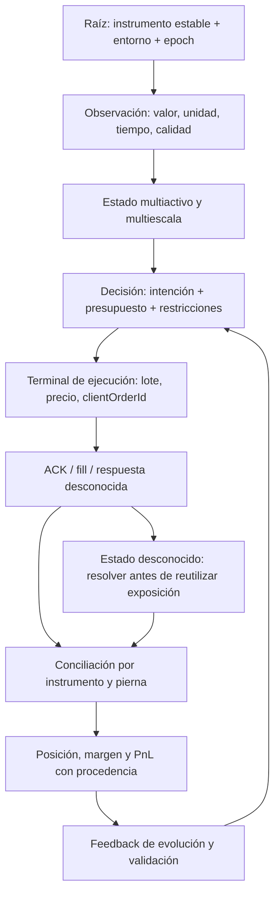

# Auditoría de fundamentos científicos XVIII — contratos de evidencia, cantidades y conciliación

Fecha: 2026-09-24. Continuación aditiva de [XVII](<C:/Users/jhona/Documents/Proyectos/Trader Gemini/docs/AUDITORIA_FUNDAMENTOS_CIENTIFICOS_XVII_2026-09-24.md>). Estado: revisión parcial verificable; no certificación integral ni aprobación para operar.

## 1. Dictamen y alcance real

Se reparan contratos concretos en tres fuentes: proyección conservadora de cantidades, deserialización numérica finita y clasificación de respuestas de ejecución inciertas. Se corrigen además dos equivalencias incorrectas entre nombres y códigos de error. La ronda añade siete IDs, FMT-178 a FMT-184, y actualiza FMT-175 sin borrar su diagnóstico original.

La principal deuda nueva es de representación: la conciliación reduce posiciones por símbolo a una cantidad neta y posteriormente trata ese escalar como si describiera toda la exposición. Una cartera LONG/SHORT puede tener neto cero y exposición bruta positiva. También se reproduce una inversión remota de dirección que deja el slot local apuntando en el sentido anterior. Estos problemas están abiertos y tienen mayor prioridad sistémica que incorporar otra teoría predictiva.

No se atribuye el mal desempeño del genoma a una única causa. Sí se identifica un mecanismo de divergencia: backtest puede entregar al evaluador estados consistentes mientras la ruta viva le entrega identidad, dirección, fills o costes incompletos. Si cambia la variable que se mide, no existe paridad aunque los genes y las ecuaciones sean idénticos.

### Cobertura y límites

Inventario Git local: 1.119 archivos versionados, 289 Rust y 24 manifiestos Cargo. Rama main, HEAD 59a76de4; no se consultó el remoto. El árbol ya contenía numerosos cambios de rondas anteriores y/o sesiones concurrentes.

Se acreditan cuatro lecturas completas nuevas: [order_types.rs](<C:/Users/jhona/Documents/Proyectos/Trader Gemini/crates/execution-engine/src/order_types.rs>), [dynamic_symbols.rs](<C:/Users/jhona/Documents/Proyectos/Trader Gemini/crates/execution-engine/src/dynamic_symbols.rs>), [client.rs](<C:/Users/jhona/Documents/Proyectos/Trader Gemini/crates/execution-engine/src/client.rs>) y [reconciliation.rs](<C:/Users/jhona/Documents/Proyectos/Trader Gemini/crates/execution-engine/src/reconciliation.rs>). Se relee symbol_registry, ya acreditado en XVII. El módulo de exportaciones se inspecciona sin incrementar el acumulado conservador.

Cobertura acumulada: **128/289 Rust preexistentes; 161 pendientes de lectura completa**. Las búsquedas globales y fragmentos de executor, order_registry y god_engine no cuentan como lecturas completas nuevas. No se afirma haber revisado todos los archivos, todos los crates o toda la teoría. El denominador versionado no incluye los nuevos tests e informes sin seguimiento.

No se ejecutó god_engine, no se tocó ninguna cuenta, no se enviaron órdenes ni se modificaron intencionalmente genomas activos. Las únicas peticiones HTTP de las pruebas fueron contra un servidor efímero local con datos sintéticos. No hubo despliegue, reinicio, commit, push, merge ni fetch.

## 2. Paradigma de grafo vivo y topología diagnóstica

El motor continuo necesita conservar significado a lo largo del grafo. La continuidad de la tesis estadística no elimina las restricciones discretas de ejecución ni convierte una observación ausente en cero.



Es un contrato objetivo, no una afirmación de que todas esas aristas estén implementadas. Persisten la inestabilidad de IDs de FMT-174 y la falta de epoch compuesto de FMT-177. Esta ronda interviene en cantidades y lectura de respuestas; no migra posiciones, publicaciones del universo ni todos los consumidores.

Un nodo terminal puede confirmar recepción sin confirmar fill. Un error de lectura puede seguir a una ejecución exitosa. Una posición neta plana no acredita ausencia de obligaciones. Esas distinciones deben sobrevivir hasta la función de aptitud del genoma.

## 3. Matriz consolidada de esta ronda

Se conserva la matriz histórica de 305 puntos; estos IDs son una extensión del registro científico, no una renumeración de aquella matriz. La prioridad considera consecuencia y alcance: P1 para riesgos de estado/contabilidad en rutas vivas; P2 para APIs auxiliares o contratos locales.

| ID | Prioridad / alcance | Estado XVIII | Resultado verificable |
| --- | --- | --- | --- |
| FMT-175 | P2, helper sin caller operativo localizado | Reparación parcial ampliada | No acepta no finitos ni fabrica paso; proyección conservadora con origen minQty; decimal exacto pendiente |
| FMT-178 | P1, parser compartido por ejecución y posiciones | Contrato de finitud reparado | Rechaza NaN/inf y overflow textual; conserva cantidades firmadas legítimas |
| FMT-179 | P1, ACK y esquema de posiciones | Abierto | Un objeto vacío sigue deserializando a identidad/cantidades por defecto |
| FMT-180 | P1, cliente POST tipado | Clasificación parcial reparada | ACK ilegible, cuerpo interrumpido, HTTP408 y -1006/-1007 son ambiguos |
| FMT-181 | P1 contable; helper auxiliar y evidencia en registry | Abierto | Suma de monedas incompatibles; rebates descartados o convertidos a coste |
| FMT-182 | P2, selector exportado sin uso operativo localizado | Abierto | BTC fabricado, precio inválido admitido, duplicados y orden total incoherente |
| FMT-183 | P2, constantes públicas sin caller interno localizado | Mapa corregido; aliases deprecados | Separados parámetros vacíos/duplicados y mínimo nocional/rate limit |
| FMT-184 | P1, conciliación llamada por el host | Abierto, reproducido | Neto cero borra cobertura; inversión conserva dirección local anterior |

Las pruebas diagnósticas de deuda abierta están nombradas open_debt y separadas de los contratos de regresión. Pasar una prueba que reproduce un defecto no significa haberlo solucionado.

## 4. FMT-175 — cantidad válida no equivale a redondear decimales

### Evidencia, mecanismo y consecuencias

Fuente: [SymbolSpec::validate_order](<C:/Users/jhona/Documents/Proyectos/Trader Gemini/crates/quantum-arena/src/symbol_registry.rs:19>). La implementación anterior calculaba floor(q/step) y después infería decimales mediante round(-log10(step)). Esa segunda operación no respeta pasos generales: con step=0,05 y q=0,06 devolvía 0,1; con step=0,025 y q=0,09 devolvía 0,08. El primer caso supera la exposición solicitada; el segundo no es un múltiplo admisible del paso de ese ejemplo.

Además, comparaciones ordinarias con NaN no rechazaban la entrada; el paso inválido se sustituía por 1; mínimos no finitos o negativos podían desactivar restricciones; cero podía aceptarse si minQty era cero; un nocional infinito atravesaba el chequeo de mínimo. No se localizó consumidor operativo del helper en src/crates: son defectos reales de la API, no evidencia de órdenes reales sobredimensionadas.

### Corrección matemática aplicada

En el modelo numérico suministrado, se usa:

```text
n = floor((q_solicitada - q_min) / paso)
q_admisible = q_min + n · paso
0 < q_admisible <= q_solicitada
```

q representa unidades del activo base; paso y q_min tienen la misma unidad. El entero n cuenta incrementos desde el origen del filtro. La documentación USD-M especifica una malla desplazada por minQty y distingue LOT_SIZE de MARKET_LOT_SIZE. No debe inferirse que el número de decimales de un precio define el paso de cantidad. [Fuente primaria: filtros USD-M](https://developers.binance.com/en/docs/products/derivatives-trading-usds-futures/common-definition#lot_size).

Se rechazan precio/cantidad no finitos o no positivos, paso no finito/no positivo, mínimos no finitos/negativos y overflow del nocional. No se corrigen silenciosamente metadatos corruptos. Se limita q/paso por debajo de 2^53: es la frontera de resolución unitaria de f64, derivada de MANTISSA_DIGITS, no una constante de trading calibrada a mano.

Si la aritmética binaria deja el candidato por encima del pedido, se reduce un incremento y se vuelven a comprobar las invariantes. No se suma un epsilon para autorizar exposición adicional. El nocional final se calcula después de proyectar la cantidad, en unidades de cotización.

### Pruebas, límites y cierre pendiente

Diez tests nuevos cubren dominio, mínimos, overflow, pasos 0,05/0,025, origen desplazado, límite de precisión y una malla de 5.994 combinaciones. Ocho casos fallaban antes de reparar; los dos añadidos después refuerzan el origen del filtro y documentan la limitación binaria. Dos diagnósticos de XVII se convierten en regresiones conservando su historia en los informes.

No es aritmética decimal exacta: q=0,3 y paso=0,1 puede producir 0,2 de manera conservadora. El resultado puede contener la representación 0,07500000000000001. Esto no es una garantía de serialización aceptada por Binance. Tampoco se representan maxQty, filtro de mercado separado, excepciones reduce-only, precio de referencia nocional, precio/tick, margen disponible ni todos los límites por cuenta. No se ha unificado con round_to_step_size del executor.

Cierre completo: conservar los strings decimales de exchangeInfo, transformar a unidades enteras con escala comprobada y enteros de capacidad suficiente, modelar cada filtro aplicable y probar el valor serializado. Debe probarse con datos operativos capturados, sin asumir que un contrato auxiliar sustituye la validación del terminal.

## 5. FMT-178 — valores no finitos entraban como hechos contables

### Evidencia y mecanismo

Fuente: [string_or_f64](<C:/Users/jhona/Documents/Proyectos/Trader Gemini/crates/execution-engine/src/order_types.rs:11>). El parser aceptaba strings numéricos de Rust sin comprobar finitud. NaN, inf y 1e999 podían terminar como f64 no finitos, aunque un JSON numérico ordinario no admita esas representaciones.

El helper se comparte entre OrderAck, Fill, OpenAlgoOrder, IncomeEntry y PositionRiskEntry. Por tanto, no es solo un problema de una función aislada: afecta cantidad ejecutada, precio, comisión, ingreso y posición remota. En particular, is_open descarta una position_amt no finita y la conciliación puede interpretar posteriormente la ausencia como cero. Ese enlace convierte corrupción de datos en una posible conclusión falsa de cuenta plana.

### Cambio, prueba y riesgo residual

El parser ahora exige finitud después de convertir cualquiera de las variantes. Conserva el signo: una posición SHORT, un ingreso negativo y una comisión negativa son valores posibles; imponer positividad global habría introducido otro bug.

El test recorre cinco strings inválidos en los cinco tipos reales. Otro prueba cantidades firmadas legítimas. En la ruta inspeccionada, fetch_position_risk propaga el error de deserialización y el bucle del host solo ejecuta reconcile_arena en la rama Ok; no sustituye el error por un snapshot vacío. Es una comprobación causal localizada, no una garantía de todos los endpoints.

Queda pendiente semántica por campo: una cantidad ejecutada negativa finita sigue siendo parseable; también faltan completitud, unidad, frescura y coherencia entre campos. Los structs públicos se pueden construir sin pasar por serde. El parche elimina no finitos en esa frontera, no certifica el ledger.

## 6. FMT-179 — defaults convierten ausencia de evidencia en identidad vacía o posición plana

Fuente: [OrderAck y parse_order_body](<C:/Users/jhona/Documents/Proyectos/Trader Gemini/crates/execution-engine/src/order_types.rs:90>) y [PositionRiskEntry](<C:/Users/jhona/Documents/Proyectos/Trader Gemini/crates/execution-engine/src/reconciliation.rs:13>).

Prácticamente todos los campos se marcan default. Se reproduce parse_order_body("{}") = Ok con order_id cero, símbolo vacío, clientOrderId vacío y cantidades cero. El transporte tipado acepta ese objeto como ACK porque es JSON válido. El executor aplica el ACK al registry, cuya clave procede de client_order_id; un campo ausente no queda diferenciado de una identidad legítima.

En posiciones, un positionAmt ausente adquiere cero. La corrección de FMT-178 no interviene porque no se ejecuta el deserializador de un campo ausente. Del mismo modo, remaining_qty transforma una resta no finita o un sobrellenado en cero en vez de conservar un estado inválido identificable. No se afirma que Binance haya enviado estos objetos: se prueba que el límite de confianza los aceptaría.

No se exige ahora una lista universal de campos obligatorios: POST ACK, RESULT, GET y cancelaciones pueden tener contratos diferentes, y existen ACK sintéticos internos. Un endurecimiento sin separar esos casos puede bloquear respuestas válidas. Cierre: tipos específicos por operación, identidad correlacionada con la intención pendiente, invariantes entre origQty/executedQty/cumQuote y estados con información faltante explícita. Las respuestas desconocidas no deben insertarse en el ledger como identidades vacías ni autorizar un reintento ciego.

## 7. FMT-180 — parsear mal un ACK no demuestra que la orden haya fallado

### Evidencia y cadena operativa

Fuente: [execute_order_payload_typed](<C:/Users/jhona/Documents/Proyectos/Trader Gemini/crates/execution-engine/src/client.rs:314>). Antes, una respuesta HTTP2xx con JSON inválido retornaba ACK_PARSE_ERROR sin prefijo AMBIGUOUS. Una lectura interrumpida se reemplazaba por el texto Unknown error y acababa en la misma categoría. Todos los 4xx, salvo los controles de tasa, se presentaban como rechazos definitivos.

El executor distingue errores por prefijo y consulta por clientOrderId en la rama AMBIGUOUS. Por tanto, la clasificación no es meramente cosmética: puede decidir si se intenta resolver una orden cuyo resultado se desconoce. La documentación describe ejecución incierta para -1006/-1007 y distingue variantes de HTTP503; HTTP408 refleja timeout del backend. [Códigos oficiales](https://developers.binance.com/en/docs/products/derivatives-trading-usds-futures/error-code), [semántica HTTP](https://developers.binance.com/en/docs/products/derivatives-trading-usds-futures/general-info#http-return-codes).

### Corrección aplicada y pruebas

Se clasifica como ambiguo el fallo de lectura del cuerpo, el fallo de parseo de un ACK 2xx, HTTP408 y los códigos -1006/-1007 detectados en respuestas 4xx. HTTP429 y HTTP418 mantienen sus rutas de control conocidas a partir del status/headers, incluso sin depender de leer el cuerpo. Los 5xx siguen siendo tratados conservadoramente como ambiguos.

Los tests usan BinanceClient real contra TCP loopback: JSON inválido, NaN, cuerpo más corto que Content-Length, timeouts de backend, ACK válido, rechazo -2010, rate limiting, ban y 503. No utilizan la cuenta ni claves reales.

### Límites y criterio de cierre

No se ha demostrado idempotencia exactamente-una-vez de todo el sistema. Las rutas no tipadas, WebSocket, cancelación, maker-chase y recuperación por reinicio no quedan certificadas por este parche. Tampoco se ha cambiado el comportamiento posterior que consulta o cancela; el arreglo garantiza la categoría de incertidumbre, no la resolución completa.

Los errores siguen siendo strings; esto permite que consumidores futuros interpreten categorías de manera desigual. Hace falta una máquina de estados tipada: intención persistida, recepción incierta, respuesta correlacionada, fills, cancelación pendiente y resultado final. Debe tolerar eventos retrasados y parciales sin liberar margen ni reenviar una orden nueva hasta conocer el estado necesario.

## 8. FMT-181 — costes sin moneda y signos alterados

Fuente: [OrderAck::total_commission](<C:/Users/jhona/Documents/Proyectos/Trader Gemini/crates/execution-engine/src/order_types.rs:141>) y fragmento de [OrderRegistry::apply_ack](<C:/Users/jhona/Documents/Proyectos/Trader Gemini/crates/execution-engine/src/order_registry.rs:261>).

El helper suma únicamente comisiones finitas no negativas e ignora commission_asset. El caso 1 BNB + 1 USDT - 0,1 USDT devuelve 2. Ese número carece de unidad consistente y elimina el rebate. Además, sumar operandos finitos no garantiza que la suma sea finita.

No se localizó uso operativo de total_commission fuera de tests; no se le atribuyen pérdidas reales. Sin embargo, en el registry operativo se observa una suma sin moneda y almacenamiento de commission.abs() por trade_id. Es un defecto relacionado distinto: un rebate puede convertirse en coste positivo. La inspección del registry fue parcial y no prueba todo el circuito de valoración de comisiones.

Consecuencia posible: PnL neto, reward, win/loss, Kelly y aptitud evolutiva no están expresados en el mismo numerario. El sesgo puede ser optimista o pesimista dependiendo de moneda, signo, deduplicación y conversión. No se arregla tomando valor absoluto, descartando signos ni aplicando un tipo de cambio actual a un fill antiguo.

Cierre requerido: ledger de flujos firmados por activo, identificador de fill y timestamp; valoración en un numerario explícito con precio causal y procedencia; separación entre coste observado e imputado. Una imputación debe conservar incertidumbre y no reemplazar silenciosamente el flujo real. Pruebas: monedas distintas, rebates, actualizaciones REST/WS fuera de orden, precios de conversión ausentes y overflow.

## 9. FMT-182 — otro selector conserva anclas fabricadas y no mide un espectro

Fuente: [DynamicSymbolSelector](<C:/Users/jhona/Documents/Proyectos/Trader Gemini/crates/execution-engine/src/dynamic_symbols.rs:38>). Es una implementación diferente de DynamicSelector de data-ingest reparada en XVII. Corregir una no corrige automáticamente la otra.

Cinco mecanismos se observan en el archivo completo:

1. refresh_universe convierte un JSON que no sea el array esperado en array vacío con unwrap_or_default.
2. El ranking inserta BTCUSDT incluso con cero observaciones. La prueba devuelve BTC en ambas listas ante entrada vacía.
3. lastPrice solo debe existir como string; su valor no se analiza. Una fila con precio NaN puede seleccionarse.
4. Filas repetidas no BTC ocupan varias posiciones; el test con dos filas idénticas demuestra dos entradas del mismo instrumento.
5. Eq usa igualdad float, PartialOrd devuelve None para NaN y Ord sustituye ese resultado por Equal. Se violan reflexividad y coherencia del contrato de orden total para un SymbolScore público con NaN.

En la ruta que construye el heap, el score se filtra por finitud; eso limita el alcance operativo del quinto mecanismo. No sería correcto afirmar que el ranking actual inserta necesariamente NaN en el heap. Sigue siendo una API pública con implementación inconsistente.

El score es |cambio porcentual diario| × log10(volumen), con mínimos 10.000/10.000.000 por entorno y top10/top64. Es una heurística de retorno neto y actividad, no una medida de volatilidad realizada ni un cálculo cuántico. Una oscilación intradía intensa puede terminar con cambio neto cero. La dependencia del entorno introduce además políticas distintas en demo/producción.

La búsqueda local solo encontró definición, exportación y tests, no un caller operativo de refresh_universe. Se mantiene como deuda auxiliar, sin presentar su reparación como cambio de la ruta viva. Cierre: reducir implementaciones duplicadas mediante un contrato común de observación/elegibilidad, abstención explícita, deduplicación, orden determinista y política versionada; validar primero todos sus consumidores. Conservar posiciones abiertas no es razón para inventar nuevas oportunidades de inversión.

## 10. FMT-183 — mapa de errores con significados intercambiados

Fuente: [error_codes](<C:/Users/jhona/Documents/Proyectos/Trader Gemini/crates/execution-engine/src/order_types.rs:204>).

PARAM_REPEAT tenía valor -1105, correspondiente a parámetro vacío; RATE_LIMIT_BAN tenía -4164, correspondiente a nocional mínimo. Esto podría inducir a un consumidor a enfriar/bloquear la ejecución por una orden demasiado pequeña o a depurar un parámetro duplicado que en realidad está vacío. No había referencias operativas internas a esas dos constantes, por lo que no se afirma que los bloqueos observados del sistema tengan esta causa.

Se añaden nombres canónicos TOO_MANY_PARAMETERS=-1101, PARAM_EMPTY=-1105, MIN_NOTIONAL=-4164 y TOO_MANY_REQUESTS=-1003, junto a los códigos de ejecución incierta. Los nombres antiguos siguen exportados pero deprecados y apuntan al significado corregido. Esto conserva los símbolos de API, **no** sus valores erróneos anteriores; consumidores externos requieren revisar ese cambio.

El alias RATE_LIMIT_BAN no es un detector inequívoco de ban: -1003 cubre situaciones de exceso de solicitudes y la respuesta/HTTP determina la reacción. Se conserva el tratamiento específico HTTP418. Fuente primaria contrastada con Firecrawl: [error codes USD-M](https://developers.binance.com/en/docs/products/derivatives-trading-usds-futures/error-code). El test verifica la separación de las categorías canónicas.

## 11. FMT-184 — netear un hedge borra información necesaria y la inversión queda incompleta

### Dos reproducciones sobre la función real

Fuente: [reconcile_arena](<C:/Users/jhona/Documents/Proyectos/Trader Gemini/crates/execution-engine/src/reconciliation.rs:237>), llamada por el [bucle del host](<C:/Users/jhona/Documents/Proyectos/Trader Gemini/src/bin/god_engine.rs:2107>). Un test aislado construye GlobalArena en su pila dedicada y publica un universo sintético de un activo.

Caso A: remotas LONG +1 y SHORT -1, ambas abiertas. La función suma position_amt por símbolo, obtiene cero y cierra el slot local. La exposición bruta es 2; no existe cuenta plana aunque la exposición direccional neta sea cero. Los costes, financiación, liquidación y protecciones de las piernas no desaparecen al sumarlas. El mecanismo es condicional a exposición hedged; no se verificó aquí el modo actual de la cuenta.

Caso B: local LONG 1 a precio100; remota BOTH -1 a precio120. Se detecta diferencia firmada, pero el bloque de drift solo cambia quantity y margin_used. El slot queda LONG y conserva entry_price100. La reproducción prueba ambos valores; no requiere hedge mode. Riesgo: signo de PnL y sentido de las protecciones locales no describen la posición remota.

### Otros contratos acoplados observados

Los mapas de precio y leverage conservan la última fila por símbolo, no una descomposición por pierna. La ausencia de una entrada se interpreta como cero. Se usan tolerancias absolutas 1e-12, 1e-8 y 1e-6 en distintos puntos, sin relación explícita con paso, activo ni escala. Una cantidad económicamente significativa para un instrumento puede ser despreciable para otro. No se cuantificó frecuencia real de esos casos.

Las adopciones usan un client ID basado en símbolo y updateTime, sin positionSide. Dos piernas con igual timestamp pueden compartir identidad sintética. La comisión imputada difiere entre registry y arena: una recibe tarifa de cuenta y la otra fija 0,0004. No se ejecutó un experimento completo de colisión ni de valoración; son observaciones estáticas con alcance explícito.

El camino de limpieza puede además usar como salida un precio de entrada remoto almacenado, no un fill de cierre. Cuando no hay posiciones abiertas en el mapa, el precio por defecto es cero y se omite contabilidad de PnL en ese bloque. Esto no prueba que el PnL global nunca llegue por otra ruta; exige reconciliar el ledger de fills/ingresos antes de certificar métricas.

### Por qué no se cambia un booleano de manera aislada

Revertir is_long sin resolver entrada, precio medio, coste realizado, comisiones, margen, TP/SL, timestamps y confirmación dejaría un estado híbrido. Del mismo modo, dejar de netear sin una representación por pierna no crea automáticamente slots suficientes ni preserva los IDs.

Cierre: clave estable (entorno, cuenta lógica, instrumento, positionSide), snapshot completo/fresco y transición atómica de estado por pierna. Una inversión debe representarse como cierre/apertura o transición reconciliada con fills y coste documentados. Deben probarse hedge equilibrado y desigual, one-way reversal, fills parciales retrasados, ausencia versus cero, universos rotados, reinicios e invariancia ante permutación del snapshot. Hasta entonces FMT-184 permanece P1 abierto.

## 12. T41 — continuidad del análisis, discreción del terminal y conservación de información

T41 es una propuesta de diseño derivada de los fallos reproducidos; no es una nueva teoría publicada ni un algoritmo integrado. Complementa T39/T40 sin reemplazarlos.

### Estado y estimando

La representación analítica puede depender continuamente de tiempo, escala, frecuencia, volatilidad y relaciones entre activos. Para ser contrastable, cada componente debe declarar qué estima, qué observaciones utiliza, su resolución efectiva, unidad, incertidumbre y latencia. Una etiqueta scalping/swing no sustituye esa definición, pero tampoco lo hace llamar espectral a un escalar de 24 horas.

La resolución de un timestamp no es la resolución informativa de las observaciones. Un contador en nanosegundos no aporta datos de mercado entre dos eventos recibidos ni permite estimar causalmente cien años con un historial corto. Una discretización adaptativa por error/presupuesto puede aproximar un modelo continuo; hay que medir el error, no prometer cálculo literal de todo el continuo.

### Del campo estimado a una acción admisible

```text
estado observado -> distribución/estimación condicional -> intención
intención -> conjunto factible A(snapshot, cuenta, instrumento, tipo de orden)
acción -> evidencia de ejecución -> ledger -> feedback evaluable
```

A debe incluir lotes, ticks, límites de tamaño, margen, modo de posición, costes y restricciones regulatorias/operativas pertinentes. El lote y el tick no son sesgos conceptuales que deban eliminarse: son restricciones del terminal. Las particiones de estrategia y umbrales internos sí requieren justificación y calibración. Mezclar ambas categorías puede producir una estrategia “continua” incapaz de enviar una orden válida.

Para un instrumento con piernas q_j, neto = suma(q_j) y bruto = suma(|q_j|). La reducción a neto no es invertible: estados diferentes generan el mismo número. Ninguna capa neuronal, tensorial ni cuántica puede recuperar de manera única las piernas eliminadas sin más evidencia. El remedio es conservar el estado suficiente para la decisión y la contabilidad.

Para costes en monedas c, el flujo valorado requiere sumar fee_c(t) × FX_c→N(t), con signo y tiempo de valoración definidos. N es el numerario elegido. Si falta FX, el resultado está incompleto; no debe reemplazarse por cero ni por una suma de cantidades incompatibles.

### Condiciones para evolución y teorías más avanzadas

Una mutación solo es evaluable si cambia una política identificable sobre un tape exógeno comparable, con restricciones, latencia, fills y costes explicitados. El dominio de observación, el presupuesto de cálculo y el riesgo deben estar versionados. Debe existir un baseline simple, ablation y criterio fuera de muestra para cada integración.

No se incorporan ecuaciones de problemas del milenio por su complejidad ni se atribuye ventaja cuántica a una fórmula logarítmica clásica. La carga de prueba de cualquier transferencia científica incluye correspondencia entre variables, hipótesis verificables, identificación, estabilidad numérica, coste computacional y mejora incremental medible. Tampoco se promete omnisciencia o rentabilidad: son objetivos aspiracionales, no propiedades certificadas.

## 13. Revisión por los ocho módulos históricos

| Módulo | Aporte de XVIII | Qué sigue sin certificar |
| --- | --- | --- |
| 1. Ingestión, parsers y L2 | Frontera numérica y datos inválidos en un selector | Libros, secuencias, recuperación y clocks completos |
| 2. IA, modelos y señales | Define cómo estado corrupto contamina labels/feedback | Modelos y calibración no revalidados en esta ronda |
| 3. Multiactivo y horizontes | Neto/bruto, ranking diario y persistencia de identidad | Representación espectral conjunta y migración de universo |
| 4. Ejecución y red | Respuestas ambiguas y contratos de cantidades | Exactly-once, WS/REST/cancel, serialización decimal integral |
| 5. Riesgo, Kelly y genomas | Costes, exposición y feedback como precondiciones | No se recalibró Kelly ni se promovió un genoma |
| 6. Estado, mmap y SO | Necesidad de snapshots por pierna/epoch y límites de f64 | Atomicidad integral, memoria y concurrencia bajo carga |
| 7. Confluencia y etiquetas cuánticas | Se separa heurística clásica de afirmación científica | Ventaja cuántica y sincronización global no demostradas |
| 8. Backtest y gobernanza | Regresiones aisladas y clasificación de pruebas abiertas | Paridad económica end-to-end, latencia y rendimiento real |

## 14. Hoja de ruta de raíz a terminal, con criterios de aceptación

1. **Identidad y snapshot coherente — FMT-174/177/184.** Un ID no cambia de instrumento al reordenar oportunidades; fills retrasados conservan destino. Universo, specs y publicación comparten versión o una resolución estable documentada.
2. **Estado de posiciones por pierna.** Neto cero no borra bruto; cambio de sentido actualiza todo el estado y el ledger; un snapshot ausente/incompleto no equivale a flat.
3. **Contratos de mensajes — FMT-179/180.** Identidad vinculada a la intención y categorías tipadas de desconocido/rechazado/activo/terminal. Pruebas de timeout tras aceptación, ACK truncado y cancelación parcial.
4. **Unidades y restricciones — FMT-175/181.** Cantidades decimales serializables y flujo de costes firmado por moneda. Misma proyección y valoración en backtest, demo y producción.
5. **Política de selección y observación — FMT-172/176/182.** El ranking no decide la identidad ni desconecta gestión de posiciones. Desaparecen oportunidades fabricadas y políticas duplicadas sin procedencia.
6. **Evolución causal.** Evaluar exactamente qué expresión del genoma consume cada nodo, qué feedback recibe y qué latencia añade. Comparar contra un baseline con costos y restricciones iguales.
7. **Escalado científico.** Solo después de contratos anteriores, contrastar nuevas familias de modelos con presupuestos, hipótesis y ablations explícitos. Una prueba de compilación no es una prueba de rentabilidad.

No se mezclan todas las ramas ni se publica Git durante una auditoría con árbol sucio concurrente y deudas P1 abiertas. El estado remoto y las reparaciones de terceros requieren una inspección específica posterior; no se infieren del nombre main.

## 15. Verificación reproducible y artefacto

Pruebas distintas de esta ronda: **50 pasan**. Hay 23 pruebas nuevas: diez de cantidades, siete de respuestas y seis diagnósticos abiertos. De las nuevas, doce tuvieron evidencia rojo→verde inicial, cinco son refuerzos/contratos añadidos y seis reproducen deuda abierta. De las 27 preexistentes ejecutadas, dos se actualizaron de diagnóstico abierto a regresión FMT-175. No se suman repeticiones de la misma prueba como cobertura adicional.

```text
cargo test -p quantum-arena --test order_quantity_contract --test universe_identity_diagnostics --test universe_selection_contract --offline -- --test-threads=1
cargo test -p execution-engine --test exchange_response_contract --test execution_open_diagnostics --offline -- --test-threads=1
cargo test -p execution-engine --lib order_types --offline -- --test-threads=1
cargo test -p execution-engine --lib client::tests --offline -- --test-threads=1
cargo test -p execution-engine --lib reconciliation::tests --offline -- --test-threads=1
cargo check --bin god_engine --offline
```

Las pruebas HTTP son locales y seriales; el test de conciliación es el único del nuevo binario que modifica su universo global. Se preservan tests anteriores que describen deuda todavía existente, sin presentarlos como validación positiva de esa lógica.

La implementación pasó dos iteraciones de verificación: al incorporar el origen minQty, el test de frontera 2^53 detectó que verificar solo incrementos desde el origen era insuficiente; se corrigió para acotar la escala total q/paso. Rustfmt encontró temporalmente el error Windows1224 en client.rs; se inspeccionó el archivo y se reintentó sin detener procesos. El formato y diff finales se verifican por separado.

El [artefacto estructurado XVIII](<C:/Users/jhona/Documents/Proyectos/Trader Gemini/docs/artifacts/auditoria_fundamentos_XVIII_2026-09-24.json>) contiene estados, alcance, fuentes, comandos y hashes. Las adendas al maestro, atlas y XVII son exclusivamente aditivas. Los hashes de fuentes ajenas a los tres cambios se comparan con la captura inicial.

Firecrawl se usó para verificar documentación primaria del exchange. El CLI no estaba disponible y se empleó el conector instalado; no se instaló software ni se buscó autenticación nueva. Tres páginas se solicitaron con maxAge=0 y se inspeccionaron sus apartados pertinentes. El intento de feedback devolvió ventana expirada y no se reintentó; no afecta la evidencia obtenida. No se consultó ni publicó información privada de trading mediante ese servicio.

### Control final de integridad

Cargo check completó con exit0 y tres warnings ya presentes en evolution-engine: latest_ts, mode y RealWfOutcome.trades. JSON validado con ocho hallazgos, siete IDs nuevos y suma de cincuenta pruebas. Los trece hashes de fuentes/tests coinciden y las seis fuentes protegidas conservan su hash inicial. Los diecisiete enlaces locales del informe resuelven con números de línea dentro de rango.

Los prefijos completos del atlas, maestro y XVII conservan su SHA-256 normalizado CRLF→LF; se añadieron respectivamente 2.307, 6.182 y 1.177 caracteres. La verificación incluye el contenido histórico del maestro, sin limpiarlo ni truncarlo. Rustfmt y git diff --check sobre cambios propios pasan. La solicitud de apertura del informe quedó en cola en la aplicación; no se presenta como una visualización ya inspeccionada ni como certificación científica.

## Continuación XIX — contención, no cierre del ledger

El [informe XIX](<C:/Users/jhona/Documents/Proyectos/Trader Gemini/docs/AUDITORIA_FUNDAMENTOS_CIENTIFICOS_XIX_2026-09-24.md>) contiene parcialmente FMT-184: los casos no representables ya no modifican posiciones mediante neteo/atribución incorrecta. Se exponen motivos tipados; el host todavía no los consume como gate global y faltan ledger por pierna, frescura, identidad y transición atómica. El diagnóstico antiguo se convierte en una regresión de preservación/no confirmación falsa.

FMT-185–189 amplían el análisis hacia fusión causal REST/WS, separación espectral mal interpretada, tensor de entrada sin generación, escritores fuera del protocolo de snapshot y expiración fabricada por tiempo local. Se demuestra una colisión de adopciones por pierna y un contraejemplo matemático a la ortogonalidad por distancia logarítmica. 59 pruebas pasan; cobertura130/289 Rust,159 pendientes. [Artefacto XIX](<C:/Users/jhona/Documents/Proyectos/Trader Gemini/docs/artifacts/auditoria_fundamentos_XIX_2026-09-24.json>). Se conserva íntegro el contenido XVIII; no hubo publicación Git, ejecución del motor ni promoción de genomas.
