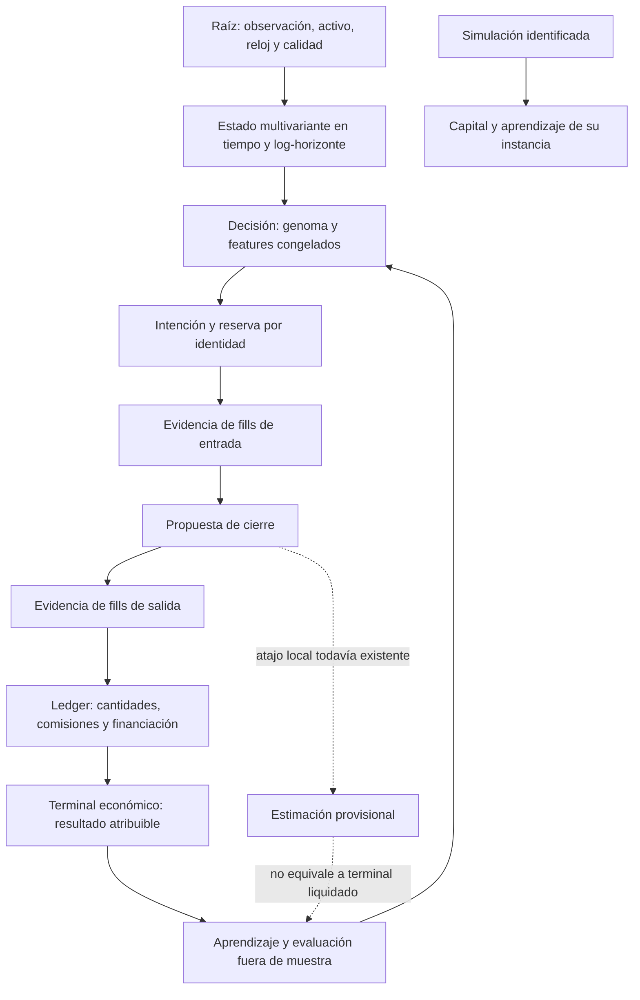

# Auditoría científica XXIX — procedencia del resultado, continuidad temporal y pérdida de evidencia

Fecha: 25 de septiembre de 2026. Rama observada: main; HEAD local 59a76de4. Árbol compartido con modificaciones anteriores y concurrentes. Esta adenda no sustituye los informes ni la matriz histórica de 305 puntos. [Artefacto estructurado XXIX](<C:/Users/jhona/Documents/Proyectos/Trader Gemini/docs/artifacts/auditoria_fundamentos_XXIX_2026-09-25.json>).

## 1. Dictamen y alcance real

Se reproducen y corrigen cuatro defectos acotados del flujo de cierre: atribución de capital/aprendizaje a entradas no confirmadas; publicación de cierres simulados en archivos compartidos; ingestión doble de recompensa en el actualizador denominado PPO; y lectura del horizonte temporal después de borrarlo. No son cuatro certificaciones sistémicas: FMT-225 y FMT-227 quedan parcialmente contenidos, FMT-228 y FMT-229 se reparan en el consumidor inspeccionado.

La diferencia entre backtest, demo y producción no se explica únicamente por la calidad de un genoma. Si una recompensa pertenece a una entrada que no se ejecutó, si el evaluador escribe en el dataset usado por otro proceso, si una observación se cuenta dos veces o si el horizonte se sustituye por un valor constante, el propio circuito de evaluación deja de representar la política que dice medir. Añadir complejidad matemática antes de controlar estas conexiones amplificaría la incertidumbre sobre la causa de los resultados.

Se añade una reproducción del lector mmap que pierde un frame publicado tarde. También se documentan dos problemas estáticos: acceso a cabecera antes de validar tamaño y un kill-switch que suprime la gestión local de cierres. No se elimina ninguna protección para aumentar artificialmente el número de operaciones.

### Cobertura y límites

Inventario histórico conservado: 1.119 archivos versionados, 289 Rust y 24 manifiestos Cargo. Nueva lectura integral preexistente: storage-engine/src/mmap_bus.rs, 450 líneas del snapshot. Cobertura acumulada: **144/289 Rust; 145 pendientes de lectura integral**. Los archivos nuevos no inflan ese denominador.

Se releyeron íntegramente immune_system.rs y online_ppo.rs; ya estaban cubiertos en III e I. Se revisó kelly.rs, previamente incluido en I. En lib.rs del núcleo, god_engine.rs del host, position.rs y config.rs se inspeccionaron rutas concretas, no todas sus líneas. Una búsqueda de llamadas a constructores no equivale a leer íntegramente sus consumidores. Tampoco se declara completa la auditoría de archivos no Rust.

Archivos nuevos: outcome_context.rs, close_outcome_contract.rs y mmap_open_diagnostics.rs. Fuentes existentes modificadas en esta ronda: lib.rs del núcleo, immune_system.rs y god_engine.rs. No se modificó mmap_bus.rs ni online_ppo.rs. Las rutas, hashes y estados se fijan en el artefacto.

## 2. Matriz de resolución de esta ronda

| ID | Prioridad | Estado | Contrato |
|---|---|---|---|
| FMT-225 | P1 | Contención parcial ampliada | Entrada incierta no puede producir evidencia económica acreditada |
| FMT-227 | P1 | Contención parcial | Simulación no publica cierres en canales de entrenamiento compartidos |
| FMT-228 | P1 | Corregido en el consumidor | Un cierre ingresa una sola observación en la EMA de recompensa |
| FMT-229 | P1 | Corregido en el consumidor | Kelly conserva el horizonte anterior al cierre |
| FMT-230 | P1 | Abierto, reproducido | El lector mmap consume una reserva antes de su commit |
| FMT-231 | P1 | Abierto, análisis estático | La cabecera mmap se interpreta antes de validar longitud |
| FMT-232 | P1 | Abierto, riesgo de diseño estático | Kill-switch global también impide proponer cierres defensivos |

FMT-227…232 son seis entradas documentales nuevas, no seis incidentes financieros demostrados ni una suma deduplicada sobre los 305 históricos. P1 expresa relevancia del contrato; no probabilidad cuantificada ni pérdida monetaria estimada.

Se mantienen, entre otros, FMT-006, 052, 060, 113, 175, 185, 187, 188, 189, 215, 216, 219 y las partes abiertas de 222…226. No se repitió la prueba inestable de promoción FMT-216.

## 3. Paradigma de grafo vivo: de la raíz a la evidencia terminal

La topología causal deseada distingue estas entidades. Las flechas de ejecución son contratos pendientes de completar, no afirmaciones de implementación íntegra.

La mejora XXIX introduce procedencia mínima y evita varios efectos laterales. No implementa aún los nodos completos I/E/X/L. Un booleano de confirmación de entrada no transporta cuenta, generación, fill, precio, cantidad ni comisión. Por eso el nombre del nuevo contexto live es ExchangeLocalEstimate: declara la limitación en lugar de denominarlo resultado liquidado.

Continuidad del mercado y estados discretos de un protocolo no son conceptos incompatibles. Un ACK, una reserva o una liquidación son hechos contractuales. Separarlos no reintroduce motores scalping/swing ni clases de volatilidad.

## 4. FMT-225 — Contabilidad y aprendizaje sin evidencia suficiente de entrada

**Evidencia:** [cierre y gate del núcleo](<C:/Users/jhona/Documents/Proyectos/Trader Gemini/crates/god-engine-core/src/lib.rs:1598>), [contrato de procedencia](<C:/Users/jhona/Documents/Proyectos/Trader Gemini/crates/god-engine-core/src/outcome_context.rs:5>) y [selección explícita en el host](<C:/Users/jhona/Documents/Proyectos/Trader Gemini/src/bin/god_engine.rs:2734>).

Antes, was_exchange_confirmed protegía una métrica de PnL, pero no toda la cadena: capital, resultado direccional, modificación epigenética, espectro, ensambles, calibradores, recompensa, muestras y otros aprendizajes podían avanzar. El contador visible podía negar la operación mientras el estado que decide futuras operaciones ya había aprendido de ella.

**Reproducción:** arena aislada con capital 100, posición local long a 100, cantidad 1, margen 10 y entrada no confirmada. Se llama al cierre real de process_tick_dual con bid 101,1; no se sustituye la función económica por un mock. Antes, el capital termina en 100,9798. Tras el gate permanece en 100, con trade_count y reward_ema sin actualizar. Se conserva la propuesta de salida y el slot local queda cerrado. Una segunda prueba usa pérdida y tensor para verificar ausencia de CSV y trauma; otra conserva el cálculo de un segundo activo con entrada confirmada.

**Contrato nuevo:**

| Procedencia | Flag de entrada | Aprendizaje local del cierre | Publicaciones compartidas de ese cierre |
|---|---:|---|---|
| IsolatedSimulation | false | Sí | No |
| IsolatedSimulation | true | Sí | No |
| ExchangeLocalEstimate | false | No | No |
| ExchangeLocalEstimate | true | Sí, estimación legacy | Sí, estimación legacy |

El gate incrementa diag_unverified_close_total y sale del recorrido de slots; no retorna prematuramente de toda la función ni convierte el veto de entrada en veto de la propuesta defensiva. El control es local al resultado, no una penalización global a los demás activos.

**Interpretación contable:** para cantidad q, dirección d∈{−1,+1}, entrada P_e y salida estimada P_x, el núcleo usa una magnitud equivalente a G=d·q·(P_x−P_e). Calcula net_realized=G−fee_exit y net_trade=net_realized−fee_entry. La separación evita descontar dos veces la comisión de entrada si ya redujo capital al abrir. Las pruebas nuevas abren con fee_entry=0; no certifican conservación con comisiones heterogéneas, funding o conversiones entre divisas.

**Qué sigue abierto:** el slot y used_margin cambian antes del nuevo gate. No existe aquí devolución de reserva por ID, transacción de cartera, gestión completa de entrada pendiente ni fill de salida. El host aún usa flags cuyo significado puede ser más débil que una ejecución y puede atribuir un resultado antes de enviar/liquidar el cierre. El contexto persiste al cambiar de proveedor; no acredita generación de cuenta. La rama confirmada conserva capital y aprendizaje sobre precio estimado, no sobre una liquidación real. La reparación de este contrato completo exige ledger, idempotencia e identidad de ambos extremos.

**Criterio de cierre:** para cada cuenta/intención/generación, sólo los fills reconciliados contribuyen al ledger real; una reserva pendiente no se libera por una lectura ausente; el feedback acredita cantidades cerradas y comisiones una sola vez. Los estados inciertos no se etiquetan como pérdida ni ganancia del modelo.

## 5. FMT-227 — El evaluador compartía salidas con el circuito que debía evaluar

**Evidencia:** [constructor aislado por defecto](<C:/Users/jhona/Documents/Proyectos/Trader Gemini/crates/god-engine-core/src/lib.rs:158>), [publicación mmap del cierre](<C:/Users/jhona/Documents/Proyectos/Trader Gemini/crates/god-engine-core/src/lib.rs:1676>), [dataset](<C:/Users/jhona/Documents/Proyectos/Trader Gemini/crates/god-engine-core/src/lib.rs:1770>) y [persistencia diferida del sistema inmune](<C:/Users/jhona/Documents/Proyectos/Trader Gemini/crates/metacortex-engine/src/immune_system.rs:40>).

La reutilización de GodEngineCore por backtest y evolución también reutilizaba rutas relativas de salida y, si estaba inicializado, el escritor mmap global. Una arena independiente no aislaba archivos, writer global ni directorios. Simular una pérdida con un tensor válido producía una fila en data/dark_alpha_dataset_XXIXUSDT.csv dentro del directorio de prueba. En una ejecución que compartiera CWD con el producto, ese tipo de emisión podría mezclarse con datos consumidos por otro proceso. Se demuestra la emisión; no se afirma haber medido su frecuencia histórica productiva.

**Cambio:** new conserva aprendizaje local y métricas de su arena, pero el cierre no publica por mmap, CSV ni trauma. El host selecciona explícitamente ExchangeLocalEstimate. LivingImmuneSystem::new_deferred construye rutas sin crear directorios; los métodos que realmente persisten crean su destino al usarse. new mantiene la compatibilidad de creación inmediata para sus otros consumidores.

**Pruebas:** pérdida simulada con tensor, constructor por defecto incluso con flag de entrada true, ausencia de directorio memoria y CSV, y mantenimiento del aprendizaje local. El escritor mmap global no se inicializa en estas pruebas: su exclusión se verifica por el gate de código, no mediante una prueba interproceso. La regresión inmune existente comprueba que el consumidor autorizado sigue pudiendo grabar y generar en un temporal propio.

**Límites:** esto es aislamiento de efectos de cierre enumerados, no sandbox general de GodEngineCore. Siguen existiendo lecturas de modelos, registro global de símbolos, estado compartido potencial, otras rutas de telemetría y evaluadores cuyas salidas tienen que auditarse aparte. No se da por válida la separación demo/prod sólo por el enum. FMT-052 sobre esquema/procedencia de muestras y FMT-060 sobre tests inmunes que sólo validan literales siguen abiertos.

**Cierre sistémico:** sink inyectado y versionado por run/cuenta/entorno, con schema, sample_id, decision_id, policy/genome_id y tiempo de disponibilidad. Los simuladores deben escribir únicamente en su run; cualquier importación al entrenamiento vivo requiere un contrato deliberado y comprobable.

## 6. FMT-228 — Doble ingestión de recompensa y falsa equivalencia con PPO

**Evidencia:** [punto de eliminación de la ingestión duplicada](<C:/Users/jhona/Documents/Proyectos/Trader Gemini/crates/god-engine-core/src/lib.rs:1724>), [actualizador existente](<C:/Users/jhona/Documents/Proyectos/Trader Gemini/crates/dark-alpha-engine/src/online_ppo.rs:90>) y [prueba del cierre consumidor](<C:/Users/jhona/Documents/Proyectos/Trader Gemini/crates/god-engine-core/tests/close_outcome_contract.rs:198>).

Había dos llamadas a update_policy para un mismo cierre. No usaban siquiera las mismas coordenadas de features: una empleaba magnitudes crudas y aceleración; la otra, normalizaciones/proxies distintos. Ambas actualizaban la EMA y los pesos. Se elimina la primera y se conserva una ingestión.

Si m'=(1−α)m+αr, ingerir otra vez la misma observación produce m''=(1−α)²m+α(2−α)r. Con α=0,05, el peso efectivo de ese cierre pasa de 0,05 a 0,0975. En la reproducción, r=0,009798: la EMA observada antes era 0,000955305, mientras una ingestión debe dar 0,0004899. La prueba falló antes y pasa después.

No es un argumento contra entrenar varias épocas sobre un dataset. El [artículo primario de PPO](https://arxiv.org/abs/1707.06347) define r_t(θ)=π_θ(a_t|s_t)/π_old(a_t|s_t) y el objetivo recortado con ventajas; permite repetir optimización sobre trayectorias recolectadas. Repetir optimización manteniendo la referencia de recolección no significa fabricar una segunda observación económica para su media. Firecrawl permitió contrastar esta distinción; [nota local de fuente](<C:/Users/jhona/Documents/Proyectos/Trader Gemini/.firecrawl/XXIX-ppo-evidence.md>).

**Pendiente FMT-006:** el módulo actual no implementa por ello PPO ni un gradiente acreditado de Sharpe. Conserva una actualización multiplicativa de pesos con clips. El cierre todavía utiliza features de cierre, incluida CVPIN como proxy en una coordenada denominada Hawkes; no equivale al estado congelado de la decisión. También queda la normalización del retorno mediante un piso de notional de 1 en la llamada conservada, que altera la escala para nocionales inferiores. No se arreglan estas diferencias escondiéndolas bajo el nombre del algoritmo.

**Cierre acotado y aceptación futura:** una llamada por cierre local elegible queda cubierta. Exactly-once entre procesos/restarts depende de sample_id y ledger. Una implementación de PPO real requeriría política probabilística, acciones y probabilidades de recolección guardadas, estimador de ventaja definido y validación del objetivo; una regla adaptativa más simple puede ser preferible si se evalúa honestamente.

## 7. FMT-229 — El cierre borraba el horizonte que Kelly debía utilizar

**Evidencia:** [uso corregido de tau_trade_ms](<C:/Users/jhona/Documents/Proyectos/Trader Gemini/crates/god-engine-core/src/lib.rs:1823>), [limpieza del slot](<C:/Users/jhona/Documents/Proyectos/Trader Gemini/crates/quantum-arena/src/position.rs:411>) y [regresión de integración](<C:/Users/jhona/Documents/Proyectos/Trader Gemini/crates/god-engine-core/tests/close_outcome_contract.rs:273>).

close_with_fee pone entry_tau_ms a cero. Posteriormente la actualización de Kelly volvía a leer ese campo y, al encontrar cero, usaba 30.000 ms. Así el cálculo podía anunciar dependencia continua del horizonte mientras todos los cierres elegían el mismo punto de la curva. No era una discrepancia cosmética entre nombres legacy; era pérdida causal de un parámetro de la operación.

**Cambio:** se reutiliza tau_trade_ms calculado antes del cierre. Si la entrada no tenía horizonte registrado, se conserva el fallback previo del flujo de gestión; no se inventa otro a posteriori. No cambia el formato serializado del genoma ni sus anclas.

**Experimento:** curva k(τ)=exp(a+b·ln(τ/1ms)), elegida para valer 0,2 a 30s y 0,6 a τ=1.000.000.000ms. Se configuran estadísticas y límites para que el resultado no quede oculto por un clamp final. Antes: Kelly=0,05667194503805592, exactamente el fallback de 30s. Oráculo usando el horizonte de la operación: 0,08623814224061167. Después coincide con el oráculo. Los números describen un fixture, no un dimensionamiento recomendado.

**Por qué importa al genoma:** una derivada local ∂acción/∂gen puede desaparecer porque el lector observa el valor borrado, aunque la curva genética sea correcta. Medir gen→fenotipo→decisión→payload→fill requiere conservar el estado de la decisión y distinguir los tramos donde un límite legítimo está activo de aquellos donde un bug anula el gen.

**Límites:** la posición guarda τ como entero en milisegundos; el snapshot completo y el consumo de exchange_confirmed aún no forman una transacción. La fórmula posterior de Kelly conserva supuestos binarios, heurísticas de capital, pisos y límites; esta corrección no acredita optimalidad multiactivo ni elimina todos los regímenes discretos. Su pendiente espectral tampoco demuestra soporte estadístico a 1ns o 100 años.

## 8. FMT-230 — Una reserva del anillo se trata como evidencia ya consumida

**Evidencia:** [reserva del writer](<C:/Users/jhona/Documents/Proyectos/Trader Gemini/crates/storage-engine/src/mmap_bus.rs:150>), [avance del lector](<C:/Users/jhona/Documents/Proyectos/Trader Gemini/crates/storage-engine/src/mmap_bus.rs:325>) y [diagnóstico reproducible](<C:/Users/jhona/Documents/Proyectos/Trader Gemini/crates/storage-engine/tests/mmap_open_diagnostics.rs:6>).

Secuencia reproducida:

1. El escritor incrementa head para reservar el slot.
2. El slot está en progreso: seq impar.
3. El lector observa head, descarta ese frame y aun así incrementa last_read_idx.
4. El escritor completa el mismo slot con seq par y payload válido.
5. El lector original no vuelve a él porque ya avanzó hasta head.
6. Un lector nuevo sí recupera el frame y el payload 0,125.

La prueba es determinista y monohilo, mediante fases sucesivas sobre un mmap temporal. No necesita provocar una carrera de datos para demostrar el error de cursor. Su pase **confirma que la deuda sigue presente**.

Descartar una copia posiblemente inconsistente es razonable; consumir definitivamente su posición de lectura no lo es si se promete entregar evidencia de aprendizaje. Que una pérdida de frames sea tolerable para un panel no la hace tolerable para resultados usados por un optimizador. Si la demora de publicación se correlaciona con carga o volatilidad, la muestra podría además sesgarse; esa correlación es hipótesis, no un efecto medido en esta ronda.

No se parchea con un bucle ilimitado: podría bloquear al lector ante un escritor muerto. El contrato necesita secuencia absoluta por slot, distinción reserva/commit, detección de overwrite, cursor/watermark, política explícita de retry/gap y contador de pérdidas. Una cola durable para hechos económicos puede ser más adecuada que telemetría best-effort; debe decidirse por requisitos de durabilidad/latencia, no por etiqueta HFT.

## 9. FMT-231 — Validación del archivo posterior a la lectura de su cabecera

**Evidencia:** [creación y carga de AtomicUsize](<C:/Users/jhona/Documents/Proyectos/Trader Gemini/crates/storage-engine/src/mmap_bus.rs:286>) precede a [validación de tamaño](<C:/Users/jhona/Documents/Proyectos/Trader Gemini/crates/storage-engine/src/mmap_bus.rs:300>).

Una apertura satisfactoria de mmap no garantiza que el archivo contenga al menos una cabecera del tipo asumido. El código construye una referencia tipada y carga head antes de comprobar la longitud necesaria. Un archivo truncado, incompatible o sustituido no debería alcanzar ese acceso. Hallazgo estático; no se ejecutó deliberadamente un caso que accediera fuera de la región válida ni se atribuye un crash observado.

El formato tampoco lleva en esa cabecera una validación explícita de magic, versión, tamaño de frame, endianness o generación de archivo. El lector usa usize de la arquitectura del proceso. Estos detalles requieren un contrato de wire format y de migración, no sólo mover un if.

**Cierre mínimo:** comprobar el tamaño de cabecera antes de toda conversión/acceso, validar esquema y capacidad, distinguir archivo no listo de corrupción y manejar el cambio de generación. Probar truncamientos después de introducir guardas seguras; revisar operaciones unsafe y concurrencia por separado.

**Deuda adyacente, no reparada:** el lector salta hasta los últimos 10.000 registros sin emitir un gap tipado; payload no finito se convierte en cero; los frames no identifican activo/decisión/genoma; Send/Sync, volatile y stores SIMD no constituyen por sí solos una demostración de atomicidad y orden de memoria. No se hace aquí una afirmación empírica sobre tearing SIMD ni latencia en picosegundos. FMT-052 sigue aplicando a la semántica de esos frames.

## 10. FMT-232 — Un veto global corta también la propuesta defensiva local

**Evidencia:** [kill-switch en process_tick_dual](<C:/Users/jhona/Documents/Proyectos/Trader Gemini/crates/god-engine-core/src/lib.rs:922>) devuelve (None,None,None) antes del recorrido de posiciones; [process_event](<C:/Users/jhona/Documents/Proyectos/Trader Gemini/crates/god-engine-core/src/lib.rs:678>) tiene otro retorno temprano. El interlock de latencia cercano, en cambio, marca entries_blocked y deja continuar la gestión.

**Riesgo:** si el latch se activa con exposición abierta, el núcleo no produce por estas rutas su cierre de SL/trailing/timeout. Esto no demuestra que la cuenta quede sin protección: pueden existir brackets y otros mecanismos de emergencia. Sí demuestra que no se puede describir ese flag simplemente como “no abrir nuevas operaciones” ni contar la gestión local como defensa activa durante el latch.

No se elimina el return automáticamente. Si la causa es corrupción de datos, continuar decidiendo salidas con esos datos puede ser incorrecto; si la causa es drawdown, puede requerirse reducir exposición por una vía acreditada. Un booleano no expresa esa diferencia.

**Criterio de cierre:** política por causa/propietario, separando admisión de riesgo, gestión de exposición, cancelación y reconciliación. Con posición abierta, probar kill por drawdown, feed inválido, veto manual, proveedor desconocido y fallo de bracket; observar quién conserva la autoridad para actuar, con qué precios y con qué trazabilidad. Esta ronda documenta el flujo estático, sin test end-to-end ni cambio operativo.

## 11. Auditoría de vetos: validez, ámbito y recuperación

| Veto o rechazo | Sentido legítimo | Problema pendiente / prueba exigida |
|---|---|---|
| Falta de evidencia de entrada | No inventar recompensa real | No liberar reserva ni exposición real por ausencia; FMT-225 |
| Procedencia simulada | No contaminar sinks compartidos | No apagar aprendizaje local ni confundir testnet con simulación; FMT-227 |
| Frame en progreso | No consumir copia inestable | Retry/gap en vez de pérdida invisible; FMT-230 |
| Archivo incompleto | No interpretar memoria sin contrato | Validar antes de leer; FMT-231 |
| Kill-switch | Contener la causa de riesgo | No borrar responsabilidades defensivas; FMT-232 |
| Presupuesto de riesgo sin ventaja acreditada | Impedir admisión insegura | Separar exploración autorizada; no inventar alpha |
| Cooldown por resultado | Limitar reincidencia bajo hipótesis explícita | Persiste salto entre 59.999 y 60.000ms en diagnóstico |
| Latencia/feed degradado | Suspender nuevas entradas no fiables | Disponibilidad y evidencia de gestión existente por separado |

Un veto explicable necesita: razón, datos usados, valores/umbrales, unidades, activo/escala, dueño, tiempo de expiración o rearme y acción que bloquea. La tasa de aceptación no es por sí misma la métrica de calidad. Un rechazo puede ser correcto aunque reduzca actividad; quitarlo sin demostrar viabilidad económica y contractual no mejora el modelo.

Las nuevas pruebas no reemplazan la auditoría de todos los filtros. Se reejecutan contratos de posterior inválido, microcapital sin edge y oportunidad factible; también se mantienen diagnósticos de discontinuidad temporal y de API Hawkes. Los diagnósticos verdes de deuda no se contabilizan como reparaciones.

## 12. Teoría y diseños continuos: qué se conserva, qué debe evolucionar

### 12.1 Coordenadas y soporte observacional

Propuesta de especificación, no algoritmo recién implantado: un estado X_a(t,logτ,v,l,c,…) por activo a, tiempo de evento t, escala τ, volatilidad continua v, liquidez l y costes c. Debe acompañarse de máscara de disponibilidad M, incertidumbre U, ventana informativa y edad del dato. Un estado sin observaciones no se transforma en información por interpolarlo.

La función de decisión puede integrar contribuciones sobre logτ con una aproximación finita y error medible. No requiere dos motores scalping/swing ni una rama exclusiva para cada régimen de volatilidad. Una discretización adaptativa sigue siendo discretización: debe declarar error, presupuesto y qué escalas no están identificadas.

Cien años julianos contienen aproximadamente 3,15576·10^18 nanosegundos. Recorrer cada punto no produce observaciones ausentes y exigiría mil millones de pasos por segundo de mercado y activo. Es distinto expresar τ en un dominio amplio, almacenar timestamps de alta resolución y calcular un estado por cada nanosegundo. El núcleo inspeccionado trabaja con eventos y muchas duraciones en ms; no se anuncia soporte end-to-end a nanosegundos.

### 12.2 Memoria, recompensas y tiempo

Para una memoria exponencial continua, α(Δt,τ)=1−exp(−Δt/τ) expresa una constante temporal cuando Δt y τ tienen las mismas unidades. Un α fijo por cierre describe memoria por número de cierres, no por tiempo físico. Eliminar la doble ingestión recupera el contrato por observación, pero no lo convierte en memoria continua temporal.

Antes de cambiarlo hay que elegir qué mide cada estimador: riesgo por tiempo de exposición, estadística por fill, rendimiento por episodio o latencia de servicio. Cada denominador responde a una pregunta distinta. En multiactivo, más actividad en un símbolo no debe convertirse inadvertidamente en el reloj de todo el portafolio.

### 12.3 Genoma y adaptación falsable

Un cambio genético útil debe mostrar trazabilidad hasta una variable de decisión y efecto fuera de muestra, no sólo movimiento numérico del gen. Se propone medir sensibilidad local y experimentos de ablación por activo/escala, con idénticas observaciones causales y costes, registrando clamps activos y fallos de ejecución. FMT-229 es un ejemplo concreto de gen aparentemente vivo que perdía su coordenada temporal.

Deben separarse mejora predictiva, viabilidad de ejecución y utilidad de cartera. Mezclar recompensas simuladas, parciales o desconocidas puede hacer “evolucionar” al sistema hacia el mecanismo de evaluación defectuoso. La adaptación no autoriza por sí misma cambios de producción.

### 12.4 Física, cuántica y problemas del milenio

No se añade una ecuación por sofisticación nominal. Cada candidato interdisciplinario necesita observable, unidades, hipótesis, aproximación computacional, baseline, coste total y prueba falsable de mejora. Las propuestas y fuentes de I–III se conservan; no se presenta esa bibliografía como ya integrada ni se repite una certificación de toda la teoría.

Un espacio de Hilbert clásico, un tensor o una analogía física no prueban computación cuántica ni ventaja frente a algoritmos clásicos. Tampoco una ecuación vinculada a un problema del milenio proporciona una solución general al mercado. La prioridad evidenciada en esta ronda es conservar información, atribuir resultados y validar decisiones; ninguna técnica avanzada puede recuperar por nombre un fill desconocido o una muestra descartada.

## 13. Impacto por los ocho módulos del informe maestro

| Módulo | Aporte XXIX | Lo que todavía impide certificarlo |
|---|---|---|
| 1. Ingestión, parsers, L2 | Relación entre evidencia, reloj y memoria compartida | Completitud L2 y validación integral no reauditadas |
| 2. IA y señales | Una recompensa por cierre; exclusión de cierres no confirmados | Features causales, objetivo PPO y calibración de la población elegible |
| 3. Multiactivo y espectros | Horizonte conservado; test de no bloqueo cruzado | Relojes, covarianza conjunta, soporte por escala y discontinuidades |
| 4. Ejecución/HFT | Se distingue propuesta de cierre de liquidación | Ledger entrada/salida, fills parciales, conciliación y brackets |
| 5. Riesgo/Kelly/genomas | Se repara lectura de τ y se protege feedback | Riesgo monetario q/precio, identidad de reserva y óptimo conjunto |
| 6. Estado, mmap y SO | Reproducción de pérdida de frame; revisión completa de mmap_bus | Cursor, esquema, publicación y garantías de memoria |
| 7. Cuántica/orquestación | Contratos de evidencia y objetivo explícito | Hipótesis y ventaja empírica no acreditadas por nomenclatura |
| 8. Backtest/gobernanza | Aislamiento de salidas de cierre; regresiones reproducibles | Paridad económica, promoción y aislamiento de todas las rutas |

## 14. Verificación ejecutada y preservación

Diez pruebas nuevas: nueve contratos funcionales del cierre real del núcleo y un diagnóstico abierto del lector mmap. Cuatro reproducciones rojo→verde observadas: capital de entrada no confirmada, CSV de simulación, doble EMA y horizonte de Kelly. El resto refuerza los nuevos contratos; no se atribuye rojo→verde a todas las ramas.

Los fixtures operan en memoria y directorios temporales exclusivos. Las pruebas de cierre cambian CWD bajo un mutex en su proceso de pruebas; restauran CWD y borran sólo su temporal validado. No se inicializa el bus operativo ni se cargan cuentas. La prueba mmap usa un archivo temporal propio, no el mapa del motor. Esos temporales se eliminan al finalizar; no se borraron datasets, traumas ni modelos del usuario.

El artefacto registra comandos, resultados distintos y hashes. No se suman ejecuciones repetidas como pruebas nuevas. No hubo consultas de cuenta, envío de órdenes, entrenamiento/promoción operativos, build de god_engine ejecutable, reinicio ni terminación de procesos. Sí se ejecutan actualizaciones de aprendizaje sintéticas para comprobar sus contratos; “sin entrenamiento operativo” no significa que los tests no invoquen el actualizador.

Se verificaron los 41 modelos del snapshot anterior sin diferencias. No hubo commit, push, merge ni fetch. Las referencias remotas no se han verificado. Los errores transitorios de compilación durante el desarrollo no se usan como evidencia de bugs financieros: el estado final requiere check y pruebas exitosos. No se formateó masivamente el árbol compartido.

## 15. Hoja de ruta ordenada por dependencia

1. Completar FMT-225 con ledger de intención/reserva/fills/cuenta/generación; separar estimación de liquidación y dar identidad a cada muestra. Pruebas de entrada pendiente que cruza un cierre, partial fills, restart y cambio de proveedor.
2. Diseñar la política defensiva del kill-switch por causa y autoridad; no retirar su protección sin sustitución acreditada. Probar exposición abierta y bracket fallido.
3. Definir el bus como telemetría best-effort o canal de evidencia económica. Corregir FMT-230/231 con schema, secuencia absoluta y pérdidas explícitas; revisar unsafe y recuperación.
4. Aislar todos los sinks por run y separar demo/prod/simulación. Conservar el aprendizaje local sin permitir publicación implícita de candidatos.
5. Congelar features y política de la decisión, escoger el objetivo del actualizador y validar causalidad/unidades. FMT-006/052 no quedan resueltos por quitar la doble llamada.
6. Extender sensibilidad gen→payload→fill y escalas observables, revisando los clamps y umbrales restantes con ablaciones y presupuesto de error.
7. Completar las 145 lecturas Rust pendientes y el inventario no Rust. Mantener separación entre lectura, análisis, reproducción, reparación local y certificación sistémica.

No se certifica que el proyecto esté libre de fallos, sea universalmente autoadaptativo, tenga ventaja cuántica ni que backtest y producción sean económicamente equivalentes.

## 16. Resultado final de las comprobaciones

**88 pases distintos: 82 funcionales y 6 diagnósticos abiertos. Una prueba de inventario local permanece ignorada explícitamente.** Desglose: close_outcome_contract=9, dfa_contract=2, ml_model_contract=12+1 ignorada, phase_authorization_contract=3, stateful_transition_contract=22; stateful_open_diagnostics=5 de deuda; label_evidence_contract=25, spectral_risk_contract=3, immune_system::tests=1, online_ppo::tests=5; mmap_open_diagnostics=1 de deuda. No se ha ejecutado toda la suite del workspace.

Cargo check offline de god_engine, feature_exporter, train_forest y train_dark_alpha pasa. Tres warnings de evolution-engine permanecen (latest_ts, mode y trades); la construcción de las pruebas de backtest también informa un import Arc no utilizado en continuous_evolution_backtest. No se aplicó cargo fix ni se tocaron esos cambios ajenos. Rustfmt --check pasa para los tres archivos Rust nuevos. git diff --check pasa en las fuentes versionadas intervenidas.

El artefacto incluye la comprobación de hashes de modelos y fuentes y de prefijos documentales normalizados CRLF→LF. El atlas, maestro y XXVIII se amplían con adendas, conservando su contenido anterior. La cobertura de 144/289 no equivale a certificación de los 144 archivos ni del proyecto entero.

Comprobación documental final: 49 hashes (ocho fuentes/tests/nota y 41 modelos), 21 referencias de evidencia, 22 enlaces locales y tres prefijos documentales preservados, sin incidencias. Las adendas añaden 2.654 caracteres al atlas, 6.392 al maestro y 1.193 a XXVIII, medidos como cadenas .NET normalizadas, no como bytes. HEAD local permanece 59a76de4. La referencia de línea sirve para localizar el snapshot auditado; cambios concurrentes posteriores requieren reverificación.

## 17. Adenda de continuidad XXX — actualización sin sustituir este informe

[Informe XXX](<C:/Users/jhona/Documents/Proyectos/Trader Gemini/docs/AUDITORIA_FUNDAMENTOS_CIENTIFICOS_XXX_2026-09-25.md>) y [artefacto XXX](<C:/Users/jhona/Documents/Proyectos/Trader Gemini/docs/artifacts/auditoria_fundamentos_XXX_2026-09-25.json>). FMT-231 pasa de hallazgo estático a reproducción de archivo inválido, incluido un crash de test aislado. Se contiene longitud y se propagan errores, pero formato, concurrencia y continuidad siguen abiertos. FMT-232 pasa a diagnóstico ejecutado sobre el core: el kill-switch también suprime una propuesta local de cierre por stop; no se retiró el veto. FMT-230 sigue reproducido.

Se añaden FMT-233 (preservación de archivo parcial, contenido), FMT-234 (lectura unificada de ownership, corregida en biblioteca auxiliar sin consumidor operativo encontrado), FMT-235 (cero/epsilon de escritura, abierto) y FMT-236 (pérdida de cola sin ACK, abierto). No se interpreta este lector como ledger de fills ni se cierra FMT-225.

XXX ejecuta 30 pruebas funcionales/compatibilidad y cinco diagnósticos abiertos: 35 pases distintos, 22 tests nuevos. Check offline de cuatro binarios pasa. Nueva lectura integral ledger.rs (294 líneas base): cobertura acumulada 145/289 Rust, 144 pendientes. 41 modelos sin cambios. Las cifras de XXIX conservadas arriba corresponden a aquella ronda, no se suman como pruebas únicas de XXX.
