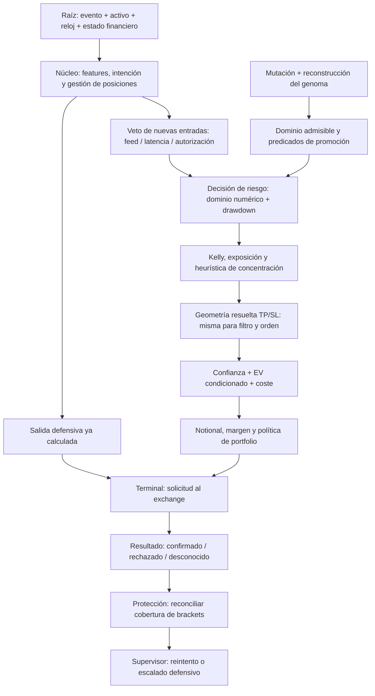

# Auditoría científica XXV — contratos de veto, rechazo y factibilidad espectral

Fecha: 2026-09-25. Continuación aditiva de XXIV. Rama local main, HEAD 59a76de4. No certifica seguridad integral, rentabilidad, continuidad temporal de extremo a extremo ni ventaja cuántica.

## 1. Dictamen y alcance verificable

Se corrigieron tres familias de defectos locales: geometría aceptada distinta de la evaluada, entradas numéricas que provocaban aprobación improcedente/pánico, y clasificación de incertidumbre de ejecución como rechazo confirmado. Se conservan las barreras de riesgo, margen, drawdown, fricción, correlación heurística y promoción. Un veto no es incorrecto por ser discreto: una restricción de ejecución o un presupuesto explícito necesita una frontera. Lo incorrecto es aplicarla a magnitudes distintas, datos desconocidos, hipótesis no satisfechas o un estado que ya cambió.

Se agregan FMT-211 a FMT-216; se amplían FMT-004, 016, 040/041, 089, 091, 093 y 097. No se renumera ni sustituye la matriz histórica de 305 puntos. Estos identificadores pertenecen a la serie de fundamentos científicos; no se suman automáticamente a los 305 como problemas independientes.

Cobertura acumulada declarada: 141 de 289 archivos Rust preexistentes con lectura completa; 148 pendientes. Base histórica: 1.119 archivos versionados y 24 Cargo.toml. Esta ronda completa risk-engine/src/lib.rs y quantum-arena/src/protection_health.rs, antes no acreditados como completos. Se releyeron guard.rs, correlation_guard.rs, orchestrator.rs y feed_health.rs. Las inspecciones del host, núcleo, cliente y genoma son dirigidas: no cuentan como lectura íntegra nueva. Los cuatro archivos de pruebas creados tampoco inflan el denominador histórico.

La petición de revisar todos los archivos sigue abierta. No sería profesional equiparar búsquedas rg, compilación o nombres de módulos con auditoría exhaustiva de todos sus comportamientos.

## 2. Paradigma de grafo vivo: raíz, decisión y terminal

El siguiente grafo muestra las rutas inspeccionadas, no el inventario completo del sistema:



El núcleo devuelve closed_order cuando entries_blocked está activo; no lo elimina en ese retorno. Véase [frontera de entradas](<C:/Users/jhona/Documents/Proyectos/Trader Gemini/crates/god-engine-core/src/lib.rs:2397>). El test ejecutado de feed stalled verifica que no aparecen entradas y que la inferencia sigue actualizándose; no prueba una posición abierta con cierre de emergencia ni todos los caminos previos de kill switch.

Un nodo raíz debe aportar identidad de activo, unidad, fuente, tiempo del evento y tiempo de disponibilidad. Un nodo de decisión debe conservar qué estado y versión evaluó. Un nodo terminal debe relacionar la intención con orden, fills y desenlace. Los contadores agregados actuales no constituyen ese grafo causal completo.

## 3. Resumen de resolución

| Hallazgo | Prioridad | Estado de esta ronda | Evidencia decisiva |
|---|---|---|---|
| FMT-211 | P1 | Contrato local reparado; calibración y presupuesto final abiertos | TP 100,01 / SL 99 / entrada 100 aceptado con EV bruto negativo |
| FMT-212 | P1 | Dominio numérico parcialmente reparado | Confianza infinita aceptada; clamp Kelly inválido provoca pánico; pico NaN permite admisión |
| FMT-213 | P1 | Clasificación local reparada; outcome tipado pendiente | AMBIGUOUS -1007 y request-id-2019 incrementaban evidencia de rechazo |
| FMT-214 | P1 | Abierto y reproducido | Orden devuelve L=4,121212121212122 tras redondeo inicial |
| FMT-215 | P2 auxiliar | Abierto, alcance acotado | Pico desconocido, capital inválido y límites uno tienen semánticas inconsistentes |
| FMT-216 | P1 de aseguramiento | Abierto y determinista | Mutación semilla 199/tasa 0,5 produce banda vacía; test aleatorio existente exige cero rechazos |

P1 indica impacto potencial sobre admisión, ejecución o aseguramiento. No significa que se haya medido una pérdida real ni frecuencia de ocurrencia en producción.

## 4. Matriz de vetos: qué protege cada uno y qué no demuestra

| Familia inspeccionada | Magnitud / contrato | Evaluación |
|---|---|---|
| Índice de activo y señal Flat | Identidad válida y existencia de propuesta | Justificado; Flat no es necesariamente fallo económico |
| Datos inválidos | Dominio de probabilidad, precio, capital, pico, intervalo Kelly | Justificado; ahora tiene contador propio. No sustituye readiness ni snapshot coherente |
| Drawdown | d=(pico-capital)/pico, fracción de equity | Política explícita, pero interpolar el gen hacia 0,85 en cuentas pequeñas cambia severamente la tolerancia |
| Concentración llamada correlación | Número de posiciones abiertas del mismo signo | Heurística de cardinalidad; no estima dependencia ni pérdida conjunta, FMT-016 |
| Spec y mínimo nocional | Metadatos del instrumento y N=margen·L | Restricción real que debe conservarse; alcanzar el mínimo no autoriza a aumentar riesgo |
| Piso TP/SL | Presupuesto coste/stop del modelo | Política, no condición universal necesaria de EV positivo, FMT-041 |
| Confianza | Score comparado con umbral genómico/contextual | Requiere calibración y procedencia; entropía/coherencia no convierten el score en probabilidad |
| EV | p·ganancia−(1−p)·pérdida frente a coste ajustado | Identidad local TP/SL corregida; p debe corresponder a esas barreras y horizonte |
| Impacto de fees | Coste por notional multiplicado por leverage | Aproxima erosión relativa al margen; no es pérdida total ni riesgo de liquidación |
| Margen insuficiente | Margen requerido frente a presupuesto disponible | Justificado, pero las reasignaciones posteriores de leverage rompen el contrato entero |
| Orquestador | Suma de margen y etiqueta global de régimen | Mezcla restricción financiera con veto long por Crash; no equivale a riesgo conjunto multiactivo |
| Feed/latencia | Disponibilidad/oportunidad de datos para entradas | Separar de salidas y analítica; bandera global sigue sin demostrar salud por activo |
| Errores de brackets | Evidencia positiva sobre solicitud rechazada | Incertidumbre no es rechazo. Rechazo transitorio no prueba inviabilidad permanente |
| Promoción de genoma | Dominio finito, bounds, banda admisible y RR condicionado | Rechazar un candidato inviable es correcto; el proceso de búsqueda debe tolerarlo y explicarlo |

No se desactivó ninguna de estas protecciones para aumentar el número de operaciones. Tampoco se añadió un umbral financiero nuevo sin justificación: los nuevos límites de validación expresan dominios ya declarados y relaciones de orden de precios.

## 5. FMT-211 — El filtro económico aceptaba una geometría y devolvía otra

**Evidencia:** [resolución única de objetivos](<C:/Users/jhona/Documents/Proyectos/Trader Gemini/crates/risk-engine/src/lib.rs:653>), [EV](<C:/Users/jhona/Documents/Proyectos/Trader Gemini/crates/risk-engine/src/lib.rs:760>), [contraejemplo](<C:/Users/jhona/Documents/Proyectos/Trader Gemini/crates/risk-engine/tests/veto_evidence_contract.rs:82>).

**Mecanismo previo.** compute_tp_sl_with_target_rr producía porcentajes de TP y SL. Estos alimentaban EV y la política micro. Sin embargo, después de superar los filtros, intent.tp_price_target e intent.sl_price_target positivos reemplazaban los precios devueltos. No se recomputaba la esperanza con los objetivos explícitos ni se comprobaba su orientación. Un TP long por debajo de entrada o SL long por encima podía sobrevivir. NaN y negativos se trataban como ausencia y daban paso a un objetivo calculado distinto.

**Reproducción no vacua.** El fixture acepta propuestas normales long y short; no basta que todas las entradas terminen rechazadas por falta de metadatos. Con P=100, p=0,9, TP=100,01 y SL=99, ganancia g=0,0001 y pérdida l=0,01:

```text
EV_bruto = 0,9·0,0001 − 0,1·0,01 = −0,00091
EV_neto  = EV_bruto − c < EV_bruto, para c>0.
```

La versión anterior devolvía Long. El mismo contrato se prueba con orientación short simétrica. También se reproducen objetivos iguales al precio de entrada, objetivos del lado equivocado y valores no finitos.

**Corrección.** Resolver una sola vez los precios finales antes de EV. Con d=+1 para long y −1 para short, usar g=d·(TP−P)/P y l=d·(P−SL)/P; exigir precios positivos finitos y g,l estrictamente positivos finitos. Solo cero significa objetivo no especificado. La orden reutiliza esos mismos precios, incluidos objetivos parciales donde solo una pierna es explícita. Los precios válidos explícitos no se sustituyen por otros.

**Impacto esperado y límite.** Se impide aceptar un trade diferente del que supera esta compuerta. No se demuestra que confidence sea P(TP antes de SL), que el exchange conserve los precios tras tick-size/latencia, ni que sizing respete una pérdida máxima usando esa geometría. El normalizador de tamaño todavía usa curvas del genoma; ampliar un SL explícito puede alterar riesgo sin un presupuesto final plenamente unificado. El piso difusivo conserva su veto antes de resolver objetivos explícitos: puede rechazar candidatos cuya geometría explícita difiere de la política calculada. No se relajó esa política sin evidencia.

**Cierre sistémico.** Verificar identidad desde intención hasta payload redondeado y fills; reevaluar exposición, fricción y presupuesto con cantidad/precio finales; calibrar probabilidad conjunta de barreras, censura y horizonte. No declarar cerrado el riesgo económico por haber reparado una igualdad de software.

## 6. FMT-212 — Invalidez numérica no equivalía a abstención trazable

**Evidencia:** [admisión inicial](<C:/Users/jhona/Documents/Proyectos/Trader Gemini/crates/risk-engine/src/lib.rs:181>), [pruebas de dominio](<C:/Users/jhona/Documents/Proyectos/Trader Gemini/crates/risk-engine/tests/veto_evidence_contract.rs:134>).

**Casos confirmados.** Confianza +infinito podía clampearse a certeza y autorizar una entrada. Pico NaN omitía la condición de drawdown. kelly_clamp_min=1,1 hacía que clamp_max.clamp(1,1;1,0) entrara en pánico. Límites invertidos o fuera del dominio podían ser transformados en otros en lugar de rechazarse. Una comparación con NaN no expresa autorización válida.

**Corrección.** Capital y pico deben ser positivos finitos; confidence y win_probability deben estar en [0,1], siendo cero de la segunda el sentinel compatible de no calibrada. Se exige 0≤Kelly_min≤Kelly_max≤1 y drawdown configurado en [0,1]. Se valida precio sin inventar el piso 1e-8. Exposición no finita, fricción no finita/negativa y EV/umbral no finitos producen abstención identificable. La captura de los dos extremos Kelly se reutiliza en la llamada, evitando rereads de esas variables durante su clamp.

**Trazabilidad.** Los 13 índices existentes permanecen estables; se agregan entrada_invalida=13 y geometria_invalida=14. Se prueban atribuciones por dirección y distinción entre invalidez, geometría y EV. La salida final inválida deja de ser un rechazo sin contador. El mensaje del mínimo nocional corrige la unidad: +0,1 son diez centavos, no uno. No cambia ese buffer.

**Pendiente.** No se valida en un snapshot atómico todo el estado ni cada gen. El umbral base de confianza, las variables epigenéticas y otros datos todavía pueden carecer de calidad/readiness explícitas. La transformación micro hacia drawdown 0,85 sigue vigente. Los extremos 0/1 del gen tienen semánticas heredadas que no se redefinen aquí. Invalidar un pico requiere reconstruirlo con evidencia; rechazar correctamente no repara el historial.

**Cierre.** Configuración versionada e inmutable por evaluación, estados Unknown distintos de valores numéricos, contrato de inicialización de picos, presupuesto de riesgo compartido y tests de concurrencia. La API de retorno sigue siendo ValidatedOrder/Flat, no un resultado tipado con todos los inputs y motivos.

## 7. FMT-213 — Un patrón de texto se promovía a evidencia de rechazo confirmado

**Ruta causal inspeccionada.** [Clasificador y diario](<C:/Users/jhona/Documents/Proyectos/Trader Gemini/crates/quantum-arena/src/protection_health.rs:50>) → note_rejection en colocación de brackets del host → [streak del supervisor](<C:/Users/jhona/Documents/Proyectos/Trader Gemini/src/bin/god_engine.rs:2578>) → posible cierre de emergencia tras el límite. El supervisor también exige gap de protección; un falso positivo aislado no implica por sí solo que haya ocurrido un cierre real.

**Defecto.** El escáner aceptaba cualquier guion seguido de cuatro cifras con cierta frontera derecha. No exigía origen estructurado ni frontera izquierda. Por eso un identificador request-id-2019; podía contar como rechazo. También contaba AMBIGUOUS: code=-1007 timeout. Confundía un código existente con una conclusión sobre ejecución.

**Fuente primaria.** Binance define errores con code y msg; -1006 y -1007 dejan desconocido el estado de ejecución. -1000 es un error desconocido, no evidencia positiva de rechazo. Los mensajes pueden variar. [Documentación oficial de errores](https://developers.binance.com/en/docs/products/derivatives-trading-usds-futures/error-code). La documentación se obtuvo con Firecrawl el 2026-09-25; HTTP 200, caché del mismo día. Se conserva nota de paráfrasis en .firecrawl/XXV-binance-error-evidence.md, ignorada por Git.

**Corrección.** Se admiten envelopes JSON estructurados y formatos legacy anclados identificados, incluido el formato actual REJECTED code=… msg=…. Se excluyen AMBIGUOUS y códigos -1000/-1006/-1007. Un número dentro de msg sin code ya no acredita rechazo. Los textos err -2019 y trailing -4182. dejan de clasificarse: no hay caller de colocación identificado que necesite esos textos sin procedencia. Las pruebas antiguas los movieron a ejemplos negativos; no se eliminó su cobertura. note_rejection ahora devuelve false si no pudo escribir por fallo de lock.

**Límites.** Sigue siendo una frontera de compatibilidad basada en strings; no autentica el origen ni conserva HTTP, endpoint o request ID. El rango histórico -9999..-1000 no es promesa sobre todos los códigos futuros. Rechazo de una solicitud puede ser transitorio y no significa imposibilidad permanente de protección. El mapa es por símbolo, sin pierna de hedge, causa, epoch ni evento idempotente; rejections_of devuelve cero si el lock falla. La bandera dirty y su contador tienen ventana entre comprobación y limpieza. Estos problemas no se han resuelto.

**Cierre.** Outcome tipado de solicitud, identidad y estado Unknown persistente; reconciliar cobertura actual por símbolo/lado; distinguir rechazo transitorio, solicitud inválida y ausencia duradera de protección. Un cambio de clasificación debe validarse con contratos de cliente→host→supervisor, no solo pruebas de cadenas.

## 8. FMT-214 — El mínimo nocional vuelve a introducir leverage fraccionario

**Evidencia:** [candidate_leverage](<C:/Users/jhona/Documents/Proyectos/Trader Gemini/crates/risk-engine/src/lib.rs:810>), [re_lev](<C:/Users/jhona/Documents/Proyectos/Trader Gemini/crates/risk-engine/src/lib.rs:871>), [diagnóstico](<C:/Users/jhona/Documents/Proyectos/Trader Gemini/crates/risk-engine/tests/veto_open_diagnostics.rs:40>).

El redondeo inicial de leverage no es una invariante final. Las dos ramas posteriores pueden reemplazarlo por cocientes continuos para cubrir mínimo nocional o margen. La segunda también usa techo 50/exchange sin reutilizar necesariamente el máximo del genoma ni el techo contextual anterior.

Reproducción: capital 13, precio 100, ATR 1, confianza 0,9, tau 60.000, mínimos sintéticos 5. La orden devuelve margen 1,2375 y leverage 4,121212121212122. Su nocional calculado es 5,1; con truncamiento a 4×, respaldar ese nocional requiere 1,275 de margen, aproximadamente 3,03 % más. Es una diferencia contable reproducida, no una pérdida real observada.

El caller no puede asumir que un comentario sobre redondeo garantiza un entero al final. Corregirlo requiere proyectar conjuntamente sobre leverage admisible, lotes, mínimos, margen y pérdida. Redondear hacia arriba para salvar mínimo puede violar riesgo; redondear hacia abajo sin reevaluar cantidad/margen también. Debe admitirse conjunto factible vacío y abstención. Se deja abierto, con prueba explícita que dejará de pasar cuando desaparezca este comportamiento.

## 9. FMT-215 — Helpers auxiliares no comparten la semántica de invalidez ni de límite

**Evidencia:** [guard drawdown](<C:/Users/jhona/Documents/Proyectos/Trader Gemini/crates/risk-engine/src/guard.rs:5>), [racha](<C:/Users/jhona/Documents/Proyectos/Trader Gemini/crates/risk-engine/src/guard.rs:133>), [cluster continuo](<C:/Users/jhona/Documents/Proyectos/Trader Gemini/crates/risk-engine/src/correlation_guard.rs:50>).

Cuatro diagnósticos verdes reproducen deuda abierta:

1. check_drawdown_limit devuelve true con pico NaN y capital válido: confunde ausencia de historia con seguridad.
2. El helper de correlación admite una posición existente con capital NaN porque imputa 13, o sale antes cuando count=0.
3. max_allowed_cluster=1 se transforma como mínimo en 2; count=1 no activa el veto.
4. max_allowed_streak=1 también se transforma en 2; una pérdida no bloquea.

En esta búsqueda, check_drawdown_limit y check_streak_drawdown_limit solo aparecen en definiciones y pruebas, no en un caller productivo encontrado. No se atribuye por ello un bypass productivo de esas dos funciones. El helper continuo de cluster sí se usa desde RiskEngine; el caller además eleva su límite a dos. La nueva validación de capital/pico en la entrada de RiskEngine reduce un camino de invalidez, pero no cambia el contrato independiente del helper.

Debe decidirse si el dos es una política mínima intencional o una violación de configuración. Si es política, el nombre y contrato deben decirlo, y la configuración no debería anunciar un máximo uno efectivo. Si es un máximo duro del usuario/genoma, el helper no debería ampliarlo. No se escogió silenciosamente una política distinta.

## 10. FMT-216 — El filtro de promoción rechaza correctamente un candidato que el test exige aceptar

**Evidencia:** [test aleatorio preexistente](<C:/Users/jhona/Documents/Proyectos/Trader Gemini/crates/quantum-arena/src/genome_store.rs:608>), [validador](<C:/Users/jhona/Documents/Proyectos/Trader Gemini/crates/quantum-arena/src/genome_store.rs:228>), [reparador](<C:/Users/jhona/Documents/Proyectos/Trader Gemini/crates/quantum-arena/src/genome.rs:2095>), [test sembrado nuevo](<C:/Users/jhona/Documents/Proyectos/Trader Gemini/crates/quantum-arena/tests/genome_gate_open_diagnostics.rs:6>).

Una ejecución de los 66 tests unitarios de quantum-arena produjo 65 pases y un fallo: test_r11_evolution_pipeline_never_blocked_by_gate observó un rechazo entre mil mutantes. Una repetición aislada pasó. La prueba usa rand::rng y conserva solo el total rechazado, sin candidato ni motivo. Su éxito ocasional no demuestra cierre.

Se buscó offline un testigo con mutate_cmaes_seeded, sin promover ni escribir genomas. Semilla 199 y tasa 0,5 producen, tanto antes como después del roundtrip vectorial, banda admisible None. La curva SL reconstruida tiene a=−6,608724033347974 y b=−0,005566305445407774; fee=0,001 y piso=0,0015384615384615385. El diagnóstico conserva esa semilla. Reproduce predicados públicos del validador, no llama al método privado ni ejecuta promote.

La causa exacta del mutante aleatorio de la primera ejecución no puede identificarse sin semilla; el testigo determinista demuestra una clase suficiente de rechazo de la misma cadena, no asegura ser aquel candidato.

**Lógica.** enforce_curve_rr aún mezcla reparación de recompensa/riesgo con garantía de banda. band_taus sustituye banda ausente por [hi_spec,hi_spec], por lo que aprobar la comparación RR en ese sustituto no prueba que haya alguna escala admisible. El paso cero usa el extremo largo aunque la pendiente pueda ser negativa; las reducciones posteriores de SL también pueden vaciar el dominio. El comentario de seguridad por construcción es más fuerte que el contrato observado.

**Decisión.** No eliminar el gate de promoción ni afirmar que cualquier veto de un mutante es bloqueo ilegítimo de inteligencia. En el testigo sin banda, abstenerse es coherente con la política. Se necesita un resultado explícito del reparador: candidato factible o infactible con motivo. Después, resample/rechazo registrado por la búsqueda, o una proyección derivada con constraints conjuntos. Aceptar todos los mutantes y exigir simultáneamente restricciones no garantiza una solución.

**Cierre.** RNG/corpus deterministas, razón y vector del primer rechazo, factibilidad tras toda reparación, pruebas de pendientes positivas/negativas/planas y límites IEEE-754. Decidir primero si el contrato es reparación total dentro de un conjunto demostrado no vacío o generación que puede abstenerse. El test existente permanece sin modificar; la suite completa no se presenta como verde.

## 11. Continuidad, multiactivo y calibración: deuda transversal

### 11.1 Temporalidad

[horizon_tau_ms](<C:/Users/jhona/Documents/Proyectos/Trader Gemini/crates/risk-engine/src/lib.rs:950>) sigue recortando duraciones positivas a 1.000..43.200.000 ms. SignalIntent representa duración en u64 milisegundos; no distingue 1 ns de 2 ns. La matriz de leverage puede convertir la duración original con otra función. Por tanto, un único marcador Continuous no garantiza que las distintas etapas evalúen la misma tau.

Representar una función de tau en un dominio amplio no implica disponer de observaciones ni soporte de ejecución en todos sus puntos. No hace falta un bucle de actualización cada nanosegundo para definir una política continua: hace falta justificar discretización, error, reloj, ausencia y frecuencia efectiva de actualización. No se promete capacidad predictiva sobre 100 años sin datos.

### 11.2 Coherencia, entropía y confianza

El beneficio de coherencia activa solo si spec_coh>0,05 y entropía<0,85, con techo 0,80. Una interpolación suave posterior no elimina esas fronteras. Su comentario anterior atribuía certidumbre física a resonancia entre 32 ondas; se reemplaza por la descripción de lo que realmente hace: modulación heurística de un umbral. No cambia la fórmula ni se infiere que deba suprimirse sin comparación.

El score confidence alimenta la selección y el EV, mientras win_probability se usa en otro cálculo de leverage. No son intercambiables por nombre. Hay que declarar objetivo, población elegible, censura y calibración condicional. Cambiar TP o SL puede cambiar p; expandir recompensa sin recalibrar la probabilidad no crea edge.

### 11.3 Dependencia multiactivo

El veto de cluster no recibe matriz de covarianza, retornos conjuntos, exposición por factor ni cantidades; cuenta posiciones del mismo signo. Dos portfolios con igual número de posiciones pueden tener pérdidas muy distintas; dos lados opuestos tampoco prueban cobertura. Se conserva como guard heurístico, identificado como tal.

El [orquestador](<C:/Users/jhona/Documents/Proyectos/Trader Gemini/crates/risk-engine/src/orchestrator.rs:100>) conserva veto long bajo Crash global. Sumar margen y limitarlo a C·(1−min(drawdown,0,20)) controla colateral, no garantiza drawdown, pérdida al stop o liquidación. Las cargas atómicas individuales no forman por sí mismas un snapshot coherente ni reservan margen de propuestas concurrentes. FMT-091/093 siguen abiertos en esas dimensiones.

### 11.4 Genoma, filtros y paridad backtest/demo

En microcuenta siguen actuando pisos de viabilidad y sustituciones de stop/margen que pueden reducir la influencia de genes. config.min_notional global no equivale al mínimo vigente por símbolo. Las restricciones de representación, política y ejecución deben registrarse separadamente para explicar por qué un genoma no produce el mismo comportamiento entre entornos.

La conexión no se certifica comparando solo el hash del genoma: se necesitan versiones de feature, modelo, política, spec y mecanismo de fill, además de distribuciones de datos/costes. Ninguna de las reparaciones de esta ronda entrena modelos ni demuestra paridad de PnL.

## 12. Diseño científico propuesto, sin añadir fórmulas ornamentales

La decisión debe separar tres conjuntos: observaciones válidas, acciones económicamente evaluables y acciones ejecutables. Para activo i y escala tau, una propuesta puede describirse por dirección d, cantidad q, referencia P, objetivos TP/SL y leverage L. Los contextos multivariantes y sus incertidumbres no deben desaparecer al pasar por una etiqueta de régimen.

Una formulación de contrato, no un optimizador implementado aquí, es:

```text
N = q·P                                  [moneda de cuenta]
m = N/L                                  [moneda de cuenta]
g = d·(TP−P)/P ; l = d·(P−SL)/P           [fracciones]
EV_condicional = p·g − (1−p)·l − c        [fracción por notional]
pérdida_modelada = N·(l+c)                [moneda de cuenta]
A_factible = A_datos ∩ A_exchange ∩ A_margen ∩ A_riesgo
```

El último coste debe descomponerse en fees, slippage, funding y demás flujos según escenario; N·(l+c) no acota gaps ni garantiza fill al stop. p es una probabilidad condicionada al evento y barreras definidos, no una magnitud obtenida automáticamente de Hurst/entropía/coherencia. Si A_factible está vacío, abstenerse es un resultado correcto.

Antes de incorporar teoría de otro ámbito deben precisarse: variable modelada, unidades, supuestos, función de pérdida, datos observables, baseline, experimento fuera de muestra, coste de cálculo y criterio de rechazo. Los problemas del milenio o el adjetivo cuántico no aportan por sí solos un operador computable ni evidencia para trading. Los contratos de unidades, factibilidad conjunta, dependencia y calibración son prerrequisitos de una integración avanzada, no sustitutos simplistas de ella.

Para evaluar si un filtro ayuda: registrar toda propuesta elegible, inputs previos, primer veto y otros predicados evaluables en shadow sin ejecutar. Reportar denominadores por activo/escala/versión y abstenciones por calidad. Los resultados contrafactuales de propuestas rechazadas deben etiquetarse como simulados; no inventar fills ni tratar la selección de operaciones admitidas como muestra imparcial. El orden de vetos censura los contadores actuales y sesga atribuciones ingenuas.

## 13. Estado por los ocho módulos del informe maestro

| Módulo | Aporte XXV | Lo que no se certifica |
|---|---|---|
| 1. Ingestión/L2/normalización | Precio válido antes de admisión; diferencia feed global/activo | Frescura y secuencias completas de todos los feeds |
| 2. IA/señales | Probabilidades en dominio; separación score/calibración | Calibración, arquitectura y totalidad de modelos |
| 3. Multiactivo/horizontes | Identificación de tau recortada y régimen global | Continuidad de toda la decisión y covarianza operativa |
| 4. Ejecución/Binance | Rechazo vs desconocido; leverage final inconsistente | Serialización decimal, fills reales y red de extremo a extremo |
| 5. Riesgo/genomas | EV sobre objetivos devueltos, guardas y testigo de banda vacía | Presupuesto de pérdida final y búsqueda autoevolutiva estable |
| 6. Estado/telemetría | Dos nuevos motivos de rechazo y limitaciones de diario | Atomicidad de snapshots, mmap, concurrencia y p99 |
| 7. Confluencia | Retirada de afirmación de certidumbre física en comentario | Ventaja cuántica o causalidad de coherencia |
| 8. Backtesting/gobernanza | Regresiones, diagnósticos y fallo de suite conservado | Certificación integral o generalización económica |

## 14. Hoja de ruta de rehabilitación 1-a-1

1. Congelar un contrato de acción final: precio, targets, lotes, leverage entero y presupuesto de pérdida. Cerrar FMT-214 sin aumentar exposición para forzar mínimo.
2. Conservar motivo tipado e identidad de rechazo/Unknown por solicitud y pierna. Cerrar la propagación de evidencia de FMT-213 hasta reconciliación.
3. Decidir contrato del reparador de genomas y hacer reproducible FMT-216. No relajar el gate para ocultar una banda vacía.
4. Reemplazar contadores sin denominador por diagnósticos de decisión versionados; evaluar vetos con shadow causal y coste de cálculo medido.
5. Unificar tau efectiva y su soporte observado; detectar explícitamente truncamiento, falta de resolución y extrapolación.
6. Distinguir cardinalidad, margen y pérdida conjunta multiactivo. Mantener controles actuales hasta demostrar un reemplazo que conserve o mejore seguridad.
7. Calibrar probabilidad de primer paso con barreras, censura y costes; conectar esos mismos contratos a backtest, demo y producción.
8. Completar las 148 lecturas Rust pendientes y el inventario no Rust; ningún cierre local sustituye esa cobertura.

## 15. Verificación ejecutada y límites

Nuevas pruebas: 16 contratos funcionales (12 riesgo + 4 protección) y 6 diagnósticos abiertos (5 vetos + 1 genoma). Nueve regresiones distintas se observaron fallar antes de la corrección y pasar después: seis de riesgo y tres de protección. Un primer fixture sin registro rechazaba todo por spec; se corrigió antes de aceptar la reproducción, y los controles positivos long/short pasan. Un error inicial de tipo Arc/Box en el fixture fue corregido; no se cuenta como defecto de producción.

risk-engine completo --lib --tests: 103 pases. Nueve de ellos son diagnósticos abiertos: tres de taxonomía de régimen, uno de top-k de asignación ya existente y cinco de esta ronda. No se cuentan como reparaciones. quantum-arena --lib: 65 pases y un fallo intermitente documentado en FMT-216; el test aislado pasó después, sin cerrar la incidencia. Una invocación --exact con nombre incompleto seleccionó cero tests y no cuenta como evidencia; se repitió con nombre completo.

Además pasan cuatro integraciones de protección, el diagnóstico de genoma sembrado y un test del núcleo de feed stalled/analítica. En total: 164 pruebas funcionales distintas con pase observado y sin fallo observado en esta ronda, 10 diagnósticos abiertos que pasan al reproducir deuda, y una prueba preexistente inestable con fallo y pase observados. No se declara la suite global verde.

cargo check --offline pasa para god_engine, feature_exporter, train_forest y train_dark_alpha. Persisten tres warnings preexistentes en evolution-engine: latest_ts, mode y campo trades. No se midió PnL, latencia productiva ni significancia económica. No se ejecutó toda la suite del workspace.

Las esperas por locks de Cargo se resolvieron sin terminar procesos ajenos. Las pruebas no enviaron órdenes ni accedieron a cuentas. Se usaron arenas y metadatos sintéticos; las advertencias de TG_GENOME_ENV ausente no se solventaron cambiando configuración de producción.

## 16. Preservación y artefactos

Informe asociado: [JSON de auditoría XXV](<C:/Users/jhona/Documents/Proyectos/Trader Gemini/docs/artifacts/auditoria_fundamentos_XXV_2026-09-25.json>).

Dos fuentes productivas intervenidas: risk-engine/src/lib.rs y quantum-arena/src/protection_health.rs. Cuatro suites nuevas. Se preserva la lógica ajena preexistente; el diff contra HEAD incluye cambios anteriores y no representa por sí solo el trabajo de XXV. Se anexan adendas a atlas, maestro y XXIV, sin reemplazar el histórico.

Los 41 modelos coinciden por SHA-256 con el snapshot de XXIV. No hubo entrenamiento, promoción, modificación deliberada de genomas activos, ejecución de mercado, reinicio, cierre de procesos, commit, push, merge o fetch. Solo se verificó el estado Git local; no se puede afirmar que nadie haya resuelto estos problemas en ramas remotas sin inspeccionarlas.

Firecrawl fundamentó la exclusión de estados desconocidos del contador de rechazo. No se incorporaron nuevas librerías, modelos teóricos especulativos ni fórmulas cuánticas. El feedback de la consulta fue rechazado por haber expirado su ventana; no afecta el contenido recuperado y no se reintentó.

La certificación integral permanece abierta.

## 17. Comprobación documental final

Se validaron 27 referencias de evidencia del JSON, 27 enlaces locales entre informe y adendas, 47 hashes de las seis fuentes/tests intervenidos y 41 modelos, y nueve hashes adicionales del snapshot de XXIV. Sin enlaces ausentes, líneas fuera de rango ni diferencias inesperadas en esas comprobaciones.

Los tres prefijos históricos conservan su SHA-256 tras normalizar CRLF→LF. Se añadieron 2.476, 5.099 y 1.289 caracteres de cadena .NET al atlas, maestro y XXIV respectivamente; esas longitudes no son bytes. El JSON conserva longitudes/hashes previos y la comparación de modelos. Rustfmt --check pasó para las seis fuentes/tests de esta ronda; git diff --check pasó para fuentes productivas y documentos versionados intervenidos. La repetición final de las doce regresiones de admisión y cinco diagnósticos de vetos pasó después del formateo.

## 18. Continuación XXVI — estado posterior sin borrar XXV

El [informe XXVI](<C:/Users/jhona/Documents/Proyectos/Trader Gemini/docs/AUDITORIA_FUNDAMENTOS_CIENTIFICOS_XXVI_2026-09-25.md>) contiene parcialmente FMT-214: integer_leverage exacto, techo genómico conservado y comprobación final. El diagnóstico fraccionario se convierte en regresión; presupuesto de pérdida y proyección conjunta siguen abiertos. FMT-217 corrige la aplicación condicional del veto de coste y FMT-218 refuerza el dominio del ejecutor. El tick maker no se exige a un payload MARKET que no lo usa.

Se amplía FMT-175 con pérdida del mínimo después del lote y aumento de cantidad por tolerancia. FMT-219 reproduce el cambio de nocional al aplicar precio maker (40→44). Los tres diagnósticos permanecen abiertos. FMT-215 conserva cuatro diagnósticos abiertos y FMT-216 no se repara ni se elimina del historial; no se relaja la promoción.

XXVI verifica 116 contratos funcionales y 11 diagnósticos abiertos, 127 pases distintos; añade 14 contratos y tres diagnósticos, con ocho rojo→verde conservadores. Check de cuatro binarios pasa. Cobertura 142/289 Rust, 147 pendientes; 41 modelos preservados, sin operaciones de mercado, promoción, entrenamiento, reinicios ni commit/push/merge/fetch. [Artefacto XXVI](<C:/Users/jhona/Documents/Proyectos/Trader Gemini/docs/artifacts/auditoria_fundamentos_XXVI_2026-09-25.json>). No se afirma auditoría integral ni paridad productiva.
