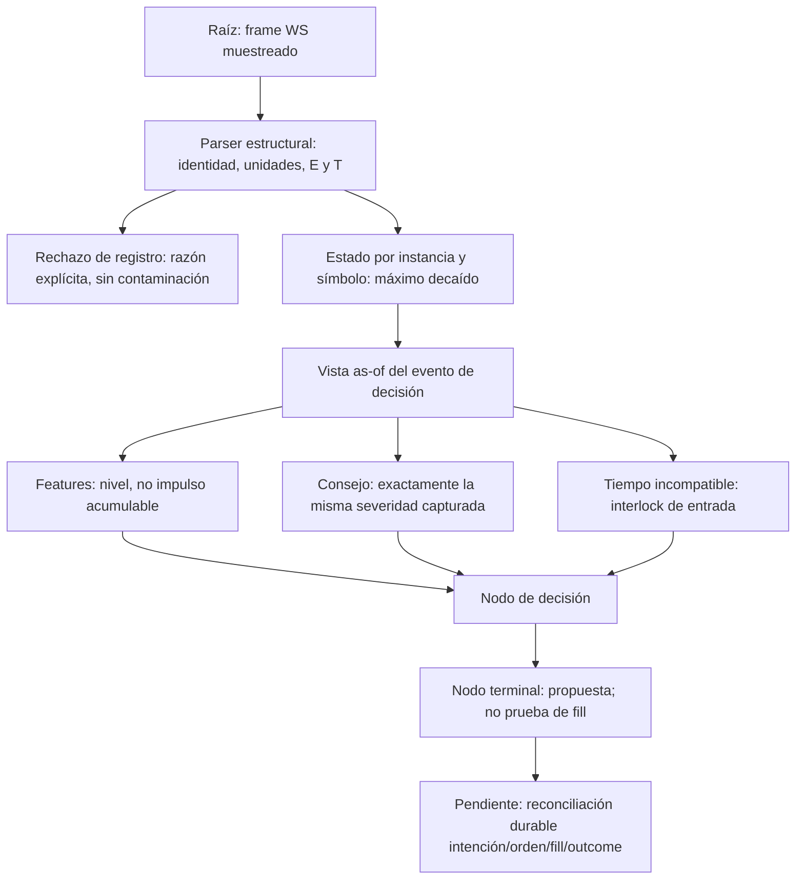

# Auditoría de fundamentos científicos XXXIII — evidencia de liquidación, causalidad temporal y vetos

Fecha: 2026-09-25. Continuación aditiva de [XXXII](<C:/Users/jhona/Documents/Proyectos/Trader Gemini/docs/AUDITORIA_FUNDAMENTOS_CIENTIFICOS_XXXII_2026-09-25.md>). [Artefacto estructurado XXXIII](<C:/Users/jhona/Documents/Proyectos/Trader Gemini/docs/artifacts/auditoria_fundamentos_XXXIII_2026-09-25.json>).

## 1. Dictamen ejecutivo y alcance de certificación

La ronda confirma y repara localmente una desconexión de evidencia crítica: el productor de liquidaciones publicaba una severidad global sin símbolo ni tiempo; el primer consumidor podía adjudicársela a otro activo y vaciarla antes de la deliberación del consejo. El nuevo recorrido conserva identidad, instante y procedencia de ejecución reportada, separa instancias y ofrece lecturas no destructivas. Esto corrige entrega y causalidad local, no demuestra calibración financiera del veto ni completa la arquitectura autoevolutiva.

También se corrige el desbordamiento del filtro de spread para precios finitos y se sustituye el parser operativo de liquidaciones: el anterior confundía cantidad solicitada con ejecución reportada y aceptaba prefijos numéricos incompletos. Las API legacy se conservan por compatibilidad, con diagnósticos de sus limitaciones. No se modifica por ello el algoritmo de todos los parsers del proyecto.

Quedan abiertos: observabilidad incompleta del stream, normalización absoluta no comparable entre activos, semivida fija, ausencia de un historial de liquidaciones equivalente en backtest, control de calidad temporal y conexión incierta entre algunos parámetros y el genoma. Además, el kernel genérico de decaimiento puede retroceder su reloj. Las pruebas de defectos OPEN que pasan acreditan que el defecto se reproduce; no acreditan su reparación.

Esta es una auditoría incremental verificable, no una certificación de todos los archivos, teorías, estrategias o vetos. Continúa la matriz histórica de 305 puntos sin reemplazarla ni reinterpretar sus estados antiguos. La promesa de observar un continuo no se satisface cambiando etiquetas, y una fórmula más avanzada no sustituye evidencia, identificación y validación.

## 2. Cobertura, método y límites

Base conservada de XXXII: 1.119 archivos versionados, 289 Rust preexistentes y 24 manifiestos Cargo. En esta ronda se leen completos dos Rust adicionales: tensor_parser.rs, 220 líneas, y validation.rs, 203 líneas antes del cambio y 205 después. La cobertura acumulada declarada pasa de 151 a 153/289; permanecen 136 Rust pendientes de lectura integral, además de la revisión restante del inventario no Rust. Se revisan los nuevos módulos y pruebas creados en esta ronda. Una búsqueda de referencias no cuenta como lectura integral.

Se relee liquidation_feed.rs y se inspeccionan segmentos de core, host, StatefulEngine, kernel exponencial, consejo y registro/universo. No se reclama una nueva lectura completa de lib.rs del core ni del binario god_engine. Las referencias del artefacto sitúan los contratos modificados; los hashes fijan el snapshot, no certifican semánticamente los archivos.

Método: reproducir antes de reparar cuando existe una ruta anterior equivalente; separar invariantes numéricos, requisitos del protocolo y preferencias de política; mantener pruebas OPEN; usar fixtures locales y comandos offline; comprobar conservación de modelos y prefijos de informes. El error de un fixture que intentaba reordenar slots mediante update_registry se corrigió usando update_dynamic_universe: el registro preserva índices y no era una prueba válida de reasignación. Ese fallo del fixture NO se contabiliza como defecto rojo→verde del producto.

## 3. Contrato externo: qué se observa realmente

La documentación oficial describe snapshots de la última orden de liquidación por símbolo dentro de cada intervalo de 1.000 ms, no todas las liquidaciones. Distingue q, cantidad original; p, precio; ap, precio medio; z, cantidad ejecutada acumulada; l, última cantidad ejecutada; E/T, tiempos de evento/trade. También documenta st=1 UM y st=2 CM tras la migración correspondiente. Fuente primaria consultada mediante Firecrawl, con extracción fresca; el CLI local no estaba disponible y se usó el conector. No hubo consulta de cuenta ni verificación del estado de migración de este despliegue. [Documentación oficial de streams de mercado Binance](https://developers.binance.com/en/docs/catalog/core-trading-derivatives-trading-usd-s-m-futures/api/ws-streams/market#all-market-liquidation-order-streams).

Inferencia de ingeniería adoptada: para snapshots UM, ap × z es el nocional ejecutado acumulado **reportado en ese snapshot**, en unidades de cotización. No es un fill incremental, no debe sumarse ciegamente entre actualizaciones y no es el volumen total del mercado. CM necesita especificación contractual; multiplicar precio por número de contratos como si fuese cantidad de activo no conserva unidades. La inferencia no convierte una moneda de cotización en USD sin un modelo de conversión.

No existe un identificador de orden en el mensaje documentado consultado que permita certificar deduplicación completa entre snapshots. Igualdad temporal de milisegundo tampoco prueba identidad de orden. El sistema mantiene un indicador de presión basado en el máximo decaído, no fabrica un ledger de ejecuciones con esa información.

## 4. Paradigma de grafo vivo y topología de evidencia

El nodo raíz aporta evidencia parcial del mercado; no verdad exhaustiva. El nodo de estado conserva identidad y reloj. El nodo de decisión no puede recuperar la información que la raíz nunca publicó. El nodo terminal de este recorrido sigue siendo una propuesta local: no se le concede autoridad de fill ni de resultado económico confirmado.

El buffer atómico global queda como API de compatibilidad, fuera de los productores/consumidores operativos localizados. La búsqueda en crates y src no encuentra llamadas operativas a bump/take_pending/peek_pending después del cambio; los tests legacy sí las ejercitan deliberadamente. No se amplía esta afirmación a procesos externos, versiones desplegadas ni plugins no presentes.

## 5. Resumen de estado y matriz de esta ronda

| ID | Prioridad | Tipo | Estado acreditado |
|---|---|---|---|
| FMT-249, continuación | P1 | Atribución multiactivo, orden de consumo, evidencia temporal | Entrega local reparada; calibración, historia y salud del feed abiertas |
| FMT-253, nuevo | P1 | Semántica del parser, unidades, integridad de datos | Productor operativo migrado a contrato validado; API legacy y límites de JSON abiertos |
| FMT-254, nuevo | P1 | Identificabilidad estadística, arbitrariedad del veto, paridad de entorno | ABIERTO, con derivación de consecuencias y criterios de cierre |
| FMT-255, nuevo | P2 | Causalidad y dominio numérico del kernel exponencial genérico | ABIERTO reproducible; la nueva ruta no usa sus impulsos para almacenar liquidaciones |
| FMT-256, nuevo | P2 | Overflow e invariancia de unidades del filtro de spread | Cálculo reparado; política de umbral y observabilidad de rechazos abiertas |

La prioridad expresa riesgo del contrato o ruta identificada, no una pérdida monetaria observada. No se cuantificó pérdida real, latencia de producción, tasa de falsos vetos o incremento de rentabilidad. La matriz es una adenda a la anterior, no una nueva numeración de todos los problemas del sistema.

## 6. FMT-249 — evidencia global consumida por el activo equivocado y ausente en el veto

**Causa y mecanismo anterior.** El host reducía cada mensaje a una severidad y la depositaba en un AtomicF64 de proceso. Tanto el camino depth como el camino tick consumían con swap(0). El consejo leía después mediante peek. El payload carecía de símbolo, E, T, lado y vínculo con el ciclo de decisión. Por tanto, el próximo activo podía consumir una observación ajena; el observador posterior podía recibir cero; dos instancias del core compartían evidencia sin autorización de contexto.

**Reproducción válida previa.** Se deposita 0,95 en el buffer global y se procesa un tick de un core aislado sin observación por símbolo. La aserción exigía 0 en dark_alpha y obtuvo 0,95. El fallo se produjo antes de cablear la nueva ruta; después pasa. No es un test de cuenta real ni demuestra una orden incorrecta ya ejecutada.

**Reparación.** [Core: recepción por símbolo](<C:/Users/jhona/Documents/Proyectos/Trader Gemini/crates/god-engine-core/src/lib.rs:366>) resuelve el índice activo, comprueba nuevamente la correspondencia del símbolo y normaliza al nombre canónico del universo. Cada core posee su vector de estados. [LiquidationState](<C:/Users/jhona/Documents/Proyectos/Trader Gemini/crates/god-engine-core/src/liquidation_feed.rs:106>) valida valores y tasa, conserva símbolo/E/T/lado/nocional y ofrece severity_at sin mutación. Una lectura no consume ni refresca evidencia. Una actualización válida no se atribuye al símbolo que posteriormente ocupe el mismo slot.

**Uso común.** El tick captura una vista as-of y la usa para dark_alpha y para [el payload del consejo](<C:/Users/jhona/Documents/Proyectos/Trader Gemini/crates/god-engine-core/src/lib.rs:4581>). En depth también se obtiene la vista del mismo símbolo/reloj. update_macro_features recibe impulso 0: el nivel observado ya está colocado, no debe sumarse una vez por tick. Los tests verifican ambos caminos y repetición al mismo instante. La conexión al campo del consejo se inspecciona en código; no se simula una entrada completa atravesando todos los modelos de producción.

**Orden temporal y repetición.** E menor que el último E se diagnostica Older y no altera el estado. Una observación idéntica al último snapshot se diagnostica Duplicate. Con E idéntico y contenido distinto se conserva el máximo de severidades sin avanzar el reloj y se cuenta ConflictingTimestamp: no se elimina un shock mayor sólo porque dos órdenes podrían compartir milisegundo. No se suma ni se afirma que sean fills distintos. La deduplicación es parcial, no una identidad transaccional.

**Interlock nuevo y su justificación.** Si el as-of de la decisión es anterior a la evidencia disponible, no se inyecta información futura: se cuenta invalid_as_of y se bloquean entradas, dejando continuar gestión y propuestas de cierre. Falta un historial para responder con la observación causal anterior; el interlock es conservador y explícito. El test de cierre usa una posición sintética abierta y una observación futura, y comprueba que el cierre defensivo llega al caller. No demuestra por sí solo que cada otra barrera del sistema permita salidas: el kill-switch global sigue siendo un residual previo.

**Límites.** El vector depende del universo global mutable; las comprobaciones de símbolo evitan el aliasing ensayado, pero no constituyen una transacción de reconfiguración de todo el grafo. Si un activo cambia de slot, puede quedar sin historia hasta una nueva observación, aunque no reciba la de otro activo. No se conserva un historial arbitrario ni se reconstruyen eventos fuera de orden. Un timestamp muy adelantado podría mantener el interlock: falta calidad de reloj/recuperación explícita. reset_engines conserva los estados de liquidación de la instancia; no hay persistencia durable al reiniciar el proceso ni una política completa de gaps de reconexión.

**Criterio de cierre sistémico.** Añadir historia causal y calidad del canal, versionar universo/configuración, medir pérdidas/reordenamiento de eventos y verificar el mismo trace en features, consejo y riesgo. Una simple puntuación no autoriza a declarar resuelta toda FMT-249; se acredita sólo la desconexión local reparada.

## 7. FMT-253 — parser de liquidaciones sin contrato de identidad ni ejecución

**Evidencia anterior.** [TensorParser](<C:/Users/jhona/Documents/Proyectos/Trader Gemini/crates/data-ingest/src/tensor_parser.rs:103>) escanea llaves contando llaves de texto y extrae p/q. No conoce ap/z, símbolo ni reloj en el callback. El ejemplo sintético q=10, p=100, ap=90, z=2 devuelve 1.000 con la API legacy, aunque el nocional de ejecución reportada sea 180. Además, fast_parse_f64 recibe 1e3 y devuelve 1; acepta un prefijo sin acreditar el token completo. Son resultados reproducidos, no hipótesis.

**Consecuencia.** El veto puede inflarse con volumen no ejecutado o atenuarse por parseo numérico incorrecto. El conteo de llaves no modela strings escapados; un wrapper combined puede agrupar varios objetos bajo un único bloque y perder observaciones. La finitud por sí sola no protege de un número incorrecto, finito y plausible.

**Contrato nuevo.** [Decoder validado](<C:/Users/jhona/Documents/Proyectos/Trader Gemini/crates/data-ingest/src/liquidation.rs:131>) interpreta objeto/array raw o wrapper stream/data. JSON malformado invalida el frame antes de emitir snapshots; un error semántico individual rechaza ese registro sin borrar los válidos de un array mixto. Exige identidad no vacía, lado BUY/SELL, E/T enteros positivos con T<=E, números finitos no negativos, q>0 y 0<=l<=z<=q. Si z>0 exige ap>0. El producto ap*z debe ser finito. Una ejecución reportada cero produce cero, no q*p.

**Unidades y compatibilidad.** st explícito distinto de UM se rechaza con UnsupportedContractType. st ausente conserva compatibilidad con el endpoint histórico USD-M; NO es permiso de reutilizar el decoder en cualquier mercado/venue. Un st contradictorio entre niveles también se rechaza. El DTO conserva cantidad original, precio original, precio medio, cantidades ejecutadas, estado y condición legacy para inspección; la observación compacta del core sólo conserva lo necesario para su indicador, no todo el DTO como ledger.

**Cableado.** [Productor del host](<C:/Users/jhona/Documents/Proyectos/Trader Gemini/src/bin/god_engine.rs:2899>) transforma cada snapshot en LiquidationObservation y entrega al core. Las razones de rechazo de frame/registro se registran sin volcar el payload bruto. Los desconocidos del universo no se reasignan a otro activo. Los contadores internos distinguen aceptado, duplicado, anterior, conflicto, inválido, símbolo desconocido y as-of inválido.

**Pruebas y límites.** Hay tests para raw/combined, múltiples activos, strings escapados, UM/CM, overflow, notación científica completa, trailing junk, identidad/tiempo/rangos inválidos y ejecución cero. No se ha hecho fuzzing ni benchmark de cola. serde_json::Value no añade detección de claves JSON duplicadas; queda como límite de integridad del nuevo contrato. X se preserva como texto no vacío, sin certificar semántica de transición de estado. El parser estructural usa asignaciones: no se mantiene una promesa de zero-allocation. Los logs por rechazo y los lookups lineales de símbolo requieren medir carga bajo ráfagas.

**Estado residual legacy.** Las dos pruebas que muestran 1e3→1 y q*p→1.000 siguen pasando porque las API antiguas se conservan. No se usan ya en el productor de liquidaciones localizado. No se ha reparado con esta migración toda la decodificación de trade ni se ha certificado la ausencia de consumidores externos.

## 8. FMT-254 — observación parcial confundida con presión universal calibrada

**Naturaleza del problema.** La fuente muestrea; el código comprime nocional a un escalar; el consejo lo compara con un umbral. Cada transformación pierde información. La autoevolución no puede identificar intensidad total, volumen total o probabilidad de cascada a partir de un snapshot sin modelar el proceso de observación. “No llegó una liquidación” no distingue ausencia de evento, evento no publicado, reconexión, suscripción ausente o pérdida local.

**Fórmula heredada, unidades y significado.** Para n>0, s(n)=clamp[ln(n/n0)/ln(nref/n0),0,1], con n0=1 unidad de cotización y nref=1.000.000. El helper lo denomina USD; esa equivalencia no está demostrada para todas las cotizaciones. Su salida es un score logarítmico acotado: 10.000→2/3, 100.000→5/6, 1.000.000→1. No es percentil, probabilidad, z-score ni fracción de liquidez. Por encima de nref desaparece información sobre magnitud.

**Consecuencia cuantificable del veto actual.** Con el valor por defecto theta=0,85, s(n)>theta implica n>10^(6×0,85)≈125.892,54 unidades de cotización, antes de decaimiento. Esto es una frontera monetaria absoluta equivalente, no un umbral aprendido de fragilidad por activo. La misma cifra tiene significados muy distintos frente a profundidad ejecutable, volatilidad, spread y liquidez de instrumentos diferentes. No se cambia theta silenciosamente: falta el estudio necesario para justificar otro valor.

**Memoria temporal implementada y auditada.** Con lambda=ln(2)/h y h expresada en milisegundos, la nueva ruta mantiene x(t)=max_i[s_i exp(-lambda(t-E_i))] para lambda constante y observaciones aceptadas. La recurrencia x_j=max(x_(j-1) exp(-lambda deltaE),s_j) es equivalente a esa envolvente; se evalúa en eventos, no recorriendo cada nanosegundo. Las lecturas son puras. Si cambia lambda, la implementación envejece el estado con la tasa anterior hasta el siguiente snapshot y aplica la nueva prospectivamente; no reescribe el pasado. La prueba verifica este comportamiento por tramos.

**Máximo, no suma.** Es una agregación idempotente elegida para no duplicar cantidades acumuladas z sin identidad de orden. No conserva volumen ni estima intensidad Hawkes, y descarta la contribución conjunta de shocks menores. Sirve como indicador conservador de mayor shock observado, no como modelo completo de cascada. La política elegida y su limitación quedan visibles en el código.

**Semivida fija, no genómica.** StatefulEngine construye y resetea el kernel con 10.000 ms. No se localizó una escritura operativa que calibre decay_lambda desde el genoma. Con score inicial 1 y theta=0,85, el score decae hasta la frontera en h ln(1/theta)/ln2≈2.344,65 ms si no hay nueva observación dominante. Ese tiempo deriva de parámetros actuales; no es un TTL validado ni una recomendación de trading. No se añade otro TTL arbitrario para “solucionarlo”.

**Paridad de entrenamiento y servicio.** El campo dark_alpha se incluye en el tensor de features, mientras una representación universal conserva la dimensión [9] enmascarada por paridad histórica. La nueva entrega no crea automáticamente datos históricos equivalentes en backtest. Por ello un genoma seleccionado sin la misma observación y política de faltantes puede comportarse de forma distinta en demo/producción aunque la ejecución del código sea correcta. La máscara y el corpus no se alteran en esta ronda para evitar cambiar un contrato de modelo sin reentrenamiento/versionado.

**Multi-activo no significa fusión global indiscriminada.** Esta reparación separa shocks por símbolo. Si se desea riesgo sistémico compartido, debe existir un nodo explícito de transmisión intermercado con dependencias, marcas temporales, exposición, unidades y validación. Eliminar contaminación accidental no equivale a declarar independencia económica entre activos.

**Requisitos de cierre.** Persistir raw/procedencia y política del canal; alinear datos de replay/demo/prod; modelar missingness; definir normalización por liquidez con incertidumbre; estimar memoria por horizonte y activo; evaluar ablation, sensibilidad, falsos vetos y costes fuera de muestra. Debe diferenciarse ausencia de evidencia de evidencia negativa. Los contadores de esta ronda no sustituyen un estado de salud por fuente ni un protocolo completo de reconexión.

## 9. FMT-255 — kernel exponencial genérico con reloj reversible

**Evidencia.** [apply_event y decay_to](<C:/Users/jhona/Documents/Proyectos/Trader Gemini/crates/god-engine-core/src/math_kernels.rs:1062>) sólo envejecen cuando el nuevo timestamp es mayor; apply_event luego asigna siempre last_timestamp_ms al timestamp recibido. Se aplica severidad 1 a t=2.000, después impulso 0 a t=1.000 y se consulta de nuevo t=2.000: el resultado es 0,5 con semivida 1.000, aunque ese instante ya había sido alcanzado. Un evento atrasado ha rejuvenecido el reloj y causa envejecimiento adicional.

**Dominio no defendido.** El constructor divide por half_life_ms sin validar positividad/finitud. apply_event acepta severidad no finita o negativa y suma sin límite de overflow. update_macro_features valida parte de los inputs, pero el kernel público y update_macro_flow no garantizan el contrato completo. No toda función llamada “tensor” dispone por ello de invariantes tensoriales o estabilidad numérica.

**Impacto y alcance.** El defecto queda demostrado para el helper público; no se atribuye una pérdida de producción concreta. La nueva LiquidationState valida su dominio y no usa ese kernel para almacenar impulsos de liquidación; al proyectar a features fija nivel y reloj antes del update con impulso cero. Otros consumidores potenciales del kernel requieren su propia revisión. Se mantiene un test OPEN, no una afirmación falsa de que el kernel fue reparado.

**Diseño de reparación pendiente.** Especificar si un evento atrasado debe rechazarse, almacenarse y reordenarse, o integrarse con peso causal calculado desde su instante; la decisión depende de si los impulsos son sumables y de la política de observación. No basta con clamp al reloj actual porque puede transformar información atrasada en nueva. Añadir constructor/actualización con Result, invariantes de tasa y semántica de acumulación antes de migrar consumidores.

## 10. FMT-256 — un filtro de spread finito puede aceptar por overflow

**Mecanismo anterior.** [validate_book_ticker](<C:/Users/jhona/Documents/Proyectos/Trader Gemini/crates/data-pipeline/src/validation.rs:98>) validaba bid/ask finitos y positivos, pero calculaba mid=(bid+ask)/2. Para bid=6e307 y ask=1,6e308, bid+ask desborda a infinito; spread/mid se vuelve cero y el evento era aceptado. Son entradas de borde sintéticas, no precios observados. El defecto demuestra que validar operandos finitos no valida operaciones compuestas.

**Reparación matemática.** Con 0<bid<=ask se define r=bid/ask, por lo que 0<=r<=1 en máquina. Spread relativo=2(1-r)/(1+r), equivalente a (ask-bid)/mid en aritmética real y sin sumar precios grandes. El numerador está acotado por 2 y el denominador por [1,2]. Se elimina el bypass por overflow, manteniendo la comparación estricta >0,50. La igualdad a 0,50 sigue admitida; también el spread cero con valores máximos y subnormales iguales.

**Verificación.** Dos tests fallaron antes y pasan después: caso extremo e invariancia de clasificación al escalar un mismo book entre 1e-300 y 1e307. Se conserva un test de frontera de política y los tests unitarios anteriores. Esta propiedad se verifica en los casos representables ensayados, no equivale a una prueba exhaustiva de redondeo para todos los f64 cercanos a la frontera.

**Política pendiente.** 50 % es una constante de admisión, no una demostración de que un book es corrupto ni de que ningún mercado pueda alcanzarla. Se corrige esa afirmación documental. Cambiarla o volverla adaptable requiere separar error de feed, iliquidez real, condiciones de ejecución y autoridad de riesgo. El enum aún agrupa cantidad negativa en QtyNotFinite; count_reject es separado de validate y los contadores son globales por razón, no por activo/canal. No se cambia esa API en esta ronda.

**Ruta localizada.** ws_client llama al validador para BookTicker y registra rechazos. No se deduce que toda frontera de disco, REST, replay y depth atraviese esta función; el comentario “todo pasa por aquí” no es una prueba de cobertura universal. La auditoría del grafo completo de validación sigue abierta.

**Residual aguas abajo, observado en código.** Después de validar, ws_client vuelve a calcular (bid+ask)*0,5 para current_price; el core también conserva sumas directas en otros puntos. Por tanto, aceptar un book con bid=ask=f64::MAX no garantiza un punto medio finito en todo el recorrido. Se ha reparado el cálculo del rechazo de spread, no todos los consumidores de precio. El caso extremo no prueba incidencia con precios reales y no se presenta como test end-to-end del socket; requiere una política aritmética compartida y revisión de todos sus callers.

## 11. Auditoría de sentido de vetos y rechazos

| Condición | Clase correcta | Acción actual de la ronda | Límite o trabajo pendiente |
|---|---|---|---|
| JSON malformado, número no finito o producto desbordado | Integridad | No emitir evidencia inválida; razón explícita | Fuzzing, límites de frame y claves duplicadas |
| CM bajo modelo de cantidad UM | Incompatibilidad dimensional | Rechazar registro, conservar UM válidos del mismo frame | Decoder específico y metadata contractual CM |
| Símbolo fuera del universo | Alcance | No adjudicar a otro slot; contador | Nodo sistémico explícito si se desea transmisión de riesgo |
| Snapshot idéntico | Repetición | No acumular ni refrescar reloj | No hay deduplicación completa de órdenes |
| Igual E y distinto contenido | Ambigüedad de identidad | Máximo sin avance temporal; contador de conflicto | Puede ser más de una orden legítima |
| E atrasado respecto del último aceptado | Orden temporal | No reescribir estado causal; contador | Cola/historia para replay fuera de orden |
| As-of anterior a evidencia retenida | Causalidad de decisión | Entradas bloqueadas; cierre defensivo continúa | Calidad de reloj y evaluación contra historia anterior |
| Score de cascada > umbral | Política de riesgo | Mantener autoridad del breaker existente | Score/umbral/semivida no calibrados por activo |
| Spread relativo > 0,50 | Política de admisión | Conservar umbral con aritmética estable | No confundir con certeza de corrupción |
| Ausencia de observación | Falta de evidencia | None en API; score neutro al consumidor existente | No certifica salud ni “no riesgo”; diseño abierto |

La libertad adaptativa no debe eliminar invariantes de integridad, identidad, solvencia o protocolo. Las políticas económicas sí deben revelar objetivo, estimación, incertidumbre, costes y capacidad de adaptación. Un veto debe trazarse desde la observación que lo originó, no justificarse sólo por el nombre del agente.

## 12. Evaluación teórica y ruta hacia un continuo multivariante

El cambio implementa una función continua entre eventos mediante una solución analítica exponencial y la evalúa donde hay nueva evidencia o una decisión. No pretende actualizar físicamente todas las variables cada nanosegundo. E/T provienen en milisegundos; interpolar no crea observaciones de resolución nanosegundo. Ampliar horizontes hacia cien años exige declarar soporte de datos, incertidumbre y límites de identificación; no se obtiene cambiando una unidad de timestamp.

La representación actual del proyecto todavía contiene anchors, clamps y nombres históricos. Esta ronda no erradica los modelos scalp_forest/swing_nn ni los intervalos fijos del core, ni repara de nuevo FMT-244/245. Reetiquetar esos campos sin modificar datos, entrenamiento y ruta de decisión escondería el problema. Debe distinguirse un campo continuo con una aproximación numérica explícita de una colección de regímenes con umbrales duros.

Propuestas de investigación —no capacidades implementadas ni resultados obtenidos—:

1. **Observación parcial antes que una nueva ecuación de señal.** Especificar qué variable latente se quiere estimar y cómo el muestreo del exchange la observa. Un modelo de eventos marcados puede servir como candidato sólo si su proceso de observación y pérdidas están modelados. Ajustar intensidad a un stream censurado como si fuese completo produce un objetivo distinto.
2. **Memoria continua identificable.** Sustituir una semivida única por una medida/banco de escalas con pesos y soporte explícitos, evaluados con estado recursivo y error medible. Definir primero si el agregado es máximo, suma de impulsos o una distribución posterior. Esas operaciones no son intercambiables por llamarlas “tensoriales”.
3. **Dependencia multiactivo explícita.** Representar propagación entre símbolos mediante un grafo temporal con normalización dimensional, exposición y control de actualización asíncrona. Comparar contra un baseline diagonal; una arista sólo debe ganar complejidad si aporta mejora fuera de muestra y estabilidad.
4. **Veto con pérdida y restricciones identificadas.** Separar restricciones de seguridad del coste esperado de actuar/no actuar. Exigir replay causal, latencia, spread, fees, slippage y penalización de falsos bloqueos. La evaluación debe considerar selección de hiperparámetros y cambios de distribución, no sólo WR o retorno de la mejor corrida.
5. **Genoma con trazabilidad de efecto.** Para cada gen: unidad/dominio, lector operativo, sensibilidad observable, política de actualización y versión de datos/modelo. Un gen que no altera el consumidor o se sobrescribe con un literal no ofrece adaptación por el hecho de estar serializado.
6. **Teoría física o cuántica con criterio de admisión.** Identificar un mecanismo concreto, sus supuestos y un estimador computable; contrastarlo con baselines bajo el mismo presupuesto. No se implementan ecuaciones de problemas del milenio por prestigio ni se afirma ventaja cuántica sin modelo, recursos y evidencia verificables. No se ha demostrado aquí hardware cuántico ni aceleración cuántica.

Estas propuestas son una agenda metodológica, no una revisión bibliográfica exhaustiva ni una validación de todas las teorías del repositorio. La consulta externa de esta ronda se concentra en el contrato del feed porque decide directamente qué cálculos tienen significado.

## 13. Módulos sistémicos: raíz a cima sin fingir cobertura

| Módulo | Aporte específico XXXIII | Pendiente que no se oculta |
|---|---|---|
| 1. Ingestión, parsers, L2 y normalización | Contrato de snapshots y reparación de spread | Integridad global de parsers, cobertura de todas las fronteras, calidad del canal |
| 2. Inferencia y señales | Misma severidad causal en tensor y consejo | Distribución de entrenamiento/servicio y contrato de máscaras |
| 3. Multiactivo y espectro temporal | Aislamiento por símbolo, decaimiento analítico por tiempo | Campo multiescala calibrado y transmisión intermercado |
| 4. Ejecución y conectividad | No se confunde snapshot público con fill propio | Rutas nuevas del proveedor, reconexión, reloj, ledger y latencia medida |
| 5. Riesgo, Kelly y genomas | Vetos clasificados por integridad/política; parámetros expuestos | Semivida/normalizador/umbral sin vínculo genómico calibrado |
| 6. Estado, memoria y telemetría | Estado local no destructivo y contadores por razón | Persistencia, calidad, universo transaccional y coste de logs |
| 7. Consejo, confluencia y señales “cuánticas” | Veto recibe el mismo dato que features | Dependencia entre votos y justificación de teoría/umbrales |
| 8. Backtest y gobernanza | Reproducciones, tests OPEN, hashes y documentación aditiva | Historia equivalente y cobertura restante de archivos |

## 14. Verificación y evidencia de preservación

Los resultados finales de comandos, conteos y hashes se registran en el artefacto de esta ronda y en la adenda de cierre al final de este documento. No se interpreta cargo check como ejecución de mercado ni como integración end-to-end.

Se usan cargo test --offline -j 1, fixtures aislados y selección por contrato. No se compila ni relanza el ejecutable operativo; cargo check sólo verifica compilación. Los únicos directorios temporales eliminados por el fixture son sus directorios únicos bajo Temp, con comprobación canónica y prefijo propio. No se borran cachés, modelos o datasets compartidos.

Rama local observada main, HEAD 59a76de4. El árbol ya estaba sucio por múltiples sesiones y se preserva. No hay commit/push/merge/fetch/reset/checkout de esta ronda, ni verificación del remoto. No se afirma que las reparaciones estén publicadas ni que todas las ramas estén integradas.

## 15. Hoja de ruta de rehabilitación 1-a-1

1. Completar salud/procedencia/historia del canal de liquidaciones y medir tasa real de missingness, reordenamiento y decisiones bloqueadas por as-of.
2. Resolver FMT-254 mediante replay equivalente y calibración por activo/escala, conservando autoridad de seguridad y evitando adaptación basada en resultados no reconciliados.
3. Reparar el contrato genérico FMT-255 con semántica explícita de eventos atrasados y dominio numérico, migrando sus consumidores con pruebas.
4. Llevar la evidencia de decisiones a intención/orden/fill/outcome durable y cerrar las limitaciones previas FMT-225/247 antes de ampliar aprendizaje operativo.
5. Corregir población de shrinkage y dependencia de confluencia FMT-243/244, y demostrar soporte/error de representación temporal FMT-245.
6. Auditar el grafo de filtros de todas las fronteras; separar integridad de política y añadir métricas por activo/fuente sin convertir límites duros en condiciones opacas.
7. Continuar los 136 Rust pendientes y el inventario no Rust. Registrar cada lectura completa, sus hallazgos y su estado; no sustituir auditoría archivo a archivo por búsquedas masivas.

Conclusión: hay mejoras concretas y reproducibles en identidad, causalidad y estabilidad numérica. No hay fundamento para declarar al sistema omnisciente, universalmente adaptativo, rentable o íntegramente certificado. La siguiente mejora debe aumentar la calidad de evidencia y la trazabilidad de decisión, no sólo la complejidad nominal de la teoría.

## 16. Cierre de verificación local

| Selección ejecutada offline, serial | Pases únicos | OPEN incluidos |
|---|---:|---:|
| god-engine-core / close_outcome_contract | 23 | 1 |
| god-engine-core / liquidation_state_contract | 7 | 1 |
| god-engine-core / spectral_admission_diagnostics | 6 | 2 |
| data-ingest / liquidation_contract | 9 | 2 |
| data-ingest / tensor_parser::tests | 5 | 0 |
| data-pipeline / spread_validation_contract | 3 | 0 |
| data-pipeline / validation::tests | 5 | 0 |
| metacortex-engine / council_evidence_contract | 34 | 3 |
| metacortex-engine / consejo_seniors::tests | 8 | 0 |
| Total | 100 | 9 |

Resultado: 91 contratos funcionales/compatibilidad y 9 diagnósticos OPEN; 0 fallos finales, 0 ignorados en la selección. Los nueve OPEN cubren kill-switch que bloquea propuesta defensiva, retroceso del kernel, buffer global legacy destructivo, wrap de reloj legacy, dos limitaciones del parser legacy y tres de población/confluencia/horizonte del consejo. No se confunden con reparaciones. Se añadieron 26 tests: 23 funcionales y 3 OPEN. Tres aserciones válidas se observaron rojo→verde: contaminación por buffer global y dos del spread. Los nuevos contratos sin equivalente previo no se presentan como tests ejecutados antes de existir la API.

cargo check --offline -j 1 -p trader-gemini-v5 --bin god_engine --bin feature_exporter --bin train_forest --bin train_dark_alpha termina correctamente. Conserva tres warnings previos de evolution-engine: latest_ts, mode y campo trades. No se ejecutó cargo fix ni se alteraron esos archivos. git diff --check no detecta problemas de whitespace en los archivos operativos modificados de esta ronda.

Los 41 modelos del snapshot XXXII mantienen sus hashes. Se agregan adendas al atlas, al maestro y a XXXII; sus prefijos se validan normalizando CRLF→LF. El artefacto incluye el hash final de este informe, los hashes de fuentes seleccionadas, referencias a líneas, pruebas, coberturas y estados. No se hashea a sí mismo ni se certifican ediciones concurrentes posteriores.

No se enviaron órdenes o solicitudes de cuenta, ni se entrenaron/promovieron modelos operativos. El aprendizaje que aparece en los tests es sintético y aislado. No se mató/reinició el motor, no se construyó el ejecutable operativo y no se publicaron cambios Git. Continúan abiertas la cobertura global, la equivalencia backtest/demo/prod y la calibración del paradigma temporal-espectral.

## Adenda de continuidad XXXIV — 2026-09-25

El estado OPEN de FMT-255 descrito arriba corresponde al snapshot XXXIII y se preserva. [XXXIV](<C:/Users/jhona/Documents/Proyectos/Trader Gemini/docs/AUDITORIA_FUNDAMENTOS_CIENTIFICOS_XXXIV_2026-09-25.md>) repara localmente el kernel: transición completa validada, reloj no reversible y errores tipados de configuración/dominio/overflow; StatefulEngine valida el evento macro antes de publicar campos. El test anterior de retroceso se convierte en regresión reparada. Esto no acredita adaptación genómica de semivida, calidad del feed, historia causal ni trazabilidad de rechazo hasta todas las decisiones.

Se añaden FMT-257–261: discontinuidad de slippage reparada, y problemas todavía abiertos de física de ejecución, comparabilidad Darwin, publicación antes de persistencia e identidad ordinal de genes. Ninguna de estas observaciones reescribe el resultado histórico de los demás defectos. Los costes económicos no se recalibran a ojo ni se habilita evolución legacy.

La ronda XXXIV añade25tests=13funcionales+12OPEN; selección final105pases únicos=92funcionales/compatibilidad+13OPEN;7fallos válidos rojo→verde. Coverage de Rust preexistente sube153→157/289,132pendientes;41modelos conservados. [Artefacto XXXIV](<C:/Users/jhona/Documents/Proyectos/Trader Gemini/docs/artifacts/auditoria_fundamentos_XXXIV_2026-09-25.json>) fija evidencia y hashes posteriores. Sin actividad de cuentas/órdenes, promoción o reinicio operativo ni publicación Git.
