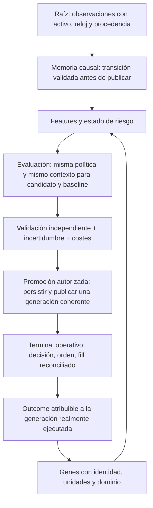

# Auditoría de fundamentos científicos XXXIV — causalidad de memoria, física de ejecución y evolución verificable

Fecha: 2026-09-25. Continuación aditiva de [XXXIII](<C:/Users/jhona/Documents/Proyectos/Trader Gemini/docs/AUDITORIA_FUNDAMENTOS_CIENTIFICOS_XXXIII_2026-09-25.md>). [Artefacto XXXIV](<C:/Users/jhona/Documents/Proyectos/Trader Gemini/docs/artifacts/auditoria_fundamentos_XXXIV_2026-09-25.json>).

## 1. Dictamen

Se repara el contrato local de FMT-255: el acumulador exponencial ya no retrocede su reloj, no admite impulsos negativos/no finitos y no publica una transición parcialmente desbordada. Se añaden APIs fallibles y se migran los dos consumidores macro de StatefulEngine; los rechazos quedan contados. También se repara una discontinuidad del predictor auxiliar de slippage: un OBI negativo casi nulo elevaba el score por un factor cercano a e sin una discontinuidad correspondiente en el mercado.

La revisión completa de cuatro archivos adicionales descubre problemas que explican por qué “tener evolución” no garantiza selección económica válida: comparación de candidatos y baseline bajo distinta política de drawdown, contexto sintético que ocupa campos de datos reales, promoción de memoria antes de persistencia, y genes generados con identidad dependiente del orden del AST. El modelo denominado HyperRealistic sigue siendo una heurística determinista sin cola de órdenes ni probabilidad de fill.

No se cambian silenciosamente costes, límites de riesgo, parámetros de promoción ni genes activos para hacer que un backtest mejore. La reparación numérica está separada de la calibración económica. No se activó Darwin legacy ni se ejecutó su evolución, promoción o hot-swap; no se enviaron órdenes. No se certifican ni omnisciencia, ni ventaja cuántica, ni rentabilidad, ni revisión completa del proyecto.

## 2. Alcance y método

La base de XXXIII era 153/289 Rust preexistentes leídos completos, con 136 pendientes. Nuevas lecturas completas: reality_physics.rs, 261 líneas base; darwin.rs, 778; slippage_predictor.rs, 120; cazador_constantes.rs, 144. Acumulado conservador: **157/289 Rust, 132 pendientes**. Se revisan completos los cinco nuevos archivos de pruebas. Se releen temporal_store.rs, epigenoma_store.rs y horizon_policy.rs sin aumentar cobertura: ya estaban cubiertos por rondas anteriores.

La revisión de math_kernels.rs, StatefulEngine, lib.rs del core, config y el host es dirigida a contratos y llamadas, no se presenta como nueva lectura integral. Los hashes fijan el snapshot y las referencias del JSON fijan el lugar de la evidencia. El inventario base de 1.119 archivos versionados y 24 manifiestos Cargo no se sustituye por una afirmación de “todo revisado”.

Se capturan siete tests fallidos antes de reparar: cinco de reloj/dominio/actualización macro y dos de continuidad del slippage. Se añaden pruebas analíticas de semigrupo, invariancia de unidades de tiempo, simetría y conservación de estado. Los tests OPEN describen fallos que deliberadamente siguen abiertos; sus pases no son reparaciones.

La consulta bibliográfica usa las skills Firecrawl y research-index. El CLI no está disponible; se utiliza el conector. Se verifica el cuerpo de un paper de impacto y se conservan trabajos vecinos recuperados por resúmenes. No se confunde resumen con revisión de texto completo ni una teoría publicada con calibración de este sistema.

## 3. Grafo vivo de causalidad y promoción



La reparación de esta ronda actúa en memoria y en una fórmula auxiliar de coste. Los nodos de evaluación y publicación de Darwin todavía no satisfacen plenamente el contrato del diagrama. La figura es un diseño de referencia y marca dependencias necesarias; no afirma que todo ese flujo esté implementado.

## 4. Matriz consolidada de la ronda

| ID | Prioridad | Estado | Problema principal |
|---|---|---|---|
| FMT-255, continuación | P2 | Contrato local reparado; alcance residual explícito | Reloj reversible, NaN, overflow y actualización macro parcial |
| FMT-257, nuevo | P2 | Continuidad reparada; calibración abierta; helper sin caller operativo localizado | Salto artificial en OBI=0 y falsa interpretación probabilística |
| FMT-258, nuevo | P1 | ABIERTO, ruta de costes localizada | “Física” determinista con límites de dominio y sin modelo de fill |
| FMT-259, nuevo | P1 | ABIERTO, Darwin legacy opcional | Evaluación/población/contexto no equivalentes; significado estadístico insuficiente |
| FMT-260, nuevo | P1 | ABIERTO, promoción legacy condicionada por flags | Memoria cambia antes del éxito de persistencia; publicación no transaccional |
| FMT-261, nuevo | P2 | ABIERTO, transformador auxiliar sin caller operativo localizado | Identidad ordinal y mutación sin contrato semántico del gen |

Esta matriz se agrega a la histórica de 305 puntos; no cambia retrospectivamente sus estados. Prioridad no es prueba de pérdida monetaria ni de explotación observada. Se diferencia ruta activa, ruta opcional y helper auxiliar.

## 5. FMT-255 — transición exponencial causal y numéricamente válida

### 5.1 Fallo anterior y evidencia

El acumulador ejecutaba decay_to(t), sumaba el impulso y asignaba last_timestamp_ms=t, incluso si t era anterior. Evento de magnitud 1 en t=2000 seguido de magnitud 9 en t=1000 dejaba reloj 1000 y nivel 10: una observación antigua se trataba como nueva, y la siguiente consulta en 2000 volvía a envejecer el estado.

Tampoco bastaba comprobar finitud de inputs en algunos callers. Un impulso NaN contaminaba current_severity; dos impulsos f64::MAX desbordaban aunque ambos fueran finitos. La implementación anterior ya había cambiado el reloj cuando el resultado era infinito. update_macro_flow admitía funding NaN y aun así avanzaba la evidencia de severidad.

Cinco tests fallaron antes del cambio con estos resultados: (1000,10) en lugar de (2000,1); (2000,NaN) tras impulso inválido; (1001,inf) tras suma extrema; contaminación de dark_alpha desde macro_flow; y avance a (2000,3,933...) pese a funding inválido. Son fixtures sintéticos, no observaciones de cuenta.

### 5.2 Fórmula y contrato nuevos

[DecayError y APIs fallibles](<C:/Users/jhona/Documents/Proyectos/Trader Gemini/crates/god-engine-core/src/math_kernels.rs:1052>) distinguen InvalidHalfLife, InvalidRate, InvalidState, InvalidImpulse, OutOfOrder y Overflow. try_new exige h finita y positiva y lambda=ln(2)/h finita y positiva. Una h positiva demasiado pequeña para representar lambda también se rechaza: positividad real no implica representabilidad de la operación en f64.

La transición para un impulso a>=0 es:

```text
delta = t - t_anterior >= 0
lambda = ln(2) / h                  [1/ms]
x_nuevo = x_anterior exp(-lambda delta) + a
```

El exponente es adimensional. x_anterior, lambda y a se validan antes de operar; el resultado completo se valida antes de asignar nivel y reloj. Un error deja ambos sin cambiar. Esto es una transición todo-o-nada de la instancia, no una garantía de atomicidad entre hilos o persistencia.

Un evento anterior se rechaza. No se sustituye su tiempo por “ahora”, porque eso aumentaría artificialmente la frescura. Si se necesita integrar atrasados, debe existir un contrato diferente con historia, identidad y peso causal. Igual timestamp permite sumar impulsos diferentes: un reloj no es identificador de evento. Este acumulador aditivo NO reemplaza la envolvente máxima de snapshots de liquidación de XXXIII.

try_decay_to(t) aplica una transición de impulso cero y conserva semántica causal. Para tasa constante, exp[-lambda(a+b)]=exp(-lambda a)exp(-lambda b); se prueba la equivalencia de consulta directa y particionada dentro de tolerancia numérica. Escalar h y todos los tiempos por un mismo factor preserva el resultado: se prueba explícitamente. Edades enormes convergen numéricamente a cero sin un TTL financiero añadido.

### 5.3 Compatibilidad y consumidores

new(h) conserva firma, pero falla explícitamente con panic ante configuración inválida; para parámetros externos debe usarse try_new. Los callers operativos localizados usan constantes positivas. Esto NO es compatibilidad de comportamiento para entradas inválidas, y así queda documentado. apply_event y decay_to conservan firmas legacy: ante transición inválida no mutan; las APIs try_* son necesarias si el caller debe distinguir razón de rechazo. Si alguien corrompe directamente los campos públicos, decay_to legacy puede devolver el nivel inválido anterior; try_decay_to lo identifica como error. No se promete encapsulación que la estructura pública no impone.

[StatefulEngine](<C:/Users/jhona/Documents/Proyectos/Trader Gemini/crates/god-engine-core/src/stateful_engine.rs:824>) migra a try_apply_event. Se valida la entrada macro y la transición exponencial antes de modificar OBI/funding. Se incorpora rejected_macro_updates, que aumenta al rechazar y se reinicia con reset. No se convierte el contador en probabilidad de fallo ni se añade por ello un veto global nuevo.

El test OPEN de XXXIII sobre retroceso de reloj pasa a ser test de regresión reparada; la conclusión histórica permanece intacta y esta adenda registra el cierre local. Las pruebas del estado de liquidaciones se vuelven a ejecutar para comprobar que no se mezclaron sus semánticas de máximo e impulso.

### 5.4 Límites de cierre

No se altera la semivida de 10 segundos ni se afirma que provenga del genoma. No se implementa estimación online de lambda, publicación atómica de todas las features, reordenamiento global o deduplicación. El contador no transporta por sí mismo el motivo hasta cada decisión; en interfaces legacy el rechazo conserva estado previo, por lo que aún hace falta una política de calidad/frescura si el consumidor exige una observación nueva. Tampoco se corrigen con este kernel otros relojes o midpoints del proyecto.

## 6. FMT-257 — discontinuidad de slippage y significado del score

### 6.1 Derivación del fallo

El helper calcula un coste base y lo multiplica por una función del OBI direccional d. Para d<0 utilizaba exp(1+2|d|); para d>=0, max(1-0,5d,0,5). Por ello el límite izquierdo en cero era e y el valor en cero era 1. El salto no dependía de magnitud económica, liquidez nueva o una restricción de exchange: provenía del +1 dentro del exponente.

Reproducción con Q=1000, profundidad=10000 y ATR relativo=0,001: OBI cero daba 1,58113883 bps; OBI=-1e-12 daba 4,29798095 bps. El comentario para OBI=-0,8 afirmaba exp(1,6)≈4,95, pero el código computaba exp(2,6)≈13,46. Dos tests fallaron antes de reparar.

### 6.2 Corrección y pruebas

[El modulador](<C:/Users/jhona/Documents/Proyectos/Trader Gemini/crates/god-engine-core/src/slippage_predictor.rs:46>) usa ahora exp(2|d|) en la rama negativa. Se restaura el límite 1 y la fórmula que el propio contrato documentaba. No se introduce un nuevo umbral, coeficiente de impacto o clasificación de mercado. Se prueban continuidad a ambos lados de cero, valor analítico en -0,8, simetría long/short y monotonía frente a presión favorable.

La función queda continua, no diferenciable necesariamente en cero: las derivadas de ambos lados no coinciden. Esa discontinuidad de derivada no se oculta ni se “resuelve” inventando otra familia funcional sin calibración. El helper tampoco produce una distribución probabilística ni optimiza una ruta de ejecución.

### 6.3 Deuda que permanece

La fórmula mantiene gamma=0,5, profundidad mínima monetaria de 100, recortes de ratio/ATR y coste en [0,1,35] bps. Un libro ausente se convierte en 1,5 bps en lugar de evidencia faltante: test OPEN reproducible. El piso de profundidad rompe la invariancia al cambiar conjuntamente unidades monetarias de Q y profundidad: otro test OPEN. recommend_maker_execution conserva urgencia>0,65 y costes auxiliares de urgencia sin modelo de cola, riesgo de no ejecución o incertidumbre.

No se localizaron callers operativos de predict_slippage_bps/recommend_maker_execution en crates/src fuera de sus tests. La reparación no se presenta como mejora de fills reales. Documentación corregida: “heurística determinista” y “coeficiente heredado”, no probabilidad calibrada, constante universal de Kyle ni ruta óptima.

## 7. FMT-258 — RealityPhysics no es un simulador de ejecución identificado

### 7.1 Ruta y supuestos

[RealityPhysics](<C:/Users/jhona/Documents/Proyectos/Trader Gemini/crates/god-engine-core/src/reality_physics.rs:10>) sí tiene callers en el core para entrada y salida. Su modo HyperRealistic es determinista. El nombre no aporta validación. El núcleo taker emplea una raíz de nocional contra 1.000.000, coeficiente 0,0005, volatilidad suministrada multiplicada por sqrt(latencia/150ms), piso de slippage y tope de 5 %. Maker devuelve precio base y fee sin cola, fills parciales, adverse selection condicional o probabilidad de no ejecución.

La simetría de signos en entrada/salida existe, pero no acredita correspondencia con un mercado. El campo latency_penalty_ms de la estructura no controla esos cálculos si se mantiene fijo el argumento explícito de cada llamada: hay dos superficies de configuración con efecto diferente. Un test documenta esa ausencia de sensibilidad del campo; no implica que el argumento operativo de latencia esté desconectado.

### 7.2 Dominio inválido que parece dato válido

Para latencia negativa, sqrt genera NaN; max(base_slippage_floor) puede devolver un piso finito y ocultar la invalidez. El test con nocional 1M devuelve un coste menor con latencia -1 que con latencia 0. No es “inmunidad NaN”: se sustituyó información inválida por una cifra aparentemente admisible.

Un precio base f64::MAX finito multiplicado por 1+slippage produce infinito; el contrato retorna ese precio. Se reproduce en test. Finitud de entrada y clamp del porcentaje no garantizan finitud del resultado. Son bordes de dominio sintéticos, no precios reales observados.

La conversión de nominal/volatilidad inválidos a cero y de fee inválido a una tarifa por defecto tampoco identifica ausencia de evidencia. Un return (0,0) no codifica por qué falló ni distingue orden inexistente, fallo de datos y estimación válida. El core tiene defensas adicionales y algunos fallbacks; no se asume que todo valor inválido produzca una orden. No se cambia de forma apresurada la ruta de cierre para resolver un problema de simulación.

### 7.3 Transferencia de teoría: qué permite y qué no

El trabajo primario [Anomalous price impact and the critical nature of liquidity in financial markets](https://arxiv.org/abs/1105.1694) distingue el impacto de una metaorden del de una orden individual y del imbalance agregado. Su relación usa Q/V y volatilidad diaria, y no prescribe 5 bps por un millón de unidades para cualquier activo. Se verificaron pasajes del cuerpo, no sólo el título.

La familia recuperada incluye [Agent-based models for latent liquidity and concave price impact](https://arxiv.org/abs/1311.6262), un modelo de liquidez latente; [Beyond the square root](https://arxiv.org/abs/1412.2152), que estudia límites del ajuste y una superficie de duración/participación; y [How efficiency shapes market impact](https://arxiv.org/abs/1102.5457), con una construcción de metaórdenes y fair pricing. De estos vecinos se revisaron resúmenes. Sus resultados no se trasplantan como calibración de cripto ni de este sistema.

Inferencia de auditoría: antes de elegir una familia funcional hay que definir variable objetivo, horizonte, ejecución propia frente a actividad agregada y moneda de referencia. La escala sqrt(t) describe dispersión bajo supuestos difusivos; convertirla en coste adverso siempre positivo requiere además un modelo de condicionamiento y ejecución. El código no estima ese condicionamiento ni identifica que su ATR corresponda a volatilidad de 150ms.

### 7.4 Frontera maker/taker y sesgo de selección

En el core, tau>=60.000ms selecciona maker y tau menor selecciona taker. Esto sigue siendo una frontera dura de modo de ejecución dentro del supuesto continuo. El modelo maker ahorra automáticamente el impacto y usa su fee; por tanto, un genoma puede ganar fitness por elegir la región que recibe fills idealizados, no por una mejora predictiva. No se cuantifica ese sesgo en producción ni se declara todo maker inválido: el problema es suponer el fill sin verificar cola/tiempo/condiciones.

Falso positivo descartado: un tick_vol usado antes en el core representa volumen normalizado; sin embargo, en la llamada de entrada se sombrea con atr_pct. No se reporta que esa llamada reciba cantidad de libro como volatilidad. El defecto real es la escala temporal/calibración no identificada, no una confusión de variables que la lectura completa del bloque descarta.

### 7.5 Criterio de cierre

Diseñar un resultado tipado de estimación/indisponibilidad, validar cada operación y separar precio condicional, probabilidad de fill y latencia. Versionar costes/datos por activo y condiciones; comparar maker/taker con el mismo objetivo, riesgo de no ejecución y costes realizados. No basta cambiar “HyperRealistic” por otro nombre. Esta ronda corrige documentación y añade diagnósticos; no sustituye el motor de fills ni sus parámetros operativos.

## 8. FMT-259 — evaluación Darwin no equivale a prueba de adaptación

### 8.1 Diferencia concreta de entorno

[La evaluación de candidatos](<C:/Users/jhona/Documents/Proyectos/Trader Gemini/crates/god-engine-core/src/darwin.rs:379>) fuerza global_max_drawdown=0,95 después de aplicar el genotipo. La evaluación del baseline crea otra arena y aplica el mismo genotipo, pero no fuerza ese valor. Genotype no porta dicho campo. Si el valor de arranque es distinto, fitness(candidato) y fitness(baseline) no corresponden a la misma política de riesgo. El test de contrato demuestra que aplicar el mismo Genotype no iguala arenas con drawdown 0,20 y 0,95; la conexión al GA se acredita por inspección estática, sin ejecutar la evolución.

La desigualdad no se manifiesta si casualmente ambos valores son 0,95. Esa condición se explicita: es un defecto potencial de comparabilidad condicionado por configuración, no una afirmación de diferencia en cada ejecución.

### 8.2 Contexto y tiempo

El daemon toma como máximo los primeros 30 slots y 4096 ticks por slot, ordena por timestamp y reutiliza esa ventana durante cinco generaciones de veinte candidatos. “Primeros 30” no es una selección por evidencia o cobertura del universo completo. Ordenar sólo por milisegundo no recupera secuencias causales ausentes ni una identidad de universo histórica.

OmniSynth usa precio/cantidades para generar funding, OI, fear&greed y otras variables; agrega anclas macro literales. Que sean causales respecto de los inputs locales no las convierte en observaciones equivalentes a los feeds reales. Un proxy de funding construido como retorno×0,005 representa otra variable. Su contenido puede cambiar el veto y el efecto de un gen respecto de demo/producción aun con el mismo código de estrategia.

### 8.3 Objetivo, validación y posiciones abiertas

La evaluación mide drawdown cuando detecta un cierre, no una trayectoria completa marcada a mercado en cada evento. Al final lee capital sin una liquidación terminal explícita ni una reconciliación del valor de todas las posiciones abiertas en ese bloque. Un candidato puede desplazar riesgo fuera de la ventana; no se demuestra aquí la magnitud de ese efecto.

El margen de mejora del 5 % y el incremento mínimo 1e-4 son reglas de promoción, no significación estadística. Se selecciona y compara en el mismo master_stream; no se construye en esta función un bloque de validación independiente. Un mínimo de trades no corrige por sí solo selección múltiple, dependencia temporal ni cambio de distribución. “Mejor fitness” tampoco demuestra que se haya detectado un cambio de régimen.

### 8.4 Dominio del genotipo y alcance

El método público apply_to_arena verifica finitud de algunos genes pero no todos sus rangos económicos. Un test publica en una arena local leverage=2000, confidence=5 y capital_split=-3 y confirma la lectura exacta. El generador/mutador normal sí limita varios de esos rangos; por tanto, la prueba identifica un contrato público incompleto, no demuestra que el GA ordinario genere esos valores. Tampoco sustituye la auditoría de defensas posteriores del riesgo.

La ruta del host exige ENABLE_LEGACY_DARWIN_DAEMON; la mutación exige ENABLE_ONLINE_DARWIN_MUTATION. Por defecto están desactivadas según código. No se leyó su estado de proceso ni se modificaron flags. La ruta no se etiqueta como actividad de producción observada.

Cierre requerido: snapshot común de configuración/datos/modelos, evaluación compartida para ambos lados, dominio explícito de genes, equity marcada a mercado, tratamiento terminal de posiciones y validación independiente con costes/incertidumbre. El daemon queda sin cambios operativos en esta ronda.

## 9. FMT-260 — publicación de genoma antes de confirmar persistencia

La rama autorizada de Darwin llama primero a apply_to_arena sobre live_arena y después construye/persiste GenomeEnvelope::promote. Si promote devuelve Err, imprime una advertencia; no revierte ni impide el cambio de memoria ya efectuado. Evidencia: [publicación inicial](<C:/Users/jhona/Documents/Proyectos/Trader Gemini/crates/god-engine-core/src/darwin.rs:676>) y [persistencia posterior](<C:/Users/jhona/Documents/Proyectos/Trader Gemini/crates/god-engine-core/src/darwin.rs:699>).

Así pueden divergir fenotipo en RAM, genoma activo durable, generación de atribución y configuración tras reinicio. Además, el apply del genotipo escribe átomicos campo a campo; atomicidad individual no proporciona un snapshot multivariante coherente. Una lectura concurrente puede observar combinaciones intermedias sin un commit de generación común.

No se ejecuta una promoción fallida para demostrarlo: hacerlo sobre la ruta viva excedería el ensayo seguro necesario. La evidencia es estática y el escenario está condicionado a habilitar ambos flags y fallar la persistencia. No se atribuye corrupción actual del almacén ni pérdida real.

Ordenar simplemente “persistir primero” no resuelve todo: habría que definir también qué ocurre si publicar memoria falla, quién tiene autoridad sobre la generación y cómo lectores adquieren una versión coherente. Se requiere protocolo de preparación/validación/commit/publicación y recuperación, con pruebas de fallos usando un almacén temporal. La solución no es editar más campos individualmente o borrar la genealogía para forzar coincidencia.

## 10. FMT-261 — mutar constantes no equivale a evolución semántica

### 10.1 Identidad inestable

[CazadorConstantes](<C:/Users/jhona/Documents/Proyectos/Trader Gemini/crates/metacortex-engine/src/cazador_constantes.rs:64>) genera gene_filetag_idx_N según orden de recorrido. Insertar un literal anterior traslada la identidad de todos los siguientes. El test muestra que 0,0543 era idx_1; al introducir 0,077 antes, idx_1 pasa a la nueva variable e idx_2 a la anterior. Un valor aprendido para un significado puede terminar aplicado a otro sin migración explícita.

strip_constants usa por defecto file_tag=global: dos archivos distintos reutilizan idx_1. El método with_tag permite un namespace, pero no lo exige ni garantiza estabilidad semántica. Se comprueba la reutilización en un test OPEN. El almacén subyacente es una tabla atómica global de proceso, no mmap ni una política de aislamiento por activo/entorno.

### 10.2 Transformación sintáctica no es contrato de compilación

Se omiten declaraciones const y static, pero no cuerpos de const fn ni bloques const internos. El test muestra una llamada runtime insertada en esos contextos. La prueba inspecciona el AST serializado; no se declara una compilación del programa generado. Una llamada no const no cumple evaluación constante sólo porque syn pueda parsear el archivo.

Los literales dentro de tokens de macros no se visitan del mismo modo que una expresión ordinaria. Otro test verifica count=1 para literal directo y count=0 dentro de println!. Cambiar presentación sintáctica altera qué parámetros son mutables, aunque el valor numérico sea el mismo.

### 10.3 Ausencia de significado y criterio de cierre

La regla decide por tipo literal y cercanía numérica a 0, 0,5, 1, 2, pi y e; no conoce unidades, restricciones de solvencia, identidades matemáticas, tarifas externas o parámetros estimables. Puede mutar una tolerancia de integridad como si fuese alpha, mientras deja un umbral económico intacto por coincidir con un valor “trivial”. Esto contradice la intención de eliminar arbitrariedad.

No se localizaron callers operativos fuera de tests en crates/src. No se ejecutó el transformador sobre el repositorio ni se habilitaron genes generados. Se corrige su descripción y se documentan cuatro tests OPEN. La reparación sistémica requiere un catálogo explícito de parámetros elegibles con identidad estable, tipo, unidad, dominio, propietario, consumidores, versión y migración. Un scanner podría proponer candidatos para revisión; no debería decidir por sí solo qué invariantes se vuelven entrenables.

## 11. Auditoría de sentido de vetos y rechazos

| Regla | Justificación válida | Estado y límite |
|---|---|---|
| Tasa no finita/no positiva | El decaimiento deja de ser la memoria declarada | Error tipado; no parámetro financiero alternativo inventado |
| Impulso negativo/no finito | Contrato explícito de acumulación no negativa | Rechazo sin mutación; otro fenómeno firmado necesita otro tipo |
| Timestamp anterior | Evitar rejuvenecer evidencia | Rechazo; historia/reordenamiento no implementados |
| Suma desbordada | Estado no representable | Rechazo de transición completa, sin reloj parcial |
| Funding inválido en update macro | Entrada no identificada | No actualizar otras variables de ese mismo evento; contador |
| OBI apenas negativo | No justifica salto discreto de coste | Continuidad reparada; forma económica sigue sin calibración |
| Profundidad ausente | No existe estimación de liquidez válida | OPEN: el helper todavía inventa 1,5 bps |
| Mejora 5 % de fitness | Preferencia de promoción, no prueba estadística | OPEN: mismo dataset y políticas distintas |
| Persistencia fallida | No debe certificarse generación durable | OPEN: memoria legacy puede haberse publicado ya |
| Literal “no trivial” | No acredita que sea gen elegible | OPEN: hace falta significado y autoridad, no sólo mutabilidad |

Eliminar todos los rechazos no produciría adaptabilidad: varios preservan el dominio matemático y la identidad causal. Adaptar una política exige estimador, objetivo, restricciones y evidencia. El sistema debe distinguir “dato inválido”, “evidencia insuficiente”, “restricción física/protocolo” y “decisión económica desfavorable”.

## 12. Continuo multivariante: exigencias verificables

Una memoria exponencial es continua entre eventos y puede evaluarse analíticamente. Esto evita recorrer un reloj ficticio nanosegundo a nanosegundo, pero no crea información que el feed no observó. Una malla de escalas o curva de horizonte necesita soporte, incertidumbre, unidades y error de aproximación. El continuo no queda acreditado mientras maker/taker, aceptación de genomas y sus datos cambien en fronteras no justificadas.

La autoevolución requiere cerrar el ciclo observación→estado→decisión→ejecución→outcome→actualización, con una generación atribuible en cada paso. Tener un GA, un catálogo de literales o un campo llamado epigenético no prueba ese cierre. Debe medirse sensibilidad del fenotipo a cada gen y compararse en el mismo entorno de evaluación y servicio.

La teoría adicional sólo es candidata si identifica una variable, un mecanismo y un contraste refutable. Las ecuaciones de problemas del milenio, analogías de física o formulaciones cuánticas no se implementan por prestigio. En esta ronda no hay experimento con hardware cuántico, prueba de ventaja computacional ni optimización económica demostrada mediante esas teorías. La aportación científica acreditada consiste en contratos de causalidad, derivación de continuidad y contraste de supuestos del impacto.

## 13. Estado por módulos y hoja de ruta

1. Ingestión/L2: persisten los límites de observabilidad y parsers de XXXIII; esta ronda no reabre como resueltos los defectos pendientes.
2. Inferencia: memoria macro más robusta ante invalidez; falta llevar procedencia/frescura de rechazo al trace completo y mantener datos comparables.
3. Multiactivo/espectro: no se afirma erradicación de nombres scalp/swing; los comportamientos duros y los primeros 30 slots importan más que renombrarlos.
4. Ejecución: priorizar dominio de RealityPhysics y un modelo maker condicional, sin convertir propuestas locales en fills.
5. Genomas/riesgo: igualar entorno de candidato/baseline y cerrar dominio, sensibilidad e identidad de cada gen.
6. Estado/persistencia: FMT-255 queda reparado localmente; FMT-260 exige publicación generacional recuperable y coherente.
7. Consejo/confluencia: no se cambia autoridad de vetos para hacer pasar la selección; siguen abiertos población y dependencia de evidencia previas.
8. Gobernanza: preservar informes, separar tests OPEN, continuar los 132 Rust y el inventario no Rust pendientes.

Siguiente orden recomendado de trabajo: evaluación equivalente de Darwin en fixtures→promoción durable con inyección de fallos→estimación de ejecución tipada y calibrada→catálogo semántico de genes→validación por activo/escala y cobertura restante. No hay declaración de “todo resuelto”.

## 14. Verificación reproducible y preservación

### 14.1 Resultados y significado

La selección final termina con **105 pases únicos: 92 contratos funcionales/compatibilidad y 13 diagnósticos OPEN**, cero fallos finales y cero ignorados en esa selección. Los OPEN prueban que un defecto continúa presente; no aumentan el número de reparaciones. Se crearon cinco archivos con 25 tests nuevos: 13 funcionales y 12 OPEN. Además, el test histórico del retroceso de reloj cambia de OPEN a regresión reparada; no se cuenta como nuevo.

| Selección | Pases | OPEN incluidos |
|---|---:|---:|
| core/close_outcome_contract | 23 | 1 |
| core/darwin_genotype_open_diagnostics | 2 | 2 |
| core/decay_causality_contract | 10 | 0 |
| core/liquidation_state_contract | 7 | 0 |
| core/reality_physics_open_diagnostics | 4 | 4 |
| core/slippage_continuity_contract | 5 | 2 |
| core/stateful_transition_contract | 22 | 0 |
| core unitarios: math_kernels, stateful_engine, slippage_predictor, reality_physics, darwin | 25 | 0 |
| metacortex unitarios: cazador_constantes | 2 | 0 |
| metacortex/constant_hunter_open_diagnostics | 4 | 4 |
| metacortex/quantum_organism_test, compatibilidad | 1 | 0 |
| **Total sin duplicar reejecuciones** | **105** | **13** |

Los 13 OPEN corresponden al kill-switch que sigue bloqueando una propuesta defensiva —defecto previo, no reparado aquí—, dos de dominio/comparabilidad del genotipo, cuatro de ejecución heurística, dos de estimación de slippage y cuatro del transformador de constantes. Siete tests válidos se observaron rojo→verde antes/después de las reparaciones: cinco de causalidad/dominio/macro y dos de continuidad. Los tests de las APIs nuevas se ejecutaron después de crearlas; no se atribuye a éstos una ejecución previa imposible.

### 14.2 Comandos y límites de ejecución

```text
cargo test --offline -j 1 -p god-engine-core --test decay_causality_contract --test slippage_continuity_contract --no-fail-fast -- --test-threads=1
cargo test --offline -j 1 -p god-engine-core --test close_outcome_contract --test darwin_genotype_open_diagnostics --test decay_causality_contract --test liquidation_state_contract --test reality_physics_open_diagnostics --test slippage_continuity_contract --test stateful_transition_contract --no-fail-fast -- --test-threads=1
cargo test --offline -j 1 -p god-engine-core --lib math_kernels::tests -- --test-threads=1
cargo test --offline -j 1 -p god-engine-core --lib stateful_engine::tests -- --test-threads=1
cargo test --offline -j 1 -p god-engine-core --lib slippage_predictor::tests -- --test-threads=1
cargo test --offline -j 1 -p god-engine-core --lib reality_physics::tests -- --test-threads=1
cargo test --offline -j 1 -p god-engine-core --lib darwin::tests -- --test-threads=1
cargo test --offline -j 1 -p metacortex-engine --lib cazador_constantes::tests -- --test-threads=1
cargo test --offline -j 1 -p metacortex-engine --test constant_hunter_open_diagnostics -- --test-threads=1
cargo test --offline -j 1 -p metacortex-engine --test quantum_organism_test -- --test-threads=1
cargo check --offline -j 1 -p trader-gemini-v5 --bin god_engine --bin feature_exporter --bin train_forest --bin train_dark_alpha
```

El primer comando fija la selección usada inicialmente en rojo; sus tests quedan incluidos en la selección final, sin doble cómputo. El check de los cuatro binarios pasa; permanecen tres warnings previos de evolution-engine sobre latest_ts, mode y trades. La prueba de compatibilidad quantum_organism_test conserva su warning de imports no usados (FaseAutonomous, FaseAutonomousManager, HealthMetrics). No se ejecuta cargo fix ni se presenta un check como ensayo de producción, medición de latencia o certificación estadística.

### 14.3 Integridad y estado de trabajo

Los 41 modelos del snapshot XXXIII conservan sus hashes. El artefacto registra fuentes antes/después, hash del informe, referencias de evidencia, fuentes externas y comprobaciones de prefijos documentales con CRLF normalizado a LF. Las adendas no reescriben la conclusión histórica de FMT-255: documentan su reparación posterior y sus límites. Los hashes describen este snapshot; no certifican futuras ediciones concurrentes.

Inventario local confirmado: 1.119 archivos versionados, 289 Rust y 24 manifiestos Cargo. Cobertura acumulada de lectura completa de Rust preexistente: 157, pendientes 132. Ni los nuevos tests ni una búsqueda por patrones sustituyen lectura integral del resto. El inventario no Rust tampoco queda certificado como auditado en su totalidad.

Se conserva la rama main con HEAD 59a76de4be726098d9af934b4d35987e9a636802 y numerosos cambios previos ajenos a esta ronda. No se realizó commit, push, merge, fetch, reset ni checkout; el estado remoto no se verificó. No se enviaron órdenes o solicitudes de cuenta, no se modificaron deliberadamente genomas activos, no se entrenaron/promovieron modelos operativos, no se activó Darwin legacy ni se construyó/reinició el ejecutable operativo. Las pruebas y arenas son locales y sintéticas. No hay una declaración de sistema completamente reparado.

## Adenda de continuidad XXXV — 2026-09-25

[XXXV](<C:/Users/jhona/Documents/Proyectos/Trader Gemini/docs/AUDITORIA_FUNDAMENTOS_CIENTIFICOS_XXXV_2026-09-25.md>) repara parcialmente FMT-259: unifica replay de candidato/baseline y utiliza el mismo límite de drawdown capturado, sin el override0,95 exclusivo del candidato. El test previo que demuestra que Genotype no transporta DD continúa siendo válido: no se añadió ese gen; se comparte la política explícitamente en el evaluador. Persisten contexto sintético, cobertura de población, equivalencia de configuración/modelos y validación terminal/OOS.

FMT-262–267 agregan dominio numérico del fitness, baseline ficticio, trayectoria temporal, drift inválido/endógeno, rearme sin propiedad y pseudo-SPRT. Se reparan el cálculo numérico compartido, la comparación contra evidencia no finita y la rama temporal inalcanzable. FMT-260 de publicación anterior a durabilidad no se cierra. No se ejecutaron Darwin ni promociones operativas.

La nueva cobertura conservadora es160/289Rust preexistentes,129pendientes. [Artefacto XXXV](<C:/Users/jhona/Documents/Proyectos/Trader Gemini/docs/artifacts/auditoria_fundamentos_XXXV_2026-09-25.json>) contiene pruebas, fuentes y snapshot posteriores. Esta adenda preserva todas las conclusiones históricas anteriores y distingue reparación posterior de diagnóstico todavía abierto.
