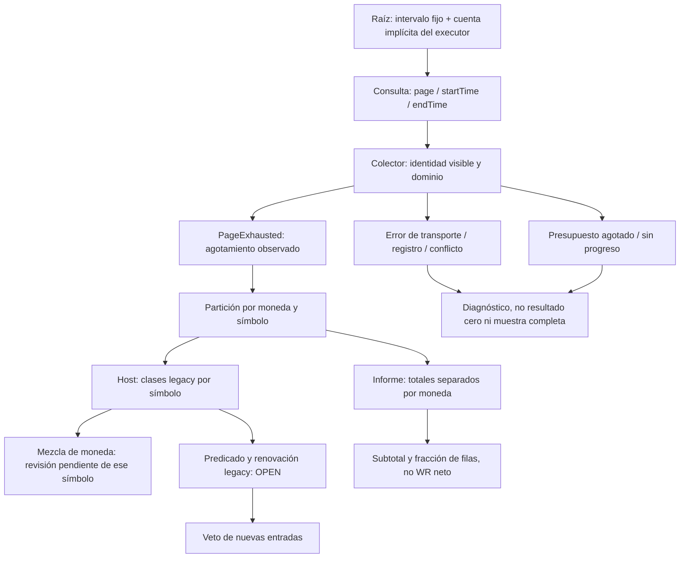

# Auditoría de fundamentos científicos XXXIX — cobertura de ingresos, unidades y alcance multiactivo del veto

Fecha: 2026-09-25. Continuación aditiva de XXXVIII. Resultado: rehabilitación parcial de FMT-282 y nueva ficha FMT-284. No se certifica íntegramente el sistema, su autoevolución, la paridad entre entornos ni su aptitud para operar capital real.

[Informe anterior XXXVIII](<C:/Users/jhona/Documents/Proyectos/Trader Gemini/docs/AUDITORIA_FUNDAMENTOS_CIENTIFICOS_XXXVIII_2026-09-25.md>) · [Artefacto XXXIX](<C:/Users/jhona/Documents/Proyectos/Trader Gemini/docs/artifacts/auditoria_fundamentos_XXXIX_2026-09-25.json>) · [Atlas](<C:/Users/jhona/Documents/Proyectos/Trader Gemini/ATLAS_ANALITICO.md>) · [Informe maestro](<C:/Users/jhona/Documents/Proyectos/Trader Gemini/INFORME_FORENSE_MAESTRO.md>).

## 1. Dictamen ejecutivo: qué cambió y qué no

La ruta anterior confundía terminar una consulta con recuperar su ventana completa. También omitía moneda y trade_id de la clave de deduplicación y trataba una lista paginada parcial como apta para activar/renovar el bloqueo por comisiones. En paralelo, el informe contable sumaba monedas distintas y afirmaba que su proporción de filas ganadoras era un WR neto por operación. Esos defectos pueden contaminar tanto la interpretación humana como la admisión automática de evidencia.

Ahora se usa paginación numerada con intervalo inclusivo fijo, estado de cobertura explícito y detección de conflictos del registro visible. El wrapper utilizado por el fee-breaker no entrega truncación, estancamiento o simulación como ventana real agotada. El informe separa activos monetarios, conserva costes firmados y muestra subtotales/filas con su significado. El host excluye de la evaluación por comisiones únicamente el símbolo que mezcla monedas dentro de las clases que esa política utiliza; no bloquea el examen de símbolos independientes.

La reparación es de infraestructura de evidencia, no un nuevo modelo de rentabilidad. El fee-breaker conserva su regla n>=3, net<0 y fees>gross_pos, sus duraciones y su renovación con datos repetidos. No se afirma que esa regla estime una probabilidad de pérdida futura ni que la ventana sea un espectro por activo. Tampoco se ha implantado conversión FX, reconciliación durable de fills, atribución genómica o snapshot del proveedor.

### 1.1 Matriz de estado

| Ficha | Prioridad | Estado | Garantía nueva y deuda restante |
|---|---|---|---|
| FMT-282, consulta | P1 | Parcialmente reparado | Intervalo fijo, páginas numeradas, límite/estancamiento diferenciados; falta snapshot/retención/reconciliación |
| FMT-282, identidad | P1 | Parcialmente reparado | Activo y trade_id no se colapsan; importe contradictorio bajo misma tupla es error; revisiones de la tupla siguen abiertas |
| FMT-282, moneda y alcance | P1 | Parcialmente reparado | Evidencia mezclada se excluye por símbolo; no hay conversión ni calibración del veto |
| FMT-282, inferencia/recuperación | P1 | OPEN | Filas no son operaciones; escala global, renovación repetida y persistencia siguen pendientes |
| FMT-284, informe de ingresos | P2 | Parcialmente reparado | Totales por moneda, proporción de filas correctamente nombrada, ratios sin epsilon monetario y ventana checked |
| FMT-181, comisiones end-to-end | Heredada | OPEN | El informe conserva signo; el veto legacy y otros productores siguen usando abs |
| FMT-279/FMT-280 | Heredada | OPEN en su parte semántica/durable | Regresiones reejecutadas; esta ronda no crea ledger causal ni ACK durable |

Las fichas no sustituyen ni renumeran la matriz histórica de 305 puntos. FMT-282 se continúa, no se vuelve a contar como defecto descubierto por primera vez. FMT-284 incorpora varios fallos del mismo consumidor, con mecanismos y criterios de cierre diferenciados.

### 1.2 Alcance archivo por archivo

Inventario de referencia heredado: 1.119 archivos versionados, 289 Rust preexistentes, 24 manifiestos Cargo. No se vuelve a afirmar un censo actual exhaustivo. La nueva lectura completa de un archivo preexistente es income_report, 223 líneas de partida. order_types, ya contado en XVIII, se releyó completo sin incrementar cobertura. Se leyó el pequeño punto de exportación lib; tampoco se usa para inflar el total. Executor y host se inspeccionaron de forma dirigida en los caminos modificados y sus consumidores, no como nuevas lecturas completas.

Cobertura acumulada conservadora: **169/289 Rust preexistentes; 120 pendientes**. El módulo nuevo income_evidence y sus pruebas se revisaron íntegramente, pero no se suman al denominador histórico. Los archivos no Rust no quedan globalmente certificados. Búsqueda de callers no equivale a examen completo de cada archivo encontrado.

Rama local main, HEAD 59a76de4be726098d9af934b4d35987e9a636802; trabajo compartido sucio anterior conservado. Sin commit/push/merge/fetch/reset/checkout, ni comprobación del remoto. No se le atribuyen a esta ronda cambios anteriores de genomas, modelos, graphify u otros crates.

## 2. Grafo vivo: desde el dato raíz hasta la decisión terminal



El diagrama muestra el tramo modificado. El nodo raíz todavía carece de un identificador inmutable de snapshot/cuenta en el resultado. El nodo de decisión no debe confundir admisibilidad de una muestra con ventaja económica. El nodo terminal de una consulta puede ser agotamiento observado, incertidumbre o error; ninguno de ellos equivale automáticamente a una salida financiera confirmada.

La tipificación introducida no son regímenes de volatilidad ni motores separados: son estados de calidad de evidencia. Es legítimo distinguir un transporte fallido de una página vacía; sería ilegítimo llamarlos pérdida y ganancia. Esta separación es compatible con un campo multivariante continuo.

## 3. FMT-282 — paginación sin pérdida del milisegundo frontera

Fuentes: [módulo de evidencia](<C:/Users/jhona/Documents/Proyectos/Trader Gemini/crates/execution-engine/src/income_evidence.rs>), [adaptador de ejecución](<C:/Users/jhona/Documents/Proyectos/Trader Gemini/crates/execution-engine/src/executor.rs>), [consumidor del veto](<C:/Users/jhona/Documents/Proyectos/Trader Gemini/src/bin/god_engine.rs>). El JSON incluye anclas, líneas y hashes.

### 3.1 Defecto anterior y consecuencia lógica

El algoritmo anterior avanzaba startTime hasta el máximo timestamp de la página y repetía el milisegundo frontera para deduplicar. Si había más de 1.000 registros en ese mismo milisegundo, no se podía inferir que la primera página los contuviera todos. last_ts<=cursor o added==0 devolvían Ok(acc), igual que una consulta terminada. Llegar al máximo de páginas también devolvía Ok(acc), con una advertencia textual que el caller no recibía como estado.

Un presupuesto de red es necesario. El fallo no era tener un máximo de cuatro páginas en el daemon o veinte en el informe, sino afirmar implícitamente que el presupuesto alcanzaba para la muestra requerida. El sesgo de truncación podía modificar tanto comisiones como PnL: no debe suponerse siempre conservador ni siempre favorable.

### 3.2 Consulta nueva y justificación de cada restricción

income_page_query construye la consulta a firmar con startTime, endTime, page, limit y timestamp. El intervalo se mantiene fijo en todas las páginas; page es un entero positivo y limit está en 1..=1000 según el contrato leído. La validación exige start<=end y representabilidad en el rango positivo int64 del endpoint. timestamp debe ser positivo y representable.

incomeType se trata como filtro escalar: se admite ausencia o un único token alfanumérico mayúsculo con guion bajo. No se concatena una lista separada por coma como extensión inventada del API. Caracteres de query, espacios o filtros múltiples retornan error antes de la llamada. La restricción léxica evita que el token cambie la estructura de parámetros; no acredita que cualquier token léxicamente válido pertenezca al enum actual del servidor.

max_pages=0 ya no se transforma silenciosamente en1. Un presupuesto nulo se rechaza como configuración inválida. Tampoco se recorta limit inválido a un valor diferente sin avisar. Estas restricciones son de protocolo/configuración, no umbrales de mercado ni nuevos sesgos temporales.

La firma se calcula sobre la consulta que se añade al buffer de solicitud. Los controles de rate limit existentes siguen en el adaptador; no se cambió su política ni se probaron cuotas reales. La API pública de una página permanece disponible, pero su documentación declara que no establece cobertura.

### 3.3 Estados observables del recorrido

| Estado | Evidencia que lo produce | Tratamiento |
|---|---|---|
| PageExhausted | Página terminal corta o vacía, sin error detectado | Permite consumir las filas de este recorrido |
| PageBudgetExceeded | Se alcanzó el presupuesto con última página llena | No entregar como ventana real agotada |
| NoProgress | Página no vacía compuesta sólo por identidades ya vistas | No asumir agotamiento ni seguir indefinidamente |
| Simulated | Adaptador configurado en paper, sin consulta al exchange | No presentar ausencia simulada como contabilidad real |
| Error | Transporte, dominio, rango o contradicción | No fabricar vector vacío ni evidencia de beneficio/coste cero |

El colector devuelve start/end, pages_read, coverage y entries. into_exhausted_entries devuelve filas sólo para PageExhausted. fetch_income_paged conserva su firma Vec/Err para los consumidores existentes, pero convierte los demás estados en error explícito. No se descarta ese error silenciosamente en el host: queda un diagnóstico de evidencia no utilizable.

Una última página llena exactamente en el presupuesto es incierta incluso cuando, por casualidad, contiene toda la población. Se necesitaría consultar la siguiente para observar que está vacía. No se aumenta automáticamente el presupuesto ni se confunde este falso negativo de completitud con una oportunidad de trading perdida.

### 3.4 Pruebas y alcance

La fixture de densidad tiene 1.001 registros distintos en el mismo milisegundo: la primera página contiene1.000 y la segunda1. Se conservan los1.001. Otra prueba necesita una página vacía terminal después de un múltiplo exacto. Se prueban límite lleno, falta de progreso incluso con página corta repetida, fallo de transporte tras éxito parcial, página sobredimensionada, rango invertido y configuración inválida sin invocar el fetcher.

Son pruebas del colector con fetcher controlado, no peticiones reales a Binance. La conexión del adaptador al colector tiene inspección y regresión estática, no un servidor HTTP mock que inspeccione bytes firmados y headers. No se afirma haber probado la implementación del proveedor.

### 3.5 Lo que PageExhausted no garantiza

Un intervalo temporal fijo no es un snapshot transaccional. El proveedor puede publicar tardíamente un ingreso cuyo timestamp esté dentro del intervalo, revisar un registro o cambiar la posición de los elementos entre páginas. Un OPEN construye un recorrido con solapamiento y nuevos elementos que termina vacío pero no incluye un ingreso insertado antes de la página ya leída. El algoritmo observa agotamiento; no posee una versión del conjunto completo.

Tampoco demuestra retención suficiente para cualquier --days. Un periodo anterior a la historia disponible puede producir páginas vacías sin demostrar ausencia de actividad. El nuevo informe lo advierte. No se inventó una duración de retención a partir de una página que no la establecía en la sección utilizada.

Un resultado construido manualmente con sus campos públicos puede mentir sobre coverage. El contrato actual es del productor comprobado y de sus consumidores inspeccionados, no un permiso criptográfico ni una garantía de tipos inviolable para cualquier caller. Encapsulación y evidencia firmada/versionada quedan como trabajo de diseño, no como capacidad existente.

## 4. FMT-282 — identidad visible, conflictos y dominios

### 4.1 Qué se conserva ahora

La clave visible contiene activo monetario, símbolo, tipo de ingreso, tran_id, tiempo y trade_id. No contiene el importe. Un registro idéntico ya visto no se añade otra vez; si el importe cambia bajo la misma tupla, se devuelve ConflictingRecord en lugar de contarlo como evento nuevo.

Esto corrige dos errores del recorrido anterior: filas que sólo difieren en activo o trade_id ya no se colapsan; una contradicción de importe no aumenta silenciosamente la suma cuando el resto de la identidad coincide. Se compara igualdad del f64 finito; +0 y −0 no se consideran una contradicción de importe.

No se afirma que tran_id sea globalmente único por cuenta o entre tipos: la fuente primaria utilizada no estableció esa garantía. Escoger una clave demasiado pequeña sin ese contrato podría colapsar ingresos legítimos. Escoger una demasiado amplia puede separar una revisión del mismo evento. La implementación resuelve el caso visible local y declara la deuda restante.

### 4.2 Calidad mínima del registro

El colector exige importe finito, activo y tipo no vacíos, tran_id no nulo, tiempo positivo y pertenencia al intervalo solicitado. Símbolo y trade_id pueden estar vacíos porque ciertos ingresos globales no representan trades. ID0/tiempo0 son tratados como evidencia sin identidad utilizable bajo este contrato, no como pérdida económica ni recomendación de abstención universal.

La deserialización shared string_or_f64 ya rechazaba NaN/∞. La validación nueva también protege llamadas con structs construidos directamente y defaults de campos omitidos, que no necesariamente pasan por esa deserialización. No se presenta como reparación nueva del parser finito ya corregido.

Si una fila falla, el recorrido no se declara utilizable. Eso evita entrenar o decidir con una muestra parcialmente depurada sin avisar. Sin embargo, un registro inválido puede hacer perder la evaluación de la ventana completa, incluso si otros símbolos tienen evidencia válida. No hay todavía cuarentena durable por fila, recuperación selectiva o prueba de completitud por símbolo. No debe confundirse la partición de moneda posterior con esa capacidad.

### 4.3 Revisiones pendientes

Un segundo OPEN conserva un mismo tran_id con timestamp e importe cambiados. La tupla visible es distinta y se admiten ambas filas. Sin el dominio formal de identidad/versionado del proveedor, no se puede resolver automáticamente si es corrección o evento distinto.

La clave usa datos ya convertidos a f64: importes decimales diferentes que colapsen al mismo binario pueden perder distinción. No se introdujo Decimal ni una unidad entera contractual. Tampoco se conserva aquí la cadena decimal original ni un hash del payload completo. El conflicto detectado es de importes representados, no de cualquier diferencia posible en la respuesta original.

No hay almacenamiento durable del conjunto seen. Se deduplica durante un recorrido, no entre reinicios, ventanas sucesivas o vías de contabilidad. Repetir una consulta no equivale a nueva evidencia; esa cuestión se mantiene abierta en la renovación del fee-breaker.

## 5. FMT-282 — moneda y aislamiento multiactivo del rechazo

### 5.1 Por qué no sumar ni bloquear globalmente

Una cifra de PnL en USDT y una comisión en BNB no se suman numéricamente como si compartieran unidad. Para convertir se necesitan precio FX, instante, fuente y convención. Este sistema no los añade en esta ronda. Dar por hecho USDT por el nombre del símbolo tampoco convierte una comisión denominada en otro activo.

A la vez, una comisión BNB de un símbolo no justifica impedir examinar la evidencia homogénea de otro. Se implementó partition_legacy_fee_evidence para separar exactamente las filas que utiliza la política legacy: REALIZED_PNL, COMMISSION y FUNDING_FEE con símbolo no vacío. Para cada símbolo, single_income_asset exige una sola moneda.

El resultado contiene grupos homogéneos y motivos de rechazo por símbolo. El host agrega únicamente los grupos homogéneos y registra los rechazados. Una transferencia global en BTC no suprime el examen de un grupo de trading USDT. Dos símbolos, cada uno homogéneo en USDT y USDC respectivamente, pueden revisarse separadamente sin sumar sus monedas.

### 5.2 Qué significa ese rechazo y qué no

El rechazo es a usar una muestra monetariamente incoherente en la evaluación actual. **No es un nuevo veto de mercado ni una orden de cerrar posiciones**. No se elimina explícitamente una suspensión previa del símbolo. Su temporizador existente puede seguir expirando; no se ha creado un latch de datos inciertos que lo retenga hasta reconciliación.

Esto deja una decisión de seguridad pendiente: qué política debe gobernar expiración/reactivación cuando faltan datos suficientes para reevaluar. No se resuelve extendiendo indefinidamente el veto ni borrándolo por defecto. Hace falta una máquina de causas y un operador de recuperación explícitos.

Las clases ignoradas por la política anterior siguen excluidas de esa evaluación. No se declara que rebates u otros flujos sean económicamente irrelevantes. El informe los muestra en OTROS, mientras la fórmula del veto aún necesita revisión de su contabilidad completa y convenio de signos.

Tres pruebas adicionales comprueban aislamiento: un símbolo mixto no elimina otro homogéneo; una transferencia global no contamina el grupo; dos monedas de liquidación en símbolos distintos se preservan. Esta revisión evitó introducir un control de moneda global que habría sido incoherente con el carácter multiactivo.

### 5.3 Partes económicas no reparadas

El host aún utiliza una escala genómica global entre anclas, limita tau y window, cuenta filas REALIZED_PNL no nulas como trades, aplica abs a comisiones, compara fees con bruto positivo y renueva hasta=ahora+horas. No hay un hash/ID del conjunto de evidencia consumido, versión del genoma causante de ingresos, ni tamaño muestral efectivo.

La suma legacy del host no utiliza IncomeTotals y todavía puede desbordar tras suficientes operandos finitos. El agregado checked nuevo protege el informe, no todos los agregados operativos del sistema. No se confunden ambas rutas por compartir módulo de entrada.

El mapa de suspensiones, su namespace de cuenta/entorno, persistencia, poisoning y restauración siguen como en XXXVIII. El cambio no corrige recuperación post-crash ni aislamiento entre cuentas. No se recomienda despliegue automático por el mero hecho de pasar tests.

## 6. FMT-284 — informe contable con significado matemático incorrecto

Fuente leída completa: [income_report](<C:/Users/jhona/Documents/Proyectos/Trader Gemini/src/bin/income_report.rs>). Prioridad P2 como herramienta diagnóstica; su interpretación puede influir en decisiones de operación, por lo que no es sólo cosmética.

### 6.1 Filas ganadoras no son operaciones ganadoras netas

Antes, pnl_trades aumentaba por cada fila REALIZED_PNL y win_trades por cada una positiva. El cociente era una fracción de filas. El texto decía WR bruto = WR neto por trade y atribuía esa equivalencia al tratamiento de fees. La estructura del propio informe sumaba comisiones y financiación separadamente; no existía unión por operación que permitiera calcular el WR neto.

La nueva presentación conserva el cálculo descriptivo y lo llama % FILAS+. Su denominador incluye todas las filas REALIZED_PNL, incluidas las de importe cero; el numerador cuenta las positivas. Si no hay filas, se muestra N/D. No se fabrican 0% ni 100% cuando la métrica no está definida.

Contraejemplo matemático: un cierre con bruto +1 y costes −2 tiene neto −1. La positividad de la fila de bruto no prueba positividad del resultado neto. Varias filas parciales pueden además pertenecer a una misma intención. La solución no es cambiar el umbral del contador, sino reconstruir operaciones y costes por identidad.

Tres regresiones estáticas fallaron al inicio de la ronda: ausencia del colector, ausencia del control monetario y frase/consumidor incorrectos del informe. Pasan tras el cambio. No se presenta ese RED estático como reproducción funcional de una cuenta real.

### 6.2 Totales y subtotales por unidad

Para cada activo monetario a y símbolo s se definen:

R(a,s) = suma de REALIZED_PNL; C(a,s) = suma firmada de COMMISSION; F(a,s) = suma firmada de FUNDING_FEE; O(a,s) = suma de otras clases.

El subtotal seleccionado es N(a,s)=R+C+F. C<0 representa gasto y C>0 abono bajo el convenio de income. No se aplica abs en este informe. O se muestra separado, con recuento por moneda de sus filas; puede contener transferencias y otras categorías que no deben etiquetarse automáticamente como beneficio.

Se emiten también totales por activo monetario, nunca un TOTAL de monedas heterogéneas. La columna antigua de PnL neto se conserva en contenido como SUBTOTAL con definición explícita. No se suprimen bruto, comisiones ni funding; se mejora su interpretación y se añade moneda/otros flujos.

Este subtotal no es el cambio completo del patrimonio ni necesariamente toda la rentabilidad neta: clases como rebates pueden estar en OTROS y transferencias no son ganancias. Para equity PnL se requiere un balance de flujos externos y valoración consistente de posiciones/activos. El informe no calcula ROI porque carece de denominador de capital y convención temporal/flujo suficientes.

### 6.3 Ratios, unidades y cero

Se conserva como diagnóstico la razón rho=(C+F)/|R|, ahora nombrada razón firmada y mostrada como razón, no como volumen ni WR. Si todos los importes se multiplican por k>0 al cambiar unidad, rho no cambia. El piso anterior 1e-9 en el denominador o en la condición de mostrar el ratio introducía una escala monetaria arbitraria para magnitudes pequeñas.

Con R=0, la razón no está definida; se muestra N/D. También se muestra N/D si no es representable de forma finita. No se sustituye por0. Puede haber costes significativos aunque el bruto neteado sea0, y una razón muy grande puede reflejar cancelación de ganancias y pérdidas, no necesariamente fricción por volumen negociado.

Las sumas verifican finitud tras cada adición y al formar R+C+F. Se rechaza overflow de componente, subtotal o categoría OTROS. No se finge que cada operando finito garantiza acumulación finita. Tampoco se promete suma decimal exacta: sigue siendo f64, dependiente del orden en general. El test de permutación usa deliberadamente magnitudes exactamente representables; no establece invariancia universal.

La salida monetaria usa Display sin recortar todo a cuatro decimales. Un importe pequeño no desaparece sólo por el formato fijo. No se convierte eso en contabilidad decimal exacta ni en validación del lote mínimo del instrumento.

### 6.4 Ventana y argumentos de consola

Antes se calculaba now − days*86.400.000 sin aritmética checked. Un days enorme podía desbordar la multiplicación o retroceder antes del epoch; un --days mal formado terminaba silenciosamente en7. Ahora se rechaza argumento ausente/no numérico, days0, overflow de multiplicación y resta pre-epoch. Un reloj anterior al epoch produce error explícito.

La ventana indicada al usuario es la misma start/end pasada al colector. Se muestra pages_read y cobertura observada. Si falta agotamiento observado, no se imprime un informe que parezca completo. Una respuesta vacía se describe como ausencia de registros devueltos por el endpoint, no prueba de ausencia histórica universal.

No se ejecutó el binario para leer .env o cuentas. Se conservaron sin auditar integralmente en esta ronda el cargador ligero de .env, aliases de credenciales y manejo general de argumentos duplicados/desconocidos. Estos detalles no quedan certificados por verificar el cálculo de lookback. El comportamiento demo/mainnet no se probó con credenciales.

## 7. Auditoría de los límites introducidos y conservados

| Límite / rechazo | Fundamento | Alcance y recuperación pendiente |
|---|---|---|
| page>=1, limit1..1000 | Contrato de paginación leído | Error de configuración antes de I/O; no parámetro de rentabilidad |
| start<=end, rango int64 | Representabilidad del protocolo | Corregir solicitud; no rellenar con fecha inventada |
| max_pages>0 | Presupuesto explícito | Al llegar al máximo lleno, estado incierto; no completa por conveniencia |
| Filtro singular | incomeType es escalar | Consultar tipos separados o sin filtro; no inventar lista |
| Importe finito e identidad mínima | Evidencia aritmética y deduplicable | Cuarentena/conciliación aún no durable |
| Conflicto de importe | No hay una única observación bajo la misma tupla | No escoger silenciosamente la versión favorable |
| Moneda homogénea por símbolo en el veto | Dimensiones compatibles | FX o estado incierto del símbolo; no acoplar otros símbolos |
| PageExhausted | Criterio observable del recorrido | No elimina sesgo por retención, snapshot o correcciones tardías |
| n>=3 y duración legacy | Política anterior, no prueba estadística | Sigue OPEN; no se reemplaza por otro número arbitrario |
| Cero en denominador de ratio | Métrica indefinida | N/D y explicación, no número artificial |

No se retiraron restricciones del instrumento, autorización ni límites de pérdida. Un modelo continuo necesita límites de representabilidad, recursos y riesgo. La auditoría distingue sus causas para que no se transformen en filtros de mercado sin fundamento.

## 8. Fundamento multivariante: por qué el problema nace en la raíz

### 8.1 Una medida de eventos, no un contador homogéneo de trades

Como formalización de diseño, no implementación nueva, puede representarse la evidencia como una colección de eventos con coordenadas (cuenta, activo, instrumento, tiempo, intención, generación, fuente). La suma de importes es una operación válida sólo dentro de una misma unidad o después de una conversión explícita. Proyectar esa colección sobre símbolo y olvidar moneda cambia el significado del resultado, aunque la suma compile.

El conteo de filas no proporciona por sí mismo el número de unidades experimentales independientes. Fills parciales, financiación periódica, pagos de comisiones y correcciones son mecanismos distintos. Antes de usar un contraste secuencial o un posterior, se necesita definir qué variable aleatoria se observa y qué dependencia se admite. Esta ronda no inventa un tamaño efectivo a partir de n.

Para el genoma, falta la coordenada de política aplicada. Una ventana de ingresos mezclados no identifica causalmente el efecto de un gen o de su escala temporal actual. Un veto puede anular decisiones de un gen nuevo a partir de resultados de uno anterior; sigue siendo una hipótesis de mecanismo visible en el código, no una estimación del efecto en la cuenta del usuario.

### 8.2 Continuidad no significa resolución infinita observada

El parámetro tau puede modelarse en un dominio continuo y aproximarse mediante una base/malla finita con error controlado. Las intensidades, volatilidad y dependencia son magnitudes con incertidumbre, no necesariamente etiquetas de régimen excluyentes. Los estados de transporte, cobertura y vida de una orden pueden seguir siendo discretos sin introducir motores scalping/swing.

El timestamp en nanosegundos no añade observaciones entre mensajes recibidos. Una escala de cien años exige soporte y un modelo de incertidumbre, no sólo ampliar el rango del genoma. No se han cambiado esas estructuras temporales en esta ronda ni se certifica su cobertura. Se ha eliminado una pérdida concreta ligada al milisegundo frontera de la consulta, que es un problema distinto del espectro de estrategias.

### 8.3 Teorías candidatas y condiciones para integrarlas

Antes de incorporar técnicas más avanzadas, cada propuesta debe indicar: estado observable, unidad, supuestos, objetivo, coste de cálculo, sensibilidad, baseline y resultado que la falsaría. La transferencia de una ecuación de física, estadística o un problema del milenio necesita esa correspondencia; la dificultad de la ecuación no constituye evidencia de alpha ni de estabilidad.

Líneas con utilidad potencial, aún no implementadas aquí: ledger/event sourcing para causalidad e idempotencia; estimación multiescala con soporte y error de aproximación; dependencia regularizada entre activos/escalas; inferencia secuencial sobre outcomes correctamente identificados; optimización robusta que incorpore costes e incertidumbre. No se invocan como garantías de rentabilidad ni se declaran calibradas.

El uso del término cuántico requiere precisar codificación, hardware o simulador, coste total y comparación clásica. No se añade una metáfora cuántica a un contador de ingresos ni se afirma ventaja cuántica. La mejora científica de esta ronda es explicitar qué puede y qué no puede inferirse de la evidencia disponible.

## 9. Estado por los ocho módulos históricos

| Módulo | Trabajo de esta ronda | Lo no certificado |
|---|---|---|
| 1. Ingestión/parsers/normalización | Dominio de ingresos, identidad visible y rango | L2 y toda la ingesta no se reaudi­tan íntegramente |
| 2. IA/modelos/señales | Se evita entregar ciertos datos parciales como evidencia utilizable | Reward/label causal y mejora predictiva no demostrados |
| 3. Multi-activo/espectros | Partición monetaria por símbolo sin contaminar otros | Ventana temporal global y dependencia de cartera pendientes |
| 4. Ejecución/red/Binance | Páginas numeradas, firma con query explícita, paper distinguido | No HTTP de cuenta, snapshot ni cuotas medidas |
| 5. Riesgo/Kelly/genomas | Veto no reevaluado con truncación/moneda mixta | Predicado, renovación y atribución genómica siguen abiertos |
| 6. Estado/telemetría/SO | Diagnóstico de errores de evidencia | Ledger durable, ACK, presión I/O y locks no reparados aquí |
| 7. Confluencia/cuántica | Se precisan requisitos de validez | No capacidad cuántica ni cambios en consejo/confluencia |
| 8. Backtest/auditoría/gobernanza | Tests de contrato/OPEN separados, informe y hashes | Sin certificación de paridad, OOS nuevo o auditoría total |

## 10. Pruebas ejecutadas y límites de la verificación

| Target | Únicas | Clasificación |
|---|---:|---|
| income_evidence_contract | 23 | Funcionales/mocks, incluida partición multiactivo |
| income_consumer_wiring_contract | 3 | Estáticas; RED inicial y GREEN final |
| income_open_diagnostics | 2 | OPEN de snapshot e identidad revisada |
| exchange_response_contract | 7 | Regresión funcional de parser/respuesta |
| accounting_numeric_contract | 16 | 15 funcionales +1 estática |
| accounting_open_diagnostics | 1 | OPEN heredado de coherencia/dedup |
| entry_route_contract | 10 | Regresión funcional, mocks/paper |
| emergency_accounting_wiring_contract | 2 | 1 funcional +1 estática |
| --lib tests_b3_audit | 2 | Compatibilidad de fixture histórica de merge |
| Total | **66** | **58 funcionales/compatibilidad +5 estáticas +3 OPEN** |

28 pruebas nuevas:23 funcionales,3 estáticas y2 OPEN. Tres fallos iniciales fueron estáticos, no se computan como RED funcionales. No se reclasificó un OPEN anterior como reparado. Reejecutar una prueba no aumenta su cuenta única. Las dos pruebas legacy de merge se preservan bajo cfg(test) y no validan el nuevo recorrido operacional.

Comandos:

```text
cargo test --offline -j 1 -p execution-engine --test income_evidence_contract --test income_open_diagnostics --test income_consumer_wiring_contract --test exchange_response_contract --test accounting_numeric_contract --test accounting_open_diagnostics --test entry_route_contract --test emergency_accounting_wiring_contract -- --test-threads=1
cargo test --offline -j 1 -p execution-engine --lib tests_b3_audit -- --test-threads=1
cargo check --offline -j 1 -p trader-gemini-v5 --bin god_engine --bin income_report --bin evolver --bin walkforward_evolver
```

Integración64 tests: salida e0bfb6. Unitarios2 y check: salida468cfd, código0. Después del formato del informe, se reejecutaron las tres estáticas y check income_report, salida cfca0b, código0. Nuevos Rust e income_report pasan rustfmt --edition2021 --check. Advertencias heredadas: latest_ts, mode, trades y toxic.

Sin llamadas privadas, órdenes, I/O de diario operativo, entrenamiento/promoción, cargo build del motor o reinicios. El constructor paper de las pruebas no se usa como evidencia de contabilidad real. No se ejecutó el main de income_report ni se leyó el contenido de .env.

Faltan: mock HTTP de firma/headers/respuestas, pruebas contra contrato real sin datos sensibles, crash/replay, benchmarking, precisión decimal, snapshot/retención y OOS. Hashes y anclas comprueban trazabilidad del código leído, no corrección matemática total. Los41 modelos del manifiesto heredado permanecen iguales.

## 11. Complejidad, latencia y recursos

El colector realiza hasta max_pages peticiones y conserva a lo sumo las filas admitidas de esas páginas. La tabla hash de identidades y vector de filas son O(N) en el número admitido; la partición por símbolo añade copias de las filas de las tres clases seleccionadas. El agregado del informe usa mapas ordenados y totales por moneda/símbolo. No se promete coste cero ni latencia HFT de este daemon.

La cota de filas posterior al parseo no limita por sí misma el tamaño del body HTTP o todas las asignaciones realizadas antes de validarlo. El generador de consulta y las claves usan Strings. Falta medir bytes, asignaciones y latencia bajo una ventana densa. No se traduce que el helper se ejecute en milisegundos sobre fixtures pequeñas en una cifra de p99 operacional.

Se mantienen los presupuestos4/20 de los callers, ahora con semántica explícita de truncación. Elegir el presupuesto debería combinar rate limit, latencia admisible y volumen observado; no declarar que veinte páginas cubren cualquier periodo o que una ventana de48h es universalmente suficiente.

## 12. Investigación y procedencia

Se leyeron las instrucciones Firecrawl, seguridad y scrape. La CLI no estaba disponible. Se reutilizó, conforme a esa guía, la extracción primaria recuperada en XXXVIII el mismo2026-09-25; se inspeccionó la sección pertinente sin repetir la consulta ni el feedback. No se utilizaron resultados de otro proveedor como documentación de Binance.

La fuente describe paginación numerada, extremos inclusivos, límite máximo de registros, filtro de tipo singular y campos de activo/identificación. Eso guió la consulta fija y la separación entre fila, moneda y operación. No se dedujo de ella una garantía de snapshot o unicidad global del identificador. [Binance: Get Income History](https://developers.binance.com/en/docs/catalog/core-trading-derivatives-trading-usd-s-m-futures/api/rest-api/account#get-income-history).

La evidencia local de investigación queda en .firecrawl/XXXIX-income-contract-evidence.md, excluida de Git como material de trabajo. No se enviaron código privado, credenciales ni datos de cuenta. Las limitaciones de snapshot y de inferencia son conclusiones de ingeniería explícitas, no citas atribuidas al proveedor.

## 13. Hoja de ruta 1-a-1 y cierre del tramo

1. Formalizar dominio de identidad, revisión y cuenta de income; conservar versión o payload decimal suficiente para resolver contradicciones. No añadir todavía más componentes de clave como sustituto del contrato.
2. Incorporar intervalo/cobertura por símbolo y una política de cuarentena recuperable. Una muestra inválida no debe desaparecer ni convertirse en rentabilidad cero.
3. Diseñar FX as-of y balance de flujos antes de cualquier total multimoneda. Mantener activos independientes cuando no existe conversión.
4. Vincular filas a fills/intenciones/generación de genoma y definir outcomes, para sustituir el conteo de filas por la unidad estadística pertinente.
5. Rehabilitar el fee-breaker con evidencia nueva identificada, incertidumbre y causas de recuperación. Resolver qué ocurre al expirar un veto si los datos son incompletos.
6. Reemplazar la escala global por una estimación con soporte multiactivo/multiescala, evaluando out-of-sample y trazas de decisiones. No basta con ampliar un clamp ni con renombrar parámetros.
7. Migrar agregados operativos a aritmética y numerario validados; no asumir que el agregado checked del informe ya protege al host.
8. Validar reportes de equity/ROI/WR neto sobre ledger conciliado; mantener subtotales descriptivos mientras falten denominadores/identidad.
9. Continuar las120 lecturas completas Rust pendientes y los archivos no Rust con inventario trazable; preservar la distinción lectura dirigida/completa.
10. Revisar por separado publicación, ramas y despliegue: no hubo esas operaciones en esta ronda.

Conclusión: la cadena de datos ahora expresa más fielmente cuándo sabe, cuándo está truncada y en qué unidades opera. Eso elimina errores concretos, pero todavía no establece una política autoevolutiva causal. La tarea siguiente es unir identidad, evidencia nueva y recuperación del veto; añadir complejidad matemática antes de esa unión podría optimizar un objetivo contablemente mal definido.

