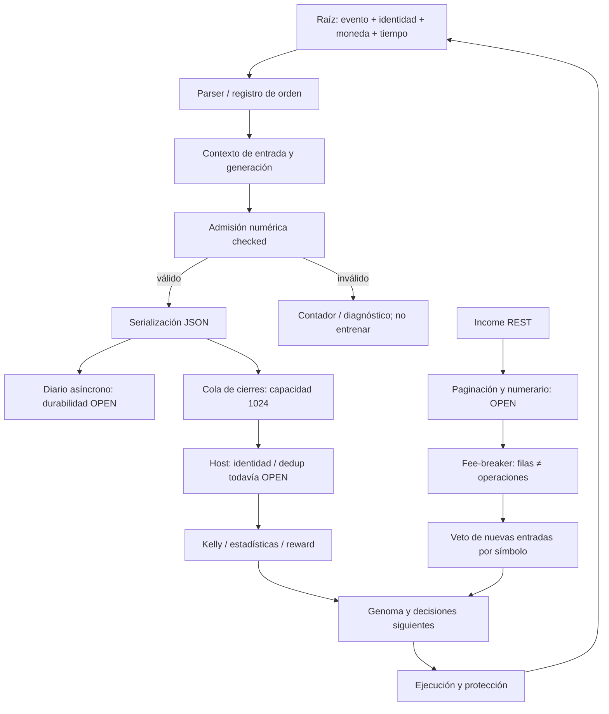

# Auditoría de fundamentos científicos XXXVIII — evidencia contable, aprendizaje y causalidad de los vetos

Fecha: 2026-09-25. Continuación aditiva de la ronda XXXVII. Estado: correcciones locales verificadas y defectos abiertos descritos; **no certificación integral del proyecto ni de aptitud para operar capital real**.

[Informe anterior XXXVII](<C:/Users/jhona/Documents/Proyectos/Trader Gemini/docs/AUDITORIA_FUNDAMENTOS_CIENTIFICOS_XXXVII_2026-09-25.md>) · [Artefacto trazable XXXVIII](<C:/Users/jhona/Documents/Proyectos/Trader Gemini/docs/artifacts/auditoria_fundamentos_XXXVIII_2026-09-25.json>) · [Atlas acumulado](<C:/Users/jhona/Documents/Proyectos/Trader Gemini/ATLAS_ANALITICO.md>) · [Informe forense maestro](<C:/Users/jhona/Documents/Proyectos/Trader Gemini/INFORME_FORENSE_MAESTRO.md>).

## 1. Dictamen y alcance real

El sistema todavía no demuestra un ciclo autoevolutivo causal y coherente entre backtest, demo y producción. Esta ronda examina una condición necesaria de ese ciclo: que la evidencia que actualiza la política sea numéricamente válida, pertenezca a la operación correcta, conserve sus unidades, llegue íntegra y se utilice una sola vez. La primera condición se ha reforzado. Las restantes no quedan resueltas por ese cambio.

Hay cinco nuevas fichas, FMT-279 a FMT-283, y continuaciones de FMT-278 y FMT-181. No se renumera ni se declara cerrada la matriz histórica de 305 puntos; las distintas series de hallazgos no son un contador intercambiable de defectos independientes. Un hallazgo agrupa mecanismos relacionados y puede continuar defectos anteriores sin constituir una reparación global.

Se corrigieron: propagación de infinitos/desbordamientos por la aritmética compartida de PnL; admisión numérica de cierres antes del aprendizaje; serialización manual con pérdida de precisión y cadenas no escapadas; coincidencias parciales del clasificador de tipos de bracket. Se añadió un contador de registros numéricamente inválidos. La emergencia usa ahora el resultado tipado y no encola un resultado ficticio si el cálculo es inválido. No se eliminaron vetos económicos ni se relajó el kill-switch.

Permanecen abiertos: propiedad y terminalidad del fill, conciliación por identidad, moneda de comisiones, idempotencia contable, durabilidad del diario, veracidad del simulador auxiliar, inferencia causal del fee-breaker, completitud de sus páginas, escala por activo/generación y la dependencia espectral de cartera. Se describen contraejemplos y condiciones de cierre; no se sustituyen por nuevas constantes arbitrarias.

### 1.1 Cobertura archivo por archivo, sin inflación

Inventario de referencia heredado: 1.119 archivos versionados, 289 archivos Rust preexistentes y 24 manifiestos Cargo. No se ha vuelto a certificar todo ese inventario en esta ronda. La cobertura de lecturas completas pasa de 166 a **168 de 289 Rust**; quedan **121 lecturas completas Rust pendientes**, además del trabajo no Rust que no está íntegramente certificado.

Nuevas lecturas completas: trade_accounting, 491 líneas de partida, y shadow, 349 líneas de partida. Se releyeron completos ntp, ruin y dynamic_symbols, ya contados en rondas anteriores: no aumentan el total. El host, executor, order_types y user_data_stream se recorrieron en las rutas referenciadas, no se declaran nuevamente completos. Las búsquedas transversales de símbolos y los tests nuevos tampoco equivalen a lectura completa de los archivos encontrados.

Las modificaciones de esta ronda se limitan a tres fuentes —contabilidad, comentarios del shadow y cableado del host—, un test existente de emergencia, tres archivos nuevos de pruebas y documentación. No se modifica la disposición de la arena ni de Position. La rama local sigue siendo main, HEAD 59a76de4be726098d9af934b4d35987e9a636802, con cambios compartidos anteriores. No hubo commit, push, merge, fetch, reset o checkout; no se comprobó el remoto. Por tanto, esta ronda no certifica qué resolvieron otras personas ni qué está publicado.

### 1.2 Resumen de verificación

78 pruebas únicas pasan: 69 funcionales/de compatibilidad, 2 de cableado estático y 7 diagnósticos OPEN. Los 7 OPEN pasan porque reproducen limitaciones todavía presentes, no porque esas limitaciones se hayan corregido. Hay 22 pruebas nuevas: 15 funcionales, 1 estática y 6 OPEN. Cinco contraejemplos de comportamiento y uno de cableado fallaron antes y pasan tras la corrección. No se reclasifica ningún OPEN anterior como reparado en esta ronda.

cargo check offline pasa para god_engine, evolver y walkforward_evolver. Permanecen advertencias conocidas de latest_ts, mode, trades y toxic. Se verificaron intactos los 41 modelos del manifiesto heredado. No hubo peticiones de cuenta, órdenes, entrenamiento/promoción operativos, compilación del ejecutable operativo con cargo build, terminación o reinicio de procesos. cargo test sí compiló y ejecutó sus binarios de prueba aislados.

## 2. Paradigma de grafo vivo y topología diagnóstica

El nodo raíz de esta sección no es una señal ni un gen: es la evidencia identificada y fechada. Una evolución que optimiza un reward mal atribuido puede mejorar su métrica interna mientras deteriora la política desplegada. Añadir más dimensiones no elimina ese defecto de origen.



Este diagrama es un mapa diagnóstico del tramo inspeccionado, no un inventario automático de todas las aristas del proyecto. La validación numérica no valida la arista contexto→fill; JSON válido no valida la arista diario→replay; un veto con temporizador no valida su justificación estadística.

Los nodos terminales deben distinguir, como propuesta de contrato aún no implantada integralmente: rechazo de propuesta; envío incierto; aceptación de orden; fill parcial; fill terminal; cancelación; posición abierta; salida confirmada; evidencia conciliada y reward elegible. Actualmente varios métodos retornan Result<(), String>, insuficiente para deducir esas transiciones.

## 3. Matriz de estado de esta ronda

| ID | Prioridad | Estado acotado | Evidencia / lo que falta |
|---|---|---|---|
| FMT-279 | P1 | Reparación parcial | Aritmética y gate checked; falta identidad, coherencia del PnL aportado, dedup y salud del acumulador |
| FMT-280 | P1 | Reparación parcial | JSON estructurado y rechazo de inválidos; sin ACK durable, control de backlog ni replay exactamente una vez |
| FMT-281 | P2 | OPEN | Cinco diagnósticos del ShadowExecutor; no constructor operacional localizado |
| FMT-282 | P1 | OPEN | Fee-breaker real del host: ventana global, unidades, filas, paginación y renovación de la misma evidencia |
| FMT-283 | P2 | Reparación parcial | Tres tokens exactos; el nombre de orden no autentica propiedad ni reduce-only |
| FMT-278 | P1 | Continuación parcial | Emergencia con signo y dominio correctos; precio/slot/fill/fees reales no certificados |
| FMT-181 | Heredada | Continuación OPEN | Coste firmado admitido por serializer, pero productor usa abs y no lleva moneda/conversión |

P1 indica potencial de corromper aprendizaje o decisión operativa en una ruta alcanzable; no significa que esta sesión haya observado una pérdida real. P2 distingue el auxiliar no localizado en el flujo operativo y la clasificación sintáctica. La ausencia de caller encontrada por búsqueda no prueba que una API pública jamás pueda utilizarse.

## 4. FMT-279 — dominio numérico no equivale a outcome financiero válido

Fuentes: [aritmética y estructura contable](<C:/Users/jhona/Documents/Proyectos/Trader Gemini/crates/execution-engine/src/trade_accounting.rs:97>), [admisión antes de aprendizaje](<C:/Users/jhona/Documents/Proyectos/Trader Gemini/src/bin/god_engine.rs:3325>), [emergencia](<C:/Users/jhona/Documents/Proyectos/Trader Gemini/src/bin/god_engine.rs:578>). Las anclas exactas y sus hashes están en el JSON.

### 4.1 Mecanismo defectuoso y reproducción

La comprobación legacy de precios/cantidad no impedía todos los infinitos. Además, operandos individualmente finitos pueden producir un resultado no finito. Con entrada 1, salida f64::MAX y cantidad 2, el producto desborda. No basta con comprobar que entry sea positivo: +∞ también lo es. Si el resultado llega a medias, sumas, fracciones o posterior, el error puede persistir mucho después del evento original.

La API anterior devolvía 0 para algunas entradas inválidas. Ese valor mezcla estados distintos: resultado plano, contexto ausente y fallo numérico. Una etiqueta binaria win/loss no puede recuperar cuál fue el caso. La emergencia añadía una ruta con cálculo y contexto propios; la ronda anterior corrigió el signo, y esta corrige el tratamiento explícito del dominio.

Cuatro tests iniciales reprodujeron salida infinita por entrada, salida o cantidad infinitas y por desbordamiento de operandos finitos. Una prueba estática inicialmente fallida comprobó la ausencia del nuevo gate en el tramo de consumo del host. La prueba estática no ejecuta el host ni demuestra orden temporal frente a todas las mutaciones; se conserva clasificada como estática.

### 4.2 Cálculo, unidades y propósito

Para un contrato lineal con precio expresado en moneda cotizada por unidad del activo y cantidad positiva en unidades del activo:

- Largo: G = q(P_salida − P_entrada).
- Corto: G = q(P_entrada − P_salida).
- Neto aritmético: N = G − C, con C coste firmado en la misma moneda; C < 0 representa un abono bajo ese contrato.

G y C deben compartir numerario. La fórmula no se extiende sin adaptación a un contrato inverso, multiplicadores contractuales distintos, comisiones en otro activo o financiación de cartera. No se ha certificado esa adaptación en todas las rutas. Que un número lleve el nombre usd no prueba su unidad.

checked_gross_pnl exige precios y cantidad finitos y estrictamente positivos; rechaza resultado no finito. Si los precios son distintos y el producto se redondea hasta cero por subdesbordamiento, devuelve Underflow. Si los precios son iguales, acepta el cero como resultado plano. Esta distinción evita fabricar un resultado plano a partir de magnitud no representable. No detecta toda pérdida de precisión de f64 ni reconstruye un incremento ya perdido antes de recibir los operandos.

gross_pnl se mantiene como wrapper de compatibilidad: devuelve 0 ante error. Ese wrapper ya no exporta infinitos, pero **no es una API válida para establecer por sí sola un label de aprendizaje**. Su documentación lo declara. La ruta de consumo de BracketClose usa checked_numeric_net_pnl, y la emergencia usa checked_gross_pnl.

### 4.3 Cambio y garantía comprobable

El gate del host ocurre antes de sus actualizaciones de estadísticas/Kelly para el registro drenado. Valida símbolo no vacío, cantidad y precios, valores finitos de PnL/fees/slippage, dominio del trigger cuando hay precio, representabilidad del bruto reconstruible y del neto suministrado. Un error se registra y no alimenta ese bloque de aprendizaje. En la emergencia, el error marca necesidad de reconciliación y evita encolar el outcome inválido; no es un veto a la orden defensiva ni una modificación del exchange.

Entry igual a cero sigue permitido en el serializer para conservar un diagnóstico de contexto desconocido; el mismo registro no es elegible para outcome numérico. Mantener ambas capas explícitas evita exigir un precio inventado para dejar constancia del evento.

Las pruebas cubren long/short, campos inválidos aislados, overflow, underflow, cero legítimo, comisiones positivas/cero/negativas, cambio de unidad monetaria y ausencia de estado interno en el helper. La elegibilidad es deliberadamente más estricta que la mera resta G−C: slippage o stop inválidos excluyen el registro. Eso protege integridad, pero puede censurar evidencia por metadatos no esenciales; faltan razones agregadas por campo y un carril de cuarentena/reconciliación.

### 4.4 Lo que continúa mal y por qué importa

El helper verifica que el PnL reconstruible sea representable, pero retorna pnl_gross suministrado menos fees. No contrasta ambas magnitudes. El OPEN muestra entrada 100, salida 110, q=1 y largo, cuyo bruto reconstruido es +10, mientras el registro aporta −10: se admite −10 dos veces. No se impone igualdad exacta porque aún falta distinguir estimación local, realización del exchange, redondeos, multiplicadores y fuente de verdad. Elegir silenciosamente uno de los dos valores tampoco resolvería la contradicción.

BracketClose no lleva cuenta/entorno, ID de orden/fill, generación de posición, moneda, versión genómica ni calidad de evidencia. Un registro finito puede pertenecer a otro slot. En user_data_stream se escoge el primer slot abierto del mismo lado; como respaldo se acepta otro slot abierto o slot0. El precio recuperado del diario es el último por símbolo/lado, sin un límite as-of del fill: un evento atrasado puede tomar una entrada posterior. Es un riesgo causal identificado por inspección, no una pérdida operacional medida.

La deduplicación del host compara símbolo y proximidad de timestamp con el último cierre del core. Dos cierres legítimos próximos pueden colapsar y dos eventos duplicados fuera de esa ventana pueden sobrevivir. No hay claim de outcome consumido persistente. Repetir un fill puede volver a aportar evidencia aunque otro registro haya actualizado parte del estado.

Un neto cero entra en la rama net>=0 que actualiza la media ganadora, pero record_trade recibe net>0, es decir false. La representación binaria y la media no aplican el mismo criterio. Hace falta definir explícitamente flat, costes y magnitudes; no convertir un resultado plano en pérdida económica por una condición booleana accidental.

Los acumuladores total_gross_pnl, total_net_pnl y total_fees siguen sumando con +=. Una secuencia de valores finitos puede desbordar; validar un registro no valida todo el historial. Tampoco se ha convertido en transacción conjunta la actualización de contadores, medias y persistencia de Kelly.

Condición de cierre: registro causal inmutable; numerario y contrato conocidos; conciliación de bruto calculado/reportado con tolerancia definida por precisión del instrumento; IDs deduplicables; tratamiento explícito de flat/desconocido; agregación checked; replay que produzca exactamente el mismo estado y no duplique rewards.

## 5. FMT-280 — diario correctamente serializado, pero todavía no durable

### 5.1 Sintaxis y resolución numérica reparadas

La construcción manual de líneas JSON interpolaba texto y decimales fijos. Comillas, barras o saltos de línea en campos textuales podían romper la estructura; no se afirma que los símbolos canónicos del exchange contengan esos caracteres, sino que la API pública no garantizaba su precondición. El formato de seis/ocho decimales podía convertir una cantidad o comisión positiva pequeña en 0 y destruir evidencia de forma dependiente de unidad.

journal_line y entry_fill_journal_line son serializadores puros con serde_json. Conservan las claves legacy; validan números antes de serializar para no convertir NaN/∞ en representaciones nulas. Mantienen la precisión de representación serializable de f64, sin prometer precisión decimal arbitraria. Escapan texto y agregan exactamente el salto de línea separador. Un salto dentro del campo queda escapado, no crea un segundo registro físico.

El test usa valores submicro y texto con comillas/saltos: parsea la línea resultante y comprueba recuperación. Otros tests verifican fees firmadas y rechazos individuales. Dos llamadas con registros inválidos incrementan INVALID_RECORDS en dos y dejan la cola vacía sin inicializar el trabajador de I/O. Se prueban helpers y rechazo; no se escribió el diario operativo.

Cambios de orden de claves o notación científica son válidos en JSON. No se han auditado todos los consumidores que puedan depender indebidamente de regex, orden textual o decimales fijos. La compatibilidad comprobada es estructural por claves y tipos, no universal para lectores ad hoc.

### 5.2 Dos colas con garantías diferentes

La línea se envía a un canal std::sync::mpsc sin cota. El registro contable se envía después a PENDING, cuya capacidad lógica es 1.024. El diario puede recibirlo y el consumidor de aprendizaje perderlo por saturación. DESCARTADOS cuenta ese caso; la búsqueda en crates/src encontró uso del accessor en tests y no un consumidor operacional que suspenda el aprendizaje por degradación de muestra.

El trabajador ignora el resultado de write_all. Si no logra abrir/escribir, el registro puede perderse; el productor no recibe ACK de persistencia. No existe fsync ni protocolo durable de commit asociado al outcome. El envío exitoso al canal sólo demuestra aceptación en memoria del proceso, no supervivencia a un crash.

Si el canal muere, journal_append vuelve a I/O síncrono en el llamador. Eso introduce potencial de latencia en la ruta de eventos privados. El envío clona la cadena; el backlog no acotado puede crecer con disco lento. No se midieron throughput, p99 o bytes pendientes: son riesgos de diseño visibles, no cifras de latencia inventadas.

Si PENDING está envenenado, el productor puede omitir la inserción y el drenador retorna vacío. Un vacío de datos resulta indistinguible para el consumidor de la ausencia de cierres. INVALID_RECORDS no cuenta ese caso ni las pérdidas de disco. Un contador global y un eprintln no constituyen cuarentena recuperable de la evidencia inválida.

### 5.3 Caché y causalidad de recuperación

last_journal_entry_px consulta metadata en cada invocación y, al cambiar mtime/longitud, relee y parsea el archivo bajo el mutex de caché. Evita escaneos repetidos con firma estable, pero sigue colocando acceso a disco y un lock en la ruta de recuperación. La firma no es identidad de contenido ni versión causal. Reescrituras con firma indistinguible pueden conservar una caché obsoleta.

El defecto más importante no es sólo rendimiento: devuelve la entrada más reciente por símbolo y lado, sin order_id, generación o as-of. Acelerar esa consulta no la convierte en atribución correcta. La compactación por último registro también exige conservar lo necesario para fills atrasados, no únicamente el estado más reciente.

Condición de cierre: ledger append-only con IDs y versiones; estado de aceptación/durabilidad explícito; backlog y política de presión observables; recuperación/replay idempotente; cuarentena identificada para inválidos; caché por contexto causal. El límite de memoria es legítimo, pero su modo de degradación debe ser medible y no sesgar silenciosamente el aprendizaje.

## 6. FMT-281 — ShadowExecutor no es un simulador de ejecución verificable

Fuente completa: [ShadowExecutor](<C:/Users/jhona/Documents/Proyectos/Trader Gemini/crates/execution-engine/src/shadow.rs:1>). Se añadió una advertencia de alcance, no una falsa reparación del simulador.

execute_order sólo rechaza current_price<=0. NaN evade esa comparación y +∞ tampoco la cumple; ambas llamadas pueden devolver Ok. Después del redondeo, raw_qty puede valer cero y también devolver Ok. execute_limit_order puede aceptar cantidad negativa y precio NaN porque imprime la operación sin validar ni evolucionar un libro/posición.

trigger_kill_switch imprime un mensaje, pero no establece un estado que impida la siguiente entrada. Se reproduce esa secuencia con un test. Por tanto, no sirve para validar causalidad o recuperación de vetos operativos.

Un ACK aparente no cambia el capital simulado ni crea posiciones consultables; la consulta de una orden no aporta su fill. El retardo fijo de 5 ms en una ruta no constituye distribución de latencia, modelo de cola, selección adversa o congestión. Las rutas tampoco implementan uniformemente validación de step/tick, fees o terminalidad.

Cinco OPEN reproducen: precios NaN/∞ aceptados; cantidad redondeada a cero aceptada; entrada posterior al kill aceptada; ausencia de efectos de posición/capital y consulta; limit con argumentos inválidos aceptada. No se convierten esos comportamientos en requisitos deseables: los nombres open_ preservan la deuda de reparación.

La búsqueda de ShadowExecutor::new en crates/src sólo localizó constructores en sus tests. No se identificó constructor operacional en el host inspeccionado. Por eso **no se atribuye a este auxiliar la discrepancia observada por el usuario en demo**. El flujo paper del adaptador real tiene otros contratos, cuyas diez pruebas de entrada se reejecutaron separadamente. Shadow auxiliar, paper del adaptador, backtest y cuenta demo no son sinónimos.

Condición de cierre: interfaz de eventos compartida; ACK/fill/cancel diferenciados; reservas/posiciones/capital; comisiones y restricciones; latencia/cola con semillas reproducibles; stop protector y kill con causas; pruebas de paridad de intención/evidencia entre entornos. No basta con añadir is_finite y afirmar que ahora se simula mercado.

## 7. FMT-282 — el fee-breaker operativo confunde evidencia histórica y viabilidad futura

Fuentes: [estado y persistencia del veto](<C:/Users/jhona/Documents/Proyectos/Trader Gemini/src/bin/god_engine.rs:366>), [ventana, agregación y suspensión](<C:/Users/jhona/Documents/Proyectos/Trader Gemini/src/bin/god_engine.rs:2230>), [paginación](<C:/Users/jhona/Documents/Proyectos/Trader Gemini/crates/execution-engine/src/executor.rs:1045>), [IncomeEntry](<C:/Users/jhona/Documents/Proyectos/Trader Gemini/crates/execution-engine/src/order_types.rs:167>).

Este veto tiene una finalidad sensata: limitar nuevas exposiciones cuando la fricción observada deteriora resultados. Lo incorrecto es presentar su regla actual como una demostración de inviabilidad del símbolo o como adaptación espectral por activo. No se elimina la protección; se identifica exactamente qué evidencia falta para rehabilitarla.

### 7.1 Ventana genómica escalar y alcance equivocado

El daemon lee una sola arena.config.temporal_scale, recortada a [0,1]. Interpola log-linealmente entre anclas temporales globales, calcula tau y la limita a 30 s–12 h. La ventana es clamp(24 tau, 1 h, 48 h). Eso produce una escala continua dentro de un intervalo, pero no un espectro multivariante por símbolo ni por cada generación que produjo los ingresos.

El comentario habla de tau dominante del símbolo, pero no se lee una estimación del espectro vivo de ese símbolo. La agregación posterior tampoco conserva tau de cada operación. Mezcla generaciones de genoma y contextos anteriores bajo la escala actual. Este es un mecanismo concreto por el que una mejora del genoma puede no tener el mismo efecto en producción: el filtro posterior utiliza evidencia no atribuida a la política que evalúa. Es una explicación posible derivada del código, no prueba causal del caso del usuario.

Cadencia de evaluación: 300 s; el primer tick inmediato se consume antes del bucle, de modo que la primera evaluación espera el siguiente. Si el executor tiene kill activo, se omite la evaluación. No hay una política declarada de salud/completitud que explique esos huecos frente a expiraciones de suspensiones.

### 7.2 Definición contable de la regla y significado correcto

Por símbolo se acumulan R = REALIZED_PNL + FUNDING_FEE; G+ = suma de REALIZED_PNL positivos; F = suma de abs(COMMISSION). Se incrementa n por cada fila REALIZED_PNL no nula. Se calcula net = R − F y se suspende si n>=3, net<0 y F>G+.

n no es un número demostrado de operaciones cerradas independientes. Un fill parcial puede contribuir una fila; una operación puede generar varias; el resultado exactamente cero se excluye. Llamar a ese contador cierres o trades sobrestima lo que se sabe. El requisito tres no establece precisión, potencia estadística ni tamaño efectivo de muestra.

F>G+ con neto negativo describe esta ventana bajo la agregación elegida. No demuestra que cualquier siguiente operación pierda ni que el activo sea intrínsecamente incapaz de pagar costes. Puede describir una política anterior, una muestra incompleta, financiación extraordinaria, tamaño distinto, un cambio de microestructura o un error de unidades.

Usar abs sobre toda comisión transforma un posible abono en gasto bajo un convenio firmado. Otras clases de ingreso se omiten. No se afirmó que todos los abonos del exchange se representen como COMMISSION positiva: precisamente debe conservarse tipo y signo para definir su tratamiento, sin asumirlo. La contabilidad necesaria exige una reconciliación por tipo, identidad y moneda.

IncomeEntry conserva asset, trade_id, tran_id y time. Agg sólo se indexa por symbol y suma income sin utilizar asset. Sumar importes de monedas distintas carece de interpretación económica hasta convertirlos a un numerario con política explícita de precios/tiempo. El parser string_or_f64 ya rechaza números no finitos en la ruta REST ordinaria; **no se reabre falsamente ese defecto reparado**. Sigue faltando validar completitud y la suma de muchos operandos finitos frente a overflow.

### 7.3 Suspensión y reutilización de evidencia

La severidad es o = clamp(F / max(G+, 1e-9), 0,25, 3). La duración se obtiene como h = floor(clamp(4o, 1, 12)) horas. El 1e-9 lleva unidad monetaria; no es un epsilon adimensional. En magnitudes próximas al piso, cambiar la unidad del importe cambia la duración. El cast a entero introduce saltos horarios, aunque la razón previa sea continua.

Cada evaluación que cumple el predicado vuelve a fijar until=ahora+h, aunque no haya aparecido ningún nuevo ingreso. Cambiar la frecuencia del daemon puede cambiar el horizonte efectivo de bloqueo sin cambiar la información económica. Las extensiones se persisten aunque sólo el primer disparo produzca el log destacado.

No es correcto llamarlo una suspensión infinita incondicional: las filas pueden salir de la ventana y entonces dejar de renovar; queda la última duración concedida. Sí es correcto decir que la duración efectiva puede exceder considerablemente las horas que percibe el operador por el primer mensaje. No se conserva un identificador de evidencia que distinga nuevo deterioro de relectura del mismo historial.

La rehabilitación exige decidir explícitamente si el tiempo observado desde el evento, el tiempo desde la última nueva evidencia y el calendario operativo cumplen papeles distintos. Reprocesar exactamente el mismo conjunto no debería producir una nueva sanción sin una política declarada y verificable.

### 7.4 Paginación sin certificado de completitud

El host solicita como máximo cuatro páginas. fetch_income_paged usa startTime como cursor temporal, vuelve a pedir el milisegundo frontera y fusiona registros. Devuelve Result<Vec<IncomeEntry>, String>, no un resultado que diferencie completo, truncado, fronteras ambiguas o sin progreso.

Si se alcanza max_pages, imprime una advertencia y retorna Ok(acc). El caller no recibe la marca de truncación y puede activar o renovar el veto con una muestra parcial. Si una página completa contiene más registros potenciales en el mismo milisegundo y last_ts<=cursor o added==0, se retorna Ok inmediatamente. No se demuestra que esos casos agoten el intervalo. Un tope de páginas protege recursos, pero no autoriza a afirmar que se observó toda la ventana.

La clave de deduplicación contiene tran_id, time, bits del importe, símbolo y tipo; omite asset y trade_id. Una contradicción de importe con el mismo identificador se trata como evento nuevo en lugar de conflicto; registros que difieren únicamente en un campo omitido pueden colapsar. No se atribuye a tran_id una unicidad global no verificada por la fuente primaria leída. Hace falta definir el dominio de identidad del endpoint y representar conflictos.

Tampoco se congela endTime en este camino. El intervalo puede cambiar mientras se pagina, lo que complica reproducir la muestra. El objetivo no es forzar más peticiones sin control, sino obtener cobertura verificable o devolver incertidumbre/degradación como estado distinto de ventana completa.

### 7.5 Persistencia y causalidad del veto

El mapa de suspensiones es global por símbolo, sin namespace de cuenta, entorno, versión de política o causa. Hay accesos lock().unwrap() que pueden propagar un poisoning como pánico. El archivo guarda sólo símbolo→until. La ruta de escritura temporal y rename ignora fallos; no hay ACK durable ni fsync. La serialización manual de claves tampoco establece escape general.

La restauración ignora un JSON corrupto o de esquema inesperado y deja nuevas entradas sin esas suspensiones. Llamarlo fail-safe no describe esa dirección: respecto al veto de entrada, es fail-open. No se propone que deba bloquearse todo indefinidamente; se propone exponer la pérdida de estado como causa específica y aplicar una política de recuperación validada.

Las entradas expiradas se filtran al escribir el archivo, no necesariamente se eliminan del mapa. Los comentarios de reinicio de sesión contradicen la restauración persistente actual. El texto explicativo del código no es evidencia suficiente de la garantía.

Condición de cierre: ingresos completos/as-of; numerario común; identidad y conflictos; atribución a política/exposición; predicado calibrado con incertidumbre; ledger del veto con evidencia y revisión; recuperación por causa; persistencia comprobable. Esta ronda no altera el predicado económico sin esas piezas.

## 8. FMT-283 — reconocimiento sintáctico no es autenticación de una salida

is_closing_bracket_order usaba coincidencias por substring. NOT_STOP_MARKET o TAKE_PROFIT_MARKET_FAKE podían reconocerse como tipos de cierre. La nueva implementación acepta exactamente STOP_MARKET, TAKE_PROFIT_MARKET y TRAILING_STOP_MARKET. La prueba que rechaza el prefijo NOT_ falló antes y pasa ahora; verifica también token vacío y espacio final.

Es una reparación del lenguaje aceptado, no una prueba del protocolo completo. Una orden condicional puede necesitar comprobar reduce-only, dirección de posición y propiedad; el hecho de tener un tipo conocido no establece esas relaciones. No se cambia aquí el soporte de variantes de protocolo ni se declara que toda cadena desconocida sea un cierre legítimo.

El fallback por wdTP_, wdSL_ o sufijos _TP/_SL continúa siendo una convención textual. No es una firma criptográfica ni demuestra que la orden pertenezca a una intención registrada. Se corrigieron comentarios que confundían ambos conceptos en el módulo; no se ha migrado todo el proyecto a un registro autenticado de relaciones.

Condición de cierre: clasificación a partir del registro de intención/orden/fill, conservación de tipo original y transformación por el proveedor cuando proceda, identidad verificada y estado compatible. La convención de nombres puede ayudar al diagnóstico, pero no sustituir la propiedad causal.

## 9. Efecto sobre autoevolución, genoma y universo multivariante continuo

### 9.1 Separación de espacio de modelos y restricciones

Un espectro temporal continuo es un espacio de hipótesis; su evaluación computacional utiliza una representación finita. Definir soporte en log(tau), pesos y error de aproximación no implica separar motores económicos de scalping/swing. La discretización numérica debe estar documentada, sometida a refinamiento y acompañada de incertidumbre; no convertida en dos identidades operativas rígidas.

El espacio conjunto propuesto contiene activo, escala temporal, frecuencia o banda, liquidez, costes, dependencia de cartera y estado de información. La volatilidad es una magnitud estimada con soporte/incertidumbre, no necesariamente un selector de tres regímenes excluyentes. No obstante, etiquetas de diagnóstico o estados finitos de un protocolo de orden pueden ser legítimos: discreto en el protocolo no significa sesgo de mercado.

La resolución del timestamp no es la resolución informativa. Poder almacenar nanosegundos no permite inferir precios observados a cada nanosegundo, y una escala de 100 años sin soporte de datos no puede presentarse como estimación calibrada. El límite adecuado se deriva de reloj, muestreo, calidad, horizonte de historia y presupuesto de cómputo; el estado fuera de soporte debe ser desconocido, no precisión ficticia.

### 9.2 Cadena causal mínima para medir impacto genómico

Para cada decisión se necesita conservar la versión de genoma consumida, no sólo el archivo candidato. Después: parámetros realmente aplicados por cada consumidor; overrides; veto y su causa; intención; reserva; envío; fill; costes; resultado neto; reward; posterior; selección de la siguiente versión. Un gen puede mutar sin influir en la decisión si un filtro posterior lo anula, o puede parecer excelente si el label se atribuye a otro contexto.

El tramo contable revisado no preserva toda esa cadena. El fee-breaker utiliza un gen temporal global para una mezcla de ingresos. El shadow auxiliar no genera la trayectoria de ejecución. Por eso estas reparaciones no prueban la paridad genómica y no justifican promocionar modelos. Son condiciones previas para poder medirla sin confusión.

Prueba futura propuesta: misma secuencia identificada de eventos, mismo estado inicial y misma versión; comparar trazas de decisiones/admisiones por etapa en backtest/paper/demo, clasificando divergencias esperadas por fill/latencia frente a divergencias de lógica. No basta con comparar PnL final ni maximizar una fitness sobre datos compartidos con selección.

### 9.3 Qué cálculos añadir sólo con justificación y criterio de salida

Las siguientes son líneas de diseño, no implementaciones nuevas ni garantías de rendimiento:

| Herramienta / principio | Para qué serviría aquí | Condición antes de integrarla |
|---|---|---|
| Representación multiescala en log(tau) | Aproximar un campo temporal sin dos motores rígidos | Error de refinamiento, soporte de datos y coste por evento medidos |
| Covarianza regularizada y dependencia entre activos/escalas | Evitar tratar exposiciones correlacionadas como oportunidades independientes | Alineación causal, missingness, PSD y evaluación fuera de muestra |
| Inferencia secuencial con incertidumbre | Separar deterioro nuevo de variación muestral en un veto | Unidad experimental válida, hipótesis y dependencia definidas |
| Decisión robusta con costes y restricciones | Proyectar una propuesta factible en vez de inflarla con pisos | Numerario, fill/coste, conjunto factible y objetivo explícitos |
| Identidad/event sourcing e idempotencia | Vincular reward y genoma a una transición real | Ledger durable, replay y conflictos resueltos |

Una técnica de física o una ecuación asociada a un problema del milenio debe aportar una correspondencia explícita entre variables, supuestos, observables y mecanismo de mercado; luego superar un baseline y un test de falsación. La sofisticación formal no sustituye esa correspondencia. No se incorporó una teoría por prestigio de su nombre.

Igualmente, el término cuántico no demuestra computación cuántica ni ventaja respecto a una implementación clásica. Habría que especificar el problema, codificación, coste total de acceso a datos, hardware o simulación y comparación reproducible. Ninguno de los cambios numéricos de esta ronda acredita esa ventaja. Un estado de incertidumbre correctamente preservado es preferible a denominar omnisciente al sistema.

## 10. Inventario diagnóstico por los ocho módulos

Esta tabla organiza el alcance; no declara que todos sus archivos hayan sido revisados en esta sesión.

| Módulo histórico | Tramo inspeccionado / resultado | Pendiente relevante |
|---|---|---|
| 1. Ingestión, parsers, L2 y normalización | IncomeEntry, campos del stream y dominio de cierres | Moneda/as-of, evidencia completa; no auditoría nueva integral de L2 |
| 2. IA, modelos y señales | Admisión del outcome antes de aprendizaje | Reward por identidad/genoma; no entrenamiento ni evaluación predictiva nuevos |
| 3. Multi-activo y horizontes | Ventana escalar global del fee-breaker | Campo por activo/escala y dependencia conjunta, sin atribuir causalidad no probada |
| 4. Ejecución y Binance | Tipos exactos, paginación, shadow y regresión de rutas | Terminalidad, conflictos, paridad y coste/latencia reales |
| 5. Riesgo, Kelly y genomas | Gate numérico, flat inconsistente, veto por comisiones | Ledger, moneda, política de recuperación y atribución |
| 6. Estado, memoria, telemetría y SO | Dos colas, pérdidas I/O, caché, poisoning | Durabilidad, presión de memoria, observabilidad, benchmark |
| 7. Confluencia y señales cuánticas | Dependencia del aprendizaje respecto de evidencia causal | No se demuestra nueva capacidad cuántica ni se modifica el consejo en esta ronda |
| 8. Backtest, auditoría y gobernanza | Tests separados en funcional/estático/OPEN; cobertura y hashes | 121 lecturas Rust y verificación pendiente del resto del proyecto |

## 11. Matriz de vetos, bloqueos, límites y rechazos

| Control | ¿Tiene fundamento? | Fallo o límite actual | Tratamiento de esta ronda |
|---|---|---|---|
| No aprender de NaN/∞/overflow/contexto ausente | Sí: no define un outcome válido | No prueba identidad y puede excluir metadatos recuperables | Gate tipado, diagnóstico; cuarentena pendiente |
| Cantidad/precio positivos | Sí para este contrato lineal de ejecución | Shadow no lo aplica uniformemente | OPEN reproducido; no afirmar paridad |
| Tipo canónico de orden | Sí como sintaxis | Nombre/tipo no acredita propiedad | Coincidencia exacta; semántica pendiente |
| Cola de 1.024 cierres | Límite de recursos defendible | Pérdida de muestra sin recuperación ni gate de salud | Documentado, no se aumenta arbitrariamente |
| Canal I/O ilimitado | No hay cota de memoria explícita | Disco lento acumula trabajo; fallback bloqueante | Pendiente medir y definir presión |
| Máximo cuatro páginas | Presupuesto de API defendible | Confunde truncado y completo | OPEN; exigir estado de completitud |
| Tres filas de PnL no nulo | No equivale a evidencia independiente suficiente | Cuenta mal la unidad de observación | No retirado sin reemplazo validado |
| F>G+ y net<0 | Señal descriptiva de fricción pasada | No prueba viabilidad futura ni causalidad de política | Rediseño documentado |
| Suspensión de 1–12 h renovable | Política operativa posible | Escalones, piso monetario, misma evidencia repetida | No recalibrada por intuición |
| Kill-switch global | Protección necesaria bajo contrato explícito | OPEN heredado: puede impedir propuesta local de stop; shadow sólo imprime | Regresión OPEN conservada, no se elimina el control |

Las restricciones del instrumento, presupuesto, integridad, autorización y pérdida máxima no deben volverse opcionales sólo por perseguir continuidad. Las señales/modelos pueden ser continuos; la factibilidad y la capacidad de ejecución siguen requiriendo límites reales, explicables y versionados.

## 12. Verificación reproducible y límites de los tests

| Target ejecutado | Únicos | Clasificación |
|---|---:|---|
| execution/accounting_numeric_contract | 16 | 15 funcionales y 1 estático |
| execution/accounting_open_diagnostics | 1 | OPEN de coherencia/identidad |
| execution/shadow_open_diagnostics | 5 | OPEN del auxiliar |
| execution/emergency_accounting_wiring_contract | 2 | 1 funcional y 1 estático |
| execution/entry_route_contract | 10 | Regresión funcional, mocks/paper sin red |
| core/close_outcome_contract | 26 | 25 funcionales y 1 OPEN de kill |
| core/entry_reservation_contract | 6 | Regresión funcional de reservas |
| risk/compounder_admission_contract | 9 | Regresión funcional |
| execution --lib trade_accounting::tests::d701 | 3 | Compatibilidad aritmética aislada |
| Total | 78 | 69 funcionales + 2 estáticos + 7 OPEN |

Comando de integración:

```text
cargo test --offline -j 1 -p execution-engine --test accounting_numeric_contract --test accounting_open_diagnostics --test shadow_open_diagnostics --test emergency_accounting_wiring_contract --test entry_route_contract -p god-engine-core --test close_outcome_contract --test entry_reservation_contract -p risk-engine --test compounder_admission_contract -- --test-threads=1
cargo test --offline -j 1 -p execution-engine --lib trade_accounting::tests::d701 -- --test-threads=1
cargo check --offline -j 1 -p trader-gemini-v5 --bin god_engine --bin evolver --bin walkforward_evolver
```

Resultado de referencia: salida final 337b9d, código 0; integración 75 tests más 3 unitarios filtrados. No se ejecutó toda la suite del módulo de diarios, porque incluye tests que pueden abrir el diario real. Los tests nuevos usan serializers puros, rechazo previo al I/O o estado en memoria. Las pruebas heredadas del core conservan sus fixtures aisladas.

Los tests estáticos leen el fuente embebido y comprueban el uso de la API; no simulan callbacks, colas, filesystem ni exchange. Los OPEN prueban contraejemplos concretos; no estiman incidencia real. El fee-breaker se auditó por inspección: no se arrancó su daemon ni se hicieron consultas privadas.

No hay benchmark de latencia, stress de disco, prueba de crash/replay o evaluación OOS nueva en esta ronda. No se confunde cargo check con ejecución operacional ni se presenta 78/78 como ausencia de bugs. Los prefijos de los informes previos se preservan y se verifican por hash normalizado; el JSON conserva la evidencia antes/después.

## 13. Investigación externa y límites de atribución

Se usaron las instrucciones de Firecrawl, developer-index y scrape para contrastar la semántica pública de ingresos. La CLI no estaba disponible; se usó el conector. La búsqueda devolvió documentación de otro proveedor y un wrapper no oficial, que no se trataron como autoridad de Binance.

La página primaria leída describe importe, activo, tiempo e identificadores y permite paginación con límite de hasta 1.000 y extremos temporales inclusivos. No se tomó una fila de income como sinónimo de una operación cerrada. Esa distinción y la existencia de asset influyeron en dejar abierto el veto por unidades, completitud y unidad experimental. Véase [Binance: Get Income History](https://developers.binance.com/en/docs/catalog/core-trading-derivatives-trading-usd-s-m-futures/api/rest-api/account#get-income-history).

La antigua URL de Order Trade Update respondió HTTP 200 pero con contenido insuficiente para verificar campos; no se utilizó como fuente de esa afirmación. El análisis de los campos WS de esta ronda se apoya en el código local inspeccionado. No se atribuye a una respuesta vacía una validación documental.

No se enviaron código privado, credenciales ni datos de cuenta al servicio de investigación. Las solicitudes de feedback de scraping fueron rechazadas con FEEDBACK_WINDOW_EXPIRED; no se reintentaron. La evidencia de investigación no demuestra que la cuenta concreta del usuario utilice todas las variantes de ingreso analizadas.

## 14. Hoja de ruta de rehabilitación 1-a-1 y criterios de cierre

1. **FMT-279 / FMT-278:** crear outcome identificado y versionado que distinga estimación, fill parcial, cierre confirmado y conciliación. Exigir tests de orden cruzado, duplicado, generación reutilizada, flat y cambio de numerario. No aprender por proximidad temporal solamente.
2. **FMT-181:** conservar comisión firmada, activo y conversión as-of; reconstruir gasto/abono por fill. Demostrar igualdad contable entre diario y ledger de cuenta antes de usarlo como fitness.
3. **FMT-280:** ledger durable con ACK y replay idempotente; medir backlog/latencia y hacer visibles las pérdidas. Probar crash antes/después de commit, disco lleno, poisoning y recuperación sin duplicar aprendizaje.
4. **FMT-282, datos:** resultado de paginación con intervalo y completitud; página frontera de más de 1.000 filas en el mismo milisegundo; conflictos de ID; truncación como estado separado. Sin llamada privada durante esta auditoría.
5. **FMT-282, decisión:** atribuir costes/exposición por activo y política, preservar incertidumbre y evidencias nuevas; especificar por qué se veta, qué recupera y qué ocurre ante datos incompletos. No cambiar una constante por otra sin calibración.
6. **FMT-281:** decidir si el auxiliar debe seguir siendo stub explícito o convertirse en simulador contractual. Si se usa para validación, incorporar transiciones, balances y fill model antes de promover resultados.
7. **FMT-283:** enlazar tipo/nombre con orden e intención registradas; probar órdenes desconocidas y conversiones de tipo sin suplantar propiedad.
8. **Continuidad multivariante:** sustituir progresivamente proxies y cortes legacy por una representación con soporte/error y dependencias; comparar trazas y no sólo beneficios finales. Mantener límites de riesgo y de recursos justificados.
9. **Cobertura:** continuar las 121 lecturas completas Rust restantes y la revisión no Rust, registrando archivo, alcance, evidencia y contraejemplo. No cerrar una auditoría universal con un subconjunto de tests.
10. **Gobernanza:** conservar historial aditivo y cambios concurrentes. Publicación, unión de ramas y despliegue requieren revisar su estado concreto; esta ronda no los ejecutó ni afirma que hayan ocurrido.

Conclusión: mejoró la defensa numérica y la fidelidad sintáctica del circuito de evidencia. La siguiente barrera es semántica y causal: quién produjo el resultado, a qué política pertenece, en qué unidades, con qué completitud y bajo qué garantía de consumo. Sin resolverla, más capacidad predictiva o más ecuaciones pueden amplificar un aprendizaje incorrecto.

## Adenda de continuidad XXXIX — 2026-09-25

[Informe XXXIX](<C:/Users/jhona/Documents/Proyectos/Trader Gemini/docs/AUDITORIA_FUNDAMENTOS_CIENTIFICOS_XXXIX_2026-09-25.md>) · [Artefacto XXXIX](<C:/Users/jhona/Documents/Proyectos/Trader Gemini/docs/artifacts/auditoria_fundamentos_XXXIX_2026-09-25.json>). FMT-282 ahora tiene paginación numerada/rango fijo, cobertura explícita, conflictos de importe y guard de moneda aislado por símbolo. No se cierra la regla económica, su renovación repetida, snapshot, FX ni atribución genómica.

FMT-284 corrige significado del informe: totales por moneda, subtotal seleccionado, otras clases, fracción de filas y ratios/ventana checked; no WR neto ni ROI inventados.66pruebas únicas (58funcionales,5estáticas,3OPEN), cuatro binarios con check offline y41modelos intactos. Cobertura169/289Rust,120pendientes. Las cifras/estados de XXXVIII se conservan como historial; esta adenda no los reescribe ni certifica todo el sistema.
