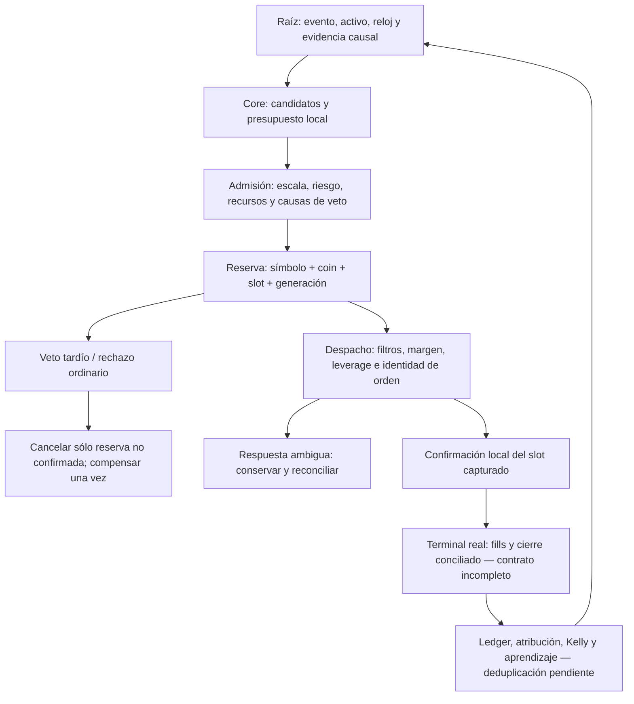

# Auditoría de fundamentos científicos XXXVII — reservas, capital y admisión espectral

Fecha: 2026-09-25. Snapshot local de main, HEAD 59a76de4be726098d9af934b4d35987e9a636802, con cambios compartidos previos. Continuación de [XXXVI](<C:/Users/jhona/Documents/Proyectos/Trader Gemini/docs/AUDITORIA_FUNDAMENTOS_CIENTIFICOS_XXXVI_2026-09-25.md>). [Artefacto verificable XXXVII](<C:/Users/jhona/Documents/Proyectos/Trader Gemini/docs/artifacts/auditoria_fundamentos_XXXVII_2026-09-25.json>).

## 1. Dictamen y alcance real

Se corrigieron defectos locales que podían fabricar una asignación positiva con evidencia desfavorable, deshacer penalizaciones de riesgo mediante un mínimo, borrar reservas ajenas, confirmar el slot equivocado e invertir el signo del PnL de emergencia. No se certifica el sistema completo, la rentabilidad, la paridad demo/producción ni la autoevolución. Las modificaciones del host son fuente comprobada, no un despliegue.

Se incorporan FMT-275 a FMT-278. Se amplían, sin duplicar IDs, FMT-113, FMT-186, FMT-266 y FMT-273. La matriz histórica de 305 puntos y los informes anteriores no se reescriben ni se equiparan automáticamente a este catálogo FMT: sus unidades de conteo y estados históricos son distintos.

Cobertura acumulada conservadora: 166/289 Rust preexistentes leídos completamente; quedan 123. El inventario heredado contiene 1.119 archivos versionados y 24 Cargo.toml; inventariar no equivale a revisar semánticamente cada archivo. La nueva lectura completa contabilizada es capital_compounder.rs, 222 líneas al inicio. Se releyeron router.rs y epigenetic_fitness_landscape.rs, ya cubiertos antes, y tramos de position.rs, core, host y trade_accounting.rs. Los archivos nuevos de esta ronda se revisaron, pero no incrementan el denominador preexistente. No se afirma cobertura integral de archivos no Rust.

## 2. Grafo vivo: raíz, decisión, terminal y realimentación



La arista reserva→confirmación identifica ahora al ocupante local. No demuestra por sí misma la arista respuesta→fill. La arista cierre→aprendizaje tampoco es fiable sólo porque exista una entrada confirmada. Una red conectada en llamadas puede seguir desconectada en unidades, identidad, causalidad o versión del estado.

El objetivo continuo no exige capacidad infinita ni eliminar todas las decisiones discretas. Exige que una aproximación finita del campo multiactivo tenga dominio, resolución, error, soporte y presupuesto declarados. Un timestamp de nanosegundos no crea observaciones a esa frecuencia; una coordenada de cien años no aporta cien años de evidencia. No se implementó un barrido de todos los nanosegundos.

## 3. Matriz consolidada de esta ronda

| ID | Prioridad / estado | Defecto comprobado | Resultado y límite |
| --- | --- | --- | --- |
| FMT-273, continuación | P1 / reparación parcial | Rollback por símbolo cerraba todos sus slots | Cancelación por reserva y generación; transición y compensación probadas. No es ledger durable |
| FMT-266, continuación | P1 / reparación parcial | Veto de drift tardío dejaba la propuesta ya reservada | Host cancela la reserva actual por memoria/drift; recuperación causal sigue pendiente |
| FMT-275 | P1 latente / reparación parcial | PF inflado, piso de riesgo, veto WR40%, NaN/bounds | Contrato numérico y admisión corregidos; helper sin caller operacional localizado |
| FMT-276 | P2 / reparación parcial | Capital inválido se financiaba ficticiamente y capacidad dependía de unidad | Cero capacidad ante invalidez, cociente sin piso monetario; política de capacidad sigue heurística |
| FMT-277 | P1 / reparación parcial | Confirmación fija y más reservas que órdenes retornadas | Confirmación por token; máximo una propuesta exitosa por llamada. Orden de candidatos y carreras externas abiertos |
| FMT-278 | P1 / reparación parcial | PnL de emergencia invertido en ambos lados | Host usa gross_pnl común; identidad, fill, fee de salida y deduplicación siguen abiertos |
| FMT-186, continuación | P1 / abierto funcionalmente | Corte logarítmico, fallback temporal y tres slots presentados como ortogonalidad | Cuatro diagnósticos y documentación corregida; política no sustituida sin evidencia |
| FMT-113, continuación | P1 / abierto | Margen ya reservado vuelve a descontarse en admisión; leverage no reduce pérdida nocional | Se traza el recorrido y un contraejemplo contable; requiere presupuesto conjunto |

P1 indica gravedad del mecanismo si la ruta se usa, no evidencia de una pérdida en la cuenta. Un helper sin caller localizado no se presenta como causa demostrada del comportamiento actual en producción.

## 4. FMT-273 / FMT-266 — propiedad de la reserva y cancelación tardía

Fuentes: [EntryReservation](<C:/Users/jhona/Documents/Proyectos/Trader Gemini/crates/god-engine-core/src/entry_reservation.rs>), [Position](<C:/Users/jhona/Documents/Proyectos/Trader Gemini/crates/quantum-arena/src/position.rs>), [core](<C:/Users/jhona/Documents/Proyectos/Trader Gemini/crates/god-engine-core/src/lib.rs>) y [host](<C:/Users/jhona/Documents/Proyectos/Trader Gemini/src/bin/god_engine.rs>).

### Causa y daño

La unidad del rechazo era una orden propuesta, pero la unidad del rollback era el activo completo. En XXXVI se reprodujo el cierre local de un slot propuesto y otro confirmado, liberando ambos márgenes. Borrar la representación local de una exposición remota no la cierra remotamente: puede ocultarla a riesgo, protección y aprendizaje.

La reparación introduce una identidad local con coin_id, índice de slot, generación y símbolo. El índice se valida con acceso acotado: no se permite que un índice inválido caiga silenciosamente en el último slot. Se comprueba símbolo contra registro y se compara generación bajo el cerrojo de transición de Position. Sólo una posición abierta y no confirmada puede cancelarse por rechazo.

La cancelación ganadora devuelve el margen y fee del ocupante exacto; únicamente ella compensa los átomos de cartera. Repetición, generación vieja, símbolo discordante o posición confirmada retornan error. La API de confirmación comparte el mismo cerrojo: una cancelación y una confirmación cooperantes de la misma generación no pueden ganar simultáneamente.

### Integración y comportamiento nuevo

El core conserva el token de su propuesta y el host lo captura inmediatamente después de process_event. Los rechazos ordinarios asíncronos usan una copia, no una búsqueda futura de «la posición del símbolo». El veto tardío por memoria o drift cancela esa misma reserva antes de descartar new_order. Si falta identidad o una transición no es aplicable, se marca necesidad de reconciliación y no se adivina otro slot.

El adaptador rollback_position(coin_id) ya no barre todas las posiciones. Sólo cancela la reserva registrada por esa instancia del core; sin token no hace nada. Los consumidores asíncronos deben guardar la identidad antes de la siguiente llamada, que limpia la propuesta efímera.

Una emergencia posterior a una entrada confirmada deja de reutilizar la cancelación de una entrada no ejecutada. El estado se conserva y se marca dirty para reconciliación; no se reembolsa la comisión de entrada como si el exchange nunca hubiese participado.

### Evidencia y frontera de garantía

Seis pruebas de reserva verifican preservación del vecino confirmado, devolución exacta, no duplicación, slot reutilizado, confirmación del slot correcto, símbolos/índices inválidos y ocho canceladores concurrentes. Tres pruebas de Position verifican cancelación, confirmación y 64 carreras controladas de ambos contendientes. Son pruebas de intercalados observados, no demostración formal de todos los intercalados posibles.

Siguen abiertos:

- Los campos atómicos de Position son públicos: reconciliación, adopción u otros escritores directos pueden saltarse el protocolo. No existe una garantía global sólo por añadir un método seguro.
- Cerrar el slot y modificar los dos átomos de cartera son pasos separados. Un crash/intercalado o una reconciliación de saldo entre ellos requiere ledger transaccional; no está resuelto.
- El registro global de símbolos puede cambiar entre validación y transición. El token no contiene cuenta/entorno, arena_id, ID durable de intención/orden, versión del universo ni fill_id.
- La generación esperada se calcula antes de abrir. Otra transición puede intercalarse; confirmar/cancelar fallará por identidad, pero la emisión no tiene un protocolo durable claim→submit que excluya enviar una intención obsoleta.
- open_with_tau_and_fee todavía permite reemplazar un ocupante abierto; no se convirtió en reserve-if-empty. get_slot legacy conserva su alias inválido fuera de la nueva API.
- Cancelar una propuesta no limpia por sí solo todos los registros auxiliares de trayectoria, tensor o consejo. La generación ayuda a rechazar atribución incorrecta, pero no equivale a rollback transaccional de toda la red.
- La recuperación de drift sigue sin deduplicación por outcome/incidente. Los otros kill-switches pueden bloquear cierres defensivos; el diagnóstico OPEN heredado sigue reproduciéndolo.

**Cierre requerido:** intención inmutable por cuenta/activo/pierna, reserva compare-and-transition, ledger de compensaciones, evidencia de submit/fill por identidad y recuperación independiente de las nuevas operaciones.

## 5. FMT-275 — dimensionamiento: admitir evidencia no es fabricar ventaja

Fuente: [capital_compounder.rs](<C:/Users/jhona/Documents/Proyectos/Trader Gemini/crates/risk-engine/src/capital_compounder.rs>). Búsqueda en crates y src: no se localizó un consumidor operacional de calculate_compounding_position_notional; sus consumidores encontrados son tests. Corregirlo no demuestra cambio efectivo del sizing vivo.

### Defectos y contraejemplos

1. PF se llevaba a un mínimo de 1,01. Un PF negativo, cero o inferior a uno podía transformarse en ventaja positiva; la validación de finitud no hacía válido el significado estadístico.
2. Win rate <40% vetaba incluso una combinación de pagos con esperanza positiva. Con p=0,2 y PF=2, el modelo binario implica razón beneficio/pérdida b=8; la fracción Kelly interior es 0,1. Una tasa baja de acierto no basta para rechazar ese modelo.
3. El piso inicial 0,005 y el clamp final mínimo podían anular penalizaciones. Una correlación multiplicativa de 1e-9 reducía el tamaño, pero el mínimo lo inflaba de nuevo. «Respetar un mínimo» no puede violar el presupuesto máximo calculado.
4. Correlación NaN se convertía en factor neutro1. Límites invertidos/no finitos y otros parámetros fuera de dominio no tenían un contrato homogéneo. Evidencia ausente podía autorizar riesgo.

### Reparación

Se exige capital finito positivo; p, confianza, Hurst, drawdown y factor de correlación en [0,1] y finitos; PF finito >1; 0≤mínimo≤máximo≤1. Se elimina el piso de PF, el veto WR40% y el piso de Kelly. El máximo limita el resultado, y un resultado por debajo del mínimo se abstiene: retorna0 en vez de elevarse al mínimo.

El valor0 mantiene la firma legacy, pero mezcla configuración inválida, evidencia insuficiente, ventaja no positiva y tamaño no factible. Hace falta un resultado tipado para explicar cada veto y medir su frecuencia por causa. No se ha creado una falsa distinción interpretando todos los ceros como «no hay alpha».

### Qué significa la fórmula y qué no significa

Derivación del caso ideal de dos pagos fijos, fracción f de riqueza arriesgada, beneficio b por unidad perdida y 0<p<1:

```text
g(f) = p·log(1+b·f) + (1-p)·log(1-f)
g'(f) = p·b/(1+b·f) - (1-p)/(1-f)
f* = p - (1-p)/b
PF = p·b/(1-p)  =>  f* = p·(1 - 1/PF)
```

g es crecimiento logarítmico esperado por apuesta bajo esos pagos y probabilidades, no retorno garantizado. Un PF empírico agregado y un win rate con pagos variables no identifican la distribución completa; usar la identidad como estimador no prueba optimalidad. Los extremos p=0/1 no determinan b mediante ese despeje con PF finito y requieren su propia semántica de evidencia.

La función devuelve capital×fracción y lo llama nocional. Si f representa presupuesto de pérdida, nocional N y distancia adversa d obedecen aproximadamente N·d, más costes y gaps; no N por sí solo. En cartera hay dependencia y exposiciones compartidas. No se añadió una conversión artificial sin d, costes, distribución conjunta y restricciones del instrumento.

Persisten multiplicadores heredados: Half-Kelly, confianza con piso0,5, distancia de Hurst a0,5 elevada a1,5 y acotada, recompensa de rachas, castigo de pérdidas y exp(-15DD) con piso0,01. Son políticas heurísticas sin garantía de probabilidad de drawdown. Hurst no determina por sí solo alpha ni dirección. _wealth_factor sigue sin uso. El factor escalar de correlación no es una covarianza multiactivo.

### Pruebas

Seis tests fallaron antes de la reparación y pasan después. Nueve pruebas finales cubren además monotonicidad respecto a la penalización de correlación, dominios inválidos y equivariancia al cambio de unidades del capital. No prueban rentabilidad fuera de muestra ni calibración de los multiplicadores.

## 6. FMT-276 — capacidad ficticia y dependencia de la unidad monetaria

get_capital_regime_metrics sustituía capital inválido por13 y drawdown inválido por0. Podía devolver slots financiados sin una cuenta válida. Además, base_capital.max(1) antes del cociente introducía una unidad monetaria implícita: 0,52/0,13 y52/13 representan la misma razón, pero producían capacidades diferentes al expresar fondos en dólares o centavos.

Ahora la invalidez retorna cero capacidad y métricas cero; se valida también el desbordamiento del cociente. La razón usa current/base, sin piso monetario en el denominador. Se mantiene la política max(ratio,1): una caída de riqueza por debajo del capital base sigue sin reducir esa razón. No se disfraza esa limitación como adaptación.

La capacidad es floor(1+sqrt(ratio)), acotada entre1 y10 cuando la entrada es válida. No es exponencial y necesariamente tiene saltos por ser entera. El split deriva de una penalización cuadrática de DD/0,10 con coeficientes0,95 y0,85; no integra energía de un espectro ni estima una distribución óptima de riesgo. El alias scalp_capital_split persiste por compatibilidad; renombrarlo no haría continuo el cálculo. No se encontró caller operacional externo de esta API.

**Cierre requerido:** separar capacidad de recursos, presupuesto económico y distribución por escala; declarar unidades y origen de cada parámetro, sustituir defaults por estados de evidencia y validar la política con escenarios de patrimonio decreciente, exposición existente y cambios de moneda.

## 7. FMT-277 — desajuste entre propuesta, slot y confirmación

La selección podía reservar un slot distinto de position, pero el host confirmaba siempre positions.position. Un ACK de la intención A podía dejar A no confirmada y marcar B como real. Ello afecta admisión, reembolso de fees, clasificación de cierres y aprendizaje.

Además, el bucle puede tener dos candidatos mientras la API retorna un único Option de orden. Sin un corte tras el primer éxito, una segunda apertura podía reemplazar new_order y dejar la primera reserva sin su despacho correspondiente. Es una ruta estática posible, no un conteo observado de operaciones reales.

Se confirma ahora mediante el token capturado y se detiene el bucle al primer candidato exitoso. Se mantienen la firma y el orden de evaluación, no se afirma que el primer candidato maximice utilidad. El segundo puede considerarse en otra llamada; falta una selección conjunta o una lista explícita de propuestas si se desea reservar varias.

La confirmación por slot tiene prueba de contrato directa. El límite de una propuesta se inspeccionó y se verificó por compilación; no se añadió una reproducción end-to-end forzando todas las condiciones de ambos candidatos en el core real. Esta diferencia de evidencia queda registrada.

Permanece abierta la semántica de Ok(()) en dispatch_entry: no expone aquí identidad, cantidad, precio y terminalidad del fill. Confirmar localmente después de esa respuesta no convierte automáticamente un ACK/NEW/parcial en ejecución completa. Los manejos de cierre del host aún leen el slot fijo position en tramos distintos del corregido. La adopción también conserva rutas fijas; no se certificó toda la gestión multislots.

## 8. FMT-278 — emergencia con PnL de signo contrario

record_emergency_close calculaba (entrada−salida)·cantidad·signo, con signo+1 para largo. Para entrada100, salida110 y cantidad2 devolvía−20 en un largo, cuando el bruto correcto es+20; para el corto invertía el error. El proyecto ya tenía gross_pnl con la convención correcta, pero esta ruta había duplicado la fórmula antigua.

El host utiliza ahora esa función común. Una prueba aritmética cubre ambos lados, ganancias/pérdidas y cambios compensados de unidades precio/cantidad. Otra prueba inspecciona estáticamente que la función del host delegue: falló antes y pasa después. Es una prueba de cableado textual, no un test de fill del host; cargo check verifica por separado la integración tipada.

Persisten fallos de contrato: el helper busca el primer slot del lado o incluso otro slot abierto; no recibe generación/ID de cierre. Usa precio vivo del arena como salida, no fill confirmado. Sólo aporta entry_fee, sin fee de salida real; no establece atribución pro-rata completa. El helper gross_pnl legacy tampoco ofrece error tipado para contexto desconocido o todo resultado no finito. El registro entra en la cola de contabilidad, de modo que el error puede afectar aprendizaje; no se ejecutó esa cola operacional durante la prueba.

Retener una posición confirmada tras una emergencia evita borrarla/refundarla como reserva rechazada, pero aumenta la importancia de resolver terminalidad y deduplicación antes del siguiente cierre local. Sin outcome_id durable, la misma salida puede seguir representada por varias evidencias. La purga cancel_all_symbol_orders después del intento de cierre sigue siendo por símbolo y puede ejecutarse aunque falle el cierre: no se reparó aquí la protección de órdenes ajenas o exposición residual.

**Cierre requerido:** ejecución de salida por identidad, reconciliación de cantidades acumuladas, fees de cada fill, contexto de entrada congelado y un único outcome consumible. Un precio aproximado debe permanecer etiquetado como estimación y no entrenar como hecho confirmado.

## 9. FMT-186 — el continuo no elimina la necesidad de justificar decisiones

Se reproduce y amplía el hallazgo XIX, no se cuenta como descubrimiento nuevo. find_resonant_slot mantiene tres slots, rechaza misma dirección si |Δlogτ|<0,80, sustituye τ inválido o≤10ms por30.000ms y devuelve el primer slot libre. Un nanosegundo expresado como1e-6ms no conserva su identidad al cruzar esa función. El campo persistido de τ es un u64 de milisegundos.

El core añade otro corte1,50 con retorno no realizado de28bps. Su comentario prometía posición asegurada o stop positivo; el tramo inspeccionado sólo calcula PnL no realizado, no verifica protección ejecutable ni elimina gaps/costes. Se corrigió la descripción, no se cambió el umbral.

La distancia entre escalas puede servir como regularización heurística. No demuestra independencia: para filtros exponenciales causales normalizados, el producto interno es sech(|Δlogτ|/2), aproximadamente0,925 enΔ=0,80. Es un contraejemplo algebraico, no correlación medida de esta estrategia. Direcciones opuestas tampoco garantizan diversificación de margen, liquidez, basis o riesgo de ejecución.

Cuatro diagnósticos nuevos reproducen fallback temporal, discontinuidad alrededor de0,80, capacidad física de tres y alias de índice inválido. Pasan porque muestran el comportamiento abierto. El contrato seguro de reserva no usa ese alias, pero los demás callers legacy sí pueden hacerlo.

No se quitaron límites de solvencia, filtros del exchange ni frenos de protección. Se retiran afirmaciones científicas no sustentadas en comentarios. Sustituir la política exige medir dependencia conjunta condicionada a activo/escala/contexto, incertidumbre y coste incremental; no basta cambiar scalping/swing por nombres espectrales.

## 10. FMT-113 — doble consideración de reserva en el margen y riesgo nocional

El core incrementa used_margin antes de publicar la propuesta. El host asíncrono calcula free_margin=capital−used_margin y compara de nuevo el margen requerido de esa propuesta contra0,85 y0,95 de ese remanente. No identifica ni excluye su propia reserva; tampoco presenta un snapshot conjunto de equity, margen comprometido y reservas.

Contraejemplo contable, no simulación de Binance: capital100, sin otras posiciones, reserva propia60, nocional60 y leverage solicitado1. El host ve libre40; required60>34 dispara ceil(60/(0,80×40))=2. El margen30 pasa el límite38. Se cambió apalancamiento por un déficit causado por descontar primero la reserva; el margen local reservado puede seguir siendo60. Otras combinaciones pueden rechazarse, incluso cuando el presupuesto antes de esa reserva era factible.

El apalancamiento modifica margen y liquidación, no reduce la pérdida direccional de un nocional fijo: aproximadamente |q|·precio·distancia_stop, más costes/gaps. Restituir «mi margen» mediante una suma suelta tampoco resuelve concurrencia, cuenta cruzada, fill parcial o reconciliación. Requiere un ledger de reservas y una proyección conjunta de cantidades, no otro umbral.

No se cambió este circuito sin ese contrato. Se conserva FMT-113 como abierto y conectado explícitamente a la nueva identidad local, que es necesaria pero insuficiente.

## 11. Teoría e integración: hipótesis antes que prestigio

Se usaron las skills Firecrawl y Firecrawl Research Index: búsqueda de la familia Kelly, expansión por citas y lectura de pasajes del cuerpo de dos fuentes primarias. La CLI no estaba disponible; se utilizó el conector disponible, sin instalar nada ni enviar código privado. Nota reproducible local en .firecrawl/XXXVII-kelly-risk.md, excluida de Git.

[Risk-Constrained Kelly Gambling](https://arxiv.org/abs/1603.06183) diferencia maximización del log-crecimiento y control probabilístico de drawdown. El modelo leído usa retornos no negativos, asignaciones normalizadas, efectivo y repeticiones IID. Esto no habilita trasladar automáticamente sus garantías a futuros apalancados, costes, gaps y parámetros que cambian online. Half-Kelly y exp(-15DD) no implementan por sí solos su restricción probabilística.

[Distributional Robust Kelly Gambling](https://arxiv.org/abs/1812.10371) considera el peor log-crecimiento esperado dentro de un conjunto de distribuciones. Los pasajes verificados subrayan la dificultad de especificar un conjunto útil y el compromiso entre cobertura, conservadurismo y tratabilidad. Aquí orienta el diseño futuro de incertidumbre explícita; no se añadió un optimizador ni un radio arbitrario.

La familia localizada incluye además [ambigüedad y chance constraints](https://arxiv.org/abs/1906.01981), [Kelly binario y utilidades](https://arxiv.org/abs/2502.16859) y [Kelly para resultados mutuamente excluyentes](https://arxiv.org/abs/2604.11577). Sólo se revisaron sus metadatos/resúmenes; son candidatos de investigación, no fundamento verificado de una reparación ni prueba de aplicabilidad a activos simultáneos.

La influencia concreta de la investigación fue limitar la afirmación de «Kelly exacto», distinguir tamaño de riesgo y nocional, y conservar abierta la calibración conjunta. No se incorporaron ecuaciones de problemas del milenio ni mecanismos cuánticos por analogía verbal. Una propuesta futura necesita observables, supuestos identificables, error de estimación, baseline clásico, coste computacional y mejora reproducible fuera de muestra.

## 12. Módulos: impacto y pendientes

| Módulo | Evidencia de esta ronda | Pendiente relevante |
| --- | --- | --- |
| 1. Ingestión/L2 | Reejecución de contratos stateful y liquidaciones | No equivale a revisar todos los parsers o libros |
| 2. IA/señales | Se preserva identidad para no confirmar ocupante ajeno | Predicción congelada, fill y outcome deben compartir lineage |
| 3. Multiactivo/horizontes | Diagnósticos del corte y capacidad; máximo una propuesta retornada | Estimación conjunta, error de discretización y sesgo de orden |
| 4. Ejecución/red | Cancelación y confirmación por token; tests del dispatcher | ACK/fill, claim-submit y protección por pierna/orden |
| 5. Riesgo/genomas | Correcciones numéricas del compounder; signo de emergencia | Helper sin caller, políticas heurísticas, paridad de consumidor |
| 6. Estado/memoria | Transiciones cooperantes bajo lock; sin alterar layout Position/GlobalArena | Escrituras externas, snapshot contable, crash y fair scheduling |
| 7. Confluencia/ciencia | Se precisan afirmaciones de ortogonalidad | No hay demostración de ventaja cuántica o independencia |
| 8. Auditoría/gobernanza | Pruebas separadas de OPEN, hashes y continuidad documental | Cobertura pendiente, OOS real, promoción durable y conciliación |

El lock de transición es un spin lock, no una prueba de espera acotada ni de progreso lock-free. No se midieron p50/p99, throughput, uso de CPU o latencia bajo preempción. El token contiene un String y se clona para el consumidor; tampoco debe publicitarse como cero asignaciones. No se modificó layout de GlobalArena/Position; GodEngineCore sí recibe almacenamiento privado de propuestas.

## 13. Verificación reproducible

109 pruebas distintas aprobadas, sin fallos finales: 103 comportamiento/compatibilidad, 1 conexión estática, 5 diagnósticos OPEN. Los OPEN no se suman como reparaciones. Nuevas24:19 funcionales,1 estática y4 OPEN. Una prueba OPEN de XXXVI se reclasifica como compatibilidad segura después del cambio del rollback. Seis fallos numéricos iniciales y un fallo de conexión estática pasan tras los cambios; no son siete incidentes de producción.

| Suite/filtro | Cantidad | Naturaleza |
| --- | ---: | --- |
| core/close_outcome_contract | 26 | 25 funcionales,1 OPEN kill-switch defensivo |
| core/entry_reservation_contract | 6 | Funcionales |
| arena/position_generation_contract | 3 | Funcionales y carreras controladas |
| risk/compounder_admission_contract | 9 | Funcionales/metamórficas |
| arena/slot_admission_open_diagnostics | 4 | OPEN |
| core/stateful_transition_contract | 22 | Regresión funcional |
| core/liquidation_state_contract | 7 | Regresión funcional |
| core/decay_causality_contract | 10 | Regresión funcional |
| execution/entry_route_contract | 10 | Mocks/adaptador paper, sin red |
| execution/emergency_accounting_wiring_contract | 2 | 1 funcional y1 estática |
| arena --lib position::tests | 8 | Compatibilidad; no certifican los nombres de sus tests |
| risk --lib capital_compounder::tests | 2 | Compatibilidad |

Comandos: cargo test --offline -j1 con los paquetes/targets de la tabla y --test-threads=1; filtros --lib sólo donde se indican. cargo check --offline -j1 -p trader-gemini-v5 --bin god_engine --bin evolver --bin walkforward_evolver. Advertencias conocidas: latest_ts, mode, trades en evolución y toxic en walkforward. No se ejecutó suite global, binario operativo, entrenamiento, promoción ni reinicio.

Las pruebas del core que podrían escribir datasets usan su fixture temporal aislada. Las de emergencia sólo realizan aritmética y leen el fuente embebido: no escriben diarios ni encolan cierres. No se tocó una cuenta ni se enviaron órdenes.

Se conservan los 41 hashes de modelos heredados. El JSON registra fuentes, referencias, prefijos normalizados de los tres documentos ampliados, comandos, clasificación de tests y limitaciones. No hubo commit, push, merge, fetch, reset o checkout. Main sigue sucia con trabajo compartido; no se verificó el estado remoto.

## 14. Hoja de ruta 1-a-1

1. Extender intención/reserva a claim→submit→fill→exit con identidad durable de cuenta, activo, pierna y generación. No conectar aprendizaje antes de resolver esta cadena.
2. Migrar escritores directos y cierres fijos del host al contrato de identidad; reservar sólo slots libres, con rollback de estado auxiliar y reconciliación idempotente.
3. Sustituir margen global leído por partes por un ledger de reservas/exposición con proyección conjunta de q, costes y límites del instrumento.
4. Clasificar cada veto: datos inválidos, incertidumbre, infeasibilidad económica, protección o recursos; guardar origen, versión, alcance, expiración y evidencia de recuperación.
5. Resolver FMT-278 completo con fills y fees reales, contexto congelado y deduplicación. La fórmula correcta no basta para que el label sea correcto.
6. Evaluar escalas en logτ como aproximación del campo multivariante, con soporte/incertidumbre y dependencia entre activos; comparar con los cortes legacy mediante ablations y OOS.
7. Auditar consumidor por consumidor del genoma en backtest/demo/prod; un gen sin consumidor o un override posterior no es autoevolución efectiva.
8. Continuar las123 lecturas completas pendientes, además de los archivos no Rust, con inventario de evidencia y sin convertir tests verdes en certificado universal.

## Adenda de continuidad XXXVIII — 2026-09-25

[Informe XXXVIII](<C:/Users/jhona/Documents/Proyectos/Trader Gemini/docs/AUDITORIA_FUNDAMENTOS_CIENTIFICOS_XXXVIII_2026-09-25.md>) y [artefacto XXXVIII](<C:/Users/jhona/Documents/Proyectos/Trader Gemini/docs/artifacts/auditoria_fundamentos_XXXVIII_2026-09-25.json>) amplían, sin sustituir, las conclusiones de esta ronda. FMT-278 usa ahora aritmética checked: error numérico marca reconciliación y no genera outcome de emergencia. No se cierran identidad/fill/fees/dedup por ese cambio.

FMT-279–283 documentan gate numérico del aprendizaje, serializers JSON sin truncación fija, durabilidad/colas pendientes, shadow auxiliar incompleto, fee-breaker con unidad experimental y alcance temporal incorrectos, y tipos exactos de bracket sin afirmar autenticación.78 pruebas únicas (69funcionales,2estáticas,7OPEN) y check de tres binarios;41 modelos intactos. Cobertura168/289Rust,121pendientes. Los estados y cifras anteriores permanecen como historial; no se presentan como verificación global ni paridad operacional.
