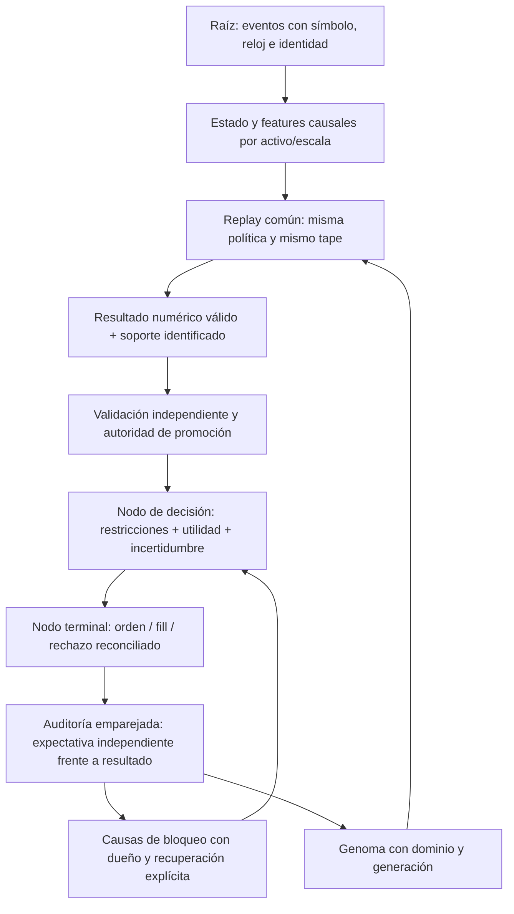

# Auditoría científica XXXV — evaluación comparable, evidencia numérica y auditoría de los vetos

Fecha: 2026-09-25. Continuación aditiva de [XXXIV](<C:/Users/jhona/Documents/Proyectos/Trader Gemini/docs/AUDITORIA_FUNDAMENTOS_CIENTIFICOS_XXXIV_2026-09-25.md>). [Artefacto estructurado XXXV](<C:/Users/jhona/Documents/Proyectos/Trader Gemini/docs/artifacts/auditoria_fundamentos_XXXV_2026-09-25.json>).

## 1. Dictamen ejecutivo y límites de certificación

Se reparan tres contratos: cálculo numérico de fitness compartido entre core y evolución; comparación de Darwin sin baseline ficticio y con replay/política de drawdown comunes; alcanzabilidad de la alerta de agotamiento temporal. La nueva API distingue datos inválidos de soporte insuficiente. Los wrappers históricos mantienen el sentinel de inadmisibilidad para no convertir un cambio numérico en una reescritura completa de selección.

La revisión de los propios auditores encuentra defectos que podían ocultarse tras etiquetas tranquilizadoras: drift NaN devuelve éxito, “shadow” se calcula desde el propio resultado real, un contador llamado consecutivo no se reinicia al fallar, el rearme borra una bandera compartida sin propiedad de causa, y un supuesto SPRT no calcula la razón de verosimilitud declarada. Estos problemas quedan abiertos, no “solucionados” porque exista un test que los reproduzca.

Se añaden seis entradas FMT-262–267 y se continúa FMT-259, FMT-047 y FMT-048. Son unidades documentales de defecto, no seis incidentes monetarios observados ni una renumeración de la matriz histórica de 305 puntos. No se afirma que todo el sistema sea ya autoevolutivo, continuo, cuántico o equivalente entre backtest/demo/producción.

## 2. Cobertura y método

La ronda anterior acreditaba 157/289 Rust preexistentes. Se leen completos tres archivos nuevos: trajectory_auditor.rs, 380 líneas base; drift_auditor.rs, 139; behavioral_auditor.rs, 125. Acumulado conservador: **160/289 Rust; 129 pendientes**. El lib.rs de audit-engine también se inspecciona completo, pero no se añade al contador para evitar duplicación de cobertura histórica incierta.

Se releen completos darwin.rs y fitness.rs; las inspecciones del core y host se concentran en los consumidores de evaluación, trayectoria y drift, no cuentan como nuevas lecturas completas. Se revisan el módulo numérico y todos los nuevos tests. Inventario histórico: 1.119 archivos versionados y 24 manifiestos Cargo; ni búsquedas globales ni pruebas sustituyen lectura íntegra de los demás archivos.

La metodología distingue: reproducción ejecutable aislada; evidencia estática de consumidor; inferencia económica condicionada; y propuesta de investigación. Se captura el estado anterior, se observan ocho fallos válidos antes de reparar y se comprueban después. No se ejecuta evolve_online ni una promoción sobre el almacén operativo.

## 3. Topología raíz → decisión → terminal → evidencia



El grafo es un contrato de referencia, no una afirmación de que todos sus enlaces existan. Esta ronda fortalece E y Q y repara una rama de diagnóstico temporal. La falta de expectativa independiente, de identidad de posición/generación y de propiedad del kill-switch rompe todavía el lazo de adaptación verificable.

## 4. Matriz de resolución de esta ronda

| ID | Prioridad | Estado | Evidencia y alcance |
|---|---|---|---|
| FMT-262 | P1 | Reparación numérica local | Overflow/underflow del cociente, DD/OOS/prior inválidos; core y evolución |
| FMT-259, continuidad | P1 | Reparación parcial | Un replay y un DD capturado para ambos lados; equivalencia completa sigue abierta |
| FMT-263 | P1 | Reparado el baseline ficticio | No comparar NaN/inf/ausencia como pérdidas finitas; Darwin legacy opcional |
| FMT-264 | P2 | Alerta temporal reparada; otros contratos abiertos | Auditor de trayectoria conectado a telemetría; no ordena cierres por sí mismo |
| FMT-265 | P1 | ABIERTO | Drift inválido/pareja no identificada y shadow endógeno; consumidor puede armar/rearmar |
| FMT-266 | P1 | ABIERTO | Secuencia de rearme y propiedad del kill-switch; prueba estática del host |
| FMT-267 | P2 | ABIERTO; documentación precisada | “SPRT” no corresponde a la LLR gaussiana; sin caller operativo localizado |
| FMT-047 / FMT-048 | P1 | Afirmaciones corregidas / deuda de admisibilidad abierta | Preferencia de DD y sentinel de abstención no son leyes científicas |

## 5. FMT-262 — evidencia numérica inválida dentro del fitness

### 5.1 Mecanismo y reproducción

Las dos implementaciones calculaban primero final/initial y después ln. Los extremos 1e−300 y 1e300 son positivos y finitos, pero el cociente produce infinito; al invertirlos produce cero y ln(0)=−infinito. El log-crecimiento correcto permanece representable, aproximadamente ±1381,551. Se obtenía un candidato con score infinito o una falsa ruina por una operación intermedia, no por el resultado económico especificado.

El core propagaba DD=NaN a score=NaN. Evolution reemplazaba DD no finito por 1 y producía un score finito: con capital100→110, aproximadamente −2,67727854. No son contratos equivalentes. OOS con inicio NaN se transformaba en factor1, conservando un score positivo de 0,06758429 en el fixture. Un prior NaN de arranque en frío propagaba NaN a la aptitud. Las siete pruebas numéricas fallaron antes de reparar; la octava reproducción corresponde a la alerta temporal.

### 5.2 Contrato compartido y significado de los cálculos

[fitness_contract.rs](<C:/Users/jhona/Documents/Proyectos/Trader Gemini/crates/god-engine-core/src/fitness_contract.rs>) implementa log_capital_growth y checked_fitness. Evolution ya depende del core, por lo que reutiliza el contrato sin añadir dependencia circular ni librerías externas.

```text
g = ln(W_final / W_inicial)
  = ln(W_final) − ln(W_inicial)    cuando el cociente no es representable
F_base = g − lambda · clamp(DD, 0, 1)^2
lambda = 4 ln 2                   preferencia heredada, no parámetro estimado
```

La división ordinaria se conserva cuando su resultado es positivo y finito; la diferencia de logs recupera extremos. W debe ser positivo y finito. Un cambio común de moneda multiplica ambos W por la misma constante y no cambia g, dentro del redondeo. Apalancar no es cambiar moneda: modifica la trayectoria y no deja F invariante.

FitnessError distingue capital inicial inválido, capital final inválido, DD inválido y número de operaciones inferior al mínimo declarado. El mínimo de 30 del core se conserva; no se rebautiza como tamaño muestral científicamente suficiente. El clamp de DD finito fuera de [0,1] se mantiene por compatibilidad y sigue requiriendo auditoría de dominio. No se crea una nueva constante económica.

Los wrappers devuelven −infinito ante error. Es compatibilidad de interfaz, no una buena representación final de todas las razones. Los consumidores que ordenan directamente ese sentinel todavía pueden confundir inadmisibilidad con utilidad; la API checked habilita, pero no completa, la migración.

### 5.3 OOS y contracción hacia prior

[fitness.rs](<C:/Users/jhona/Documents/Proyectos/Trader Gemini/crates/evolution-engine/src/fitness.rs>) mantiene la heurística: factor=1+max(−g_OOS,0); una base positiva se divide por el factor y una negativa se multiplica. Ahora exige extremos OOS positivos y finitos. No se convierte OOS inválido en “sin degradación”; capital final OOS agotado resulta inadmisible. Se elimina el piso intermedio 1e−12 del cociente: ese piso truncaba la severidad de pérdidas extremas.

La convención sin split —extremos OOS iguales y positivos— sigue admitida para callers existentes; equivale a desactivar esa penalización, NO a validar fuera de muestra. La reducción de score tampoco prueba sobreajuste, pues una pérdida OOS puede provenir de variación, costes, cambio de distribución o error de datos.

El prior se valida sólo cuando se utiliza, con soporte inferior al mínimo. Cuando se alcanza el mínimo, el prior no interviene y no debe bloquear un cálculo válido. Se comprueba finitud del score contraído. Su peso N/N_requerido sigue siendo una interpolación heredada; no se acredita un posterior bayesiano sin distribución previa y likelihood.

### 5.4 Alcance de la reparación

Los extremos son pruebas de dominio numérico, no saldos reales observados. La reparación no estima incertidumbre, no corrige dependencia temporal, no mide costes reales y no prueba que un genoma sea rentable. Se añaden tests de invariancia monetaria, antisimetría del log en extremos positivos, razones tipadas y compatibilidad de mínimos/clamps.

## 6. FMT-259 / FMT-263 — comparación de genomas sin fabricar evidencia

### 6.1 Comparabilidad local

[Darwin](<C:/Users/jhona/Documents/Proyectos/Trader Gemini/crates/god-engine-core/src/darwin.rs>) tenía dos bucles de replay. El candidato forzaba DD=0,95 y baseline no lo hacía. Ahora ambos llaman evaluate_genotype; replay_arena aplica el mismo genotipo y el mismo límite de drawdown capturado una vez de la configuración viva. Capital/política no finitos invalidan el ensayo antes de construir el motor.

Se prueban dos arenas con DD capturado0,20 y se verifica igualdad; también se compara el mismo genotipo sobre una pequeña cinta sintética. Son pruebas de igualdad del contrato local, no un ensayo de generalización. El constructor todavía toma defaults para campos no transportados y puede cargar modelos del registro global. Capturar DD y capital por lecturas independientes no constituye snapshot transaccional de toda la configuración.

Persisten el corte a primeros30slots, 4096ticks por slot, proxies macro de OmniSynth, selección y contraste en la misma cinta, drawdown sólo al cierre y ausencia de valoración terminal explícita de posiciones abiertas. No se han eliminado escalones maker/taker ni restaurado toda la historia de identidad del universo. FMT-259 no queda cerrado globalmente.

### 6.2 Baseline ausente convertido en una pérdida

Antes se reemplazaba fitness baseline no finito por −999999. La comparación negativa exigía superar 95% de ese número; por tanto, un candidato de utilidad negativa finita podía “ganar” contra un benchmark que en realidad no tenía evidencia suficiente. No había una pérdida medida cercana a un millón: era un sentinel fabricado.

meets_promotion_margin exige ahora dos scores finitos. Conserva el margen heredado de 5% y el mínimo1e−4 en la rama no negativa. No promueve por comparar contra −infinito, NaN o infinito. Una muestra insuficiente puede requerir ampliar observación o un protocolo de bootstrap autorizado; no permite inventar el valor de su benchmark.

### 6.3 Lo que ese gate no garantiza

Incluso con ambos finitos, −0,5 supera a −1 bajo el margen: comparación relativa no equivale a utilidad positiva, superioridad a cash, significación ni rentabilidad. Un test lo documenta expresamente. Los logs dejan de declarar “cambio de régimen detectado” y “genoma óptimo” basándose sólo en este criterio.

Darwin sigue siendo una ruta legacy condicionada por dos flags desactivados por defecto en código. No se activaron ni se leyó el entorno del proceso. La publicación de RAM anterior a persistencia de FMT-260 permanece abierta; no se ejecutó promote ni se afirmó resuelta su transacción.

### 6.4 Abstención y multiplicidad: continuidad de FMT-048

Un requerimiento de evidencia puede ser legítimo para certificar un candidato, pero no convierte mantener cash en una pérdida económica peor que cualquier estrategia perdedora. El sentinel legacy conserva esa ordenación en otros consumidores; hay un test OPEN que lo fija. Una rehabilitación completa debe separar utility, validity, support y promotion_authority, conservar benchmark de abstención y contabilizar todos los intentos adaptativos, incluyendo los descartados. No se reduce el mínimo de operaciones para generar actividad artificialmente.

## 7. FMT-264 — auditoría temporal con una rama imposible y semántica incompleta

### 7.1 Alerta imposible reparada

[TrajectoryAuditor](<C:/Users/jhona/Documents/Proyectos/Trader Gemini/crates/audit-engine/src/trajectory_auditor.rs>) calculaba r=elapsed/expected_duration y lo recortaba a3. Más abajo exigía r>4 para TimeExhaustionWithoutProgress. Ningún input podía satisfacerla.

Se retira ese recorte del ratio de diagnóstico; el componente de coherencia mantiene su propio min(1). Se conserva el umbral documentado y no se inventa otro. Fixture: entrada100, precio99,6, expectativa1%, duración1s, transcurridos5s y volumen esperado0. No activa momentum ni inanición, por lo que aísla agotamiento: antes Aligned≈0,45; ahora Divergent con ratio5. A exactamente4 duraciones no se activa, según el > heredado.

El host inspeccionado sólo escribe telemetría al recibir Divergent: no se anuncia esta reparación como nuevo cierre automático ni protección de pérdidas ejecutada.

### 7.2 Contratos aún abiertos

Input NaN, activo fuera de rango y track ausente devuelven Aligned con coherencia1. Eso confunde ausencia/invalidez con cumplimiento perfecto. Los defaults del constructor sustituyen precio inválido por1 y magnitud inválida por1%; así inventan hipótesis en lugar de conservar su falta de evidencia.

Un tick anterior al entry o al último update sigue sumando volumen y rebobinando last_update_ms. La resta saturada de tiempo no recupera causalidad; sólo oculta una duración negativa. Tampoco hay identidad de evento que impida contabilizar dos veces un tick repetido. El test reproduce reloj500 después de2000 y volumen acumulado10 después de dos aportes5.

La estructura mantiene scalp_tracks y swing_tracks con un booleano, aunque el host registra entradas con true y recorre ambas ramas. El host la construye con capacidad30, independientemente del universo potencial. Una evolución correcta debería identificar posición/generación/símbolo y horizonte continuo, no duplicar categorías de operador. No se hace una migración ciega de estructuras públicas en esta ronda.

### 7.3 Error no es fidelidad

record_exit calcula TCE=clamp(0,70·error_magnitud + 0,30·error_duración,0,1). Una trayectoria exactamente cumplida devuelve0. El consumidor la anuncia como “fidelidad” donde1 significa concordancia: está invertido el significado. Se prueba el cero exacto y se localiza el log; queda abierto en el host.

El error de magnitud es absoluto en retorno fraccional, mientras duración se normaliza por la expectativa. Aunque ambos sean adimensionales, sus escalas y pesos no están calibrados. El ratio adverso, los filtros de volumen y el agotamiento son reglas heredadas, no inferencia probabilística. Se retira la afirmación no medida de evaluación “en nanosegundos”.

## 8. FMT-265 — drift sin evidencia válida ni contraparte independiente

### 8.1 Fail-open numérico

[DriftAuditor](<C:/Users/jhona/Documents/Proyectos/Trader Gemini/crates/audit-engine/src/drift_auditor.rs>) define d=pnl_shadow−pnl_real. Si d es NaN, omite acumular; luego abs(d)>limit es falso y devuelve Ok(NaN). El test antiguo llamado inmunidad NaN incluso exige Ok. Inmunidad de memoria no es admisión de evidencia: un caller que interpreta Ok como “sano” recibe una clasificación incorrecta.

El límite tampoco se valida. Con max_allowed_drift=NaN, una diferencia2 devuelve Ok. El host localizado usa0,05 finito, por lo que ese caso de configuración es un defecto del API, no una configuración actual demostrada. Para PnL no finito, el problema sí está en el contrato usado por el consumidor.

### 8.2 Identidad y agregación

TradeResult contiene símbolo, lado y tiempo, pero la comparación sólo utiliza PnL. Dos operaciones de activos/lados distintos con el mismo PnL dan deriva0. Falta ID estable de trade/posición, generación, exposición y correspondencia causal. No se exige igualdad artificial de timestamps de fill real y simulado: naturalmente pueden diferir; hace falta una clave de emparejamiento y tolerancias documentadas.

La acumulación firmada permite cancelación y no constituye por sí sola una distancia ni un contraste estadístico. El umbral se aplica a cada diferencia, no al total, pese a comentarios del host que hablan de drift acumulado. Un fallo de suma por overflow no se reporta con un estado específico. No se declara el acumulado como estimador consistente de error de modelo.

### 8.3 El consumidor no compara backtest contra realidad

En [god_engine.rs](<C:/Users/jhona/Documents/Proyectos/Trader Gemini/src/bin/god_engine.rs>) el shadow suministrado es0,95·real_pnl_pct. Por tanto d=−0,05·real_pnl_pct y el umbral abs(d)>0,05 equivale, salvo redondeo, a abs(real_pnl_pct)>1. Es un centinela de magnitudes contables, no una expectativa independiente capaz de detectar modelo +0,4% frente a realización −0,4%.

El propio bloque reconoce parte de la limitación; la auditoría la conecta con el API y el rearme. Los entry_price de ambas estructuras son0 y no se validan. No se concluye que PnL real sea correcto: el bloque normaliza por qty·current_price, no reconstruye por sí solo coste/exposición de entrada.

Cierre necesario: resultado tipado Invalid/MissingPair/MeasuredWithin/MeasuredOutside, identidad estable y estimando explícito; separar comparación predictiva de centinela contable. No se transforma a ciegas todo error en señal de mercado ni se flexibiliza el umbral.

## 9. FMT-266 — “diez cierres consecutivos” y propiedad del veto

La rama Err arma kill_switch_active y aumenta drift_kill_armed_at, pero no reinicia drift_clean_closes. Una secuencia de cierres limpios, nueva discrepancia y más cierres limpios conserva crédito anterior. Por ello “consecutivos” no describe el algoritmo.

Además, fetch_add(1) retorna el valor anterior. Desde0, la comprobación clean>=10 se cumple en el undécimo cierre aceptado, no en el décimo. Es un desfase distinto del problema de consecutividad. El comentario/log no prueba el contrato.

Finalmente, el rearme escribe false sobre kill_switch_active compartido. No comprueba una colección de causas activas ni demuestra que drift sea el único dueño de la bandera. Si otro subsistema mantiene una causa de bloqueo durante esa secuencia, borrar el booleano puede retirar su señal. Se trata de una ruta estática posible, no de un incidente vivo observado. Otros vetos independientes podrían seguir impidiendo entradas; no se afirma que necesariamente se envíe una orden.

Hay una interacción de vivacidad adicional: en el core el kill-switch aún puede impedir propuestas defensivas, mientras el rearme depende de cierres aceptados. Cierres por otras vías podrían progresar; no se declara deadlock incondicional. Sí hay dependencia circular que exige prueba end-to-end y recuperación explícita.

No se “repara” cambiando10 por9 o borrando el contador más rápido sin resolver propiedad del estado. Diseño requerido: causas independientes identificadas, agregación para admisión y liberación sólo de la causa propietaria tras una secuencia de evidencia válida. Debe verificarse reinicio por fallo, independencia entre activos/generaciones, concurrencia con otras causas y preservación de salidas defensivas. El host no se modifica ni se reinicia en esta ronda.

## 10. FMT-267 — un acumulador llamado SPRT no hereda sus garantías

[BehavioralAuditorEngine](<C:/Users/jhona/Documents/Proyectos/Trader Gemini/crates/audit-engine/src/behavioral_auditor.rs>) añade (x−mu0)·delta/(abs(mu0)+1e−5) a un estado llamado log_likelihood_ratio, con delta=0,10. Para normales con medias mu0 y mu0+delta y varianza común sigma², la derivación algebraica de log(f1/f0) es:

```text
incremento LLR = delta/sigma² · (x − mu0) − delta²/(2 sigma²)
```

El código no recibe sigma² ni el término constante. En x=mu0 acumula0 indefinidamente; la LLR exacta sería negativa para delta distinto de0 y varianza finita. Un fixture fija esa diferencia. Elegir bounds con alpha=beta=0,01 no confiere errores del1% a otra recurrencia, ni a datos dependientes sin verificar supuestos.

Los valores no finitos devuelven None como una observación nominal. k y h infinitos son admitidos. Los campos públicos permiten estados sin validación adicional; la finitud del input no garantiza finitud de todas las operaciones intermedias. Los resets de CUSUM y el supuesto SPRT se priorizan con else-if: no se ha probado la tasa conjunta de falsas alarmas.

No se localizaron callers operativos fuera de tests; se clasifica auxiliar, sin afirmar que actualmente bloquee inteligencia o decisiones. Se corrige documentación de garantías y latencia; no se reemplaza la heurística por un test “correcto” sin especificar variable, H0/H1, dependencia, varianza y política de resets.

## 11. Fundamento científico y teorías candidatas

### 11.1 Qué se puede derivar y qué sigue siendo una elección

Resolver lambda·0,5²=ln2 produce4ln2, pero la igualdad inicial es una preferencia. No se deduce de una racionalidad universal. Sólo ln(W2/W0)=ln(W1/W0)+ln(W2/W1) es aditivo; dos periodos con retorno cero y DD10% no tienen penalización global igual a la suma de penalizaciones: el máximo puede seguir siendo10%. Un OPEN verifica esta no aditividad. Las afirmaciones incorrectas de fitness.rs se precisan sin eliminar su historia de diseño.

[Risk-Constrained Kelly Gambling](https://arxiv.org/abs/1603.06183) formula esperanza logarítmica y una restricción probabilística de riqueza mínima. Los pasajes consultados dan una condición suficiente mediante una esperanza de potencia negativa de riqueza. No es restar un peso fijo por DD observado². Incorporarlo exigiría identificar resultados/probabilidades y satisfacer las hipótesis del modelo; no se ha implementado ese solver.

La consulta Firecrawl recuperó además [Kelly robusto distributivo](https://arxiv.org/abs/1812.10371), [media-varianza robusta con Wasserstein](https://arxiv.org/abs/1802.04885) y [control de drawdown por feedback](https://arxiv.org/abs/1710.01503). De estos vecinos se leyeron resúmenes. Son familias candidatas para incertidumbre y control, con objetivos distintos, no pruebas de que el proyecto cumpla sus garantías. La investigación se guarda en .firecrawl/XXXV-growth-risk-evidence.md.

### 11.2 Integración coherente con el continuo multiactivo

El objeto deseado puede expresarse como un campo X(activo, escala, tiempo) y dependencias Sigma_ab(escala, tiempo), con calidad y soporte asociados. Las escalas pueden representarse en log(tau) mediante bases o memorias multiescala. Debe medirse error de aproximación, sensibilidad del genoma, incertidumbre y coste de actualización antes de elegir una parametrización. No se demuestra continuidad borrando las palabras scalp/swing mientras las rutas conservan dos tracks, ventanas diferentes o fills distintos.

La volatilidad puede ser una variable continua y no una etiqueta de régimen; ello no elimina cambios estructurales ni restricciones discretas del exchange. Los vetos por datos no representables, identidad desconocida o límites físicos requieren decisiones discretas justificadas. No toda discontinuidad es sesgo, ni toda función suave es adaptativa.

Un estado continuo entre eventos se puede propagar analíticamente sin iterar cada nanosegundo. El reloj almacenado en ns no crea observaciones a esa frecuencia ni evidencia centenaria. La capacidad de extrapolar un parámetro debe separarse de su identificabilidad estadística y de su uso autorizado en riesgo.

### 11.3 Puertas de admisión de nueva teoría

| Familia | Qué problema podría resolver | Qué falta antes de integrarla |
|---|---|---|
| Optimización robusta distributiva | Sensibilidad a probabilidades y dependencias mal estimadas | Conjunto de incertidumbre, costes y prueba fuera de muestra; no radius arbitrario |
| Control de riesgo por feedback | Restricciones sobre trayectoria y causas de bloqueo | Estado observable, actuadores, estabilidad y recuperación bajo fills parciales |
| Memorias/bases multiescala | Representación de horizontes sin motores binarios | Soporte por escala/activo, error de aproximación y presupuesto de cómputo |
| Contrastes secuenciales | Distinguir evidencia acumulada de fluctuación | H0/H1, escala, dependencia, política de múltiples ensayos y resets |
| Optimización “cuántica” o teorías de otros dominios | Sólo si existe una formulación concreta útil | Mapeo de variables, baseline clásico, coste total y ventaja medible |

Las ecuaciones de problemas del milenio no aportan una solución de trading por complejidad o prestigio. La transferencia válida necesita un mecanismo y un contraste refutable. No se hizo un experimento cuántico, no se midió ventaja computacional y no se prometió crecimiento financiero.

## 12. Matriz de sentido de vetos y hoja de ruta

| Decisión | Justificación defendible | Estado |
|---|---|---|
| Rechazar capital/DD/OOS no válidos | Utilidad no identificada en el dominio declarado | Reparado localmente; wrapper aún colapsa razones |
| Rechazar comparación con baseline no finito | No sustituir falta de evidencia por pérdida | Reparado en Darwin |
| Exigir un mínimo de observaciones | Puede ser regla de admisibilidad | Mínimo heredado no acredita independencia ni optimalidad |
| Alertar después de4 duraciones | Política explícita de agotamiento | Rama ahora alcanzable; umbral no calibrado |
| Aceptar drift NaN como limpio | Sin justificación de evidencia | OPEN, no debe confundirse con salud |
| Rearmar bandera compartida con crédito no consecutivo | No acredita desaparición de todas las causas | OPEN, requiere propiedad y secuencia válidas |
| Llamar1% a un detector con otra recurrencia | No hereda garantía probabilística | OPEN; documentación corregida |

Por módulos: ingestión conserva deuda de procedencia e identidad; inferencia necesita calibración y contratos de calidad; estrategia necesita población/horizontes comparables; ejecución requiere fills y costes identificados; riesgo/genomas requieren promoción durable y utilidad separada de admisibilidad; estado requiere propiedad de cada causa; confluencia no debe contar evidencia dependiente como independiente; backtest/gobernanza requiere holdouts, cobertura pendiente y trazabilidad de intentos.

Prioridad siguiente: (1) causas del kill-switch y evidencia de recuperación; (2) emparejamiento real-shadow sin endogeneidad; (3) snapshot de evaluación completo y valoración terminal; (4) publicación durable por generación; (5) migración de trayectoria a identidad de posición y campo temporal; (6) calibración secuencial y validación multiactivo/multiescala. No se declara “todo resuelto”.

## 13. Verificación final, preservación y entrega

### 13.1 Resultados sin doble cómputo

**123 pases únicos: 110 funcionales/compatibilidad y 13 diagnósticos OPEN; cero fallos finales y cero ignorados en la selección.** Los tests OPEN confirman deuda existente, no reparaciones. Hay 33 tests nuevos: 29 en cinco archivos nuevos y cuatro dentro de darwin.rs; 22 funcionales/compatibilidad y 11 OPEN nuevos.

| Selección | Pases | OPEN |
|---|---:|---:|
| core/fitness_numeric_contract | 7 | 0 |
| core/darwin_margin_contract | 3 | 0 |
| core/darwin_genotype_open_diagnostics | 2 | 1 |
| core/liquidation_state_contract | 7 | 0 |
| core/decay_causality_contract | 10 | 0 |
| core/close_outcome_contract | 23 | 1 |
| core/stateful_transition_contract | 22 | 0 |
| evolution/fitness_evidence_contract | 8 | 2 |
| audit/trajectory_duration_contract | 2 | 0 |
| audit/auditor_open_diagnostics | 9 | 9 |
| core unitarios darwin::tests | 7 | 0 |
| core unitarios tests_m5_h01 | 2 | 0 |
| evolution unitarios fitness y entropy_fitness seleccionados | 13 | 0 |
| audit unitarios trajectory/drift/behavioral | 8 | 0 |
| **Total único** | **123** | **13** |

Los ocho fallos válidos previos se convierten en pases: tres numéricos del core, cuatro numéricos de evolución y uno de agotamiento temporal. No se atribuye rojo previo a pruebas de APIs creadas posteriormente. Los unitarios históricos son pruebas de compatibilidad, no evidencia de que desaparecieron todas las limitaciones científicas de esos módulos.

El test histórico open_genotype_does_not_carry_the_candidate_drawdown_override se renombra a genotype_preserves_risk_policy_owned_by_the_shared_replay_context. Su aserción permanece: los genes no alteran esa política por sí solos; ahora el replay común la entrega a ambos lados. Es una regresión de separación de responsabilidades, no el defecto de asimetría operativo de antes. Se reejecutó después del renombrado y no se cuenta como test nuevo. Sigue OPEN el otro test de dominio público del genotipo.

Los 13 OPEN finales son nueve de los auditores, dos del fitness completo/sentinel, uno del dominio de genotipo y el kill-switch que aún bloquea una propuesta defensiva local. FMT-266 tiene evidencia estática del consumidor, no una prueba de fallos ejecutada sobre el motor vivo.

### 13.2 Comandos y advertencias

```text
# Selección inicialmente roja
cargo test --offline -j 1 -p god-engine-core --test fitness_numeric_contract -p evolution-engine --test fitness_evidence_contract -p audit-engine --test trajectory_duration_contract --no-fail-fast -- --test-threads=1

# Selección final de integración
cargo test --offline -j 1 -p god-engine-core --test fitness_numeric_contract --test darwin_margin_contract --test darwin_genotype_open_diagnostics --test liquidation_state_contract --test decay_causality_contract --test close_outcome_contract --test stateful_transition_contract -p evolution-engine --test fitness_evidence_contract -p audit-engine --test trajectory_duration_contract --test auditor_open_diagnostics --no-fail-fast -- --test-threads=1

# Selecciones unitarias
cargo test --offline -j 1 -p god-engine-core --lib darwin::tests -- --test-threads=1
cargo test --offline -j 1 -p god-engine-core --lib tests_m5_h01 -- --test-threads=1
cargo test --offline -j 1 -p evolution-engine --lib fitness::tests -- --test-threads=1
cargo test --offline -j 1 -p audit-engine --lib trajectory_auditor::tests -- --test-threads=1
cargo test --offline -j 1 -p audit-engine --lib drift_auditor::tests -- --test-threads=1
cargo test --offline -j 1 -p audit-engine --lib behavioral_auditor::tests -- --test-threads=1

# Reejecución después de reclasificar la prueba anterior
cargo test --offline -j 1 -p god-engine-core -p evolution-engine -p audit-engine --test darwin_genotype_open_diagnostics -- --test-threads=1

# Comprobación de consumidores, sin enlazar/ejecutar el motor operativo
cargo check --offline -j 1 -p trader-gemini-v5 --bin god_engine --bin evolver --bin walkforward_evolver
```

El filtro fitness::tests también seleccionó cinco tests de entropy_fitness por coincidencia de substring: se incluyen una sola vez en los13. Un filtro inicial fitness_compute_tests seleccionó cero y se corrigió a tests_m5_h01; esa invocación vacía no acredita cobertura ni aumenta resultados. Las compilaciones de variantes de dependencias y la espera del lock de Cargo no se presentan como mediciones de latencia de trading.

El check de los tres binarios termina correctamente. Persisten tres warnings previos de evolution-engine (latest_ts, mode, trades) y se observa toxic no leído en walkforward_evolver, archivo no modificado por esta ronda. No se ejecutó cargo fix. git diff --check de las fuentes modificadas y de los informes versionados no detectó problemas de whitespace.

### 13.3 Integridad y acciones no realizadas

Los 41 modelos de XXXIV mantienen sus hashes. Los prefijos del atlas, del maestro y de XXXIV se conservaron, normalizando sólo CRLF→LF para comparar. El JSON incorpora hashes de15 fuentes/pruebas seleccionadas, hash final de este informe,30 referencias ancladas y estado de verificación. No se hashea a sí mismo ni certifica ediciones concurrentes posteriores.

Inventario confirmado:1.119 versionados,289 Rust y24 manifiestos Cargo. Lectura completa acumulada conservadora:160/289 Rust preexistentes,129 pendientes; no se certifica el resto ni la totalidad no Rust. Se mantiene main en59a76de4be726098d9af934b4d35987e9a636802 con cambios compartidos previos preservados. Sin commit/push/merge/fetch/reset/checkout; remoto no verificado.

No se modificó el host, no se enviaron órdenes ni solicitudes de cuenta, no se alteraron deliberadamente genomas activos, no se entrenaron/promovieron modelos operativos, no se activó Darwin legacy, no se construyó/reinició god_engine operativo y no se borraron caches compartidos. Los replays nuevos son fixtures locales, no operaciones sobre exchange. La auditoría y la rehabilitación global permanecen abiertas.


## Continuidad posterior — ronda XXXVI

El snapshot XXXV se conserva. La [ronda XXXVI](<C:/Users/jhona/Documents/Proyectos/Trader Gemini/docs/AUDITORIA_FUNDAMENTOS_CIENTIFICOS_XXXVI_2026-09-25.md>) y su [artefacto](<C:/Users/jhona/Documents/Proyectos/Trader Gemini/docs/artifacts/auditoria_fundamentos_XXXVI_2026-09-25.json>) reparan parcialmente FMT-265/266: errores tipados, invalididad no saludable, racha realmente consecutiva y veto de entradas de propiedad propia que no borra el latch global. Tres diagnósticos drift anteriores se convierten en regresiones. Persisten shadow dependiente, identidad/deduplicación, confirmación y alcance multiactivo de recuperación.

Se añaden FMT-268 a274: paridad sin snapshot/dominio completo, salud contradictoria, caos no reproducible, pérdida silenciosa de telemetría, extrapolación lineal mal presentada, rollback de todos los slots ante un rechazo y tests forenses sin base para su certificado.155 pruebas finales=133 contratos/compatibilidad+5smoke+17OPEN;21 nuevas,4RED→GREEN.165/289Rust leídos completos,124pendientes.41modelos intactos. Host cambiado en fuente pero no desplegado; sin cuentas/órdenes, reinicios, promociones ni publicaciónGit. La cobertura global sigue abierta.
