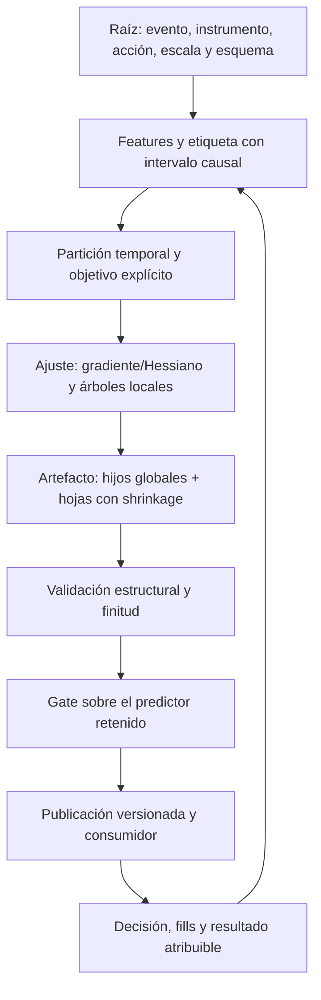

# Auditoría de fundamentos científicos XX — paridad matemática entre entrenamiento, artefacto e inferencia

Fecha local: 2026-09-24. Continuación aditiva de [XIX](<C:/Users/jhona/Documents/Proyectos/Trader Gemini/docs/AUDITORIA_FUNDAMENTOS_CIENTIFICOS_XIX_2026-09-24.md>). Estado: correcciones locales verificadas; modelos guardados y validación estadística pendientes. **No certificación integral ni despliegue.**

## 1. Dictamen ejecutivo y límites

Se encontraron mecanismos concretos por los que un modelo evaluado durante el entrenamiento no era el mismo predictor servido: los hijos de árboles posteriores apuntaban al primer bloque de nodos y las hojas exportadas perdían el factor de aprendizaje. Además, la regresión sumaba un paso con el signo opuesto al descenso de su pérdida.

Se corrigen esos tres mecanismos, se hace que el gate final mida el artefacto retenido y se rehabilita la validación estructural del predictor. Doce pruebas reproducían fallos antes de los arreglos; ahora pasan. También pasan siete refuerzos nuevos y doce regresiones anteriores: 31 pruebas funcionales distintas. Una inspección adicional, explícitamente separada, examina modelos guardados sin activarlos.

El resultado más urgente del inventario es que **8 de 20 bosques JSON son incompatibles con sus intervalos de nodos**. El nuevo cargador los rechaza. Los otros doce pasan la comprobación estructural, no una evaluación económica, de procedencia o calibración. Se encontró además un JSON neuronal de otro esquema, fuera de la comprobación de NanoForest.

No se arreglaron ni promovieron automáticamente esos modelos: el formato no conserva suficiente procedencia para reconstruir con seguridad la tasa de aprendizaje original y acreditar el conjunto de entrenamiento. Tampoco se verificó cuáles están cargados en un proceso vivo. No se operaron cuentas, no se ejecutó el motor ni se escribieron modelos operativos.

La paridad del predictor es necesaria para atribuir resultados al genoma, pero no basta: permanecen las deudas de labels/features de FMT-052/054/187, la conciliación de XIX y la validación temporal que se describe aquí.

## 2. Cobertura real y cambios

Nueva lectura completa: [train_forest.rs](<C:/Users/jhona/Documents/Proyectos/Trader Gemini/src/bin/train_forest.rs>), 802 líneas antes de intervenir. Ya había sido inspeccionado por fragmentos en II, no contado como completo. Se releen íntegramente ml_inference (537 líneas iniciales) y online_random_forest (263), ya cubiertos en II/III. Se trazan fragmentos de core, daemon y pruebas de backtest sin sumarlos como lecturas completas nuevas.

Cobertura acumulada conservadora: **131/289 Rust preexistentes; 158 pendientes**. Inventario histórico: 1.119 archivos versionados, 24 manifiestos Cargo. No se equipara revisar arrays de modelos JSON con auditar todos los activos del proyecto.

Cambios de producción: únicamente el entrenador y ml_inference. Se añade un archivo de pruebas de contrato y siete tests al binario de entrenamiento; se actualizan dos pruebas permisivas antiguas para exigir rechazo de evidencia inválida. Se aplica rustfmt a los archivos intervenidos, que estaban sin cambios propios previos a esta ronda; parte del diff del entrenador es formateo, no nueva lógica.

Checkout local main, HEAD 59a76de4. Los numerosos cambios de otras rondas/sesiones se preservan. No hubo commit, push, merge, fetch ni comprobación del remoto. Cinco fuentes consumidoras/de referencia y los 41 archivos JSON/bin del directorio de modelos se registran con SHA-256 para comprobar que permanecen intactos.

## 3. Grafo vivo del aprendizaje y sus fronteras



Se reparan las aristas D→E→F y parte de G. Las aristas A→B, B→C, G→H y el retorno I→B todavía no tienen certificación conjunta. La topología importa en dos sentidos distintos: el grafo de datos del sistema y el grafo literal de hijos de cada árbol. Un arreglo de uno no demuestra la corrección del otro.

Nodo raíz no significa una etiqueta global de activo; debe conservar la identidad del dato. Nodo de decisión no puede convertir ausencia en una probabilidad neutral válida. Nodo terminal de un árbol contiene una contribución al score, no necesariamente una probabilidad. El terminal operativo de una orden, a su vez, es evidencia de ejecución y no debe confundirse con una hoja estadística.

## 4. Matriz de resolución de esta ronda

La matriz histórica de 305 puntos y los informes I–XIX se conservan; esta tabla extiende sus registros.

| ID | Prioridad / ámbito | Estado XX | Resultado |
| --- | --- | --- | --- |
| FMT-037, actualizado | P1, cargador e inferencia | Reparación estructural; contrato semántico abierto | Arrays, offsets, hijos, ciclos y finitud; inferencia acotada y ausencia explícita |
| FMT-190, nuevo | P1, exportación/promoción | Paridad local reparada; activos existentes pendientes | Índices globales, shrinkage y evaluación del artefacto retenido |
| FMT-191, nuevo | P1, regresión | Signo corregido y comprobado | Residual y−f compatible con actualización aditiva |
| FMT-192, nuevo | P1, ajuste de árboles | Abierto | Estadísticas del padre completo mezcladas con hijo submuestreado |
| FMT-193, nuevo | P1, metodología temporal | Abierto | Sin purga de intervalos de etiqueta ni holdout independiente del selector |
| FMT-194, nuevo | P2, recursos del trainer | Abierto | max-samples no impone máximo; stride efectivo puede aumentar muestreo |
| FMT-052, revalidado | P1, dataset online | Abierto, sin cambios | Mezcla semántica de canales, features posteriores y falta de identidad |
| FMT-053, revalidado | P1, umbrales online | Abierto, sin cambios | Clases 0/1 no discriminan la rejilla de umbrales |
| FMT-054, revalidado | P1, significado/validación | Abierto, sin cambios | Beneficio interpretado como dirección; accuracy de ajuste habilita consumo |

## 5. FMT-190 — el predictor exportado no era el predictor evaluado

### 5.1 Referencias locales tratadas como índices globales

Cada llamada a build_tree construye un vector propio. Sus hijos 1 y 2 se refieren a nodos de ese vector. El exportador concatenaba todos los vectores y añadía tree_offsets, pero copiaba los hijos sin sumar el desplazamiento. El evaluador arranca en el offset y después usa cada hijo como índice absoluto.

Contraejemplo ejecutado: árbol A con hojas +1/−1, árbol B con hojas +4/−5 y la misma partición. Para la rama izquierda, el entrenamiento suma 1+4=5. El artefacto antiguo arranca en B, salta al índice 1 de A y suma 1+1=2. La prueba falló precisamente con observado 2 y esperado 5. No es una diferencia de calibración ni de mercado: es una transformación errónea del objeto matemático.

La [exportación corregida](<C:/Users/jhona/Documents/Proyectos/Trader Gemini/src/bin/train_forest.rs:66>) convierte child_global=offset_del_árbol+child_local; conserva −1 como hoja y rechaza referencias locales inválidas o overflow de índices. La validación del consumidor prohíbe que una arista salga del intervalo de su árbol.

### 5.2 La tasa de aprendizaje desaparecía al guardar

Durante fit, la actualización es F_nuevo(x)=F_anterior(x)+η·árbol(x). En el archivo no existe un campo η y la inferencia suma las hojas directamente. Copiar la hoja sin multiplicar por η produce otro modelo. Con bias 0,25, hoja 2 y η=0,1, el score correcto es 0,45; antes se exportaba 2,25 incluso con un único árbol, donde el error de offsets no interviene.

Ahora se guarda η·valor_hoja. El score inicial no se escala. Se valida la estructura y finitud del objeto antes de cualquier escritura de modelo. Las pruebas verifican ambas ramas, dos árboles, JSON y bincode, y tasas 0,05/0,1/0,5/1. La paridad numérica se comprueba con tolerancia explícita: la cuantización de hojas a f32 no desaparece y no se promete igualdad bit a bit con acumulación de entrenamiento en f64.

### 5.3 Early stopping y evidencia que decide la publicación

Se truncaban los árboles hasta best_rounds, pero f_val conservaba predicciones de la última iteración ejecutada, que podía ser peor y haber sido descartada. best_val correspondía a una iteración retenida mientras percentiles/varianza podían describir otra. Esto invalidaba la explicación del análisis incluso antes de considerar la exportación.

Ahora [serving_predictions](<C:/Users/jhona/Documents/Proyectos/Trader Gemini/src/bin/train_forest.rs:118>) usa NanoForest con el objeto congelado. Tras truncar, se reconstruyen f_val y la pérdida con ese predictor, antes de seleccionar candidato/promoción y antes de File::create. El gate y los diagnósticos describen el objeto que se escribiría. Sigue sin ser un holdout independiente: FMT-193 permanece abierto.

### 5.4 Alcance real y migración pendiente

La reparación afecta a futuros modelos generados con este código, no a los archivos ya existentes ni a un ejecutable que siga corriendo. Relocalizar índices antiguos tampoco recupera η ni corrige un entrenamiento de regresión de signo invertido.

Los ocho archivos incompatibles son:

| Archivo | Árboles | Nodos | Aristas fuera de su árbol |
| --- | ---: | ---: | ---: |
| ADAUSDT_MOTOR_CANDIDATE.json | 16 | 984 | 906 |
| ATOMUSDT_MOTOR_CANDIDATE.json | 16 | 978 | 900 |
| ATOMUSDT_MOTOR.json | 11 | 663 | 592 |
| BNBUSDT_MOTOR_CANDIDATE.json | 11 | 589 | 522 |
| BNBUSDT_MOTOR.json | 36 | 1764 | 1676 |
| NEARUSDT_MOTOR_CANDIDATE.json | 11 | 683 | 610 |
| NEARUSDT_MOTOR.json | 26 | 1532 | 1444 |
| NEARUSDT_VOL.json | 11 | 639 | 570 |

Son ocho archivos, no ocho despliegues observados ni ocho activos necesariamente operando. Cuatro llevan sufijo CANDIDATE. No se deserializaron caches operativas mediante load_model para hacer este inventario: se leyó JSON y se usó from_data, sin activación global ni escritura de binarios.

Cierre operativo: reconstruir procedencia y dataset, reentrenar con objetivos corregidos, validar el artefacto exacto, documentar selección y coordinar activación/rollback. El próximo arranque con el cargador estricto puede rechazar estos archivos. No se certifica que conservar un modelo anterior en la caché global, o quedarse sin modelo, sea la política correcta del host completo.

## 6. FMT-191 — la regresión seguía la dirección de aumento de la pérdida

La hoja es G/(H+λ) y el entrenamiento suma η·hoja. Por tanto G debe acumular el negativo del gradiente. Para L=½(f−y)², dL/df=f−y y −dL/df=y−f. La clasificación ya utilizaba y−sigmoid(f), pero la rama de regresión suministraba f−y.

Con f=0, y=2, H=1, λ=1 y η=0,1, la hoja antigua vale −1 y la actualización lleva f a −0,1. El error cuadrático pasa de 4 a 4,41. Con el signo corregido, la hoja vale +1, f=0,1 y el error baja a 3,61. Este contraejemplo se ejecutó contra build_tree; también se verifica por diferencia finita que el residual tiene el signo del negativo del gradiente en ambas direcciones.

La [función explícita regression_residual](<C:/Users/jhona/Documents/Proyectos/Trader Gemini/src/bin/train_forest.rs:57>) documenta el convenio. No se “corrige” el signo de la clasificación que ya era compatible con la suma. El arreglo no cambia targets, no inventa nuevos datos y no demuestra que los modelos VOL/OI/VOLU tengan ventaja.

La documentación primaria de XGBoost presenta la expansión por gradiente/Hessiano y la solución regularizada de la hoja. Aquí se usa la convención equivalente de residual negativo con suma positiva; la equivalencia requiere que ambos signos sean consistentes. [Derivación oficial de boosted trees](https://xgboost.readthedocs.io/en/stable/tutorials/model.html).

Persisten límites: pesos extremos, dominio de CLI, un único nivel de etiqueta y el estimador de ganancia FMT-192. Se arregla una identidad de cálculo, no se certifica la convergencia global del algoritmo ni la promoción del modelo.

## 7. FMT-037 — de protección de índices a contrato estructural

El defecto original de II sigue siendo el mismo ID. La validación previa solo comprobaba la mayor dimensión. No impedía un ciclo y los valores por defecto convertían arrays truncados, features faltantes o scores no finitos en contribuciones cero/probabilidad 0,5.

El nuevo [validador](<C:/Users/jhona/Documents/Proyectos/Trader Gemini/crates/god-engine-core/src/ml_inference.rs:72>) comprueba:

- Longitudes iguales de arrays paralelos; bias, thresholds y valores finitos.
- Offsets completos, no negativos y crecientes, con inicio cero y final igual al número de nodos.
- Dos hijos válidos por split o dos sentinels de hoja; cada hijo dentro del mismo árbol.
- Feature válida para cada split; hojas pueden conservar sentinels negativos.
- Ausencia de ciclos mediante DFS iterativa, incluidos nodos no alcanzables desde la raíz. Se permiten subárboles compartidos acíclicos; no se promete un árbol estrictamente sin nodos compartidos.
- Una única excepción explícita de compatibilidad: arrays vacíos con offsets [0,0] representan solo bias, usado por oráculos existentes. No se convierte cualquier estructura vacía en un modelo válido.

El recorrido de predicción queda acotado por el número de nodos del intervalo. No es un SLA de nanosegundos: limita pasos, no tiempo de pared ni tamaño de archivo. Se añade [predict_raw_checked](<C:/Users/jhona/Documents/Proyectos/Trader Gemini/crates/god-engine-core/src/ml_inference.rs:313>), compartido por clasificación/regresión. Features requeridas ausentes, inputs no finitos o score no representable en f32 devuelven None. La API legacy raw conserva la firma, pero devuelve (NaN,NaN) ante invalidez; ya no fabrica una predicción plausible.

La suma usa f64 antes de comprobar la proyección a f32. Esto reduce overflow intermedio, no elimina error de redondeo ni underflow de pesos diminutos. La segunda salida de un modelo de regresión es solo una transformación logística del score: no queda acreditada como probabilidad de un evento.

### Pruebas y riesgos residuales

Nueve fallos de contrato se reprodujeron antes; no se ejecutó ningún ciclo. Los refuerzos verifican modelo constante, varios árboles correctos, rechazo desde JSON/bin sin crear caché y un árbol válido de profundidad 4.096 sin recursión del validador. Se conservaron los tests de frescura de caché y los consumidores sintéticos del core.

La validación se realiza antes de la activación/escritura de caché, pero después de leer/deserializar: falta un presupuesto de bytes/nodos para archivos excesivos. Tampoco hay hash de esquema, objetivo, unidad, horizonte o procedencia de entrenamiento. Doce bosques aceptados pueden seguir siendo estadísticamente inválidos.

El host aún sanea features inválidas a cero en algunos caminos y su log de predict=None describe solo “modelo degenerado”. Esos consumidores no se modificaron: la API mejora la distinción local, no acredita la semántica global de datos ausentes. La publicación global sigue siendo clone+store y no se verificó su coordinación multiwriter en esta ronda.

## 8. FMT-192 — la ganancia de una partición mezcla poblaciones

En [build_tree](<C:/Users/jhona/Documents/Proyectos/Trader Gemini/src/bin/train_forest.rs:160>), G/H del padre se calculan sobre todo idx. Cuando hay más de 2.048 entradas, probe se construye mediante muestreo con reemplazo. G_L/H_L se suman solo sobre probe, pero G_R=G_padre−G_L y H_R=H_padre−H_L usan el padre completo. Los recuentos de min_child, entretanto, pertenecen a probe.

El lado derecho ya no representa las filas que fallaron el predicado: incluye implícitamente filas no muestreadas de ambos lados. Que algebraicamente H_L+H_R=H_padre no prueba que esas cantidades correspondan a las dos particiones reales.

Ejemplo analítico condicionado a una muestra equilibrada: nodo con 4.096 filas, mitad a cada lado, Hessiano 1. Si probe tiene 1.024 ocurrencias izquierdas y 1.024 derechas, la fórmula usa H_L=1.024 y H_R=3.072. Ni es la partición completa 2.048/2.048 ni la muestral 1.024/1.024. Con gradientes distintos por lado, la estimación de ganancia también cambia. No se afirma que ese reparto exacto ocurriera en una ejecución real; el ejemplo demuestra la mezcla de medidas que permite el código.

No se cambió el algoritmo de búsqueda en esta ronda. Opciones de rehabilitación: usar probe solo para proponer thresholds y acumular estadísticas sobre idx, o definir un estimador muestral coherente con sus pesos y regularización. La primera opción aumenta coste; la segunda exige justificar el estimador y su incertidumbre. Deben probarse ranking de splits, duplicación de filas, clases raras, tamaño de probe y estabilidad ante semilla, además de latencia de entrenamiento. Cambiar un literal no resuelve esta inconsistencia.

## 9. FMT-193 — orden cronológico no basta para validación causal

El [split 80/20](<C:/Users/jhona/Documents/Proyectos/Trader Gemini/src/bin/train_forest.rs:711>) corta arrays de features/labels ya construidos. No conserva ni purga los intervalos de información de cada etiqueta. Con horizonte 300.000 ms y stride 50.000 ms, la etiqueta de una muestra inmediatamente anterior al corte puede depender de precios posteriores a la primera feature de validación.

Ejemplo posible: entrada train en t=900.000 ms, primera validación en t=950.000 y etiqueta train que no se resuelve hasta t=1.200.000. El outcome de entrenamiento incorpora 250.000 ms posteriores al inicio de validación. Una barrera tocada pronto puede reducir el solapamiento; por eso no se afirma que todas las muestras filtren futuro. La ausencia del intervalo impide comprobar cuáles lo hacen.

Con --val-in se usa otro archivo, pero no se comprueba disjunción, cronología o identidad de eventos; incluso el mismo archivo puede indicarse en ambos argumentos. “Otro archivo” no equivale a otro experimento. Además, la misma validación elige best_rounds y después justifica la promoción. La pérdida seleccionada no es una estimación independiente de generalización.

Se conserva la mejora D-720 que evita promover cuando el gate falla. La nueva evaluación del artefacto de FMT-190 arregla qué predictor se mide, no cómo se seleccionó la evidencia. Cierre: registrar tiempos de disponibilidad de feature y resolución de label, purgar intervalos solapados, separar selección y evaluación final, comparar un baseline del mismo target y reportar dispersión/costes. La purga debe derivarse de intervalos, no de un embargo arbitrario en número de filas.

Esto importa especialmente para el paradigma continuo: cada escala puede inducir un intervalo distinto; no se debe asignar una única ventana fija a todo el universo y denominarla validación multiespectral.

## 10. FMT-194 — presupuesto de muestras declarado, pero no impuesto

El [stride efectivo](<C:/Users/jhona/Documents/Proyectos/Trader Gemini/src/bin/train_forest.rs:433>) selecciona el stride solicitado cuando stride×max_samples es menor que el span. Precisamente en ese caso span/stride excede el supuesto máximo. En la otra rama usa span/max_samples con un suelo de 1.000 ms, aunque pueda ser menor que el stride solicitado. No existe un contador que detenga las inserciones al alcanzar max_samples.

Ejemplo aritmético: span=10.000.000 ms, max_samples=100, stride=1.000 ms. La primera condición es verdadera y conserva 1.000 ms: puede intentar alrededor de 10.000 entradas, sujeto a warmup, horizonte y descarte de labels, no un máximo de 100. Con stride cero, la condición usa max(1) pero devuelve el cero original, permitiendo evaluar cada tick elegible. No se ejecutó un entrenamiento masivo para demostrar agotamiento de memoria.

El defecto afecta recursos y también diseño experimental: la densidad real de muestras cambia la dependencia, los solapamientos y el peso de episodios intensos. Hay más copias de features por ronda y coste proporcional a un presupuesto que no se cumple. Es P2 del trainer, no una latencia p99 medida en el hot path.

Cierre: contrato de CLI validado, distinción explícita entre máximo de intentos y máximo de labels válidos, límite verificable y muestreo que conserve procedencia. Para una rejilla temporal regular puede derivarse un paso a partir de span/capacidad, pero eventos irregulares y descarte requieren una política adicional. No se sustituye aquí por un cap oculto o un truncamiento que cambie silenciosamente el experimento.

## 11. Aprendizaje online: revalidación, sin duplicar hallazgos

La lectura completa de online_random_forest confirma que FMT-052/053/054 no están solucionados. El daemon sigue mezclando features mmap con constantes y distancia a 0,5, y features del momento de muestrear PnL con velocidad/aceleración y distintas consultas globales/por activo. Falta acción ejecutada y procedencia suficiente para interpretar el target.

La rejilla usa y_class_pred convertido a f64 como probabilidad: 0/1 selecciona la misma población para todos los thresholds entre 0,50 y 0,75. La aparente búsqueda no aporta resolución continua. Cambiar el nombre de sus salidas no lo arregla.

La expresión 0,6·sigmoid(50·PnL_estimado)+0,4·clase mezcla magnitudes sin un modelo de calibración. Una esperanza de retorno no identifica una probabilidad de ganar: por ejemplo, retorno seguro +0,01 y una distribución equiprobable −0,99/+1,01 tienen media +0,01, pero probabilidades de beneficio 1 y 0,5. La equivalencia se refuta algebraicamente; no son estrategias propuestas.

Además, accuracy se calcula sobre la matriz usada para fit y alimenta el campo que habilita modulación de confianza. Se conserva la distinción entre precisión de ajuste y prequential/OOS. No se eliminó de forma aislada el consumidor ni se reemplazó por otra sigmoid: el objetivo, el lado y el dataset deben corregirse como un contrato conjunto. Véase [ronda III](<C:/Users/jhona/Documents/Proyectos/Trader Gemini/docs/AUDITORIA_FUNDAMENTOS_CIENTIFICOS_III_2026-09-24.md:107>) y la deuda generacional de [XIX](<C:/Users/jhona/Documents/Proyectos/Trader Gemini/docs/AUDITORIA_FUNDAMENTOS_CIENTIFICOS_XIX_2026-09-24.md:155>).

## 12. T43 — invariancia del artefacto y ciencia transferible

T43 añade una obligación previa a experimentar con nuevas familias: para toda entrada admisible x, el predictor entrenado retenido y el predictor servido deben aproximar la misma función dentro de un presupuesto numérico declarado. La serialización es una transformación de representación, no una nueva hipótesis estadística.

Para un ensamble aditivo:

```text
F(x) = b + Σ η·T_k(x)
wire_leaf(k,j) = round_f32(η·leaf(k,j))
wire_child(k,j) = offset_k + local_child(k,j)
split_gain exige G/H calculados sobre particiones de la misma medida
regresión con suma positiva exige residual = y − f
```

Estas ecuaciones indican para qué sirve cada cálculo: η controla el tamaño de la actualización; la relocalización conserva la función del grafo; G/H aproximan el cambio de pérdida; el score crudo pertenece a las unidades del target. Una sigmoid solo es una probabilidad modelada cuando existe un objetivo probabilístico compatible y validación, no por devolver un número entre cero y uno.

Esta ronda no introduce algoritmos cuánticos ni ecuaciones de problemas del milenio. Un nombre avanzado no compensa que el artefacto cambie la función aprendida. Las propuestas multiescala anteriores se conservan, pero cualquier integración futura debe declarar estado observable, estimando por escala/activo, regularización, causalidad, invariancias, incertidumbre y coste.

Un continuo multivariante puede aproximarse con una base finita adaptativa; necesita error de aproximación y presupuesto, no etiquetas scalp/swing ni un número infinito de cálculos. Aquí siguen existiendo un horizonte fijo y barreras fijas en el trainer, sin feature explícita de escala/acción en su manifiesto. No se afirma haberlo convertido en un estimador universal temporal ni haber eliminado todas las particiones arbitrarias del sistema.

## 13. Módulos y hoja de ruta

| Módulo del sistema | Aporte XX | Siguiente obligación |
| --- | --- | --- |
| 1. Ingestión y normalización | Identificados intervalos y esquema como parte del label | Disponibilidad por fuente, calidad de ticks y procedencia |
| 2. IA y señales | Predictor estructuralmente validado, exportación coherente | Esquema versionado, calibración y objetivo por acción |
| 3. Multiactivo y tiempo | Modelo por instrumento no basta para continuidad | Target/escala identificables, covariación y error de aproximación |
| 4. Ejecución | No se modificó ejecución ni se enviaron órdenes | Conservar fills/resultado atribuible al modelo activo |
| 5. Riesgo y genoma | Atribución exige que sirva el modelo evaluado | Promoción con incertidumbre y contención de XIX |
| 6. Estado y latencia | Recorrido acotado; carga fuera del hot path | Presupuestos de bytes/nodos y coordinación multiwriter |
| 7. Confluencia y cuántica | Separación entre score, probabilidad y analogía | Pruebas de valor incremental, no complejidad nominal |
| 8. Backtest y gobernanza | Pruebas de paridad y gate sobre artefacto | Purga temporal, holdout final y reentrenamiento trazable |

Orden de rehabilitación propuesto:

1. Inventariar procedencia y decidir la sustitución de los ocho bosques inválidos sin perder control de riesgo; no desplegarlos por el solo hecho de haber corregido el código.
2. Cerrar mezcla de estadísticas de splits y validación temporal antes de reentrenar para promoción.
3. Unificar receipts de entrada/cierre, features, acción, escala y generación para FMT-052/054/187.
4. Evaluar baselines multiactivo/multiescala con presupuesto de capacidad y de selección explícitos; preservar incertidumbre y cobertura de datos.
5. Comparar predictor retenido, archivo, caché e inferencia real en un replay aislado; medir latencia y métricas económicas con costes antes de activar.
6. Completar los 158 archivos Rust pendientes y las rutas no Rust sin presentar esta ronda como revisión exhaustiva.

## 14. Pruebas, investigación y reproducibilidad

Comandos ejecutados:

```text
cargo test -p god-engine-core --test ml_model_contract --offline -- --test-threads=1
cargo test -p god-engine-core --lib ml_ --offline -- --test-threads=1
cargo test --bin train_forest --offline contract_tests -- --test-threads=1
cargo test -p god-engine-core --test ml_model_contract --offline inspect_saved_models -- --ignored --nocapture --test-threads=1
cargo check --bin god_engine --bin train_forest --offline
```

Doce tests de contratos nuevos del predictor + siete tests nuevos del trainer + doce regresiones previas = 31 funcionales. Entre los nuevos hay doce rojo→verde y siete refuerzos. El inventario es un diagnóstico manual adicional; no se suma como una demostración de corrección del conjunto de modelos.

Para aislar el baseline del trainer se extrajeron las expresiones antiguas a funciones sin cambiar su comportamiento antes de obtener los tres fallos. La primera inspección de modelos asumía que todos los JSON tenían el mismo esquema y se interrumpió al encontrar DarkAlpha; se corrigió el harness para clasificarlo aparte y se repitió. No se contó ese error del harness como un bug nuevo del sistema.

El primer comando combinado con filtro ml_ ejecutó las doce unitarias, pero filtró los tests de integración; se ejecutó después el binario de integración sin ese filtro. No se cuenta “compiló” como “ejecutó las pruebas”.

Check pasa con tres warnings previos de evolution-engine y dos del trainer (pos_rate sin uso e idx innecesariamente mutable). No se lanza el entrenamiento real ni se promueve un modelo para probar el parche. Los tests de caché crean archivos sintéticos temporales; el test nuevo los elimina al terminar.

La skill Firecrawl se usó para contrastar la convención de gradiente/Hessiano con documentación primaria. El CLI no estaba disponible y se utilizó el conector; no se instaló software ni se enviaron fuentes privadas. Se inspeccionó la derivación y se remitió feedback satisfactorio. Las reproducciones numéricas y las conclusiones sobre este repositorio proceden del código y los tests locales, no de la autoridad de la página.

El [artefacto XX](<C:/Users/jhona/Documents/Proyectos/Trader Gemini/docs/artifacts/auditoria_fundamentos_XX_2026-09-24.json>) contiene IDs, límites, cobertura, inventario, pruebas y hashes. Se agregan adendas al atlas, informe maestro y XIX sin reemplazar sus textos históricos.

## 15. Control final de integridad

El JSON se deserializa y los grupos funcionales suman 31. Coinciden los ocho hashes registrados de fuentes/tests y los cinco hashes iniciales de fuentes protegidas. Los 41 archivos JSON/bin de modelos conservan sus hashes iniciales: el inventario no los alteró.

Los prefijos históricos completos del atlas, maestro y XIX conservan su SHA-256 tras normalizar CRLF a LF. Se añadieron respectivamente 2.845, 6.318 y 1.183 caracteres normalizados. No se garantiza identidad binaria de finales de línea; sí conservación del contenido textual anterior bajo esa normalización.

Se comprobaron los 13 enlaces locales del informe y sus anclas de línea; todos resuelven. Rustfmt de los tres archivos Rust intervenidos y git diff --check de las dos fuentes pasan. Se repitieron las 19 pruebas nuevas tras el último ajuste del harness y de comentarios; siguen pasando, sin contarlas dos veces. El diagnóstico local de inventario se ejecutó explícitamente pese a estar ignorado por defecto en CI.

Main/59a76de4 e inventario 1.119/289/24 se verificaron de nuevo. Estos controles no certifican el remoto, la totalidad del repositorio o un proceso en marcha. Antes de cualquier despliegue deben resolverse la migración de modelos y la política de predictor no disponible; las tareas de conciliación, aprendizaje generacional y validación temporal permanecen abiertas.


## Adenda de continuidad — ronda XXI (2026-09-24)

El [informe XXI](<C:/Users/jhona/Documents/Proyectos/Trader Gemini/docs/AUDITORIA_FUNDAMENTOS_CIENTIFICOS_XXI_2026-09-24.md>) y su [artefacto](<C:/Users/jhona/Documents/Proyectos/Trader Gemini/docs/artifacts/auditoria_fundamentos_XXI_2026-09-24.json>) continúan los pendientes sin cambiar el diagnóstico histórico de XX. FMT-192 y FMT-194 se reparan localmente con estadísticas completas del nodo y presupuesto de intentos vinculante. FMT-193 queda parcial tras añadir intervalos, purga y --test-in posterior obligatorio para --promote; sigue pendiente gobierno de experimentos y evaluación económica.

Se añaden FMT-195–199: inconsistencias de la ruta CSV, sesgos del POC OHLC, parser neuronal sin contrato estricto, publicación neuronal sin test y targets dependientes de cadencia de eventos. FMT-028 permanece abierto. No se repararon ni activaron los modelos inventariados en XX.

37 pruebas funcionales distintas pasan en XXI: 18 nuevas y 19 anteriores; cuatro nuevas reproducían las fórmulas anteriores. Tres lecturas completas nuevas elevan cobertura a 134/289 Rust, 155 pendientes. Solo se modifica train_forest como fuente. Se preservan siete fuentes y 41 modelos; no hay publicación Git ni actividad operacional. Los detalles, ecuaciones, límites y condiciones de cierre están en XXI.
