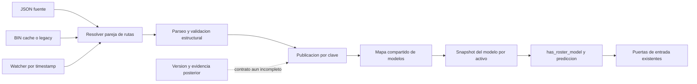

# MP — Publicación multiactivo, identidad y coherencia del grafo de modelos

## 1. Dictamen y límites del corte

Fecha: 2026-09-30. Base: `ee438edb03333b67e2e41d8ba31229e8350a505e`.
Rama: `codex/model-publication-contract`, checkout Codex aislado. MR permanece
en su rama y [PR23](https://github.com/Jhona-la/Trader-Gemini/pull/23), todavía
pendiente de CI/revisión al inicio de esta pasada. No se mezcla su publicación
con la de MP ni se atribuyen sus cinco tests nuevos al conteo de esta rama.

**Dos reparaciones candidatas locales, cinco expedientes abiertos.** Los
expedientes no son siete bugs reparados ni siete descubrimientos independientes:
MP-07 remite expresamente a MR-03. Los cinco fallos de tests corresponden a dos
familias causales. No se certifica todo el proyecto, el motor vivo ni su retorno.

El corte base contiene 1.377 archivos versionados y 434 Rust. Es inventario,
no cobertura semántica. Se inspeccionó la ruta de carga/publicación/consumo y
sus contratos, no cada uno de esos archivos. No se ejecutó el motor, training,
promoción, evaluación T-1 ni tests de exchange; sólo modelos sintéticos temporales.

La teoría pertinente aquí es la composición de actualizaciones, coherencia de
snapshots y procedencia del artefacto. Añadir una ecuación de física o un nombre
cuántico no prueba ninguna de esas propiedades. La utilidad de una futura
teoría debe expresarse como hipótesis, unidades, observable, contrato y contraste
fuera de muestra, no como complejidad nominal o promesa de +100 % cada 72 h.

## 2. Grafo causal: desde el archivo hasta el veto



No se ha cambiado la política del veto de roster. Se repara una causa técnica
por la que un modelo que acababa de publicarse podía desaparecer del mapa.
Sin modelo, el consumidor cambia a su lógica de ausencia/arranque frío; no se
debe atribuir automáticamente ese resultado al genoma, a la señal o al régimen.
El posible efecto sobre decisiones es una ruta de código comprobada, no una
cuantificación de pérdidas o de frecuencia de la carrera en producción.

## 3. Matriz de expedientes

| ID | Prioridad | Estado en este corte | Contrato afectado |
|---|---|---|---|
| MP-01 | P1 | candidato reparado; RED reproducido | dos escritores pueden perder el activo del otro |
| MP-02 | P1 | candidato reparado; RED reproducido | pareja de rutas y preservación de la fuente |
| MP-03 | P1 | abierto, análisis estático | orden de publicación no es orden de generación |
| MP-04 | P1 | abierto, análisis estático | múltiples cabezas no forman una versión transaccional |
| MP-05 | P2 | abierto, análisis estático | escritores directos pueden saltarse el contrato |
| MP-06 | P2 | abierto, traza lógica de fuente | timestamps JSON/BIN causan recargas repetidas |
| MP-07 | P1 | abierto, referencia a MR-03 | mtime y estructura no vinculan JSON al predictor servido |

## 4. MP-01 — Pérdida de publicaciones entre activos

**Evidencia.** En la base, `NanoForest::load_global` y `store_global` leen
`GLOBAL_FORESTS`, clonan el mapa, insertan una clave y hacen `store` del mapa
completo. El reemplazo del puntero es atómico; la secuencia leer-modificar-
escribir no lo es. Es un fallo de actualización lógica, no una violación de
seguridad de memoria. Afecta a las dos APIs, con independencia del símbolo.

**Intercalado mínimo.** Sean M el mapa original y A/B activos distintos.
El escritor A calcula M_A = M[A := modelo_A]. Antes de publicarlo, B calcula
M_B = M[B := modelo_B] a partir de la misma versión. Si se publica M_A y
después M_B, el resultado no contiene la actualización A. Cada lector ve un
mapa completo y válido; eso no evita perder trabajo de otro escritor.

**Invariante requerido.** Para claves distintas, las actualizaciones deben
componer: U_A(U_B(M)) = U_B(U_A(M)). El resultado debe contener ambas, además
de las entradas anteriores que ninguna operación pidió retirar. Ésta es una
condición de concurrencia multiactivo, no una condición financiera.

**Reproducción ejecutada.** `mp_concurrent_store_preserves_every_distinct_asset`
lanza 32 escritores sincronizados por barrera durante ocho rondas, con una
clave única por escritor/ronda. En la ejecución RED se perdieron 183 de 256
publicaciones. `mp_concurrent_load_preserves_every_distinct_asset` prepara 24
pares JSON/BIN independientes fuera de la contención: se perdieron cuatro
altas pese a que las 24 llamadas retornaron éxito. Los números dependen del
planificador; no son tasas esperadas ni un benchmark. Las aserciones requieren
cero claves ausentes y el valor exacto de cada modelo.

**Reparación.** Se centraliza `load_global` en `store_global`; éste utiliza
`ArcSwap::rcu`. Si otra publicación cambió el mapa entre lectura e intercambio,
el cálculo se repite sobre la versión actual. El parseo, la validación y la
construcción del `Arc<NanoForest>` quedan fuera del cierre reintentable. El
cierre sólo clona el mapa y la clave e inserta una referencia al modelo ya
validado; no repite E/S, entrenamiento, telemetría ni efectos externos.

**Fundamento verificado.** Se leyó la implementación local de la versión 1.9.2
fijada en `Cargo.lock` y su [contrato oficial de RCU](https://docs.rs/arc-swap/1.9.2/arc_swap/struct.ArcSwapAny.html#method.rcu).
La documentación advierte del intercalado load/store y de reejecutar el cierre.
Firecrawl se usó para contrastar esa fuente primaria, no para atribuir una
garantía financiera ni una latencia no medida al cambio.

**Preservación.** El lector que conserva un `Arc` anterior sigue viendo el
modelo anterior; lectores posteriores pueden ver el nuevo. Una carga inválida
no reemplaza el último válido ni crea su caché. Esos dos contratos ya pasaban
en la base y se conservan: no se cuentan como nuevos arreglos.

**Límite.** La garantía cubre escritores que usan estas APIs. No da exclusión
mutua sobre el archivo, orden de generación para la misma clave, promoción
estadística ni snapshot conjunto de todas las cabezas del activo.

## 5. MP-02 — Rutas de caché que alteran padres o destruyen la fuente

**Causa.** `str::replace` sustituía TODAS las apariciones de `.json`/`.bin` en
la ruta, no sólo la extensión final. En `archive.json/asset.json.v2.json`
se transformaban directorio y stem. En la dirección inversa, la ruta de un
BIN bajo `archive.bin` podía buscar un JSON en otro directorio, concluir que
no había fuente más reciente y aceptar el caché obsoleto.

**Reproducciones.** El test de directorio `.json` no encontraba la caché
hermana que debía crearse. El test de directorio `.bin` preparó explícitamente
mtime(BIN)=epoch+10.000 s y mtime(JSON)=epoch+20.000 s, sin sleeps: el loader
devolvió bias +2 del BIN cuando la fuente hermana nueva tenía bias -2.
Estos valores son fixtures de identidad, no probabilidades calibradas.

**Destrucción adicional.** Para una fuente llamada `model`, el reemplazo de
`.json` era un no-op: fuente y destino de caché eran el MISMO archivo.
La carga retornaba éxito pero convertía el JSON original en bytes bincode.
El contrato RED comparó bytes antes/después y demostró esa sobrescritura.
El experimento sólo afectó a un directorio temporal propio, eliminado por
RAII incluso al fallar la aserción; no se modificaron modelos del proyecto.

**Reparación.** Para extensiones reconocidas se utiliza `Path::with_extension`,
que conserva padres y stem. Los nombres no convencionales continúan admitidos
como fuentes JSON, con la misma validación, pero sin caché implícita. No se
inventa un destino que pueda colisionar con la fuente. Se mantiene el soporte
legacy de BIN sin JSON y el fallback de BIN corrupto a JSON válido.

**Pruebas adicionales.** Nombres `.weights`, `.JSON` y un directorio `.json`
con archivo `.payload` permanecen byte a byte intactos. Un BIN con parámetro
infinito sigue rechazándose. Ninguno de estos casos autoriza usar un modelo
sin evidencia de entrenamiento/promoción.

**Límite.** Los hardlinks/symlinks pueden hacer que rutas textualmente distintas
apunten al mismo archivo; no se implementó una política antialias de filesystem.
Tampoco se convirtió la escritura de caché en transacción ni se reemplazó el
criterio mtime por identidad criptográfica. No afirmar que MP-02 cierra MR-03.

## 6. MP-03 — Un escritor atrasado puede volver a publicar una versión vieja

**Estado:** abierto; diseño/API observado, no incidente productivo atribuido.
`NanoForestData` no contiene generación, identidad del dataset, símbolo,
aprobación ni predecesor esperado. `store_global(key, forest)` acepta cualquier
bosque estructuralmente válido y no compara una generación monotónica.

Un escritor puede terminar de preparar V1, quedar suspendido, mientras otro
publica V2, y luego publicar V1. RCU preserva los demás activos, pero para esa
clave prevalece el último intercambio, no el modelo más reciente o aprobado.
Un SHA distinto tampoco determina cuál versión debe dominar.

**Cierre requerido.** Contrato de promoción con versión/linaje por clave,
compare-and-publish contra generación esperada y política explícita de rollback.
La decisión no debe inferirse de mtime, orden lexicográfico del hash o calidad
medida sobre otra muestra. Probar llegada invertida y rollback autorizado.
No se añadieron versiones ficticias ni se alteró la promoción ajena.

## 7. MP-04 — Snapshot individual no equivale a ensamble coherente

**Evidencia.** `GodEngineCore::process_event` obtiene `_MOTOR`, `_VOL` y `_OI`
con llamadas independientes a `get_global`. La predicción direccional y su
base sí proceden del mismo `active_forest`: no se inventa una mezcla allí.
Sin embargo, otras cabezas pueden capturarse después de otra publicación.
Además, el productor carga cada archivo por separado, no una generación de
ensamble. Capturar un solo mapa evita una mezcla entre lecturas, pero no evita
que el propio mapa contenga una transición parcial entre varias cabezas.

**Impacto posible.** Una decisión combina outputs de distinta procedencia sin
receipt que indique la combinación. No es intrínsecamente inválido si el diseño
permite cabezas asincrónicas; falta declarar y verificar esa compatibilidad.

**Cierre requerido.** Elegir entre versiones independientes compatibles o bundle
transaccional. Para lo segundo: validar bundle completo, publicarlo una vez,
capturar un snapshot por decisión y registrar IDs. Para lo primero: publicar
evidencia, edades y esquemas por cabeza. No desactivar predictores por ausencia
de una sincronía universal arbitraria ni afirmar sincronía perfecta por usar Arc.

## 8. MP-05 — La API pública permite saltarse la publicación segura

`GLOBAL_FORESTS` sigue siendo `pub static ref`. En el árbol leído hay escrituras
directas en helpers de tests de `ml_inference.rs` y `god-engine-core/src/lib.rs`.
No se encontró otro escritor productivo directo en la búsqueda `crates/ src/`;
esa búsqueda no demuestra ausencia en consumidores externos al workspace.

Una escritura incondicional ajena a RCU aún puede reemplazar un mapa antiguo.
La encapsulación privada del registro y una API explícita de fixtures reducirían
esta posibilidad, pero son un cambio de API que no se impone en esta reparación.
No se eliminan modelos globales desde los nuevos tests: usan namespaces propios
en su ejecutable aislado y no interfieren con activos reales.

**Cierre requerido.** Auditar consumidores, retirar acceso mutable directo de
forma compatible y probar la frontera pública. Las pruebas secuenciales no
acreditan aislamiento de toda la suite con múltiples escritores de fixtures.

## 9. MP-06 — Oscilación de fechas del watcher sin cambios de archivos

**Evidencia estática.** En `src/bin/god_engine.rs`, la carga inicial prefiere
JSON y usa BIN sólo si no existe JSON; el loop posterior recorre AMBOS. La
tabla `forest_timestamps` está indexada por file stem, no por ruta ni contenido.
Con `t_json != t_bin`, una pasada actualiza ese mismo slot a `t_json`, después
a `t_bin`. En la próxima pasada ambas comparaciones vuelven a diferir.

**Traza lógica:** estado inicial t_bin → visita JSON → t_json → visita BIN →
t_bin → siguiente ciclo repite. Es válida con orden estable de enumeración,
sin modificar los archivos. No se ejecutó el host para medir su frecuencia.

**Impacto.** Relecturas, deserialización, validación y clonación de mapas pueden
repetirse en cada ciclo del watcher (sleep de 10 s en el código leído). Además
de E/S/CPU innecesaria, genera mensajes de hot-swap sin nueva evidencia. Es
distinto del timestamp consumido antes de carga exitosa (MR-04); ambos surgen
de un estado de observación insuficientemente definido.

**Cierre requerido.** Un artefacto canónico por clave, estado de observación y
estado activado separados, actualizar el segundo tras éxito, reintentos medidos
y fixtures de dos pasadas sin cambios. Reservar coordinación con el dueño del
host antes de tocar su watcher. No imponer un nuevo cooldown literal para
ocultar el ciclo ni bajar frecuencia de auditoría como supuesto arreglo.

## 10. MP-07 — Identidad de caché sigue abierta (referencia MR-03)

El cambio de rutas conserva la política existente: BIN válido y suficientemente
reciente puede ganar sobre JSON. Es la discrepancia ya reproducida por MR-03,
no otro hallazgo nuevo. Igualdad temporal o caché futuro/copias restauradas no
vinculan el predictor al hash JSON del registro. Tampoco un hash autentica al
productor, acredita skill fuera de muestra o autoriza activar el artefacto.

El soporte de BIN standalone se preserva expresamente para no inventar una
política de migración. Cierre futuro: linaje de bytes fuente y payload, formato
versionado, validación de binding y receipt del predictor servido, manteniendo
una ruta de migración explícita. Un manifiesto diagnóstico no es ese receipt.

## 11. Coste, latencia y sentido de los límites

La ruta de predicción no recibe E/S ni un mutex nuevo. En escritura se conserva
la copia O(K) del mapa de K claves por intento, ahora repetible si hay contención;
los árboles se comparten por Arc, no se clonan por cada reintento. El tiempo
depende de contención, tamaño de claves, asignador y snapshots retenidos. No se
deduce una cota temporal dura ni nanosegundos por tick de esta estructura.

Debe medirse p50/p95/p99 de publicación separada de inferencia, volumen de
reintentos, memoria retenida y tasa de cambios reales. Los 32/24 escritores y
ocho rondas son parámetros de estrés de tests, NO límites del motor ni regímenes
de mercado. No se añadió cap de activos, timeout, umbral de rentabilidad ni veto.

## 12. Evidencia de verificación

Toolchain `nightly-2026-06-30`; `arc-swap` 1.9.2, lockfile sin modificar.
Ejecución Windows, perfil local unoptimized + debuginfo; CI usa debug=0.

| Ejecución | Resultado | Interpretación |
|---|---|---|
| Base, primeros ocho contratos | 3 pasan / 5 fallan, 0,56 s | RED real; build39,09 s |
| Candidato, diez contratos | 10 / 0 / 0, 0,29 s | GREEN; build34,84 s |
| Dos tests concurrentes ×20 | 40 ejecuciones aprobadas | sólo dos tests únicos, no sumar40 al total |
| Núcleo + cinco suites seleccionadas | 198 / 0 / 1 | build38,36 s; desglose abajo |
| Workspace all-targets/locked | éxito31,16 s | compilación, no ejecución de todos los tests |

Desglose disjunto: core lib146, conformal11, base1, ML12+1 ignorada,
MP10, atribución18 =198 aprobadas/0 fallidas/1 ignorada. La ignorada es
inventario manual de modelos guardados; no se habilitó. Las repeticiones
concurrentes y el primer GREEN no se suman de nuevo. La regresión de replay
se registra por separado al finalizar, sin inferir éxito por lanzar el comando.

Hash SHA256 de las fuentes probadas:

- `ml_inference.rs`: `72947A7685476162894366012DE24E6ACBF5F50E06B1EF8CBFA0861D907487D9`.
- `model_publication_contract.rs`: `42436619DB54F4683ABC20D961104AD0AA3A83BBB8723E42C6EA0F9B24CC6582`.

## 13. Integración, coordinación y orden de trabajo

MR/PR23 no se modifica por esta ola. PR10/20 siguen fuera de main remoto en
el corte observado; el merge local77d6632a de GLM no prueba push/integración
remota. No se borran esas ramas, MP, MR ni backups con commits exclusivos.
CX/PR22 sí está fusionada; su rama ya fue retirada con ancestralidad comprobada.

Aviso de reserva compartido en `.firecrawl/coordination-codex-causalidad-2026-09-29.md`.
No es acuse de recibo de Claude/GLM. Se solicita autorización específica para
publicar el nuevo payload MP en el repositorio público; no reutilizar como
si fuera ilimitada la autorización previa de MR. Merge condicionado a CI y
revisión cruzada del SHA final. Ninguna intervención en procesos de GLM.

Prioridad: validar/publicar estos dos contratos, cerrar promoción y linaje con
sus dueños, hacer explícitas las versiones de decisión y sólo entonces atribuir
resultados a teoría/genoma. Cualquier mejora de retorno necesita medición causal
fuera de muestra con costes; los tests presentes no contienen tal evidencia.

## 14. Cierre local verificado — código3f2be42d

La regresión complementaria finalizó con código0: biblioteca replay51,
paridad8 aprobadas+2 ignoradas, métricas21, labels25 y riesgo espectral3.
Total replay108/0/2; build2m03s, biblioteca77,35s y paridad35,79s.
Sumado de forma disjunta al núcleo/suites198/0/1: **306 aprobadas,0 fallidas,
3 ignoradas**. Dos ignoradas de paridad son experimentos manuales existentes;
la restante es inventario de modelos. No se habilitó ninguna ni se modificó
golden, fixture anterior o umbral para lograr aprobación.

Commit de código/pruebas/CI: `3f2be42d3e9effe102662cabb779405f70577fa9`.
Las adendas posteriores son sólo documentación. Se verificó conservación en
orden de1711 líneas de coordinación,8726 del maestro y1918 del atlas. Las
notas previas «replay en curso» son el corte inicial, no el estado final.

MR CI36718230501: check all-targets y contratos registry aprobados; replay
en curso al último seguimiento, no CI global aprobada todavía. Se publicó
[solicitud de revisión cruzada MR](https://github.com/Jhona-la/Trader-Gemini/pull/23#issuecomment-5912446341),
sin inferir respuesta. MP permanece local a la espera de autorización pública
específica; no se publica código o informe MP mediante ese comentario MR.

### Actualización posterior: CI MR terminada

Run36718230501 terminó **SUCCESS** a2026-09-30T13:40:06Z sobre
e17c88b4947cb6a01d4d8f55bef2a5f133b6b8ba. PR23 sigue OPEN y sin reviews;
no se fusiona sin revisión cruzada. Main remoto continúa ee438edb. No hay
otras ramas locales no principales acreditadas como integradas para borrar.
MP conserva código3f2be42d e informe083f4321; no push ni PR propios MP.
La CI MR no acredita esta rama MP ni sus cambios de loader/publicación.

## 15. Publicación autorizada e integración con mainfbf8e9ea

El operador respondió «Hazlo» a la pregunta explícita de publicar MP y GO
en el repositorio PÚBLICO Jhona-la/Trader-Gemini, mediante dos PR separadas
con CI y revisión cruzada antes del merge. La autorización previa pendiente
queda satisfecha; los avisos anteriores se conservan como historial.
No autoriza operar, entrenar, promover modelos ni retirar controles de riesgo.

MR/PR23 ya está MERGED por GLM en589a591d; mainfbf8e9ea añade la aclaración
de legible. Las CI36725338162 y36727198985 seguían en curso al verificar.
No se deduce un gate verde retroactivo de la integración observada.
GO se publicó separada en PR24, head3ba8c2d6; NO está incluida en MP.

MP40f8685b se reconcilia con mainfbf8e9ea. Cinco conflictos documentales/CI:
memoria, workflow, atlas, coordinación y maestro. Se conservan ambos lados
y todas las pruebas. Verificación como subsecuencia ordenada, HEAD/MERGE_HEAD:
memoria976/1010, workflow50/50, atlas1939/1934, coordinación1734/1795,
maestro8750/8750. Se comparó el resultado contra cada padre, no sólo ausencia
de marcas. No hay delta MP en genoma, trainer, host, modelos reales o riesgo.

Las dos fuentes MP conservan exactamente los SHA256 del§12. Cambia la
composición con registro MR y sus tests, no el arreglo MP. Check workspace/
all-targets/locked aprobado26,60s; regresiones integradas lanzadas y aún no
certificadas en este corte. Se documentará su resultado real antes de publicar.

### Resultado integrado confirmado antes de publicación

Regresión completa seleccionada terminada: núcleo/suites203/0/1 y
replay108/0/2 = **311 aprobadas,0 fallidas,3 ignoradas**. Son conjuntos
disjuntos; no sumar de nuevo los10 MP ni los9 registry incluidos.
Núcleo lib151, conformal11, base1, ML12+1 ignorada, MP10 y atribución18.
Replay lib51, paridad8+2 ignoradas, métricas21, labels25, riesgo3.
Las tres ignoradas siguen siendo experimentos manuales existentes.

Build núcleo48,03s; build replay68s; biblioteca replay76,27s y paridad36,16s.
Check26,60s aprobado antes del commit de integración. Hashes fuente MP
idénticos al candidato3f2be42d: el nuevo total incluye cinco tests de MR
adicionales respecto al corte anterior306/0/3, no cinco reparaciones MP.
No se ejecutaron T-1 completo, entrenamiento, promoción ni operaciones.
Publicación autorizada; CI remota MP y revisión cruzada se comprobarán
después de crear la PR, sin tomar estos tests locales como aprobación externa.

## 16. Adenda MP-08 — rechazo recuperable de caché que bloqueaba una fuente válida

Esta adenda conserva los cortes anteriores, sus cifras y sus autorizaciones.
El inventario MP pasa a **ocho expedientes: tres reparaciones candidatas y cinco
abiertos**, incluyendo la referencia existente MP-07/MR-03. No son ocho cierres.
Las afirmaciones de dos candidatos, diez tests y311 resultados del corte previo
siguen describiendo ese candidato histórico; no certifican por anticipado éste.

### 16.1. Clasificación, alcance y causa raíz

**ID MP-08; prioridad P2; defecto lógico de selección y recuperación del
artefacto.** Fuente: `crates/god-engine-core/src/ml_inference.rs`,
`NanoForest::load_model`, rama de caché en líneas218–264 del candidato de
esta adenda. Es distinto de MP-02: la ruta puede ser correcta y el JSON
conservar todos sus bytes, pero el cargador todavía rechaza un modelo disponible.
Tampoco equivale a MP-07: no se corrige el linaje de una caché estructuralmente
válida cuyo contenido difiere de la fuente certificada.

El cargador elige el BIN si el JSON no es más nuevo. La implementación previa
recuperaba desde JSON cuando fallaba leer/deserializar el BIN. Sin embargo,
ejecutaba la validación de topología/dimensión/finitud **después** de salir de
esa rama de recuperación. Un BIN que se deserializaba bien pero contenía un
ciclo llegaba a esa validación tardía y devolvía error inmediatamente. Nunca
intentaba leer el JSON válido situado en la pareja de rutas ya resuelta.

La distinción formal es `D(B) != V(B)`: D significa deserialización exitosa;
V significa aceptación estructural completa. Un archivo puede satisfacer D
y no V. El contrato de recuperación comprobaba sólo el fracaso de D. No es
una cuestión de elegir un umbral de probabilidad, un régimen de mercado o un
horizonte; es una separación incorrecta entre selección y validación.

### 16.2. Reproducción y alcance demostrado

Sobre `e69797e1240b1c282844fadc0208480777cb2407` se añadieron cuatro tests,
sin tocar todavía el cargador. Resultado **13 pasan /1 falla /0 ignoradas**,
build15,02s y ejecución0,46s. El test fallido fue
`mp_structurally_invalid_cache_falls_back_to_valid_json`, con mensaje
`cycle/json: valid JSON was blocked: ... cycle in tree`.

El fixture contiene un JSON sintético válido con intercepto9 y un BIN de
intercepto−9 con hijo que apunta a sí mismo. El BIN se deserializa y se
comprueba explícitamente que `NanoForest::from_data` lo rechaza. Los mtimes
se fijan en10.000s y20.000s desde epoch para asegurar que el BIN sea elegido;
son únicamente marcas del fixture, no edades ni límites productivos. No se
emplean sleeps ni se presupone resolución temporal del sistema de archivos.

La prueba final cubre seis clases de invalidez del BIN —ciclo, dimensión48,
longitud paralela desigual, offset fuera del arreglo, NaN e infinito— para
ambas entradas de API, ruta JSON y ruta BIN. Son **12 casos dentro de un test**,
no12 tests independientes. El RED abortó en el primer caso: no se afirma
haber observado las12 fallas antes de corregir. En GREEN se recorren todos.
Para cada caso se verifica la fuente intacta y que la caché reconstruida sea
estructuralmente válida y tenga el intercepto de la fuente, no el rechazado.

### 16.3. Impacto causal y lo que no demuestra

La cadena posible es caché derivada inválida → carga rechazada pese a JSON
válido → `load_global` no publica ese candidato → modelo previo conservado,
o ausencia si nunca existió → consumidor decide según su estado disponible.
El fallo afecta disponibilidad/actualización; **no permitía activar ese árbol
inválido**, porque la validación final sí lo rechazaba. No se afirma OOB,
ganancia perdida, número de incidentes o tasa de rechazo observada en demo.

Este defecto puede ocultar el efecto de una actualización del predictor al
comparar backtest y vivo, pero el test no demuestra que explique una brecha
real determinada. Para atribuirla se requieren recibos del artefacto servido,
versión del genoma, entradas, timestamps y decisión. Tampoco prueba ni corrige
la desconexión de promoción del trainer documentada por MR/Claude.

### 16.4. Corrección y tabla de decisión

La caché se deserializa **y valida dentro de la misma rama de aceptación**.
Si cualquiera de esos pasos falla, se intenta el JSON y se aplica el mismo
contrato estructural. El par `(data, required_features)` se conserva desde
la validación para no recorrer dos veces la topología aceptada. La escritura
best-effort de BIN sólo ocurre después de validar la fuente. El formato y
la política de mtime permanecen sin cambiar; no se migra ni activa un modelo
real. El callback RCU de publicación sigue sin E/S ni validación de árboles.

| Estado de selección | Resultado requerido | Evidencia |
|---|---|---|
| BIN elegible, válido | se acepta con política actual | contratos previos de BIN/concurrencia |
| BIN elegible ilegible/no deserializable, JSON válido | cargar JSON válido y reconstruir caché | test de bytes corruptos, ahora con mtime explícito |
| BIN elegible deserializable pero inválido, JSON válido | mismo fallback validado | nuevo test6 clases ×2 entradas |
| BIN inválido y JSON inválido | error; archivos y último modelo intactos | nuevo test JSON malformado y JSON estructuralmente inválido |
| BIN inválido sin JSON | error; no alta global, no archivo creado | nuevo test standalone inválido |
| JSON estrictamente más nuevo pero inválido; BIN viejo válido | error; no retroceso silencioso al BIN | nuevo test fuente autoritativa rechazada |

Cuando ambos intentos fallan, el error identifica por separado la caché y la
fuente con sus motivos. No se oculta el primer rechazo tras un genérico JSON
no encontrado. Si se recupera con éxito, la API retorna el modelo; no añade
un ledger durable de ese evento ni telemetría de cada intento fallido.

Se mantienen dos invariantes: ningún árbol rechazado se publica y ningún
JSON inválido se recompila a caché. Un JSON nuevo inválido no causa rollback
implícito a una caché antigua. Si la caché válida es preferida por mtime, la
comprobación de identidad con el JSON sigue faltando: **MP-07 permanece abierto**.

### 16.5. Vetos y rechazos: criterio de legitimidad

El rechazo estructural de ciclos, dimensiones fuera de contrato y números no
finitos sigue siendo necesario; no se evoluciona hacia permitir esos valores.
Lo que cambia es la decisión de detener la recuperación cuando existe otra
representación candidata válida. La aceptación estructural es necesaria para
ejecutar el predictor, pero no acredita calibración, evidencia posterior,
autorización de promoción, adecuación al activo o habilidad espectral.

No se reduce ningún umbral de señal, riesgo, cobertura genética o validación
estadística. Tampoco se agregan buckets scalping/swing o regímenes discretos.
La separación entre protección técnica y selección adaptativa evita adjudicar
a una etiqueta de estrategia un defecto del grafo de artefactos.

### 16.6. Límites que siguen abiertos y criterio de cierre

La caché aún se escribe sin transacción durable; no se resuelven alias de
filesystem, carreras con otro escritor ni fidelidad del mtime como identidad.
No se garantiza monotonicidad de generaciones, bundle multiactivo/multihead
coherente, encapsulación de todos los writers o watcher sin recargas espurias.
No se añade una cota de recursos para deserializar archivos ni se mide p99.
La corrección añade recuperación en un camino frío defectuoso; no constituye
una garantía de latencia dura ni de cómputo nanosegundo a nanosegundo.

GREEN inicial **14/0/0**, build27,79s, ejecución0,59s. Se refuerzan después
dos aserciones: mtime determinista del test previo de bytes corruptos y error
que conserva ambos motivos. Compilación final workspace/all-targets/locked
**aprobada25,41s**; la regresión ampliada se registra abajo al finalizar.
No se cuenta este GREEN de nuevo dentro del total ampliado.

Para cierre integrado se exige revisión cruzada del nuevo diff de loader y
CI del SHA publicado, no sólo el verde del padre documental. No está cerrado
en main por existir un arreglo local. No se ejecuta trading, entrenamiento,
promoción, el T-1 completo ni se acredita el objetivo financiero.

## 17. Recibo de coordinación y conservación de main6228b351

MR/PR23 ya está en main; su CI36725338162 terminó SUCCESS después del corte
anterior. MP/PR25 y GO/PR24 seguían OPEN, sin revisiones al consultar.
Las reconciliaciones documentales son MP`e69797e1` y GO`34324749`:
compilaciones all-targets5,46s y26,67s respectivamente, sin delta de código,
tests o CI respecto a sus padres de rama. Se verificaron ambos padres y la
preservación ordenada de sus apéndices completos de coordinación:
MP1833/1812 líneas y GO1848/1812 líneas. No se tocó el checkout compartido.

El nuevo informe GLM de T-1 verde con CX y rojo con CX+PR20 aporta un
contraste contextual útil si configuración/entorno son comparables. No se
requieren cuatro cortes para reconocer ese contraste; sí permiten distinguir
efectos principales de interacción. No demuestra todavía qué genes explican
la caída ni autoriza rebajar el11,0%. Codex no ejecutó esas dos corridas ni
la re-medición en vuelo: se identifica expresamente como evidencia de GLM.
Su rama de re-medición y las ramas Claude permanecen intactas.

## 18. Cierre de validación MP-08 — código6ec084e9

Commit de fuente/pruebas: `6ec084e9a0d2908eaa9c7f6c028e9a41750e1dcb`.
Finalizaron los dos comandos ampliados con código0:

```text
cargo +nightly-2026-06-30 check --workspace --all-targets --locked
cargo +nightly-2026-06-30 test -p god-engine-core --locked --lib --test conformal_wiring_contract --test ml_base_publication_contract --test ml_model_contract --test model_publication_contract --test outcome_attribution_contract -- --test-threads=1
cargo +nightly-2026-06-30 test -p backtest-engine --locked --lib --test ex_post_metrics_contract --test label_evidence_contract --test spectral_risk_contract --test bt_vivo_parity_audit -- --test-threads=1
```

| Conjunto disjunto | Aprobadas | Fallidas | Ignoradas |
|---|---:|---:|---:|
| Núcleo lib |151|0|0|
| Conformal / base / ML / MP / atribución |11+1+12+14+18 =56|0|1|
| Replay lib |51|0|0|
| Paridad / métricas / labels / riesgo |8+21+25+3 =57|0|2|
| **Total** |**315**|**0**|**3**|

Las14 MP incluyen los cuatro tests agregados en esta adenda. Los12 casos
internos de invalidez y las ejecuciones RED/GREEN no se suman como tests
adicionales. Ignoradas: inventario manual ML y dos experimentos de paridad
existentes; no se habilitaron. Check25,41s, build núcleo31,48s, build replay66s;
replay lib75,62s y paridad36,45s. No es el T-1 largo ni una corrida de producción.

SHA256 de archivos probados, verificados otra vez después del commit:

- `ml_inference.rs`: `83277F1761A04E510A740FB50454597056B51747102E6A33426ACF669137CBD3`.
- `model_publication_contract.rs`: `B2DA10AAD14941980554479F856A7829B45BF965BC73842FDCC7848335E2CBB3`.

Conservación comprobada antes de esta adenda final: informe366 líneas
históricas, maestro8774, atlas1955, memoria1063 y coordinación1860; todas
siguen como subsecuencia ordenada. Los campos anteriores del JSON y los
primeros siete expedientes se compararon estructuralmente: sin cambios.
Esta ola añade evidencia, no reescribe resultados pasados.

No hay nuevas ramas no principales demostradas integradas para limpiar.
`backup-before-cleanup` conserva3 commits exclusivos, `v7-unificacion-wip`1,
`feat/quant-sr-codex-horizonte`4 y la rama GLM de re-medición18 respecto a
main6228. Exclusividad de commits no equivale a18 cambios independientes,
pero impide suponerlos absorbidos. Las PR10/20/24/25 seguían abiertas.
La publicación del nuevo candidato inicia CI nueva;315 resultados locales
no son aprobación remota ni revisión independiente. Main aún no incluye MP.
