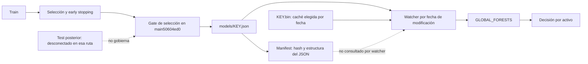

# MR — evidencia, promoción y linaje del registro de modelos

## Corte, alcance y dictamen

Auditoría Codex del 30 de septiembre de 2026. Rama propia
`codex/model-registry-evidence`, iniciada en `e8546d60`. Se inspecciona
también `origin/main=50604ed0` y la integración local GLM `c75f23ce`, sin
modificar su checkout, sus procesos o sus artefactos de entrenamiento.
Esta adenda conserva los informes anteriores; no recertifica todo el proyecto.

**Dictamen:** un archivo presente, un JSON sintácticamente válido, un
predictor estructuralmente válido, una evaluación fuera de muestra y una
activación efectiva son cinco evidencias distintas. El inventario mezclaba
las primeras con la promoción; además no demuestra qué bytes predijeron
en producción. Es una explicación posible de discrepancias backtest/vivo,
no una atribución cuantificada del PnL a este defecto.

El cambio MR-01 es diagnóstico, no un nuevo veto de trading: añade
validación estructural de las fuentes JSON y corrige la descripción del
conteo del CLI. **No** cambia loaders, watcher, trainer, genomas, modelos,
límites, órdenes ni fórmulas de sizing. El manifiesto real no se regenera.

## Topología observada: dónde se pierde la evidencia



El test posterior es el arreglo XLIV-13 ya contenido en las PR #10/#20 de
Claude. Esta ola no lo duplica. La flecha discontinua del manifest no es
un gate existente: señala expresamente una conexión que **no existe**.

## Matriz del corte

| ID | Prioridad | Hallazgo | Estado de esta ola |
|---|---|---|---|
| MR-01 | P1 | Legibilidad JSON contada como modelo promovido | Reparación diagnóstica candidata |
| MR-02 | P0 | Promoción sin ejecutar el test posterior; helper desconectado | Abierto en main observado; referencia XLIV-13, no descubrimiento duplicado |
| MR-03 | P1 | Hash del JSON no identifica necesariamente el predictor servido | Abierto; reproducción sintética añadida |
| MR-04 | P1 | Watcher consume la marca de tiempo antes de saber si cargó | Abierto; inspección estática |
| MR-05 | P2 | Cobertura por nombre y mensaje de carga pueden sobredeclarar disponibilidad | Abierto; inspección estática |
| MR-06 | P2 | `base=sigmoid(init_score)` se presenta también para regresiones | Abierto en el dato legado; semántica aclarada |

Seis expedientes en este documento no significan seis fallos inéditos ni
seis cierres: MR-02 referencia un expediente previo. Las prioridades
describen el daño potencial del mecanismo, no incidentes reales demostrados.

## MR-01 — Legible no significa cargable, promovido o hábil

**Evidencia original.** `ml_registry::escanear_models` parseaba a
`serde_json::Value` y asignaba `legible=true` a cualquier parseo correcto.
`model_manifest` contaba esas entradas e imprimía «modelos promovidos».
`{}`, `null`, offsets inconsistentes y ciclos pueden ser JSON válidos sin
representar un NanoForest aceptable. Las fixtures históricas del registry
probaban huellas y roundtrip, no la validez de los árboles; algunas ni
siquiera tenían una topología activable. Se conservan sus aserciones.

**Causa y efecto.** Se confundía el lenguaje de serialización con el
contrato del predictor. Un panel podría atribuir cobertura y desbloqueo
a un archivo que `NanoForest::from_data` rechaza. Este error no demuestra
que el motor haya ejecutado ese modelo: el loader tiene su propia aduana.

**Corrección candidata.** Se conservan `legible`, `sha256`, `base` y el
resto de los campos. Se añaden `valido_estructuralmente: Option<bool>` y
`error_estructural: Option<String>`. Los manifests previos deserializan
como `None` (no evaluado), nunca como éxito retroactivo. Un escaneo nuevo
produce `Some(true/false)` usando `NanoForest::from_data`; éste comprueba
arrays paralelos, parámetros finitos, offsets, hijos dentro del árbol,
ciclos y dimensión máxima. No se crea otro validador divergente.

La validación usa el **mismo buffer** cuyo SHA-256 y metadatos se calculan.
No usa `load_model`, pues ese método puede elegir/escribir una caché .bin.
El CLI separa número de archivos, legibilidad y estructura; deja explícito
que promoción y activación no quedan acreditadas.

**Prueba discriminante.** Cinco fuentes: hoja válida, ciclo, objeto vacío,
escalar `null` y JSON roto. Hay cuatro JSON legibles, pero sólo una
estructura válida. La equivalencia anterior «legibles = promovidos»
informaría cuatro. Se añade control de arrays, offsets y dimensión, así
como compatibilidad del manifest histórico. El escaneo no escribe cachés.

**Límite del cierre.** Validez estructural no prueba esquema de features,
unidades, calibración, posterioridad del test, liquidez, PnL ni autorización.
`base` y `n_arboles` de fuentes inválidas pueden seguir siendo metadatos
legibles: los consumidores deben atender al veredicto, no ocultar evidencia.
Los bytes reales de BTC no han sido cargados ni evaluados por esta ola.

## MR-02 — El contrato de holdout no gobierna el ejecutable observado

**Evidencia.** En `src/bin/train_forest.rs` de main50604ed0,
`require_promotion_holdout` y `require_later_holdout` aparecen como
definiciones y llamadas de tests. `main()` no parsea `--test-in`;
`gate_ok=gate_pass` depende de selección y puede escribir la ruta viva.
La nota GLM de XLIX-C dice que se verifica existencia: el código observado
es más débil, pues esa ruta no hace tal comprobación. Esto no permite
inferir qué versión exacta del binario histórico ejecutó GLM: falta su
identidad de build. Se distingue fuente auditada de ejecución reportada.

**Mecanismo estadístico.** Si la selección decide el número de árboles
que minimiza su pérdida y después esa misma pérdida habilita promoción,
selección y evaluación no son independientes. En clasificación,
`logloss=-mean[y*ln(p)+(1-y)*ln(1-p)]`; una reducción medida en selección
describe ese conjunto, no una garantía de habilidad posterior. En
regresión, `skill=1-MSE_modelo/MSE_persistencia` compara un referente más
pertinente que la media constante, pero tampoco elimina reutilización
de evidencia. El umbral heredado 0,001 no es un nivel de significación.

**Contexto concurrente.** GLM publicó ea962cf6/50604ed0: seis árboles,
base aproximada 0,1566, mejora de selección +0,0167, promoción «provisional».
Son resultados reportados, no recalculados aquí. Que reemplace un modelo
peor no demuestra que el nuevo sea admisible ni que revierta pérdidas.
La etiqueta documental provisional no es una cuarentena del watcher.

**Remediación ya en curso.** PR #10 / PR #20 reconectan validación de
holdout, posterioridad y gate conjunto selección ∧ test. Deben integrarse
con sus pruebas y luego evaluarse el artefacto congelado. Reentrenar o
ajustar repetidamente tras consultar el test exige nueva evidencia; no
convertir el test en otra selección. No se ejecutó entrenamiento ni
promoción/reversión desde Codex. No se considera cerrado por existir PR.

## MR-03 — Identidad del archivo frente a identidad de la decisión

**Evidencia.** El registry calcula SHA-256 de `{KEY}.json`; excluye .bin.
`NanoForest::load_model` deriva la pareja y prefiere .bin si existe y el
JSON no tiene una fecha estrictamente posterior. No valida una huella de
origen que ate caché y JSON. El watcher no consulta `ModelManifest`.

**Reproducción controlada.** Se genera un JSON con `init_score=-1` y una
caché estructuralmente válida con `init_score=2`, con fecha 60 segundos
posterior. El manifest representa el JSON y su base σ(-1)≈0,268941;
`load_model` sirve la caché y su base σ(2)≈0,880797. Ambas estructuras
son válidas. La diferencia supera 0,5 sin cambiar el JSON inventariado.
La prueba fija fechas explícitas y no depende de sleeps o tapes.

**Impacto.** Una señal no puede atribuirse al modelo del manifest sólo
porque coincida su clave. Copias, restauraciones o escritura de cachés
con fechas no causales pueden romper el linaje. No se ha demostrado que
el BTC recién entrenado sufra esta discrepancia; el witness demuestra
la posibilidad admitida por la implementación.

**Criterio de cierre futuro.** Vincular caché al hash y versión del esquema
de su fuente; registrar la identidad efectiva en la activación y en el
linaje de decisiones; preservar snapshots recuperables. Un hash versionado
sin los bytes accesibles no basta para reproducir el predictor. Esta ola
no cambia el loader, porque hacerlo altera el serving y exige su revisión
específica. La prueba de witness documenta un abierto, no un éxito de paridad.

## MR-04 — Recarga fallida tratada como cambio ya atendido

**Evidencia.** En `god_engine.rs`, el watcher inserta `modified` en
`forest_timestamps` antes de `load_global`. Ante error no revierte la
marca ni emite el motivo. Con un JSON sin caché, si la lectura falla y
su timestamp no cambia después, los ciclos siguientes no lo reintentan.
El trainer escribe con `File::create` y luego serializa, no publica un
archivo mediante sustitución atómica: existe una ventana para observar
un archivo incompleto. No se afirma haber provocado esa carrera real.

**Impacto.** El mapa puede conservar un predictor viejo o quedar sin él,
mientras el archivo en disco parece actualizado. Una comparación de PnL
podría atribuir cambios a un modelo que no llegó a activarse. La comprobación
cada diez segundos no es un SLA de activación: hay scheduler, E/S, fallos
y duración del parseo, además del intervalo de sondeo.

**Cierre requerido.** Publicación atómica; separar versión observada de
última versión activada; actualizar ésta sólo tras éxito; registrar errores
y reintento acotado sin bucle caliente. Tests de carga fallida seguida de
éxito con igual timestamp y conservación del modelo anterior. No se añade
en esta ola un reintento improvisado ni se reinicia el proceso vivo.

## MR-05 — Cobertura de nombres presentada como disponibilidad efectiva

`ml_coverage::roster_coverage` comprueba nombres/extensiones, no parseo ni
presencia en `GLOBAL_FORESTS`. Un `{SYM}_MOTOR.json` roto cuenta cubierto;
un directorio con ese sufijo también podría contarse. El arranque del host
descarta el `Result` de `load_global` y después imprime «Loaded ML Model».
En cambio, el núcleo usa `get_global` y `has_roster_model`: la telemetría
puede decir disponible mientras el motor permanece en su ruta sin modelo.

La reparación MR-01 no corrige este módulo ni estos mensajes del host.
Cerrar requiere separar inventario, validación, activación y modelo usado
por instrumento, con pruebas de error. No eliminar el veto para concordar
con un panel equivocado; corregir primero la evidencia del panel.

## MR-06 — Base logística sin declarar el objetivo y las unidades

El scanner incluye fuentes `_MOTOR`, `_VOL`, `_VOLU`, `_OI` y calcula
siempre σ(init_score). Para clasificación, la sigmoide transforma log-odds
en probabilidad. Para una regresión, `init_value` es la media cruda del
objetivo; la sigmoide pierde sus unidades y no es una tasa base de acierto.
El núcleo usa `init_value()` en la ruta de regresión; no se ha encontrado
que este metadato del manifest gobierne ese sizing. Es una distorsión
diagnóstica, no prueba de que se aplique esa sigmoide al sizing vivo.

Se conserva `base` por compatibilidad y se aclara su alcance en el código.
El cierre exige metadatos versionados de objetivo, unidad, horizonte,
esquema de features e intercepto crudo. No se infieren sólo del nombre:
un cambio de etiqueta puede mantener la misma clave. Igual dimensión no
significa igual semántica. El motor multiactivo y multiescala necesita
precisamente este contrato antes de comparar habilidades entre activos.

## Diseño y teoría: próximos pasos falsables

1. Fijar linaje causal: datos disponibles a cada instante, versión de
   features, genoma, modelo activado, costes y resultados. Sin esto, un
   cambio observado no es atribuible a la autoevolución.
2. Estimar habilidad por activo, objetivo y soporte temporal realmente
   observado; separar falta de datos de señal neutra. La resolución de
   un timestamp no acredita observaciones ni habilidad a esa escala.
3. Contrastar cualquier nueva teoría con un baseline, ablation, test
   posterior y presupuesto de latencia/memoria. Complejidad matemática,
   analogías físicas o terminología cuántica no constituyen evidencia de
   ventaja predictiva. Esta ola no propone resolver problemas del milenio.
4. La meta de duplicación cada tres días no se ha verificado. Mejorar
   causalidad e integridad es necesario para medirla, no suficiente para
   garantizarla. No se relajan controles de riesgo para aparentar éxito.

## Verificación y coordinación

Pruebas nuevas: separación legibilidad/estructura y ausencia de escritura
de caché; paridad con el validador del loader; manifests históricos con
estado desconocido; witness JSON/caché discrepantes. Se mantienen las
cuatro pruebas originales. Resultados de ejecución pendientes al escribir
este corte; no declarar éxito por inspección del código.

La CI previa de CX, run36670361992, terminó SUCCESS en e8546d60. No prueba
este nuevo cambio MR. GLM integra CX en su rama; Codex no toca ese merge.
PR10/20 siguen abiertas en la consulta. Sólo eliminar referencias cuya
ancestralidad a main remoto se compruebe y que ningún agente esté usando.

Fuentes de esta auditoría: `src/bin/train_forest.rs`, `god_engine.rs`,
`model_manifest.rs`; `crates/god-engine-core/src/ml_registry.rs`,
`ml_coverage.rs`, `ml_inference.rs` y los lectores indicados de `lib.rs`;
commits ea962cf6/50604ed0/c75f23ce y PR10/20/22. Cobertura focalizada;
no se leyó cada archivo del proyecto ni se ejecutaron todos sus tests.

### Seguimiento de integración CX (posterior al corte inicial)

Verificado remoto `main=ee438edb03333b67e2e41d8ba31229e8350a505e`:
PR22 figura MERGED en `c75f23ce44acbed4291237fb0617971ef2c6afa9`,
30-09-2026 12:27:51Z. Se comprobó ancestralidad de e8546d60 y ausencia
de delta en src/crates/workflow frente a ese candidato. El buzón conserva
en orden todas las líneas de CX. GLM reportó sus comprobaciones postmerge;
no se cuentan como pruebas ejecutadas por Codex en esta ola MR.

La rama remota CX ya había sido eliminada por GLM. Codex eliminó sólo
la referencia local `feat/quant-sr-codex-causalidad`, sin worktree activo,
después de esas comprobaciones. El historial es recuperable desde main.
La nueva rama MR se conserva: que su HEAD inicial esté en main no hace
descartables sus cambios pendientes. No se borran PR10/20 ni sus ramas.

### Ejecución local MR: primera evidencia

Código guardado en `b17c60d9`. Comando ejecutado:

```text
cargo +nightly-2026-06-30 test -p god-engine-core --locked --lib ml_registry::tests -- --test-threads=1
```

Resultado: **8 aprobadas, 0 fallidas, 0 ignoradas**, 0,25 s de ejecución;
3 min 56 s de compilación del perfil local con debuginfo. Compilador
`rustc 1.98.0-nightly (096694416 2026-06-29)`. Incluye las cuatro pruebas
anteriores y las cuatro nuevas, sin modelos reales. El witness MR-03
pasó porque reprodujo la discrepancia abierta, no porque se reparase.
La regresión ampliada y check all-targets se ejecutan aparte. CI remota
MR todavía no ejecutada en este corte. Una compilación fría inicial con
debug=0 fue interrumpida únicamente en el proceso propio para reutilizar
el perfil local disponible; no se contabiliza como una validación aprobada.
