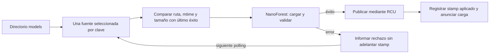

# MW — Seguimiento de recargas, rechazo recuperable y ciclo de vida de modelos

## 1. Dictamen y cobertura real

Fecha del corte: 2026-10-03. Base: `7fdd12dd4459c7c4c29d6117dd658a7e98686f14`.
Rama: `codex/model-reload-contract`, checkout administrado aislado
`model-lineage-audit`. No se cambia el checkout compartido de GLM, su exportador
L2, la rama Qoder ola52, el trainer, el genoma, las ecuaciones de consenso ni
los controles de riesgo. No se cargan modelos reales ni se ejecuta el motor.

Este informe amplía MR-04 y MP-06; no los presenta como descubrimientos nuevos.
Hay **tres familias candidatas de reparación y cuatro expedientes abiertos**.
Los siete fallos de tests RED no significan siete bugs independientes. La
evidencia cubre el seguimiento de archivos y su cableado; no certifica todos
los archivos/crates, rentabilidad, evolución universal o ventaja cuántica.

La afirmación histórica de que MP/GO estaban pendientes ya no describe el
estado remoto: ambos están integrados. Los informes anteriores se conservan,
y este documento añade el recibo actualizado en §7.

## 2. Grafo de decisión y significado de los estados



Para una clave k, el stamp observado es `S_k=(ruta,mtime,bytes)` y el stamp
aplicado es `A_k`. Sólo si el cargador retorna éxito se realiza `A_k←S_k`.
Antes se asignaba `A_k` al observar el archivo, antes de saber si se había
cargado. Se confundían **observación**, **intento** y **aplicación**.

`S_k` es un detector de cambios de metadata, no un hash, generación causal ni
evidencia de promoción. Una carga válida acredita estructura aceptable para
el binario, no habilidad OOS, calibración ni adecuación al activo/horizonte.
El estado de aplicación se mantiene dentro del polling; no es un recibo
durable por decisión ni un registro criptográfico del predictor servido.

## 3. Matriz de expedientes

| ID | Prioridad | Estado en este corte | Relación y contrato |
|---|---|---|---|
| MW-01 | P2 | candidato reparado | MR-04: fracaso marcado como aplicado; éxito de arranque ficticio |
| MW-02 | P2 | candidato reparado | MP-06: JSON/BIN son dos productores del mismo timestamp |
| MW-03 | P2 | candidato parcial y acotado | cambio de fuente o tamaño no se detectaba con sólo mtime |
| MW-04 | P1 | abierto, testigo de selección y lectura del consumidor | democión por renombrado no es revocación de serving |
| MW-05 | P1 | abierto, referencia previa | MR-03/MP-07: fuente, caché y modelo activo no tienen identidad vinculada |
| MW-06 | P2 | abierto, análisis estático | E/S y carga síncronas dentro de task async; latencia sin medir |
| MW-07 | P2 | abierto, testigo ejecutado | cambio de contenido con igual ruta/mtime/tamaño es invisible |

### MW-01 — Fracaso marcado como aplicado y falso positivo de carga inicial

**Evidencia previa.** En `src/bin/god_engine.rs`, tanto el bucle inicial como
el watcher insertaban `forest_timestamps[file_stem]=modified` antes de
`NanoForest::load_global`. En el arranque se descartaba su Result y siempre
se registraba «Loaded ML Model». En el watcher, un error evitaba el mensaje
de éxito, pero dejaba el timestamp aplicado: una siguiente observación sin
cambio de mtime omitía el reintento. Una falla transitoria de lectura o una
recarga rechazada podía quedar confundida con la aplicación del candidato.

**Impacto.** Se conserva el modelo anterior o la ausencia de modelo mientras
la metadata sugiere que ya se consumió la actualización. Eso puede alterar
la entrada disponible a la decisión y su atribución, pero no se ha medido su
frecuencia ni efecto económico en demo. No se afirma que el loader acepte
árboles inválidos: mantiene sus validaciones y publicación sólo al éxito.

**Reproducción.** En la política extraída, una carga que devuelve Err seguida
por Ok sobre el mismo archivo/mtime produce cero eventos de reintento. También
falla cuando el primer modelo se carga bien y falla una actualización posterior.
El test multiactivo demuestra que B puede cargarse aunque A falle y que A debe
reintentarse: no se debe convertir su rechazo previo en «ya aplicado».

**Corrección.** `ModelReloadTracker::scan` registra el stamp sólo después de
Ok. `refresh_ml_models` comparte la misma política en arranque y polling y
registra explícitamente Loaded/Rejected; un error de escaneo también se informa.
El cargador existente sigue conservando el último modelo válido al fallar.
No se convierte un error en probabilidad neutral ni se desactiva un veto.

**Límites.** El reintento conserva la cadencia existente de10s y no introduce
backoff por causa; errores permanentes pueden repetirse y generar logs. La
política de bloqueo/alerta por rechazo sostenido necesita presupuesto separado.

### MW-02 — Oscilación de timestamps entre JSON y BIN hermanos

**Evidencia.** El arranque ya prefería JSON y sólo usaba BIN sin JSON, pero el
watcher aceptaba ambas extensiones sin esa precedencia. Dos mtimes distintos
compartían una entrada por stem: JSON escribía tJ y BIN tB. Un segundo recorrido
estable podía repetir ambas cargas sin cambio de fuente. Además, crear la
caché como efecto de una carga agregaba un segundo productor de recarga.

**Reproducción.** Fixture `A.json` con mtime10.000s y `A.bin` con20.000s desde
epoch: el RED invoca al loader dos veces con la misma clave. Son marcas
sintéticas deterministas, no límites operativos ni una teoría de caducidad.
El GREEN exige una única llamada JSON y cero en el siguiente scan. Otro test
crea el BIN dentro del callback de carga y exige que no provoque trabajo extra.

**Corrección.** Una sola selección compartida por arranque y watcher: JSON,
o BIN legacy cuando el hermano JSON no existe. Los paths se ordenan para
diagnóstico determinista; no se usa el orden de read_dir como regla de negocio.
Si no puede establecerse la existencia del hermano se informa error, sin
suponer que el BIN está autorizado. Se omiten directorios y extensiones ajenas.

**Límite importante.** Pasar la ruta JSON al loader NO obliga a servir esos
bytes: su política interna todavía puede preferir una caché elegible por mtime.
Esta reparación no cierra MW-05 y no debe describirse como linaje resuelto.

### MW-03 — El timestamp por stem no identifica ni siquiera la fuente seleccionada

**Evidencia.** Un BIN legacy cargado y un JSON que aparece con el mismo mtime
comparten clave y timestamp aunque cambie la fuente seleccionada. También
puede cambiar la longitud sin variar el mtime observado. Ambos casos fallaron
en RED y ahora fuerzan una carga por cambio del tuple `(path,mtime,len)`.

**Corrección acotada.** Se amplía el detector con ruta y bytes. No se introduce
un umbral de antigüedad ni una lista arbitraria de regímenes; se observa la
identidad del path y una propiedad del archivo ya disponible en metadata.
No se llama a esto identidad de contenido. MW-07 conserva su contraejemplo.

### MW-04 — Democión documental no equivale a revocar el modelo activo

**Evidencia.** ADR-0008, propuesto, describe renombrar el artefacto a
`_CANDIDATE` como una forma de dejar de servirlo. Sin embargo, el watcher no
borra la clave del mapa global al desaparecer la fuente. Si queda el BIN
hermano, además vuelve a ser un BIN legacy elegible para esa clave original.

**Testigo.** Tras seleccionar `A_MOTOR.json` con BIN hermano, se renombra
sólo el JSON a `A_MOTOR_CANDIDATE.json`. El scan acepta de nuevo la clave
`A_MOTOR` con su BIN. La prueba usa callback sintético: demuestra selección,
no ejecuta ni revoca un modelo real. La conservación del mapa global se
verifica estáticamente en el consumidor, que sólo publica cargas exitosas.

**Impacto y cierre.** Una decisión manual de democión puede no reflejarse en
serving. Hace falta una política explícita de autorización/revocación por
clave/generación, semántica de snapshots ya retenidos y migración del BIN
legacy. No se implementa borrado automático de modelos al ver un archivo
ausente: una escritura temporal, falla de disco o sincronización parcial no
son por sí solas órdenes de revocación. El ADR se conserva, no se da por
implementado ni se ejecuta su regla manual desde esta auditoría.

### MW-05 — Identidad de contenido, versión y evidencia posterior siguen desconectadas

MR-03/MP-07 ya documentan JSON hasheado distinto del BIN servido. Este trabajo
no cambia `ml_inference.rs`, serialización, manifest, generación o promoción.
Se requieren un vínculo verificable fuente/caché/modelo y recibos por decisión;
el orden de llegada no impone orden de versiones y los heads no forman aún
una transacción única. No se suman estas referencias como nuevos cierres.

### MW-06 — La cadencia de polling no es una cota de disponibilidad

El host ejecuta read_dir, metadata y carga síncrona dentro de una task Tokio.
La espera10s se suma al trabajo del ciclo y al scheduling; no prueba recarga
en ≤10s. La duración puede depender de cantidad/tamaño de archivos, disco,
validación y contención. El nuevo tracker elimina trabajo duplicado, pero
no acredita p99 ni una cota nanosegundo a nanosegundo. Evaluar aislamiento de
E/S, backpressure y percentiles requiere medición; no se añade otro hilo ni
un cap arbitrario de símbolos sin esa evidencia.

### MW-07 — Contraejemplo conservado: mismo stamp, bytes diferentes

Se carga el contenido sintético `one` y se reemplaza por `two`, fijando el
mismo mtime y longitud. El scan no reintenta. El test lleva el nombre
`open_diagnostic`: pasar esa aserción acredita la LIMITACIÓN, no su reparación.
No puede inferirse identidad de bytes a partir de metadata. Un diseño por
digest/generación debería especificar costes, publicación atómica, reintentos
y acoplamiento con validación; no basta cambiar la etiqueta de este tuple.

## 4. Diseño, unidades y restricciones preservadas

La maquinaria usa conjuntos de claves y estados de aplicación, no categorías
de trading. No agrega scalping/swing ni discretiza volatilidad. Los13 tests
no son13 teorías ni13 motores. El observable es el número/resultado de llamadas
al loader por scan. La latencia, efecto sobre decisiones y retorno no se
estimaron. Las diferencias de mtime del fixture no son parámetros del genoma.

La complejidad del scan es O(F log F) por ordenar F paths y O(F) de metadata;
el mapa conserva O(K) stamps de claves aplicadas. Se comparten los modelos
mediante el cargador existente; el tracker no copia árboles ni calcula señales.
Las claves que desaparecen no se podan automáticamente: el crecimiento del
mapa ante un churn ilimitado requiere política de ciclo de vida, no un claim
de memoria constante. Todos estos costes son análisis de código, no benchmark.

Si falla la enumeración del directorio, el scan devuelve error antes de aplicar
sus candidatos; no se presenta una lista incompleta como escaneo exitoso. Ese
error global puede retrasar todas las recargas hasta otro ciclo. Los errores de
metadata/carga de una fuente ya enumerada se reportan por fuente y permiten
continuar con las demás. El test multiactivo cubre rechazo del loader, no todas
las fallas posibles del filesystem. No se afirma disponibilidad absoluta.

## 5. Pruebas y límites metodológicos

La extracción RED preservó la lógica del watcher: selección de ambas
extensiones, sólo mtime y actualización del registro antes del callback.
No se arrancó el daemon antiguo. Sobre esa política extraída: **2 pasan /7
fallan /0 ignoradas**,0,09s. Después del arreglo: **9/0/0**,0,07s.
Se agregan cuatro contratos sin debilitar los previos: cache creada durante
carga, cableado estático y dos diagnósticos abiertos. Resultado **13/0/0**,
0,93s. Son10 contratos conductuales,1 estático de wiring y2 limitaciones.

El runner inicial usa `rustc +nightly-2026-06-30 --edition=2024 --test` sobre
`crates/god-engine-core/tests/model_reload_contract.rs`, que incluye el módulo
productivo exacto por path. No es un simulacro escrito aparte de la corrección,
pero usa callbacks sintéticos y no valida integración completa de la aplicación.
El mismo target se añade al paso CI existente sin retirar otros tests.

La compilación workspace/all-targets/locked y las suites del loader se registran
al finalizar, no se dan por aprobadas por haber lanzado el proceso. No se ejecuta
T-1 extenso, inventario manual de modelos ni pruebas contra exchange.

## 6. Estado de publicación y coordinación

Se reservó el alcance en el buzón local ignorado. No es acuse de otros agentes.
La publicación pública específica MW se consulta; los permisos MP/GO históricos
no se presentan como una autorización ilimitada. Merge requiere CI del candidato
y revisión cruzada. No se fuerza ningún merge ni se borra un worktree activo.

## 7. Recibo Git de MP y GO, comprobado el 2026-10-03

| Cambio | Head publicado | Merge en main | CI del head |
|---|---|---|---|
| GO, PR24 |343247492586a9b6c0337a21ef096cb3ea846df5|22bf9d275b8e2a7642342e0fe3b65eb9ec293af1|36734061201 SUCCESS|
| MP, PR25 |ef2afefb2aee9589b0eb3c4edd5055d2bb275456|b56aa1187cc416e618cc57e0d68559d2f41adb42|36735220912 SUCCESS|

Ambos heads son ancestros de `origin/main7fdd12dd`. Reviews GLM favorables
con estado formal COMMENTED, no APPROVED: GO2026-09-30T15:54:00Z y
MP2026-09-30T15:54:30Z; la condición CI de MP quedó satisfecha antes del merge.
GO se fusionó2026-09-30T16:28:59Z; MP2026-10-01T14:49:24Z.
Se preserva esa cronología UTC en los recibos; no son ejecuciones nuevas de Codex.

El worktree antiguo no existe físicamente y no figura en `git worktree list`,
aunque conserva una referencia en los adjuntos de la app. No se atribuye su
retirada a un agente sin evidencia ni se restaura un merge documental obsoleto.
Las ramas antiguas MP/GO ya no aparecen localmente; no se afirma haberlas
eliminado en esta pasada. GLM y Qoder conservan sus cambios activos.

## 8. Criterio de cierre y siguiente frontera

Cerrar MW-01/02 y el alcance parcial MW-03 exige compilación, contratos,
review, integración y lectura del diff respecto a ambos padres si hay merge.
Cerrar MW-04/05/07 requiere políticas distintas y evidencia de versiones;
cerrar MW-06 requiere mediciones de carga y latencia. No se oculta ninguna
de esas condiciones tras CI verde ni tras el número de fórmulas del sistema.

No hay evidencia aquí del objetivo de100% cada72h. La preparación científica
depende primero de saber qué fuente/modelo/genoma decidió y qué resultado le
corresponde. Ni los problemas del milenio ni una denominación cuántica
substituyen esos contratos o constituyen una garantía de rendimiento.

## 9. Limpieza segura de referencias

Eliminada sólo la referencia local `glm/lxxxi-dl-modular` que apuntaba a
`2d4d72b8f1aaf2931044ea14dce2011acc2aa1dc`. Antes se comprobó ancestralidad
en origin/main y ausencia de worktree activo; el buzón declaraba LXXXI cerrado.
Se utilizó `git branch -d`, no borrado forzado. El commit permanece en main
y permite reconstruir esa referencia. Ningún archivo ni commit fue eliminado.
GLM LXXXII, Qoder ola52 y los respaldos no integrados se preservan.

## 10. Adenda lógico-científica: propiedades demostradas frente a etiquetas

Estas dos observaciones adicionales son de documentación/inferencia lógica;
no se suman a las tres reparaciones del watcher ni modifican otras fórmulas.

### SC-01 — Continuidad de la rampa VECM no implica suavidad C∞

El commit96c4beaf y el título de la entrada AGY Ola7 en memoria anuncian
continuidad C∞. En `crates/strategy-core/src/vecm_arbitrage.rs`, `evaluate`,
la rama positiva implementa la función siguiente, para z finito:

```text
f(z) = 0                      para 0 <= z <= 1.5
f(z) = -(z-1.5)/1.5           para 1.5 < z < 3
f(z) = -1                     para z >= 3
```

Los límites laterales de f coinciden: la función es continua, y el salto
anterior sí se eliminó. Sin embargo, en1.5 las derivadas laterales son0 y−2/3;
en3 son−2/3 y0. No es C1 en esos puntos, luego tampoco C∞. La extensión
antisimétrica tiene las esquinas correspondientes en−1.5 y−3.

Verificación numérica auxiliar de la fórmula observada, con h=10^-6:
pendientes en1.5:0/−0.6666666666118223; en3:−0.666666666759852/0. Es un
cálculo independiente, no una ejecución del predictor ni prueba de retorno.
La demostración por tramos es la evidencia principal; h sólo ilustra el límite.

**Clasificación SC-01: P2, sobreafirmación documental.** No demuestra que la
rampa sea una mala estrategia ni exige reemplazarla por tanh. Para afirmar
C∞ habría que elegir otra familia, preservar simetría/escala y validar su
efecto; para describir lo actual basta «continua y lineal por tramos». Los
umbrales1.5/3 tampoco reciben justificación estadística por llamarse smooth.
Se conserva código ajeno; no se pretende cerrar su calibración con esta nota.

### SC-02 — Igual cardinalidad de sensibilidad no implica preservación de genes

En memoria, la nota Qoder Ola45 infiere de «PASA ⇒ ≥16/144» que ningún gen
certificado perdió sensibilidad. El gate actual de T-1 sólo exige
`cobertura>=0.110`; sus propios mensajes ya advierten que no prueban inercia
global. La inferencia de la nota es más fuerte que esa aserción.

Si A y B son conjuntos de coordenadas sensibles antes/después,
`|A|-|B|=|A\B|-|B\A|`. Tener ambos16 elementos admite perder uno y ganar
otro: A={1,…,16}, B={2,…,17}. Ni conteo igual ni conteo superior implican
A⊆B. Para afirmar preservación hay que comparar las identidades bajo el
mismo protocolo y registrar pérdidas, ganancias y perturbaciones efectivas.

**Clasificación SC-02: P2, inferencia de auditoría insuficiente.** No se acusa
al test de prometer algo que su aserción no exige ni se afirma que ese ejemplo
haya ocurrido en la ola citada. Es un contraejemplo lógico a la conclusión.
No se baja ni sube el trinquete: en la base actual sigue0.110. El comentario
CL-35c del propio T-1 ya registra el antecedente relevante:10/11/20/33 no eran
sensibilidad falsa, sino sensibilidad tapada por escalas no observadas; su
reparación devolvió el umbral11,0%. Son resultados reportados por Claude,
no corridas reproducidas por Codex en esta ola.

## 11. Inventario no equivale a cobertura semántica

Inventario del árbol base con `git ls-tree -r --name-only HEAD`:1414 archivos,
452 Rust. Búsqueda léxica `git grep -l -i -E 'scalp|swing' HEAD -- '*.rs'`:
83 archivos Rust. El patrón encuentra código, campos legacy, comentarios y
tests; NO prueba83 motores separados ni83 bugs. No se hizo una sustitución
textual ciega ni se afirma haber leído semánticamente todos esos archivos.
Los expedientes anteriores indican los componentes y pruebas efectivamente
inspeccionados. Esa distinción debe conservarse en cualquier certificación.

## 12. Recibo de código local

Código/contratos/CI guardados en `d1cfe0b7675b53bf7e4398365220f2870021b1b0`.
No se publicó esta rama al guardar el commit. La compilación integral aún
estaba en progreso; el commit no certifica su resultado. Los hashes del
artefacto corresponden a las fuentes del runner13/0. La validación final y
la autorización pública se registrarán separadamente cuando existan.

## 13. Contratos de cierre para la siguiente reparación

Esta sección especifica criterios comprobables; no afirma que estén implementados.
El orden propuesto es identidad y ciclo de vida antes de ampliar la sofisticación
del predictor: sin atribución verificable, una mejora medida en backtest no puede
vincularse con seguridad al modelo que respondió en demo o producción.

| Expediente | Invariante necesario | Prueba de aceptación mínima |
|---|---|---|
| MW-04 | Una revocación explícita identifica clave y generación; la ausencia temporal de un archivo no se interpreta como una orden administrativa. | Revocar una generación con JSON, BIN y snapshot retenido; comprobar la política acordada en nuevas inferencias y en decisiones ya emitidas. Repetir con reinicio y ausencia transitoria de disco. |
| MW-05 | Fuente, caché, esquema de features y predictor publicado pertenecen a una identidad verificable; cada decisión referencia esa identidad. | Combinar JSON de generación A con BIN válido de generación B, incluso con mtimes iguales o invertidos; rechazar la mezcla o regenerar desde A, sin publicar B como si fuese A. |
| MW-06 | La latencia se mide entre eventos definidos, con carga, concurrencia y fallos documentados. Una cadencia no sustituye una distribución de latencia. | Medir detección, lectura, validación y publicación por separado; incluir directorio grande, disco lento, archivo inválido y múltiples claves. Informar percentiles y máximos observados sin presentarlos como cotas universales. |
| MW-07 | Cambiar bytes relevantes no puede quedar oculto detrás de igualdad de metadata si se exige detección de contenido. | Publicar dos contenidos válidos de igual longitud y mtime; exigir identificación inequívoca de la versión aplicada y verificar que una escritura incompleta nunca se publica. |

Para MW-04 hay una elección operativa pendiente: qué ocurre con una decisión que
retuvo un snapshot antes de la revocación. El watcher por sí solo no puede probar
que el consumidor cancela una orden, ni debería inventar esa política. La prueba
debe recorrer publicación, inferencia, decisión y ejecución bajo la misma versión
de contrato, sin ejecutar operaciones reales en esta fase.

Para MW-05/07, un hash calculado únicamente en el inventario no basta. El dato
necesita acompañar a los bytes efectivamente validados y al snapshot publicado.
También debe definirse cómo se evita una mezcla durante escrituras concurrentes.
La alternativa de releer todos los archivos en cada scan tiene un coste de E/S
que debe medirse; no se declara gratis ni se impone como solución sin presupuesto.

La evidencia posterior debe distinguir estas magnitudes:

- **Validez estructural:** el artefacto puede leerse y cumple el contrato del loader.
- **Identidad de serving:** se sabe qué versión efectiva respondió a cada decisión.
- **Elegibilidad estadística:** existe evidencia causal y fuera de muestra para su uso.
- **Resultado económico:** se contabilizan costes, fills, exposición y riesgo realizados.

Ninguna de las cuatro implica por sí sola las siguientes. Un modelo bien formado
puede carecer de habilidad; un modelo con evidencia histórica puede degradarse;
y una decisión correctamente atribuida puede perder dinero. Esta separación es
necesaria para investigar la divergencia backtest/demo, no una garantía financiera.

## 14. Revisión del consumidor y precisión de procedencia

La lectura final de `NanoForest::load_model` y `load_global` confirma dos
contratos distintos: `load_global` sólo publica después de que `load_model`
devuelve un modelo válido; pero la ruta solicitada puede resolverse a su BIN
hermano por la política de frescura existente. Por ello el log MW se precisa
a `Loaded ... (requested path: ...)`, sin atribuir al JSON los bytes servidos.
El mensaje de rechazo también identifica la ruta solicitada. No cambia la
selección, validación, caché ni publicación del loader.

Este ajuste y su aserción estática están en el commit local
`e7bd8f785ce2d29d20635f877df0d12925fed4d5`, posterior al código inicial
`d1cfe0b7`. El mismo runner focalizado se volvió a ejecutar: **13 pasan,
0 fallan, 0 ignoradas**, 0,10 s. Es una repetición de la misma suite con
una aserción reforzada, no 13 pruebas adicionales ni cierre de MW-05.

La compilación integral seguía en curso al guardar este ajuste. Los hashes
del corte inicial se preservan; `validation_followup` del artefacto registra
los nuevos hashes de host y contrato. El módulo de seguimiento no cambió.

## 15. Estado pendiente, sin certificación anticipada

Corte de seguimiento: 2026-10-03, 19:34 America/Bogota. La compilación
`cargo +nightly-2026-06-30 check --workspace --all-targets --locked -j 2`
continúa en el worktree nuevo, con nuevas dependencias generadas. No ha
devuelto un resultado final observado. La ausencia de errores impresos no
se convierte en aprobación. Después de terminar debe repetirse de forma
incremental, porque el ajuste de host/test de §14 se hizo durante esa primera
compilación. No se han ejecutado aquí las suites completas de loader ni T-1.

El worktree permanece en la rama propia; no se publicó MW, no se abrió su PR
ni se fusionó con main. La autorización pública específica se solicitó y no
se ha recibido respuesta en este corte. La revisión cruzada se pidió en el
buzón local con los dos commits de código; no se presupone recepción. Los
recibos MP/GO de §7 sí están confirmados y no dependen de ese permiso pendiente.
