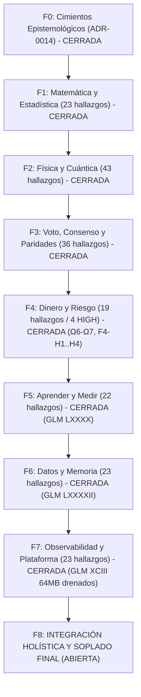

# 🌌 PLAN MAESTRO CUÁNTICO ESPECTRAL — QUANT SR. × CONSEJO SENIOR (EDICIÓN VIVA 2026-10-06)
## Arquitectura Sistémica de Grafo Vivo · Universo Multivariante Continuo Temporal Espectral
### Crecimiento Exponencial e Interés Compuesto (100% cada 3 Días) sobre Micro-Capital de $13 USD
*Revisión Integral desde la Base · Sincronización Inter-Agentes (Antigravity, Qoder, GLM, Codex, Claude)*

## Vigencia científica y estado de integración — 2026-10-08

Este documento conserva las contribuciones históricas del consejo y la
adenda de Sol íntegra. Los estados de cierre de sus olas no certifican la
composición nueva `e9c6a435eb1780da7f2c6e29103f3bd7d227d94c`, árbol
`10b8a427dfbdd5b203595b039b2dad50c69d6f68`, unión de `7acf36aa` y `5842c8e3` (incluye Ω26/Ω27).
**T1: APROBADO en e9: 16/144 sensibles (11,1%), mínimo 0,110 intacto, 1 test exacto y 1 filtrado; fixture sintético; publicación pendiente del recibo remoto.** Los 209 tests
registrados corresponden a `f3f8696`; no se traslada ese verde a otro árbol.
T1 no acredita rentabilidad ni la meta de duplicar equity neta cada 72 h.

El [plan por archivo](PLAN_REVISION_ARCHIVO_POR_ARCHIVO_2026-10-07.md)
gobierna la nueva cobertura: 1.478 rutas/474 Rust/655 `graphify-out` en el
ledger [ledger anotado de código](audit/REVISION_CODIGO_2026-10-08.json). El censo inicial dejó todas las filas
en `inventariado`; la anotación posterior registra **1.469 inventariado,
8 hallazgo_abierto de alcance parcial y 1 verificado**. Sólo cierra el archivo
de tests C07 completo (139 líneas, revisión independiente, 4/4 dentro del
recibo de riesgo 54/54 en `7acf36aa`); no cierra archivos enteros de runtime
ni la validación económica. El check posterior tuvo exit 0 y verifica
cobertura/metadatos, no la verdad semántica de la evidencia. Los censos
anteriores y fases cerradas conservan sus fechas; el cierre documental debe
entrar en el siguiente delta por SHA, aún pendiente de generación.

Qoder ola72 y Antigravity f9 mantienen reservas activas; GLM112 está
incorporado y Sol publicó SOL-R5-01 de reporting diario. Su avance no elimina
las limitaciones económicas del core. En este candidato Q1 comparte Darwin
mediante Arc entre workers, pero no acredita persistencia entre reinicios.
Q3 quitó el muestreo extra por cierre; todavía requiere contrato de gaps y
duración de retornos. Q2 (cash/MTM) y Q4 (DSR, dependencia, contaminación y
dispersión entre ensayos) permanecen abiertos. OU opt-in conserva un fallback
legacy que requiere contrato con su dueño; un testigo aislado no prueba uso
vivo, error financiero ni un arreglo ya realizado.

Las precisiones de esta edición separan capacidad de roster, malla de reloj
observado, esquemas de features y familias estadísticas. Las fórmulas de
Ville/DSR requieren sus supuestos y procedencia; no otorgan una tasa global
de error por el mero hecho de aparecer en el código. La física y las
analogías cuánticas requieren identificación y contraste OOS con costes.

Validación aplicable: 736 regresiones aplicables + T1 (1 test exacto, 16/144 sensibles, mínimo 0,110 intacto); total 737 aprobadas, 0 fallidas y 1 ignorada. 729 aprobadas se retienen por identidad desde 7acf y 8 se ejecutaron en e9, incluido T1. Check all-targets aprobado antes del merge; estos resultados no validan crecimiento económico. Los recibos conservan sus SHA
de ejecución: la matriz de equivalencia compara todas las entradas
versionadas y 530 inputs compilables/de fixtures, con modo/kind/OID.
Reporta por separado los dos archivos afectados y reejecutados en
`e9c6a435`: reporting continuo 2/2 y stateful_open 5/5. Los estados
externos no registrados por Git tienen límites explícitos; no se
finge que las suites anteriores corrieron en este SHA.

> Snapshot histórico de revalidación R4, 2026-10-07: [plan por archivo](PLAN_REVISION_ARCHIVO_POR_ARCHIVO_2026-10-07.md).
> Las olas cerradas conservan su evidencia histórica; no certifican toda la
> base actual. La meta financiera continúa sin validación económica OOS.
> Las analogías físicas siguientes requieren correspondencia y falsación;
> no son demostraciones de ventaja predictiva por sí mismas.

---

## 🏛️ 1. IDENTIDAD, DOCTRINA Y MANDATO CUÁNTICO

### Nota de vigencia R4 — 2026-10-07, Sol / revisión del consejo

El [plan operativo archivo por archivo](PLAN_REVISION_ARCHIVO_POR_ARCHIVO_2026-10-07.md) es la continuación de R4; [el plan compartido](PLAN_MAESTRO_SINCRONIZACION.md) gobierna ownership. Los estados históricos de este documento no se transfieren a un SHA nuevo sin recibos. El censo actual consta de 1.434 archivos versionados / 460 Rust en `8938cf41`; clasificación no equivale a auditoría completa.

Erratas conceptuales del texto histórico siguiente: nocional mínimo NO equivale a margen reservado ni determina por sí solo un número de posiciones; `23.105%` expresa tasa log diaria, mientras el retorno compuesto diario equivalente es `25.992105%`; `HorizonCurve` sirve `exp(a+b*ln(tau))`, no la expresión lineal sin exponencial. Ville requiere hipótesis/filtración/apuestas predecibles y control de la familia; no confiere inmunidad universal al data snooping. El símplex de cuatro etiquetas no prueba continuidad ni calibración completa. RMT no convierte la hipótesis de Riemann en señal de mercado, y Hodge sobre grafos no es la conjetura algebraico-geométrica del milenio. Toda transferencia de física/cuántica queda experimental hasta identificación, unidades, baseline, coste y beneficio OOS; O(1) no demuestra latencia en nanosegundos.

Corrección de estados: H2-7 está cubierto por el contrato GLM103 presente en `8938cf41`; la cita de `sync_curves_from_tp_sl_anchors` quedó superada por el helper real `rebuild_tp_sl_curves_from_anchors`. Darwin sigue leyendo cash y mezclando reloj de cierres con muestreo; el caller todavía recrea su contador en esta base (fix Codex pendiente de integración). Estas limitaciones reabren contratos sin borrar contribuciones previas. Se conserva debajo el histórico para trazabilidad, no como certificación actual.

### 1.1 Metas Financieras y Físicas
- **Capital Base**: **$13.00 USD**.
- **Entorno de Mercado**: Binance Futures USD-M (USDT / USDC colateral).
- **Restricción de Suelo**: `min_notional` se obtiene de la especificación vigente de cada símbolo; 5 USD es un ejemplo de fixture, no una constante universal certificada.
- **Nocional, margen y riesgo**: para nocional $N$ y apalancamiento $L$, el margen inicial aproximado es $N/L$, sujeto a las reglas del instrumento y la cuenta. El cociente $13/5$ no determina cuántas posiciones son admisibles. La admisión debe descontar reservas, costes, margen de mantenimiento, riesgo al stop y dependencia del portafolio; no se deduce un colchón de liquidación de ese cociente.
- **Tasa de Crecimiento Compuesto Continuo**:
  $$K(t) = K_0 \cdot 2^{t / T_{\text{meta}}}, \quad T_{\text{meta}} = 3 \text{ días} = 259,200 \text{ segundos}$$
  Tasa instantánea continua de crecimiento geométrico:
  $$g = \frac{\ln 2}{3 \times 86,400 \text{ s}} \approx 2.67418 \times 10^{-6} \text{ s}^{-1} = 0.23104906\ \text{día}^{-1}$$
  Esta es una tasa logarítmica. El rendimiento simple diario equivalente es $2^{1/3}-1\approx25.9921\%$; ambas magnitudes describen el objetivo, no resultados medidos.
- **Curva de Multiplicación Teórica Proyectada**:
  - Día 0: \$13.00 USD (Base)
  - Día 3: \$26.00 USD ($2\times$)
  - Día 6: \$52.00 USD ($4\times$)
  - Día 9: \$104.00 USD ($8\times$)
  - Día 12: \$208.00 USD ($16\times$)
  - Día 15: \$416.00 USD ($32\times$)
- **Rendimiento de Cómputo**: objetivo de baja latencia en Rust y uso acotado de memoria en el camino crítico. La complejidad depende del número de activos, escalas, motores y operaciones de cada ruta; ser Rust no demuestra $O(1)$, ausencia de asignaciones ni latencia en nanosegundos. Se requieren benchmarks p50/p95/p99, perfiles de asignación y condiciones de carga del hardware real.

---

## 🌌 2. EL PARADIGMA: UNIVERSO MULTIVARIANTE CONTINUO TEMPORAL ESPECTRAL

### 2.1 Erradicación de Dicotomías Discretas
Queda estrictamente prohibido pensar en categorías binarias o compartimentadas:
1. **No existe "Scalping" vs "Swing"**: El mercado es un continuo temporal. Cada operación nace con un horizonte físico intrínseco continuo $\tau \in [\tau_{\min}, \tau_{\max}]$, medido en segundos o milisegundos reales:
   En la base R4, las anclas operativas de curvas son `TAU_ANCHOR_FAST_MS=30000`
   y `TAU_ANCHOR_SLOW_MS=43200000`: **30 s a 12 h**. La malla representable,
   el horizonte observado y el dominio admitido por cada consumidor son
   conceptos distintos; otros rangos son propuestas hasta medirlos.
   Las curvas de Take Profit y Stop Loss se evalúan como variedades continuas sobre el genoma:
   $$\text{TP}(\tau) = \exp(a_{\text{tp}} + b_{\text{tp}} \ln(\tau/1\text{ ms})), \quad \text{SL}(\tau) = \exp(a_{\text{sl}} + b_{\text{sl}} \ln(\tau/1\text{ ms}))$$
   Corresponde a `HorizonCurve::eval` en `temporal_spectrum.rs`: el código recibe el valor numérico de $\tau$ en milisegundos. Un cambio de unidad requiere transformar el intercepto; los consumidores deben respetar su dominio operativo.
2. **Representación continua del estado**: la volatilidad es una variable continua. El código también usa un símplex $\Delta^3 = \{p \in [0, 1]^4 : \sum p_i = 1\}$ para cuatro componentes de estado; es una representación finita, no una prueba de calibración probabilística. La métrica de Fisher siguiente es una propuesta de geometría que requiere consumidor y validación explícitos:
   $$ds^2 = g_{ij}(\theta) d\theta^i d\theta^j, \quad g_{ij} = \mathbb{E}\left[\frac{\partial \ln p}{\partial \theta^i} \frac{\partial \ln p}{\partial \theta^j}\right]$$
3. **Estado multiactivo acoplado**: `MAX_COINS=30` es capacidad del arena, no un roster observado. En `7acf36aa`, el bootloader configura 26 símbolos USDT; eso no acredita que los 26 reciban datos u operen. El grafo por activo y escala debe identificar nodos observados, flujos, dependencia y antigüedad de cada relación, sin confundir capacidad con evidencia.

### 2.2 Representación Espectral del Estado del Mercado
El estado del universo se describe mediante el tensor continuo espectral $S(\omega, \tau, \mathbf{x}, t)$:
- $\omega$: Frecuencia espectral de microestructura (libro de órdenes, flujo de trades).
- $\tau$: Banco de 32 filtros sobre una malla representable logarítmica de razón 4:
  $$\tau_k = \tau_0 \cdot 4^k, \quad k \in \{0,\ldots,31\},\quad \tau_0=10^{-6}\text{ ms}=1\text{ ns}$$
  `SPECTRUM_SCALES_MS` define los nodos; `update` recibe milisegundos enteros y `FEED_CLOCK_RESOLUTION_MS=1`. Representar un nodo de 1 ns no demuestra observaciones con esa resolución. La banda observada y las salidas operativas de 30 s–12 h requieren sus propios contratos.
- $\mathbf{x}$: Vector definido por productor y consumidor. `OmniState::get_features` y `build_54d_tensor` tienen 54 componentes con esquemas distintos; NanoForest consume 48 (34 universales + 10 espectrales + 4 macro). Otros contratos usan 12, 64 o 144. No existe una dimensión universal de todo el estado, y número de slots no equivale a señales disponibles o independientes.
- $t$: Tiempo del evento y tiempo local con procedencia explícita. `/fapi/v1/time` consulta la hora del servidor por REST; no es un protocolo NTP. Medir offset, RTT e incertidumbre y preservar un reloj monotónico para duraciones.

---

## 🔬 3. TEORÍAS MATEMÁTICAS, ESTADÍSTICAS Y PROBLEMAS DEL MILENIO

### 3.1 Dinámica de Fluidos de Navier-Stokes y Microestructura del Libro
- **Estado: analogía de investigación, no modelo financiero validado**. La ecuación de fluidos no demuestra una ley del libro de órdenes. Definir observables, unidades, condiciones de frontera y contraste OOS antes de usarla como señal o veto.
- **Ecuación del Flujo de Liquidez**:
  $$\frac{\partial \mathbf{u}}{\partial t} + (\mathbf{u} \cdot \nabla)\mathbf{u} = -\frac{1}{\rho}\nabla P + \nu \nabla^2 \mathbf{u} + \mathbf{f}_{\text{OFI}}$$
  - $\mathbf{u}(p, t)$: Velocidad del flujo de órdenes en el espacio de precios $p$.
  - $\nu$: Viscosidad cinemática, gobernada por la profundidad del libro de órdenes (market depth).
  - La identificación de profundidad con viscosidad y una ley $E(k)\sim k^{-5/3}$ son hipótesis que requieren medición; no se deducen automáticamente de un colapso de profundidad financiera.

### 3.2 Descomposición de Helmholtz-Hodge sobre Grafos de Contagio
- **Descomposición del 1-Forma de Flujo en el Grafo Multiactivo $K_n$**:
  $$\mathbf{J} = \nabla \phi + \nabla \times \mathbf{A} + \mathbf{h}$$
  - $\nabla \phi$ (**Flujo de Gradiente / Potencial**): Componente irrotacional libre de bucles (arbitraje transitivo de paridades).
  - $\nabla \times \mathbf{A}$ (**Flujo Rotacional / Curl**): Componente solenoidal asociada a bucles cerrados de liquidación y contagio asimétrico (`curl_share`).
  - $\mathbf{h}$ (**Flujo Armónico**): Modos topológicos globales del mercado cripto.
  - **Implementación**: [`crates/risk-engine/src/hodge.rs`](../crates/risk-engine/src/hodge.rs).

### 3.3 Procesos Estocásticos Continuos Ornstein-Uhlenbeck y Fokker-Planck
- **SDE Continuo de Reversión**:
  $$dX_t = \theta(\mu - X_t)dt + \sigma dW_t$$
- **Ecuación de Evolución de Probabilidad (Fokker-Planck)**:
  $$\frac{\partial P(x, t)}{\partial t} = -\theta \frac{\partial}{\partial x}[(\mu - x) P(x, t)] + \frac{\sigma^2}{2} \frac{\partial^2 P(x, t)}{\partial x^2}$$
  - Vida media analítica continua: $t_{1/2} = \frac{\ln 2}{\theta}$ (en segundos reales).
  - Varianza ergódica estacionaria: $\text{Var}_\infty = \frac{\sigma^2}{2\theta}$.
  - Estimación recursiva con pesos exponenciales $s_w$; esos pesos no demuestran exactitud estadística, identificación ni calibración. El contrato del estimador y su reloj debe contrastarse por separado de las identidades analíticas del modelo OU.
  - **Implementación**: [`crates/strategy-core/src/vecm_arbitrage.rs`](../crates/strategy-core/src/vecm_arbitrage.rs) (Cerrado en Ola Ω7, commit `5663d1f1`).

### 3.4 Martingalas de Ville y E-Values (Anytime-Valid Sequential Testing)
- **Desigualdad Maximal de Ville**:
  $$\mathbb{P}\left(\exists t \ge 1: M_t \ge \frac{1}{\alpha}\right) \le \alpha$$
  - Control de observación secuencial sólo si $M_t$ es un e-proceso válido bajo la hipótesis nula y su filtración. La selección de escalas/motores/activos necesita además una familia y corrección declaradas; datos reutilizados o apuestas no predecibles pueden invalidar la garantía.
  - Familias distintas por instancia/activo: 32 escalas usan umbral 640 en la selección temporal; 13 motores $\times$ 32 escalas = 416 pares usan umbral 8320 en pesos por habilidad:
    $$\text{Umbral de Familia} = \frac{M}{\alpha} = \frac{416}{0.05} = 8320$$
  - El veto multiactivo usa otra familia, 2175/43500. Su conteo de escalas y dominio tiene una reserva R4-I4 en [residuales de integración](audit/RESIDUALES_INTEGRACION_R4_2026-10-07.md); no se confunde con 32/416. La corrección familiar no exige independencia entre procesos, pero sí procesos válidos y una familia completa. Ninguna cifra aquí certifica control global entre activos, reinicios y búsquedas adicionales.
  - **Implementación**: [`crates/quantum-arena/src/evalues.rs`](../crates/quantum-arena/src/evalues.rs) (Cerrado por Qoder en Olas 60 y 62, commits `5b83168e` y `e4bed5dc`).

### 3.5 Teoría de Matrices Aleatorias (RMT)
- **Filtrado Espectral de Correlación (Marchenko-Pastur & Wigner-Dyson)**:
  Para una matriz de covarianza empírica $\mathbf{C}$ de $N$ series observadas válidas y ventana de $T$ observaciones bajo el nulo declarado (la capacidad de 30 slots no fija automáticamente $N$):
  $$\lambda_{\max}^{\text{ruido}} = \sigma^2 \left(1 + \sqrt{\frac{N}{T}}\right)^2$$
  El borde es una referencia bajo supuestos del modelo nulo, no una clasificación infalible de cada autovalor. Dependencia temporal, asincronía, colas y tamaño efectivo modifican su interpretación; validar la matriz reconstruida y la utilidad del filtro. No se deduce edge financiero de conexiones con la hipótesis de Riemann.
  - **Implementación**: [`crates/risk-engine/src/random_matrix.rs`](../crates/risk-engine/src/random_matrix.rs).

### 3.6 Deflated Sharpe Ratio (DSR) y Control de Multiplicidad de Bailey-López de Prado
- **Aproximación de Valores Extremos de Gumbel**:
  $$E[\max \text{SR}] \approx \sigma_{\text{SR}} \cdot \left[ (1 - \gamma)\Phi^{-1}\left(1 - \frac{1}{N}\right) + \gamma \Phi^{-1}\left(1 - \frac{1}{N \cdot e}\right) \right]$$
  - El código usa el umbral nominal $DSR \ge 0.95$ en promoción genética; ese umbral no certifica su tasa de error bajo dependencia temporal ni reutilización de OOS. El informe [FUNDAMENTOS_R4](audit/FUNDAMENTOS_R4_2026-10-07.md) distingue el error estándar del Sharpe ganador de la dispersión entre ensayos, y conserva esos problemas abiertos.
  - **Implementación**: [`crates/risk-engine/src/selection_stats.rs`](../crates/risk-engine/src/selection_stats.rs) (Centralizado DRY en Ola Ω11).

---

## 🛡️ 4. AUDITORÍA INTEGRAL DE VETOS Y SIZING ($13 USD)

### 4.1 Inventario Forense de Vetos y Sizing
| Veto / Compuerta | Archivo y Línea | Estado | Veredicto Cuántico |
|---|---|---|---|
| **`REJ_TP_SL_FLOOR`** | `risk-engine/src/lib.rs:857` | **VÁLIDO** | Exige $f_{\text{fee}} \le q \cdot \text{SL}$. Impide abrir posiciones cuyo stop natural sea inferior a la fricción combinada (2x taker fee + slippage). |
| **`clamp_ruin` & Streak Cap** | `risk-engine/src/ruin.rs:67` | **VÁLIDO** | Limita el riesgo por evento a $f_{\text{cap}} = 1 - \text{SURVIVAL\_FLOOR}^{1/\text{streak}}$, acotado por el axioma absoluto del 25% ($3.25 USD en $13 USD). |
| **`veto_por_riesgo_cramer_lundberg`** | `risk-engine/src/correlation_guard.rs:552` | **VÁLIDO** | Acota la probabilidad de ruina del grupo mediante el coeficiente de ajuste $R$ medido. Para $\rho < 0$ (hedges), la varianza se reduce cuadráticamente ($k + k(k-1)\rho < k$). |
| **Suelos Literales Ramas 13/15** | `god-engine-core/src/lib.rs:419,6055,6110` | **ERRADICADO (Ola Ω13)** | Erradicados los pisos 0.55/0.58; `confluencia_resonante` modula suavemente desde 0.50 y ramas 11, 13, 14, 15 conectan con `conviccion_de_rama` (D-752). |
| **Veto MAP de Régimen Crash** | `risk-engine/src/orchestrator.rs:182` | **ERRADICADO (Ola Ω12)** | Sustituido el corte discontinuo $X \to 0$ por contracción suave continua $0.25 \cdot p_{\text{crash}}$, reservando veto absoluto solo a $p_{\text{crash}} \ge 0.90$. |
| **Fuente Única Brackets Curva (G0-5)** | `god_engine.rs:51-64,4049-4060` | **ERRADICADO (Ola Ω14)** | Reemplazada la reconstrucción manual desde anclas por `arena.config.tp_at_tau` / `sl_at_tau`, garantizando respuesta continua inmediata a mutaciones (a, b) en caliente y preservando clamp C-05. |
| **Segundo Momento Kolmogorov Sesgado** | `quantum-arena/src/temporal_spectrum.rs:1483` | **ERRADICADO (Ola Ω12)** | Reemplazado $(E|dev|)^2$ por $E[dev^2] = raw\_dev\_s2 / mass$, eliminando el sesgo sistemático de Jensen de $36.3\%$. |
| **Desacople Rama 13 de ancla fija** | `god-engine-core/src/lib.rs:6017` | **ERRADICADO (Ola Ω11)** | Rama 13 ahora evalúa $tp\_at\_tau(swing\_duration\_ms)$ dinámico en vez de $swing\_tp\_base$ fijo de 12h. |
| **Lead-Lag con Autocorrelación Espuria** | `feature-engine/src/lead_lag.rs:53` | **ERRADICADO (Ola Ω11)** | BTC opera como líder macro exógeno puro sin auto-referencia ($\rho=1.0$ a lag 0 erradicado). |
| **Bootstrap 1x Leverage Hardcode** | `god_engine.rs:3896` | **ERRADICADO (F4-H2)** | Forzaba apalancamiento 1x en $n < 30$, consumiendo $5.05 USD de margen en $5 notional (38.8% de la cuenta). Reemplazado por `boot_lev.clamp(1, 10)` (~$1.01 USD de margen). |
| **División por Cero en Deriva** | `execution-engine/reconciliation.rs:667` | **ERRADICADO (F4-H1)** | `lev_deriva` ahora está sanitizado (`lev >= 1.0`), eliminando `INFINITY` en el margen utilizado del arena. |
| **Zombis en Rechazo Firme** | `execution-engine/executor.rs:2148` | **ERRADICADO (F4-H4)** | Invoca inmediatamente `order_registry.mark_local_reject()` en errores firmes de Binance. |
| **Bloqueo Incondicional GENOME-GATE** | `quantum-arena/genome_store.rs:243` | **ERRADICADO (F4-H3)** | Normalización automática en carga vía `from_vector()` y saneamiento de cotas de slots 21, 54 y 107. |

---

## 🗺️ 5. RECORRIDO EXHAUSTIVO POR FASES (F0 - F8)

El barrido histórico documentó **23 crates** y aproximadamente 377 archivos/137.000 líneas de Rust. Sus etiquetas CERRADA son recibos de aquellas olas, no cobertura transferida al candidato actual; la adenda vigente fija el nuevo censo y las fases R0–R9:

### 5.1 Estado Consolidado de la Ronda 2 (G0 - G2, 38 Hallazgos)
Snapshot histórico de esa ronda; sus pendientes no representan la cola de R4.
Olas 63/64/65/66 posteriores figuran en MEMORIA y en el buzón.
- **5/5 HIGH CERRADOS AL 100%**:
  1. `G1-1 [HIGH]`: Ville con umbral de familia Bonferroni $M/\alpha = 640 / 8320$ (Qoder Ola 62).
  2. `G1-2 [HIGH]`: Hurst VR con estimador insesgado de Lo & MacKinlay ($c_k = (n-k+1)(1-k/n)$) (AGY Ola Ω10).
  3. `G1-3 [HIGH]`: DSR cableado como compuerta formal conjunta en `darwin.rs` ($DSR \ge 0.95$ OOS) (AGY Ola Ω10).
  4. `G2-1 [HIGH]`: Confluence `.max(0.0)` en vez de `.abs()` — la calma absuelve (Qoder Ola 62).
  5. `G2-2 [HIGH]`: `flow_impulse` exceso-SS en fallback vivo (Qoder Ola 62).
- **8/15 MED CERRADOS**:
  1. `G0-1 [MED]`: Veto MAP de Crash suavizado a contracción continua de margen (AGY Ola Ω12).
  2. `G0-2 [MED]`: Rama 13 desacoplada de `swing_tp_base` hacia `tp_at_tau(swing_duration_ms)` (AGY Ola Ω11).
  3. `G0-3 [MED]`: Suelos literales de ramas 13/15 erradicados; convicción gobernada por evidencia empírica (AGY Ola Ω13).
  4. `G0-4 [MED]`: Gen residual muerto `capital_split_scalp` congelado en genoma (AGY Ola Ω10).
  5. `G0-5 [MED]`: Fuente única de brackets `tp_at_tau` / `sl_at_tau` en `god_engine.rs` erradicando reconstrucción de anclas (AGY Ola Ω14).
  6. `G1-4 [MED]`: Segundo momento central Kolmogorov insesgado en $S_2(\tau)$ (AGY Ola Ω12).
  7. `G1-5 [MED]`: Unificación DRY canónica de `selection_stats` (AGY Ola Ω11).
  8. `G2-10 [MED]`: Lead-lag cross-asset sin autocorrelación espuria (AGY Ola Ω11).
- **7 MED Pendientes Activos**:
  - `G2-3..G2-9 [MED]`: Suavizado de signums duros a funciones $C^1$ (en vuelo por Qoder en `.ola63`).
  - `F2-B8 [MED]`: Extensión de e-proceso de Ville al $\rho(\tau)$ cruzado multiactivo.

### 5.2 Estado Consolidado de la Ronda 3 (H0 - H2, 22 Hallazgos)
- **H1-2 REABIERTO como R4-Q2/Q3 (2026-10-07)**: Ω15 añadió observaciones, pero el evaluador lee saldo realizado (`unified_capital`) y mezcla cadencia temporal con cierres. No acredita MTM ni muestras homogéneas; faltan contratos de equity y reloj. Evidencia en `audit/FUNDAMENTOS_R4_2026-10-07.md`.
- **H1-3 REABIERTO como R4-Q1 (2026-10-07)**: el contador existe en `DarwinDaemon`, pero el host reconstruye la instancia dentro de cada ronda y pierde la acumulación. Corrección local R4: compartir un `Arc` persistente entre workers; compilación/regresión e integración pendientes en el recibo de cierre. La persistencia entre reinicios y la validez del test secuencial siguen abiertas.
- **H1-4 [MED] CERRADO (Ola Ω15 AGY)**: Error estándar asintótico no-normal de Sharpe `sharpe_std_error(m, sr)` formalizado en `selection_stats.rs` (Bailey-LdP 2012/2014 ec. 4 y 7), considerando sesgo $\gamma_3$ y curtosis pesada $\gamma_4$ en el benchmark $E[\max \text{SR}]$.
  **Límite R4-Q4**: ese ajuste de no-normalidad no corrige autocorrelación. El error temporal y la dispersión entre candidatos requieren validación adicional; no se declara DSR calibrado para el sistema.
- **H0-1 [MED] CERRADO (Ola Ω16 AGY)**: Erradicación de dimensiones muertas en mutaciones de nichos walk-forward en `continuous_evolution_backtest.rs:363-411` mediante `sync_curves_from_tp_sl_anchors()` en `SuperGenotype` (`genome.rs:2015`), reconstruyendo las curvas continuas $C^1$ TP/SL con blindaje `enforce_curve_rr(0.0004)` y asegurando transferencia activa de las cotas al Arena.
- **H0-2 [MED] CERRADO (lib.rs:310, 6321)**: Arbitración de fusión constructiva desacoplada del índice mayor mediante `etiqueta_fusion_constructiva`, atribuyendo la evidencia empírica a la rama con mayor convicción.
- **H1-1 [MED] CERRADO (GLM 101)**: Consumo de bloque por par-escala en `espectral_multiactivo.rs`.
- **H2-1..H2-5 [HIGH/MED]**: ola65 integrada según MEMORIA del 2026-10-07; R4 revisa contratos nuevos sin duplicar ese arreglo.

---

## 🤝 6. PROTOCOLO DE COORDINACIÓN INTER-AGENTES Y GOBERNANZA GIT

Para garantizar ejecución paralela estricta sin pérdida de trabajo ni choques:
1. **Ramas Personales y Worktrees Aislados**:
   - Cada agente opera exclusivamente en su propio worktree (`.antigravity`, `.ola63`, `.ola65`, `.codex/*`).
   - Está **estrictamente prohibido** el uso de `git add -A`. Se realiza `git add` explícito únicamente de los archivos modificados.
2. **Ciclo de Integración Atómico**:
   - `git checkout -b <agente>/<tarea>` (o `git worktree add <dir> -b <rama>`).
   - Modificación + `cargo check --workspace --all-targets` + tests unitarios.
   - Commit atómico con prefijo del bloque funcional (`feat(Ω16): ...`).
   - Verificación de whitespace sin falsos positivos: `git -c core.whitespace=-blank-at-eof,-blank-at-eol diff --check HEAD^ HEAD`.
   - Rebase / Merge fast-forward sobre `main`.
   - `git push origin main`.
   - Limpieza únicamente de refs tras comprobar nombre/OID, ancestría en `main` y `origin/main` publicado y ausencia de actividad o commits exclusivos. Excluir `main`, Qoder, Antigravity y nuevas ramas externas. Conservar directorios y archivos de worktrees; un detach autorizado de un checkout histórico sucio sólo al mismo HEAD, sin force y con status/hashes idénticos antes/después. Abortar ante cualquier discrepancia.
3. **Buzón Vivo de Coordinación**:
   - Toda interacción, hallazgo o cierre se notifica en [`COORDINACION_CODEX_2026-09-28.md`](../COORDINACION_CODEX_2026-09-28.md) y [`.agents/MEMORIA.md`](../.agents/MEMORIA.md).

---

## 7. Snapshot histórico de olas Ω15/Ω16 y reapertura R4

Las entradas siguientes son recibos históricos. El plan vigente de la nueva
revisión es `PLAN_REVISION_ARCHIVO_POR_ARCHIVO_2026-10-07.md`; R4-Q1/Q2/Q3/Q4
reabren ciclo de vida, marcado, reloj e inferencia aunque las suites anteriores
fueran verdes. No presentar esta lista como certificación al 100% del sistema.

1. **Ola Ω15 AGY CERRADA**:
   - Recibo Ω15: tests 10/10 en `selection_stats` y 11/11 en `darwin` verdes en su ola. Reaperturas R4 descritas arriba.
2. **Ola Ω16 AGY CERRADA**:
   - H0-1 cerrado al 100%. Activación continua de curvas desde anclas en `SuperGenotype` y `continuous_evolution_backtest.rs`. Test de contrato verde.
   - H0-2 confirmado cerrado en `lib.rs`.
3. **Qoder**:
   - Ola65/66 integradas; ola67 de limpieza observada activa al iniciar R4.
4. **Siguiente Bloque Prioritario**:
   - Contratos R4 de medición/inferencia, composición de riesgo y recuperación de ramas; limpieza LOW coordinada con Qoder.
