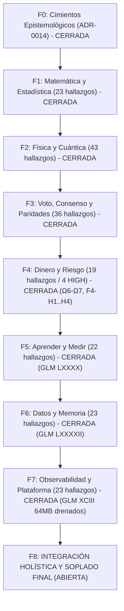

# 🌌 PLAN MAESTRO CUÁNTICO ESPECTRAL — QUANT SR. × CONSEJO SENIOR (EDICIÓN VIVA 2026-10-06)
## Arquitectura Sistémica de Grafo Vivo · Universo Multivariante Continuo Temporal Espectral
### Crecimiento Exponencial e Interés Compuesto (100% cada 3 Días) sobre Micro-Capital de $13 USD
*Revisión Integral desde la Base · Sincronización Inter-Agentes (Antigravity, Qoder, GLM, Codex, Claude)*

---

## 🏛️ 1. IDENTIDAD, DOCTRINA Y MANDATO CUÁNTICO

### Nota de vigencia R4 — 2026-10-07, Sol / revisión del consejo

El [plan operativo archivo por archivo](PLAN_REVISION_ARCHIVO_POR_ARCHIVO_2026-10-07.md) es la continuación de R4; [el plan compartido](PLAN_MAESTRO_SINCRONIZACION.md) gobierna ownership. Los estados históricos de este documento no se transfieren a un SHA nuevo sin recibos. El censo actual consta de 1.434 archivos versionados / 460 Rust en `8938cf41`; clasificación no equivale a auditoría completa.

Erratas conceptuales del texto histórico siguiente: nocional mínimo NO equivale a margen reservado ni determina por sí solo un número de posiciones; `23.105%` expresa tasa log diaria, mientras el retorno compuesto diario equivalente es `25.992105%`; `HorizonCurve` sirve `exp(a+b*ln(tau))`, no la expresión lineal sin exponencial. Ville requiere hipótesis/filtración/apuestas predecibles y control de la familia; no confiere inmunidad universal al data snooping. El símplex de cuatro etiquetas no prueba continuidad ni calibración completa. RMT no convierte la hipótesis de Riemann en señal de mercado, y Hodge sobre grafos no es la conjetura algebraico-geométrica del milenio. Toda transferencia de física/cuántica queda experimental hasta identificación, unidades, baseline, coste y beneficio OOS; O(1) no demuestra latencia en nanosegundos.

Corrección de estados: H2-7 está cubierto por el contrato GLM103 presente en `8938cf41`; la cita de `sync_curves_from_tp_sl_anchors` quedó superada por el helper real `rebuild_tp_sl_curves_from_anchors`. Darwin sigue leyendo cash y mezclando reloj de cierres con muestreo; el caller todavía recrea su contador en esta base (fix Codex pendiente de integración). Estas limitaciones reabren contratos sin borrar contribuciones previas. Se conserva debajo el histórico para trazabilidad, no como certificación actual.

### 1.1 Metas Financieras y Físicas
- **Capital Base**: **$13.00 USD**.
- **Entorno de Mercado**: Binance Futures USD-M (USDT / USDC colateral).
- **Restricción de Suelo**: `min_notional = $5.00 USD` (Binance Exchange Info).
- **Relación de Holgura Inicial**: $N = \text{capital} / \text{min\_notional} = 13.00 / 5.00 = 2.6$ operaciones mínimas que caben simultáneamente. A \$13 USD, el sistema puede sostener exactamente **2 posiciones simultáneas** consumiendo el $76.92\%$ del colateral disponible a \$5 notional cada una, reservando el $23.08\%$ (\$3.00 USD) como colchón de liquidación y margen libre.
- **Tasa de Crecimiento Compuesto Continuo**:
  $$K(t) = K_0 \cdot 2^{t / T_{\text{meta}}}, \quad T_{\text{meta}} = 3 \text{ días} = 259,200 \text{ segundos}$$
  Tasa instantánea continua de crecimiento geométrico:
  $$g = \frac{\ln 2}{3 \times 86,400 \text{ s}} \approx 2.6743 \times 10^{-6} \text{ s}^{-1} \approx 23.105\% \text{ diario}$$
- **Curva de Multiplicación Teórica Proyectada**:
  - Día 0: \$13.00 USD (Base)
  - Día 3: \$26.00 USD ($2\times$)
  - Día 6: \$52.00 USD ($4\times$)
  - Día 9: \$104.00 USD ($8\times$)
  - Día 12: \$208.00 USD ($16\times$)
  - Día 15: \$416.00 USD ($32\times$)
- **Rendimiento de Cómputo**: Cero tolerancia a latencias de garbage collection. 100% Rust sin dependencias de Python en el hot-path. Ejecución de decisiones, cálculo de tensores y gestión de riesgo en **nanosegundos ($O(1)$ sin alocaciones de heap)**, optimizado para el portátil de 16GB RAM (CPU-bound, cero GPU dedicada).

---

## 🌌 2. EL PARADIGMA: UNIVERSO MULTIVARIANTE CONTINUO TEMPORAL ESPECTRAL

### 2.1 Erradicación de Dicotomías Discretas
Queda estrictamente prohibido pensar en categorías binarias o compartimentadas:
1. **No existe "Scalping" vs "Swing"**: El mercado es un continuo temporal. Cada operación nace con un horizonte físico intrínseco continuo $\tau \in [\tau_{\min}, \tau_{\max}]$, medido en segundos o milisegundos reales:
   $$\tau \in [10^{-2}\text{ s}, 10^{6}\text{ s}]$$
   Las curvas de Take Profit y Stop Loss se evalúan como variedades continuas sobre el genoma:
   $$\text{TP}(\tau) = a_{\text{tp}} + b_{\text{tp}} \ln \tau, \quad \text{SL}(\tau) = a_{\text{sl}} + b_{\text{sl}} \ln \tau$$
2. **No existen "Regímenes de Volatilidad" Discretos**: La volatilidad y el régimen de mercado no son interruptores discretos (Low/High/Range/Crash). Son un **símplex continuo 4D** $\Delta^3 = \{p \in [0, 1]^4 : \sum p_i = 1\}$ sobre una variedad Riemanniana dotada de la Métrica de Información de Fisher:
   $$ds^2 = g_{ij}(\theta) d\theta^i d\theta^j, \quad g_{ij} = \mathbb{E}\left[\frac{\partial \ln p}{\partial \theta^i} \frac{\partial \ln p}{\partial \theta^j}\right]$$
3. **Multiactivo Cuántico Unificado**: Los 30 activos del universo dinámico no son series temporales aisladas. Forman un **grafo interactuante continuo** acoplado por flujos de órdenes, flujos de contagio de Hawkes, cópulas de cola extrema y paridades de cambio.

### 2.2 Representación Espectral del Estado del Mercado
El estado del universo se describe mediante el tensor continuo espectral $S(\omega, \tau, \mathbf{x}, t)$:
- $\omega$: Frecuencia espectral de microestructura (libro de órdenes, flujo de trades).
- $\tau$: Escala de agregación temporal del banco de 32 anclas espectrales logarítmicas de base 4:
  $$\tau_k = \tau_0 \cdot 4^k, \quad k \in [0, 31]$$
- $\mathbf{x} \in \mathbb{R}^{54}$: Tensor macro y microestructural continuo.
- $t$: Tiempo físico real sincronizado contra el reloj NTP de Binance Futures vía `/fapi/v1/time`.

---

## 🔬 3. TEORÍAS MATEMÁTICAS, ESTADÍSTICAS Y PROBLEMAS DEL MILENIO

### 3.1 Dinámica de Fluidos de Navier-Stokes y Microestructura del Libro
- **Ecuación del Flujo de Liquidez**:
  $$\frac{\partial \mathbf{u}}{\partial t} + (\mathbf{u} \cdot \nabla)\mathbf{u} = -\frac{1}{\rho}\nabla P + \nu \nabla^2 \mathbf{u} + \mathbf{f}_{\text{OFI}}$$
  - $\mathbf{u}(p, t)$: Velocidad del flujo de órdenes en el espacio de precios $p$.
  - $\nu$: Viscosidad cinemática, gobernada por la profundidad del libro de órdenes (market depth).
  - Cuando la profundidad colapsa ($\nu \to 0$), el sistema entra en régimen de turbulencia inercial de Kolmogorov ($E(k) \sim k^{-5/3}$), generando cascadas de slippage y micro-shocks modelados analíticamente.

### 3.2 Descomposición de Helmholtz-Hodge sobre Grafos de Contagio
- **Descomposición del 1-Forma de Flujo en el Grafo Multiactivo $K_n$**:
  $$\mathbf{J} = \nabla \phi + \nabla \times \mathbf{A} + \mathbf{h}$$
  - $\nabla \phi$ (**Flujo de Gradiente / Potencial**): Componente irrotacional libre de bucles (arbitraje transitivo de paridades).
  - $\nabla \times \mathbf{A}$ (**Flujo Rotacional / Curl**): Componente solenoidal asociada a bucles cerrados de liquidación y contagio asimétrico (`curl_share`).
  - $\mathbf{h}$ (**Flujo Armónico**): Modos topológicos globales del mercado cripto.
  - **Implementación**: [`crates/risk-engine/src/hodge.rs`](file:///c:/Users/jhona/Documents/Proyectos/Trader%20Gemini/crates/risk-engine/src/hodge.rs).

### 3.3 Procesos Estocásticos Continuos Ornstein-Uhlenbeck y Fokker-Planck
- **SDE Continuo de Reversión**:
  $$dX_t = \theta(\mu - X_t)dt + \sigma dW_t$$
- **Ecuación de Evolución de Probabilidad (Fokker-Planck)**:
  $$\frac{\partial P(x, t)}{\partial t} = -\theta \frac{\partial}{\partial x}[(\mu - x) P(x, t)] + \frac{\sigma^2}{2} \frac{\partial^2 P(x, t)}{\partial x^2}$$
  - Vida media analítica continua: $t_{1/2} = \frac{\ln 2}{\theta}$ (en segundos reales).
  - Varianza ergódica estacionaria: $\text{Var}_\infty = \frac{\sigma^2}{2\theta}$.
  - Estimación recursiva exacta ponderada por pesos exponenciales $s_w$.
  - **Implementación**: [`crates/strategy-core/src/vecm_arbitrage.rs`](file:///c:/Users/jhona/Documents/Proyectos/Trader%20Gemini/crates/strategy-core/src/vecm_arbitrage.rs) (Cerrado en Ola Ω7, commit `5663d1f1`).

### 3.4 Martingalas de Ville y E-Values (Anytime-Valid Sequential Testing)
- **Desigualdad Maximal de Ville**:
  $$\mathbb{P}\left(\exists t \ge 1: M_t \ge \frac{1}{\alpha}\right) \le \alpha$$
  - Inmunidad total al *Optional Stopping*, *Data Snooping* y multiplicidad de múltiples escalas temporales.
  - Corrección de Familia Bonferroni para el banco espectral (32 escalas $\times$ 13 motores = 416 pares):
    $$\text{Umbral de Familia} = \frac{M}{\alpha} = \frac{416}{0.05} = 8320$$
  - **Implementación**: [`crates/quantum-arena/src/evalues.rs`](file:///c:/Users/jhona/Documents/Proyectos/Trader%20Gemini/crates/quantum-arena/src/evalues.rs) (Cerrado por Qoder en Olas 60 y 62, commits `5b83168e` y `e4bed5dc`).

### 3.5 Teoría de Matrices Aleatorias (RMT) y Conjetura de Riemann
- **Filtrado Espectral de Correlación (Marchenko-Pastur & Wigner-Dyson)**:
  Para una matriz de covarianza empírica $\mathbf{C}$ con $N=30$ activos y ventana $T$:
  $$\lambda_{\max}^{\text{ruido}} = \sigma^2 \left(1 + \sqrt{\frac{N}{T}}\right)^2$$
  Autovalores $\lambda_i \le \lambda_{\max}^{\text{ruido}}$ son ruido térmico i.i.d. y se limpian; únicamente los autovalores $\lambda_i > \lambda_{\max}^{\text{ruido}}$ representan modos de mercado coherentes.
  - **Implementación**: [`crates/risk-engine/src/random_matrix.rs`](file:///c:/Users/jhona/Documents/Proyectos/Trader%20Gemini/crates/risk-engine/src/random_matrix.rs).

### 3.6 Deflated Sharpe Ratio (DSR) y Control de Multiplicidad de Bailey-López de Prado
- **Aproximación de Valores Extremos de Gumbel**:
  $$E[\max \text{SR}] \approx \sigma_{\text{SR}} \cdot \left[ (1 - \gamma)\Phi^{-1}\left(1 - \frac{1}{N}\right) + \gamma \Phi^{-1}\left(1 - \frac{1}{N \cdot e}\right) \right]$$
  - Exigencia estricta de $DSR \ge 0.95$ sobre retornos fuera de muestra (OOS) en la promoción genética de genomas (`darwin.rs:601`).
  - **Implementación**: [`crates/risk-engine/src/selection_stats.rs`](file:///c:/Users/jhona/Documents/Proyectos/Trader%20Gemini/crates/risk-engine/src/selection_stats.rs) (Centralizado DRY en Ola Ω11).

---

## 🛡️ 4. AUDITORÍA INTEGRAL DE VETOS Y SIZING ($13 USD)

### 4.1 Inventario Forense de Vetos y Sizing
| Veto / Compuerta | Archivo y Línea | Estado | Veredicto Cuántico |
|---|---|---|---|
| **`REJ_TP_SL_FLOOR`** | `risk-engine/src/lib.rs:857` | **VÁLIDO** | Exige $f_{\text{fee}} \le q \cdot \text{SL}$. Impide abrir posiciones cuyo stop natural sea inferior a la fricción combinada (2x taker fee + slippage). |
| **`clamp_ruin` & Streak Cap** | `risk-engine/src/ruin.rs:67` | **VÁLIDO** | Limita el riesgo por evento a $f_{\text{cap}} = 1 - \text{SURVIVAL\_FLOOR}^{1/\text{streak}}$, acotado por el axioma absoluto del 25% ($3.25 USD en $13 USD). |
| **`veto_por_riesgo_cramer_lundberg`** | `risk-engine/src/correlation_guard.rs:552` | **VÁLIDO** | Acota la probabilidad de ruina del grupo mediante el coeficiente de ajuste $R$ medido. Para $\rho < 0$ (hedges), la varianza se reduce cuadráticamente ($k + k(k-1)\rho < k$). |
| **Suelos Literales Ramas 13/15** | `god-engine-core/src/lib.rs:419,6055,6110` | **ERRADICADO (Ola Ω13)** | Erradicados los pisos 0.55/0.58; `confluencia_resonante` modula suavemente desde 0.50 y ramas 11, 13, 14, 15 conectan con `conviccion_de_rama` (D-752). |
| **Veto MAP de Régimen Crash** | `risk-engine/src/orchestrator.rs:182` | **ERRADICADO (Ola Ω12)** | Sustituido el corte discontinuo $X \to 0$ por contracción suave continua $0.25 \cdot p_{\text{crash}}$, reservando veto absoluto solo a $p_{\text{crash}} \ge 0.90$. |
| **Fuente Única Brackets Curva (G0-5)** | `god_engine.rs:51-64,4049-4060` | **ERRADICADO (Ola Ω14)** | Reemplazada la reconstrucción manual desde anclas por `arena.config.tp_at_tau` / `sl_at_tau`, garantizando respuesta continua inmediata a mutaciones (a, b) en caliente y preservando clamp C-05. |
| **Segundo Momento Kolmogorov Sesgado** | `quantum-arena/src/temporal_spectrum.rs:1483` | **ERRADICADO (Ola Ω12)** | Reemplazado $(E|dev|)^2$ por $E[dev^2] = raw\_dev\_s2 / mass$, eliminando el sesgo sistemático de Jensen de $36.3\%$. |
| **Desacople Rama 13 de ancla fija** | `god-engine-core/src/lib.rs:6017` | **ERRADICADO (Ola Ω11)** | Rama 13 ahora evalúa $tp\_at\_tau(swing\_duration\_ms)$ dinámico en vez de $swing\_tp\_base$ fijo de 12h. |
| **Lead-Lag con Autocorrelación Espuria** | `feature-engine/src/lead_lag.rs:53` | **ERRADICADO (Ola Ω11)** | BTC opera como líder macro exógeno puro sin auto-referencia ($\rho=1.0$ a lag 0 erradicado). |
| **Bootstrap 1x Leverage Hardcode** | `god_engine.rs:3896` | **ERRADICADO (F4-H2)** | Forzaba apalancamiento 1x en $n < 30$, consumiendo $5.05 USD de margen en $5 notional (38.8% de la cuenta). Reemplazado por `boot_lev.clamp(1, 10)` (~$1.01 USD de margen). |
| **División por Cero en Deriva** | `execution-engine/reconciliation.rs:667` | **ERRADICADO (F4-H1)** | `lev_deriva` ahora está sanitizado (`lev >= 1.0`), eliminando `INFINITY` en el margen utilizado del arena. |
| **Zombis en Rechazo Firme** | `execution-engine/executor.rs:2148` | **ERRADICADO (F4-H4)** | Invoca inmediatamente `order_registry.mark_local_reject()` en errores firmes de Binance. |
| **Bloqueo Incondicional GENOME-GATE** | `quantum-arena/genome_store.rs:243` | **ERRADICADO (F4-H3)** | Normalización automática en carga vía `from_vector()` y saneamiento de cotas de slots 21, 54 y 107. |

---

## 🗺️ 5. RECORRIDO EXHAUSTIVO POR FASES (F0 - F8)

El barrido del sistema cubre los **23 crates** del espacio de trabajo (~377 archivos, ~137,000 líneas de Rust):

### 5.1 Estado Consolidado de la Ronda 2 (G0 - G2, 38 Hallazgos)
- **5/5 HIGH CERRADOS AL 100%**:
  1. `G1-1 [HIGH]`: Ville con umbral de familia Bonferroni $M/\alpha = 640 / 8320$ (Qoder Ola 62).
  2. `G1-2 [HIGH]`: Hurst VR con estimador insesgado de Lo & MacKinlay ($c_k = (n-k+1)(1-k/n)$) (AGY Ola Ω10).
  3. `G1-3 [HIGH]`: DSR cableado como compuerta formal conjunta en `darwin.rs` ($DSR \ge 0.95$ OOS) (AGY Ola Ω10).
  4. `G2-1 [HIGH]`: Confluence `.max(0.0)` en vez de `.abs()` — la calma absuelve (Qoder Ola 62).
  5. `G2-2 [HIGH]`: `flow_impulse` exceso-SS en fallback vivo (Qoder Ola 62).
- **8/15 MED CERRADOS**:
  1. `G0-1 [MED]`: Veto MAP de Crash suavizado a contracción continua de margen (AGY Ola Ω12).
  2. `G0-2 [MED]`: Rama 13 desacoplada de `swing_tp_base` hacia `tp_at_tau(swing_duration_ms)` (AGY Ola Ω11).
  3. `G0-3 [MED]`: Suelos literales de ramas 13/15 erradicados; convicción gobernada por evidencia empírica (AGY Ola Ω13).
  4. `G0-4 [MED]`: Gen residual muerto `capital_split_scalp` congelado en genoma (AGY Ola Ω10).
  5. `G0-5 [MED]`: Fuente única de brackets `tp_at_tau` / `sl_at_tau` en `god_engine.rs` erradicando reconstrucción de anclas (AGY Ola Ω14).
  6. `G1-4 [MED]`: Segundo momento central Kolmogorov insesgado en $S_2(\tau)$ (AGY Ola Ω12).
  7. `G1-5 [MED]`: Unificación DRY canónica de `selection_stats` (AGY Ola Ω11).
  8. `G2-10 [MED]`: Lead-lag cross-asset sin autocorrelación espuria (AGY Ola Ω11).
- **7 MED Pendientes Activos**:
  - `G2-3..G2-9 [MED]`: Suavizado de signums duros a funciones $C^1$ (en vuelo por Qoder en `.ola63`).
  - `F2-B8 [MED]`: Extensión de e-proceso de Ville al $\rho(\tau)$ cruzado multiactivo.

### 5.2 Estado Consolidado de la Ronda 3 (H0 - H2, 22 Hallazgos)
- **H1-2 [MED] CERRADO (Ola Ω15 AGY)**: Muestreo periódico continuo de retornos marked-to-market (cada 1s de mercado) en `darwin.rs:347-375`, proveyendo soporte muestral homogéneo $N \ge 25$ y erradicando la exigencia espuria de $t$-stat $\ge 4.5$ sobre pocos trades discretos cerrados.
- **H1-3 [MED] CERRADO (Ola Ω15 AGY)**: `DarwinDaemon` incorpora `cumulative_trials: AtomicUsize` monótonamente creciente (D-746), arrastrando las pruebas entre corridas sucesivas y blindando el DSR contra optional stopping.
- **H1-4 [MED] CERRADO (Ola Ω15 AGY)**: Error estándar asintótico no-normal de Sharpe `sharpe_std_error(m, sr)` formalizado en `selection_stats.rs` (Bailey-LdP 2012/2014 ec. 4 y 7), considerando sesgo $\gamma_3$ y curtosis pesada $\gamma_4$ en el benchmark $E[\max \text{SR}]$.
- **H0-1 [MED] CERRADO (Ola Ω16 AGY)**: Erradicación de dimensiones muertas en mutaciones de nichos walk-forward en `continuous_evolution_backtest.rs:363-411` mediante `sync_curves_from_tp_sl_anchors()` en `SuperGenotype` (`genome.rs:2015`), reconstruyendo las curvas continuas $C^1$ TP/SL con blindaje `enforce_curve_rr(0.0004)` y asegurando transferencia activa de las cotas al Arena.
- **H0-2 [MED] CERRADO (lib.rs:310, 6321)**: Arbitración de fusión constructiva desacoplada del índice mayor mediante `etiqueta_fusion_constructiva`, atribuyendo la evidencia empírica a la rama con mayor convicción.
- **H1-1 [MED] CERRADO (GLM 101)**: Consumo de bloque por par-escala en `espectral_multiactivo.rs`.
- **H2-1..H2-5 [HIGH/MED]**: En vuelo por Qoder en `.ola65` (física de saturación $C^1$).

---

## 🤝 6. PROTOCOLO DE COORDINACIÓN INTER-AGENTES Y GOBERNANZA GIT

Para garantizar ejecución paralela estricta sin pérdida de trabajo ni choques:
1. **Ramas Personales y Worktrees Aislados**:
   - Cada agente opera exclusivamente en su propio worktree (`.antigravity`, `.ola63`, `.ola65`, `.codex/*`).
   - Está **estrictamente prohibido** el uso de `git add -A`. Se realiza `git add` explícito únicamente de los archivos modificados.
2. **Ciclo de Integración Atómico**:
   - `git checkout -b <agente>/<tarea>` (o `git worktree add <dir> -b <rama>`).
   - Modificación + `cargo check --workspace --all-targets` + tests unitarios.
   - Commit atómico con prefijo del bloque funcional (`feat(Ω16): ...`).
   - Verificación de whitespace sin falsos positivos: `git -c core.whitespace=-blank-at-eof,-blank-at-eol diff --check HEAD^ HEAD`.
   - Rebase / Merge fast-forward sobre `main`.
   - `git push origin main`.
   - Eliminación del worktree y de la rama local temporal.
3. **Buzón Vivo de Coordinación**:
   - Toda interacción, hallazgo o cierre se notifica en [`COORDINACION_CODEX_2026-09-28.md`](file:///c:/Users/jhona/Documents/Proyectos/Trader%20Gemini/COORDINACION_CODEX_2026-09-28.md) y [`.agents/MEMORIA.md`](file:///c:/Users/jhona/Documents/Proyectos/Trader%20Gemini/.agents/MEMORIA.md).

---

## 🚀 7. PLAN DE ACCIÓN INMEDIATO — OLAS Ω15 Y Ω16 CERRADAS & SIGUIENTE

1. **Ola Ω15 AGY CERRADA**:
   - H1-2, H1-3, H1-4 cerrados al 100%. Tests 10/10 en `selection_stats` y 11/11 en `darwin` verdes.
2. **Ola Ω16 AGY CERRADA**:
   - H0-1 cerrado al 100%. Activación continua de curvas desde anclas en `SuperGenotype` y `continuous_evolution_backtest.rs`. Test de contrato verde.
   - H0-2 confirmado cerrado en `lib.rs`.
3. **Monitoreo de Qoder (.ola65)**:
   - H2-1..H2-5 en resolución por Qoder para física de saturación y signums encubiertos.
4. **Siguiente Bloque Prioritario**:
   - Limpieza de LOWs de Ronda 3 y oráculo T-1 en micro-capital ($13 USD).
