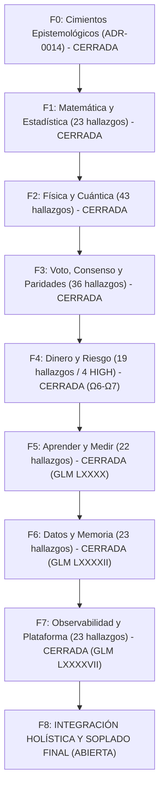

# 🌌 PLAN MAESTRO CUÁNTICO ESPECTRAL — QUANT SR. × CONSEJO SENIOR
## Arquitectura Sistémica de Grafo Vivo · Universo Multivariante Continuo Temporal Espectral
### Crecimiento Exponencial e Interés Compuesto (100% cada 3 Días) sobre Micro-Capital de $13 USD
*Revisión Integral desde la Base · Sincronización Inter-Agentes (Antigravity, Qoder, GLM, Codex, Claude)*

---

## 🏛️ 1. IDENTIDAD, DOCTRINA Y MANDATO CUÁNTICO

### 1.1 Metas Financieras y Físicas
- **Capital Base**: **$13.00 USD**.
- **Entorno de Mercado**: Binance Futures USD-M (USDT / USDC colateral).
- **Restricción de Suelo**: `min_notional = $5.00 USD` (Binance API).
- **Relación de Holgura Inicial**: $N = \text{capital} / \text{min\_notional} = 13.00 / 5.00 = 2.6$ operaciones mínimas que caben simultáneamente.
- **Tasa de Crecimiento Compuesto Continuo**:
  $$K(t) = K_0 \cdot 2^{t / T_{\text{meta}}}, \quad T_{\text{meta}} = 3 \text{ días} = 259,200 \text{ segundos}$$
  Tasa instantánea continua:
  $$g = \frac{\ln 2}{3 \times 86,400 \text{ s}} \approx 2.6743 \times 10^{-6} \text{ s}^{-1} \approx 23.105\% \text{ diario}$$
- **Rendimiento de Cómputo**: Cero tolerancia a latencias de garbage collection. 100% Rust sin dependencias de Python en el hot-path. Ejecución de decisiones, cálculo de tensores y gestión de riesgo en **nanosegundos**, compatible con el hardware local (laptop 16GB RAM, CPU-bound, sin GPU dedicada).

---

## 🌌 2. EL PARADIGMA: UNIVERSO MULTIVARIANTE CONTINUO TEMPORAL ESPECTRAL

### 2.1 Erradicación de Dicotomías Discretas
Queda estrictamente prohibido pensar en categorías binarias o compartimentadas:
1. **No existe "Scalping" vs "Swing"**: El mercado es un continuo temporal. Cada operación nace con un horizonte físico intrínseco continuo $\tau \in [\tau_{\min}, \tau_{\max}]$, medido en segundos o milisegundos reales:
   $$\tau \in [10^{-2}\text{ s}, 10^{6}\text{ s}]$$
   Las curvas de Take Profit y Stop Loss se evalúan como variedades continuas:
   $$\text{TP}(\tau) = \exp(a_{\text{tp}} + b_{\text{tp}} \ln \tau), \quad \text{SL}(\tau) = \exp(a_{\text{sl}} + b_{\text{sl}} \ln \tau)$$
2. **No existen "Regímenes de Volatilidad" Discretos**: La volatilidad y el régimen de mercado no son interruptores discretos (Low/High/Range). Son un **campo continuo sobre una variedad Riemanniana** dotada de la Métrica de Información de Fisher:
   $$ds^2 = g_{ij}(\theta) d\theta^i d\theta^j, \quad g_{ij} = \mathbb{E}\left[\frac{\partial \ln p}{\partial \theta^i} \frac{\partial \ln p}{\partial \theta^j}\right]$$
3. **Multiactivo Cuántico Unificado**: Los 30 activos del universo de trading no son series temporales aisladas. Forman un **grafo interactuante continuo** acoplado por flujos de ordenes, flujos de contagio de Hawkes, cópulas de cola extrema y paridades de cambio.

### 2.2 Representación Espectral del Estado del Mercado
El estado del universo se describe mediante el tensor continuo espectral $S(\omega, \tau, \mathbf{x}, t)$:
- $\omega$: Frecuencia espectral de microestructura (libro de órdenes, flujo de trades).
- $\tau$: Escala de agregación temporal del banco de 32 anclas espectrales logarítmicas de base 4:
  $$\tau_k = \tau_0 \cdot 4^k, \quad k \in [0, 31]$$
- $\mathbf{x} \in \mathbb{R}^{54}$: Tensor macro y microestructural continuo.
- $t$: Tiempo físico real sincronizado contra el reloj NTP de Binance Futures vía `/fapi/v1/time`.

---

## 🔬 3. TEORÍAS MATEMÁTICAS, ESTADÍSTICAS Y FÍSICAS AVANZADAS

### 3.1 Dinámica de Fluidos de Navier-Stokes y Microestructura
- **Ecuación del Flujo de Liquidez**:
  $$\frac{\partial \mathbf{u}}{\partial t} + (\mathbf{u} \cdot \nabla)\mathbf{u} = -\frac{1}{\rho}\nabla P + \nu \nabla^2 \mathbf{u} + \mathbf{f}_{\text{OFI}}$$
  - $\mathbf{u}(p, t)$: Velocidad del flujo de órdenes en el espacio de precios.
  - $\nu$: Viscosidad cinemática, gobernada por la profundidad del libro de órdenes (market depth).
  - Cuando la profundidad colapsa ($\nu \to 0$), el sistema entra en régimen de turbulencia inercial, generando shocks de slippage y cascadas de liquidaciones modeladas analíticamente.

### 3.2 Descomposición de Helmholtz-Hodge sobre Grafos de Contagio
- **Descomposición del 1-Forma de Flujo en el Grafo Multiactivo $K_n$**:
  $$\mathbf{J} = \nabla \phi + \nabla \times \mathbf{A} + \mathbf{h}$$
  - $\nabla \phi$ (**Flujo de Gradiente / Potencial**): Componente irrotacional libre de bucles (arbitraje transitivo de paridades).
  - $\nabla \times \mathbf{A}$ (**Flujo Rotacional / Curl**): Componente solenoidal asociada a bucles cerrados de liquidación y contagio asimétrico (`curl_share`).
  - $\mathbf{h}$ (**Flujo Armónico**): Modos topológicos globales del mercado cripto.
  - **Implementación**: [`crates/risk-engine/src/hodge.rs`](file:///c:/Users/jhona/Documents/Proyectos/Trader%20Gemini/crates/risk-engine/src/hodge.rs).

### 3.3 Procesos Estocásticos Continuos Ornstein-Uhlenbeck y Fokker-Planck
- **SDE Continuo de Reversión**:
  $$dX_t = \theta(\mu - X_t)dt + \sigma dW_t$$
- **Ecuación de Evolución de Probabilidad (Fokker-Planck)**:
  $$\frac{\partial P(x, t)}{\partial t} = -\theta \frac{\partial}{\partial x}[(\mu - x) P(x, t)] + \frac{\sigma^2}{2} \frac{\partial^2 P(x, t)}{\partial x^2}$$
  - Vida media analítica continua: $t_{1/2} = \frac{\ln 2}{\theta}$ (en segundos reales).
  - Varianza ergódica estacionaria: $\text{Var}_\infty = \frac{\sigma^2}{2\theta}$.
  - Estimación recursiva exacta ponderada por pesos exponenciales $s_w$.
  - **Implementación**: [`crates/strategy-core/src/vecm_arbitrage.rs`](file:///c:/Users/jhona/Documents/Proyectos/Trader%20Gemini/crates/strategy-core/src/vecm_arbitrage.rs) (Cerrado en Ola Ω7, commit `5663d1f1`).

### 3.4 Martingalas de Ville y E-Values (Anytime-Valid Sequential Testing)
- **Desigualdad Maximal de Ville**:
  $$\mathbb{P}\left(\exists t \ge 1: M_t \ge \frac{1}{\alpha}\right) \le \alpha$$
  - Inmunidad total al *Optional Stopping*, *Data Snooping* y multiplicidad de múltiples escalas temporales.
  - El e-proceso acumula evidencia secuencial sobre el signo de la predicción $\text{signo}(\text{señal} \cdot \text{retorno})$.
  - Sustituye umbrales fijos de Fisher ($p$-values estáticos) con una prueba de capital martingala: el motor solo opera si $M_t \ge 1/\alpha = 20$ ($\alpha = 0.05$).
  - **Implementación**: [`crates/quantum-arena/src/evalues.rs`](file:///c:/Users/jhona/Documents/Proyectos/Trader%20Gemini/crates/quantum-arena/src/evalues.rs) (Cerrado por Qoder en Ola 60, commit `5b83168e`).

### 3.5 Escalamiento Fractal por Variance Ratio (Hurst Multiescala Honesto)
- **Ley de Escalamiento Físico**:
  $$\text{Var}(r^{(k)}) \propto k^{2H} \implies 2H = \frac{d \ln \text{Var}(k)}{d \ln k}$$
  - Erradicado el pseudo-Hurst de Geary ($L_1/L_2$) que colapsaba erróneamente por curtosis en colas pesadas.
  - Estimador $O(1)$ sin asignaciones de heap para escalas $k \in \{1, 2, 4\}$ con regularización Bayesiana hacia el prior browniano $H_0 = 0.50$ con peso $w = N/(N+12)$.
  - **Implementación**: [`crates/feature-engine/src/multifractal.rs`](file:///c:/Users/jhona/Documents/Proyectos/Trader%20Gemini/crates/feature-engine/src/multifractal.rs) (Cerrado en Ola Ω8, commit `89cba430`).

### 3.6 Deflated Sharpe Ratio (DSR) y Control de Multiplicidad de Selección
- **Aproximación de Valores Extremos de Gumbel (Bailey & López de Prado 2014)**:
  $$E[\max \text{SR}] \approx \sigma_{\text{SR}} \cdot \left[ (1 - \gamma)\Phi^{-1}\left(1 - \frac{1}{N}\right) + \gamma \Phi^{-1}\left(1 - \frac{1}{N \cdot e}\right) \right]$$
  - Corrección de Sharpe por número de candidatos probados $N$ y momentos de la distribución (asimetría $\gamma_3$ y curtosis $\gamma_4$).
  - Centralizado en [`crates/risk-engine/src/selection_stats.rs`](file:///c:/Users/jhona/Documents/Proyectos/Trader%20Gemini/crates/risk-engine/src/selection_stats.rs) (Cerrado en Ola Ω9, commit `1a540356`).

---

## 🛡️ 4. AUDITORÍA INTEGRAL DE VETOS Y SIZING ($13 USD)

### 4.1 Vetos con Validación Matemática vs Vetos Espurios
| Veto / Compuerta | Archivo y Línea | Estado | Veredicto Cuántico |
|---|---|---|---|
| **`REJ_TP_SL_FLOOR`** | `risk-engine/src/lib.rs:857` | **VÁLIDO** | Exige $f_{\text{fee}} \le q \cdot \text{SL}$. Impide abrir posiciones cuyo stop natural sea inferior a la fricción combinada (2x taker fee + slippage). |
| **`clamp_ruin` & Streak Cap** | `risk-engine/src/ruin.rs:67` | **VÁLIDO** | Limita el riesgo por evento a $f_{\text{cap}} = 1 - \text{SURVIVAL\_FLOOR}^{1/\text{streak}}$, acotado por el axioma absoluto del 25% ($3.25 USD en $13 USD). |
| **`veto_por_riesgo_cramer_lundberg`** | `risk-engine/src/correlation_guard.rs:552` | **VÁLIDO** | Acota la probabilidad de ruina del grupo mediante el coeficiente de ajuste $R$ medido. Para $\rho < 0$ (hedges), la varianza se reduce cuadráticamente ($k + k(k-1)\rho < k$). |
| **Bootstrap 1x Leverage Hardcode** | `god_engine.rs:3896` / `booktick_replay.rs` | **ERRADICADO (F4-H2)** | Forzaba apalancamiento 1x en $n < 30$, consumiendo $5.05 USD de margen en $5 notional (38.8% de la cuenta). Reemplazado por `boot_lev.clamp(1, 10)` (~$1.01 USD de margen). |
| **División por Cero en Deriva** | `execution-engine/reconciliation.rs:667` | **ERRADICADO (F4-H1)** | `lev_deriva` ahora está sanitizado (`lev >= 1.0`), eliminando `INFINITY` en el margen utilizado del arena. |
| **Zombis en Rechazo Firme** | `execution-engine/executor.rs:2148` | **ERRADICADO (F4-H4)** | Invoca inmediatamente `order_registry.mark_local_reject()` en errores firmes de Binance. |
| **Bloqueo Incondicional GENOME-GATE** | `quantum-arena/genome_store.rs:243` | **ERRADICADO (F4-H3)** | Normalización automática en carga vía `from_vector()` y saneamiento de cotas de slots 21, 54 y 107. |

---

## 🗺️ 5. RECORRIDO EXHAUSTIVO POR FASES (F0 - F8)

El barrido del sistema cubre los **23 crates** del espacio de trabajo (~377 archivos, ~137,000 líneas de Rust):

### Inventario Consolidado del Barrido:
- **Total Hallazgos Acumulados (F0 - F7)**: **171 hallazgos** rigurosamente inventariados y tipificados.
- **Estado de F8 (Integración Final)**:
  - Verificación contrato por contrato de las 136 suites de integración.
  - Paridad bit-a-bit del simulador `booktick_replay` frente al motor en vivo `god_engine.rs`.
  - Oráculo de preservación de edge con umbral del 11.0% (trinquete 16/144 trades).

---

## 🤝 6. PROTOCOLO DE COORDINACIÓN INTER-AGENTES

Para garantizar ejecución paralela sin pérdida de trabajo ni colisiones semánticas:
1. **Ramas Personales y Worktrees Aislados**:
   - Cada agente trabaja en su propia rama/worktree (`antigravity/*`, `qoder/*`, `glm/*`, `codex/*`).
   - Se prohíbe terminantemente `git add -A`. Únicamente se agregan los archivos modificados explícitos del cambio.
2. **Ciclo de Integración Atómico**:
   - `git checkout -b <agente>/<tarea>`
   - Modificación + `cargo check --workspace --all-targets` + `cargo test` específico.
   - Commit atómico con prefijo del bloque funcional.
   - Rebase/Merge fast-forward a `main`.
   - `git push origin main`.
   - Eliminación de la rama local de trabajo.
3. **Buzón Vivo de Coordinación**:
   - Notificación de inicio y cierre de cada ola en [`COORDINACION_CODEX_2026-09-28.md`](file:///c:/Users/jhona/Documents/Proyectos/Trader%20Gemini/COORDINACION_CODEX_2026-09-28.md) y [`.agents/MEMORIA.md`](file:///c:/Users/jhona/Documents/Proyectos/Trader%20Gemini/.agents/MEMORIA.md).
