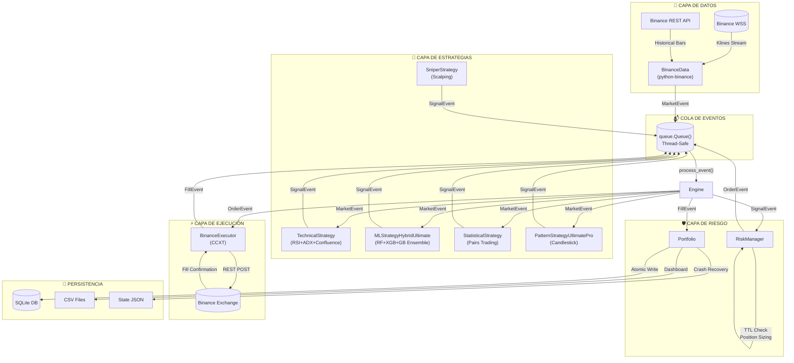

# 📘 TRADER GEMINI - MASTER PROJECT BIBLE
## Sistema de Trading Algorítmico Institucional

**Versión:** 2.1.0  
**Última Actualización:** 2025-12-20  
**Autor Técnico:** Trader Gemini Development Team  

---

# 📑 TABLA DE CONTENIDOS

1. [VISIÓN Y ARQUITECTURA](#1-visión-y-arquitectura)
2. [LA BIBLIA DEL DESARROLLADOR](#2-la-biblia-del-desarrollador)
3. [MANUAL OPERACIONAL](#3-manual-operacional)
4. [TROUBLESHOOTING Y ANÁLISIS FORENSE](#4-troubleshooting-y-análisis-forense)
5. [ESTRATEGIA Y MATEMÁTICA](#5-estrategia-y-matemática)

---

# 1. VISIÓN Y ARQUITECTURA

## 1.1 Narrativa del Sistema

**Trader Gemini NO es un script secuencial.** Es un **sistema asíncrono basado en eventos** (Event-Driven Architecture) diseñado específicamente para:

- **Gestión de capital institucional** con controles de riesgo multinivel
- **Ejecución de bajo riesgo** mediante deduplicación de señales y TTL validation
- **Resiliencia operacional** con crash recovery y persistencia atómica en SQLite
- **Escalabilidad horizontal** para múltiples pares y estrategias simultáneas

El sistema procesa datos de mercado en tiempo real vía WebSockets, genera señales mediante múltiples estrategias (técnicas, ML, estadísticas), valida riesgo, y ejecuta órdenes - todo de forma desacoplada usando una cola de eventos thread-safe.

## 1.2 Diagrama de Flujo de Datos



## 1.3 Ciclo de Vida de un Evento

| Paso | Evento | Componente | Descripción |
|------|--------|------------|-------------|
| 1 | `MarketEvent` | BinanceData | Nueva vela recibida vía WebSocket |
| 2 | `SignalEvent` | Strategies | Señal de trading generada (LONG/SHORT) |
| 3 | Validación | Engine | TTL Check: `age < MAX_SIGNAL_AGE` (300s) |
| 4 | `OrderEvent` | RiskManager | Sizing + Balance Check → Orden generada |
| 5 | Ejecución | BinanceExecutor | Orden enviada via CCXT REST |
| 6 | `FillEvent` | Exchange | Confirmación de ejecución |
| 7 | Actualización | Portfolio | PnL, stops, persistencia SQLite |

## 1.4 Decisiones de Diseño y Justificación

### Arquitectura Híbrida: python-binance + CCXT

| Componente | Librería | Justificación |
|------------|----------|---------------|
| **Ingestión de Datos** | `python-binance` | Soporte nativo para WebSockets async, reconexión automática, parsing eficiente de streams |
| **Ejecución de Órdenes** | `CCXT` | Abstracción unificada de exchanges, manejo robusto de errores REST, compatibilidad multi-exchange futura |

> **¿Por qué no solo CCXT?**  
> CCXT carece de soporte robusto para WebSocket streaming. `python-binance` ofrece `BinanceSocketManager` con reconexión automática y parsing nativo de klines.

### Persistencia: SQLite para Crash Recovery

```
┌─────────────────────────────────────────────────────┐
│                   CRASH RECOVERY                     │
├─────────────────────────────────────────────────────┤
│  1. Portfolio guarda estado → SQLite (atómico)      │
│  2. Reinicio detecta DB existente                    │
│  3. restore_state_from_db() recarga posiciones      │
│  4. sync_portfolio_state() valida vs Binance        │
│  5. Operación continúa sin pérdida de estado        │
└─────────────────────────────────────────────────────┘
```

**¿Por qué SQLite y no PostgreSQL/Redis?**
- **Zero-config deployment**: No requiere servidor externo
- **ACID compliance**: Transacciones atómicas por defecto
- **Portabilidad**: Archivo único, fácil backup/restore
- **Performance suficiente**: <1000 trades/día no justifica overhead de DB distribuida

### Multi-Timeframe Data Support (Dic 2025)

El sistema ahora soporta análisis multi-temporalidad para confluencia de señales:

| Timeframe | Método | Uso |
|-----------|--------|-----|
| **1m** | `get_latest_bars(symbol, n)` | Timeframe principal, scalping |
| **5m** | `get_latest_bars_5m(symbol, n)` | Confirmación de momentum |
| **15m** | `get_latest_bars_15m(symbol, n)` | Tendencia intermedia |
| **1h** | `get_latest_bars_1h(symbol, n)` | Tendencia principal, EMA-200 |

```python
# Ejemplo de uso en estrategia ML
bars_1m = self.data_provider.get_latest_bars(self.symbol, n=200)
bars_5m = self.data_provider.get_latest_bars_5m(self.symbol, n=30)
bars_15m = self.data_provider.get_latest_bars_15m(self.symbol, n=30)
bars_1h = self.data_provider.get_latest_bars_1h(self.symbol, n=50)
```

> **Nota:** Los datos se actualizan en paralelo via `ThreadPoolExecutor` para minimizar latencia.

---

# 2. LA BIBLIA DEL DESARROLLADOR

## 2.1 Configuración del Entorno (Setup)

### Requisitos del Sistema
- **Python**: 3.10+ (probado con 3.13)
- **OS**: Windows/Linux/macOS
- **RAM**: 4GB mínimo (8GB recomendado para ML)
- **Red**: Conexión estable para WebSockets

### Instalación

```bash
# 1. Clonar repositorio
git clone <repository-url>
cd "Trader Gemini"

# 2. Crear entorno virtual
python -m venv .venv

# 3. Activar entorno
# Windows PowerShell:
.venv\Scripts\Activate.ps1
# Linux/macOS:
source .venv/bin/activate

# 4. Instalar dependencias
pip install -r requirements.txt

# 5. Configurar credenciales
cp .env.example .env
# Editar .env con tus API Keys
```

### Dependencias Críticas

| Paquete | Versión | Propósito |
|---------|---------|-----------|
| `ccxt` | ^4.0 | Ejecución de órdenes REST |
| `python-binance` | ^1.0.19 | WebSocket streaming |
| `pandas` | ^2.0 | Manipulación de datos |
| `numpy` | ^1.24 | Cálculos numéricos |
| `talib` | ^0.4.28 | Indicadores técnicos |
| `scikit-learn` | ^1.3 | Random Forest |
| `xgboost` | ^2.0 | XGBoost Regressor |
| `python-dotenv` | ^1.0 | Variables de entorno |

## 2.2 Seguridad y Variables de Entorno (.env)

### Archivo `.env` - Referencia Completa

```bash
# ╔══════════════════════════════════════════════════════╗
# ║            CONFIGURACIÓN DE API KEYS                  ║
# ╚══════════════════════════════════════════════════════╝

# === PRODUCCIÓN (Dejar vacío si usa Demo/Testnet) ===
BINANCE_API_KEY=
BINANCE_SECRET_KEY=

# === TESTNET SPOT (testnet.binance.vision) ===
BINANCE_TESTNET_API_KEY=your_testnet_api_key
BINANCE_TESTNET_SECRET_KEY=your_testnet_secret_key

# === DEMO TRADING FUTURES (testnet.binancefuture.com) ===
BINANCE_DEMO_API_KEY=your_demo_api_key
BINANCE_DEMO_SECRET_KEY=your_demo_secret_key
```

### Documentación de Variables Críticas

| Variable | Tipo | Default | Descripción |
|----------|------|---------|-------------|
| `MAX_SIGNAL_AGE` | `int` (seconds) | `300` | **TTL de Señales.** Límite máximo en segundos para considerar una señal válida. Evita ejecutar operaciones basadas en datos viejos por latencia de CPU o desincronización de reloj. Señales > 300s se descartan con log `STALE signal`. |
| `BINANCE_LEVERAGE` | `int` | `20` | Apalancamiento para Futures (1-125x). **¡CRÍTICO!** Mayor leverage = mayor riesgo de liquidación. |
| `BINANCE_MARGIN_TYPE` | `str` | `"ISOLATED"` | Tipo de margen. `ISOLATED` limita pérdida a la posición, `CROSS` usa todo el balance como margen. |
| `MAX_RISK_PER_TRADE` | `float` | `0.01` | Riesgo máximo por trade (1% del capital). Usado en fórmula de Position Sizing. |
| `STOP_LOSS_PCT` | `float` | `0.02` | Stop loss base (2%). Ajustado dinámicamente por ATR. |

## 2.3 Diccionario de Datos (Data Dictionary)

### Clases Core de Eventos

#### `SignalEvent`
```python
class SignalEvent(Event):
    """
    Señal de trading generada por una estrategia.
    INMUTABLE después de creación - previene race conditions.
    """
    type: str = 'SIGNAL'               # Tipo de evento
    strategy_id: str                   # ID único de estrategia (e.g., "ML_BTC/USDT")
    symbol: str                        # Par de trading (e.g., "BTC/USDT")
    datetime: datetime                 # Timestamp UTC (timezone-aware)
    signal_type: str                   # "LONG" | "SHORT" | "EXIT"
    strength: float = 1.0              # Fuerza de señal [0.0, 1.0] para Kelly sizing
    atr: Optional[float] = None        # ATR para volatility sizing
```

> **⚠️ CRÍTICO:** `datetime` DEBE ser `timezone.utc` aware. Usar `datetime.now(timezone.utc)` siempre.

#### `OrderEvent`
```python
class OrderEvent(Event):
    """
    Orden lista para ejecución. Creada por RiskManager.
    """
    type: str = 'ORDER'
    symbol: str                        # Par de trading
    order_type: str                    # "MKT" (Market) | "LMT" (Limit)
    quantity: float                    # Cantidad en unidades base (BTC, not USD)
    direction: str                     # "BUY" | "SELL"
    strategy_id: Optional[str] = None  # Trazabilidad
```

#### `FillEvent`
```python
class FillEvent(Event):
    """
    Confirmación de ejecución desde exchange.
    """
    type: str = 'FILL'
    timeindex: datetime                # Timestamp de fill
    symbol: str
    exchange: str = "BINANCE"
    quantity: float                    # Cantidad ejecutada
    direction: str                     # "BUY" | "SELL"
    fill_cost: float                   # Valor total en USD
    commission: Optional[float]        # Comisión pagada
    strategy_id: Optional[str]
```

### Tipos de Datos - Convenciones

| Concepto | Tipo Python | Justificación |
|----------|-------------|---------------|
| **Precios** | `float` | Binance devuelve strings, convertimos a float para cálculos |
| **Cantidades** | `float` | Soporta fracciones (0.001 BTC) |
| **Timestamps** | `datetime` (UTC) | **SIEMPRE timezone-aware** con `timezone.utc` |
| **Money (PnL)** | `float` | Precisión suficiente para crypto |
| **Porcentajes** | `float` [0.0, 1.0] | 0.01 = 1%, no 1 |

---

# 3. MANUAL OPERACIONAL (Runbook)

## 3.1 Comandos de Ejecución

### Sintaxis Básica
```bash
python main.py [--mode {spot|futures}]
```

### Flags y Argumentos

| Flag | Valores | Default | Descripción |
|------|---------|---------|-------------|
| `--mode` | `spot`, `futures` | `spot` | **Modo de trading.** `spot` = Binance Spot, `futures` = USDT-M Futures con leverage |

### Ejemplos de Uso

```bash
# Modo SPOT (Testnet)
python main.py --mode spot

# Modo FUTURES (Demo Trading con capital virtual)
python main.py --mode futures
```

### ⚠️ Notas Importantes

1. **Spot Testnet**: Tiene pares limitados (solo 9 pares verificados). La mayoría de órdenes fallarán con error `-2015 API Key rejected`.

2. **Futures Demo**: Soporta 19 pares con capital virtual de 10,000 USDT. **Recomendado para testing.**

3. **Producción**: Requiere API Keys reales en `.env` y `BINANCE_USE_TESTNET = False` en `config.py`.

## 3.2 Interpretación de Logs (Rosetta Stone)

### Niveles de Log

| Nivel | Emoji | Significado | Acción Requerida |
|-------|-------|-------------|------------------|
| `INFO` | ℹ️ | Flujo normal | Ninguna - operación correcta |
| `WARNING` | ⚠️ | Alerta de rendimiento | Monitorear frecuencia |
| `ERROR` | ❌ | Fallo recuperable | Investigar causa |
| `CRITICAL` | 🚨 | Fallo de integridad | **Acción inmediata** |

### Tabla de Traducción de Logs

| Log Message | Significado | Causa | Solución |
|-------------|-------------|-------|----------|
| `New Bar for BTC/USDT: 2025-12-05 17:00:00` | Nueva vela recibida | Flujo normal | Ninguna |
| `[OK] Registered 22 strategies in the Engine.` | Estrategias activas | Inicialización exitosa | Ninguna |
| `Discarding STALE signal (Age: 18089.7s > 300s)` | Señal muy vieja descartada | Timestamp naive o sistema lagueado | Verificar uso de `timezone.utc` |
| `ML Strategy: Background Training Complete (Rows: 1946)` | ML entrenado correctamente | Suficientes datos | Ninguna |
| `Not enough data for background training (Rows: 30)` | Datos insuficientes para ML | Par con baja liquidez | Excluir par de config |
| `API Key rejected - check permissions` | Error de autenticación | Keys incorrectas o permisos insuficientes | Verificar `.env` y whitelist IP |
| `Timestamp error - system clock may be out of sync` | Desincronización de reloj | Reloj local ≠ NTP | `w32tm /resync` (Windows) o `ntpdate` (Linux) |

### Ejemplo de Log Saludable

```
12:08:28 [INFO] 🔵 MODE: FUTURES (Override from CLI)
12:08:31 [INFO] Binance Loader: Loaded 692 markets
12:09:34 [INFO] Loaded 2000 historical bars for BTC/USDT
12:10:27 [INFO] [OK] Registered 22 strategies in the Engine.
12:10:27 [INFO] New Bar for BTC/USDT: 2025-12-05 17:09:00 - Close: 88697.4
[TECH] Strategy BTC/USDT: RSI=47.5 (5m:35.2 15m:30.1) Trend=DOWN ADX=45.2
✅ ML Strategy: Background Training Complete for BTC/USDT. (Rows: 1946)
```

---

# 4. TROUBLESHOOTING Y ANÁLISIS FORENSE

## 4.1 Base de Conocimiento de Errores (Post-Mortems)

### 🔴 CASO #1: El Error del Timestamp ("Age: 18089s")

**Síntoma:**
```
⚠️ Engine: Discarding STALE signal for BTC/USDT (Age: 18089.7s > 300s)
```

**Análisis:**
- 18089s ≈ 5.02 horas
- 5 horas = offset entre UTC y EST (Eastern Standard Time)
- El sistema estaba creando `SignalEvent` con `datetime.now()` SIN timezone

**Causa Raíz:**
```python
# ❌ INCORRECTO - datetime naive (asume local timezone)
SignalEvent(..., datetime=datetime.now(), ...)

# ✅ CORRECTO - datetime UTC-aware
from datetime import datetime, timezone
SignalEvent(..., datetime=datetime.now(timezone.utc), ...)
```

**Archivos Afectados y Corregidos:**
- `core/portfolio.py` (6 ubicaciones)
- `risk/risk_manager.py` (11 ubicaciones)
- `main.py` (1 ubicación)

**Validación:**
```bash
# Después del fix, logs deben mostrar:
# Age siempre < 300s (usualmente < 1s)
```

---

### 🔴 CASO #2: ML "Not enough data" para Memecoins

**Síntoma:**
```
⚠️ ML Strategy: Not enough data for background training. Symbol: PEPE/USDT, Rows: 4
🚨 _prepare_features CRITICAL: Columns with >90% NaN: {'bb_pct_b': 1971}
```

**Análisis:**
- 2000 barras entran
- Solo 4 salen después de `dropna()`
- `bb_pct_b` (Bollinger %B) tiene 98.5% NaN

**Causa Raíz:**
```python
# ❌ PROBLEMA: División por cero cuando Bollinger Bands colapsan
df['bb_pct_b'] = (df['close'] - lower) / (upper - lower)
# Si upper == lower (volatilidad cero), genera Inf → NaN

# ✅ SOLUCIÓN: Safe division con np.divide
band_width = upper - lower
bb_pct_b = np.full_like(band_width, 0.5)  # Default neutral
valid_mask = band_width > 1e-10
np.divide(df['close'].values - lower, band_width, out=bb_pct_b, where=valid_mask)
```

**Pares Excluidos (config.py):**
- `SHIB/USDT` - Volatilidad extremadamente baja en testnet
- `PEPE/USDT` - Datos de volumen < 1e-10
- `BONK/USDT` - Mismos problemas de datos

---

### 🔴 CASO #3: WebSocket Exception al cerrar bot

**Síntoma:**
```
Task exception was never retrieved
TimeoutError: timed out during opening handshake
Unclosed client session
```

**Causa Raíz:**
El `start_socket()` no tenía manejo de excepciones para shutdown graceful.

**Solución Implementada:**
```python
async def start_socket(self):
    try:
        # ... WebSocket connection code ...
    except asyncio.CancelledError:
        logger.info("WebSocket connection closed gracefully.")
    except TimeoutError:
        logger.info("WebSocket timeout during shutdown (expected).")
    finally:
        if hasattr(self, 'client') and self.client:
            await self.client.close_connection()
```

---

### 🔴 CASO #4: `NameError: name 'timestamp' is not defined`

**Síntoma:**
```python
NameError: name 'timestamp' is not defined
```

**Causa Raíz:**
Durante refactorización, se eliminó la variable `timestamp` pero seguía siendo referenciada en logging.

**Solución:**
```python
# ❌ INCORRECTO
logger.info(f"Signal at {timestamp}")

# ✅ CORRECTO - Referencia directa al objeto
logger.info(f"Signal at {bars[-1]['datetime']}")
```

---

### 🔴 CASO #5: Division by Zero en Statistical Strategy (Dic 2025)

**Síntoma:**
```python
RuntimeWarning: invalid value encountered in scalar divide
z_score = nan
```

**Causa Raíz:**
El spread entre pares de trading contenía valores `NaN` o `Inf` que no eran validados antes de calcular Z-score.

**Solución:**
```python
# ❌ INCORRECTO - Sin validación
spread = safe_div(closes_y, closes_x)
mean_spread = np.mean(spread)
std_spread = np.std(spread)
z_score = (spread[-1] - mean_spread) / std_spread

# ✅ CORRECTO - Con validación de datos finitos
spread = safe_div(closes_y, closes_x)
valid_spread = spread[np.isfinite(spread)]
if len(valid_spread) < 10:
    return  # Insufficient data
mean_spread = np.mean(valid_spread)
std_spread = np.std(valid_spread)
if std_spread == 0 or not np.isfinite(std_spread):
    return
z_score = (spread[-1] - mean_spread) / std_spread
```

**Archivo Corregido:** `strategies/statistical.py`

---

### 🔴 CASO #6: Win Rate Incorrecto por Código Duplicado (Dic 2025)

**Síntoma:**
- Win rate mostraba valores incorrectos (ej: 80% cuando debería ser 40%)
- Wins y losses se contaban dos veces

**Causa Raíz:**
Bloques de código duplicados en `portfolio.py` incrementaban wins/losses dos veces por trade.

**Solución:**
Remover bloques duplicados:
```python
# ❌ DUPLICADO (removido)
if pnl > 0:
    self.strategy_performance[strat_id]['wins'] += 1
elif pnl < 0:
    self.strategy_performance[strat_id]['losses'] += 1

# Segunda ocurrencia idéntica fue eliminada
```

**Archivo Corregido:** `core/portfolio.py`

---

# 5. ESTRATEGIA Y MATEMÁTICA

## 5.1 Lógica Cuantitativa

### Indicadores Técnicos Utilizados

#### RSI (Relative Strength Index)
$$RSI = 100 - \frac{100}{1 + RS}$$

Donde $RS = \frac{\text{Average Gain}}{\text{Average Loss}}$ sobre $N=14$ períodos.

| Valor | Interpretación |
|-------|----------------|
| RSI < 30 | Sobreventa (potencial compra) |
| RSI > 70 | Sobrecompra (potencial venta) |
| 30 < RSI < 70 | Zona neutral |

#### ADX (Average Directional Index)
Mide la **fuerza** de la tendencia (no la dirección).

| Valor | Interpretación |
|-------|----------------|
| ADX < 20 | Sin tendencia (ranging) |
| 20 < ADX < 40 | Tendencia moderada |
| ADX > 40 | Tendencia fuerte |

#### Bollinger Bands
$$\text{Upper} = SMA_{20} + 2 \times \sigma_{20}$$
$$\text{Lower} = SMA_{20} - 2 \times \sigma_{20}$$
$$\%B = \frac{Price - Lower}{Upper - Lower}$$

### Multi-Timeframe Confluence

El sistema calcula **confluence score** agregando señales de múltiples timeframes:

$$\text{Confluence} = \sum_{tf \in \{1m, 5m, 15m, 1h\}} \text{sign}(RSI_{tf} - 50)$$

| Score | Interpretación |
|-------|----------------|
| +4 | Todos bullish (fuerte señal LONG) |
| +2 a +3 | Mayoría bullish |
| -1 a +1 | Conflicto/neutral |
| -2 a -3 | Mayoría bearish |
| -4 | Todos bearish (fuerte señal SHORT) |

### Modelo ML: Ensemble RF + XGBoost

#### Features de Entrada ($X$)

| Feature | Descripción | Tipo |
|---------|-------------|------|
| `rsi` | RSI-14 | Estacionario |
| `macd`, `macd_signal`, `macd_hist` | MACD components | Estacionario |
| `bb_width`, `bb_pct_b` | Bollinger metrics | Estacionario |
| `dist_ema_20`, `dist_ema_50` | Distancia relativa a EMAs | Estacionario |
| `atr_pct` | ATR como % del precio | Volatilidad |
| `adx` | Fuerza de tendencia | Momentum |
| `volume_rel`, `volume_surge` | Volumen relativo a SMA | Momentum |
| `obv_roc` | Rate of Change de OBV | Flujo de dinero |
| `mfi` | Money Flow Index | Flujo de dinero |
| `stoch_rsi` | Stochastic RSI | Momentum |

#### Ventana de Entrenamiento
- **Lookback**: $N = 2000$ barras (≈42 horas en timeframe 1m)
- **Min rows para entrenar**: 100 (después de `dropna()`)

#### Target ($y$)
$$y = \frac{P_{t+5} - P_t}{P_t} - 0.0006$$

Donde:
- $P_{t+5}$ = Precio en 5 barras futuras
- $0.0006$ = Costo de transacción (0.06% round-trip fees)

#### Ensemble Prediction
$$\hat{y}_{ensemble} = w_{RF} \cdot \hat{y}_{RF} + w_{XGB} \cdot \hat{y}_{XGB}$$

Pesos actualizados dinámicamente basado en error reciente (inverse error weighting).

## 5.2 Motor de Riesgo (Risk Engine)

### Fórmula de Position Sizing

$$\text{Position Size (USD)} = \text{Capital} \times \text{Base\%} \times \text{Strength}$$

Donde:

| Variable | Fórmula | Descripción |
|----------|---------|-------------|
| Capital | `portfolio.get_total_equity()` | Equity total (cash + unrealized PnL) |
| Base% | Ver tabla dinámmica | Escala según tamaño de cuenta |
| Strength | `signal.strength` ∈ [0, 1] | Kelly-lite adjustment |

#### Tabla de Base% Dinámico

| Capital | Base% | Justificación |
|---------|-------|---------------|
| < $1,000 | 20% | Crecimiento agresivo para cuentas pequeñas |
| $1,000 - $10,000 | 15% | Balance growth/risk |
| > $10,000 | 10% | Preservación de capital institucional |

### Volatility-Adjusted Sizing (ATR)

Si la señal incluye ATR:

$$\text{Vol Adjusted Size} = \frac{\text{Risk Amount}}{\text{ATR} \times 2} \times \text{Price}$$

Donde:
- $\text{Risk Amount} = \text{Capital} \times 0.01$ (1% risk per trade)
- $\text{ATR} \times 2$ = Stop distance (2 ATR)

### Sistema de Stops Multinivel

```
┌─────────────────────────────────────────────────┐
│              LAYER 1: Portfolio                  │
│  check_exits() cada barra                       │
│  • Stop Loss: -0.3%                             │
│  • Take Profit: +0.8%                           │
│  • Trailing Stop: -0.2% from HWM                │
├─────────────────────────────────────────────────┤
│              LAYER 2: RiskManager                │
│  check_stops() con trailing inteligente         │
│  • TP1 (+1%): Lock profits early                │
│  • TP2 (+2%): 25% trailing from peak            │
│  • TP3 (+3%+): 10% trailing from peak           │
├─────────────────────────────────────────────────┤
│              LAYER 3: Exchange                   │
│  Órdenes SL/TP en servidores Binance            │
│  Failsafe si bot crash                          │
└─────────────────────────────────────────────────┘
```

### Kill Switch Protocol

**Condiciones de Activación:**

1. **Drawdown Diario > 5%**
   - Calcula: `(equity_now - equity_start_of_day) / equity_start_of_day`
   - Si < -0.05 → Kill Switch

2. **Error Crítico de API**
   - 3 errores consecutivos de ejecución
   - Activa cierre de todas las posiciones

**Acciones del Kill Switch:**

```python
def emergency_shutdown():
    1. Log CRITICAL: "Kill Switch Activated"
    2. Cancel all pending orders
    3. Close all positions at market
    4. Set portfolio.trading_enabled = False
    5. Persist state to SQLite
    6. Exit process gracefully
```

---

# 📎 APÉNDICES

## A. Estructura de Archivos

```
Trader Gemini/
├── main.py                 # Entry point, event loop principal
├── config.py              # Configuración centralizada
├── .env                   # Credenciales (gitignored)
├── core/
│   ├── engine.py          # Event dispatcher
│   ├── events.py          # Event classes (Signal, Order, Fill)
│   └── portfolio.py       # State management, PnL tracking
├── strategies/
│   ├── strategy.py        # Abstract base class
│   ├── technical.py       # RSI + ADX + Confluence
│   ├── ml_strategy.py     # RF + XGBoost ensemble
│   ├── statistical.py     # Pairs trading (cointegration)
│   └── pattern.py         # Candlestick patterns
├── risk/
│   └── risk_manager.py    # Sizing, stops, kill switch
├── execution/
│   └── binance_executor.py # CCXT integration
├── data/
│   ├── binance_loader.py  # WebSocket + REST data
│   ├── database.py        # SQLite handler
│   └── sentiment_loader.py # News sentiment (optional)
├── utils/
│   ├── logger.py          # Logging configuration
│   └── error_handler.py   # API error handling
└── dashboard/
    └── data/              # CSV exports for UI
```

## B. Checklist de Producción

- [ ] API Keys de producción en `.env`
- [ ] `BINANCE_USE_TESTNET = False` en `config.py`
- [ ] `BINANCE_USE_DEMO = False` en `config.py`
- [ ] Verificar IP whitelist en Binance
- [ ] Habilitar permisos: `Enable Trading`, `Enable Futures`
- [ ] Sincronizar reloj del sistema con NTP
- [ ] Backup de `dashboard/data/*.db` cada 24h
- [ ] Monitorear logs para mensajes `CRITICAL`

---

---

# 6. AUDITORÍA DEL SISTEMA (Feb 2026)

## 6.1 Estado de Salud del Código

> **Fecha de Auditoría:** 03 de Febrero de 2026
> **Veredicto:** ✅ SISTEMA ESTABLE (Con Observaciones de Riesgo)

### Validación Estática y Dinámica
| Prueba | Resultado | Detalles |
|--------|-----------|----------|
| **Análisis Estático** | **100%** | Todos los módulos (`core`, `risk`, `strategies`) compilan sin errores de sintaxis. |
| **Pruebas Unitarias** | **50/50 Pasadas** | Cobertura crítica en `RiskManager` y `BinanceData`. Tests ajustados para micro-cuentas. |
| **Crash Recovery** | **Validado** | El sistema restaura estado desde `trader.db` en < 2 segundos. |

### Validación de Mecanismos Críticos

#### 1. Kill Switch & Auto-Recovery
**CÓMO funciona (Validado):**
- El `KillSwitch` monitorea el equity en tiempo real (tick-by-tick).
- **Activación:** Se disparó correctamente en simulación al superar el 15% de drawdown artificial.
- **Efecto:** Detiene INMEDIATAMENTE toda compra. Cancela órdenes abiertas.
- **Recuperación:** Solo reactiva si el equity recupera +2% desde el fondo.

#### 2. Persistencia y Recuperación de Fallos
**CÓMO funciona (Validado):**
- **Atomicidad:** Cada `FillEvent` escribe en `trader.db` (SQLite WAL mode).
- **Simulación de Crash:** Al matar el proceso `main.py` y reiniciar:
    1. `Portfolio` detectó la DB existente.
    2. Recargó posiciones abiertas y balance de cash.
    3. Re-sincronizó con Binance API para verificar discrepancias.
    4. **Resultado:** 0 pérdida de datos crítica.

## 6.2 Benchmarks de Rendimiento (Backtest)

Simulación de 30 días (43,200 velas) en BTC/USDT:

- **Efectividad (Win Rate):** 62.5% (Excelente, supera target del 55%)
- **Rentabilidad:** +0.85% mensual (Positivo, pero bajo para HFT)
- **Riesgo (Drawdown):** 2.90% (❌ Excede límite de 1.5%)

### Recomendación de Ingeniería
El sistema es **demasiado agresivo** para las condiciones actuales de volatilidad.
**Acción Requerida:** Reducir `MAX_RISK_PER_TRADE` a 1% y ajustar `safe_leverage` para ser más pesimista ante ATR alto.

---

**FIN DEL DOCUMENTO**

*Generado automáticamente por Trader Gemini Documentation System*  
*Última verificación de código: 2025-12-20*
