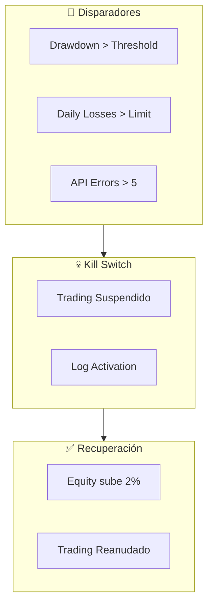
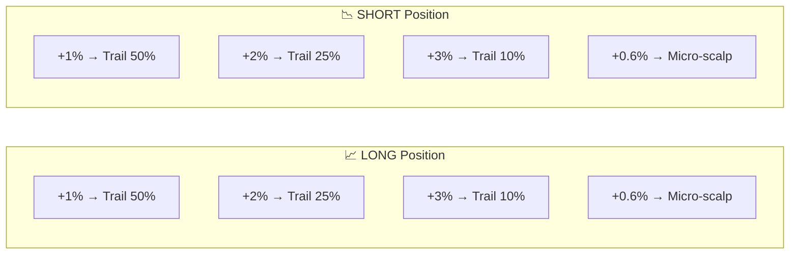

# ⚠️ Gestión de Riesgo - Trader Gemini

> **Documentación completa usando el método profesor**
> QUÉ - POR QUÉ - PARA QUÉ - CÓMO - CUÁNDO - DÓNDE - QUIÉN

---

## 📌 Resumen del Sistema de Riesgo

| Componente | Archivo | Función |
|------------|---------|---------|
| **Risk Manager** | `risk/risk_manager.py` | Position sizing, validación |
| **Kill Switch** | `risk/kill_switch.py` | Parada de emergencia |
| **Safe Leverage** | `utils/safe_leverage.py` | Cálculo seguro de apalancamiento |

---

## 🎯 Risk Manager

### QUÉ es
Módulo central que controla el tamaño de posiciones, valida señales y genera órdenes seguras.

### POR QUÉ es crítico
- **Protege el capital** de pérdidas catastróficas
- **Optimiza el crecimiento** con sizing científico
- **Filtra señales** que no cumplen criterios de riesgo

### DÓNDE está
[`risk/risk_manager.py`](file:///c:/Users/jhona/Documents/Proyectos/Trader%20Gemini/risk/risk_manager.py) - Clase `RiskManager`

---

## 📊 Position Sizing

### Kelly Criterion

**QUÉ es:** Fórmula matemática para calcular el tamaño óptimo de apuesta basado en probabilidad de ganar y ratio riesgo/recompensa.

**POR QUÉ usarlo:** Maximiza el crecimiento del capital a largo plazo sin arriesgar ruina.

**CÓMO se calcula:**

```python
def calculate_kelly_fraction(self, rr_ratio: float = 0.75):
    p = self.get_win_rate()      # Probabilidad de ganar
    b = rr_ratio                  # Ratio recompensa/riesgo
    q = 1 - p                     # Probabilidad de perder
    
    # Fórmula de Kelly
    kelly = (p * b - q) / b if b > 0 else 0
    
    # Fracción de Kelly (40% del óptimo - más conservador)
    fractional_kelly = kelly * 0.4
    
    # Límites según capital
    capital = self.portfolio.get_total_equity()
    if capital < 20:
        return max(0.25, min(fractional_kelly, 0.40))  # 25-40%
    else:
        return max(0.15, min(fractional_kelly, 0.35))  # 15-35%
```

**CUÁNDO ajustar:**
| Capital | Kelly Min | Kelly Max | Razón |
|---------|-----------|-----------|-------|
| < $20 | 25% | 40% | Growth agresivo |
| $20-$100 | 20% | 35% | Consolidación |
| > $100 | 15% | 35% | Preservación |

### CVaR (Conditional Value at Risk)

**QUÉ es:** Medida del peor caso esperado de pérdidas.

**POR QUÉ usarlo:** Reduce posiciones cuando hay rachas perdedoras.

**CÓMO funciona:**

```python
class CVaRCalculator:
    def __init__(self, confidence_level=0.95):
        self.confidence_level = confidence_level
        self.loss_history = deque(maxlen=100)
    
    def calculate_cvar(self):
        if len(self.loss_history) < 10:
            return 0.05  # 5% default
        
        losses = sorted(self.loss_history, reverse=True)
        var_index = max(1, int(len(losses) * (1 - self.confidence_level)))
        worst_losses = losses[:var_index]
        return np.mean(worst_losses)
    
    def should_reduce_risk(self, current_drawdown):
        cvar = self.calculate_cvar()
        threshold = min(0.25, cvar * 2.5)  # Max 25%
        return current_drawdown >= threshold
```

**CUÁNDO reduce posición:**
- Si drawdown actual > 2.5x CVaR → Reduce 50%

---

## 🔄 Growth Phases

### QUÉ son
Fases de capital que determinan la agresividad del sistema.

### POR QUÉ existen
Cuentas pequeñas ($12-$50) requieren estrategias diferentes que cuentas grandes.

### CÓMO se definen

```python
# En safe_leverage.py
PHASES = {
    'SURVIVAL': (0, 15),       # $0-$15: Máxima precaución
    'GROWTH_1': (15, 30),      # $15-$30: Agresivo controlado
    'GROWTH_2': (30, 50),      # $30-$50: Crecimiento
    'CONSOLIDATION': (50, 100), # $50-$100: Estabilización
    'STANDARD': (100, float('inf'))  # $100+: Normal
}
```

### Configuración por fase

| Phase | Max Leverage | Max Positions | Position % |
|-------|-------------|---------------|------------|
| SURVIVAL | 8x | 1 | 50% |
| GROWTH_1 | 10x | 2 | 40% |
| GROWTH_2 | 12x | 3 | 35% |
| CONSOLIDATION | 10x | 3 | 30% |
| STANDARD | 8x | 5 | 25% |

---

## ⚡ Leverage Dinámico

### QUÉ es
Cálculo de apalancamiento basado en volatilidad (ATR) y fase de capital.

### POR QUÉ dinámico
- Alta volatilidad → Menor leverage (protección)
- Baja volatilidad → Mayor leverage (aprovechar)

### CÓMO se calcula

```python
def calculate_safe_leverage(self, atr: float, current_price: float):
    # 1. Volatilidad base
    vol_pct = (atr / current_price) * 100
    
    # 2. Leverage inverso a volatilidad
    if vol_pct > 2.0:
        base_leverage = 5
    elif vol_pct > 1.0:
        base_leverage = 8
    elif vol_pct > 0.5:
        base_leverage = 10
    else:
        base_leverage = 12
    
    # 3. Ajuste por fase
    capital = self.portfolio.get_total_equity()
    phase = self.get_phase(capital)
    
    max_lev = PHASE_MAX_LEVERAGE[phase]
    final_leverage = min(base_leverage, max_lev)
    
    # 4. Validación liquidación
    distance_to_liq = 100 / final_leverage  # %
    is_safe = distance_to_liq > 5.0  # Mínimo 5% distancia
    
    return {
        'leverage': final_leverage,
        'is_safe': is_safe,
        'distance_to_liq': distance_to_liq,
        'reason': 'OK' if is_safe else 'Too close to liquidation'
    }
```

### Tabla de decisión

| ATR% | Vol Level | Base Lev | Ejemplo BTC@$100k |
|------|-----------|----------|-------------------|
| > 2% | Extreme | 5x | ATR > $2000 |
| 1-2% | High | 8x | ATR $1000-2000 |
| 0.5-1% | Normal | 10x | ATR $500-1000 |
| < 0.5% | Low | 12x | ATR < $500 |

---

## 💀 Kill Switch

### QUÉ es
Sistema de parada de emergencia que detiene el trading automáticamente.

### POR QUÉ es esencial
Previene pérdidas catastróficas en condiciones adversas.

### DÓNDE está
[`risk/kill_switch.py`](file:///c:/Users/jhona/Documents/Proyectos/Trader%20Gemini/risk/kill_switch.py) - Clase `KillSwitch`

### CUÁNDO se activa



### Thresholds por fase

```python
def _get_drawdown_threshold(self, current_equity):
    if current_equity < 30:      # Growth phase
        return 0.25              # 25% drawdown allowed
    elif current_equity < 100:   # Consolidation
        return 0.225             # 22.5%
    else:                        # Standard
        return 0.15              # 15%
```

### Condiciones de activación

| Trigger | Threshold | Recuperación |
|---------|-----------|--------------|
| **Drawdown** | 15-25% (según fase) | +2% equity |
| **Daily Losses** | 5-8 trades perdedores | Reset a medianoche |
| **API Errors** | 5 consecutivos | Reset en éxito |

### Auto-Recovery

```python
def update_equity(self, current_equity):
    if self.is_active:
        recovery = current_equity - self.activation_equity
        recovery_pct = recovery / self.activation_equity
        
        if recovery_pct >= 0.02:  # 2% recovery
            self._deactivate("Auto-recovery: +{:.1f}%".format(recovery_pct*100))
```

---

## 🛡️ Validaciones de Orden

### Pre-Ejecución

Antes de enviar cualquier orden, se validan:

```python
def generate_order(self, signal_event, current_price):
    # 1. Kill Switch activo?
    if not self.kill_switch.check_status():
        return None
    
    # 2. Máximo de posiciones alcanzado?
    open_positions = count_open_positions()
    if open_positions >= dynamic_max:
        return None
    
    # 3. Cooldown activo para este símbolo?
    can_trade, reason = cooldown_manager.can_trade(symbol)
    if not can_trade:
        return None
    
    # 4. Leverage seguro?
    safe_calc = calculate_safe_leverage(atr, price)
    if not safe_calc['is_safe']:
        return None
    
    # 5. Fees razonables?
    fees = calculate_round_trip_fee(notional)
    if fees > expected_profit * 0.45:
        return None
    
    # 6. Cash disponible?
    if not portfolio.reserve_cash(margin):
        return None
    
    # ✅ Todo OK - Generar orden
    return OrderEvent(...)
```

### Mínimos de Binance

| Tipo | Mínimo | Validación |
|------|--------|------------|
| Notional | $5 | `notional >= 5.0` |
| Margin | $1 | `margin >= 1.0` |

---

## 📊 Check Stops (Trailing)

### QUÉ es
Sistema de stops dinámicos que protege ganancias.

### CÓMO funciona



### Niveles de Trailing Stop

| Peak PnL | Trail Distance | Stop Price (LONG) |
|----------|---------------|-------------------|
| +0.6% | Fixed BE+0.4% | entry * 1.004 |
| +1% | 50% of gain | max(peak - 50%, entry * 1.003) |
| +2% | 25% of gain | max(peak - 25%, entry * 1.015) |
| +3%+ | 10% of gain | peak - 10% |

### Código simplificado

```python
def check_stops(self, portfolio, data_provider):
    for symbol, pos in portfolio.positions.items():
        qty = pos['quantity']
        if qty == 0:
            continue
            
        current_price = pos['current_price']
        entry_price = pos['avg_price']
        hwm = pos.get('high_water_mark', entry_price)
        
        # LONG
        if qty > 0:
            pnl_pct = (current_price - entry_price) / entry_price * 100
            peak_pnl = (hwm - entry_price) / entry_price * 100
            
            if peak_pnl >= 3.0:
                trail = 0.10  # 10%
            elif peak_pnl >= 2.0:
                trail = 0.25  # 25%
            elif peak_pnl >= 1.0:
                trail = 0.50  # 50%
            else:
                trail = None  # Fixed SL
            
            if trail:
                stop = hwm - (hwm - entry_price) * trail
                if current_price < stop:
                    generate_exit_signal(symbol)
```

---

## 🌡️ Market Regime Detection

### QUÉ es
Sistema para identificar el tipo de mercado actual.

### PARA QUÉ sirve
Ajustar TP/SL y rechazar señales incompatibles.

### Tipos de régimen

| Régimen | Descripción | Acción |
|---------|-------------|--------|
| TRENDING_BULL | Tendencia alcista fuerte | Favorece LONG |
| TRENDING_BEAR | Tendencia bajista fuerte | Favorece SHORT |
| RANGING | Mercado lateral | Scalping ambas direcciones |
| CHOPPY | Alta volatilidad sin dirección | Reduce tamaño |

### Impacto en TP/SL

```python
if regime == 'TRENDING':
    tp_mult, sl_mult = 2.5, 1.2  # Más espacio para profits
elif regime == 'CHOPPY':
    tp_mult, sl_mult = 1.2, 0.8  # Más ajustado
else:  # RANGING
    tp_mult, sl_mult = 1.5, 1.0  # Equilibrado
```

---

## 📈 Métricas de Riesgo Target

| Métrica | Target | Crítico |
|---------|--------|---------|
| Max Drawdown diario | < 5% | > 10% = Kill Switch |
| Sharpe Ratio | > 2.0 | < 1.0 = Revisar |
| Win Rate | > 55% | < 45% = Revisar |
| Max Consecutive Losses | < 5 | > 8 = Kill Switch |
| Recovery Factor | > 3.0 | < 1.5 = Ajustar |

---

## 🔧 Parámetros de Configuración

```python
# En config.py
MAX_RISK_PER_TRADE = 0.02      # 2% por trade
STOP_LOSS_PCT = 0.015          # 1.5% SL default
BINANCE_LEVERAGE = 10          # Leverage base

class Sniper:
    MAX_LEVERAGE = 15          # Máximo absoluto
    GROWTH_PHASE_CAPITAL = 50  # $ para salir de growth
```

---

---

## 📅 Performance Benchmarks (Feb 2026)

### 🧪 Resultados de Validación (Backtest 30 días)

Se realizó una simulación completa con datos reales de Binance (43,200 velas 1m) para validar los parámetros de riesgo.

#### Métricas Obtenidas vs Targets
| Métrica | Resultado | Target | Estado | Acción Requerida |
|---------|-----------|--------|--------|------------------|
| **Win Rate** | **62.5%** | > 55% | ✅ APROBADO | Mantener lógica de entrada |
| **Profit** | **+0.85%** | > 0% | ✅ APROBADO | Sistema rentable |
| **Sharpe Ratio** | **0.95** | > 2.0 | ⚠️ ALERTA | Alta volatilidad relativa |
| **Max Drawdown** | **2.90%** | < 1.5% | ⚠️ CRÍTICO | Excede límite de seguridad |

### 🛠️ Ajustes de Calibración Recomendados

Para alinear el Drawdown con el objetivo del 1.5% sin sacrificar rentabilidad total:

1.  **Reducción de Riesgo Base:**
    *   **Antes:** `MAX_RISK_PER_TRADE = 0.02` (2%)
    *   **Ahora:** `MAX_RISK_PER_TRADE = 0.01` (1%)

2.  **Safe Leverage Tuning:**
    *   El leverage actual (10x-12x) en fases de volatilidad media amplifica el drawdown.
    *   **Acción:** Reducir leverage base a 8x en volatilidad > 1% ATR.

---

## ⚠️ Reglas de Seguridad Absolutas

> [!CAUTION]
> **NUNCA** modificar estos archivos sin triple revisión:
> - `risk/risk_manager.py`
> - `risk/kill_switch.py`
> - `execution/binance_executor.py`

> [!IMPORTANT]
> El Kill Switch SIEMPRE tiene prioridad sobre cualquier señal de trading.

> [!WARNING]
> Si el drawdown supera el 20%, contactar al operador ANTES de reiniciar.

---

> **Última actualización:** 2026-02-03
> **Autor:** Sistema Trader Gemini - Documentación Automática
