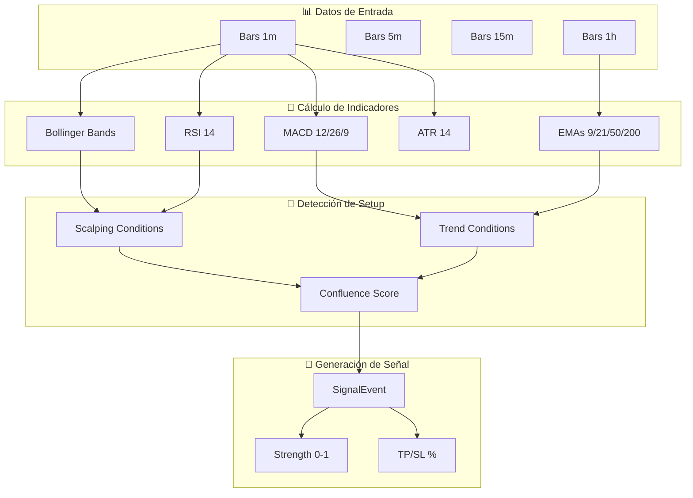
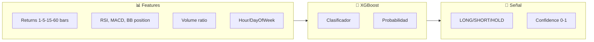

# 🧠 Estrategias de Trading - Trader Gemini

> **Documentación completa usando el método profesor**
> QUÉ - POR QUÉ - PARA QUÉ - CÓMO - CUÁNDO - DÓNDE - QUIÉN

---

## 📌 Resumen de Estrategias

| Estrategia | Archivo | Tipo | Estado |
|------------|---------|------|--------|
| **Hybrid Scalping** | `technical.py` | Principal | ✅ Producción |
| **Statistical** | `statistical.py` | Mean Reversion | ✅ Blindada (Ph 7) |
| **ML Pattern** | `ml_strategy.py` | Ensemble Predictor | ✅ Activa (Ph 8) |
| **Shadow Optimizer**| `shadow_optimizer.py`| Meta-Optimization | ✅ Bounded (Ph 9) |

---

## 🎯 Estrategia Principal: Hybrid Scalping

### QUÉ es
Una estrategia que combina **scalping técnico** con **análisis multi-timeframe** para detectar oportunidades de alta probabilidad en ventanas de 1-5 minutos.

### POR QUÉ este enfoque
- **Scalping puro** es muy ruidoso en crypto
- **Trend following** pierde oportunidades en mercados laterales
- **Híbrido** captura ambos escenarios con filtros de confluencia

### PARA QUÉ sirve
- Generar señales LONG/SHORT/EXIT con alta probabilidad
- Adaptarse al régimen de mercado actual
- Proporcionar niveles óptimos de TP/SL basados en volatilidad

### DÓNDE está implementada
[`strategies/technical.py`](file:///c:/Users/jhona/Documents/Proyectos/Trader%20Gemini/strategies/technical.py) - Clase `HybridScalpingStrategy`

---

## 📊 Indicadores Utilizados

### 1. Bollinger Bands (BB)

**QUÉ:** Bandas que miden la volatilidad del precio respecto a su media.

**POR QUÉ:** Identificar condiciones de sobrecompra/sobreventa y breakouts.

**CÓMO se calcula:**
```python
# Parámetros
period = 20
std_dev = 2.0

# Cálculo
sma = close.rolling(period).mean()
std = close.rolling(period).std()
upper_band = sma + (std * std_dev)
lower_band = sma - (std * std_dev)
```

**CUÁNDO genera señal:**
| Condición | Señal |
|-----------|-------|
| Precio toca banda inferior | Potencial LONG |
| Precio toca banda superior | Potencial SHORT |
| Precio cruza SMA desde abajo | Confirmación alcista |

### 2. RSI (Relative Strength Index)

**QUÉ:** Oscilador que mide la fuerza relativa del movimiento.

**POR QUÉ:** Detectar momentum y condiciones extremas.

**CÓMO se calcula:**
```python
period = 14

delta = close.diff()
gain = delta.where(delta > 0, 0).rolling(period).mean()
loss = (-delta.where(delta < 0, 0)).rolling(period).mean()
rs = gain / loss
rsi = 100 - (100 / (1 + rs))
```

**CUÁNDO genera señal:**
| Valor RSI | Interpretación | Acción |
|-----------|---------------|--------|
| < 30 | Sobreventa | Buscar LONG |
| 30-70 | Neutral | Confirmar con otros |
| > 70 | Sobrecompra | Buscar SHORT |

### 3. MACD (Moving Average Convergence Divergence)

**QUÉ:** Indicador de tendencia y momentum basado en EMAs.

**POR QUÉ:** Detectar cambios de tendencia y confirmar señales.

**CÓMO se calcula:**
```python
fast_period = 12
slow_period = 26
signal_period = 9

ema_fast = close.ewm(span=fast_period).mean()
ema_slow = close.ewm(span=slow_period).mean()
macd_line = ema_fast - ema_slow
signal_line = macd_line.ewm(span=signal_period).mean()
histogram = macd_line - signal_line
```

**CUÁNDO genera señal:**
| Condición | Señal |
|-----------|-------|
| MACD cruza signal hacia arriba | LONG |
| MACD cruza signal hacia abajo | SHORT |
| Histograma creciente | Momentum positivo |

### 4. ATR (Average True Range)

**QUÉ:** Medida de la volatilidad del precio.

**POR QUÉ:** Calcular stop loss y take profit dinámicos.

**CÓMO se calcula:**
```python
period = 14

high_low = high - low
high_close = abs(high - close.shift(1))
low_close = abs(low - close.shift(1))
true_range = pd.concat([high_low, high_close, low_close], axis=1).max(axis=1)
atr = true_range.rolling(period).mean()
```

**PARA QUÉ se usa:**
- **Stop Loss:** `entry_price - (ATR * 2.0)`
- **Take Profit:** `entry_price + (ATR * 1.5)`
- **Position Sizing:** Ajustar tamaño según volatilidad

### 5. EMAs Multi-Timeframe

**QUÉ:** Medias móviles exponenciales en diferentes timeframes.

**POR QUÉ:** Determinar tendencia macro y micro.

**CÓMO se implementa:**
```python
# Timeframe 1m (Scalping)
ema_9 = close.ewm(span=9).mean()
ema_21 = close.ewm(span=21).mean()

# Timeframe 1h (Trend)
ema_50_1h = close_1h.ewm(span=50).mean()
ema_200_1h = close_1h.ewm(span=200).mean()
```

**CUÁNDO usar cada EMA:**
| EMA | Timeframe | Propósito |
|-----|-----------|-----------|
| 9/21 | 1m | Señales de entrada |
| 50 | 1h | Tendencia corto plazo |
| 200 | 1h | Tendencia largo plazo |

---

## 🔄 Flujo de Generación de Señales



---

## 🎯 Lógica de Confluencia

### QUÉ es la Confluencia
Sistema de puntuación que combina múltiples indicadores para determinar la fuerza de una señal.

### POR QUÉ usarla
- Reduce señales falsas
- Aumenta win rate
- Proporciona mejor timing

### CÓMO funciona

```python
def calculate_confluence_score(self, scalping_signal, trend_signal):
    score = 0.0
    
    # 1. Scalping Setup (40% peso)
    if scalping_signal in ['LONG', 'SHORT']:
        score += 0.4
        
    # 2. Trend Alignment (30% peso)
    if trend_signal == scalping_signal:
        score += 0.3
    elif trend_signal == 'NEUTRAL':
        score += 0.15
        
    # 3. RSI Confirmation (15% peso)
    if self.rsi_confirms_signal(scalping_signal):
        score += 0.15
        
    # 4. Volume Spike (15% peso)
    if self.volume_above_average():
        score += 0.15
        
    return score  # 0.0 - 1.0
```

### CUÁNDO se genera señal

| Confluence Score | Acción |
|-----------------|--------|
| < 0.5 | ❌ Ignorar |
| 0.5 - 0.7 | ⚠️ Señal débil (reducir size) |
| 0.7 - 0.85 | ✅ Señal fuerte |
| > 0.85 | 🎯 Señal premium (máximo size) |

---

## 📈 Detección de Scalping Setup

### Condiciones LONG

```python
def detect_scalping_long(self, bars):
    close = bars[-1]['close']
    
    conditions = [
        close <= self.bb_lower * 1.001,        # Toca banda inferior
        self.rsi[-1] < 35,                      # RSI sobreventa
        self.macd_histogram[-1] > self.macd_histogram[-2],  # Momentum creciente
        close > self.ema_9[-1],                 # Precio sobre EMA rápida
    ]
    
    return sum(conditions) >= 3  # Al menos 3 de 4
```

### Condiciones SHORT

```python
def detect_scalping_short(self, bars):
    close = bars[-1]['close']
    
    conditions = [
        close >= self.bb_upper * 0.999,        # Toca banda superior
        self.rsi[-1] > 65,                      # RSI sobrecompra
        self.macd_histogram[-1] < self.macd_histogram[-2],  # Momentum decreciente
        close < self.ema_9[-1],                 # Precio bajo EMA rápida
    ]
    
    return sum(conditions) >= 3
```

---

## 🎛️ Niveles Dinámicos de TP/SL

### QUÉ son
Niveles de Take Profit y Stop Loss calculados dinámicamente según la volatilidad.

### POR QUÉ dinámicos
- ATR bajo = mercado calmado = TP/SL más ajustados
- ATR alto = mercado volátil = TP/SL más amplios

### CÓMO se calculan

```python
def calculate_exit_levels(self, entry_price, atr, direction):
    atr_pct = atr / entry_price
    
    if self.market_regime == 'TRENDING':
        tp_mult, sl_mult = 2.5, 1.2
    elif self.market_regime == 'CHOPPY':
        tp_mult, sl_mult = 1.2, 0.8
    else:  # RANGING
        tp_mult, sl_mult = 1.5, 1.0
    
    tp_pct = max(0.005, atr_pct * tp_mult)  # Mínimo 0.5%
    sl_pct = max(0.003, atr_pct * sl_mult)  # Mínimo 0.3%
    
    return tp_pct, sl_pct
```

### Rangos típicos

| Régimen | TP % | SL % | Ratio R:R |
|---------|------|------|-----------|
| TRENDING | 1.0-2.5% | 0.5-1.0% | 2:1 - 2.5:1 |
| RANGING | 0.5-1.0% | 0.3-0.7% | 1.5:1 |
| CHOPPY | 0.5-0.8% | 0.3-0.5% | 1.5:1 |

---

## 🧪 Estrategia ML (Experimental)

### QUÉ es
Estrategia basada en modelos de Machine Learning (XGBoost) para predecir movimientos.

### DÓNDE está
[`strategies/ml_strategy.py`](file:///c:/Users/jhona/Documents/Proyectos/Trader%20Gemini/strategies/ml_strategy.py)

### CÓMO funciona



### CUÁNDO se activa
- Requiere 300+ bars de historia
- Solo cuando confidence > 0.65
- Desactivada en régimen CHOPPY

---

## ⚙️ Configuración de Estrategias

### Parámetros en `config.py`

```python
class Strategies:
    # Scalping
    SCALPING_TIMEFRAME = '1m'
    SCALPING_BB_PERIOD = 20
    SCALPING_BB_STD = 2.0
    SCALPING_RSI_PERIOD = 14
    
    # Trend
    TREND_EMA_FAST = 50
    TREND_EMA_SLOW = 200
    
    # ML
    ML_LOOKBACK_BARS = 300
    ML_MIN_CONFIDENCE = 0.65
    ML_RETRAIN_INTERVAL = 3600  # 1 hora
```

---

## 🔍 Debugging y Logging

### Trazabilidad de señales

```python
# En technical.py
logger.info(f"📊 {symbol} | RSI: {rsi:.1f} | BB%: {bb_pct:.2f}")
logger.info(f"🎯 Signal: {signal_type} | Strength: {strength:.2f}")
logger.info(f"📐 TP: {tp_pct*100:.2f}% | SL: {sl_pct*100:.2f}%")
```

### Métricas de rendimiento

| Métrica | Target | Verificación |
|---------|--------|--------------|
| Win Rate | > 55% | `portfolio.strategy_performance` |
| Avg R:R | > 1.5:1 | Logs de trades |
| Señales/hora | 2-10 | Depende del mercado |

---

---

## 📊 Estrategia: Statistical (Adaptive Z-Score)

### QUÉ es
Un sistema de reversión a la media (Mean Reversion) que opera el ratio entre pares correlacionados (ej: ETH/BTC) o spreads de volatilidad.

### POR QUÉ Adaptive
El Z-Score estático es peligroso durante Flash Crashes. El **Adaptive Z-Score** sincroniza el umbral de entrada con la volatilidad relativa.

### CÓMO funciona (Phase 7 Shield)
1. **VolRatio:** Calcula $\sigma_{short} / \sigma_{long}$. Si la volatilidad corta explota, el Z de entrada sube automáticamente.
2. **Hurst Filter:** Si el Exponente de Hurst > 0.6 (Tendencia fuerte), la entrada se penaliza o bloquea.
3. **Neural Sync:** Publica su convicción al `NeuralBridge` para que el Sniper no compre en controtendencia.

---

## 🧠 Neural Bridge (Shared Intelligence)

### QUÉ
Un búfer central de "Insights" que permite comunicación cruzada entre todas las estrategias.
**ACTUALIZACIÓN (Audit):** Ahora protegido con `threading.Lock` para permitir votación concurrente segura de Mülltiples modelos (RF, XGB, Statistical) sin corromper el estado de consenso.


## 🧠 NIVEL IV: Inteligencia Superior (Fases 31-36)

### Componentes Clave
1.  **Z-Score Adaptativo (Fase 31):** Ajusta umbrales dinámicamente según la volatilidad de 30 días.
2.  **Neural Bridge (Fase 3):** Bus de comunicación Thread-Safe que sincroniza `Technical`, `ML` y `Statistical`.
3.  **Detección de Régimen (Fase 36):** Clasifica mercado en Tendencia/Rango/Pánico y adapta TP/SL automáticamente.

### PARA QUÉ
Evitar señales contradictorias. Por ejemplo, si el Sniper ve un LONG pero la IA detecta un cambio de tendencia bajista, el Bridge bloquea la orden para salvar los **$13.50**.


---

## 🤖 Shadow Optimizer (Phase 9)

### QUÉ
Motor de auto-mejora basado en simulación dominical.

### Lógica de Rangos Acotados
El bot solo puede sugerir cambios dentro de un "Sandbox Seguro":
- **RSI Buy:** 30 a 35 (Nunca menor a 30).
- **Z-Score:** 1.5 a 2.5 (Nunca menor a 1.5).

### CUÁNDO se usa
Idealmente cada domingo para ajustar parámetros según la volatilidad de la semana anterior.

---

> **Última actualización:** 2026-02-04 (Neural Era)
> **Autor:** Sistema Trader Gemini - Documentación Automática
