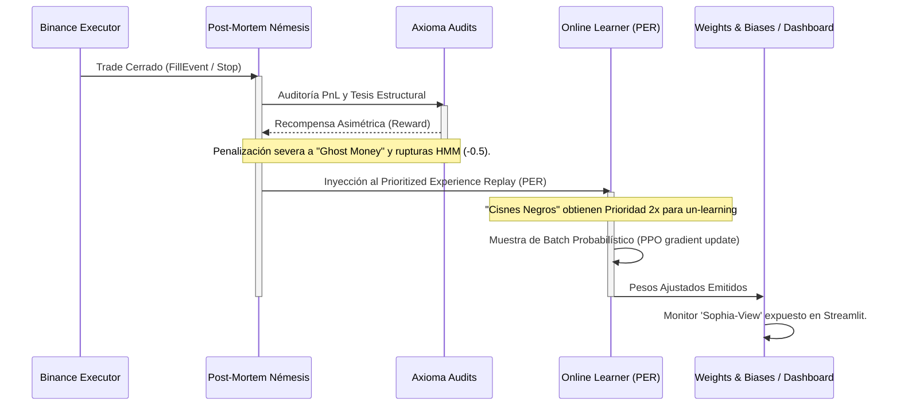

# 🧠 TRADER GEMINI: LA TRINIDAD OMEGA (IA & LÓGICA)

El componente de inteligencia y decisión de Trader Gemini se divide en **Phalanx-Swarm** (Generación de Señales de Consenso), **Sophia-Intelligence** (Metacognición y PPO), y el **Registro Estratégico** (Modelaje Estadístico).

---

## 🛡️ I. MAPE DE LA 'PHALANX-SWARM' (CONSENSO BIZANTINO)

El ecosistema 'Phalanx-Swarm' procesa simultáneamente múltiples modelos (XGBoost, Random Forest, Gradient Boosting) a través de los múltiples procesos asíncronos y 20 monedas Elite de Binance.

```mermaid
graph TD
    subgraph Market Data (20 Elite Assets)
        BTC[BTC/USDT Data]
        ETH[ETH/USDT Data]
        ALT[Altcoins (x18) Data]
    end

    subgraph Ensemble (Por cada Moneda)
        RF(Random Forest<br/>Peso: W1)
        XGB(XGBoost Supremo<br/>Peso: W2)
        GB(Gradient Boosting<br/>Peso: W3)
    end

    subgraph Phalanx Consensus Engine
        Agg[Votación de Pesos Dinámicos]
        Veto[Limitador de Confianza]
        Confluence[Umbral de Confluencia]
    end

    subgraph Risk Manager (Orquestador Global)
        RM(Gestión de Riesgo<br/>Kelly Veto)
    end

    BTC & ETH & ALT -.-> Ensemble
    
    RF --> Agg
    XGB --> Agg
    GB --> Agg

    Agg --> Veto
    Veto --> Confluence

    Confluence -->|Señal: LONG/SHORT/NEUTRAL| RM
    
    classDef data fill:#2e7d32,color:#fff;
    classDef model fill:#1565c0,color:#fff;
    classDef engine fill:#bf360c,color:#fff;

    class BTC,ETH,ALT data;
    class RF,XGB,GB model;
    class Agg,Veto,Confluence engine;
```

**Mecanismo:** La votación no es democrática simple, sino probabilística. El `OnlineLearner` ajusta (W1, W2, W3) en tiempo real según el rendimiento histórico reciente del modelo. Se exige un mínimo de umbral (`Target > 0.65`) de 2/3 de los motores para cruzar el *Limitador de Confianza*.

---

## 👁️ II. FLUJO DE METACOGNICIÓN (SOPHIA-INTELLIGENCE)

Sophia es el sistema the autoregulación que audita los trades cerrados. Utiliza un Aprendizaje por Refuerzo asimétrico.

```mermaid
sequenceDiagram
    participant EX as Binance Executor
    participant PM as Post-Mortem Némesis
    participant GA as Axioma Audits
    participant OL as Online Learner (PER)
    participant WT as Weights & Biases / Dashboard

    EX->>PM: Trade Cerrado (FillEvent / Stop)
    activate PM
    
    PM->>GA: Auditoría PnL y Tesis Estructural
    activate GA
    GA-->>PM: Recompensa Asimétrica (Reward)
    Note over GA, PM: Penalización severa a "Ghost Money" y rupturas HMM (-0.5).
    deactivate GA
    
    PM->>OL: Inyección al Prioritized Experience Replay (PER)
    activate OL
    Note over OL: "Cisnes Negros" obtienen Prioridad 2x para un-learning
    OL->>OL: Muestra de Batch Probabilístico (PPO gradient update)
    OL->>WT: Pesos Ajustados Emitidos
    deactivate OL
    deactivate PM

    WT->>WT: Monitor 'Sophia-View' expuesto en Streamlit.
```

### 3. V5.47.5: Aprendizaje Instantáneo (Real-time SGD)

Implementado en la **Fase 48**, el sistema ha evolucionado de una adaptación genética lenta a una corrección neuronal inmediata.

* **QUÉ**: Retroalimentación por descenso de gradiente estocástico (SGD) tras cada trade.
* **POR QUÉ**: Los regímenes de las Altcoins pueden cambiar en minutos; la evolución genética era demasiado lenta para capturar estos cambios.
* **PARA QUÉ**: Ajustar los pesos internos (`brain_weights`) inmediatamente después del cierre de una posición.
* **CÓMO**: Captura del `state_tensor` (25 dimensiones) en la entrada -> Comparación con PnL final en la salida -> Actualización de matriz de pesos.
* **CUÁNDO**: Se activa en el evento de cierre (`FillEvent`) procesado por el controlador de recompensas.

---

## 📈 III. REGISTRO DE TESIS ESTRATÉGICA (CUANTITATIVA)

El Alpha del sistema (ventaja competitiva frente al azar) reside en la mezcla the métodos the estadística cuántica y probabilística financiera, más allá del Deep Learning.

### 1. Hurst Exponent & Market Regime (Filtro Anti-Riesgo)

* **Fundamento:** Todo mercado oscila entre estado tendedo (`H > 0.5`) y estado de reversión a la media (`H < 0.5`).
* **La Ventaja:** El bot cancela todas las señales The momentum si `H < 0.40`, y bloquea todas las señales The Reversión (Scalp corto) si `H > 0.60`. Aislando falsos positivos.

### 2. Volatilidad Z-Score y GARCH Dinámico (Risk Scaling)

* **Fundamento:** La varianza de los criptoactivos (Heterocedasticidad) no es constante.
* **La Ventaja:** El factor multiplicativo `volatility_multiplier` re-calcula las barreras (TP/SL) basados the previsiones a corto plazo de **GARCH(1,1)** y **Bollinger RANSAC** en lugar de usar desviaciones estándar rígidas (sujetas a *outliers*).

### 3. El Criterio Fractional Kelly (Growth/Ruin Engine)

* **Fundamento:** El modelo puro dictamina la porción óptima de `Capital / EV` a arriesgar (`f* = (p*b - q)/b`). Apostar más causa ruina determinista, apostar menos causa crecimiento sub-óptimo.
* **La Ventaja:** Kelly Fraccional (`f*/10`). Limita severamente la sobre-exposición (cap a máx 5%), y lo que es más importante: invoca una **Prohibición Total the Trading** si el Valor Esperado (EV) de la red neuronal se desploma (Tasa the Acierto * Payoff < Ruina Constante).

---

## 🧿 IV. TELEMETRÍA CAUSAL & EL ORÁCULO SOBERANO (PHASE 47.3)

Implementado en el protocolo **Perpetual Perfection**, el sistema ahora rastrea la **Causalidad** de cada trade en lugar de solo el PnL.

### 1. Descomposición Post-Mortem Standard

Cada trade se audita contra el "Perfect Intent" (qué pensó Sophia que pasaría vs qué pasó).

* **Atribución de Éxito**: `GENETIC_PRECISION` (los parámetros eran correctos), `ALPHA_LUCK` (movimiento aleatorio a favor), `ORACLE_VETO` (se evitó una pérdida).
* **Atribución de Fallo**: `CALIBRATION_DRIFT` (parámetros desactualizados), `BLACK_SWAN` (evento impredecible), `LACK_OF_CONVICTION`.

### 2. El Ciclo de Retroalimentación Soberana

El Oráculo Soberano inyecta **Narrativas** en el log de auditoría masiva, permitiendo auditorías institucionales de "Caja de Cristal" (White Box Auditing).

* **Audit Trail**: Cada trade en backtest y live contiene un `reasoning_id` que vincula el PnL con la narrativa de la IA.
* **Infinitesimal Pulse**: Ajustes de $10^{-7}$ en los genes basados en la atribución causal de la última barra.
