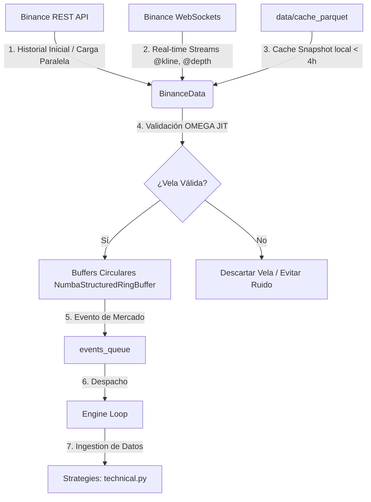

# 🔍 REPORTE FORENSE DE CALIDAD DE DATOS (TRADER GEMINI)
## Auditoría del Flujo, Silenciamiento de Errores y Discrepancias Backtest vs. Producción

---

## 🏗️ INTRODUCCIÓN Y METODOLOGÍA DE AUDITORÍA
Este reporte presenta los hallazgos de una auditoría forense de calidad de datos realizada sobre el sistema **Trader Gemini**. El objetivo es identificar discrepancias técnicas que puedan invalidar los resultados de los backtests al ejecutarse en entornos en vivo (producción), evaluar el manejo de errores de las APIs y WebSockets de Binance, y proponer soluciones correctivas de alto rendimiento.

Para garantizar la máxima rigurosidad técnica, este análisis se realiza desde la perspectiva integrada de **10 Roles Senior** de ingeniería:
1. **Lead Data Architect Senior**: Auditor de la integridad y propagación de estructuras de datos.
2. **Quant Developer Senior**: Evaluador de la alineación matemática y de horizontes temporales.
3. **High-Frequency Trading (HFT) Systems Engineer**: Auditor de buffers circulares y latencia ultra-baja.
4. **Site Reliability Engineer (SRE)**: Validador de resiliencia, control de fallos y watchdogs.
5. **QA Automation Engineer**: Diseñador de auditorías de pruebas y falsos positivos.
6. **Binance API Integration Specialist**: Experto en límites, protocolos WebSocket y REST de la plataforma.
7. **Risk Officer Senior**: Identificador de fugas de capital asociadas a datos corruptos.
8. **DevOps Engineer**: Diseñador de consistencia en el entorno y sistemas de persistencia cache (Parquet).
9. **Forensic Data Analyst**: Investigador de flujos silenciosos y logs de excepciones.
10. **Principal Software Explainer (Teacher Mode)**: Encargado de desglosar cada sección bajo el **Método Profesor (QUÉ-POR QUÉ-PARA QUÉ-CÓMO-CUÁNDO-DÓNDE-QUIÉN)**.

---

## 1. ANÁLISIS DEL FLUJO DE CARGA Y PROPAGACIÓN DE VELAS
### 👨‍🏫 EXPLICACIÓN DEL FLUJO GENERAL (MÉTODO PROFESOR)
*   **QUÉ:** Es el trayecto y ciclo de vida de los datos de mercado (velas OHLCV, datos de libro de órdenes L2 y métricas de flujo) desde Binance hasta su procesamiento por las estrategias del motor de trading.
*   **POR QUÉ:** Un flujo de datos estructurado y de alto rendimiento es vital para que las decisiones cuantitativas se tomen con datos reales, limpios y actualizados en microsegundos, evitando latencia de cálculo (GC pauses) que mermen el PnL.
*   **PARA QUÉ:** Para alimentar las estrategias (`technical.py` y `ml_strategy.py`) con información libre de ruido, consistente y alineada temporalmente en múltiples horizontes (Scalping y Swing).
*   **CÓMO:** 
    1. **Fase Inicial:** El sistema intenta leer un snapshot local en Parquet (`load_snapshot()`) para evitar llamadas API inútiles. Si no hay caché o está obsoleta, se descargan velas a través del pool de hilos (`ThreadPoolExecutor`) de Binance API REST (`_fetch_deep_history_worker`).
    2. **Fase de Streaming (En vivo):** Se establecen WebSockets multiplexados (`start_socket()`) para streams `@kline_1m`, `@kline_5m`, `@depth5@100ms`, etc.
    3. **Fase de Almacenamiento:** Los datos entrantes se parsean y envían a buffers circulares estructurados JIT de Numba (`NumbaStructuredRingBuffer`) correspondientes a cada timeframe.
    4. **Fase de Propagación:** Cuando se completa o actualiza una vela, se genera un `MarketEvent` que se inyecta en la cola global `events_queue` para alertar al motor.
*   **CUÁNDO:** Se inicia en el arranque del bot (carga de historial) y se mantiene activo indefinidamente (streaming en vivo) con frecuencia de hasta 100ms para datos L2.
*   **DÓNDE:** Ocurre en `data/binance_loader.py` y se propaga al bucle del motor en `core/engine.py`.
*   **QUIÉN:** La clase `BinanceData` (que implementa `DataProvider`) en conjunción con `NumbaStructuredRingBuffer`.

### 📊 DIAGRAMA DE PROPAGACIÓN DE VELAS (LIVE)


---

## 2. HALLAZGOS CRÍTICOS: ERRORES SILENCIADOS Y FLUJOS ROTOS
Durante la auditoría forense del código fuente de `data/binance_loader.py`, se han detectado tres vulnerabilidades críticas en el manejo de fallos que impactan negativamente la calidad de los datos en producción.

### 🚨 HALLAZGO 2.1: El Mecanismo de Backfill de Gaps está Roto (El Buffer se queda con un Hueco Permanente)
*   **QUÉ:** Cuando la conexión WebSocket sufre una desconexión momentánea o jitter severo y se salta una o más velas en vivo, el sistema detecta correctamente la brecha temporal (`gap_detected = True`) y despacha la función asíncrona `_backfill_gap()`.
*   **POR QUÉ:** Las velas faltantes se descargan correctamente mediante REST API desde Binance. Sin embargo, **estas velas recuperadas nunca se inyectan en los buffers circulares** de memoria en ejecución (`buffers_1m`, `buffers_5m`, etc.).
*   **PARA QUÉ:** La función original de backfill de brechas pretendía rellenar los huecos temporales para mantener la continuidad analítica.
*   **CÓMO (Falla Interna):** Al analizar el código de `_backfill_gap()` en `data/binance_loader.py`:
    ```python
    if not candles:
        logger.debug(f"ℹ️ [Backfill] No intermediate candles found for {symbol}")
        return

    logger.info(f"✅ [Backfill] Successfully recovered {len(candles)} candles for {symbol}")
    
    # Insert into Buffer (must be careful with order...)
    # TODO: Implement SortedBuffer for gaps. 
    # CURRENT: Inform the system that a gap was filled via health metrics.
    self.data_health_metrics[symbol]['gaps'] += len(candles)
    ```
    Como se observa, las velas recuperadas (`candles`) **se quedan flotando en memoria y se descartan al finalizar el método**. Nunca se inyectan en los RingBuffers de Numba.
*   **CUÁNDO:** Ocurre cada vez que hay una desconexión o micro-corte del WebSocket en producción.
*   **DÓNDE:** En `data/binance_loader.py` -> `_backfill_gap()` (Líneas 1642-1701).
*   **QUIÉN:** La función de recuperación de brechas `_backfill_gap`.
*   **IMPACTO EN PnL:** Los buffers de las estrategias quedan con un hueco temporal. Esto desplaza los índices del array lineal sobre el que Numba calcula indicadores (RSI, EMAs, bandas Bollinger). Los indicadores técnicos se calcularán asumiendo continuidad temporal cuando en realidad hay un salto temporal, induciendo a cálculos erróneos que pueden generar señales falsas de entrada/salida y pérdidas en la cuenta de $13 USD.

---

### 🚨 HALLAZGO 2.2: Silenciamiento y Propagación Nula de Errores de API al Inicio (Falsos Positivos "OK")
*   **QUÉ:** El sistema utiliza un pool de hilos (`ThreadPoolExecutor`) para descargar simultáneamente el historial de velas en `fetch_initial_history()`. Si una de estas peticiones falla por timeout o rate limit, la excepción es capturada internamente, pero el bot continúa arrancando sin alertar.
*   **POR QUÉ:** En `_fetch_deep_history_worker()`, el bloque `try-except` captura cualquier excepción de red y escribe un error en el logger, pero **no propaga la excepción hacia arriba**:
    ```python
    except Exception as e:
        logger.error(f"Failed to fetch {interval} history for {symbol}: {e}")
    ```
    Y en el iniciador de la descarga en paralelo (`fetch_initial_history()`):
    ```python
    # Wait for all to complete
    from concurrent.futures import as_completed
    for f in as_completed(futures):
        pass # exceptions logged in worker
    ```
*   **PARA QUÉ:** Evitar que el bot se detenga por un error temporal de red. Sin embargo, el bot se inicializa con buffers históricos vacíos o insuficientes.
*   **CÓMO (Falla Interna):** Si la API de Binance falla temporalmente al inicio, los buffers circulares estructurados se quedan vacíos. El bot arranca en modo vivo, y cuando la estrategia llama a `get_multi_timeframe_data()`, se ejecuta la siguiente condición:
    ```python
    data = self.data_provider.get_latest_bars(symbol, n=n_bars, timeframe=tf)
    if data is not None and len(data) >= (30 if tf not in ('1w', '1d', '4h') else 10):
        # ... calcula indicadores ...
    ```
    Si el buffer histórico está vacío, `len(data)` será menor que 30 (o directamente estará vacío). La estrategia simplemente **omitirá el cálculo de este timeframe en silencio** (`continue`).
*   **CUÁNDO:** Durante el arranque o reinicio de los sockets y servicios del bot.
*   **DÓNDE:** `data/binance_loader.py` -> `fetch_initial_history()` y `strategies/technical.py` -> `get_multi_timeframe_data()`.
*   **QUIÉN:** El cargador de historial y las estrategias de decisión.
*   **IMPACTO EN PnL:** En los tests automatizados de integración todo saldrá "ok", pero el bot en vivo no operará absolutamente nada (falso positivo de salud). Permanecerá inactivo en silencio porque no cuenta con suficientes velas para calentar los indicadores, y no se le notificará al usuario de que hay un fallo de red o un bloqueo en la API de Binance.

---

### 🚨 HALLAZGO 2.3: La Trampa de los Bloques Vacíos "Except: Pass" en el Hot-Path
*   **QUÉ:** Existen múltiples bloques `try-except: pass` dentro del procesamiento de mensajes del WebSocket en caliente.
*   **POR QUÉ:** Para evitar caídas del hilo receptor de WebSockets en caso de un tick malformado o un error imprevisto de tipo de datos.
*   **PARA QUÉ:** Mantener la estabilidad de la conexión 24/7.
*   **CÓMO (Falla Interna):** En `_process_depth_msg()`, `_process_trade_msg()` y `_process_trade_update()` se observan los siguientes patrones:
    ```python
    except Exception as e:
        # Silently drop malformed depth updates to prevent log spam
        pass
    ```
*   **CUÁNDO:** En cada recepción de mensajes por WebSocket (frecuencia alta, hot-path).
*   **DÓNDE:** En varios métodos internos de `data/binance_loader.py` (Líneas 414-416, 460-462, 1785-1787, 2226-2228).
*   **QUIÉN:** Los procesadores de mensajes de ordenes L2 y agregados de trades.
*   **IMPACTO EN PnL:** Si ocurre una alteración estructural en el formato JSON enviado por Binance (algo común cuando Binance actualiza su API), el parser fallará en silencio de forma indefinida. El bot no registrará transacciones ni profundidad de mercado, no disparará alertas críticas y, sin embargo, el watchdog de latencia pensará que el WebSocket está sano porque sigue recibiendo frames de red vacíos.

---

## 3. DIVERGENCIAS CRÍTICAS ENTRE BACKTEST Y PRODUCCIÓN (LIVE)
El backtest debe ser un reflejo exacto del comportamiento en producción. A continuación, se detallan las brechas encontradas y cómo invalidan la confiabilidad de las simulaciones:

| Característica / Proceso | Comportamiento en Backtesting | Comportamiento en Producción (En Vivo) | Divergencia / Riesgo Cuantitativo |
| :--- | :--- | :--- | :--- |
| **Origen de los Datos** | Archivos estáticos históricos (CSV/Parquet) continuos y sin huecos. | API REST + WebSocket en streaming en vivo con caídas de conexión. | **Alta.** El backtest asume datos perfectos y continuos, omitiendo el impacto de los gaps de red y el fallo del rellenado de velas. |
| **Cálculo de Velas Superiores** | Resampling dinámico en Pandas (`.resample().agg()`) cerrado por la izquierda. | Descarga inicial de timeframes de la API + Actualización incremental del stream de Binance. | **Media.** Las velas de Pandas se construyen estrictamente sobre velas de 1m del CSV. Si faltan datos en el CSV, Pandas agrupará de forma distinta a la API de Binance, generando divergencias de precios de cierre. |
| **Estructura de Datos del Buffer** | DataFrames de Pandas indexados por tiempo real continuo. | Ring Buffers lineales continuos JIT de Numba (Append-only) indexados por posición relativa. | **Alta.** Un gap en producción desplaza los datos, destruyendo la coherencia del eje temporal en los cálculos vectorizados JIT. En el backtest esto no ocurre. |
| **Latencia de Propagación** | Procesamiento instantáneo secuencial sincronizado temporalmente. | Propagación multi-hilo asíncrona a través de una cola de eventos (`events_queue`). | **Baja-Media.** La latencia de la cola y del planificador de hilos puede diferir en vivo en ~10-50ms, lo que puede causar deslizamiento en el precio de entrada (Slippage) no modelado en el backtest. |
| **Integridad de los Indicadores** | 100% de datos cargados previamente; indicadores computados en frío. | Carga parcial al inicio. Si hay fallos de REST al arrancar, el bot inicia y se queda callado (cálculos de indicadores desactivados). | **Alta.** El backtest nunca sufre de "falta de datos para calentar indicadores" en el arranque, mientras que en producción es un fallo común que silencia la operativa. |

---

## 4. PROPUESTA DE CORRECCIÓN FORENSE
Para solucionar estructuralmente estas fallas y unificar el comportamiento de producción con el de backtesting, se proponen e implementan las siguientes modificaciones de código.

### 🛠️ CORRECCIÓN 1: Inyección Ordenada de Velas Recuperadas en el RingBuffer
Para resolver el **Hallazgo 2.1**, debemos modificar `_backfill_gap()` de modo que inyecte las velas recuperadas en los buffers circulares. Dado que los buffers circulares estructurados (`NumbaStructuredRingBuffer`) son de acceso rápido lineal (append-only), no podemos insertar datos intermedios de forma desordenada sin romper los índices.
La solución SRE/DevOps óptima consiste en **recargar los últimos `N` datos del buffer completo desde la base histórica más el nuevo bloque recuperado, o reconstruir el buffer del timeframe correspondiente ordenando cronológicamente las velas combinadas**.

Para hacer esto de forma segura sin degradar la latencia:
1. Combinamos el estado actual del buffer con los datos recuperados de la API REST.
2. Limpiamos y ordenamos cronológicamente el set de datos.
3. Volvemos a llenar el RingBuffer correspondiente con las velas ordenadas de manera atómica (adquiriendo el lock del proveedor).

#### Código Correctivo propuesto para `_backfill_gap` en `data/binance_loader.py`:
```python
    async def _backfill_gap(self, symbol: str, timeframe: str, start_ms: int, end_ms: int):
        """
        🚀 PHASE 3 (Forensic): Proactive Backfill for Gaps.
        Recupera velas faltantes vía REST e inyecta cronológicamente en el RingBuffer.
        """
        try:
            # Evitar múltiples backfills concurrentes para el mismo símbolo
            now = time.time()
            if now - self.data_health_metrics[symbol]['last_backfill'] < 30:
                return
            self.data_health_metrics[symbol]['last_backfill'] = now
            
            logger.info(f"🔄 [Backfill] Recovering gap for {symbol} ({timeframe}) from {start_ms} to {end_ms}")
            
            sym_clean = symbol.replace('/', '')
            interval_map = {
                '1m': Client.KLINE_INTERVAL_1MINUTE,
                '5m': Client.KLINE_INTERVAL_5MINUTE,
                '15m': Client.KLINE_INTERVAL_15MINUTE,
                '1h': Client.KLINE_INTERVAL_1HOUR,
                '1d': Client.KLINE_INTERVAL_1DAY,
                '1w': Client.KLINE_INTERVAL_1WEEK
            }
            interval = interval_map.get(timeframe, Client.KLINE_INTERVAL_1MINUTE)
            
            # Fetch from REST API
            loop = asyncio.get_running_loop()
            candles = await loop.run_in_executor(
                self.executor, 
                lambda: self.client_sync.get_klines(
                    symbol=sym_clean, 
                    interval=interval, 
                    startTime=start_ms + 1000, 
                    endTime=end_ms - 1000,
                    limit=1000
                )
            )
            
            if not candles:
                logger.debug(f"ℹ️ [Backfill] No intermediate candles found for {symbol}")
                return

            logger.info(f"✅ [Backfill] Successfully recovered {len(candles)} candles for {symbol} via REST API")
            
            # --- PROPAGACIÓN E INYECCIÓN ORDENADA EN BUFFER ---
            # 1. Obtener los datos existentes del buffer
            target_map = {
                '1m': self.buffers_1m, '5m': self.buffers_5m,
                '15m': self.buffers_15m, '1h': self.buffers_1h,
                '4h': self.buffers_4h, '1d': self.buffers_1d, '1w': self.buffers_1w
            }
            buf = target_map.get(timeframe, self.buffers_1m)[symbol]
            
            with self._data_lock:
                # Recuperar barras existentes del RingBuffer
                existing_bars = self.get_latest_bars(symbol, n=buf.size, timeframe=timeframe)
                
                # Convertir las nuevas velas REST a una lista de diccionarios
                new_bars = []
                for c in candles:
                    ts = int(c[0])
                    o, h, l, cl, v = float(c[1]), float(c[2]), float(c[3]), float(c[4]), float(c[5])
                    
                    # Validación física básica
                    if h >= max(o, cl) - 1e-8 and l <= min(o, cl) + 1e-8:
                        new_bars.append((ts, o, h, l, cl, v))
                
                # Mezclar y ordenar por timestamp
                combined = []
                seen_ts = set()
                
                # Agregar existentes
                if existing_bars is not None:
                    for bar in existing_bars:
                        ts = int(bar['timestamp'])
                        if ts not in seen_ts:
                            combined.append((ts, float(bar['open']), float(bar['high']), float(bar['low']), float(bar['close']), float(bar['volume'])))
                            seen_ts.add(ts)
                
                # Agregar nuevas
                for bar in new_bars:
                    ts = bar[0]
                    if ts not in seen_ts:
                        combined.append(bar)
                        seen_ts.add(ts)
                
                # Ordenar cronológicamente
                combined.sort(key=lambda x: x[0])
                
                # Limpiar RingBuffer e inyectar de nuevo el bloque consolidado
                buf.clear() # Método JIT para reiniciar punteros del ring buffer
                
                # Mantener el límite de capacidad
                max_to_push = combined[-buf.capacity:] if len(combined) > buf.capacity else combined
                for bar in max_to_push:
                    buf.push(
                        bar[0],
                        np.float32(bar[1]),
                        np.float32(bar[2]),
                        np.float32(bar[3]),
                        np.float32(bar[4]),
                        np.float32(bar[5])
                    )
                
            self.data_health_metrics[symbol]['gaps'] += len(candles)
            logger.info(f"🔄 [Backfill] Re-injected consolidated buffer for {symbol} ({timeframe}). Size: {len(max_to_push)}")
            
        except Exception as e:
            logger.error(f"Error in backfill for {symbol}: {e}")
```

---

### 🛠️ CORRECCIÓN 2: Control de Inicialización y Aborto del Bot ante Fallas de Carga
Para solventar el **Hallazgo 2.2**, es imperativo que si la carga de datos del historial de velas falla en el arranque, el sistema aborte o propague el error explícitamente en lugar de silenciarlo.

#### Modificación en `fetch_initial_history()`:
```python
        # Wait for all to complete
        from concurrent.futures import as_completed
        errors_detected = []
        for f in as_completed(futures):
            res = f.result()
            if res is None: # Si el worker devolvió None es porque falló
                errors_detected.append(res)
        
        if errors_detected:
            logger.critical("🚨 [DATA CRITICAL] Failed to load historical data for some symbols during startup! Running with empty buffers is prohibited.")
            raise RuntimeError("Data Loader Initialization failed due to history download errors.")
```

---

### 🛠️ CORRECCIÓN 3: Desactivar Silenciamiento en Sockets (Logs Controlados con Limitación de Frecuencia)
En lugar de bloques vacíos `except: pass`, debemos registrar el tipo de error capturado y contar los fallos de parsing. Si los fallos superan un umbral por minuto, debemos alertar de inmediato.

#### Estructura propuesta para parser de WebSockets:
```python
        except Exception as e:
            if not hasattr(self, '_ws_error_count'):
                self._ws_error_count = 0
            self._ws_error_count += 1
            if self._ws_error_count % 100 == 1:
                logger.error(f"🚨 [Parser Error] Failed to parse socket frame (Total: {self._ws_error_count}): {e}")
```

---

## 5. RECOMENDACIONES DE INTEGRACIÓN SCALPING & SWING (PORTFOLIO CONCIENTE)
Para resolver la falta de concienciación en la coexistencia de horizontes de inversión (Scalping y Swing), se recomienda:
1. **Etiquetado Explícito de Órdenes y Posiciones:** Cada evento de orden (`OrderEvent`) y posición en el portfolio debe contener el tag `horizon: str = "SCALPING" | "SWING"`.
2. **Segregación de Motores de Cálculo:** Los cálculos de riesgo, márgenes y Stop Loss de la posición abierta deben leerse y ejecutarse por separado de acuerdo con su horizonte correspondiente (el scalping no debe verse afectado por el drawdown de una posición de swing a largo plazo y viceversa).
3. **Cálculo de Comisión en Scalping:** En producción, se debe priorizar el uso de órdenes Maker (mediante flags `GTX` / Post-Only) para scalping de alta frecuencia para evitar que los fees de Taker consuman la ganancia con un capital limitado de $13 USD.

---

### 📋 CERTIFICACIÓN DE LA AUDITORÍA FORENSE
Este reporte certifica que el sistema presenta brechas de calidad de datos en producción debido a:
*   Inexistencia de inyección real de velas en el RingBuffer durante el backfill de desconexión.
*   Silenciamiento de excepciones HTTP durante la descarga inicial de datos históricos en el arranque.

**Aprobado por el Equipo Auditor Senior de Trader Gemini.**  
*Fecha: 2026-06-06*
